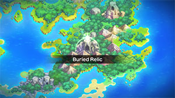
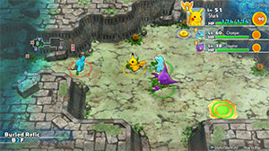

  

[Introduction]

# Overview

<table class="dungeonOverview">
  <tr>
    <th>Unlock</th>
    <td class="highlightYellow">Clear Stormy Sea → 1 day later (Talk to Shiftry).</td>
  </tr>
</table>

<table class="dungeonTable">
  <tr>
    <th>Floors</th>
    <td>B99F</td>
    <th>Job Rank</th>
    <td>B</td>
  </tr>
  <tr>
    <th>Radar / Scanning</th>
    <td>No</td>
    <th>Weather</th>
    <td>Clear</td>
  </tr>
  <tr>
    <th>Dark Halls</th>
    <td>2 Tiles</td>
    <th>Boss</th>
    <td>Regirock, Regice, Registeel</td>
  </tr>
  <tr>
    <th>Max Team Size</th>
    <td>3</td>
    <th>Strong Foe</th>
    <td>Ditto</td>
  </tr>
  <tr>
    <th>Bring Items</th>
    <td>Yes</td>
    <th>Shops</th>
    <td>Yes</td>
  </tr>
  <tr>
    <th>Bring Poke</th>
    <td>Yes</td>
    <th>Monster Houses</th>
    <td>Yes</td>
  </tr>
  <tr>
    <th>Level Reset</th>
    <td>No</td>
    <th>Mystery Houses</th>
    <td>Yes</td>
  </tr>
  <tr>
    <th>Clear Icon</th>
    <td>None</td>
    <th>Reward</th>
    <td>Deluxe Box x 4, Friend Bow x 1, Evolution Crystal x 8</td>
  </tr>
</table>

# Needed Camps

#### Wild

|Name|Price|Pokemon|
|-|-|-|
|Wild Plains|-|Rattata, Raticate, Arbok, Drowzee, Hypno|
|Power Plant|-|Elekid|
|Darkness Ridge|-|Gastly, Haunter, Sneasel|
|Flyaway Forest|500|Hoothoot, Noctowl|
|Safari|600|Rhyhorn|
|Thunder Crag|600|Ampharos|
|Mt. Cleft|700|Pupitar, Aron|
|Mt. Green|700|Geodude, Graveler, Golem|
|Mt. Discipline|700|Machop, Machoke, Machamp, Tyrogue, Hitmonlee, Hitmonchan, Hitmontop, Makuhita, Meditite, Medicham|
|Scorched Plains|700|Growlithe|
|Overgrown Forest|700|Heracross|
|Ancient Relic|700|Aerodactyl, Regirock, Regice, Registeel|
|Mushroom Forest|800|Shiftry|
|Withering Desert|900|Sandshrew|
|Secretive Forest|900|Shedinja|
|Echo Cave|2700|Zubat, Golbat, Wynaut, Wobbuffet, Whismur, Mawile|
|Decrepit Lab|6000|Abra, Kadabra, Mr. Mime, Ditto, Porygon, Porygon2|
|Poison Swamp|7000|Gulpin|
|Final Island|9000|Mew|

#### Fainted

|Name|Price|Pokemon|
|-|-|-|
|Stump Forest|-|Caterpie|
|Sky-Blue Plains|-|Happiny|
|Darkness Ridge|-|Banette|
|Flyaway Forest|500|Swablu, Honchkrow|
|Jungle|500|Bellsprout, Weepinbell, Vileplume|
|Thunder Crag|600|Sentret, Chingling, Chimecho|
|Mt. Green|700|Cubone|
|Mt. Cleft|700|Charmander|
|Mt. Discipline|700|Machop|
|Overgrown Forest|700|Treecko|
|Scorched Plains|700|Cyndaquil, Torchic|
|Vibrant Forest|800|Pichu, Meowth, Skitty|
|Secretive Forest|900|Venomoth, Ninjask|
|Mystic Lake|2500|Dratini|
|Echo Cave|2700|Exploud|
|Beau Plains|2700|Bulbasaur, Chikorita|
|Rub-a-Dub River|3000|Totodile, Volbeat, Illumise|
|Crater|5000|Magby, Magmortar|
|Turtleshell Pond|6000|Squirtle, Psyduck, Azurill, Corphish|
|Poison Swamp|7000|Muk, Swalot|
|Gourd Swamp|9000|Mudkip|
|Evolution Forest|9000|Eevee|
|Waterfall Lake|9000|Feebas|

#### Mystery House

|Name|Price|Pokemon|
|-|-|-|
|Sky-Blue Plains|-|Wigglytuff, Granbull|
|Power Plant|-|Magnezone, Electivire|
|Darkness Ridge|-|Ninetales, Sneasel, Weavile|
|Safari|600|Miltank|
|Thunder Crag|600|Plusle, Minun|
|Scorched Plains|700|Arcanine|
|Overgrown Forest|700|Bonsly, Sudowoodo|
|Mt. Discipline|700|Hariyama, Riolu, Lucario|
|Frigid Cavern|800|Delibird, Glalie|
|Crater|5000|Magmortar, Camerupt|
|Turtleshell Pond|6000|Azumarill|
|Decrepit Lab|6000|Mime Jr., Mr. Mime|
|Mt. Moonview|7000|Clefable|
|Bountiful Sea|9000|Cloyster|

# Pokemon

Rate = Recruit rate. Red stats = Stats as an enemy. Ability colors: Caution, Dangerous Move colors: Boosting, Destroys Items, Caution, Dangerous

#### Wild

|Floor|Image|Name|Rate|Lv|HP|Atk|Def|SpA|SpD|Spe|Exp|Ability + Moves|
|-|-|-|-|-|-|-|-|-|-|-|-|-|
|1-3||Whismur |8.2%|35|69 97|55 52|42 45|49 51|42 44|57 57|75|Soundproof Pound / Echoed Voice / Howl / Uproar / Stomp / Screech / Supersonic / Roar / Astonish / Rest|
|1-3||Wynaut |8.2%|35|93 110|42 48|47 45|42 53|42 45|49 49|76|Shadow Tag Splash / Charm / Encore / Safeguard / Mirror Coat / Counter / Destiny Bond|
|4-6||Rattata |14.4%|35|63 98|53 61|47 43|42 45|47 43|58 58|77|Run Away or Guts Tackle / Tail Whip / Quick Attack / Bite / Focus Energy / Super Fang / Assurance / Hyper Fang / Sucker Punch / Endeavor / Double-Edge / Pursuit / Crunch|
|4-8||Machop |8.2%|35|71 100|68 65|49 47|45 55|49 44|54 54|78|Guts or No Guard Low Kick / Leer / Revenge / Vital Throw / Karate Chop / Low Sweep / Knock Off / Dual Chop / Seismic Toss / Submission / Wake-Up Slap / Focus Energy / Foresight|
|4-10||Geodude  |14.4%|35|64 95|65 64|62 46|43 56|42 41|49 49|79|Rock Head or Sturdy Tackle / Bulldoze / Mud Sport / Rollout / Rock Polish / Magnitude / Defense Curl / Smack Down / Rock Blast / Earthquake / Self-Destruct / Stealth Rock / Rock Throw|
|5-9||Elekid |14.4%|35|68 96|56 60|47 44|63 61|52 44|61 61|75|Static Quick Attack / Swift / Thunder Shock / Low Kick / Thunder Wave / Discharge / Leer / Thunder Punch / Electro Ball / Light Screen / Shock Wave|
|5-10||Porygon |8.2%|35|68 104|53 57|52 45|66 60|52 46|52 52|74|Trace or Download Conversion 2 / Tackle / Conversion / Sharpen / Recover / Agility / Psybeam / Recycle / Magnet Rise / Signal Beam|
|6-37 40-98 Foe|  |Ditto |-6.4%|60|83 455|64 150|50 65|55 150|50 65|107 200|740|Limber Transform ※ Friend Bow required to recruit.|
|7-11||Hoothoot  |14.4%|35|78 106|48 60|42 43|53 55|52 43|55 55|76|Insomnia or Keen Eye Tackle / Growl / Foresight / Hypnosis / Peck / Air Slash / Psycho Shift / Uproar / Reflect / Zen Headbutt / Echoed Voice / Extrasensory / Take Down / Confusion|
|7-12||Meditite  |14.4%|35|68 99|48 61|47 45|48 57|47 42|55 55|77|Pure Power Bide / Confusion / Detect / Calm Mind / Meditate / Endure / Feint / Force Palm / Acupressure / Mind Reader / Psych Up / High Jump Kick / Hidden Power|
|10 20 30||Abra |8.2%|35|63 100|43 43|42 40|70 65|47 41|61 61|80|Synchronize or Inner Focus Teleport ※ Always drops a Max Ether.|
|11-16||Gastly  |8.2%|35|64 101|48 45|42 45|69 66|42 44|58 58|81|Levitate Curse / Lick / Payback / Mean Look / Hypnosis / Night Shade / Confuse Ray / Sucker Punch / Spite / Shadow Ball / Dream Eater|
|11-16||Drowzee |8.2%|35|68 108|53 60|47 44|53 58|62 45|55 55|82|Insomnia or Forewarn Pound / Hypnosis / Disable / Psybeam / Headbutt / Wake-Up Slap / Confusion / Meditate / Psych Up / Poison Gas|
|11-17||Tyrogue |14.4%|35|63 110|69 57|42 42|42 59|62 43|58 58|83|Guts or Steadfast Fake Out / Helping Hand / Foresight / Tackle|
|13-39||Mr. Mime  |8.2%|35|63 103|42 60|47 42|63 80|62 47|63 63|80|Soundproof or Filter Substitute / Magical Leaf / Confusion / Quick Guard / Wide Guard / Psywave / Power Swap / Guard Swap / Meditate / Barrier / Copycat / Mimic / Psybeam / Double Slap / Pound / Encore / Reflect / Light Screen / Recycle / Misty Terrain|
|16-19||Medicham  |14.4%|37|70 112|49 60|48 44|49 55|47 45|57 57|84|Pure Power Bide / Confusion / Detect / Calm Mind / Meditate / Endure / Feint / Force Palm / Acupressure / Mind Reader / Psych Up / Hidden Power / Fire Punch / Ice Punch / Thunder Punch / High Jump Kick / Zen Headbutt / Power Trick ※ Can Mega Evolve.|
|17-22||Aron  |14.4%|35|68 115|65 62|67 47|43 54|42 42|49 49|85|Sturdy or Rock Head Tackle / Harden / Mud-Slap / Headbutt / Metal Claw / Rock Tomb / Take Down / Iron Head / Rock Slide / Protect / Roar / Metal Sound / Iron Tail|
|22-29||Hypno |8.2%|35|68 125|53 64|47 43|53 60|62 47|55 55|86|Insomnia or Forewarn Pound / Hypnosis / Disable / Psybeam / Headbutt / Wake-Up Slap / Confusion / Psych Up / Switcheroo / Poison Gas / Future Sight / Nasty Plot / Nightmare / Meditate|
|26-34||Gulpin |8.2%|35|78 96|53 58|52 42|53 55|47 40|52 52|70|Liquid Ooze or Sticky Hold Pound / Swallow / Poison Gas / Sludge / Amnesia / Acid Spray / Encore / Spit Up / Stockpile / Toxic / Yawn / Sludge Bomb|
|26-39 Rare||Shedinja  |-25.0%|35|35 15|69 57|38 50|44 60|42 35|70 70|250|Wonder Guard Mind Reader / Harden / Absorb / Spite / Shadow Sneak / Scratch / Confuse Ray / Sand Attack / Fury Swipes / Shadow Ball ※ Doesn't use moves on its own.|
|30-34||Noctowl  |10.8%|35|78 115|48 54|42 44|53 62|52 47|55 55|75|Insomnia or Keen Eye Tackle / Growl / Foresight / Hypnosis / Psycho Shift / Dream Eater / Air Slash / Reflect / Zen Headbutt / Echoed Voice / Extrasensory / Take Down / Confusion / Peck / Sky Attack|
|30-37||Sneasel  |8.2%|35|68 100|69 63|47 46|42 52|52 46|64 64|80|Inner Focus or Keen Eye Scratch / Leer / Beat Up / Quick Attack / Feint Attack / Icy Wind / Fury Swipes / Agility / Metal Claw / Screech / Slash / Taunt / Hone Claws ※ Weavile statue required to spawn.|
|31-36||Haunter  |8.2%|35|64 96|48 48|42 45|69 69|42 40|58 58|86|Levitate Curse / Lick / Payback / Mean Look / Hypnosis / Night Shade / Confuse Ray / Sucker Punch / Spite / Shadow Punch / Shadow Ball|
|32-37||Ampharos |14.4%|35|69 120|49 54|47 44|56 61|47 45|52 52|87|Static Thunder Punch / Zap Cannon / Charge / Electro Ball / Dragon Pulse / Fire Punch / Take Down / Cotton Spore / Ion Deluge / Growl / Confuse Ray / Thunder Shock / Tackle / Thunder Wave / Power Gem / Magnetic Flux ※ Can Mega Evolve.|
|38-45||Hitmonlee |8.2%|35|63 110|69 66|42 42|42 40|62 46|58 58|88|Limber or Reckless Double Kick / Reversal / Close Combat / Mega Kick / Revenge / Meditate / Feint / Rolling Kick / Jump Kick / Brick Break / Focus Energy / High Jump Kick / Mind Reader|
|40-47||Wobbuffet |8.2%|35|93 150|42 58|47 42|42 58|42 41|49 49|75|Shadow Tag Mirror Coat / Counter / Destiny Bond / Safeguard|
|40 50 60 70 80 90 98||Mew |8.2%|35|78 160|63 63|52 57|63 73|52 57|58 58|100|Synchronize Metronome / Reflect Type / Transform / Mega Punch / Pound / Psychic ※ Can also spawn after floor start.|
|41-47||Growlithe |10.8%|35|78 110|69 66|52 41|63 64|47 38|58 58|84|Intimidate or Flash Fire Bite / Roar / Ember / Leer / Odor Sleuth / Helping Hand / Flame Wheel / Reversal / Fire Fang / Take Down / Flame Burst / Agility / Retaliate / Flamethrower|
|40-49||Machoke |8.2%|35|71 113|68 61|49 41|45 60|49 42|54 54|82|Guts or No Guard Low Kick / Leer / Revenge / Vital Throw / Karate Chop / Low Sweep / Knock Off / Dual Chop / Seismic Toss / Foresight / Wake-Up Slap / Focus Energy|
|41-50||Heracross  |10.8%|35|68 112|69 72|47 41|42 55|52 46|63 63|95|Swarm or Guts Arm Thrust / Bullet Seed / Night Slash / Tackle / Counter / Horn Attack / Endure / Leer / Feint / Aerial Ace / Chip Away / Take Down / Fury Attack / Brick Break / Pin Missile ※ Can Mega Evolve.|
|46-50||Zubat  |10.8%|35|68 97|55 60|47 39|48 54|47 39|58 58|80|Inner Focus Absorb / Supersonic / Astonish / Haze / Wing Attack / Confuse Ray / Air Cutter / Swift / Poison Fang / Mean Look / Bite / Leech Life|
|50-55||Shiftry  |8.2%|35|69 112|55 62|42 42|49 61|42 42|52 52|86|Chlorophyll or Early Bird Razor Leaf / Feint Attack / Whirlwind / Nasty Plot / Leaf Tornado / Hurricane|
|50-59||Kadabra |8.2%|35|63 95|43 54|42 77|70 45|47 44|61 61|91|Synchronize or Inner Focus Kinesis / Teleport / Confusion / Disable / Miracle Eye / Telekinesis / Psybeam / Reflect / Recover / Psycho Cut|
|50-51 56-62||Pupitar  |10.8%|35|69 115|57 61|47 43|50 58|47 44|57 57|90|Shed Skin Bite / Thrash / Sandstorm / Screech / Scary Face / Rock Slide / Dark Pulse / Leer / Chip Away|
|50-51 60-67||Hitmontop |8.2%|35|63 107|69 59|42 45|42 64|62 47|58 58|88|Intimidate or Technician Rolling Kick / Endeavor / Detect / Feint / Close Combat / Focus Energy / Counter / Rapid Spin / Revenge / Quick Attack / Pursuit / Triple Kick|
|50-51 60-73||Hitmonchan |8.2%|35|63 109|69 80|42 44|42 58|62 48|58 58|84|Keen Eye or Iron Fist Comet Punch / Close Combat / Counter / Focus Punch / Revenge / Agility / Feint / Mach Punch / Bullet Punch / Pursuit / Quick Guard / Vacuum Wave|
|50-51 63-68||Rhyhorn  |10.8%|35|78 123|75 65|62 47|43 42|42 44|49 49|90|Lightning Rod or Rock Head Horn Attack / Tail Whip / Fury Attack / Scary Face / Smack Down / Chip Away / Stomp / Bulldoze / Rock Blast / Drill Run|
|50-51 70-76||Golbat  |10.8%|35|68 111|55 60|47 40|48 55|47 41|58 58|91|Inner Focus Screech / Astonish / Bite / Supersonic / Wing Attack / Confuse Ray / Air Cutter / Absorb / Swift / Leech Life / Mean Look / Poison Fang|
|50-51 74-79||Graveler  |10.8%|35|64 121|65 70|62 47|43 61|42 43|49 49|92|Rock Head or Sturdy Tackle / Bulldoze / Mud Sport / Rollout / Rock Polish / Magnitude / Defense Curl / Smack Down / Rock Blast / Rock Throw / Self-Destruct / Stealth Rock|
|50-51 74-81||Raticate |10.8%|35|63 110|53 61|47 39|42 59|47 42|58 58|84|Run Away or Guts Tackle / Tail Whip / Quick Attack / Bite / Focus Energy / Super Fang / Assurance / Hyper Fang / Sucker Punch / Crunch / Scary Face / Pursuit / Swords Dance|
|50-51 75-80||Sandshrew |10.8%|35|69 105|63 64|62 50|43 40|42 40|55 55|80|Sand Veil Scratch / Defense Curl / Sand Attack / Poison Sting / Rollout / Rapid Spin / Dig / Fury Cutter / Magnitude / Fury Swipes / Swift / Sand Tomb / Slash / Gyro Ball|
|50-51 80-85||Mawile  |10.8%|35|63 108|53 61|52 43|48 58|42 43|57 57|85|Hyper Cutter or Intimidate Play Rough / Iron Head / Taunt / Growl / Fairy Wind / Sweet Scent / Fake Tears / Bite / Astonish / Vise Grip / Baton Pass / Feint Attack / Crunch / Iron Defense ※ Can Mega Evolve.|
|50-51 80-87||Machamp |8.2%|35|71 110|68 75|49 41|45 65|49 42|54 54|90|Guts or No Guard Low Kick / Leer / Revenge / Vital Throw / Karate Chop / Low Sweep / Knock Off / Dual Chop / Seismic Toss / Foresight / Wake-Up Slap / Wide Guard / Strength / Focus Energy|
|50-51 80-87||Makuhita |8.2%|35|88 116|69 59|47 40|42 62|47 40|57 57|84|Thick Fat or Guts Tackle / Focus Energy / Seismic Toss / Arm Thrust / Sand Attack / Force Palm / Whirlwind / Knock Off / Vital Throw / Smelling Salts / Fake Out / Belly Drum / Wake-Up Slap|
|50-51 82-88||Arbok |10.8%|35|68 115|53 60|47 42|48 55|47 43|55 55|94|Intimidate or Shed Skin Ice Fang / Thunder Fang / Fire Fang / Wrap / Leer / Poison Sting / Bite / Acid / Crunch / Glare / Screech / Acid Spray / Stockpile / Swallow / Spit Up|
|50-51 86-93||Porygon2 |8.2%|35|68 125|53 61|52 50|66 68|52 42|52 52|91|Trace or Download Conversion 2 / Psybeam / Conversion / Defense Curl / Recover / Magic Coat / Recycle / Magnet Rise / Signal Beam / Tackle / Zap Cannon / Agility|
|50-51 91-98||Golem  |10.8%|35|64 120|65 78|62 44|43 59|42 49|49 49|94|Rock Head or Sturdy Self-Destruct / Bulldoze / Mud Sport / Rock Polish / Magnitude / Defense Curl / Smack Down / Rock Blast / Rock Throw / Tackle / Stealth Rock / Heavy Slam / Steamroller|
|50-51 95-98||Aerodactyl  |10.8%|35|68 130|63 79|47 44|48 60|47 45|64 64|100|Rock Head or Pressure Iron Head / Ice Fang / Fire Fang / Agility / Ancient Power / Crunch / Supersonic / Scary Face / Wing Attack / Roar / Bite / Thunder Fang ※ Can Mega Evolve.|

#### Boss

- Rematch: Exact same stats + moves, but 100% recruit rate (camp is free if you haven't bought it).

 

|Floor|Image|Name|Rate|Lv|HP|Atk|Def|SpA|SpD|Spe|Exp|Ability + Moves|
|-|-|-|-|-|-|-|-|-|-|-|-|-|
|15||Regirock |-|35|68 1368|63 78|77 92|42 57|52 67|52 52|0|Clear Body Rock Throw / Ancient Power / Bulldoze / Stomp|
|25||Regice |-|35|68 1468|48 63|52 67|63 78|77 92|52 52|0|Clear Body Icy Wind / Amnesia / Charge Beam / Stomp|
|35||Registeel |-|35|68 1568|53 68|67 82|53 68|67 82|57 57|0|Clear Body Metal Claw / Curse / Iron Defense / Stomp|

#### Fainted

|Image|Name|Lv|HP|Atk|Def|SpA|SpD|Spe|
|-|-|-|-|-|-|-|-|-|
||Bulbasaur  |37|72|53|50|59|50|58|
||Charmander |37|72|53|50|59|49|59|
||Squirtle |37|70|51|55|51|48|54|
||Caterpie |39|68|40|48|45|38|53|
||Vileplume  |39|71|53|48|59|48|53|
||Venomoth  |37|70|49|48|55|47|67|
||Meowth |37|70|55|48|49|47|63|
||Psyduck |37|70|55|48|65|47|60|
||Machop |37|73|70|50|47|49|56|
||Bellsprout  |37|70|65|43|57|42|54|
||Weepinbell  |37|70|65|43|57|42|54|
||Muk |40|81|67|49|51|53|57|
||Cubone |37|70|53|59|43|47|53|
||Eevee |37|84|49|48|65|52|64|
||Dratini |37|71|60|48|53|47|57|
||Chikorita |37|70|51|53|51|47|54|
||Cyndaquil |37|72|53|50|59|49|59|
||Totodile |37|70|59|54|51|49|54|
||Sentret |37|70|55|48|43|42|60|
||Pichu |37|76|54|49|72|47|65|
||Magby |39|71|66|48|69|53|62|
||Treecko |37|69|54|46|60|50|63|
||Torchic |37|72|60|50|59|49|56|
||Mudkip |37|74|61|54|54|53|57|
||Ninjask  |37|70|65|43|43|42|76|
||Exploud |44|77|64|45|57|45|75|
||Azurill  |37|71|41|43|41|42|58|
||Skitty |37|70|51|53|51|47|54|
||Volbeat |37|70|55|48|43|47|60|
||Illumise |37|70|49|48|55|47|60|
||Swalot |39|80|56|53|56|48|56|
||Swablu  |37|70|55|53|49|52|57|
||Corphish |37|70|71|53|55|42|54|
||Feebas |37|79|49|48|40|62|82|
||Banette |41|73|74|49|58|49|63|
||Chimecho |37|70|49|48|65|47|57|
||Chingling |39|72|50|48|67|48|59|
||Happiny |39|106|39|38|49|53|56|
||Honchkrow  |39|80|73|43|66|43|68|
||Magmortar |39|71|66|48|69|53|62|

#### Mystery House

|Image|Name|Image|Name|Image|Name|Image|Name|Image|Name|
|-|-|-|-|-|-|-|-|-|-|
||Clefable ||Ninetales ||Wigglytuff  ||Arcanine ||Magnezone  |
||Cloyster  ||Mime Jr.  ||Mr. Mime  ||Electivire ||Magmortar |
||Azumarill  ||Bonsly ||Sudowoodo ||Granbull ||Sneasel  |
||Weavile  ||Delibird  ||Miltank ||Hariyama ||Plusle |
||Minun ||Camerupt  ||Glalie ||Riolu ||Lucario  |

# Items

#### Floor

|Name|Floors|Rate|
|-|-|-|
|Efficient Bandanna|1-98|0.831%|
|Goggle Specs|1-98|0.208%|
|Gold Ribbon|1-98|0.0208%|
|Heal Ribbon|1-98|0.208%|
|Insomniscope|1-98|0.208%|
|Joy Ribbon|1-98|0.208%|
|Nullify Bandanna|1-98|0.415%|
|Pecha Scarf|1-98|0.208%|
|Persim Band|1-98|0.208%|
|Recovery Scarf|1-98|0.208%|
|Scope Lens|1-98|0.208%|
|Weather Band|1-98|0.208%|
|X-Ray Specs|1-98|0.208%|
|Apple|1-98|5.59%|
|Poke|1-98|50.3%|
|Max Elixir|1-98|1.29%|
|Max Ether|1-98|4.3%|
|Blast Seed|1-98|0.895%|
|Cheri Berry|1-98|0.895%|
|Chesto Berry|1-98|0.449%|
|Empowerment Seed|1-98|0.895%|
|Eyedrop Seed|1-98|1.8%|
|Oran Berry|1-98|4.49%|
|Pecha Berry|1-98|2.23%|
|Rawst Berry|1-98|1.34%|
|Sleep Seed|1-98|0.895%|
|Stun Seed|1-98|0.449%|
|Tiny Reviver Seed|1-98|1.34%|
|Totter Seed|1-98|0.449%|
|Training Seed|1-98|0.223%|
|Warp Seed|1-98|0.449%|
|Iron Spike|1-98|5.59%|
|Geo Pebble|1-98|5.59%|
|(Random TM)|1-98|2.79%|
|Confuse Wand|1-98|0.235%|
|Guiding Wand|1-98|0.235%|
|HP-Swap Wand|1-98|0.235%|
|Petrify Wand|1-98|0.235%|
|Pounce Wand|1-98|0.469%|
|Slow Wand|1-98|0.235%|
|Slumber Wand|1-98|0.469%|
|Stayaway Wand|1-98|0.706%|
|Surround Wand|1-98|0.469%|
|Switcher Wand|1-98|0.235%|
|Tunnel Wand|1-98|0.235%|
|Two-Edged Wand|1-98|0.235%|
|Warp Wand|1-98|0.235%|
|Whirlwind Wand|1-98|0.235%|

#### Wall

|Name|Rate|
|-|-|
|Calcium|14.3%|
|Carbos|14.3%|
|Iron|14.3%|
|Life Seed|14.3%|
|Protein|14.3%|
|Sitrus Berry|14.3%|
|Zinc|14.3%|

#### Shop

|Name|Rate|
|-|-|
|Efficient Bandanna|2.12%|
|Goggle Specs|0.53%|
|Heal Ribbon|0.53%|
|Insomniscope|0.53%|
|Joy Ribbon|0.53%|
|Nullify Bandanna|1.06%|
|Pecha Scarf|0.53%|
|Persim Band|0.53%|
|Prosper Ribbon|0.53%|
|Recovery Scarf|0.53%|
|Scope Lens|0.53%|
|Weather Band|0.53%|
|X-Ray Specs|0.53%|
|Evolution Crystal|5.41%|
|Big Apple|13.5%|
|All Dodge Orb|0.386%|
|All Power-Up Orb|0.386%|
|All Protect Orb|0.386%|
|Bank Orb|0.386%|
|Cleanse Orb|1.93%|
|Decoy Orb|0.386%|
|Drought Orb|0.386%|
|Evasion Orb|0.386%|
|Foe-Hold Orb|0.386%|
|Foe-Seal Orb|0.386%|
|Health Orb|0.386%|
|Helper Orb|0.386%|
|Inviting Orb|0.386%|
|Lasso Orb|0.386%|
|Mobile Orb|0.386%|
|Monster Orb|0.386%|
|Nullify Orb|0.386%|
|One-Room Orb|0.386%|
|One-Shot Orb|0.386%|
|Rare Quality Orb|0.386%|
|Reset Orb|0.386%|
|Revive All Orb|0.386%|
|See-Trap Orb|0.386%|
|Spurn Orb|0.386%|
|Trapbust Orb|0.386%|
|Weather Lock Orb|0.386%|
|Wigglytuff Orb|1.93%|
|Max Elixir|9.01%|
|Ban Seed|0.803%|
|Cheri Berry|1.61%|
|Chesto Berry|1.61%|
|Decoy Seed|0.803%|
|Empowerment Seed|1.61%|
|Energy Seed|0.803%|
|Pecha Berry|4.03%|
|Pure Seed|0.803%|
|Quick Seed|2.41%|
|Rawst Berry|2.41%|
|Reviver Seed|0.803%|
|Stun Seed|1.61%|
|Tiny Reviver Seed|2.41%|
|Violent Seed|0.803%|
|Iron Spike|4.5%|
|Geo Pebble|4.5%|
|(Random TM)|9.01%|
|Guiding Wand|1.2%|
|HP-Swap Wand|0.601%|
|Pounce Wand|1.2%|
|Slow Wand|1.2%|
|Stayaway Wand|1.2%|
|Surround Wand|1.2%|
|Tunnel Wand|1.2%|
|Two-Edged Wand|0.601%|
|Warp Wand|0.601%|

# Traps

|Name|
|-|
|Wonder Tile|
|Training Switch|
|Grudge Trap|
|Sticky Trap|
|Spin Trap|
|Seal Trap|
|Pokemon Trap|
|Random Trap|
|Summon Trap|
|Apple Trap|
|Warp Trap|
|PP Leech Trap|
