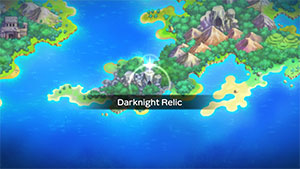
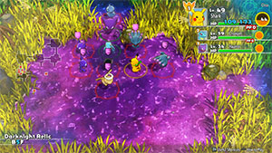

  

# Overview

<table class="dungeonOverview">
  <tr>
    <th>Unlock</th>
    <td class="highlightYellow">Clear Sky Tower → Purchase "Secretive Forest" camp</td>
  </tr>
</table>

<table class="dungeonTable">
  <tr>
    <th>Floors</th>
    <td>B15F</td>
    <th>Job Rank</th>
    <td>S</td>
  </tr>
  <tr>
    <th>Radar / Scanning</th>
    <td>No</td>
    <th>Weather</th>
    <td>Clear</td>
  </tr>
  <tr>
    <th>Dark Halls</th>
    <td>1 Tile</td>
    <th>Boss</th>
    <td>None</td>
  </tr>
  <tr>
    <th>Max Team Size</th>
    <td>3</td>
    <th>Strong Foe</th>
    <td>Wobbuffet</td>
  </tr>
  <tr>
    <th>Bring Items</th>
    <td>Yes</td>
    <th>Shops</th>
    <td>Yes</td>
  </tr>
  <tr>
    <th>Bring Poke</th>
    <td>Yes</td>
    <th>Monster Houses</th>
    <td>Yes</td>
  </tr>
  <tr>
    <th>Level Reset</th>
    <td>No</td>
    <th>Mystery Houses</th>
    <td>Yes</td>
  </tr>
  <tr>
    <th>Clear Icon</th>
    <td>None</td>
    <th>Reward</th>
    <td>Deluxe Box x 1, Brutal Swing TM x 1, Sludge Bomb TM x 1, Snarl TM x 1, Shadow Ball TM x 1, Dark Pulse TM x 1</td>
  </tr>
</table>

Optional post-game dungeon that's short but surprisingly difficult if you're not prepared for it. The difficulty is mainly due to Misdreavus and Shedinja, along with nasty traps like Grudge and Summon traps. ※ Misdreavus and Shedinja appear on all floors.

Misdreavus is Lv46 in this dungeon, so Perish Song is one of its possible known moves. Perish Song has low accuracy but makes any Pokemon faint after 3 turns, and targets all party members. The status can be cured using moves (Refresh, Heal Bell, etc.) or items (Health Orb, Heal Seed, etc.), but if you have neither on hand, you're likely to quickly burn through your stock of Tiny Reviver Seeds.

Other enemies will try to defeat Shedinja, often resulting in a Mega Evolved or Awakened enemy. Mega Gengar (Shadow Tag ability) can be a problem in particular if you only have Normal type moves, since you won't be able to deal damage (unless you have the Steamroll Rare Quality) or run away from it.

# Needed Camps

#### Wild

|Name|Price|Pokemon|
|-|-|-|
|Darkness Ridge|-|Gastly, Haunter, Gengar, Misdreavus, Sableye, Shuppet, Banette, Duskull|
|Secretive Forest|900|Shedinja|
|Echo Cave|2700|Wobbuffet|

#### Fainted

|Name|Price|Pokemon|
|-|-|-|
|Wild Plains|-|Ekans|
|Darkness Ridge|-|Mismagius|
|Flyaway Forest|500|Murkrow|
|Mt. Green|700|Cubone, Gliscor, Spinda|
|Withering Desert|900|Vibrava|
|Echo Cave|2700|Whismur|
|Decrepit Lab|6000|Porygon|
|Turtleshell Pond|6000|Crawdaunt|

#### Mystery House

|Name|Price|Pokemon|
|-|-|-|
|Darkness Ridge|-|Gastly, Haunter, Misdreavus, Shuppet, Duskull|
|Jungle|500|Gloom, Tangela|
|Mushroom Forest|800|Paras, Nuzleaf|
|Withering Desert|900|Cacturne|

# Pokemon

Rate = Recruit rate. Red stats = Stats as an enemy. Ability colors: Caution, Dangerous Move colors: Boosting, Destroys Items, Caution, Dangerous

#### Wild

|Floor|Image|Name|Rate|Lv|HP|Atk|Def|SpA|SpD|Spe|Exp|Ability + Moves|
|-|-|-|-|-|-|-|-|-|-|-|-|-|
|1-5||Shuppet |10.8%|46|77 113|79 79|51 52|62 62|50 51|73 73|118|Insomnia or Frisk Knock Off / Screech / Night Shade / Grudge / Will-O-Wisp / Feint Attack / Hex / Curse / Shadow Ball / Embargo / Spite / Sucker Punch / Shadow Sneak / Snatch|
|1-6||Gastly  |8.2%|46|72 112|55 55|46 46|79 79|45 45|69 69|104|Levitate Hypnosis / Lick / Spite / Mean Look / Curse / Night Shade / Confuse Ray / Dark Pulse / Payback / Shadow Ball / Sucker Punch / Destiny Bond / Hex / Dream Eater|
|1-14||Misdreavus |8.2%|46|77 123|55 55|51 51|72 72|55 55|88 88|119|Levitate Payback / Psywave / Spite / Pain Split / Confuse Ray / Mean Look / Psybeam / Hex / Astonish / Growl / Perish Song / Shadow Ball|
|1-14||Shedinja  |-25.0%|46|46 18|78 78|42 42|50 50|45 45|92 92|117|Wonder Guard Harden / Absorb / Spite / Heal Block / Sand Attack / Fury Swipes / Grudge / Mind Reader / Scratch / Shadow Ball / Shadow Sneak / Phantom Force / Confuse Ray|
|1-14||Sableye  |8.2%|46|72 116|62 62|51 51|55 55|50 50|79 79|121|Keen Eye or Stall Leer / Scratch / Shadow Ball / Detect / Night Shade / Astonish / Fury Swipes / Feint Attack / Fake Out / Punishment / Knock Off / Confuse Ray / Mean Look / Zen Headbutt / Power Gem / Quash / Foresight / Foul Play / Shadow Claw / Shadow Sneak ※ Can Mega Evolve.|
|6-10||Banette |8.2%|46|77 127|79 79|51 53|62 62|50 52|73 73|122|Insomnia or Frisk Knock Off / Screech / Night Shade / Grudge / Will-O-Wisp / Feint Attack / Hex / Curse / Shadow Ball / Embargo / Spite / Sucker Punch / Shadow Sneak / Snatch / Phantom Force ※ Can Mega Evolve.|
|6-14 Foe|  |Wobbuffet |-6.4%|60|109 560|55 150|55 80|55 150|50 80|95 200|800|Shadow Tag Counter / Mirror Coat / Safeguard / Destiny Bond ※ Friend Bow required to recruit.|
|7-10||Haunter  |8.2%|46|72 131|55 55|46 46|79 79|45 45|69 69|107|Levitate Hypnosis / Lick / Spite / Mean Look / Curse / Night Shade / Confuse Ray / Dark Pulse / Payback / Shadow Ball / Sucker Punch / Shadow Punch / Dream Eater|
|11-14||Duskull |10.8%|46|72 139|66 66|71 71|55 55|65 65|76 76|140|Levitate Night Shade / Disable / Mean Look / Astonish / Foresight / Will-O-Wisp / Pursuit / Confuse Ray / Curse / Hex / Leer / Shadow Sneak / Shadow Ball|
|12-14||Gengar  |14.4%|46|72 130|55 55|46 46|79 79|45 45|69 69|120|Cursed Body Hypnosis / Lick / Spite / Mean Look / Curse / Night Shade / Confuse Ray / Dark Pulse / Payback / Shadow Ball / Sucker Punch / Shadow Punch / Dream Eater ※ Can Mega Evolve.|

#### Fainted

|Image|Name|Lv|HP|Atk|Def|SpA|SpD|Spe|
|-|-|-|-|-|-|-|-|-|
||Ekans |48|78|63|51|56|51|77|
||Cubone |48|78|61|62|49|51|64|
||Porygon |48|78|63|56|83|56|74|
||Murkrow  |48|86|81|46|73|46|86|
||Mismagius |50|80|57|52|75|57|96|
||Gliscor  |48|78|73|66|49|51|71|
||Whismur |48|81|68|46|61|46|83|
||Spinda |48|78|56|51|56|51|65|
||Vibrava  |48|76|68|46|58|46|68|
||Crawdaunt  |50|80|82|57|65|47|67|

#### Mystery House

|Image|Name|Image|Name|Image|Name|Image|Name|Image|Name|
|-|-|-|-|-|-|-|-|-|-|
||Gloom  ||Paras  ||Gastly  ||Haunter  ||Tangela |
||Misdreavus ||Nuzleaf  ||Cacturne  ||Shuppet ||Duskull |

# Items

#### Floor

|Name|Floors|Rate|
|-|-|-|
|Efficient Bandanna|1-14|0.87%|
|Goggle Specs|1-14|0.218%|
|Gold Ribbon|1-14|0.0218%|
|Heal Ribbon|1-14|0.218%|
|Insomniscope|1-14|0.218%|
|Joy Ribbon|1-14|0.218%|
|Nullify Bandanna|1-14|0.435%|
|Pecha Scarf|1-14|0.218%|
|Persim Band|1-14|0.218%|
|Recovery Scarf|1-14|0.218%|
|Scope Lens|1-14|0.218%|
|Weather Band|1-14|0.218%|
|X-Ray Specs|1-14|0.218%|
|Apple|1-14|8.77%|
|Poke|1-14|61.4%|
|Max Elixir|1-14|1.35%|
|Max Ether|1-14|4.5%|
|Blast Seed|1-14|0.933%|
|Cheri Berry|1-14|0.933%|
|Chesto Berry|1-14|0.467%|
|Empowerment Seed|1-14|0.933%|
|Eyedrop Seed|1-14|1.87%|
|Oran Berry|1-14|4.67%|
|Pecha Berry|1-14|2.33%|
|Rawst Berry|1-14|1.4%|
|Sleep Seed|1-14|0.933%|
|Stun Seed|1-14|0.467%|
|Tiny Reviver Seed|1-14|1.4%|
|Totter Seed|1-14|0.467%|
|Training Seed|1-14|0.233%|
|Warp Seed|1-14|0.467%|
|Confuse Wand|1-14|0.154%|
|Guiding Wand|1-14|0.154%|
|HP-Swap Wand|1-14|0.154%|
|Petrify Wand|1-14|0.154%|
|Pounce Wand|1-14|0.307%|
|Slow Wand|1-14|0.154%|
|Slumber Wand|1-14|0.307%|
|Stayaway Wand|1-14|0.461%|
|Surround Wand|1-14|0.307%|
|Switcher Wand|1-14|0.154%|
|Tunnel Wand|1-14|0.154%|
|Two-Edged Wand|1-14|0.154%|
|Warp Wand|1-14|0.154%|
|Whirlwind Wand|1-14|0.154%|

#### Shop

|Name|Rate|
|-|-|
|Efficient Bandanna|2.28%|
|Goggle Specs|0.571%|
|Heal Ribbon|0.571%|
|Insomniscope|0.571%|
|Joy Ribbon|0.571%|
|Nullify Bandanna|1.15%|
|Pecha Scarf|0.571%|
|Persim Band|0.571%|
|Prosper Ribbon|0.571%|
|Recovery Scarf|0.571%|
|Scope Lens|0.571%|
|Weather Band|0.571%|
|X-Ray Specs|0.571%|
|Evolution Crystal|5.83%|
|Big Apple|6.8%|
|All Dodge Orb|0.418%|
|All Power-Up Orb|0.418%|
|All Protect Orb|0.418%|
|Bank Orb|0.418%|
|Cleanse Orb|2.09%|
|Decoy Orb|0.418%|
|Drought Orb|0.418%|
|Evasion Orb|0.418%|
|Foe-Hold Orb|0.418%|
|Foe-Seal Orb|0.418%|
|Health Orb|0.418%|
|Helper Orb|0.418%|
|Inviting Orb|0.418%|
|Lasso Orb|0.418%|
|Mobile Orb|0.418%|
|Monster Orb|0.418%|
|Nullify Orb|0.418%|
|One-Room Orb|0.418%|
|One-Shot Orb|0.418%|
|Rare Quality Orb|0.418%|
|Reset Orb|0.418%|
|Revive All Orb|0.418%|
|See-Trap Orb|0.418%|
|Spurn Orb|0.418%|
|Trapbust Orb|0.418%|
|Weather Lock Orb|0.418%|
|Wigglytuff Orb|2.09%|
|Max Elixir|9.71%|
|Ban Seed|0.868%|
|Cheri Berry|1.74%|
|Chesto Berry|1.74%|
|Decoy Seed|0.868%|
|Empowerment Seed|1.74%|
|Energy Seed|0.868%|
|Pecha Berry|4.35%|
|Pure Seed|0.868%|
|Quick Seed|2.6%|
|Rawst Berry|2.6%|
|Reviver Seed|0.868%|
|Stun Seed|1.74%|
|Tiny Reviver Seed|2.6%|
|Violent Seed|0.868%|
|Iron Spike|4.85%|
|Geo Pebble|4.85%|
|(Random TM)|9.71%|
|Guiding Wand|1.29%|
|HP-Swap Wand|0.648%|
|Pounce Wand|1.29%|
|Slow Wand|1.29%|
|Stayaway Wand|1.29%|
|Surround Wand|1.29%|
|Tunnel Wand|1.29%|
|Two-Edged Wand|0.648%|
|Warp Wand|0.648%|

# Traps

|Name|
|-|
|Wonder Tile|
|Training Switch|
|Grudge Trap|
|Sticky Trap|
|Spin Trap|
|Seal Trap|
|Pokemon Trap|
|Random Trap|
|Summon Trap|
|Apple Trap|
|Warp Trap|
|PP Leech Trap|
