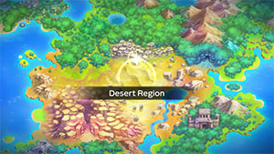
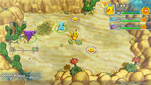

  

[Introduction]

# Overview

<table class="dungeonOverview">
  <tr>
    <th>Unlock</th>
    <td class="highlightYellow">Clear Sky Tower → Purchase "Withering Desert" camp</td>
  </tr>
</table>

<table class="dungeonTable">
  <tr>
    <th>Floors</th>
    <td>20F</td>
    <th>Job Rank</th>
    <td>A</td>
  </tr>
  <tr>
    <th>Radar / Scanning</th>
    <td>No</td>
    <th>Weather</th>
    <td>Clear: 1-3, 5, 7-8, 11-14, 16, 19F Sandstorm: 4, 10, 17-18F Sunny: 6, 9, 15F</td>
  </tr>
  <tr>
    <th>Dark Halls</th>
    <td>No</td>
    <th>Boss</th>
    <td>None</td>
  </tr>
  <tr>
    <th>Max Team Size</th>
    <td>3</td>
    <th>Strong Foe</th>
    <td>Sudowoodo</td>
  </tr>
  <tr>
    <th>Bring Items</th>
    <td>Yes</td>
    <th>Shops</th>
    <td>Yes</td>
  </tr>
  <tr>
    <th>Bring Poke</th>
    <td>Yes</td>
    <th>Monster Houses</th>
    <td>Yes</td>
  </tr>
  <tr>
    <th>Level Reset</th>
    <td>No</td>
    <th>Mystery Houses</th>
    <td>Yes</td>
  </tr>
  <tr>
    <th>Clear Icon</th>
    <td>None</td>
    <th>Reward</th>
    <td>Golden Fossil (10) x 2 Golden Spike (10) x 2 Deluxe Box x 1</td>
  </tr>
</table>

# Needed Camps

#### Wild

|Name|Price|Pokemon|
|-|-|-|
|Darkness Ridge|-|Dusclops|
|Safari|600|Nidoqueen|
|Mt. Green|700|Gligar|
|Ancient Relic|700|Baltoy|
|Mt. Discipline|700|Hitmontop|
|Overgrown Forest|700|Sudowoodo|
|Secretive Forest|900|Shedinja|
|Withering Desert|900|Sandshrew, Sandslash, Trapinch|
|Echo Cave|2700|Nosepass|

#### Fainted

|Name|Price|Pokemon|
|-|-|-|
|Stump Forest|-|Wurmple, Cascoon|
|Safari|600|Doduo|
|Thunder Crag|600|Chingling|
|Boulder Cave|700|Diglett|
|Ravaged Field|700|Spearow|
|Vibrant Forest|800|Meowth|
|Dragon Cave|3000|Shelgon|
|Rub-a-Dub River|3000|Seaking|
|Gourd Swamp|9000|Wooper|

#### Mystery House

|Name|Price|Pokemon|
|-|-|-|
|Darkness Ridge|-|Haunter, Misdreavus, Duskull|
|Flyaway Forest|500|Honchkrow, Altaria|
|Boulder Cave|700|Onix, Steelix|
|Frigid Cavern|800|Jynx, Delibird|
|Echo Cave|2700|Wobbuffet, Dunsparce, Mawile|
|Decrepit Lab|6000|Kadabra|
|Mt. Moonview|7000|Lunatone, Solrock|
|Serene Sea|9000|Wailord|
|Shallow Beach|9000|Krabby|
|Bountiful Sea|9000|Staryu|
|Treasure Sea|9000|Sharpedo|
|Deepsea Floor|9000|Clamperl|

# Pokemon

Rate = Recruit rate. Red stats = Stats as an enemy. Ability colors: Caution, Dangerous Move colors: Boosting, Destroys Items, Caution, Dangerous

#### Wild

|Floor|Image|Name|Rate|Lv|HP|Atk|Def|SpA|SpD|Spe|Exp|Ability + Moves|
|-|-|-|-|-|-|-|-|-|-|-|-|-|
|1-6||Sandshrew |10.8%|35|69 101|63 64|62 50|43 55|42 40|55 55|73|Sand Veil Scratch / Defense Curl / Rollout / Sand Attack / Poison Sting / Dig / Rapid Spin / Fury Cutter / Slash / Fury Swipes / Sand Tomb / Swift / Magnitude / Gyro Ball|
|1-6||Shedinja  |-25.0%|35|35 18|69 69|38 43|44 44|42 47|70 70|25|Wonder Guard Scratch / Harden / Fury Swipes / Sand Attack / Absorb / Spite / Shadow Sneak / Mind Reader / Confuse Ray / Shadow Ball|
|1-6||Nosepass |10.8%|35|68 110|48 55|67 50|53 55|67 41|54 54|74|Sturdy or Magnet Pull Rest / Rock Blast / Block / Spark / Thunder Wave / Rock Throw / Rock Slide / Power Gem / Tackle / Discharge / Harden / Sandstorm|
|1-11||Trapinch |14.4%|35|64 89|55 61|42 45|45 58|42 40|55 55|77|Hyper Cutter or Arena Trap Sand Attack / Bite / Feint Attack / Bide / Mud-Slap / Bulldoze / Dig / Earth Power / Rock Slide / Feint / Crunch / Sand Tomb / Earthquake|
|5-13 15-19 Foe|  |Sudowoodo |-6.4%|60|88 555|83 150|70 65|50 150|55 65|85 200|750|Sturdy or Rock Head Slam / Wood Hammer / Copycat / Flail / Tearful Look / Rock Throw / Mimic / Feint Attack / Low Kick / Rock Tomb / Block / Rock Slide / Hammer Arm / Sucker Punch / Double-Edge / Head Smash / Stone Edge / Counter ※ Friend Bow required to recruit.|
|7-13||Hitmontop |8.2%|35|63 93|69 60|42 50|42 61|62 50|58 63|74|Intimidate or Technician Rolling Kick / Endeavor / Detect / Close Combat / Focus Energy / Revenge / Pursuit / Quick Attack / Rapid Spin / Feint / Triple Kick / Counter|
|7-14||Nidoqueen  |10.8%|35|69 96|50 63|47 50|49 63|42 45|52 52|80|Poison Point or Rivalry Double Kick / Scratch / Tail Whip / Superpower / Poison Sting / Chip Away / Body Slam|
|12-19||Baltoy  |14.4%|35|68 105|53 60|62 52|48 59|62 52|55 55|76|Levitate Harden / Confusion / Rapid Spin / Mud-Slap / Heal Block / Psybeam / Cosmic Power / Ancient Power / Rock Tomb / Power Trick / Self-Destruct / Extrasensory / Guard Split / Power Split|
|15-19||Sandslash |10.8%|35|69 94|63 64|62 58|43 60|42 45|55 55|80|Sand Veil Scratch / Defense Curl / Rollout / Sand Attack / Poison Sting / Dig / Rapid Spin / Fury Cutter / Slash / Fury Swipes / Sand Tomb / Swift / Magnitude / Crush Claw|
|15-19||Gligar  |10.8%|35|68 112|63 66|62 55|42 55|47 46|58 58|82|Hyper Cutter or Sand Veil Poison Sting / Sand Attack / Screech / U-turn / Quick Attack / Knock Off / Fury Cutter / Slash / Feint Attack / Acrobatics / Harden|
|15-19||Dusclops |10.8%|37|65 112|57 65|68 55|49 60|62 55|58 58|84|Pressure Leer / Future Sight / Curse / Bind / Night Shade / Thunder Punch / Fire Punch / Ice Punch / Disable / Astonish / Confuse Ray / Gravity / Pursuit / Will-O-Wisp / Foresight / Shadow Sneak / Shadow Punch|

#### Fainted

|Image|Name|Lv|HP|Atk|Def|SpA|SpD|Spe|
|-|-|-|-|-|-|-|-|-|
||Spearow  |37|70|65|48|49|47|60|
||Diglett |37|65|55|43|43|47|63|
||Meowth |37|70|55|48|49|47|63|
||Doduo  |39|71|73|48|50|48|62|
||Seaking |39|72|66|48|51|48|68|
||Wooper  |37|79|55|53|49|47|58|
||Wurmple |37|65|43|44|38|38|55|
||Cascoon |37|65|43|46|38|38|55|
||Chingling |39|72|50|48|67|48|59|
||Shelgon |37|71|68|53|53|42|54|

#### Mystery House

|Image|Name|Image|Name|Image|Name|Image|Name|
|-|-|-|-|-|-|-|-|
||Kadabra ||Haunter  ||Onix  ||Steelix  |
||Krabby ||Staryu ||Jynx  ||Honchkrow  |
||Misdreavus ||Wobbuffet ||Dunsparce ||Delibird  |
||Mawile  ||Sharpedo  ||Wailord ||Altaria  |
||Lunatone  ||Solrock  ||Duskull ||Clamperl |

# Items

#### Floor

|Name|Floors|Rate|
|-|-|-|
|Efficient Bandanna|1-19|0.774%|
|Goggle Specs|1-19|0.194%|
|Gold Ribbon|1-19|0.0194%|
|Heal Ribbon|1-19|0.194%|
|Insomniscope|1-19|0.194%|
|Joy Ribbon|1-19|0.194%|
|Nullify Bandanna|1-19|0.387%|
|Pecha Scarf|1-19|0.194%|
|Persim Band|1-19|0.194%|
|Recovery Scarf|1-19|0.194%|
|Scope Lens|1-19|0.194%|
|Weather Band|1-19|0.194%|
|X-Ray Specs|1-19|0.194%|
|Grimy Food|1-19|2.6%|
|Poke|1-19|62.5%|
|Max Elixir|1-19|1.2%|
|Max Ether|1-19|4.01%|
|Blast Seed|1-19|0.693%|
|Cheri Berry|1-19|0.693%|
|Chesto Berry|1-19|0.347%|
|Empowerment Seed|1-19|0.693%|
|Eyedrop Seed|1-19|1.39%|
|Oran Berry|1-19|3.47%|
|Pecha Berry|1-19|1.73%|
|Rawst Berry|1-19|1.04%|
|Sleep Seed|1-19|0.693%|
|Stun Seed|1-19|0.347%|
|Tiny Reviver Seed|1-19|1.04%|
|Totter Seed|1-19|0.347%|
|Training Seed|1-19|0.173%|
|Warp Seed|1-19|0.347%|
|Iron Spike|1-19|5.21%|
|Geo Pebble|1-19|5.21%|
|Confuse Wand|1-19|0.164%|
|Guiding Wand|1-19|0.164%|
|HP-Swap Wand|1-19|0.164%|
|Petrify Wand|1-19|0.164%|
|Pounce Wand|1-19|0.328%|
|Slow Wand|1-19|0.164%|
|Slumber Wand|1-19|0.328%|
|Stayaway Wand|1-19|0.493%|
|Surround Wand|1-19|0.328%|
|Switcher Wand|1-19|0.164%|
|Tunnel Wand|1-19|0.164%|
|Two-Edged Wand|1-19|0.164%|
|Warp Wand|1-19|0.164%|
|Whirlwind Wand|1-19|0.164%|

#### Shop

|Name|Rate|
|-|-|
|Efficient Bandanna|1.45%|
|Goggle Specs|0.364%|
|Heal Ribbon|0.364%|
|Insomniscope|0.364%|
|Joy Ribbon|0.364%|
|Nullify Bandanna|0.73%|
|Pecha Scarf|0.364%|
|Persim Band|0.364%|
|Prosper Ribbon|0.364%|
|Recovery Scarf|0.364%|
|Scope Lens|0.364%|
|Weather Band|0.364%|
|X-Ray Specs|0.364%|
|Evolution Crystal|6.19%|
|Big Apple|20.6%|
|All Dodge Orb|0.333%|
|All Power-Up Orb|0.333%|
|All Protect Orb|0.333%|
|Bank Orb|0.333%|
|Cleanse Orb|0.333%|
|Decoy Orb|0.333%|
|Drought Orb|0.333%|
|Evasion Orb|0.333%|
|Foe-Hold Orb|0.333%|
|Foe-Seal Orb|0.333%|
|Health Orb|0.333%|
|Helper Orb|0.333%|
|Inviting Orb|0.333%|
|Lasso Orb|0.333%|
|Mobile Orb|0.333%|
|Monster Orb|0.333%|
|Nullify Orb|0.333%|
|One-Room Orb|0.333%|
|One-Shot Orb|0.333%|
|Rare Quality Orb|0.333%|
|Reset Orb|0.333%|
|Revive All Orb|0.333%|
|See-Trap Orb|0.333%|
|Spurn Orb|0.333%|
|Trapbust Orb|0.333%|
|Weather Lock Orb|0.333%|
|Wigglytuff Orb|1.66%|
|Max Elixir|10.3%|
|Ban Seed|0.553%|
|Cheri Berry|1.11%|
|Chesto Berry|1.11%|
|Decoy Seed|0.553%|
|Empowerment Seed|1.11%|
|Energy Seed|0.553%|
|Pecha Berry|2.77%|
|Pure Seed|0.553%|
|Quick Seed|1.66%|
|Rawst Berry|1.66%|
|Reviver Seed|0.553%|
|Stun Seed|1.11%|
|Tiny Reviver Seed|1.66%|
|Violent Seed|0.553%|
|Iron Spike|5.15%|
|Geo Pebble|5.15%|
|(Random TM)|10.3%|
|Guiding Wand|1.37%|
|HP-Swap Wand|0.687%|
|Pounce Wand|1.37%|
|Slow Wand|1.37%|
|Stayaway Wand|1.37%|
|Surround Wand|1.37%|
|Tunnel Wand|1.37%|
|Two-Edged Wand|0.687%|
|Warp Wand|0.687%|

# Traps

|Name|
|-|
|Wonder Tile|
|Training Switch|
|Spiky Trap|
|Gust Trap|
|Blast Trap|
|Hunger Trap|
|Seal Trap|
|Grimy Trap|
|Pokemon Trap|
|Warp Trap|
|PP Leech Trap|
