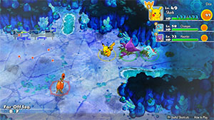

  

# Overview

<table class="dungeonOverview">
  <tr>
    <th>Unlock</th>
    <td class="highlightYellow">Clear Sky Tower → Purchase "Serene Sea" camp</td>
  </tr>
</table>

<table class="dungeonTable">
  <tr>
    <th>Floors</th>
    <td>B75F</td>
    <th>Job Rank</th>
    <td>S</td>
  </tr>
  <tr>
    <th>Radar / Scanning</th>
    <td>No</td>
    <th>Weather</th>
    <td>Rain: 4, 14, 24, 34, 44, 54, 64F Hail: 9, 19, 29, 39, 49, 59, 69F</td>
  </tr>
  <tr>
    <th>Dark Halls</th>
    <td>2 Tile</td>
    <th>Boss</th>
    <td>None</td>
  </tr>
  <tr>
    <th>Max Team Size</th>
    <td>3</td>
    <th>Strong Foe</th>
    <td>Corsola</td>
  </tr>
  <tr>
    <th>Bring Items</th>
    <td>Yes</td>
    <th>Shops</th>
    <td>No</td>
  </tr>
  <tr>
    <th>Bring Poke</th>
    <td>Yes</td>
    <th>Monster Houses</th>
    <td>Yes</td>
  </tr>
  <tr>
    <th>Level Reset</th>
    <td>No</td>
    <th>Mystery Houses</th>
    <td>Yes</td>
  </tr>
  <tr>
    <th>Clear Icon</th>
    <td>None</td>
    <th>Reward</th>
    <td>Deluxe Box x 3, Life Seed x 2, Power Drink x 1, Accuracy Drink x 1, PP-Up Drink x 1</td>
  </tr>
</table>

Optional post-game dungeon that's easy to unlock but hard to clear right after the main story. Water type enemies often have ranged attacks, including moves that can inflict Slow or Confused status. Many enemies have the possibility of knowing Brine or Assurance, which deal more damage if HP &le; 50%. Floor numbers ending in 4 have Rain, so beware of Swift Swim Pokemon attacking twice on those floors. Enemies with instant-KO attacks include Krabby (1-10F) and Dewgong (55-64F).

Since it's a sea type dungeon, food items (including seeds and berries) can't be found on the ground. It's highly recommended to bring a party member that has Notorious Fasting or Small Stomach. ※ Apples can still be obtained by stepping on an Apple Trap or by entering a Mystery House.

# Needed Camps

#### Wild

|Name|Price|Pokemon|
|-|-|-|
|Mystic Lake|2500|Lapras, Dratini|
|Ice Floe Beach|6000|Seel, Dewgong, Spheal, Sealeo, Walrein|
|Poison Swamp|7000|Grimer, Muk|
|Bountiful Sea|9000|Slowpoke, Slowbro, Slowking, Shellder, Starmie|
|Evolution Forest|9000|Vaporeon|
|Shallow Beach|9000|Krabby, Kingler, Corsola|
|Treasure Sea|9000|Kingdra, Octillery, Carvanha, Sharpedo, Anorith, Armaldo, Luvdisc|
|Deepsea Floor|9000|Omanyte, Omastar, Clamperl|
|Serene Sea|9000|Wailmer, Wailord|

#### Fainted

|Name|Price|Pokemon|
|-|-|-|
|Wild Plains|-|Seviper|
|Sky-Blue Plains|-|Chansey|
|Stump Forest|-|Kakuna, Ledian, Beautifly|
|Power Plant|-|Magnemite, Voltorb, Electivire|
|Darkness Ridge|-|Dusknoir|
|Jungle|500|Bellsprout, Exeggutor|
|Flyaway Forest|500|Pidgeotto, Natu|
|Thunder Crag|600|Mareep, Electrike|
|Mt. Green|700|Golem, Spinda|
|Mushroom Forest|800|Parasect|
|Withering Desert|900|Cacnea|
|Secretive Forest|900|Venomoth|
|Tadpole Pond|900|Lotad, Masquerain|
|Mystic Lake|2500|Dragonite|
|Beau Plains|2700|Taillow|
|Echo Cave|2700|Golbat, Loudred|
|Serene Sea|9000|Mantyke|
|Bountiful Sea|9000|Starmie|
|Deepsea Floor|9000|Gorebyss, Cradily|

#### Mystery House

|Name|Price|Pokemon|
|-|-|-|
|Bountiful Sea|9000|Tentacruel, Staryu|
|Shallow Beach|9000|Krabby, Corsola, Wingull|
|Waterfall Lake|9000|Gyarados|
|Serene Sea|9000|Mantine, Wailord|
|Treasure Sea|9000|Sharpedo|
|Deepsea Floor|9000|Clamperl|

# Pokemon

Rate = Recruit rate. Red stats = Stats as an enemy. Ability colors: Caution, Dangerous Move colors: Boosting, Destroys Items, Caution, Dangerous

#### Wild

|Floor|Image|Name|Rate|Lv|HP|Atk|Def|SpA|SpD|Spe|Exp|Ability + Moves|
|-|-|-|-|-|-|-|-|-|-|-|-|-|
|1-8||Shellder |8.2%|44|70 114|70 70|80 52|60 60|45 56|64 64|104|Shell Armor or Skill Link Tackle / Water Gun / Protect / Brine / Supersonic / Icicle Spear / Withdraw / Whirlpool / Ice Shard / Razor Shell / Aurora Beam / Clamp / Leer|
|1-9||Omanyte  |8.2%|44|75 115|53 53|65 56|77 77|50 50|61 61|116|Swift Swim or Shell Armor Constrict / Withdraw / Bite / Rollout / Water Gun / Leer / Mud Shot / Brine / Ancient Power / Protect / Tickle|
|1-10||Krabby |8.2%|44|70 112|84 84|65 55|47 47|45 45|64 64|105|Hyper Cutter or Shell Armor Mud Sport / Bubble / Vise Grip / Leer / Harden / Bubble Beam / Mud Shot / Metal Claw / Stomp / Protect / Slam / Guillotine / Brine / Crabhammer|
|6-14||Slowpoke  |8.2%|44|83 103|60 60|65 65|70 70|50 50|63 63|117|Oblivious or Own Tempo Confusion / Curse / Yawn / Disable / Headbutt / Growl / Tackle / Amnesia / Water Gun / Water Pulse / Slack Off / Zen Headbutt|
|6-14||Seel |10.8%|44|84 132|60 60|55 55|54 54|55 55|78 78|118|Thick Fat or Hydration Headbutt / Growl / Water Sport / Rest / Encore / Ice Shard / Dive / Aqua Jet / Aqua Ring / Aurora Beam / Icy Wind / Brine / Take Down / Aqua Tail|
|6-14 20-74 Foe|  |Corsola  |-6.4%|60|83 580|64 150|60 80|64 150|60 80|74 200|830|Hustle or Natural Cure Tackle / Endure / Bubble / Recover / Rock Blast / Refresh / Earth Power / Bubble Beam / Spike Cannon / Brine / Lucky Chant / Iron Defense / Harden / Aqua Ring / Power Gem / Mirror Coat / Flail / Ancient Power ※ Friend Bow required to recruit.|
|10-19||Spheal  |8.2%|44|83 97|57 57|50 53|64 64|50 53|61 61|113|Thick Fat or Ice Body Defense Curl / Powder Snow / Growl / Water Gun / Rollout / Encore / Brine / Aurora Beam / Body Slam / Blizzard / Rest / Snore / Hail / Ice Ball|
|14-23||Anorith  |8.2%|44|75 108|77 77|55 55|53 53|50 50|61 61|117|Battle Armor Scratch / Harden / Mud Sport / Slash / Water Gun / Fury Cutter / Crush Claw / Smack Down / Metal Claw / Bug Bite / Brine / X-Scissor / Ancient Power|
|20-29||Grimer |10.8%|44|83 109|70 70|50 50|53 53|55 55|61 61|118|Stench or Sticky Hold Screech / Fling / Harden / Mud-Slap / Mud Bomb / Minimize / Poison Gas / Pound / Sludge Bomb / Sludge Wave / Gunk Shot / Acid Armor / Disable / Sludge|
|20-29||Omastar  |8.2%|44|75 110|53 53|65 65|77 77|50 50|61 61|125|Swift Swim or Shell Armor Constrict / Withdraw / Brine / Rollout / Hydro Pump / Leer / Mud Shot / Bite / Ancient Power / Protect / Water Gun / Spike Cannon|
|20 25 30 40 50 60 70||Vaporeon |8.2%|44|89 128|53 53|50 50|71 71|55 55|78 64|135|Water Absorb Water Gun / Water Pulse / Aqua Ring / Tackle / Sand Attack / Baby-Doll Eyes / Quick Attack / Helping Hand / Haze / Aurora Beam / Acid Armor / Tail Whip / Muddy Water / Last Resort|
|26-35||Kingler |8.2%|44|70 109|84 84|65 67|47 47|45 45|64 64|100|Hyper Cutter or Shell Armor Mud Sport / Bubble / Vise Grip / Leer / Protect / Bubble Beam / Metal Claw / Mud Shot / Guillotine / Wide Guard / Harden / Stomp / Slam|
|30-36||Slowbro  |8.2%|44|83 113|60 60|65 66|70 70|50 50|63 63|105|Oblivious or Own Tempo Curse / Tackle / Yawn / Zen Headbutt / Amnesia / Slack Off / Disable / Growl / Water Gun / Water Pulse / Confusion / Withdraw / Heal Pulse / Headbutt ※ Can Mega Evolve.|
|30-40||Carvanha  |8.2%|44|75 117|77 77|45 50|70 70|45 50|72 72|107|Rough Skin Leer / Agility / Rage / Focus Energy / Aqua Jet / Assurance / Bite / Crunch / Swagger / Ice Fang / Poison Fang / Scary Face / Screech / Take Down|
|35-44||Starmie  |8.2%|44|76 120|60 60|55 55|71 71|55 55|84 84|110|Illuminate or Natural Cure Spotlight / Water Gun / Hydro Pump / Rapid Spin / Recover / Confuse Ray / Swift|
|35-44||Sealeo  |8.2%|44|83 125|57 57|50 52|64 64|50 52|61 61|115|Thick Fat or Ice Body Defense Curl / Powder Snow / Growl / Water Gun / Rollout / Encore / Brine / Aurora Beam / Body Slam / Swagger / Rest / Snore / Hail / Ice Ball|
|35-44||Armaldo  |8.2%|44|75 123|77 77|55 55|53 53|50 50|61 61|113|Battle Armor Scratch / Harden / Mud Sport / Slash / Water Gun / Fury Cutter / Crush Claw / Smack Down / Metal Claw / Bug Bite / Brine / Ancient Power|
|41-50||Wailmer |8.2%|44|93 110|70 70|45 45|60 60|45 45|61 61|117|Water Veil or Oblivious Splash / Growl / Water Gun / Rollout / Whirlpool / Astonish / Water Pulse / Mist / Brine / Rest / Amnesia / Dive / Water Spout|
|45-50||Lapras  |8.2%|44|88 130|60 60|55 55|60 60|55 55|61 61|135|Water Absorb or Shell Armor Sing / Growl / Water Gun / Ice Shard / Brine / Confuse Ray / Water Pulse / Body Slam / Rain Dance / Safeguard / Ice Beam / Mist / Perish Song|
|45-54||Luvdisc |8.2%|44|70 105|47 47|50 50|47 47|50 52|67 67|105|Swift Swim Tackle / Charm / Water Gun / Flail / Charm / Draining Kiss / Water Pulse / Lucky Chant / Attract / Sweet Kiss / Aqua Ring / Take Down / Captivate / Soak / Heart Stamp|
|50-59||Dratini |8.2%|44|77 110|71 71|50 52|61 61|50 50|64 64|124|Shed Skin Wrap / Leer / Thunder Wave / Slam / Dragon Tail / Dragon Rage / Agility / Aqua Tail / Twister / Dragon Rush|
|50-59||Slowking  |8.2%|44|83 115|60 60|65 65|70 70|50 50|63 63|123|Oblivious or Own Tempo Swagger / Headbutt / Curse / Yawn / Power Gem / Water Pulse / Growl / Heal Pulse / Water Gun / Confusion / Disable / Hidden Power / Nasty Plot / Tackle / Zen Headbutt|
|55-64||Dewgong  |8.2%|44|84 109|60 60|55 55|54 54|55 55|78 78|114|Thick Fat or Hydration Encore / Growl / Signal Beam / Brine / Rest / Ice Shard / Aqua Jet / Icy Wind / Headbutt / Aurora Beam / Aqua Ring / Take Down / Sheer Cold|
|55-64||Octillery |8.2%|44|75 119|70 70|50 52|70 70|50 52|61 61|123|Suction Cups or Sniper Signal Beam / Gunk Shot / Rock Blast / Aurora Beam / Constrict / Water Gun / Ice Beam / Bubble Beam / Wring Out / Focus Energy / Octazooka / Psybeam|
|60-69||Muk |8.2%|44|83 109|70 70|50 50|53 53|55 55|61 61|105|Stench or Sticky Hold Venom Drench / Pound / Poison Gas / Harden / Mud-Slap / Disable / Sludge / Mud Bomb / Minimize / Sludge Bomb / Screech / Sludge Wave / Gunk Shot / Fling|
|60-69||Sharpedo  |8.2%|44|75 100|77 77|45 47|70 70|45 47|72 72|125|Rough Skin Rage / Leer / Bite / Ice Fang / Crunch / Scary Face / Slash / Feint / Aqua Jet / Swagger / Night Slash / Assurance / Focus Energy / Screech / Poison Fang ※ Can Mega Evolve.|
|60-69||Walrein  |8.2%|44|83 120|57 57|50 52|64 64|50 52|61 61|115|Thick Fat or Ice Body Defense Curl / Powder Snow / Growl / Water Gun / Rollout / Encore / Brine / Aurora Beam / Body Slam / Swagger / Rest / Snore / Hail / Ice Ball / Crunch / Ice Fang|
|65-74||Clamperl |8.2%|44|70 100|70 70|65 65|70 70|50 50|61 61|110|Shell Armor Iron Defense / Water Gun / Whirlpool / Clamp|
|70-74||Kingdra  |8.2%|44|72 111|61 61|55 55|70 70|45 45|81 81|120|Swift Swim or Sniper Leer / Bubble / Smokescreen / Yawn / Water Gun / Twister / Bubble Beam / Focus Energy / Agility / Hydro Pump / Brine|
|70-74||Wailord |8.2%|44|93 150|70 70|45 54|60 60|45 54|61 61|120|Water Veil or Oblivious Splash / Growl / Water Gun / Rollout / Whirlpool / Astonish / Water Pulse / Mist / Brine / Rest / Amnesia / Dive / Water Spout / Noble Roar / Soak / Heavy Slam|

#### Fainted

|Image|Name|Lv|HP|Atk|Def|SpA|SpD|Spe|
|-|-|-|-|-|-|-|-|-|
||Kakuna |46|74|57|46|45|40|67|
||Pidgeotto  |46|77|59|51|52|45|66|
||Golbat  |46|77|66|51|55|50|69|
||Parasect  |48|78|73|56|56|51|62|
||Venomoth  |46|77|55|51|62|50|85|
||Bellsprout  |46|77|72|46|66|45|63|
||Golem  |46|74|76|66|52|45|60|
||Magnemite  |46|74|59|56|79|50|66|
||Voltorb |46|77|55|51|62|50|75|
||Exeggutor  |46|85|72|56|79|50|79|
||Chansey |46|112|43|41|56|55|63|
||Starmie  |46|77|62|56|72|55|88|
||Dragonite  |59|91|94|55|78|55|89|
||Ledian  |46|72|48|46|55|65|85|
||Natu  |46|77|62|51|72|50|69|
||Mareep |46|79|59|51|70|50|63|
||Beautifly  |46|72|48|49|43|42|73|
||Lotad  |46|77|59|46|59|50|63|
||Taillow  |46|77|62|51|48|45|75|
||Masquerain  |46|77|55|51|62|50|70|
||Loudred |48|81|68|46|61|46|83|
||Electrike |48|78|63|51|73|51|83|
||Spinda |48|78|56|51|56|51|65|
||Cacnea ||||||||
||Seviper |46|77|72|51|72|50|66|
||Cradily  |48|86|63|56|63|56|62|
||Gorebyss |46|72|72|66|72|50|63|
||Electivire |48|78|73|51|73|56|83|
||Dusknoir |48|73|68|71|56|66|80|

#### Mystery House

|Image|Name|Image|Name|Image|Name|Image|Name|Image|Name|
|-|-|-|-|-|-|-|-|-|-|
||Tentacruel  ||Krabby ||Staryu ||Gyarados  ||Corsola  |
||Mantine  ||Wingull  ||Sharpedo  ||Wailord ||Clamperl |

# Items

#### Floor

- Floors 1-64 / 66-74 have the listed rates, but 65F has a very high chance for Cleanse Orb instead.

 

|Name|Rate|
|-|-|
|Efficient Bandanna|2.02%|
|Goggle Specs|0.507%|
|Gold Ribbon|0.0507%|
|Heal Ribbon|0.507%|
|Insomniscope|0.507%|
|Joy Ribbon|0.507%|
|Nullify Bandanna|1.01%|
|Pecha Scarf|0.507%|
|Persim Band|0.507%|
|Recovery Scarf|0.507%|
|Scope Lens|0.507%|
|Weather Band|0.507%|
|X-Ray Specs|0.507%|
|Poke|68.0%|
|All Dodge Orb|0.566%|
|All Power-Up Orb|0.566%|
|All Protect Orb|0.566%|
|Cleanse Orb|1.99%|
|Decoy Orb|0.566%|
|Drought Orb|0.566%|
|Escape Orb|1.13%|
|Foe-Hold Orb|1.7%|
|Foe-Seal Orb|1.13%|
|Health Orb|0.566%|
|Inviting Orb|0.566%|
|Lasso Orb|0.566%|
|Nullify Orb|0.566%|
|One-Room Orb|0.566%|
|Petrify Orb|0.566%|
|Quick Orb|0.566%|
|Rare Quality Orb|0.566%|
|Revive All Orb|0.566%|
|Rollcall Orb|0.566%|
|Slow Orb|0.566%|
|Slumber Orb|1.13%|
|Totter Orb|0.566%|
|Trawl Orb|0.284%|
|Max Elixir|1.57%|
|Max Ether|5.23%|

# Traps

|Name|
|-|
|Wonder Tile|
|Training Switch|
|Spin Trap|
|Trip Trap|
|Slumber Trap|
|Poison Trap|
|Spiky Trap|
|Gust Trap|
|Slow Trap|
|Blast Trap|
|Hunger Trap|
|Seal Trap|
|Pokemon Trap|
|Apple Trap|
|Warp Trap|
|PP Leech Trap|
