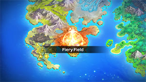
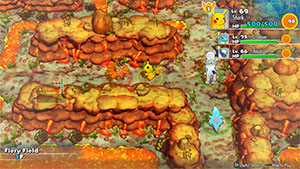

  

[Introduction]

# Overview

<table class="dungeonOverview">
  <tr>
    <th>Unlock</th>
    <td class="highlightYellow">Unlock Buried Relic → 1 day later (Spinda event) → Meet Xatu in Great Canyon.</td>
  </tr>
</table>

<table class="dungeonTable">
  <tr>
    <th>Floors</th>
    <td>30F</td>
    <th>Job Rank</th>
    <td>S</td>
  </tr>
  <tr>
    <th>Radar / Scanning</th>
    <td>No</td>
    <th>Weather</th>
    <td>Clear: 1-6, 10-14, 18-26F Sunny: 7-9, 15-17, 27-29F</td>
  </tr>
  <tr>
    <th>Dark Halls</th>
    <td>No</td>
    <th>Boss</th>
    <td>Entei</td>
  </tr>
  <tr>
    <th>Max Team Size</th>
    <td>3</td>
    <th>Strong Foe</th>
    <td>None</td>
  </tr>
  <tr>
    <th>Bring Items</th>
    <td>Yes</td>
    <th>Shops</th>
    <td>Yes</td>
  </tr>
  <tr>
    <th>Bring Poke</th>
    <td>Yes</td>
    <th>Monster Houses</th>
    <td>Yes</td>
  </tr>
  <tr>
    <th>Level Reset</th>
    <td>No</td>
    <th>Mystery Houses</th>
    <td>Yes</td>
  </tr>
  <tr>
    <th>Clear Icon</th>
    <td>None</td>
    <th>Reward</th>
    <td>Unlock Lightning Field</td>
  </tr>
</table>

# Needed Camps

#### Wild

|Name|Price|Pokemon|
|-|-|-|
|Darkness Ridge|-|Vulpix|
|Mt. Cleft|700|Charmander, Charmeleon|
|Mt. Green|700|Ursaring|
|Mt. Discipline|700|Machoke|
|Scorched Plains|700|Rapidash, Quilava, Combusken|
|Crater|5000|Magby, Magmar, Slugma, Magcargo, Numel, Camerupt, Torkoal|
|Decrepit Lab|6000|Ditto|
|Evolution Forest|9000|Flareon|

#### Fainted

|Name|Price|Pokemon|
|-|-|-|
|Wild Plains|-|Ekans|
|Sky-Blue Plains|-|Lickilicky|
|Darkness Ridge|-|Vulpix|
|Flyaway Forest|500|Togepi|
|Safari|600|Tauros|
|Mt. Cleft|700|Lairon|
|Mt. Green|700|Grumpig|
|Scorched Plains|700|Ponyta|
|Vibrant Forest|800|Slakoth|
|Echo Cave|2700|Whismur|
|Crater|5000|Magby, Slugma|
|Gourd Swamp|9000|Mudkip|
|Deepsea Floor|9000|Omastar|
|Treasure Sea|9000|Remoraid|

#### Mystery House

|Name|Price|Pokemon|
|-|-|-|
|Darkness Ridge|-|Ninetales|
|Ravaged Field|700|Houndoom|
|Scorched Plains|700|Arcanine, Rapidash|
|Crater|5000|Magmar, Magmortar, Magcargo, Camerupt, Torkoal|
|Evolution Forest|9000|Flareon|

# Pokemon

Rate = Recruit rate. Red stats = Stats as an enemy. Ability colors: Caution, Dangerous Move colors: Boosting, Destroys Items, Caution, Dangerous

#### Wild

|Floor|Image|Name|Rate|Lv|HP|Atk|Def|SpA|SpD|Spe|Exp|Ability + Moves|
|-|-|-|-|-|-|-|-|-|-|-|-|-|
|1-4||Numel  |10.8%|45|76 125|71 71|50 50|71 71|50 50|59 59|140|Oblivious or Simple Growl / Tackle / Ember / Focus Energy / Magnitude / Flame Burst / Earthquake / Lava Plume / Earth Power / Take Down / Curse / Yawn / Amnesia / Flamethrower|
|1-5||Vulpix |8.2%|45|76 130|61 61|50 50|61 61|55 55|74 74|140|Flash Fire Ember / Tail Whip / Roar / Hex / Grudge / Quick Attack / Confuse Ray / Fire Spin / Payback / Will-O-Wisp / Feint Attack / Extrasensory / Flame Burst / Safeguard / Flamethrower / Imprison / Fire Blast / Baby-Doll Eyes|
|1-6||Ursaring |8.2%|45|84 140|85 85|50 50|61 61|50 50|68 68|165|Guts or Quick Feet Hammer Arm / Covet / Scratch / Leer / Lick / Fake Tears / Fury Swipes / Slash / Feint Attack / Sweet Scent / Play Nice / Scary Face|
|1-6||Slugma |10.8%|45|71 135|54 54|65 65|61 61|50 50|65 65|155|Magma Armor or Flame Body Recover / Smog / Harden / Rock Throw / Lava Plume / Incinerate / Clear Smog / Yawn / Rock Slide / Ember / Body Slam / Flame Burst / Amnesia / Ancient Power|
|2-20 Rare||Ditto |10.8%|45|71 115|54 54|45 45|47 47|45 45|77 77|15|Limber Transform|
|4-8||Magmar |10.8%|45|76 145|71 71|50 50|75 80|55 55|74 68|145|Flame Body Smog / Leer / Ember / Smokescreen / Feint Attack / Fire Spin / Clear Smog / Flame Burst / Confuse Ray / Fire Punch / Lava Plume / Sunny Day|
|4-9||Magby |10.8%|45|76 125|71 71|50 50|75 75|55 55|74 74|140|Flame Body Smog / Leer / Ember / Smokescreen / Feint Attack / Fire Spin / Clear Smog / Flame Burst / Confuse Ray / Fire Punch / Lava Plume / Sunny Day / Fire Blast / Flamethrower|
|5-9||Charmander |8.2%|45|78 125|60 58|52 50|67 65|52 50|73 71|135|Blaze Scratch / Growl / Ember / Fire Spin / Dragon Rage / Fire Fang / Scary Face / Smokescreen / Slash / Flamethrower / Flame Burst|
|7-13||Flareon |8.2%|45|89 138|73 80|50 50|52 71|55 55|80 65|140|Flash Fire Ember / Helping Hand / Tackle / Smog / Lava Plume / Sand Attack / Scary Face / Last Resort / Fire Spin / Tail Whip / Bite / Baby-Doll Eyes / Flare Blitz / Fire Fang / Quick Attack|
|7-13||Quilava |8.2%|45|78 130|60 58|52 50|67 65|52 50|67 65|145|Blaze Leer / Swift / Quick Attack / Lava Plume / Smokescreen / Flame Charge / Tackle / Defense Curl / Flame Wheel / Ember|
|8-14||Torkoal |10.8%|45|76 139|61 61|70 70|61 61|50 50|56 56|155|White Smoke or Drought Ember / Smog / Withdraw / Rapid Spin / Fire Spin / Smokescreen / Flame Wheel / Curse / Lava Plume / Body Slam / Flail / Protect / Flamethrower / Iron Defense / Amnesia / Heat Wave|
|8-16||Machoke |8.2%|45|80 135|81 79|52 50|53 51|52 50|64 62|150|Guts or No Guard Low Kick / Leer / Revenge / Vital Throw / Karate Chop / Low Sweep / Knock Off / Dual Chop / Seismic Toss / Foresight / Wake-Up Slap / Focus Energy / Bulk Up / Submission|
|14-21||Rapidash |-2.2%|45|76 135|71 73|50 50|61 72|50 50|86 86|135|Run Away or Flash Fire Poison Jab / Fury Attack / Megahorn / Flame Wheel / Quick Attack / Tail Whip / Bounce / Fire Blast / Stomp / Fire Spin / Flame Charge / Take Down / Inferno / Growl / Agility / Ember|
|15-21||Camerupt  |8.2%|45|76 145|71 71|50 50|71 81|50 50|59 59|150|Magma Armor or Solid Rock Rock Slide / Fissure / Eruption / Growl / Tackle / Ember / Focus Energy / Yawn / Magnitude / Flame Burst / Take Down / Lava Plume / Earth Power / Amnesia / Curse ※ Can Mega Evolve.|
|17-23||Magcargo  |-2.2%|45|71 140|54 54|65 68|61 61|50 52|65 74|155|Magma Armor or Flame Body Yawn / Harden / Rock Throw / Amnesia / Flame Burst / Lava Plume / Clear Smog / Smog / Rock Slide / Ember / Incinerate / Body Slam / Shell Smash / Earth Power / Ancient Power|
|20-29||Charmeleon |8.2%|45|78 145|60 64|52 50|67 75|52 50|73 71|160|Blaze Scratch / Growl / Ember / Flame Burst / Dragon Rage / Fire Fang / Scary Face / Smokescreen / Slash / Flamethrower|
|24-29||Combusken  |8.2%|45|78 140|71 69|52 50|67 70|52 50|70 68|155|Blaze Focus Energy / Scratch / Growl / Ember / Quick Attack / Bulk Up / Flame Charge / Double Kick / Slash / Sand Attack / Peck|

#### Boss

- Rematch: Exact same stats + moves, but 100% recruit rate.

 

|Floor|Image|Name|Rate|Lv|HP|Atk|Def|SpA|SpD|Spe|Exp|Ability + Moves|
|-|-|-|-|-|-|-|-|-|-|-|-|-|
|30||Entei |-|50|92 1892|82 92|60 70|65 75|55 65|93 93|0|Pressure Stomp / Roar / Flamethrower / Fire Spin|

#### Fainted

|Image|Name|Lv|HP|Atk|Def|SpA|SpD|Spe|
|-|-|-|-|-|-|-|-|-|
||Ekans |49|79|64|52|57|51|79|
||Vulpix |47|78|63|51|63|56|78|
||Ponyta |47|78|73|51|63|51|90|
||Tauros |47|78|73|56|48|51|73|
||Omastar  |49|79|57|67|82|51|66|
||Togepi |47|75|53|56|71|56|78|
||Slugma |47|73|55|66|63|51|69|
||Remoraid |49|79|74|52|74|51|66|
||Magby |47|78|73|51|77|56|78|
||Mudkip |47|83|74|57|63|57|67|
||Slakoth |47|84|80|56|64|46|70|
||Whismur |47|80|67|46|60|46|81|
||Lairon  |47|78|77|71|53|46|69|
||Grumpig |47|78|48|51|63|66|75|
||Lickilicky |49|87|64|57|64|56|85|

#### Mystery House

|Image|Name|Image|Name|Image|Name|Image|Name|Image|Name|
|-|-|-|-|-|-|-|-|-|-|
||Ninetales ||Arcanine ||Rapidash ||Magmar ||Magmortar |
||Flareon ||Magcargo  ||Houndoom  ||Camerupt  ||Torkoal |

# Items

#### Floor

|Name|Floors|Rate|
|-|-|-|
|Efficient Bandanna|1-29|0.729%|
|Goggle Specs|1-29|0.183%|
|Gold Ribbon|1-29|0.0183%|
|Heal Ribbon|1-29|0.183%|
|Insomniscope|1-29|0.183%|
|Joy Ribbon|1-29|0.183%|
|Nullify Bandanna|1-29|0.365%|
|Pecha Scarf|1-29|0.183%|
|Persim Band|1-29|0.183%|
|Recovery Scarf|1-29|0.183%|
|Scope Lens|1-29|0.183%|
|Weather Band|1-29|0.183%|
|X-Ray Specs|1-29|0.183%|
|Grimy Food|1-29|7.35%|
|Poke|1-29|51.5%|
|Max Elixir|1-29|1.13%|
|Max Ether|1-29|3.77%|
|Blast Seed|1-29|0.87%|
|Cheri Berry|1-29|0.87%|
|Chesto Berry|1-29|0.435%|
|Empowerment Seed|1-29|0.87%|
|Eyedrop Seed|1-29|1.74%|
|Heal Seed|1-29|0.87%|
|Oran Berry|1-29|4.35%|
|Pecha Berry|1-29|2.18%|
|Rawst Berry|1-29|1.31%|
|Sleep Seed|1-29|0.87%|
|Stun Seed|1-29|0.435%|
|Tiny Reviver Seed|1-29|1.31%|
|Totter Seed|1-29|0.435%|
|Training Seed|1-29|0.218%|
|Warp Seed|1-29|0.435%|
|Iron Spike|1-29|4.9%|
|Geo Pebble|1-29|7.35%|
|Confuse Wand|1-29|0.206%|
|Guiding Wand|1-29|0.206%|
|HP-Swap Wand|1-29|0.206%|
|Petrify Wand|1-29|0.206%|
|Pounce Wand|1-29|0.412%|
|Slow Wand|1-29|0.206%|
|Slumber Wand|1-29|0.412%|
|Stayaway Wand|1-29|0.619%|
|Surround Wand|1-29|0.412%|
|Switcher Wand|1-29|0.206%|
|Tunnel Wand|1-29|0.206%|
|Two-Edged Wand|1-29|0.206%|
|Warp Wand|1-29|0.206%|
|Whirlwind Wand|1-29|0.206%|

#### Shop

|Name|Rate|
|-|-|
|Efficient Bandanna|2.12%|
|Goggle Specs|0.53%|
|Heal Ribbon|0.53%|
|Insomniscope|0.53%|
|Joy Ribbon|0.53%|
|Nullify Bandanna|1.06%|
|Pecha Scarf|0.53%|
|Persim Band|0.53%|
|Prosper Ribbon|0.53%|
|Recovery Scarf|0.53%|
|Scope Lens|0.53%|
|Weather Band|0.53%|
|X-Ray Specs|0.53%|
|Evolution Crystal|5.41%|
|Big Apple|13.5%|
|All Dodge Orb|0.45%|
|All Power-Up Orb|0.45%|
|All Protect Orb|0.45%|
|Cleanse Orb|0.45%|
|Decoy Orb|0.45%|
|Drought Orb|0.45%|
|Evasion Orb|0.45%|
|Foe-Hold Orb|1.35%|
|Foe-Seal Orb|0.9%|
|Health Orb|0.45%|
|Helper Orb|0.45%|
|Inviting Orb|0.45%|
|Lasso Orb|0.45%|
|Nullify Orb|0.45%|
|One-Room Orb|0.45%|
|Rare Quality Orb|0.45%|
|Reset Orb|0.45%|
|Revive All Orb|0.45%|
|See-Trap Orb|0.45%|
|Storage Orb|0.45%|
|Trapbust Orb|0.45%|
|Weather Lock Orb|0.45%|
|Wigglytuff Orb|2.25%|
|Max Elixir|9.01%|
|Ban Seed|0.749%|
|Cheri Berry|1.5%|
|Chesto Berry|1.5%|
|Decoy Seed|0.749%|
|Empowerment Seed|1.5%|
|Energy Seed|0.749%|
|Pecha Berry|3.76%|
|Pure Seed|0.749%|
|Quick Seed|2.25%|
|Rawst Berry|2.25%|
|Reviver Seed|0.749%|
|Stun Seed|1.5%|
|Tiny Reviver Seed|2.25%|
|Violent Seed|0.749%|
|Iron Spike|4.5%|
|Geo Pebble|4.5%|
|(Random TM)|9.01%|
|Guiding Wand|1.2%|
|HP-Swap Wand|0.601%|
|Pounce Wand|1.2%|
|Slow Wand|1.2%|
|Stayaway Wand|1.2%|
|Surround Wand|1.2%|
|Tunnel Wand|1.2%|
|Two-Edged Wand|0.601%|
|Warp Wand|0.601%|

# Traps

|Name|
|-|
|Wonder Tile|
|Training Switch|
|Slumber Trap|
|Poison Trap|
|Spiky Trap|
|Gust Trap|
|Slow Trap|
|Blast Trap|
|Hunger Trap|
|Seal Trap|
|Pokemon Trap|
|Summon Trap|
|Apple Trap|
|Warp Trap|
|PP Leech Trap|
