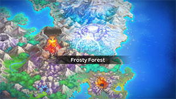

  

[Introduction]

# Overview

<table class="dungeonOverview">
  <tr>
    <th>Unlock</th>
    <td class="highlightYellow">Clear Mt. Blaze.</td>
  </tr>
</table>

<table class="dungeonTable">
  <tr>
    <th>Floors</th>
    <td>13F</td>
    <th>Job Rank</th>
    <td>D</td>
  </tr>
  <tr>
    <th>Radar / Scanning</th>
    <td>Yes</td>
    <th>Weather</th>
    <td>Clear</td>
  </tr>
  <tr>
    <th>Dark Halls</th>
    <td>2 Tiles</td>
    <th>Boss</th>
    <td>Articuno</td>
  </tr>
  <tr>
    <th>Max Team Size</th>
    <td>3</td>
    <th>Strong Foe</th>
    <td>Spinda</td>
  </tr>
  <tr>
    <th>Bring Items</th>
    <td>Yes</td>
    <th>Shops</th>
    <td>Yes</td>
  </tr>
  <tr>
    <th>Bring Poke</th>
    <td>Yes</td>
    <th>Monster Houses</th>
    <td>No</td>
  </tr>
  <tr>
    <th>Level Reset</th>
    <td>No</td>
    <th>Mystery Houses</th>
    <td>No</td>
  </tr>
  <tr>
    <th>Clear Icon</th>
    <td>None</td>
    <th>Reward</th>
    <td>Absol joins Unlock Mt. Freeze</td>
  </tr>
</table>

# Needed Camps

- Cannot recruit during the first clear.

#### Wild

|Name|Price|Pokemon|
|-|-|-|
|Wild Plains|-|Mightyena|
|Thunder Crag|600|Furret|
|Safari|600|Rhyhorn|
|Mt. Cleft|700|Lairon|
|Magnetic Quarry|700|Metang|
|Mt. Green|700|Spinda|
|Frigid Cavern|800|Piloswine, Snorunt|
|Echo Cave|2700|Nosepass|
|Turtleshell Pond|6000|Azurill|
|Decrepit Lab|6000|Ditto|

#### Fainted

|Name|Price|Pokemon|
|-|-|-|
|Flyaway Forest|500|Swablu|
|Thunder Crag|600|Chimecho|
|Mt. Discipline|700|Hitmonlee|
|Echo Cave|2700|Mawile|
|Beau Plains|2700|Budew|
|Ice Floe Beach|6000|Seel|

# Pokemon

Rate = Recruit rate. Red stats = Stats as an enemy. Ability colors: Caution, Dangerous Move colors: Boosting, Destroys Items, Caution, Dangerous

#### Wild

|Floor|Image|Name|Rate|Lv|HP|Atk|Def|SpA|SpD|Spe|Exp|Ability + Moves|
|-|-|-|-|-|-|-|-|-|-|-|-|-|
|1-3||Furret |%|20|55 65|34 33|31 24|28 34|28 25|36|42|Run Away or Keen Eye Scratch / Foresight / Defense Curl / Agility / Quick Attack / Fury Swipes / Coil / Helping Hand|
|1-4||Snorunt |%|20|55 67|35 36|34 25|34 35|31 26|35|48|Inner Focus or Ice Body Ice Shard / Leer / Double Team / Bite / Powder Snow / Icy Wind|
|1-6||Azurill  |%|20|55 68|24 34|28 23|24 24|28 26|30|40|Thick Fat or Huge Power Splash / Water Gun / Slam / Charm / Water Sport / Bubble / Bubble Beam / Helping Hand / Tail Whip|
|3-6||Piloswine  |%|33|76 80|63 39|52 25|46 35|46 29|53|53|Oblivious or Snow Cloak Ancient Power / Peck / Odor Sleuth / Mud Sport / Ice Fang / Mud-Slap / Endure / Fury Attack / Mud Bomb / Icy Wind / Powder Snow / Take Down|
|4 6 10-13 Foe|  |Spinda |%|20|56 333|32 75|32 44|32 77|32 44|33|500|Own Tempo or Tangled Feet Tackle / Copycat / Feint Attack / Psybeam / Hypnosis|
|4-7 12-13 Rare||Ditto |%|20|52 66|32 33|28 26|28 33|28 26|33|21|Limber Transform|
|4-9||Nosepass |%|20|55 69|31 37|47 22|34 35|46 33|30|45|Sturdy or Magnet Pull Tackle / Harden / Block / Rest / Rock Throw / Thunder Wave / Spark|
|7-9||Mightyena |%|20|55 70|42 39|31 23|30 36|30 28|34|40|Intimidate or Quick Feet Snarl / Fire Fang / Thunder Fang / Ice Fang / Crunch / Thief / Tackle / Howl / Bite / Sand Attack / Roar / Odor Sleuth / Swagger|
|10-13||Lairon  |%|32|66 85|62 38|66 28|41 35|41 32|46|48|Sturdy or Rock Head Tackle / Harden / Mud-Slap / Roar / Metal Claw / Rock Tomb / Protect / Iron Head / Rock Slide / Take Down Headbutt / Metal Sound|
|10-13||Rhyhorn  |%|20|63 70|49 42|42 25|27 38|27 28|30|55|Lightning Rod or Rock Head Horn Attack / Stomp / Fury Attack / Scary Face / Smack Down / Tail Whip|
|10-13||Metang  |%|20|55 70|35 39|36 26|31 35|32 30|32|49|Clear Body Confusion / Take Down / Metal Claw / Magnet Rise|

#### Boss

|Floor|Image|Name|Rate|Lv|HP|Atk|Def|SpA|SpD|Spe|Exp|Ability + Moves|
|-|-|-|-|-|-|-|-|-|-|-|-|-|
|14||Articuno  |-|22|66 766|38 38|38 38|46 46|46 46|41|0|Pressure Icy Wind / Ice Shard / Mist / Powder Snow ※ First clear.|
|14 Rematch||Articuno  |100%|50|87 2187|65 85|57 77|75 75|67 67|84|0|Pressure Freeze-Dry / Reflect / Mist / Blizzard ※ Available post-game. ※ Rare Quality: Squeeze Out|

#### Fainted

|Image|Name|Lv|HP|Atk|Def|SpA|SpD|Spe|
|-|-|-|-|-|-|-|-|-|
||Seel |22|65|37|38|34|38|38|
||Hitmonlee |24|55|52|32|32|48|43|
||Mawile  |22|53|38|38|34|30|36|
||Budew  |22|53|34|30|45|34|38|
||Swablu  |22|57|37|38|34|38|38|
||Chimecho |22|57|34|34|45|34|38|

# Items

#### Floor

|Name|Floors|Rate|
|-|-|-|
|Cover Band|1-13|0.315%|
|Defense Scarf|1-13|0.118%|
|Detect Band|1-13|0.0788%|
|Efficient Bandanna|1-13|0.235%|
|Fickle Specs|1-13|0.0788%|
|Gold Ribbon|1-13|0.0157%|
|Heal Ribbon|1-13|0.0788%|
|Heavy Rotation Specs|1-13|0.0788%|
|Joy Ribbon|1-13|0.0788%|
|Lucky Ribbon|1-13|0.0788%|
|Mach Ribbon|1-13|0.315%|
|Nullify Bandanna|1-13|0.157%|
|Power Band|1-13|0.118%|
|Prosper Ribbon|1-13|0.0788%|
|Special Band|1-13|0.118%|
|Twist Band|1-13|0.0788%|
|Zinc Band|1-13|0.118%|
|Apple|1-13|2.67%|
|Link Box|1-13|4.81%|
|Poke|1-13|48.1%|
|All Dodge Orb|1-13|0.369%|
|All Power-Up Orb|1-13|0.369%|
|Escape Orb|1-13|0.738%|
|Foe-Hold Orb|1-13|0.369%|
|Foe-Seal Orb|1-13|0.369%|
|Nullify Orb|1-13|0.369%|
|Petrify Orb|1-13|0.369%|
|Quick Orb|1-13|0.369%|
|Rollcall Orb|1-13|0.369%|
|Slow Orb|1-13|0.369%|
|Slumber Orb|1-13|0.738%|
|Totter Orb|1-13|0.369%|
|Trawl Orb|1-13|0.185%|
|Max Ether|1-13|6.42%|
|Blast Seed|1-13|2.41%|
|Chesto Berry|1-13|1.2%|
|Oran Berry|1-13|12.0%|
|Sleep Seed|1-13|1.2%|
|Stun Seed|1-13|1.2%|
|Tiny Reviver Seed|1-13|4.22%|
|Totter Seed|1-13|1.2%|
|Training Seed|1-13|0.602%|
|Geo Pebble|1-13|2.67%|
|(Random TM)|1-13|1.07%|
|Confuse Wand|1-13|0.534%|
|Petrify Wand|1-13|0.534%|
|Slow Wand|1-13|0.534%|
|Slumber Wand|1-13|0.267%|
|Stayaway Wand|1-13|0.4%|
|Switcher Wand|1-13|0.134%|
|Tunnel Wand|1-13|0.134%|
|Whirlwind Wand|1-13|0.134%|

#### Shop

|Name|Rate|
|-|-|
|Cover Band|0.00888%|
|Defense Scarf|0.00333%|
|Detect Band|0.00222%|
|Efficient Bandanna|0.00664%|
|Fickle Specs|0.00222%|
|Gold Ribbon|0.000444%|
|Heal Ribbon|0.00222%|
|Heavy Rotation Specs|0.00222%|
|Joy Ribbon|0.00222%|
|Lucky Ribbon|0.00222%|
|Mach Ribbon|0.00888%|
|Nullify Bandanna|0.00444%|
|Power Band|0.00333%|
|Prosper Ribbon|0.00222%|
|Special Band|0.00333%|
|Twist Band|0.00222%|
|Zinc Band|0.00333%|
|Apple|0.181%|
|Link Box|0.109%|
|All Dodge Orb|0.00563%|
|All Power-Up Orb|0.00563%|
|Foe-Hold Orb|0.00563%|
|Foe-Seal Orb|0.00563%|
|Nullify Orb|0.00563%|
|Petrify Orb|0.00563%|
|Quick Orb|0.00563%|
|Revive All Orb|0.0338%|
|Rollcall Orb|0.00563%|
|Slow Orb|0.00563%|
|Slumber Orb|0.00563%|
|Totter Orb|0.00563%|
|Trawl Orb|0.00282%|
|Wigglytuff Orb|0.0225%|
|Max Ether|0.121%|
|Blast Seed|0.118%|
|Cheri Berry|0.118%|
|Chesto Berry|0.118%|
|Oran Berry|97.6%|
|Pecha Berry|0.118%|
|Rawst Berry|0.118%|
|Sleep Seed|0.0589%|
|Stun Seed|0.118%|
|Tiny Reviver Seed|0.825%|
|Totter Seed|0.0589%|
|Training Seed|0.0589%|
|Confuse Wand|0.0121%|
|Petrify Wand|0.0121%|
|Slow Wand|0.0121%|
|Slumber Wand|0.00604%|
|Stayaway Wand|0.00906%|
|Switcher Wand|0.00302%|
|Tunnel Wand|0.00302%|
|Whirlwind Wand|0.00302%|

#### Pretty Box

|Name|Rate|
|-|-|
|Bronze Dojo Ticket|30.8%|
|Oran Berry|11.5%|
|Calcium|0.689%|
|Carbos|0.689%|
|Iron|0.689%|
|Protein|0.689%|
|Rainbow Gummi|34.4%|
|Sitrus Berry|0.689%|
|Zinc|0.689%|
|(Random TM)|19.2%|

#### Deluxe Box

|Name|Rate|
|-|-|
|Gold Dojo Ticket|3.48%|
|Silver Dojo Ticket|13.9%|
|Reviver Seed|6.5%|
|Tiny Reviver Seed|6.5%|
|Calcium|0.934%|
|Carbos|0.934%|
|DX Gummi|23.3%|
|Iron|0.934%|
|Protein|0.934%|
|Rainbow Gummi|23.3%|
|Sitrus Berry|0.934%|
|Zinc|0.934%|
|(Random TM)|17.4%|

# Traps

|Name|
|-|
|Wonder Tile|
|Training Switch|
|Spin Trap|
|Slumber Trap|
|Spiky Trap|
|Gust Trap|
|Slow Trap|
|Blast Trap|
