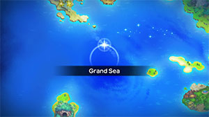
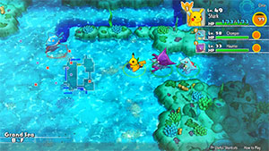
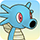
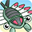

  

[Introduction]

# Overview

<table class="dungeonOverview">
  <tr>
    <th>Unlock</th>
    <td class="highlightYellow">Clear Sky Tower → Purchase "Bountiful Sea" camp</td>
  </tr>
</table>

<table class="dungeonTable">
  <tr>
    <th>Floors</th>
    <td>B30F</td>
    <th>Job Rank</th>
    <td>A</td>
  </tr>
  <tr>
    <th>Radar / Scanning</th>
    <td>No</td>
    <th>Weather</th>
    <td>Clear</td>
  </tr>
  <tr>
    <th>Dark Halls</th>
    <td>1 Tile</td>
    <th>Boss</th>
    <td>None</td>
  </tr>
  <tr>
    <th>Max Team Size</th>
    <td>3</td>
    <th>Strong Foe</th>
    <td>Starmie</td>
  </tr>
  <tr>
    <th>Bring Items</th>
    <td>Yes</td>
    <th>Shops</th>
    <td>No</td>
  </tr>
  <tr>
    <th>Bring Poke</th>
    <td>Yes</td>
    <th>Monster Houses</th>
    <td>Yes</td>
  </tr>
  <tr>
    <th>Level Reset</th>
    <td>No</td>
    <th>Mystery Houses</th>
    <td>Yes</td>
  </tr>
  <tr>
    <th>Clear Icon</th>
    <td>None</td>
    <th>Reward</th>
    <td>Deluxe Box x 2, Protein x 1, Iron x 1, Calcium x 1, Zinc x 1, Carbos x 1</td>
  </tr>
</table>

# Needed Camps

#### Wild

|Name|Price|Pokemon|
|-|-|-|
|Mystic Lake|2500|Dragonite|
|Evolution Forest|9000|Vaporeon|
|Deepsea Floor|9000|Kabuto, Kabutops|
|Serene Sea|9000|Qwilfish, Mantyke, Mantine|
|Treasure Sea|9000|Horsea, Seadra, Remoraid, Anorith|
|Shallow Beach|9000|Krabby, Kingler, Corsola, Wingull|
|Bountiful Sea|9000|Tentacool, Tentacruel, Slowpoke, Slowbro, Staryu, Starmie|

#### Fainted

|Name|Price|Pokemon|
|-|-|-|
|Flyaway Forest|500|Swablu|
|Jungle|500|Weepinbell, Sunflora, Tropius|
|Safari|600|Nidoran♀|
|Mt. Cleft|700|Lairon|
|Mt. Discipline|700|Tyrogue|
|Ravaged Field|700|Skarmory|
|Mushroom Forest|800|Parasect, Breloom|
|Vibrant Forest|800|Primeape, Ambipom|
|Beau Plains|2700|Budew|
|Turtleshell Pond|6000|Psyduck|
|Deepsea Floor|9000|Lileep|

#### Mystery House

|Name|Price|Pokemon|
|-|-|-|
|Bountiful Sea|9000|Tentacruel, Staryu|
|Shallow Beach|9000|Krabby, Corsola, Wingull|
|Waterfall Lake|9000|Gyarados|
|Serene Sea|9000|Mantine, Wailord|
|Treasure Sea|9000|Sharpedo|
|Deepsea Floor|9000|Clamperl|

# Pokemon

Rate = Recruit rate. Red stats = Stats as an enemy. Ability colors: Caution, Dangerous Move colors: Boosting, Destroys Items, Caution, Dangerous

#### Wild

|Floor|Image|Name|Rate|Lv|HP|Atk|Def|SpA|SpD|Spe|Exp|Ability + Moves|
|-|-|-|-|-|-|-|-|-|-|-|-|-|
|1-4||Mantyke  |8.2%|37|70 115|43 49|48 47|55 59|67 55|64 64|72|Swift Swim or Water Absorb Tackle / Bubble Beam / Supersonic / Bubble / Confuse Ray / Headbutt / Wing Attack / Agility / Water Pulse / Take Down / Wide Guard / Air Slash|
|1-5||Wingull  |8.2%|37|70 119|49 49|53 42|55 55|47 40|57 57|73|Keen Eye or Hydration Growl / Water Gun / Supersonic / Wing Attack / Water Pulse / Roost / Quick Attack / Air Cutter / Pursuit / Mist / Aerial Ace / Agility|
|1-9||Tentacool  |8.2%|37|70 117|55 56|48 43|55 55|62 50|60 60|70|Clear Body or Liquid Ooze Poison Sting / Supersonic / Acid / Toxic Spikes / Bubble Beam / Wrap / Constrict / Water Pulse / Acid Spray / Barrier / Poison Jab / Brine / Screech|
|1-9||Qwilfish  |8.2%|37|70 118|65 62|48 43|49 57|42 39|67 67|74|Poison Point or Swift Swim Toxic Spikes / Hydro Pump / Spikes / Destiny Bond / Minimize / Pin Missile / Fell Stinger / Harden / Tackle / Brine / Bubble / Rollout / Revenge / Spit Up / Stockpile / Water Gun / Poison Sting|
|5-13||Kabuto  |8.2%|37|70 113|71 63|63 50|49 59|47 43|57 57|77|Swift Swim or Battle Armor Scratch / Harden / Absorb / Endure / Mud Shot / Sand Attack / Aqua Jet / Leer / Mega Drain|
|5-13||Corsola  |8.2%|37|65 110|49 54|53 54|49 55|52 47|51 51|80|Hustle or Natural Cure Tackle / Endure / Bubble / Recover / Rock Blast / Refresh / Ancient Power / Bubble Beam / Spike Cannon / Brine / Lucky Chant / Iron Defense / Harden|
|6-9||Slowpoke  |8.2%|37|79 123|55 57|63 43|65 58|47 43|51 51|75|Oblivious or Own Tempo Curse / Tackle / Yawn / Zen Headbutt / Headbutt / Slack Off / Disable / Growl / Water Gun / Water Pulse / Confusion|
|6-29 Foe|  |Starmie  |-6.4%|60|88 530|73 150|60 65|83 150|60 65|116 200|780|Illuminate or Natural Cure Spotlight / Water Gun / Hydro Pump / Rapid Spin / Recover / Confuse Ray / Swift ※ Friend Bow required to recruit.|
|10-19||Remoraid |8.2%|37|70 109|65 57|48 42|65 56|47 43|54 54|80|Hustle or Sniper Signal Beam / Lock-On / Aurora Beam / Bubble Beam / Water Gun / Psybeam / Water Pulse / Ice Beam / Focus Energy|
|10-20||Horsea |8.2%|37|66 106|53 57|53 47|65 62|42 45|67 67|80|Swift Swim or Sniper Bubble / Smokescreen / Water Gun / Leer / Twister / Bubble Beam / Brine / Focus Energy / Agility|
|10 15 20 25||Dragonite  |10.8%|55|87 130|88 82|54 53|73 70|53 47|81 81|105|Inner Focus Wing Attack / Hurricane / Roost / Fire Punch / Thunder Punch / Slam / Twister / Wrap / Dragon Rage / Leer / Thunder Wave / Agility / Dragon Tail / Aqua Tail / Dragon Rush / Safeguard|
|14-23||Anorith  |8.2%|37|70 113|71 61|53 50|49 56|47 46|54 54|83|Battle Armor Scratch / Harden / Water Gun / Slash / Mud Sport / Fury Cutter / Metal Claw / Smack Down / Ancient Power / Brine / Bug Bite|
|15-20||Krabby |8.2%|37|65 115|77 70|63 47|43 45|42 45|57 57|84|Hyper Cutter or Shell Armor Mud Sport / Bubble / Vise Grip / Leer / Protect / Bubble Beam / Metal Claw / Mud Shot / Stomp / Guillotine / Slam / Harden|
|15-25||Staryu |8.2%|37|70 120|55 60|53 48|65 59|52 44|70 70|85|Illuminate or Natural Cure Tackle / Swift / Water Gun / Psywave / Rapid Spin / Recover / Harden / Brine / Power Gem / Camouflage / Minimize / Gyro Ball / Reflect Type / Bubble Beam|
|20||Vaporeon |8.2%|37|84 140|49 50|48 46|65 73|52 51|64 57|95|Water Absorb Water Gun / Water Pulse / Aqua Ring / Tackle / Sand Attack / Baby-Doll Eyes / Quick Attack / Helping Hand / Haze / Aurora Beam / Acid Armor / Tail Whip / Muddy Water|
|21-29||Tentacruel  |8.2%|37|70 118|55 62|48 47|55 63|62 53|60 60|88|Clear Body or Liquid Ooze Reflect Type / Wring Out / Poison Jab / Supersonic / Constrict / Acid / Brine / Toxic Spikes / Wrap / Water Pulse / Acid Spray / Bubble Beam / Barrier / Poison Sting|
|24-29||Kingler |8.2%|37|65 119|77 71|63 48|43 53|42 43|57 57|93|Hyper Cutter or Shell Armor Mud Sport / Bubble / Vise Grip / Leer / Protect / Bubble Beam / Metal Claw / Mud Shot / Guillotine / Wide Guard / Harden / Stomp|
|24-29||Kabutops  |8.2%|40|72 120|73 70|64 50|51 54|48 46|60 61|90|Swift Swim or Battle Armor Slash / Scratch / Feint / Night Slash / Mud Shot / Absorb / Leer / Aqua Jet / Sand Attack / Endure / Mega Drain / Harden|
|25-29||Slowbro  |8.2%|37|79 128|55 65|63 51|65 75|47 45|51 51|100|Oblivious or Own Tempo Curse / Tackle / Yawn / Zen Headbutt / Headbutt / Slack Off / Disable / Growl / Water Gun / Water Pulse / Confusion / Withdraw / Heal Pulse ※ Can Mega Evolve.|
|27-29||Seadra |8.2%|37|66 112|53 60|53 52|65 65|42 45|67 67|91|Poison Point or Sniper Bubble / Smokescreen / Water Gun / Leer / Twister / Bubble Beam / Brine / Focus Energy / Hydro Pump|
|28-29||Mantine  |8.2%|37|70 125|43 49|48 47|55 59|67 55|64 64|92|Swift Swim or Water Absorb Psybeam / Bullet Seed / Signal Beam / Roost / Agility / Bubble / Confuse Ray / Supersonic / Bubble Beam / Tackle / Wing Attack / Headbutt / Water Pulse / Wide Guard / Take Down / Air Slash|

#### Fainted

|Image|Name|Lv|HP|Atk|Def|SpA|SpD|Spe|
|-|-|-|-|-|-|-|-|-|
||Nidoran♀ |39|73|55|48|53|43|56|
||Parasect  |41|73|68|54|52|49|55|
||Psyduck |39|71|56|48|66|48|62|
||Primeape |41|73|68|49|52|49|66|
||Weepinbell  |39|71|66|43|59|43|56|
||Sunflora |41|73|58|49|68|54|55|
||Tyrogue |39|66|73|43|44|63|62|
||Ambipom |39|71|66|48|50|48|65|
||Skarmory  |41|73|58|69|45|49|72|
||Breloom  |39|71|79|53|50|48|59|
||Lairon  |39|71|69|68|46|43|53|
||Budew  |39|68|53|43|69|48|59|
||Swablu  |39|72|56|53|51|53|59|
||Tropius  |39|80|56|53|56|53|56|
||Lileep  |39|80|56|53|56|53|53|

#### Mystery House

|Image|Name|Image|Name|Image|Name|Image|Name|Image|Name|
|-|-|-|-|-|-|-|-|-|-|
||Tentacruel  ||Krabby ||Staryu ||Gyarados  ||Corsola  |
||Mantine  ||Wingull  ||Sharpedo  ||Wailord ||Clamperl |

# Items

#### Floor

|Name|Floors|Rate|
|-|-|-|
|Efficient Bandanna|1-29|1.78%|
|Goggle Specs|1-29|0.446%|
|Gold Ribbon|1-29|0.0446%|
|Heal Ribbon|1-29|0.446%|
|Insomniscope|1-29|0.446%|
|Joy Ribbon|1-29|0.446%|
|Nullify Bandanna|1-29|0.892%|
|Pecha Scarf|1-29|0.446%|
|Persim Band|1-29|0.446%|
|Recovery Scarf|1-29|0.446%|
|Scope Lens|1-29|0.446%|
|Weather Band|1-29|0.446%|
|X-Ray Specs|1-29|0.446%|
|Poke|1-29|71.9%|
|All Dodge Orb|1-29|0.5%|
|All Power-Up Orb|1-29|0.5%|
|All Protect Orb|1-29|0.5%|
|Cleanse Orb|1-29|1.76%|
|Decoy Orb|1-29|0.5%|
|Drought Orb|1-29|0.5%|
|Escape Orb|1-29|1.0%|
|Foe-Hold Orb|1-29|1.5%|
|Foe-Seal Orb|1-29|1.0%|
|Health Orb|1-29|0.5%|
|Inviting Orb|1-29|0.5%|
|Lasso Orb|1-29|0.5%|
|Nullify Orb|1-29|0.5%|
|One-Room Orb|1-29|0.5%|
|Petrify Orb|1-29|0.5%|
|Quick Orb|1-29|0.5%|
|Rare Quality Orb|1-29|0.5%|
|Revive All Orb|1-29|0.5%|
|Rollcall Orb|1-29|0.5%|
|Slow Orb|1-29|0.5%|
|Slumber Orb|1-29|1.0%|
|Totter Orb|1-29|0.5%|
|Trawl Orb|1-29|0.25%|
|Max Elixir|1-29|1.38%|
|Max Ether|1-29|4.61%|

# Traps

|Name|
|-|
|Wonder Tile|
|Training Switch|
|Spin Trap|
|Trip Trap|
|Slumber Trap|
|Poison Trap|
|Spiky Trap|
|Gust Trap|
|Slow Trap|
|Blast Trap|
|Hunger Trap|
|Seal Trap|
|Pokemon Trap|
|Apple Trap|
|Warp Trap|
|PP Leech Trap|
