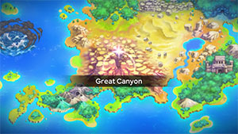
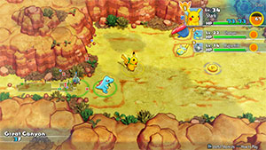

  

[Introduction]

# Overview

<table class="dungeonOverview">
  <tr>
    <th>Unlock</th>
    <td class="highlightYellow">Clear Mt. Thunder.</td>
  </tr>
</table>

<table class="dungeonTable">
  <tr>
    <th>Floors</th>
    <td>12F</td>
    <th>Job Rank</th>
    <td>E</td>
  </tr>
  <tr>
    <th>Radar / Scanning</th>
    <td>Yes</td>
    <th>Weather</th>
    <td>Clear</td>
  </tr>
  <tr>
    <th>Dark Halls</th>
    <td>No</td>
    <th>Boss</th>
    <td>None</td>
  </tr>
  <tr>
    <th>Max Team Size</th>
    <td>3</td>
    <th>Strong Foe</th>
    <td>Ambipom</td>
  </tr>
  <tr>
    <th>Bring Items</th>
    <td>Yes</td>
    <th>Shops</th>
    <td>Yes</td>
  </tr>
  <tr>
    <th>Bring Poke</th>
    <td>Yes</td>
    <th>Monster Houses</th>
    <td>No</td>
  </tr>
  <tr>
    <th>Level Reset</th>
    <td>No</td>
    <th>Mystery Houses</th>
    <td>No</td>
  </tr>
  <tr>
    <th>Clear Icon</th>
    <td>None</td>
    <th>Reward</th>
    <td>Unlock Lapis Cave.</td>
  </tr>
</table>

# Needed Camps

#### Wild

|Name|Price|Pokemon|
|-|-|-|
|Jungle|500|Vileplume|
|Flyaway Forest|500|Murkrow|
|Safari|600|Doduo, Tauros, Phanpy|
|Ravaged Field|700|Houndoom|
|Overgrown Forest|700|Heracross|
|Mushroom Forest|800|Breloom|
|Vibrant Forest|800|Ambipom|
|Withering Desert|900|Cacturne|
|Secretive Forest|900|Ariados|
|Beau Plains|2700|Skiploom|
|Echo Cave|2700|Dunsparce|

#### Fainted

|Name|Price|Pokemon|
|-|-|-|
|Safari|600|Nidorina, Nidorino|
|Ancient Relic|700|Aerodactyl|
|Mt. Green|700|Shuckle|
|Dragon Cave|3000|Bagon|
|Ice Floe Beach|6000|Spheal|

# Pokemon

Rate = Recruit rate. Red stats = Stats as an enemy. Ability colors: Caution, Dangerous Move colors: Boosting, Destroys Items, Caution, Dangerous

#### Wild

|Floor|Image|Name|Rate|Lv|HP|Atk|Def|SpA|SpD|Spe|Exp|Ability + Moves|
|-|-|-|-|-|-|-|-|-|-|-|-|-|
|1-3||Vileplume  |10.8%|21|56 60|33 31|33 27|37 39|33 25|32|36|Chlorophyll Aromatherapy / Poison Powder / Stun Spore / Mega Drain|
|1-3||Doduo  |10.8%|16|51 65|38 37|26 23|26 25|26 21|32|31|Run Away or Early Bird Peck / Growl / Quick Attack / Rage / Fury Attack / Pursuit|
|1-3||Skiploom  |10.8%|18|50 60|25 32|25 22|25 33|28 22|32|60|Chlorophyll or Leaf Guard Tackle / Synthesis / Tail Whip / Splash / Absorb / Fairy Wind / Poison Powder / Stun Spore / Sleep Powder|
|1-3||Dunsparce |10.8%|16|60 53|30 35|27 23|27 26|27 22|28|39|Serene Grace or Run Away Rage / Defense Curl / Rollout / Spite / Pursuit / Screech / Yawn / Mud-Slap|
|3-12 Foe|  |Ambipom |-6.4%|16|51 200|35 65|27 38|26 65|26 38|34|370|Technician or Pickup Scratch / Dual Chop / Tail Whip / Tickle / Sand Attack / Astonish / Baton Pass ※ Friend Bow required to recruit.|
|4-6 Rare||Phanpy |10.8%|16|60 62|37 30|34 24|26 29|26 20|27|42|Pickup Odor Sleuth / Tackle / Growl / Rollout / Flail / Defense Curl / Natural Gift|
|4-7||Breloom  |10.8%|23|59 58|54 40|39 24|35 30|36 22|39|38|Effect Spore or Poison Heal Mach Punch / Absorb / Stun Spore / Leech Seed / Mega Drain / Headbutt / Tackle / Feint / Counter|
|4-8||Murkrow  |10.8%|16|58 57|38 34|23 20|35 34|23 20|31|35|Insomnia or Super Luck Peck / Astonish / Pursuit / Haze / Wing Attack|
|4-9||Cacturne  |10.8%|32|66 60|66 39|46 21|66 39|46 20|49|30|Sand Veil Spiky Shield / Destiny Bond / Revenge / Poison Sting / Leer / Growth / Absorb / Leech Seed / Sand Attack / Needle Arm / Feint Attack / Ingrain / Payback / Spikes|
|7-11||Heracross  |10.8%|16|53 65|40 40|27 23|23 29|30 27|33|32|Swarm or Guts Arm Thrust / Bullet Seed / Night Slash / Tackle / Leer / Horn Attack / Endure / Feint / Aerial Ace / Chip Away ※ Can Mega Evolve.|
|8-12||Ariados  |10.8%|22|57 58|45 33|34 25|34 30|34 25|33|30|Swarm or Insomnia Swords Dance / Focus Energy / Absorb / Fell Stinger / Bug Bite / Poison Sting / String Shot / Infestation / Night Shade / Scary Face / Constrict / Shadow Sneak / Venom Drench|
|9-12||Tauros |10.8%|16|53 58|36 39|30 26|23 31|27 23|35|40|Intimidate or Anger Point Tackle / Tail Whip / Rage / Horn Attack / Scary Face / Pursuit|
|10-12||Houndoom  |10.8%|24|59 59|49 35|32 21|49 30|36 20|44|32|Early Bird or Flash Fire Inferno / Nasty Plot / Thunder Fang / Leer / Ember / Howl / Smog / Roar / Bite / Odor Sleuth ※ Can Mega Evolve.|

#### Fainted

|Image|Name|Lv|HP|Atk|Def|SpA|SpD|Spe|
|-|-|-|-|-|-|-|-|-|
||Nidorina |18|53|29|28|28|25|30|
||Nidorino |18|53|32|28|28|25|32|
||Aerodactyl  |20|56|43|32|32|32|44|
||Shuckle  |18|46|22|58|22|58|25|
||Spheal  |18|60|28|28|32|28|30|
||Bagon |18|53|39|32|28|25|30|

# Items

#### Floor

|Name|Floors|Rate|
|-|-|-|
|Apple|1-12|8.23%|
|Poke|1-12|69.6%|
|Max Ether|1-12|9.49%|
|Blast Seed|1-12|0.737%|
|Cheri Berry|1-12|0.737%|
|Chesto Berry|1-12|0.368%|
|Eyedrop Seed|1-12|1.47%|
|Oran Berry|1-12|3.68%|
|Pecha Berry|1-12|1.84%|
|Rawst Berry|1-12|1.1%|
|Sleep Seed|1-12|0.737%|
|Stun Seed|1-12|0.368%|
|Tiny Reviver Seed|1-12|1.1%|
|Totter Seed|1-12|0.368%|
|Training Seed|1-12|0.184%|

#### Shop

|Name|Rate|
|-|-|
|Apple|25.0%|
|All Dodge Orb|1.22%|
|All Power-Up Orb|1.22%|
|Foe-Hold Orb|3.68%|
|Foe-Seal Orb|2.45%|
|Nullify Orb|1.22%|
|Petrify Orb|1.22%|
|Quick Orb|1.22%|
|Rollcall Orb|1.22%|
|Slow Orb|1.22%|
|Slumber Orb|2.45%|
|Totter Orb|1.22%|
|Trawl Orb|0.612%|
|Wigglytuff Orb|12.2%|
|Max Ether|18.8%|
|Blast Seed|1.37%|
|Cheri Berry|1.37%|
|Chesto Berry|0.685%|
|Eyedrop Seed|2.75%|
|Oran Berry|6.18%|
|Pecha Berry|2.75%|
|Rawst Berry|2.06%|
|Sleep Seed|1.37%|
|Stun Seed|0.685%|
|Tiny Reviver Seed|4.8%|
|Totter Seed|0.685%|
|Training Seed|0.342%|

#### Pretty Box

|Name|Rate|
|-|-|
|Bronze Dojo Ticket|30.8%|
|Oran Berry|11.5%|
|Calcium|0.689%|
|Carbos|0.689%|
|Iron|0.689%|
|Protein|0.689%|
|Rainbow Gummi|34.4%|
|Sitrus Berry|0.689%|
|Zinc|0.689%|
|(Random TM)|19.2%|

#### Deluxe Box

|Name|Rate|
|-|-|
|Gold Dojo Ticket|3.48%|
|Silver Dojo Ticket|13.9%|
|Reviver Seed|6.5%|
|Tiny Reviver Seed|6.5%|
|Calcium|0.934%|
|Carbos|0.934%|
|DX Gummi|23.3%|
|Iron|0.934%|
|Protein|0.934%|
|Rainbow Gummi|23.3%|
|Sitrus Berry|0.934%|
|Zinc|0.934%|
|(Random TM)|17.4%|

# Traps

|Name|
|-|
|Wonder Tile|
|Training Switch|
|Spin Trap|
|Slumber Trap|
|Spiky Trap|
|Gust Trap|
