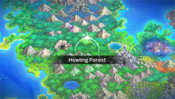
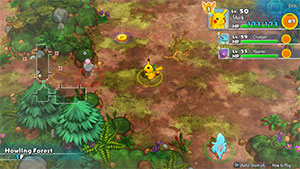

  

# Overview

<table class="dungeonOverview">
  <tr>
    <th>Unlock</th>
    <td class="highlightYellow">Clear Sky Tower → 1 day later (Check Bulletin Board).</td>
  </tr>
</table>

<table class="dungeonTable">
  <tr>
    <th>Floors</th>
    <td>15F</td>
    <th>Job Rank</th>
    <td>A</td>
  </tr>
  <tr>
    <th>Radar / Scanning</th>
    <td>No</td>
    <th>Weather</th>
    <td>Clear</td>
  </tr>
  <tr>
    <th>Dark Halls</th>
    <td>No</td>
    <th>Boss</th>
    <td>None</td>
  </tr>
  <tr>
    <th>Max Team Size</th>
    <td>3</td>
    <th>Strong Foe</th>
    <td>Butterfree</td>
  </tr>
  <tr>
    <th>Bring Items</th>
    <td>Yes</td>
    <th>Shops</th>
    <td>Yes</td>
  </tr>
  <tr>
    <th>Bring Poke</th>
    <td>Yes</td>
    <th>Monster Houses</th>
    <td>Yes</td>
  </tr>
  <tr>
    <th>Level Reset</th>
    <td>No</td>
    <th>Mystery Houses</th>
    <td>Yes (Fixed: 10F)</td>
  </tr>
  <tr>
    <th>Clear Icon</th>
    <td></td>
    <th>Reward</th>
    <td>Smeargle joins</td>
  </tr>
</table>

Post-game dungeon that can be unlocked shortly after clearing the main story. Despite the ease of access and short length, it can be tricky to clear it immediately following Sky Tower. If you wish to do so, you'll likely want a move like Swords Dance or Nasty Plot to boost damage output. Magcargo (Magma Cavern) with Earth Power, Flame Burst, and Shell Smash is particularly good as an attacker. For support, Vileplume (Great Canyon) with Aromatherapy, Moonlight, and Stun Spore is a good choice.

Evolution Crystals (1000 Poke) can appear in shops, so don't forget to bring some money. Most enemies resist Psychic type moves, and Uproar doesn't work against the Whismur line even with Steamroll. There's a guaranteed Mystery House on 10F, unless it gets overriden by a rescue job or fainted Pokemon. The Lv25 Smeargle who joins always has Own Tempo as an ability, and can't be released.

# Needed Camps

#### Wild

|Name|Price|Pokemon|
|-|-|-|
|Wild Plains|-|Poochyena, Mightyena|
|Stump Forest|-|Butterfree|
|Jungle|500|Exeggcute|
|Ravaged Field|700|Houndour, Houndoom|
|Mt. Green|700|Spoink, Grumpig|
|Echo Cave|2700|Whismur, Loudred|

#### Fainted

|Name|Price|Pokemon|
|-|-|-|
|Stump Forest|-|Caterpie, Ledian|
|Darkness Ridge|-|Sableye|
|Flyaway Forest|500|Hoothoot, Murkrow|
|Mt. Green|700|Geodude|
|Overgrown Forest|700|Heracross|
|Vibrant Forest|800|Mankey|
|Rub-a-Dub River|3000|Volbeat|
|Treasure Sea|9000|Armaldo|

#### Mystery House

|Name|Price|Pokemon|
|-|-|-|
|Wild Plains|-|Poochyena, Mightyena|
|Sky-Blue Plains|-|Snubbull, Granbull|
|Darkness Ridge|-|Sneasel, Weavile, Absol|
|Scorched Plains|700|Growlithe|
|Ravaged Field|700|Houndour, Houndoom|
|Vibrant Forest|800|Munchlax|

# Pokemon

Rate = Recruit rate. Red stats = Stats as an enemy. Ability colors: Caution, Dangerous Move colors: Boosting, Destroys Items, Caution, Dangerous

#### Wild

|Floor|Image|Name|Rate|Lv|HP|Atk|Def|SpA|SpD|Spe|Exp|Ability + Moves|
|-|-|-|-|-|-|-|-|-|-|-|-|-|
|1-2||Exeggcute  |14.4%|40|81 109|67 60|54 51|73 65|48 47|67 67|85|Chlorophyll Barrage / Uproar / Stun Spore / Reflect / Leech Seed / Bullet Seed / Confusion / Hypnosis / Sleep Powder / Natural Gift / Worry Seed / Poison Powder|
|1-10||Whismur |8.2%|40|73 105|60 53|44 45|53 45|43 44|67 67|70|Soundproof Pound / Uproar / Screech / Astonish / Echoed Voice / Supersonic / Stomp / Hyper Voice / Howl / Rest / Sleep Talk / Roar|
|1-10||Spoink |8.2%|40|72 118|45 55|49 44|57 69|63 48|61 61|80|Thick Fat or Own Tempo Splash / Psywave / Odor Sleuth / Rest / Power Gem / Psych Up / Confuse Ray / Magic Coat / Zen Headbutt / Payback / Snore / Psybeam / Psyshock|
|2-10||Houndour  |14.4%|40|72 113|67 67|44 46|67 67|48 45|63 63|75|Early Bird or Flash Fire Leer / Ember / Howl / Smog / Roar / Bite / Odor Sleuth / Beat Up / Embargo / Fire Fang / Feint Attack / Foul Play|
|2-10||Poochyena |14.4%|40|72 104|67 67|49 45|51 51|48 46|60 60|72|Run Away or Quick Feet Tackle / Howl / Sand Attack / Crunch / Odor Sleuth / Roar / Swagger / Yawn / Scary Face / Take Down / Assurance / Embargo / Taunt / Bite|
|6-15 Foe|  |Butterfree  |-6.4%|60|86 455|54 150|55 65|69 150|45 65|85 200|790|Compound Eyes Air Slash / Confusion / Poison Powder / Stun Spore / Sleep Powder / Psybeam / Silver Wind / Supersonic / Safeguard / Whirlwind / Bug Buzz / Rage Powder / Quiver Dance / Captivate / Tailwind / Gust ※ Friend Bow required to recruit.|
|11-15||Loudred |8.2%|40|73 105|60 65|44 46|53 58|43 47|67 67|90|Soundproof Pound / Uproar / Screech / Astonish / Echoed Voice / Supersonic / Stomp / Howl / Rest / Roar / Bite|
|11-15||Grumpig |8.2%|40|72 118|45 58|49 51|57 72|63 50|61 61|88|Thick Fat or Own Tempo Splash / Psywave / Odor Sleuth / Rest / Power Gem / Psych Up / Confuse Ray / Magic Coat / Zen Headbutt / Belch / Snore / Psybeam / Teeter Dance|
|11-15||Houndoom  |10.8%|40|72 116|67 67|44 53|67 72|48 52|63 63|82|Early Bird or Flash Fire Thunder Fang / Beat Up / Smog / Bite / Leer / Roar / Howl / Inferno / Ember / Odor Sleuth / Feint Attack / Nasty Plot / Fire Fang ※ Can Mega Evolve.|
|11-15||Mightyena |10.8%|40|72 104|67 70|49 54|51 66|48 51|60 60|84|Intimidate or Quick Feet Snarl / Fire Fang / Thunder Fang / Bite / Tackle / Ice Fang / Embargo / Crunch / Howl / Sand Attack / Swagger / Taunt / Roar / Scary Face / Assurance / Thief / Odor Sleuth|

#### Fainted

|Image|Name|Lv|HP|Atk|Def|SpA|SpD|Spe|
|-|-|-|-|-|-|-|-|-|
||Caterpie |42|70|42|49|48|39|56|
||Mankey |42|74|69|49|52|49|68|
||Geodude  |42|70|72|64|49|44|56|
||Hoothoot  |42|82|52|44|59|54|62|
||Ledian  |44|70|47|45|53|65|81|
||Murkrow  |42|82|75|44|69|44|74|
||Heracross  |42|74|75|49|46|54|77|
||Sableye  |42|69|59|49|52|49|71|
||Volbeat |44|75|60|50|47|50|67|
||Armaldo  |44|75|77|55|53|50|61|

#### Mystery House

|Image|Name|Image|Name|Image|Name|Image|Name|
|-|-|-|-|-|-|-|-|
||Growlithe ||Munchlax ||Snubbull ||Granbull |
||Sneasel  ||Weavile  ||Houndour  ||Houndoom  |
||Poochyena ||Mightyena ||Absol |||

# Items

#### Floor

|Name|Floors|Rate|
|-|-|-|
|Efficient Bandanna|1-14|0.801%|
|Goggle Specs|1-14|0.201%|
|Gold Ribbon|1-14|0.0201%|
|Heal Ribbon|1-14|0.201%|
|Insomniscope|1-14|0.201%|
|Joy Ribbon|1-14|0.201%|
|Nullify Bandanna|1-14|0.401%|
|Pecha Scarf|1-14|0.201%|
|Persim Band|1-14|0.201%|
|Recovery Scarf|1-14|0.201%|
|Scope Lens|1-14|0.201%|
|Weather Band|1-14|0.201%|
|X-Ray Specs|1-14|0.201%|
|Apple|1-14|6.7%|
|Big Apple|1-14|6.7%|
|Poke|1-14|56.5%|
|Max Elixir|1-14|1.24%|
|Max Ether|1-14|4.14%|
|Blast Seed|1-14|0.858%|
|Cheri Berry|1-14|0.858%|
|Chesto Berry|1-14|0.43%|
|Empowerment Seed|1-14|0.858%|
|Eyedrop Seed|1-14|1.72%|
|Oran Berry|1-14|4.3%|
|Pecha Berry|1-14|2.14%|
|Rawst Berry|1-14|1.29%|
|Sleep Seed|1-14|0.858%|
|Stun Seed|1-14|0.43%|
|Tiny Reviver Seed|1-14|1.29%|
|Totter Seed|1-14|0.43%|
|Training Seed|1-14|0.214%|
|Warp Seed|1-14|0.43%|
|Confuse Wand|1-14|0.283%|
|Guiding Wand|1-14|0.283%|
|HP-Swap Wand|1-14|0.283%|
|Petrify Wand|1-14|0.283%|
|Pounce Wand|1-14|0.565%|
|Slow Wand|1-14|0.283%|
|Slumber Wand|1-14|0.565%|
|Stayaway Wand|1-14|0.85%|
|Surround Wand|1-14|0.565%|
|Switcher Wand|1-14|0.283%|
|Tunnel Wand|1-14|0.283%|
|Two-Edged Wand|1-14|0.283%|
|Warp Wand|1-14|0.283%|
|Whirlwind Wand|1-14|0.283%|

#### Shop

|Name|Rate|
|-|-|
|Efficient Bandanna|2.28%|
|Goggle Specs|0.571%|
|Heal Ribbon|0.571%|
|Insomniscope|0.571%|
|Joy Ribbon|0.571%|
|Nullify Bandanna|1.15%|
|Pecha Scarf|0.571%|
|Persim Band|0.571%|
|Prosper Ribbon|0.571%|
|Recovery Scarf|0.571%|
|Scope Lens|0.571%|
|Weather Band|0.571%|
|X-Ray Specs|0.571%|
|Evolution Crystal|5.83%|
|Big Apple|6.8%|
|All Dodge Orb|0.472%|
|All Power-Up Orb|0.472%|
|All Protect Orb|0.472%|
|Bank Orb|0.472%|
|Cleanse Orb|0.472%|
|Decoy Orb|0.472%|
|Drought Orb|0.472%|
|Evasion Orb|0.472%|
|Foe-Hold Orb|0.472%|
|Foe-Seal Orb|0.472%|
|Health Orb|0.472%|
|Helper Orb|0.472%|
|Inviting Orb|0.472%|
|Lasso Orb|0.472%|
|Mobile Orb|0.472%|
|Monster Orb|0.472%|
|Nullify Orb|0.472%|
|One-Room Orb|0.472%|
|One-Shot Orb|0.472%|
|Rare Quality Orb|0.472%|
|Reset Orb|0.472%|
|Revive All Orb|0.472%|
|See-Trap Orb|0.472%|
|Spurn Orb|0.472%|
|Trapbust Orb|0.472%|
|Weather Lock Orb|0.472%|
|Wigglytuff Orb|2.35%|
|Max Elixir|9.71%|
|Ban Seed|0.868%|
|Cheri Berry|1.74%|
|Chesto Berry|1.74%|
|Decoy Seed|0.868%|
|Empowerment Seed|1.74%|
|Energy Seed|0.868%|
|Pecha Berry|4.35%|
|Pure Seed|0.868%|
|Quick Seed|2.6%|
|Rawst Berry|2.6%|
|Reviver Seed|0.868%|
|Stun Seed|1.74%|
|Tiny Reviver Seed|2.6%|
|Violent Seed|0.868%|
|Iron Spike|4.85%|
|Geo Pebble|4.85%|
|(Random TM)|9.71%|
|Guiding Wand|1.29%|
|HP-Swap Wand|0.648%|
|Pounce Wand|1.29%|
|Slow Wand|1.29%|
|Stayaway Wand|1.29%|
|Surround Wand|1.29%|
|Tunnel Wand|1.29%|
|Two-Edged Wand|0.648%|
|Warp Wand|0.648%|

# Traps

|Name|
|-|
|Wonder Tile|
|Training Switch|
|Slumber Trap|
|Poison Trap|
|Spiky Trap|
|Gust Trap|
|Slow Trap|
|Blast Trap|
|Hunger Trap|
|Seal Trap|
|Summon Trap|
|Warp Trap|
|PP Leech Trap|
