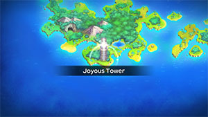

  

# Overview

<table class="dungeonOverview">
  <tr>
    <th>Unlock</th>
    <td class="highlightYellow">Clear Pitfall Valley.</td>
  </tr>
</table>

<table class="dungeonTable">
  <tr>
    <th>Floors</th>
    <td>99F</td>
    <th>Job Rank</th>
    <td>⭐︎⭐︎</td>
  </tr>
  <tr>
    <th>Radar / Scanning</th>
    <td>No</td>
    <th>Weather</th>
    <td>Random: 9-10, 19-20, 29-30, 39-40, 49, 59-60F</td>
  </tr>
  <tr>
    <th>Dark Halls</th>
    <td>No</td>
    <th>Boss</th>
    <td>None</td>
  </tr>
  <tr>
    <th>Max Team Size</th>
    <td>3</td>
    <th>Strong Foe</th>
    <td>None</td>
  </tr>
  <tr>
    <th>Bring Items</th>
    <td>No</td>
    <th>Shops</th>
    <td>Yes</td>
  </tr>
  <tr>
    <th>Bring Poke</th>
    <td>No</td>
    <th>Monster Houses</th>
    <td>Yes</td>
  </tr>
  <tr>
    <th>Level Reset</th>
    <td>Yes</td>
    <th>Mystery Houses</th>
    <td>No</td>
  </tr>
  <tr>
    <th>Clear Icon</th>
    <td>None</td>
    <th>Reward</th>
    <td>Joy Seed x 3, Deluxe Box x 12</td>
  </tr>
</table>

Optional post-game dungeon where your team starts at Lv5 and no carry-in items are allowed. The reward isn't worth the effort, but some Pokemon can only be encountered in the wild in this dungeon. That said, it's often easier to recruit the Joyous Tower species as fainted Pokemon in other dungeons.

Enemies other than Shedinja will always catch thrown items, except for Silver Spikes. One option to get around this is to bring an ally who has Thrown Item Boost (Rare Quality). Keep an eye on the message log so you don't get caught off guard by an item picked up by an enemy.

#### Joyous Tower Exclusives

<table>
  <tr>
    <td class="highlightGray">Pichu</td>
    <td>1-4F</td>
    <td class="highlightGray">Treecko</td>
    <td>1-4F</td>
    <td class="highlightGray">Happiny</td>
    <td>1-4F *1</td>
    <td class="highlightGray">Bulbasaur</td>
    <td>1-5F</td>
    <td class="highlightGray">Chikorita</td>
    <td>4-7F</td>
  </tr>
  <tr>
    <td class="highlightGray">Metapod</td>
    <td>4-8F</td>
    <td class="highlightGray">Psyduck</td>
    <td>6-11F</td>
    <td class="highlightGray">Torchic</td>
    <td>7-10F</td>
    <td class="highlightGray">Kakuna</td>
    <td>9-13F</td>
    <td class="highlightGray">Eevee</td>
    <td>12-17F</td>
  </tr>
  <tr>
    <td class="highlightGray">Cyndaquil</td>
    <td>13-17F</td>
    <td class="highlightGray">Smoochum</td>
    <td>17-22F</td>
    <td class="highlightGray">Skitty</td>
    <td>20-25F</td>
    <td class="highlightGray">Clefable</td>
    <td>22-29F</td>
    <td class="highlightGray">Gardevoir</td>
    <td>30-36F</td>
  </tr>
  <tr>
    <td class="highlightGray">Bellossom</td>
    <td>30-38F</td>
    <td class="highlightGray">Igglybuff</td>
    <td>40-46F</td>
    <td class="highlightGray">Wigglytuff</td>
    <td>50-56F</td>
    <td class="highlightGray">Chansey</td>
    <td>50/60/77F</td>
    <td class="highlightGray">Victreebel</td>
    <td>51-55F</td>
  </tr>
  <tr>
    <td class="highlightGray">Kecleon</td>
    <td>51-98F</td>
    <td class="highlightGray">Granbull</td>
    <td>60-69F</td>
    <td class="highlightGray">Persian</td>
    <td>76-79F *1</td>
    <td class="highlightGray">Kangaskhan</td>
    <td>76-79F *1</td>
    <td class="highlightGray">Blissey</td>
    <td>88F</td>
  </tr>
</table>

*1: Also appears on 97-98F.

# Pokemon

Rate = Recruit rate. Red stats = Stats as an enemy. Ability colors: Caution, Dangerous Move colors: Boosting, Destroys Items, Caution, Dangerous

#### Wild

|Floor|Image|Name|Rate|Lv|HP|Atk|Def|SpA|SpD|Spe|Exp|Ability + Moves|
|-|-|-|-|-|-|-|-|-|-|-|-|-|
|1-3||Jigglypuff  |16.9%|8|53 18|14 10|11 8|14 10|11 8|12 19|18|Cute Charm or Competitive Sing / Defense Curl / Pound|
|1-4||Pichu |16.9%|9|51 18|21 9|19 7|32 9|20 7|25 13|20|Static Thunder Shock / Charm / Tail Whip|
|1-4||Treecko |16.9%|9|47 15|19 9|18 7|22 8|19 7|24 13|20|Overgrow Pound / Leer / Absorb / Quick Attack|
|1-4 97-98||Happiny |16.9%|7|56 20|10 9|10 8|11 10|16 8|14 19|15|Natural Cure or Serene Grace Pound / Charm / Copycat|
|1-5||Bulbasaur  |16.9%|8|46 14|18 9|17 5|20 9|19 5|21 7|18|Overgrow Tackle / Growl / Leech Seed|
|4-6||Diglett |14.4%|10|42 20|21 10|15 8|16 9|18 8|25 19|23|Sand Veil or Arena Trap Astonish / Sand Attack / Mud-Slap / Growl / Scratch|
|4-7||Chikorita |16.9%|11|47 21|20 14|22 11|19 12|20 11|21 21|25|Overgrow Growl / Poison Powder / Razor Leaf / Tackle|
|4-8||Metapod |10.8%|10|44 18|15 9|18 8|13 10|13 8|19 19|23|Shed Skin Harden|
|6-11||Psyduck |16.9%|11|47 21|22 14|19 11|25 14|19 10|23 21|25|Damp or Cloud Nine Water Sport / Scratch / Confusion / Tail Whip / Water Gun|
|7-10||Torchic |16.9%|12|50 29|25 18|22 14|25 18|22 14|24 22|30|Blaze Sand Attack / Scratch / Growl / Ember|
|9-11||Pinsir |14.4%|13|50 38|35 28|26 18|23 21|23 16|28 24|30|Hyper Cutter or Mold Breaker Bind / Focus Energy / Seismic Toss / Vise Grip / Harden ※ Can Mega Evolve.|
|9-13||Kakuna  |10.8%|12|46 26|17 16|18 15|15 20|15 14|21 22|30|Shed Skin Harden|
|9-14||Clefairy |6.4%|13|49 34|18 21|18 16|22 19|22 16|20 24|30|Cute Charm or Magic Guard Spotlight / Disarming Voice / Pound / Growl / Encore / Sing / Double Slap / Defense Curl|
|10-12||Minun |14.4%|14|51 48|22 23|21 18|27 25|26 18|30 25|35|Minus Nuzzle / Play Nice / Thunder Wave / Growl / Quick Attack / Helping Hand / Spark / Encore / Switcheroo|
|10-12||Plusle |14.4%|14|51 48|24 23|21 17|27 23|24 18|30 25|35|Plus Nuzzle / Play Nice / Thunder Wave / Growl / Quick Attack / Helping Hand / Spark / Encore / Bestow|
|12-17||Eevee |16.9%|15|58 50|25 26|24 20|32 28|28 20|28 26|40|Run Away or Adaptability Tackle / Helping Hand / Tail Whip / Growl / Sand Attack / Baby-Doll Eyes / Covet / Quick Attack|
|13-17||Cyndaquil |16.9%|15|53 50|27 26|26 18|30 26|26 18|31 26|40|Blaze Tackle / Leer / Quick Attack / Ember / Smokescreen|
|14-16||Beldum  |14.4%|16|51 50|29 28|30 22|26 28|27 22|27 27|45|Clear Body Take Down|
|15-19||Scyther  |14.4%|16|53 60|42 38|30 22|27 38|27 22|32 27|45|Swarm or Technician Vacuum Wave / Quick Attack / Leer / Focus Energy / Pursuit / False Swipe|
|15-20||Exeggutor  |14.4%|16|58 50|33 31|30 25|37 25|26 22|27 27|45|Chlorophyll Seed Bomb / Confusion / Hypnosis / Barrage / Stomp|
|17-20||Linoone |14.4%|20|55 77|34 40|31 29|27 40|31 29|37 39|65|Pickup or Gluttony Odor Sleuth / Sand Attack / Rototiller / Tackle / Headbutt / Tail Whip / Growl / Mud Sport / Switcheroo / Play Rough / Fury Swipes|
|17-22||Smoochum  |1.6%|17|52 58|27 26|23 21|40 29|31 23|33 28|50|Oblivious or Forewarn Pound / Sweet Kiss / Powder Snow / Lick / Confusion|
|18-20||Slakoth |14.4%|17|54 58|31 29|31 23|27 29|24 21|31 28|50|Truant Scratch / Yawn / Encore / Slack Off / Feint Attack / Amnesia|
|19-23||Sunflora |14.4%|18|53 61|31 34|28 24|36 28|30 24|28 29|55|Chlorophyll or Solar Power Flower Shield / Growth / Razor Leaf / Ingrain / Grass Whistle / Mega Drain / Pound / Leech Seed / Absorb|
|20-25||Skitty |16.9%|18|53 61|29 31|32 24|28 41|29 22|30 29|55|Cute Charm or Normalize Fake Out / Growl / Tail Whip / Tackle / Disarming Voice / Foresight / Attract / Sing / Double Slap|
|21-25||Shroomish |14.4%|18|55 61|43 31|32 24|28 28|29 24|31 29|55|Effect Spore or Poison Heal Leech Seed / Headbutt / Stun Spore / Tackle / Absorb / Mega Drain|
|22-25||Ledyba  |14.4%|19|51 71|26 29|27 23|30 36|40 25|35 30|60|Swarm or Early Bird Tackle / Supersonic / Light Screen / Mach Punch / Reflect / Safeguard / Swift / Silver Wind|
|22-29||Clefable |16.9%|19|54 65|26 36|26 25|30 33|30 25|28 30|60|Cute Charm or Magic Guard Spotlight / Disarming Voice / Sing / Double Slap / Minimize / Metronome|
|23-27||Farfetch'd  |14.4%|20|52 65|32 34|32 26|32 34|32 26|33 31|65|Keen Eye or Inner Focus Peck / Fury Cutter / Leer / Brave Bird / Sand Attack / Slash / Poison Jab / Aerial Ace / Fury Attack / Knock Off|
|23-28||Dugtrio |8.2%|26|56 98|44 58|35 35|35 53|39 35|49 53|95|Sand Veil or Arena Trap Sand Tomb / Mud-Slap / Night Slash / Tri Attack / Magnitude / Sand Attack / Scratch / Mud Bomb / Sucker Punch / Rototiller / Astonish / Bulldoze / Growl|
|25-27||Houndour  |14.4%|20|55 72|42 34|28 24|42 34|31 24|38 31|65|Early Bird or Flash Fire Odor Sleuth / Howl / Smog / Ember / Roar / Leer / Bite|
|26-28||Trapinch |14.4%|21|53 83|38 36|29 27|29 33|29 25|35 33|70|Hyper Cutter or Arena Trap Sand Attack / Bite / Sand Tomb / Dig / Rock Slide / Feint Attack / Bulldoze / Bide / Mud-Slap|
|26-30||Teddiursa |14.4%|20|63 65|49 37|31 26|34 37|31 24|32 31|65|Pickup or Quick Feet Scratch / Fling / Feint Attack / Covet / Baby-Doll Eyes / Lick / Fury Swipes / Fake Tears|
|27-30||Dustox  |14.4%|21|53 75|29 33|31 27|25 33|25 27|29 33|70|Shield Dust Gust / Poison Powder / Venoshock / Moonlight / Confusion|
|27-32||Spinarak  |14.4%|21|56 75|43 33|32 25|32 33|32 25|32 33|70|Swarm or Insomnia Poison Sting / String Shot / Constrict / Absorb / Infestation / Night Shade / Scary Face / Shadow Sneak|
|28-34||Weedle  |14.4%|22|53 84|27 31|30 26|26 35|26 26|34 36|75|Shield Dust Poison Sting / String Shot / Bug Bite|
|30-36||Gardevoir  |16.9%|30|60 121|40 56|40 38|45 62|40 42|47 57|115|Synchronize or Trace Misty Terrain / Stored Power / Growl / Healing Wish / Double Team / Wish / Confusion / Teleport / Magical Leaf / Moonblast / Heal Pulse / Calm Mind / Draining Kiss / Disarming Voice ※ Can Mega Evolve.|
|30-38||Bellossom |16.9%|26|61 98|39 58|39 39|44 47|39 39|38 53|95|Chlorophyll Sweet Scent / Stun Spore / Sunny Day / Mega Drain / Leaf Storm / Leaf Blade / Magical Leaf|
|31-35||Beedrill  |14.4%|23|54 85|28 40|31 27|27 48|27 29|35 39|80|Swarm Focus Energy / Fury Attack / Pursuit / Rage / Twineedle / Venoshock ※ Can Mega Evolve.|
|31-35||Gligar  |10.8%|23|59 85|47 40|48 32|31 36|36 29|43 39|80|Hyper Cutter or Sand Veil Poison Sting / Sand Attack / Harden / Knock Off / Fury Cutter / Feint Attack / Quick Attack / Acrobatics|
|31-36||Stantler |10.8%|23|55 85|48 40|48 29|36 32|40 29|37 39|80|Intimidate or Frisk Me First / Tackle / Astonish / Stomp / Take Down / Hypnosis / Sand Attack / Leer / Confuse Ray|
|35-38||Cacnea |10.8%|23|58 77|51 40|35 27|51 32|35 27|37 39|80|Sand Veil Poison Sting / Leer / Absorb / Growth / Leech Seed / Sand Attack / Ingrain / Feint Attack / Needle Arm|
|35-39||Doduo  |10.8%|23|58 85|51 40|35 29|35 40|35 27|42 39|80|Run Away or Early Bird Peck / Growl / Quick Attack / Pursuit / Fury Attack / Rage / Pluck / Double Hit|
|36-40||Manectric |10.8%|26|61 108|43 58|39 35|52 58|39 35|49 53|95|Static or Lightning Rod Fire Fang / Tackle / Electric Terrain / Leer / Howl / Thunder Wave / Spark / Thunder Fang / Quick Attack / Bite / Odor Sleuth ※ Can Mega Evolve.|
|39-42||Heracross  |10.8%|23|59 85|52 48|36 29|31 48|40 42|43 39|80|Swarm or Guts Arm Thrust / Bullet Seed / Aerial Ace / Counter / Night Slash / Horn Attack / Endure / Feint / Tackle / Chip Away / Leer ※ Can Mega Evolve.|
|39-43||Breloom  |10.8%|23|59 88|54 54|39 32|35 41|36 32|39 48|80|Effect Spore or Poison Heal Mach Punch / Absorb / Stun Spore / Headbutt / Leech Seed / Mega Drain / Tackle / Feint / Counter|
|40-44||Tauros |10.8%|24|60 94|50 51|41 33|32 38|37 30|47 42|85|Intimidate or Anger Point Tackle / Tail Whip / Pursuit / Payback / Horn Attack / Rage / Scary Face / Rest|
|40-46||Igglybuff  |16.9%|24|72 86|32 34|28 27|32 38|28 27|33 42|85|Cute Charm or Competitive Sing / Charm / Defense Curl / Pound / Sweet Kiss / Copycat|
|41-46||Houndoom  |10.8%|24|59 93|49 52|32 34|49 47|36 34|44 51|85|Early Bird or Flash Fire Odor Sleuth / Nasty Plot / Leer / Bite / Thunder Fang / Smog / Roar / Ember / Howl / Inferno ※ Can Mega Evolve.|
|42-46||Skiploom  |10.8%|24|55 86|32 38|32 30|32 38|36 30|41 42|85|Chlorophyll or Leaf Guard Splash / Synthesis / Sleep Powder / Fairy Wind / Tail Whip / Stun Spore / Tackle / Poison Powder / Leech Seed / Absorb / Bullet Seed|
|42-46||Ariados  |10.8%|24|59 87|49 43|36 31|36 52|36 31|36 45|85|Swarm or Insomnia Poison Sting / String Shot / Constrict / Absorb / Focus Energy / Night Shade / Scary Face / Swords Dance / Bug Bite / Venom Drench / Shadow Sneak / Infestation / Fury Swipes / Fell Stinger|
|43-44||Dunsparce |10.8%|24|68 86|41 42|37 30|37 38|37 30|38 42|85|Serene Grace or Run Away Rage / Defense Curl / Rollout / Yawn / Spite / Pursuit / Screech / Mud-Slap / Ancient Power / Body Slam / Drill Run|
|44-49||Nincada  |10.8%|24|59 94|48 38|33 33|32 38|32 27|50 42|85|Compound Eyes Scratch / Sand Attack / Metal Claw / Absorb / Fury Swipes / Mud-Slap / Harden|
|44-49||Shedinja  |-25.0%|24|26 78|54 42|29 30|34 34|32 27|48 42|85|Wonder Guard Harden / Sand Attack / Absorb / Spite / Scratch / Fury Swipes / Shadow Sneak ※ Spawns after Nincada faints.|
|47-49||Bagon |10.8%|25|60 87|51 43|42 31|38 52|33 28|40 45|90|Rock Head Rage / Leer / Bite / Headbutt / Ember / Focus Energy / Dragon Breath / Crunch|
|47-50||Tangela |10.8%|24|67 78|49 38|50 33|50 34|32 27|38 42|85|Chlorophyll or Leaf Guard Ingrain / Constrict / Sleep Powder / Vine Whip / Absorb / Bind / Growth / Poison Powder / Mega Drain|
|47-50||Magmar |10.8%|30|65 121|60 62|45 38|60 75|50 38|53 57|115|Flame Body Ember / Smokescreen / Flame Burst / Leer / Smog / Feint Attack / Fire Spin / Fire Punch / Clear Smog / Confuse Ray|
|50-55||Electrode |8.2%|30|65 143|45 56|45 38|50 62|45 38|59 57|115|Soundproof or Static Magnetic Flux / Charge / Sonic Boom / Tackle / Eerie Impulse / Charge Beam / Spark / Light Screen / Screech / Swift / Electro Ball / Self-Destruct / Rollout|
|50-56||Wigglytuff  |16.9%|25|73 79|34 43|29 31|34 39|29 28|34 45|90|Cute Charm or Competitive Defense Curl / Play Rough / Disable / Sing / Double-Edge / Double Slap|
|50-56||Azumarill  |10.8%|25|60 111|29 39|34 31|29 35|34 31|37 45|90|Thick Fat or Huge Power Bubble / Aqua Tail / Helping Hand / Tail Whip / Water Gun / Defense Curl / Rollout / Bubble Beam / Play Rough / Water Sport / Tackle|
|50 60 77||Chansey |16.9%|25|90 87|29 35|29 28|33 43|42 35|39 45|90|Natural Cure or Serene Grace Double-Edge / Defense Curl / Pound / Refresh / Soft-Boiled / Double Slap / Tail Whip / Growl / Bestow / Minimize|
|51-54||Fearow  |10.8%|25|60 95|51 43|38 31|38 39|37 31|45 45|90|Keen Eye Drill Run / Pluck / Growl / Aerial Ace / Peck / Leer / Mirror Move / Pursuit / Fury Attack / Assurance|
|51-55||Victreebel  |16.9%|25|60 87|51 52|34 31|42 39|33 31|39 45|90|Chlorophyll Leaf Tornado / Sweet Scent / Spit Up / Sleep Powder / Razor Leaf / Stockpile / Vine Whip / Swallow|
|51-55||Magby |10.8%|25|60 87|51 43|38 28|51 52|42 28|45 45|90|Flame Body Ember / Smokescreen / Flame Burst / Leer / Smog / Feint Attack / Fire Spin / Clear Smog|
|51-98||Kecleon |16.9%|5|31 ?|18 ?|10 ?|13 ?|13 ?|17 ?|10|Color Change Thief / Tail Whip / Astonish / Scratch / Lick / Bind|
|52-59||Ditto |10.8%|25|56 79|38 39|34 31|34 43|34 28|40 45|90|Limber Transform|
|56-60||Mightyena |10.8%|25|60 87|51 43|38 31|37 39|37 31|42 45|90|Intimidate or Quick Feet Ice Fang / Thunder Fang / Fire Fang / Snarl / Crunch / Thief / Odor Sleuth / Howl / Sand Attack / Tackle / Roar / Bite / Swagger / Assurance|
|57-59||Rapidash |-2.2%|40|72 139|67 67|49 44|57 61|48 44|76 70|165|Run Away or Flash Fire Fury Attack / Poison Jab / Megahorn / Quick Attack / Fire Spin / Tail Whip / Ember / Flame Wheel / Flame Charge / Stomp / Growl / Take Down / Agility / Inferno|
|57-59||Torkoal |10.8%|25|60 87|43 43|56 38|43 43|38 31|34 45|90|White Smoke or Drought Ember / Smog / Withdraw / Fire Spin / Rapid Spin / Smokescreen / Curse / Flame Wheel / Lava Plume|
|58-61||Rhyhorn  |10.8%|26|70 88|61 45|53 36|35 45|35 29|38 48|95|Lightning Rod or Rock Head Horn Attack / Tail Whip / Scary Face / Fury Attack / Smack Down / Bulldoze / Stomp / Chip Away|
|58-62||Snorunt |10.8%|26|61 88|44 41|43 32|43 36|39 29|44 48|95|Inner Focus or Ice Body Powder Snow / Leer / Double Team / Ice Shard / Icy Wind / Bite / Ice Fang|
|59-61||Pidgeot  |-2.2%|36|69 130|50 65|47 42|44 59|42 42|56 66|145|Keen Eye or Tangled Feet Tackle / Sand Attack / Gust / Agility / Quick Attack / Whirlwind / Hurricane / Twister / Feather Dance ※ Can Mega Evolve.|
|59-64||Swablu  |10.8%|26|61 96|43 41|44 32|39 45|44 32|44 48|95|Natural Cure Peck / Disarming Voice / Fury Attack / Growl / Astonish / Sing / Safeguard / Mist / Round / Natural Gift / Refresh / Take Down|
|60-69||Granbull |16.9%|26|70 80|57 54|39 32|39 41|39 32|41 48|95|Intimidate or Quick Feet Thunder Fang / Ice Fang / Fire Fang / Headbutt / Tail Whip / Scary Face / Tackle / Charm / Bite / Lick / Outrage|
|61-64||Arbok |10.8%|26|61 96|44 45|39 32|39 41|39 32|44 48|95|Intimidate or Shed Skin Thunder Fang / Ice Fang / Fire Fang / Crunch / Wrap / Poison Sting / Glare / Leer / Bite / Screech / Acid|
|61-64||Pineco |10.8%|26|61 88|52 41|57 36|39 41|39 29|38 48|95|Sturdy Tackle / Protect / Self-Destruct / Bide / Bug Bite / Take Down / Natural Gift / Rapid Spin|
|62-64||Lairon  |10.8%|32|66 124|62 63|66 47|41 51|41 36|46 59|125|Sturdy or Rock Head Tackle / Harden / Mud-Slap / Roar / Metal Claw / Rock Tomb / Headbutt / Iron Head / Rock Slide / Take Down / Protect / Metal Sound|
|62-64||Metang  |10.8%|26|61 88|44 45|44 36|39 41|39 32|41 48|95|Clear Body Confusion / Metal Claw / Take Down / Magnet Rise / Pursuit / Bullet Punch|
|65-68||Pupitar  |10.8%|30|65 121|50 62|45 38|45 56|45 38|47 57|115|Shed Skin Bite / Leer / Sandstorm / Screech / Chip Away / Rock Slide / Scary Face / Thrash|
|65-69||Shelgon |10.8%|30|65 121|60 62|50 42|45 75|40 35|47 57|115|Rock Head Protect / Rage / Ember / Leer / Bite / Dragon Breath / Headbutt / Crunch / Focus Energy / Dragon Claw|
|65-71||Seviper |10.8%|26|61 88|53 45|39 32|53 41|39 32|44 48|95|Shed Skin Wrap / Swagger / Bite / Poison Tail / Lick / Feint / Venom Drench / Glare / Venoshock / Screech / Night Slash / Poison Fang|
|70-73||Masquerain  |10.8%|26|61 88|39 41|39 32|43 41|39 32|41 48|95|Intimidate Quiver Dance / Whirlwind / Bug Buzz / Bubble / Quick Attack / Sweet Scent / Water Sport / Air Cutter / Scary Face / Gust / Stun Spore / Ominous Wind|
|70-75||Slaking |10.8%|36|71 130|60 75|52 47|51 65|42 42|59 66|145|Truant Covet / Hammer Arm / Punishment / Slack Off / Scratch / Yawn / Encore / Swagger / Feint Attack / Chip Away / Amnesia / Fling / Counter|
|70-76||Glalie |-2.2%|42|74 169|59 68|54 46|59 68|49 46|74 72|175|Inner Focus or Ice Body Protect / Sheer Cold / Powder Snow / Freeze-Dry / Double Team / Ice Shard / Icy Wind / Bite / Ice Fang / Headbutt / Leer / Frost Breath / Crunch ※ Can Mega Evolve.|
|71-75||Koffing |10.8%|28|63 93|56 47|56 38|47 52|42 31|44 51|105|Levitate Poison Gas / Tackle / Smokescreen / Sludge / Self-Destruct / Clear Smog / Assurance / Smog / Haze|
|71-76||Rhydon  |-2.2%|42|84 130|82 75|64 51|49 62|44 42|56 72|175|Lightning Rod or Rock Head Hammer Arm / Horn Attack / Stomp / Take Down / Tail Whip / Fury Attack / Scary Face / Smack Down / Bulldoze / Chip Away / Rock Blast / Drill Run / Horn Drill / Stone Edge|
|72-75||Graveler  |10.8%|28|58 116|56 57|56 39|37 52|37 32|41 52|105|Rock Head or Sturdy Tackle / Defense Curl / Rock Polish / Self-Destruct / Rollout / Rock Throw / Bulldoze / Magnitude / Smack Down / Mud Sport|
|74-78||Sandshrew |10.8%|28|63 93|56 52|56 38|37 47|37 31|46 51|105|Sand Veil Magnitude / Rapid Spin / Fury Cutter / Poison Sting / Rollout / Sand Attack / Fury Swipes / Scratch / Slash / Swift / Defense Curl / Sand Tomb|
|76-79||Golem  |10.8%|28|58 106|56 69|56 42|37 46|37 35|41 52|105|Rock Head or Sturdy Heavy Slam / Tackle / Defense Curl / Mud Sport / Rock Polish / Magnitude / Bulldoze / Steamroller / Rock Throw / Smack Down / Self-Destruct|
|76-79 97-98||Persian |16.9%|28|63 124|46 60|42 37|42 72|42 37|52 55|105|Limber or Technician Swift / Play Rough / Switcheroo / Bite / Scratch / Growl / Fake Out / Screech / Taunt / Fury Swipes / Feint Attack|
|76-79 97-98||Kangaskhan |16.9%|29|73 128|58 61|48 38|38 49|43 38|51 56|110|Early Bird or Scrappy Comet Punch / Leer / Fake Out / Bite / Tail Whip / Double Hit / Mega Punch / Rage|
|79-85||Porygon2 |8.2%|28|63 93|47 52|47 38|56 47|47 38|44 51|105|Trace or Download Conversion / Tackle / Conversion 2 / Zap Cannon / Magic Coat / Recover / Magnet Rise / Defense Curl / Agility / Psybeam|
|79-87||Sandslash |10.8%|28|63 93|56 52|56 38|37 47|37 31|46 51|105|Sand Veil Magnitude / Crush Claw / Fury Cutter / Poison Sting / Rollout / Sand Attack / Fury Swipes / Scratch / Slash / Swift / Defense Curl / Rapid Spin / Sand Tomb|
|80-85||Grimer |10.8%|28|72 101|56 52|42 34|42 63|46 31|44 51|105|Stench or Sticky Hold Minimize / Poison Gas / Mud Bomb / Harden / Mud-Slap / Disable / Sludge / Pound / Fling|
|80-85||Camerupt  |8.2%|33|67 125|62 64|46 40|62 58|46 40|47 60|130|Magma Armor or Solid Rock Rock Slide / Tackle / Fissure / Growl / Eruption / Take Down / Focus Energy / Lava Plume / Flame Burst / Amnesia / Magnitude / Earth Power / Ember / Curse ※ Can Mega Evolve.|
|81-84||Shuppet |10.8%|28|63 93|61 52|42 31|47 63|42 31|47 51|105|Insomnia or Frisk Knock Off / Screech / Night Shade / Spite / Will-O-Wisp / Shadow Sneak / Feint Attack / Hex / Curse|
|83-85||Ponyta |6.4%|30|65 96|60 57|45 35|50 52|45 35|56 52|115|Run Away or Flash Fire Fire Spin / Tail Whip / Flame Charge / Tackle / Ember / Take Down / Stomp / Growl / Flame Wheel|
|86-88||Ledian  |10.8%|30|60 106|40 46|40 35|45 57|60 39|53 52|115|Swarm or Early Bird Tackle / Supersonic / Mach Punch / Reflect / Light Screen / Silver Wind / Swift / Comet Punch / Safeguard / Baton Pass|
|86-88||Forretress  |10.8%|31|66 123|60 63|66 47|46 57|45 39|46 58|120|Sturdy Mirror Shot / Autotomize / Bug Bite / Heavy Slam / Zap Cannon / Protect / Magnet Rise / Toxic Spikes / Tackle / Self-Destruct / Take Down / Spikes / Rapid Spin / Natural Gift / Bide|
|86-89||Lunatone  |10.8%|30|65 106|45 52|45 35|60 52|50 35|50 52|115|Levitate Power Gem / Psyshock / Moonblast / Tackle / Rock Throw / Rock Polish / Harden / Psywave / Cosmic Power / Confusion / Rock Slide / Hypnosis / Embargo / Psychic|
|86-94||Weezing |10.8%|35|68 129|63 65|62 46|53 59|47 41|57 64|140|Levitate Poison Gas / Tackle / Smokescreen / Sludge / Self-Destruct / Clear Smog / Assurance / Smog / Haze / Gyro Ball / Double Hit / Sludge Bomb|
|88||Blissey |16.9%|30|100 106|35 46|35 32|40 57|50 42|47 52|115|Natural Cure or Serene Grace Double-Edge / Defense Curl / Pound / Take Down / Tail Whip / Double Slap / Refresh / Soft-Boiled / Minimize / Growl / Bestow|
|88-92||Altaria  |10.8%|35|68 164|53 65|52 46|48 65|52 46|55 64|140|Natural Cure Astonish / Pluck / Peck / Growl / Sing / Sky Attack / Dragon Breath / Refresh / Fury Attack / Safeguard / Take Down / Round / Natural Gift / Dragon Dance / Mist / Disarming Voice / Cotton Guard ※ Can Mega Evolve.|
|90-93||Dusclops |10.8%|37|65 132|57 66|68 52|49 60|62 52|58 67|150|Pressure Fire Punch / Ice Punch / Confuse Ray / Shadow Punch / Future Sight / Leer / Gravity / Night Shade / Will-O-Wisp / Bind / Disable / Astonish / Foresight / Pursuit / Shadow Sneak / Curse / Thunder Punch|
|90-95||Scizor  |10.8%|30|65 106|70 69|50 39|45 57|45 35|50 52|115|Swarm or Technician Feint / Quick Attack / Bullet Punch / Leer / Fury Cutter / Pursuit / Agility / False Swipe / Focus Energy / Slash / Metal Claw ※ Can Mega Evolve.|
|94-97||Aerodactyl  |10.8%|30|65 96|60 69|45 35|45 52|45 35|59 52|115|Rock Head or Pressure Thunder Fang / Ice Fang / Fire Fang / Ancient Power / Supersonic / Agility / Scary Face / Wing Attack / Iron Head / Bite / Roar ※ Can Mega Evolve.|
|94-97||Flygon  |-2.2%|45|73 150|65 70|45 49|55 63|45 49|65 75|190|Levitate Sonic Boom / Dragon Claw / Bulldoze / Sand Tomb / Sand Attack / Mud-Slap / Dragon Breath / Dragon Dance / Bide / Feint Attack / Rock Slide / Sandstorm / Screech / Dragon Tail / Supersonic / Earthquake / Earth Power / Uproar / Hyper Beam|
|94-97||Tropius  |10.8%|30|75 106|50 52|50 35|50 57|50 35|47 52|115|Chlorophyll or Solar Power Growth / Leaf Tornado / Sweet Scent / Stomp / Razor Leaf / Magical Leaf / Whirlwind / Leer / Natural Gift / Gust / Leaf Storm|
|97-98||Claydol  |10.8%|36|69 130|54 65|62 47|48 65|62 47|56 66|145|Levitate Teleport / Heal Block / Cosmic Power / Power Split / Guard Split / Confusion / Rock Tomb / Psybeam / Hyper Beam / Mud-Slap / Rapid Spin / Power Trick / Self-Destruct / Extrasensory / Harden / Ancient Power|
|97-98||Salamence  |-2.2%|50|82 158|85 75|57 54|68 72|47 54|68 82|215|Intimidate Scary Face / Dragon Tail / Fire Fang / Thunder Fang / Rage / Headbutt / Fly / Bite / Dragon Breath / Ember / Leer / Focus Energy / Dragon Claw / Protect / Crunch / Zen Headbutt / Flamethrower ※ Can Mega Evolve.|
|97-98||Metagross  |-2.2%|45|76 164|73 75|55 59|62 70|50 49|62 75|190|Clear Body Confusion / Take Down / Metal Claw / Magnet Rise / Hammer Arm / Pursuit / Bullet Punch / Miracle Eye / Agility / Zen Headbutt / Scary Face / Psychic / Meteor Mash ※ Can Mega Evolve.|

# Items

#### Floor

|Name|
|-|
|Big Eater Belt|
|Cover Band|
|Defense Scarf|
|Detect Band|
|Efficient Bandanna|
|Explosive Band|
|Fickle Specs|
|Fierce Bandanna|
|Friend Bow|
|Gold Ribbon|
|Heal Ribbon|
|Heavy Rotation Specs|
|Insomniscope|
|Joy Ribbon|
|Lock-On Specs|
|Lucky Ribbon|
|Mach Ribbon|
|Munch Belt|
|No-Stick Cap|
|Nullify Bandanna|
|Pass Scarf|
|Pecha Scarf|
|Persim Band|
|Power Band|
|Prosper Ribbon|
|Recovery Scarf|
|Reunion Cape|
|Scope Lens|
|Sneak Scarf|
|Special Band|
|Stamina Band|
|Tight Belt|
|Twist Band|
|Warp Scarf|
|Weather Band|
|X-Ray Specs|
|Zinc Band|
|Apple|
|Big Apple|
|Perfect Apple|
|Poke|
|All Dodge Orb|
|All Power-Up Orb|
|All Protect Orb|
|Cleanse Orb|
|Decoy Orb|
|Drought Orb|
|Escape Orb|
|Evasion Orb|
|Foe-Hold Orb|
|Foe-Seal Orb|
|Hail Orb|
|Health Orb|
|Lasso Orb|
|Luminous Orb|
|Mobile Orb|
|Monster Orb|
|Nullify Orb|
|One-Room Orb|
|One-Shot Orb|
|Petrify Orb|
|Quick Orb|
|Radar Orb|
|Rainy Orb|
|Rare Quality Orb|
|Reset Orb|
|Revive All Orb|
|Rollcall Orb|
|Sandy Orb|
|Scanner Orb|
|See-Trap Orb|
|Slow Orb|
|Slumber Orb|
|Spurn Orb|
|Sunny Orb|
|Totter Orb|
|Trapbust Orb|
|Trawl Orb|
|Weather Lock Orb|
|Max Ether|
|Ban Seed|
|Blast Seed|
|Blinker Seed|
|Cheri Berry|
|Chesto Berry|
|Decoy Seed|
|Doom Seed|
|Empowerment Seed|
|Energy Seed|
|Eyedrop Seed|
|Heal Seed|
|Joy Seed|
|Oran Berry|
|Pecha Berry|
|Pure Seed|
|Quick Seed|
|Rawst Berry|
|Reviver Seed|
|Sleep Seed|
|Stun Seed|
|Tiny Reviver Seed|
|Totter Seed|
|Violent Seed|
|Warp Seed|
|Iron Spike|
|Silver Spike|
|Geo Pebble|
|Gravelerock|
|(Random TM)|
|Confuse Wand|
|Guiding Wand|
|HP-Swap Wand|
|Petrify Wand|
|Pounce Wand|
|Slow Wand|
|Slumber Wand|
|Stayaway Wand|
|Surround Wand|
|Switcher Wand|
|Tunnel Wand|
|Two-Edged Wand|
|Warp Wand|
|Whirlwind Wand|

#### Shop

|Name|
|-|
|Big Eater Belt|
|Cover Band|
|Defense Scarf|
|Detect Band|
|Efficient Bandanna|
|Explosive Band|
|Fickle Specs|
|Fierce Bandanna|
|Friend Bow|
|Heal Ribbon|
|Heavy Rotation Specs|
|Insomniscope|
|Joy Ribbon|
|Lock-On Specs|
|Lucky Ribbon|
|Mach Ribbon|
|Munch Belt|
|No-Stick Cap|
|Nullify Bandanna|
|Pass Scarf|
|Pecha Scarf|
|Persim Band|
|Power Band|
|Prosper Ribbon|
|Recovery Scarf|
|Reunion Cape|
|Scope Lens|
|Sneak Scarf|
|Special Band|
|Stamina Band|
|Tight Belt|
|Twist Band|
|Warp Scarf|
|Weather Band|
|X-Ray Specs|
|Zinc Band|
|Apple|
|Big Apple|
|Perfect Apple|
|All Dodge Orb|
|All Power-Up Orb|
|All Protect Orb|
|Cleanse Orb|
|Decoy Orb|
|Drought Orb|
|Evasion Orb|
|Foe-Hold Orb|
|Foe-Seal Orb|
|Hail Orb|
|Health Orb|
|Lasso Orb|
|Luminous Orb|
|Mobile Orb|
|Monster Orb|
|Nullify Orb|
|One-Room Orb|
|One-Shot Orb|
|Petrify Orb|
|Quick Orb|
|Radar Orb|
|Rainy Orb|
|Rare Quality Orb|
|Reset Orb|
|Revive All Orb|
|Rollcall Orb|
|Sandy Orb|
|Scanner Orb|
|See-Trap Orb|
|Slow Orb|
|Slumber Orb|
|Spurn Orb|
|Sunny Orb|
|Totter Orb|
|Trapbust Orb|
|Trawl Orb|
|Weather Lock Orb|
|Max Elixir|
|Max Ether|
|Ban Seed|
|Blast Seed|
|Blinker Seed|
|Cheri Berry|
|Chesto Berry|
|Decoy Seed|
|Doom Seed|
|Empowerment Seed|
|Energy Seed|
|Eyedrop Seed|
|Heal Seed|
|Joy Seed|
|Pecha Berry|
|Pure Seed|
|Quick Seed|
|Rawst Berry|
|Reviver Seed|
|Sleep Seed|
|Stun Seed|
|Tiny Reviver Seed|
|Totter Seed|
|Violent Seed|
|Warp Seed|
|(Random TM)|
|Confuse Wand|
|Guiding Wand|
|HP-Swap Wand|
|Petrify Wand|
|Pounce Wand|
|Slow Wand|
|Slumber Wand|
|Stayaway Wand|
|Surround Wand|
|Switcher Wand|
|Tunnel Wand|
|Two-Edged Wand|
|Warp Wand|
|Whirlwind Wand|

# Traps

|Name|
|-|
|Wonder Tile|
|Grudge Trap|
|Sticky Trap|
|Spin Trap|
|Slumber Trap|
|Big Blast Trap|
|Poison Trap|
|Spiky Trap|
|Gust Trap|
|Mud Trap|
|Slow Trap|
|Blast Trap|
|Hunger Trap|
|Seal Trap|
|Random Trap|
|Summon Trap|
|Apple Trap|
|Warp Trap|
|PP Leech Trap|
