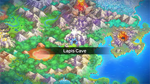
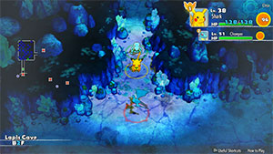

  

[Introduction]

# Overview

<table class="dungeonOverview">
  <tr>
    <th>Unlock</th>
    <td class="highlightYellow">Clear Great Canyon → Talk to Whiscash.</td>
  </tr>
</table>

<table class="dungeonTable">
  <tr>
    <th>Floors</th>
    <td>B14F</td>
    <th>Job Rank</th>
    <td>D</td>
  </tr>
  <tr>
    <th>Radar / Scanning</th>
    <td>Yes</td>
    <th>Weather</th>
    <td>Clear</td>
  </tr>
  <tr>
    <th>Dark Halls</th>
    <td>2 Tiles</td>
    <th>Boss</th>
    <td>None</td>
  </tr>
  <tr>
    <th>Max Team Size</th>
    <td>3</td>
    <th>Strong Foe</th>
    <td>Noctowl</td>
  </tr>
  <tr>
    <th>Bring Items</th>
    <td>Yes</td>
    <th>Shops</th>
    <td>Yes</td>
  </tr>
  <tr>
    <th>Bring Poke</th>
    <td>Yes</td>
    <th>Monster Houses</th>
    <td>No</td>
  </tr>
  <tr>
    <th>Level Reset</th>
    <td>No</td>
    <th>Mystery Houses</th>
    <td>No</td>
  </tr>
  <tr>
    <th>Clear Icon</th>
    <td>None</td>
    <th>Reward</th>
    <td>Unlock Mt. Blaze</td>
  </tr>
</table>

# Needed Camps

- Cannot recruit during the first clear.

#### Wild

|Name|Price|Pokemon|
|-|-|-|
|Jungle|500|Tangela|
|Flyaway Forest|500|Noctowl|
|Safari|600|Nidorina, Nidorino|
|Echo Cave|2700|Zubat, Golbat|
|Rub-a-Dub River|3000|Illumise|
|Dragon Cave|3000|Bagon|

#### Fainted

|Name|Price|Pokemon|
|-|-|-|
|Echo Cave|2700|Nosepass|
|Crater|5000|Slugma, Numel, Torkoal|
|Turtleshell Pond|6000|Marill|
|Shallow Beach|9000|Corsola|

# Pokemon

Rate = Recruit rate. Red stats = Stats as an enemy. Ability colors: Caution, Dangerous Move colors: Boosting, Destroys Items, Caution, Dangerous

#### Wild

|Floor|Image|Name|Rate|Lv|HP|Atk|Def|SpA|SpD|Spe|Exp|Ability + Moves|
|-|-|-|-|-|-|-|-|-|-|-|-|-|
|1-3||Zubat  |%|17|52 65|30 41|27 19|26 28|27 21|32|30|Inner Focus Absorb / Supersonic / Astonish / Bite / Wing Attack / Confuse Ray|
|1-8||Nidorina |%|17|52 63|28 32|27 25|27 31|24 25|28|41|Poison Point or Rivalry Scratch / Tail Whip / Double Kick / Growl / Poison Sting|
|4-8||Illumise |%|17|54 64|28 31|28 22|32 30|28 19|34|39|Oblivious or Tinted Lens Play Nice / Tackle / Sweet Scent / Charm / Quick Attack / Struggle Bug|
|4-8||Nidorino |%|17|52 65|31 37|27 23|27 33|24 21|31|38|Poison Point or Rivalry Peck / Focus Energy / Double Kick / Leer / Poison Sting|
|4-14 Foe|  |Noctowl  |%|20|63 210|31 65|28 40|34 65|34 40|35|400|Insomnia or Keen Eye Dream Eater / Sky Attack / Tackle / Foresight / Hypnosis / Confusion / Growl / Echoed Voice / Zen Headbutt / Peck / Psycho Shift ※ Friend Bow required to recruit.|
|9-14||Tangela |%|17|59 66|36 32|38 22|38 29|24 21|29|49|Chlorophyll or Leaf Guard Ingrain / Constrict / Sleep Powder / Poison Powder / Bind / Vine Whip|
|9-14||Golbat  |%|22|57 67|37 46|34 24|33 52|34 25|40|40|Inner Focus Screech / Absorb / Supersonic / Bite / Astonish / Wing Attack / Air Cutter / Confuse Ray|
|9-14 Rare||Bagon |%|17|52 59|37 43|31 26|27 38|23 27|29|50|Rock Head Rage / Ember / Leer / Dragon Breath / Bite / Headbutt|

#### Fainted

|Image|Name|Lv|HP|Atk|Def|SpA|SpD|Spe|
|-|-|-|-|-|-|-|-|-|
||Marill  |20|55|24|28|24|28|30|
||Slugma |19|51|30|39|34|30|28|
||Corsola  |19|51|30|34|30|34|29|
||Nosepass |21|56|32|49|36|47|32|
||Numel  |19|55|40|30|40|30|29|
||Torkoal |19|55|34|45|34|30|26|

# Items

#### Floor

|Name|Floors|Rate|
|-|-|-|
|Cover Band|1-14|0.382%|
|Defense Scarf|1-14|0.143%|
|Detect Band|1-14|0.0957%|
|Efficient Bandanna|1-14|0.286%|
|Fickle Specs|1-14|0.0957%|
|Gold Ribbon|1-14|0.0191%|
|Heal Ribbon|1-14|0.0957%|
|Heavy Rotation Specs|1-14|0.0957%|
|Joy Ribbon|1-14|0.0957%|
|Lucky Ribbon|1-14|0.0957%|
|Mach Ribbon|1-14|0.382%|
|Nullify Bandanna|1-14|0.191%|
|Power Band|1-14|0.143%|
|Prosper Ribbon|1-14|0.0957%|
|Special Band|1-14|0.143%|
|Twist Band|1-14|0.0957%|
|Zinc Band|1-14|0.143%|
|Apple|1-14|6.25%|
|Link Box|1-14|4.69%|
|Poke|1-14|52.1%|
|All Dodge Orb|1-14|0.297%|
|All Power-Up Orb|1-14|0.297%|
|Escape Orb|1-14|0.594%|
|Foe-Hold Orb|1-14|0.891%|
|Foe-Seal Orb|1-14|0.594%|
|Nullify Orb|1-14|0.297%|
|Petrify Orb|1-14|0.297%|
|Quick Orb|1-14|0.297%|
|Rollcall Orb|1-14|0.297%|
|Slow Orb|1-14|0.297%|
|Slumber Orb|1-14|0.594%|
|Totter Orb|1-14|0.297%|
|Trawl Orb|1-14|0.149%|
|Max Ether|1-14|7.81%|
|Blast Seed|1-14|0.754%|
|Cheri Berry|1-14|0.754%|
|Chesto Berry|1-14|0.377%|
|Eyedrop Seed|1-14|1.51%|
|Oran Berry|1-14|3.77%|
|Pecha Berry|1-14|1.88%|
|Rawst Berry|1-14|1.13%|
|Sleep Seed|1-14|0.754%|
|Stun Seed|1-14|0.377%|
|Tiny Reviver Seed|1-14|1.13%|
|Totter Seed|1-14|0.377%|
|Training Seed|1-14|0.188%|
|Geo Pebble|1-14|2.08%|
|Gravelerock|1-14|2.08%|
|(Random TM)|1-14|1.04%|
|Confuse Wand|1-14|0.624%|
|Petrify Wand|1-14|0.624%|
|Slow Wand|1-14|0.624%|
|Slumber Wand|1-14|0.312%|
|Stayaway Wand|1-14|0.468%|
|Switcher Wand|1-14|0.156%|
|Tunnel Wand|1-14|0.156%|
|Whirlwind Wand|1-14|0.156%|

#### Shop

|Name|Rate|
|-|-|
|Cover Band|0.681%|
|Defense Scarf|0.255%|
|Detect Band|0.17%|
|Efficient Bandanna|0.509%|
|Fickle Specs|0.17%|
|Gold Ribbon|0.034%|
|Heal Ribbon|0.17%|
|Heavy Rotation Specs|0.17%|
|Joy Ribbon|0.17%|
|Lucky Ribbon|0.17%|
|Mach Ribbon|0.681%|
|Nullify Bandanna|0.34%|
|Power Band|0.255%|
|Prosper Ribbon|0.17%|
|Special Band|0.255%|
|Twist Band|0.17%|
|Zinc Band|0.255%|
|Apple|13.9%|
|Link Box|8.33%|
|All Dodge Orb|0.906%|
|All Power-Up Orb|0.906%|
|Foe-Hold Orb|2.73%|
|Foe-Seal Orb|1.81%|
|Nullify Orb|0.906%|
|Petrify Orb|0.906%|
|Quick Orb|0.906%|
|Rollcall Orb|0.906%|
|Slow Orb|0.906%|
|Slumber Orb|1.81%|
|Totter Orb|0.906%|
|Trawl Orb|0.453%|
|Wigglytuff Orb|9.06%|
|Max Ether|13.9%|
|Blast Seed|1.27%|
|Cheri Berry|1.27%|
|Chesto Berry|0.633%|
|Eyedrop Seed|2.54%|
|Oran Berry|5.71%|
|Pecha Berry|2.54%|
|Rawst Berry|1.9%|
|Sleep Seed|1.27%|
|Stun Seed|0.633%|
|Tiny Reviver Seed|4.44%|
|Totter Seed|0.633%|
|Training Seed|0.316%|
|Geo Pebble|3.7%|
|Gravelerock|3.7%|
|Confuse Wand|1.11%|
|Petrify Wand|1.11%|
|Slow Wand|1.11%|
|Slumber Wand|0.566%|
|Stayaway Wand|0.834%|
|Switcher Wand|0.278%|
|Tunnel Wand|0.278%|
|Whirlwind Wand|0.278%|

#### Pretty Box

|Name|Rate|
|-|-|
|Bronze Dojo Ticket|30.8%|
|Oran Berry|11.5%|
|Calcium|0.689%|
|Carbos|0.689%|
|Iron|0.689%|
|Protein|0.689%|
|Rainbow Gummi|34.4%|
|Sitrus Berry|0.689%|
|Zinc|0.689%|
|(Random TM)|19.2%|

#### Deluxe Box

|Name|Rate|
|-|-|
|Gold Dojo Ticket|3.48%|
|Silver Dojo Ticket|13.9%|
|Reviver Seed|6.5%|
|Tiny Reviver Seed|6.5%|
|Calcium|0.934%|
|Carbos|0.934%|
|DX Gummi|23.3%|
|Iron|0.934%|
|Protein|0.934%|
|Rainbow Gummi|23.3%|
|Sitrus Berry|0.934%|
|Zinc|0.934%|
|(Random TM)|17.4%|

# Traps

|Name|
|-|
|Wonder Tile|
|Training Switch|
|Spin Trap|
|Slumber Trap|
|Spiky Trap|
|Gust Trap|
|Blast Trap|
