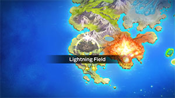
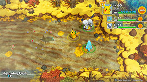

  

# Overview

<table class="dungeonOverview">
  <tr>
    <th>Unlock</th>
    <td class="highlightYellow">Clear Fiery Field.</td>
  </tr>
</table>

<table class="dungeonTable">
  <tr>
    <th>Floors</th>
    <td>30F</td>
    <th>Job Rank</th>
    <td>S</td>
  </tr>
  <tr>
    <th>Radar / Scanning</th>
    <td>No</td>
    <th>Weather</th>
    <td>Rain: 2, 4, 22-24F</td>
  </tr>
  <tr>
    <th>Dark Halls</th>
    <td>No</td>
    <th>Boss</th>
    <td>Raikou</td>
  </tr>
  <tr>
    <th>Max Team Size</th>
    <td>3</td>
    <th>Strong Foe</th>
    <td>None</td>
  </tr>
  <tr>
    <th>Bring Items</th>
    <td>Yes</td>
    <th>Shops</th>
    <td>Yes</td>
  </tr>
  <tr>
    <th>Bring Poke</th>
    <td>Yes</td>
    <th>Monster Houses</th>
    <td>Yes</td>
  </tr>
  <tr>
    <th>Level Reset</th>
    <td>No</td>
    <th>Mystery Houses</th>
    <td>Yes</td>
  </tr>
  <tr>
    <th>Clear Icon</th>
    <td>None</td>
    <th>Reward</th>
    <td>Unlock Northwind Field</td>
  </tr>
</table>

2nd dungeon in the Mirage Pokemon related series of events, featuring lots of Electric types. Most enemies have the possibility of knowing Discharge (room-wide attack that can cause paralysis). In addition, Magneton and Manectric can know Electric Terrain which boosts Electric type attacks. If you want a much easier time, bring a party member who has Lightning Rod as an ability. A Rhydon with Lightning Rod and Earth Power (taught by Gulpin) is particularly effective.

# Boss Strategy

#### Raikou (1887 HP) - Extrasensory / Bite / Discharge / Reflect

- Lightning Rod makes Raikou's Discharge a non-issue - Again, Rhydon with Earth Power is great.
- If you plan on using physical attacks, bring a Pokemon who knows Brick Break to remove Reflect.
- The rematch version is the exact same fight, but with a 100% recruit rate.

# Needed Camps

#### Wild

|Name|Price|Pokemon|
|-|-|-|
|Power Plant|-|Magnemite, Magneton, Electrode, Elekid|
|Jungle|500|Tropius|
|Thunder Crag|600|Mareep, Flaaffy, Ampharos, Electrike, Manectric, Plusle, Minun|
|Vibrant Forest|800|Pikachu, Raichu|
|Withering Desert|900|Cacturne|
|Evolution Forest|9000|Jolteon|

#### Fainted

|Name|Price|Pokemon|
|-|-|-|
|Wild Plains|-|Zangoose|
|Power Plant|-|Magneton, Elekid|
|Darkness Ridge|-|Dusclops|
|Safari|600|Rhyperior|
|Thunder Crag|600|Electrike, Chingling|
|Mt. Green|700|Spinda|
|Overgrown Forest|700|Treecko|
|Ancient Relic|700|Aerodactyl, Baltoy|
|Beau Plains|2700|Roserade|
|Poison Swamp|7000|Gulpin|
|Gourd Swamp|9000|Barboach|
|Deepsea Floor|9000|Chinchou|

#### Mystery House

|Name|Price|Pokemon|
|-|-|-|
|Power Plant|-|Magnezone, Electrode, Electivire|
|Thunder Crag|600|Ampharos, Manectric, Plusle, Minun|
|Vibrant Forest|800|Raichu|
|Evolution Forest|9000|Jolteon|
|Deepsea Floor|9000|Lanturn|

# Pokemon

Rate = Recruit rate. Red stats = Stats as an enemy. Ability colors: Caution, Dangerous Move colors: Boosting, Destroys Items, Caution, Dangerous

#### Wild

|Floor|Image|Name|Rate|Lv|HP|Atk|Def|SpA|SpD|Spe|Exp|Ability + Moves|
|-|-|-|-|-|-|-|-|-|-|-|-|-|
|1-5||Mareep |8.2%|45|78 135|58 58|50 50|69 69|50 50|62 62|148|Static Tackle / Charge / Thunder Shock / Cotton Spore / Thunder Wave / Growl / Take Down / Electro Ball / Confuse Ray / Power Gem / Light Screen / Discharge / Cotton Guard / Signal Beam|
|1-7||Magnemite  |8.2%|45|73 120|58 58|55 55|78 78|50 50|65 65|139|Magnet Pull or Sturdy Tackle / Supersonic / Thunder Shock / Magnet Bomb / Thunder Wave / Spark / Light Screen / Sonic Boom / Screech / Mirror Shot / Flash Cannon / Lock-On / Electro Ball / Metal Sound / Discharge / Magnet Rise|
|1-7||Electrike |10.8%|45|76 125|61 61|50 50|71 71|50 50|77 77|145|Static or Lightning Rod Tackle / Leer / Thunder Wave / Spark / Quick Attack / Odor Sleuth / Charge / Roar / Thunder Fang / Bite / Discharge / Howl / Wild Charge|
|5-10||Pikachu |8.2%|45|83 133|63 61|51 46|80 72|50 45|79 74|146|Static Thunder Wave / Slam / Growl / Agility / Play Nice / Quick Attack / Electro Ball / Thunder Shock / Feint / Double Team / Spark / Nuzzle / Tail Whip / Discharge / Thunderbolt|
|7-13||Flaaffy |8.2%|45|78 135|58 58|50 50|69 73|50 50|62 77|150|Static Tackle / Charge / Thunder Shock / Cotton Spore / Thunder Wave / Growl / Take Down / Electro Ball / Confuse Ray / Power Gem / Cotton Guard / Discharge|
|7-19||Plusle |14.4%|45|76 133|54 59|45 45|61 71|50 50|74 74|145|Plus Nuzzle / Agility / Growl / Spark / Swift / Thunder Wave / Quick Attack / Encore / Helping Hand / Baton Pass / Play Nice / Charm / Thunder / Copycat / Charge / Last Resort / Electro Ball / Discharge / Bestow|
|7-19||Minun |14.4%|45|76 130|52 57|45 45|61 71|52 52|74 74|143|Minus Nuzzle / Play Nice / Charge / Encore / Thunder Wave / Quick Attack / Swift / Helping Hand / Thunder / Switcheroo / Electro Ball / Copycat / Fake Tears / Baton Pass / Trump Card / Discharge / Growl / Spark / Agility|
|8-14||Jolteon |8.2%|45|89 155|54 54|50 50|71 85|55 55|80 65|160|Volt Absorb Helping Hand / Thunder Wave / Tackle / Tail Whip / Sand Attack / Last Resort / Quick Attack / Double Kick / Thunder / Thunder Fang / Pin Missile / Discharge / Agility / Thunder Shock|
|10-16||Cacturne  |10.8%|45|76 150|78 80|50 50|78 82|50 50|62 62|180|Sand Veil Spiky Shield / Destiny Bond / Revenge / Poison Sting / Leer / Absorb / Growth / Leech Seed / Sand Attack / Payback / Feint Attack / Energy Ball / Pin Missile / Ingrain / Sucker Punch / Needle Arm / Spikes|
|15-21||Electrode |8.2%|45|76 139|54 64|50 50|61 74|50 50|74 89|134|Soundproof or Static Magnetic Flux / Charge / Sonic Boom / Tackle / Eerie Impulse / Electro Ball / Spark / Rollout / Self-Destruct / Swift / Magnet Rise / Charge Beam / Screech / Light Screen / Discharge|
|15-22||Elekid |14.4%|45|76 142|69 69|50 50|71 71|55 55|77 77|158|Static Quick Attack / Swift / Thunder Shock / Low Kick / Thunder Wave / Discharge / Leer / Thunder Punch / Electro Ball / Light Screen / Shock Wave / Screech / Thunderbolt / Thunder|
|16-21||Ampharos |14.4%|45|78 140|58 63|50 50|69 83|50 50|62 77|160|Static Magnetic Flux / Zap Cannon / Charge / Electro Ball / Fire Punch / Power Gem / Take Down / Confuse Ray / Ion Deluge / Growl / Cotton Spore / Dragon Pulse / Tackle / Thunder Shock / Discharge / Thunder Punch / Thunder Wave ※ Can Mega Evolve.|
|20-28||Magneton  |8.2%|45|73 145|58 58|55 55|78 84|50 50|65 65|170|Magnet Pull or Sturdy Tackle / Supersonic / Thunder Shock / Magnet Bomb / Thunder Wave / Spark / Light Screen / Sonic Boom / Screech / Mirror Shot / Flash Cannon / Tri Attack / Electro Ball / Metal Sound / Discharge / Zap Cannon / Electric Terrain|
|20-29||Tropius  |10.8%|45|84 150|61 71|55 55|61 71|55 55|62 62|155|Chlorophyll or Solar Power Leaf Tornado / Leer / Stomp / Growth / Razor Leaf / Sweet Scent / Air Slash / Magical Leaf / Whirlwind / Natural Gift / Gust / Body Slam / Leaf Storm|
|23-29||Raichu |8.2%|45|83 155|63 73|51 46|80 75|50 45|79 74|157|Static Tail Whip / Quick Attack / Thunderbolt / Thunder Shock|
|23-29||Manectric |10.8%|45|76 145|61 75|50 50|71 80|50 50|77 77|160|Static or Lightning Rod Tackle / Leer / Thunder Wave / Spark / Quick Attack / Odor Sleuth / Fire Fang / Roar / Thunder Fang / Bite / Discharge / Howl / Wild Charge / Electric Terrain ※ Can Mega Evolve.|

#### Boss

- Rematch: Exact same stats + moves, but 100% recruit rate.

 

|Floor|Image|Name|Rate|Lv|HP|Atk|Def|SpA|SpD|Spe|Exp|Ability + Moves|
|-|-|-|-|-|-|-|-|-|-|-|-|-|
|30||Raikou |-|50|87 1887|65 75|52 62|82 92|57 67|87 87|0|Pressure Extrasensory / Bite / Discharge / Reflect|

#### Fainted

|Image|Name|Lv|HP|Atk|Def|SpA|SpD|Spe|
|-|-|-|-|-|-|-|-|-|
||Magneton  |47|75|60|56|80|51|67|
||Aerodactyl  |49|79|74|52|57|51|88|
||Chinchou  |47|90|55|51|63|51|67|
||Elekid |47|78|71|51|73|56|81|
||Treecko |47|78|63|49|70|54|73|
||Electrike |47|78|63|51|73|51|81|
||Gulpin |47|85|63|56|63|51|72|
||Spinda |47|78|55|51|55|51|64|
||Zangoose |47|78|80|54|55|53|87|
||Barboach  |47|85|63|51|63|51|72|
||Baltoy  |49|79|64|67|57|66|69|
||Dusclops |47|73|67|71|55|66|78|
||Roserade  |49|77|62|47|79|51|79|
||Chingling |47|78|55|51|73|51|67|
||Rhyperior  |49|89|89|67|54|46|63|

#### Mystery House

|Image|Name|Image|Name|Image|Name|Image|Name|Image|Name|
|-|-|-|-|-|-|-|-|-|-|
||Raichu ||Magnezone  ||Electrode ||Electivire ||Jolteon |
||Lanturn  ||Ampharos ||Manectric ||Plusle ||Minun |

# Items

#### Floor

|Name|Floors|Rate|
|-|-|-|
|Efficient Bandanna|1-29|0.729%|
|Goggle Specs|1-29|0.183%|
|Gold Ribbon|1-29|0.0183%|
|Heal Ribbon|1-29|0.183%|
|Insomniscope|1-29|0.183%|
|Joy Ribbon|1-29|0.183%|
|Nullify Bandanna|1-29|0.365%|
|Pecha Scarf|1-29|0.183%|
|Persim Band|1-29|0.183%|
|Recovery Scarf|1-29|0.183%|
|Scope Lens|1-29|0.183%|
|Weather Band|1-29|0.183%|
|X-Ray Specs|1-29|0.183%|
|Apple|1-29|7.35%|
|Poke|1-29|51.5%|
|Max Elixir|1-29|1.13%|
|Max Ether|1-29|3.77%|
|Blast Seed|1-29|0.87%|
|Cheri Berry|1-29|0.87%|
|Chesto Berry|1-29|0.435%|
|Empowerment Seed|1-29|0.87%|
|Eyedrop Seed|1-29|1.74%|
|Heal Seed|1-29|0.87%|
|Oran Berry|1-29|4.35%|
|Pecha Berry|1-29|2.18%|
|Rawst Berry|1-29|1.31%|
|Sleep Seed|1-29|0.87%|
|Stun Seed|1-29|0.435%|
|Tiny Reviver Seed|1-29|1.31%|
|Totter Seed|1-29|0.435%|
|Training Seed|1-29|0.218%|
|Warp Seed|1-29|0.435%|
|Iron Spike|1-29|4.9%|
|Geo Pebble|1-29|7.35%|
|Confuse Wand|1-29|0.206%|
|Guiding Wand|1-29|0.206%|
|HP-Swap Wand|1-29|0.206%|
|Petrify Wand|1-29|0.206%|
|Pounce Wand|1-29|0.412%|
|Slow Wand|1-29|0.206%|
|Slumber Wand|1-29|0.412%|
|Stayaway Wand|1-29|0.619%|
|Surround Wand|1-29|0.412%|
|Switcher Wand|1-29|0.206%|
|Tunnel Wand|1-29|0.206%|
|Two-Edged Wand|1-29|0.206%|
|Warp Wand|1-29|0.206%|
|Whirlwind Wand|1-29|0.206%|

#### Shop

|Name|Rate|
|-|-|
|Efficient Bandanna|2.12%|
|Goggle Specs|0.53%|
|Heal Ribbon|0.53%|
|Insomniscope|0.53%|
|Joy Ribbon|0.53%|
|Nullify Bandanna|1.06%|
|Pecha Scarf|0.53%|
|Persim Band|0.53%|
|Prosper Ribbon|0.53%|
|Recovery Scarf|0.53%|
|Scope Lens|0.53%|
|Weather Band|0.53%|
|X-Ray Specs|0.53%|
|Evolution Crystal|5.41%|
|Big Apple|13.5%|
|All Dodge Orb|0.45%|
|All Power-Up Orb|0.45%|
|All Protect Orb|0.45%|
|Cleanse Orb|0.45%|
|Decoy Orb|0.45%|
|Drought Orb|0.45%|
|Evasion Orb|0.45%|
|Foe-Hold Orb|1.35%|
|Foe-Seal Orb|0.9%|
|Health Orb|0.45%|
|Helper Orb|0.45%|
|Inviting Orb|0.45%|
|Lasso Orb|0.45%|
|Nullify Orb|0.45%|
|One-Room Orb|0.45%|
|Rare Quality Orb|0.45%|
|Reset Orb|0.45%|
|Revive All Orb|0.45%|
|See-Trap Orb|0.45%|
|Storage Orb|0.45%|
|Trapbust Orb|0.45%|
|Weather Lock Orb|0.45%|
|Wigglytuff Orb|2.25%|
|Max Elixir|9.01%|
|Ban Seed|0.749%|
|Cheri Berry|1.5%|
|Chesto Berry|1.5%|
|Decoy Seed|0.749%|
|Empowerment Seed|1.5%|
|Energy Seed|0.749%|
|Pecha Berry|3.76%|
|Pure Seed|0.749%|
|Quick Seed|2.25%|
|Rawst Berry|2.25%|
|Reviver Seed|0.749%|
|Stun Seed|1.5%|
|Tiny Reviver Seed|2.25%|
|Violent Seed|0.749%|
|Iron Spike|4.5%|
|Geo Pebble|4.5%|
|(Random TM)|9.01%|
|Guiding Wand|1.2%|
|HP-Swap Wand|0.601%|
|Pounce Wand|1.2%|
|Slow Wand|1.2%|
|Stayaway Wand|1.2%|
|Surround Wand|1.2%|
|Tunnel Wand|1.2%|
|Two-Edged Wand|0.601%|
|Warp Wand|0.601%|

# Traps

|Name|
|-|
|Wonder Tile|
|Training Switch|
|Spin Trap|
|Trip Trap|
|Slumber Trap|
|Poison Trap|
|Spiky Trap|
|Gust Trap|
|Slow Trap|
|Blast Trap|
|Hunger Trap|
|Seal Trap|
|Grimy Trap|
|Summon Trap|
|Warp Trap|
|PP Leech Trap|
