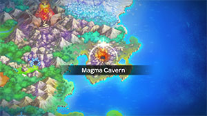
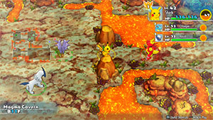
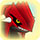

  

Dungeon featuring lots of enemies with room-wide attacks - bring more Tiny Reviver Seeds than usual. Room-wide attacks include Magnitude (Sandshrew, Graveler, Sandslash, Golem) and Earth Power (Magcargo). Remember to bring plenty of apples, since the only food item that can be found is Grimy Food. That said, Sparkling Tiles can have Big Apples, so it's not hopeless if you forget to bring apples. Similar to Mt. Blaze, don't forget that enemies with Flame Body or Magma Armor burn up thrown items. Lastly, don't forget to bring an Invitation in case you encounter a Mystery House.

There's a checkpoint during the first clear between 23F and 24F, and Groudon appears as a boss on 26F. Groudon is far tougher than any of the previous bosses you've fought, so don't hesitate to use items. Unlike the DS version, orbs are effective during boss fights in this game.

# Overview

<table class="dungeonOverview">
  <tr>
    <th>Unlock</th>
    <td class="highlightYellow">Clear Uproar Forest → Remodel Team Base → 3 days later.</td>
  </tr>
</table>

<table class="dungeonTable">
  <tr>
    <th>Floors</th>
    <td>B25F</td>
    <th>Job Rank</th>
    <td>C</td>
  </tr>
  <tr>
    <th>Radar / Scanning</th>
    <td>Yes</td>
    <th>Weather</th>
    <td>Clear</td>
  </tr>
  <tr>
    <th>Dark Halls</th>
    <td>2 Tiles</td>
    <th>Boss</th>
    <td>Groudon</td>
  </tr>
  <tr>
    <th>Max Team Size</th>
    <td>3</td>
    <th>Strong Foe</th>
    <td>None</td>
  </tr>
  <tr>
    <th>Bring Items</th>
    <td>Yes</td>
    <th>Shops</th>
    <td>No</td>
  </tr>
  <tr>
    <th>Bring Poke</th>
    <td>Yes</td>
    <th>Monster Houses</th>
    <td>Yes</td>
  </tr>
  <tr>
    <th>Level Reset</th>
    <td>No</td>
    <th>Mystery Houses</th>
    <td>Yes</td>
  </tr>
  <tr>
    <th>Clear Icon</th>
    <td></td>
    <th>Reward</th>
    <td>Unlock Sky Tower</td>
  </tr>
</table>

# Needed Camps

#### Wild

|Name|Price|Pokemon|
|-|-|-|
|Wild Plains|-|Raticate, Arbok|
|Safari|600|Nidoqueen, Nidoking, Rhydon|
|Mt. Green|700|Graveler, Golem|
|Boulder Cave|700|Onix, Steelix|
|Withering Desert|900|Sandshrew, Sandslash|
|Echo Cave|2700|Crobat, Mawile|
|Crater|5000|Magmar, Magcargo|
|Poison Swamp|7000|Grimer, Koffing|

#### Fainted

|Name|Price|Pokemon|
|-|-|-|
|Beau Plains|2700|Jumpluff|
|Mt. Moonview|7000|Lunatone, Solrock|
|Deepsea Floor|9000|Relicanth|
|Bountiful Sea|9000|Cloyster, Staryu|

#### Mystery House

|Name|Price|Pokemon|
|-|-|-|
|Mt. Green|700|Graveler|
|Ancient Relic|700|Claydol|
|Magnetic Quarry|700|Metagross|
|Boulder Cave|700|Onix, Steelix|
|Echo Cave|2700|Probopass, Mawile|
|Mt. Moonview|7000|Lunatone, Solrock|
|Deepsea Floor|9000|Relicanth|

# Pokemon

Rate = Recruit rate. Red stats = Stats as an enemy. Ability colors: Caution, Dangerous Move colors: Boosting, Destroys Items, Caution, Dangerous

#### Wild

|Floor|Image|Name|Rate|Lv|HP|Atk|Def|SpA|SpD|Spe|Exp|Ability + Moves|
|-|-|-|-|-|-|-|-|-|-|-|-|-|
|1-3||Raticate |10.8%|24|55 100|41 49|36 26|32 44|36 27|44 44|40|Run Away or Guts Swords Dance / Tackle / Tail Whip / Bite / Quick Attack / Focus Energy / Crunch / Scary Face / Assurance / Hyper Fang / Pursuit|
|1-6||Sandshrew |10.8%|24|59 70|49 51|49 35|32 46|32 25|40 40|45|Sand Veil Scratch / Defense Curl / Sand Attack / Fury Cutter / Rollout / Rapid Spin / Swift / Poison Sting / Magnitude / Sand Tomb / Fury Swipes|
|2-5||Nidoqueen  |10.8%|24|59 85|37 50|36 31|36 51|32 30|38 38|46|Poison Point or Rivalry Superpower / Chip Away / Double Kick / Tail Whip / Poison Sting / Scratch|
|2-5||Nidoking  |10.8%|24|59 73|41 52|36 30|36 50|32 31|41 41|47|Poison Point or Rivalry Megahorn / Focus Energy / Chip Away / Peck / Double Kick / Poison Sting|
|3-8||Graveler  |10.8%|25|56 77|51 55|51 33|33 33|33 25|37 37|55|Rock Head or Sturdy Tackle / Bulldoze / Rock Polish / Rollout / Magnitude / Defense Curl / Rock Throw / Smack Down / Mud Sport / Self-Destruct|
|3-8||Crobat  |10.8%|24|59 90|40 53|36 32|36 52|36 28|43 43|53|Inner Focus Cross Poison / Screech / Absorb / Bite / Air Cutter / Supersonic / Wing Attack / Confuse Ray / Astonish / Swift|
|8-13||Magmar |10.8%|30|65 76|60 52|45 28|60 58|50 31|53 53|52|Flame Body Smog / Leer / Ember / Smokescreen / Feint Attack / Fire Spin / Clear Smog / Flame Burst / Confuse Ray / Fire Punch|
|8-13||Arbok |10.8%|24|59 80|41 56|36 29|36 45|36 30|41 41|50|Intimidate or Shed Skin Ice Fang / Thunder Fang / Fire Fang / Wrap / Leer / Poison Sting / Bite / Acid / Crunch / Glare / Screech|
|10-16||Mawile  |10.8%|24|55 75|41 40|41 34|37 50|32 26|38 38|45|Hyper Cutter or Intimidate Play Rough / Iron Head / Taunt / Growl / Fairy Wind / Astonish / Vise Grip / Bite / Sweet Scent / Fake Tears / Feint Attack ※ Can Mega Evolve.|
|12-19||Magcargo  |-2.2%|38|66 78|50 49|63 35|56 56|48 29|52 60|53|Magma Armor or Flame Body Earth Power / Harden / Smog / Ember / Rock Throw / Shell Smash / Incinerate / Amnesia / Clear Smog / Ancient Power / Rock Slide / Lava Plume / Flame Burst / Yawn|
|16-22||Koffing |10.8%|24|59 70|49 45|49 35|41 48|36 23|38 38|49|Levitate Poison Gas / Tackle / Smog / Sludge / Assurance / Clear Smog / Self-Destruct / Smokescreen|
|18-22||Rhydon  |-2.2%|42|84 105|82 60|64 30|49 43|44 25|56 56|60|Lightning Rod or Rock Head Horn Drill / Stomp / Tail Whip / Bulldoze / Fury Attack / Scary Face / Hammer Arm / Smack Down / Horn Attack / Drill Run / Chip Away / Rock Blast / Stone Edge / Take Down|
|20-23||Sandslash |10.8%|24|59 85|49 55|49 37|32 46|32 26|40 40|58|Sand Veil Scratch / Defense Curl / Sand Attack / Fury Cutter / Rollout / Rapid Spin / Swift / Poison Sting / Magnitude / Sand Tomb / Fury Swipes / Crush Claw|
|20-25||Grimer |10.8%|24|67 82|49 42|36 30|36 49|40 27|38 38|46|Stench or Sticky Hold Pound / Poison Gas / Sludge / Minimize / Disable / Harden / Mud Bomb / Mud-Slap|
|20-25||Golem  |10.8%|25|56 88|51 62|51 36|33 40|33 26|37 37|56|Rock Head or Sturdy Heavy Slam / Bulldoze / Defense Curl / Mud Sport / Rock Polish / Steamroller / Magnitude / Rock Throw / Smack Down / Tackle / Self-Destruct|
|23-25||Onix  |10.8%|24|59 188|40 51|62 38|36 41|36 25|36 36|50|Rock Head or Sturdy Mud Sport / Tackle / Harden / Curse / Bind / Rock Throw / Gyro Ball / Rage / Stealth Rock / Rock Polish / Rock Tomb / Smack Down|
|24-25||Steelix  |10.8%|24|59 195|40 55|62 45|36 49|36 30|36 36|60|Rock Head or Sturdy Thunder Fang / Ice Fang / Fire Fang / Mud Sport / Tackle / Harden / Rage / Curse / Rock Throw / Rock Tomb / Bind / Stealth Rock / Autotomize / Gyro Ball / Smack Down ※ Can Mega Evolve.|

#### Boss

|Floor|Image|Name|Rate|Lv|HP|Atk|Def|SpA|SpD|Spe|Exp|Ability + Moves|
|-|-|-|-|-|-|-|-|-|-|-|-|-|
|26||Groudon |-|28|72 1572|71 71|61 61|56 56|47 47|50 50|0|Drought Roar / Precipice Blades / Hammer Arm / Lava Plume ※ First clear.|
|26 Rematch Phase 1||Groudon |-|50|87 2187|98 118|72 92|75 75|57 57|93 93|0|Drought Eruption / Precipice Blades / Hammer Arm / Earthquake ※ Available post-game.|
|26 Rematch Phase 2||Primal Groudon  |100%|50|92 1942|95 115|73 93|78 78|62 62|91 91|0|Desolate Land Eruption / Precipice Blades / Hammer Arm / Earthquake ※ Rare Quality: Notorious Restoration|

#### Fainted

|Image|Name|Lv|HP|Atk|Def|SpA|SpD|Spe|
|-|-|-|-|-|-|-|-|-|
||Cloyster  |28|58|56|70|46|37|46|
||Staryu |26|61|43|44|52|43|49|
||Jumpluff  |29|59|38|38|38|43|48|
||Lunatone  |26|61|39|39|53|44|44|
||Solrock  |26|61|53|44|39|39|44|
||Relicanth  |26|70|53|57|35|39|41|

#### Mystery House

|Image|Name|Image|Name|Image|Name|Image|Name|Image|Name|
|-|-|-|-|-|-|-|-|-|-|
||Graveler  ||Onix  ||Steelix  ||Probopass  ||Mawile  |
||Lunatone  ||Solrock  ||Claydol  ||Relicanth  ||Metagross  |

# Items

#### Floor

|Name|Floors|Rate|
|-|-|-|
|Cover Band|1-25|0.701%|
|Defense Scarf|1-25|0.175%|
|Detect Band|1-25|0.175%|
|Efficient Bandanna|1-25|0.523%|
|Fickle Specs|1-25|0.175%|
|Heal Ribbon|1-25|0.175%|
|Heavy Rotation Specs|1-25|0.175%|
|Joy Ribbon|1-25|0.175%|
|Lucky Ribbon|1-25|0.175%|
|Mach Ribbon|1-25|0.701%|
|Nullify Bandanna|1-25|0.35%|
|Power Band|1-25|0.175%|
|Prosper Ribbon|1-25|0.175%|
|Reunion Cape|1-25|0.175%|
|Special Band|1-25|0.175%|
|Twist Band|1-25|0.175%|
|Zinc Band|1-25|0.175%|
|Grimy Food|1-25|3.25%|
|Poke|1-25|64.9%|
|Max Ether|1-25|6.49%|
|Blast Seed|1-25|0.49%|
|Cheri Berry|1-25|0.49%|
|Chesto Berry|1-25|0.245%|
|Eyedrop Seed|1-25|0.979%|
|Oran Berry|1-25|2.45%|
|Pecha Berry|1-25|0.49%|
|Rawst Berry|1-25|0.734%|
|Sleep Seed|1-25|0.49%|
|Stun Seed|1-25|0.245%|
|Tiny Reviver Seed|1-25|0.734%|
|Totter Seed|1-25|0.245%|
|Training Seed|1-25|0.122%|
|Geo Pebble|1-25|7.79%|
|(Random TM)|1-25|1.3%|
|Confuse Wand|1-25|0.65%|
|Petrify Wand|1-25|0.65%|
|Slow Wand|1-25|0.65%|
|Slumber Wand|1-25|0.325%|
|Stayaway Wand|1-25|0.488%|
|Switcher Wand|1-25|0.162%|
|Tunnel Wand|1-25|0.162%|
|Whirlwind Wand|1-25|0.162%|

# Traps

|Name|
|-|
|Wonder Tile|
|Training Switch|
|Spin Trap|
|Slumber Trap|
|Gust Trap|
|Slow Trap|
|Hunger Trap|
