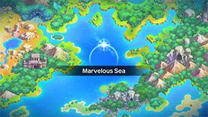
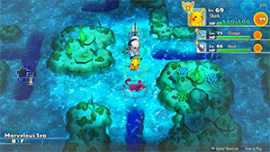

  

[Introduction]

# Overview

<table class="dungeonOverview">
  <tr>
    <th>Unlock</th>
    <td class="highlightYellow">Clear Western Cave, Murky Cave, and Meteor Cave.</td>
  </tr>
</table>

<table class="dungeonTable">
  <tr>
    <th>Floors</th>
    <td>B18F</td>
    <th>Job Rank</th>
    <td>⭐︎⭐︎</td>
  </tr>
  <tr>
    <th>Radar / Scanning</th>
    <td>No</td>
    <th>Weather</th>
    <td>Clear</td>
  </tr>
  <tr>
    <th>Dark Halls</th>
    <td>2 Tiles</td>
    <th>Boss</th>
    <td>None</td>
  </tr>
  <tr>
    <th>Max Team Size</th>
    <td>3</td>
    <th>Strong Foe</th>
    <td>Magikarp</td>
  </tr>
  <tr>
    <th>Bring Items</th>
    <td>Yes</td>
    <th>Shops</th>
    <td>No</td>
  </tr>
  <tr>
    <th>Bring Poke</th>
    <td>Yes</td>
    <th>Monster Houses</th>
    <td>Yes</td>
  </tr>
  <tr>
    <th>Level Reset</th>
    <td>No</td>
    <th>Mystery Houses</th>
    <td>Yes (Fixed: 10F)</td>
  </tr>
  <tr>
    <th>Clear Icon</th>
    <td>None</td>
    <th>Reward</th>
    <td>Deluxe Box x 2, Evolution Crystal x 5</td>
  </tr>
</table>

# Needed Camps

#### Wild

|Name|Price|Pokemon|
|-|-|-|
|Wild Plains|-|Rattata, Hypno|
|Stump Forest|-|Weedle, Ledyba|
|Sky-Blue Plains|-|Lickitung|
|Power Plant|-|Voltorb, Elekid, Electabuzz|
|Darkness Ridge|-|Gastly, Misdreavus, Weavile|
|Jungle|500|Oddish, Exeggcute, Tangela|
|Flyaway Forest|500|Pidgey, Murkrow|
|Safari|600|Nidoran♀, Nidoran♂, Doduo, Phanpy|
|Thunder Crag|600|Sentret, Flaaffy|
|Mt. Green|700|Graveler, Shuckle, Teddiursa|
|Mt. Discipline|700|Tyrogue, Hitmonlee|
|Scorched Plains|700|Ponyta|
|Overgrown Forest|700|Pinsir, Heracross|
|Vibrant Forest|800|Aipom, Stantler|
|Mushroom Forest|800|Paras|
|Frigid Cavern|800|Smoochum, Swinub, Delibird|
|Tadpole Pond|900|Poliwag|
|Secretive Forest|900|Pineco|
|Beau Plains|2700|Hoppip, Skiploom|
|Echo Cave|2700|Zubat, Dunsparce|
|Crater|5000|Magmar|
|Turtleshell Pond|6000|Marill|
|Decrepit Lab|6000|Mr. Mime|
|Ice Floe Beach|6000|Seel|
|Mt. Moonview|7000|Clefairy|
|Poison Swamp|7000|Grimer|
|Waterfall Lake|9000|Magikarp|
|Bountiful Sea|9000|Shellder|
|Gourd Swamp|9000|Wooper|
|Serene Sea|9000|Qwilfish|

#### Fainted

|Name|Price|Pokemon|
|-|-|-|
|Flyaway Forest|500|Natu|
|Mt. Cleft|700|Pupitar|
|Scorched Plains|700|Cyndaquil|
|Vibrant Forest|800|Vigoroth|
|Secretive Forest|900|Ariados|
|Turtleshell Pond|6000|Azurill|
|Poison Swamp|7000|Muk|
|Bountiful Sea|9000|Slowpoke|
|Shallow Beach|9000|Kingler|
|Treasure Sea|9000|Carvanha|

#### Mystery House

|Name|Price|Pokemon|
|-|-|-|
|Sky-Blue Plains|-|Ralts|
|Wild Plains|-|Drowzee, Hypno|
|Mt. Green|700|Spoink|
|Vibrant Forest|800|Munchlax|
|Frigid Cavern|800|Smoochum, Jynx|
|Decrepit Lab|6000|Abra, Kadabra, Mime Jr., Mr. Mime|

# Pokemon

Rate = Recruit rate. Red stats = Stats as an enemy. Ability colors: Caution, Dangerous Move colors: Boosting, Destroys Items, Caution, Dangerous

#### Wild

|Floor|Image|Name|Rate|Lv|HP|Atk|Def|SpA|SpD|Spe|Exp|Ability + Moves|
|-|-|-|-|-|-|-|-|-|-|-|-|-|
|1-2||Weedle  |14.4%|60|86 184|77 90|50 54|54 60|45 48|95 115|203|Shield Dust Poison Sting / String Shot / Bug Bite|
|1-2||Pidgey  |14.4%|60|88 186|71 80|55 59|63 70|50 53|91 111|203|Keen Eye or Tangled Feet Sand Attack / Whirlwind / Twister / Gust / Tackle / Quick Attack / Agility / Wing Attack / Feather Dance / Roost / Tailwind / Mirror Move / Air Slash / Hurricane|
|1-2||Rattata |14.4%|60|83 188|73 80|55 59|55 60|55 58|94 114|189|Run Away or Guts Tackle / Tail Whip / Quick Attack / Focus Energy / Endeavor / Pursuit / Hyper Fang / Assurance / Crunch / Sucker Punch / Super Fang / Bite / Double-Edge|
|1-2||Nidoran♀ |14.4%|60|91 204|79 90|55 59|71 80|50 53|77 88|230|Poison Point or Rivalry Toxic Spikes / Tail Whip / Scratch / Double Kick / Poison Sting / Flatter / Fury Swipes / Helping Hand / Crunch / Growl / Poison Fang / Captivate / Bite|
|1-2||Nidoran♂ |10.8%|60|88 206|80 90|55 59|71 80|50 53|80 91|230|Poison Point or Rivalry Fury Attack / Poison Sting / Flatter / Double Kick / Focus Energy / Leer / Horn Attack / Helping Hand / Peck / Captivate / Poison Jab / Horn Drill / Toxic Spikes|
|1-2||Clefairy |6.4%|60|91 200|70 80|50 54|79 90|55 58|85 115|230|Cute Charm or Magic Guard Disarming Voice / Cosmic Power / Spotlight / Encore / Sing / Minimize / Double Slap / Defense Curl / Growl / Follow Me / Stored Power / Bestow / Wake-Up Slap / Metronome / Pound / Lucky Chant / Body Slam / Gravity / Moonblast / After You / Moonlight / Healing Wish / Meteor Mash|
|1-2||Zubat  |10.8%|60|88 190|80 90|55 59|64 70|55 58|94 114|216|Inner Focus Absorb / Supersonic / Quick Guard / Bite / Wing Attack / Confuse Ray / Air Cutter / Swift / Leech Life / Haze / Mean Look / Poison Fang / Astonish / Venoshock / Air Slash|
|1-17 Foe|  |Magikarp |-6.4%|60|75 555|57 150|55 80|64 150|60 80|134 200|555|Swift Swim Splash / Tackle / Flail ※ Friend Bow required to recruit.|
|3-4||Oddish  |14.4%|60|88 192|71 80|55 59|80 90|55 58|85 105|230|Chlorophyll Petal Dance / Growth / Sweet Scent / Acid / Poison Powder / Stun Spore / Sleep Powder / Mega Drain / Toxic / Lucky Chant / Moonblast / Absorb / Natural Gift / Giga Drain / Moonlight / Grassy Terrain|
|3-4||Paras  |14.4%|60|88 190|83 90|60 64|64 71|55 58|85 105|218|Effect Spore or Dry Skin Scratch / Stun Spore / X-Scissor / Poison Powder / Fury Cutter / Slash / Spore / Giga Drain / Rage Powder / Growth / Aromatherapy / Absorb|
|3-4||Poliwag |14.4%|60|91 200|79 90|55 59|63 70|50 53|104 124|216|Water Absorb or Damp Water Sport / Mud Bomb / Mud Shot / Bubble / Wake-Up Slap / Rain Dance / Body Slam / Double Slap / Water Gun / Belly Drum / Hydro Pump / Hypnosis / Bubble Beam|
|3-4||Graveler  |10.8%|60|86 210|90 100|70 74|63 70|50 53|85 105|230|Rock Head or Sturdy Tackle / Defense Curl / Mud Sport / Rock Polish / Rock Blast / Magnitude / Rock Throw / Smack Down / Bulldoze / Self-Destruct / Stealth Rock / Rollout / Earthquake / Explosion / Stone Edge / Double-Edge|
|3-4||Ponyta |6.4%|60|88 212|83 90|55 59|73 80|55 58|116 136|230|Run Away or Flash Fire Growl / Tackle / Tail Whip / Ember / Flame Wheel / Fire Blast / Fire Spin / Take Down / Flame Charge / Inferno / Agility / Stomp / Flare Blitz / Bounce|
|4||Doduo  |10.8%|60|88 180|91 100|55 59|64 70|55 58|94 114|230|Run Away or Early Bird Peck / Growl / Quick Attack / Rage / Fury Attack / Pursuit / Acupressure / Pluck / Double Hit / Agility / Uproar / Jump Kick / Drill Peck / Endeavor / Swords Dance / Thrash|
|4||Seel |10.8%|60|94 200|73 80|60 64|64 70|60 63|110 130|203|Thick Fat or Hydration Headbutt / Growl / Aqua Tail / Rest / Encore / Ice Shard / Dive / Aqua Jet / Aqua Ring / Aurora Beam / Icy Wind / Brine / Take Down / Ice Beam / Hail / Water Sport / Safeguard|
|4||Grimer |10.8%|60|94 202|83 90|55 59|64 70|60 63|88 108|216|Stench or Sticky Hold Screech / Fling / Harden / Mud-Slap / Mud Bomb / Minimize / Poison Gas / Pound / Sludge Bomb / Sludge Wave / Gunk Shot / Acid Armor / Memento / Sludge / Belch / Disable|
|4||Shellder |8.2%|60|83 200|83 90|85 89|73 80|50 53|91 111|230|Shell Armor or Skill Link Tackle / Water Gun / Protect / Brine / Supersonic / Icicle Spear / Withdraw / Whirlpool / Ice Shard / Razor Shell / Aurora Beam / Leer / Hydro Pump / Clamp / Iron Defense / Shell Smash / Ice Beam|
|5-6||Gastly  |8.2%|60|86 182|64 70|50 54|91 100|50 53|94 114|230|Levitate Hypnosis / Lick / Spite / Mean Look / Curse / Night Shade / Confuse Ray / Dark Pulse / Payback / Shadow Ball / Sucker Punch / Destiny Bond / Hex / Dream Eater / Nightmare|
|5-6||Hypno |8.2%|60|88 220|73 80|55 59|73 81|70 73|91 111|218|Insomnia or Forewarn Pound / Headbutt / Disable / Meditate / Nasty Plot / Poison Gas / Confusion / Wake-Up Slap / Psych Up / Psybeam / Synchronoise / Future Sight / Psychic / Nightmare / Psyshock / Switcheroo / Hypnosis / Swagger / Zen Headbutt|
|5-6||Voltorb |14.4%|60|88 180|64 70|55 59|73 80|55 58|100 120|203|Soundproof or Static Charge / Tackle / Sonic Boom / Spark / Eerie Impulse / Screech / Mirror Coat / Gyro Ball / Charge Beam / Electro Ball / Self-Destruct / Light Screen / Rollout / Discharge / Magnet Rise / Explosion / Swift|
|5-6||Exeggcute  |14.4%|60|94 182|83 90|60 64|91 100|55 58|107 127|257|Chlorophyll Barrage / Uproar / Hypnosis / Reflect / Confusion / Leech Seed / Solar Beam / Stun Spore / Worry Seed / Bullet Seed / Extrasensory / Natural Gift / Bestow / Sleep Powder / Poison Powder|
|5-6||Hitmonlee |8.2%|60|83 220|91 100|50 54|55 60|70 73|94 114|216|Limber or Reckless Double Kick / Reversal / Brick Break / Mega Kick / Revenge / Mind Reader / Rolling Kick / Jump Kick / Meditate / High Jump Kick / Close Combat / Focus Energy / Feint / Foresight / Wide Guard / Blaze Kick / Endure|
|5-6||Lickitung |6.4%|60|94 240|73 80|60 64|73 80|60 63|107 127|216|Own Tempo or Oblivious Lick / Supersonic / Defense Curl / Knock Off / Wrap / Stomp / Disable / Slam / Rollout / Chip Away / Me First / Wring Out / Screech / Power Whip / Refresh|
|7-9||Tangela |10.8%|60|94 200|83 90|70 74|83 90|50 53|88 108|243|Chlorophyll or Leaf Guard Vine Whip / Constrict / Sleep Powder / Ingrain / Growth / Mega Drain / Slam / Giga Drain / Bind / Poison Powder / Knock Off / Stun Spore / Natural Gift / Absorb / Ancient Power / Wring Out / Tickle / Power Whip / Grassy Terrain|
|7-9||Mr. Mime  |8.2%|60|83 220|55 60|55 59|83 90|70 73|113 124|203|Soundproof or Filter Substitute / Magical Leaf / Role Play / Quick Guard / Recycle / Pound / Mimic / Power Swap / Guard Swap / Safeguard / Confusion / Copycat / Meditate / Trick / Misty Terrain / Psywave / Baton Pass / Reflect / Double Slap / Encore / Barrier / Light Screen / Wide Guard / Psybeam / Psychic|
|7-9||Electabuzz |8.2%|60|88 216|88 100|55 59|83 91|60 63|107 127|258|Static Quick Attack / Thunder Shock / Leer / Low Kick / Shock Wave / Thunderbolt / Thunder Wave / Electro Ball / Swift / Light Screen / Discharge / Screech / Thunder Punch / Thunder|
|7-9||Magmar |10.8%|60|88 210|83 90|55 59|90 100|60 63|104 124|257|Flame Body Smog / Leer / Ember / Smokescreen / Feint Attack / Fire Spin / Clear Smog / Flame Burst / Confuse Ray / Fire Blast / Lava Plume / Sunny Day / Fire Punch / Flamethrower|
|7-9||Pinsir |14.4%|60|88 200|91 100|60 64|64 70|55 58|94 114|189|Hyper Cutter or Mold Breaker Seismic Toss / Focus Energy / Bind / Vise Grip / Harden / Swords Dance / Revenge / Double Hit / Brick Break / Thrash / Superpower / Submission / X-Scissor / Storm Throw / Guillotine / Vital Throw ※ Can Mega Evolve.|
|7-9||Sentret |14.4%|60|88 200|73 80|55 59|55 60|50 53|83 94|189|Run Away or Keen Eye Scratch / Foresight / Defense Curl / Quick Attack / Fury Swipes / Rest / Helping Hand / Follow Me / Slam / Sucker Punch / Amnesia / Me First / Baton Pass / Hyper Voice|
|7-9||Ledyba  |14.4%|60|83 176|55 60|50 54|64 70|70 73|113 133|176|Swarm or Early Bird Tackle / Supersonic / Light Screen / Reflect / Comet Punch / Safeguard / Mach Punch / Silver Wind / Air Slash / Baton Pass / Agility / Bug Buzz / Swift / Double-Edge|
|10-13||Flaaffy |8.2%|60|91 188|71 80|55 59|88 100|55 58|77 127|243|Static Tackle / Electro Ball / Thunder Shock / Cotton Spore / Thunder Wave / Growl / Take Down / Charge / Confuse Ray / Power Gem / Cotton Guard / Thunder / Signal Beam / Light Screen / Discharge|
|10-13||Marill  |6.4%|60|91 192|61 70|50 54|61 70|50 53|104 105|189|Thick Fat or Huge Power Hydro Pump / Water Gun / Aqua Tail / Water Sport / Bubble / Defense Curl / Rollout / Bubble Beam / Play Rough / Rain Dance / Tail Whip / Aqua Ring / Helping Hand / Double-Edge / Tackle / Superpower|
|10-13||Hoppip  |8.2%|60|86 200|63 70|50 54|63 70|55 58|110 130|189|Chlorophyll or Leaf Guard Stun Spore / Bullet Seed / Memento / Tail Whip / Acrobatics / Fairy Wind / Mega Drain / Giga Drain / Leech Seed / Absorb / Synthesis / Cotton Spore / Rage Powder / Sleep Powder / U-turn / Poison Powder / Bounce / Worry Seed / Splash / Tackle|
|10-13||Skiploom  |10.8%|60|86 210|63 70|50 54|63 70|55 58|110 91|189|Chlorophyll or Leaf Guard Stun Spore / Bullet Seed / Memento / Tail Whip / Acrobatics / Fairy Wind / Mega Drain / Giga Drain / Leech Seed / Absorb / Synthesis / Cotton Spore / Rage Powder / Sleep Powder / U-turn / Poison Powder / Bounce / Worry Seed / Splash / Tackle|
|10-13||Aipom |10.8%|60|88 214|83 90|55 59|64 70|55 58|97 117|216|Run Away or Pickup Astonish / Tail Whip / Sand Attack / Scratch / Baton Pass / Screech / Fling / Nasty Plot / Fury Swipes / Double Hit / Tickle / Swift / Agility / Last Resort|
|10-13||Wooper  |8.2%|60|94 208|73 80|60 64|64 70|55 58|104 124|203|Damp or Water Absorb Water Gun / Tail Whip / Mud Sport / Mud Shot / Amnesia / Mud Bomb / Slam / Yawn / Earthquake / Haze / Muddy Water / Rain Dance / Mist|
|10-13||Murkrow  |10.8%|60|94 220|91 100|50 54|83 90|50 53|110 130|257|Insomnia or Super Luck Peck / Astonish / Pursuit / Haze / Wing Attack / Night Shade / Taunt / Assurance / Feint Attack / Tailwind / Mean Look / Foul Play / Sucker Punch|
|10-13||Misdreavus |8.2%|60|88 199|64 70|55 59|83 90|60 63|116 136|216|Levitate Payback / Psywave / Spite / Pain Split / Confuse Ray / Mean Look / Psybeam / Hex / Astonish / Growl / Perish Song / Shadow Ball / Grudge / Power Gem|
|14-15||Pineco |10.8%|60|88 200|83 90|75 79|64 71|55 58|104 124|218|Sturdy Tackle / Protect / Self-Destruct / Bide / Bug Bite / Take Down / Natural Gift / Rapid Spin / Double-Edge / Explosion / Payback / Iron Defense / Gyro Ball / Spikes|
|14-15||Dunsparce |10.8%|60|94 205|73 80|55 59|64 70|55 58|107 127|203|Serene Grace or Run Away Rage / Defense Curl / Rollout / Yawn / Spite / Pursuit / Screech / Mud-Slap / Ancient Power / Body Slam / Drill Run / Roost / Dragon Rush / Double-Edge / Coil / Dig / Glare / Endeavor / Flail / Air Slash / Take Down / Endure|
|14-15||Qwilfish  |8.2%|60|88 220|83 90|55 59|64 70|50 53|113 133|216|Poison Point or Swift Swim Toxic Spikes / Hydro Pump / Spikes / Destiny Bond / Minimize / Aqua Tail / Fell Stinger / Harden / Tackle / Brine / Bubble / Rollout / Revenge / Spit Up / Stockpile / Water Gun / Poison Sting / Take Down / Pin Missile / Poison Jab|
|14-15||Shuckle  |10.8%|60|78 200|50 55|106 99|50 55|106 98|101 121|149|Sturdy or Gluttony Sticky Web / Withdraw / Constrict / Bide / Rollout / Encore / Power Trick / Struggle Bug / Safeguard / Rest / Rock Throw / Gastro Acid / Wrap / Shell Smash / Rock Slide / Bug Bite / Power Split / Guard Split / Stone Edge|
|14-15||Heracross  |10.8%|60|88 195|91 100|55 59|55 60|60 63|113 133|216|Swarm or Guts Arm Thrust / Bullet Seed / Night Slash / Pin Missile / Counter / Horn Attack / Leer / Feint / Aerial Ace / Chip Away / Take Down / Fury Attack / Brick Break / Endure / Megahorn / Reversal / Tackle / Close Combat ※ Can Mega Evolve.|
|14-15||Teddiursa |14.4%|60|94 210|100 110|55 59|73 80|55 58|98 118|257|Pickup or Quick Feet Scratch / Fling / Feint Attack / Covet / Baby-Doll Eyes / Lick / Fury Swipes / Fake Tears / Sweet Scent / Play Nice / Slash / Charm / Rest / Snore / Thrash|
|16-17||Swinub  |14.4%|60|94 220|98 110|65 71|64 70|60 64|107 127|243|Oblivious or Snow Cloak Tackle / Odor Sleuth / Amnesia / Flail / Powder Snow / Mud-Slap / Endure / Mud Bomb / Mud Sport / Ice Shard / Take Down / Blizzard / Earthquake / Mist / Icy Wind|
|16-17||Delibird  |8.2%|60|83 185|64 70|50 54|64 70|50 53|80 91|189|Vital Spirit or Hustle Present / Drill Peck|
|16-17||Phanpy |10.8%|60|94 225|91 100|70 74|64 70|55 58|107 127|230|Pickup Odor Sleuth / Tackle / Charm / Flail / Defense Curl / Rollout / Take Down / Natural Gift / Endure / Slam / Growl / Last Resort / Double-Edge|
|16-17||Stantler |10.8%|60|88 185|83 90|70 74|64 70|60 63|88 108|216|Intimidate or Frisk Me First / Tackle / Astonish / Stomp / Take Down / Hypnosis / Sand Attack / Captivate / Confuse Ray / Calm Mind / Role Play / Jump Kick / Imprison / Leer / Zen Headbutt|
|16-17||Tyrogue |14.4%|60|83 190|91 100|50 54|55 60|70 73|94 114|216|Guts or Steadfast Fake Out / Helping Hand / Foresight / Tackle|
|16-17||Smoochum  |1.6%|60|88 192|64 70|50 54|91 100|60 63|104 124|230|Oblivious or Forewarn Pound / Sweet Kiss / Powder Snow / Lick / Confusion / Heart Stamp / Sing / Mean Look / Lucky Chant / Blizzard / Fake Tears / Avalanche / Perish Song / Copycat / Psychic|
|16-17||Elekid |14.4%|60|88 193|88 100|55 59|83 91|60 63|107 127|258|Static Quick Attack / Swift / Thunder Shock / Low Kick / Thunder Wave / Discharge / Leer / Thunder Punch / Electro Ball / Light Screen / Shock Wave / Screech / Thunderbolt / Thunder|
|16-17||Weavile  |8.2%|60|88 220|91 120|55 59|55 91|60 63|89 200|258|Pressure Embargo / Revenge / Assurance / Scratch / Quick Attack / Feint Attack / Leer / Icy Wind / Fury Swipes / Fling / Hone Claws / Metal Claw / Screech / Nasty Plot / Dark Pulse / Night Slash / Snatch / Punishment / Taunt ※ Weavile statue required to spawn.|

#### Fainted

|Image|Name|Lv|HP|Atk|Def|SpA|SpD|Spe|
|-|-|-|-|-|-|-|-|-|
||Slowpoke  |64|96|76|72|86|56|103|
||Muk |64|96|86|57|66|61|96|
||Kingler |62|84|102|71|56|51|95|
||Cyndaquil |62|91|75|58|84|58|97|
||Ariados  |62|89|84|56|65|56|89|
||Natu  |62|89|74|56|84|56|98|
||Azurill  |62|93|63|51|63|51|108|
||Pupitar  |62|93|99|56|81|56|111|
||Vigoroth |64|104|111|62|84|51|87|
||Carvanha  |62|89|93|51|84|51|108|

#### Mystery House

|Image|Name|Image|Name|Image|Name|Image|Name|
|-|-|-|-|-|-|-|-|
||Abra ||Kadabra ||Drowzee ||Hypno |
||Mr. Mime  ||Jynx  ||Smoochum  ||Ralts  |
||Spoink ||Mime Jr.  ||Munchlax |||

# Items

#### Floor

|Name|Rate|
|-|-|
|Cover Band|1.35%|
|Efficient Bandanna|1.35%|
|Goggle Specs|0.338%|
|Gold Ribbon|0.0338%|
|Heal Ribbon|0.338%|
|Insomniscope|0.338%|
|Joy Ribbon|0.338%|
|Nullify Bandanna|0.675%|
|Pecha Scarf|0.338%|
|Persim Band|0.338%|
|Recovery Scarf|0.338%|
|Scope Lens|0.338%|
|Weather Band|0.338%|
|X-Ray Specs|0.338%|
|Poke|59.3%|
|All Dodge Orb|0.532%|
|All Power-Up Orb|0.532%|
|All Protect Orb|0.532%|
|Decoy Orb|0.532%|
|Drought Orb|0.532%|
|Escape Orb|1.06%|
|Foe-Hold Orb|1.59%|
|Foe-Seal Orb|1.06%|
|Health Orb|0.532%|
|Inviting Orb|0.532%|
|Lasso Orb|0.532%|
|Nullify Orb|0.532%|
|One-Room Orb|0.532%|
|Petrify Orb|0.532%|
|Quick Orb|0.532%|
|Rare Quality Orb|0.532%|
|Revive All Orb|0.532%|
|Rollcall Orb|0.532%|
|Slow Orb|0.532%|
|Slumber Orb|1.06%|
|Totter Orb|0.532%|
|Trawl Orb|0.266%|
|Max Elixir|1.31%|
|Max Ether|4.34%|
|Gravelerock|14.1%|

# Traps

|Name|
|-|
|Wonder Tile|
|Training Switch|
|Spin Trap|
|Trip Trap|
|Slumber Trap|
|Poison Trap|
|Spiky Trap|
|Gust Trap|
|Slow Trap|
|Blast Trap|
|Hunger Trap|
|Pokemon Trap|
|Apple Trap|
|Warp Trap|
|PP Leech Trap|
