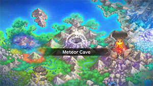
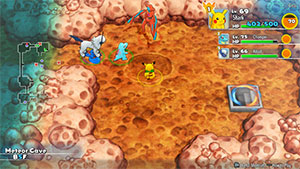

  

[Introduction]

# Overview

<table class="dungeonOverview">
  <tr>
    <th>Unlock</th>
    <td class="highlightYellow">Clear Silver Trench.</td>
  </tr>
</table>

<table class="dungeonTable">
  <tr>
    <th>Floors</th>
    <td>B20F</td>
    <th>Job Rank</th>
    <td>⭐︎</td>
  </tr>
  <tr>
    <th>Radar / Scanning</th>
    <td>No</td>
    <th>Weather</th>
    <td>Clear</td>
  </tr>
  <tr>
    <th>Dark Halls</th>
    <td>1 Tile</td>
    <th>Boss</th>
    <td>Deoxys</td>
  </tr>
  <tr>
    <th>Max Team Size</th>
    <td>3</td>
    <th>Strong Foe</th>
    <td>None</td>
  </tr>
  <tr>
    <th>Bring Items</th>
    <td>Yes</td>
    <th>Shops</th>
    <td>No</td>
  </tr>
  <tr>
    <th>Bring Poke</th>
    <td>Yes</td>
    <th>Monster Houses</th>
    <td>Yes</td>
  </tr>
  <tr>
    <th>Level Reset</th>
    <td>No</td>
    <th>Mystery Houses</th>
    <td>No</td>
  </tr>
  <tr>
    <th>Clear Icon</th>
    <td>None</td>
    <th>Reward</th>
    <td>Deoxys joins.</td>
  </tr>
</table>

# Pokemon

Rate = Recruit rate. Red stats = Stats as an enemy. Ability colors: Caution, Dangerous Move colors: Boosting, Destroys Items, Caution, Dangerous

#### Wild

- Stats of mirage Deoxys increase every 5 floors, according to the JP wiki.
    - Notably, HP increases from 155 → 165 → 175 → 185.

 

|Floor|Image|Name|Rate|Lv|HP|Atk|Def|SpA|SpD|Spe|Exp|Ability + Moves|
|-|-|-|-|-|-|-|-|-|-|-|-|-|
|1-19||Deoxys |-|55|79 155|103 115|61 64|85 95|58 62|91 111|200|Pressure Leer / Night Shade / Psycho Shift / Wrap / Cosmic Power / Knock Off / Pursuit / Zen Headbutt / Teleport / Snatch / Psychic ※ Only 1 spawns per floor.|
|1-19||Deoxys (A) |-|55|79 155|100 112|58 61|94 104|57 61|95 124|200|Pressure Leer / Night Shade / Psycho Shift / Wrap / Cosmic Power / Teleport / Pursuit / Zen Headbutt / Psychic / Superpower / Taunt ※ High attack, low defense.|
|1-19||Deoxys (D) |-|55|79 155|103 115|49 52|95 105|48 52|103 132|200|Pressure Leer / Night Shade / Psycho Shift / Wrap / Iron Defense / Knock Off / Spikes / Zen Headbutt / Psychic / Teleport / Snatch / Amnesia ※ High defense, low attack.|
|1-19||Deoxys (S) |-|55|79 155|103 115|61 64|85 95|58 62|91 111|200|Pressure Leer / Night Shade / Psycho Shift / Wrap / Double Team / Knock Off / Pursuit / Zen Headbutt / Psychic / Swift / Agility ※ High evasion, low defense.|

#### Boss

- Win condition is to defeat Normal form Deoxys.
    - If all 3 mirage Deoxys are defeated, 3 more mirage Deoxys spawn on the next turn.

 

|Floor|Image|Name|Rate|Lv|HP|Atk|Def|SpA|SpD|Spe|Exp|Ability + Moves|
|-|-|-|-|-|-|-|-|-|-|-|-|-|
|20||Deoxys |100%|55|79 1279|103 123|61 81|85 85|58 58|91 91|0|Pressure Cosmic Power / Calm Mind / Recover / Teleport ※ Defeat this target to win.|
|20||Deoxys (A) |-|55|79 155|100 112|58 61|94 104|57 61|95 124|0|Pressure Psycho Boost / Zap Cannon / Hyper Beam / Pursuit|
|20||Deoxys (D) |-|55|79 155|103 115|49 52|95 105|48 52|103 132|0|Pressure Zen Headbutt / Light Screen / Protect / Counter|
|20||Deoxys (S) |-|55|79 155|103 115|61 64|85 95|58 62|91 111|0|Pressure Extreme Speed / Night Shade / Agility / Psychic|

# Items

#### Floor

|Name|Rate|
|-|-|
|Cover Band|0.742%|
|Efficient Bandanna|0.742%|
|Goggle Specs|0.186%|
|Gold Ribbon|0.0186%|
|Heal Ribbon|0.186%|
|Insomniscope|0.186%|
|Joy Ribbon|0.186%|
|Nullify Bandanna|0.371%|
|Pecha Scarf|0.186%|
|Persim Band|0.186%|
|Recovery Scarf|0.186%|
|Scope Lens|0.186%|
|Weather Band|0.186%|
|X-Ray Specs|0.186%|
|Apple|6.21%|
|Poke|65.2%|
|Max Elixir|1.43%|
|Max Ether|4.78%|
|Blast Seed|0.991%|
|Cheri Berry|0.991%|
|Chesto Berry|0.497%|
|Empowerment Seed|0.991%|
|Eyedrop Seed|1.99%|
|Oran Berry|4.97%|
|Pecha Berry|2.47%|
|Rawst Berry|1.49%|
|Sleep Seed|0.991%|
|Stun Seed|0.497%|
|Tiny Reviver Seed|1.49%|
|Totter Seed|0.497%|
|Training Seed|0.247%|
|Warp Seed|0.497%|

# Traps

|Name|
|-|
|Wonder Tile|
|Training Switch|
|Grudge Trap|
|Sticky Trap|
|Trip Trap|
|Big Blast Trap|
|Poison Trap|
|Blast Trap|
|Hunger Trap|
|Seal Trap|
|Grimy Trap|
|Random Trap|
|Summon Trap|
|Apple Trap|
|Warp Trap|
|PP Leech Trap|
