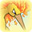

  

Dungeon that introduces weather, with specific floors having Sunny weather which boosts Fire type attacks. Lava tiles also make an appearance, which can't be traversed by most non-Fire or Flying type Pokemon. Enemies that have Flame Body or Magma Armor as an ability are effectively immune to thrown items. Slugma and Fearow can destroy edible items, and Numel can have a room-wide attack called Magnitude. There's a checkpoint during the first clear between 12F and 13F, and Moltres appears as a boss on 15F.

# Overview

<table class="dungeonOverview">
  <tr>
    <th>Unlock</th>
    <td class="highlightYellow">Clear Lapis Cave.</td>
  </tr>
</table>

<table class="dungeonTable">
  <tr>
    <th>Floors</th>
    <td>14F</td>
    <th>Job Rank</th>
    <td>D</td>
  </tr>
  <tr>
    <th>Radar / Scanning</th>
    <td>Yes</td>
    <th>Weather</th>
    <td>Clear: 1-4, 6, 8, 10, 12F Sunny: 5, 7, 9, 11, 13-14F</td>
  </tr>
  <tr>
    <th>Dark Halls</th>
    <td>No</td>
    <th>Boss</th>
    <td>Moltres</td>
  </tr>
  <tr>
    <th>Max Team Size</th>
    <td>3</td>
    <th>Strong Foe</th>
    <td>Azumarill</td>
  </tr>
  <tr>
    <th>Bring Items</th>
    <td>Yes</td>
    <th>Shops</th>
    <td>Yes</td>
  </tr>
  <tr>
    <th>Bring Poke</th>
    <td>Yes</td>
    <th>Monster Houses</th>
    <td>No</td>
  </tr>
  <tr>
    <th>Level Reset</th>
    <td>No</td>
    <th>Mystery Houses</th>
    <td>No</td>
  </tr>
  <tr>
    <th>Clear Icon</th>
    <td></td>
    <th>Reward</th>
    <td>Unlock Frosty Forest</td>
  </tr>
</table>

# Needed Camps

- Cannot recruit during the first clear.

#### Wild

|Name|Price|Pokemon|
|-|-|-|
|Flyaway Forest|500|Pidgeot|
|Ravaged Field|700|Fearow|
|Scorched Plains|700|Arcanine, Rapidash|
|Crater|5000|Slugma, Magby, Numel, Torkoal|
|Turtleshell Pond|6000|Azumarill|

#### Fainted

|Name|Price|Pokemon|
|-|-|-|
|Wild Plains|-|Mightyena|
|Thunder Crag|600|Furret|
|Mt. Cleft|700|Aron|
|Magnetic Quarry|700|Metang|
|Mt. Discipline|700|Hitmontop|
|Turtleshell Pond|6000|Corphish|

# Pokemon

Rate = Recruit rate. Red stats = Stats as an enemy. Ability colors: Caution, Dangerous Move colors: Boosting, Destroys Items, Caution, Dangerous

#### Wild

|Floor|Image|Name|Rate|Lv|HP|Atk|Def|SpA|SpD|Spe|Exp|Ability + Moves|
|-|-|-|-|-|-|-|-|-|-|-|-|-|
|1-6||Magby |10.8%|19|54 64|41 35|30 27|40 27|33 29|37 37|41|Flame Body Smog / Leer / Ember / Smokescreen / Feint Attack / Fire Spin / Clear Smog|
|1-6 Rare||Numel  |10.8%|19|55 75|40 35|30 26|40 30|30 26|29 29|35|Oblivious or Simple Growl / Tackle / Ember / Magnitude / Focus Energy / Flame Burst / Amnesia|
|1-11||Slugma |10.8%|19|51 65|30 33|39 28|34 29|30 29|28 28|40|Magma Armor or Flame Body Yawn / Smog / Ember / Rock Throw / Harden / Incinerate|
|3-7 9-10 12-14 Foe|  |Azumarill  |-6.4%|19|54 222|23 70|27 40|23 65|27 42|28 28|480|Thick Fat or Huge Power Tackle / Tail Whip / Water Gun / Bubble / Water Sport / Defense Curl / Rollout / Bubble Beam / Helping Hand ※ Friend Bow required to recruit.|
|4-9||Pidgeot  |-2.2%|36|69 65|50 36|47 22|44 36|42 22|56 56|50|Keen Eye or Tangled Feet Hurricane / Sand Attack / Gust / Agility / Whirlwind / Twister / Feather Dance / Quick Attack / Tackle ※ Can Mega Evolve.|
|9-13||Torkoal |10.8%|19|55 72|34 36|45 23|34 38|30 20|36 26|40|White Smoke or Drought Ember / Smog / Withdraw / Rapid Spin / Fire Spin / Smokescreen / Flame Wheel|
|12-14||Fearow  |10.8%|20|55 70|42 40|31 27|31 35|30 28|38 38|55|Keen Eye Drill Run / Pluck / Peck / Growl / Leer / Mirror Move / Fury Attack / Aerial Ace / Pursuit|
|12-14||Arcanine |10.8%|19|60 80|44 39|33 28|40 33|30 27|35 35|49|Intimidate or Flash Fire Thunder Fang / Bite / Roar / Fire Fang / Odor Sleuth|
|12-14 Rare||Rapidash |-2.2%|40|72 105|67 55|49 30|57 50|48 32|76 76|86|Run Away or Flash Fire Poison Jab / Quick Attack / Megahorn / Tail Whip / Ember / Growl / Fury Attack / Flame Wheel / Flame Charge / Fire Spin / Take Down / Inferno / Agility / Stomp|

#### Boss

|Floor|Image|Name|Rate|Lv|HP|Atk|Def|SpA|SpD|Spe|Exp|Ability + Moves|
|-|-|-|-|-|-|-|-|-|-|-|-|-|
|15||Moltres  |-|20|64 664|43 43|36 36|47 47|36 36|38 38|0|Pressure Ember / Wing Attack / Fire Spin / Agility ※ First clear.|
|15 Rematch||Moltres  |100%|50|87 1987|75 95|57 77|82 82|57 57|74 74|0|Pressure Fire Spin / Flamethrower / Air Slash / Ancient Power ※ Available post-game. ※ Rare Quality: Squeeze Out|

#### Fainted

|Image|Name|Lv|HP|Atk|Def|SpA|SpD|Spe|
|-|-|-|-|-|-|-|-|-|
||Furret |20|55|34|31|28|28|36|
||Hitmontop |24|55|52|32|32|48|43|
||Mightyena |20|55|42|31|30|30|34|
||Aron  |20|55|42|46|28|28|30|
||Corphish |20|55|46|35|34|28|32|
||Metang  |22|57|38|38|34|34|35|

# Items

#### Floor

|Name|Floors|Rate|
|-|-|-|
|Grimy Food|1-14|2.67%|
|Link Box|1-14|4.81%|
|Poke|1-14|64.2%|
|Max Ether|1-14|8.02%|
|Blast Seed|1-14|0.341%|
|Cheri Berry|1-14|0.341%|
|Chesto Berry|1-14|0.171%|
|Eyedrop Seed|1-14|0.682%|
|Oran Berry|1-14|1.71%|
|Pecha Berry|1-14|0.853%|
|Rawst Berry|1-14|0.512%|
|Sleep Seed|1-14|0.341%|
|Stun Seed|1-14|0.171%|
|Tiny Reviver Seed|1-14|0.512%|
|Totter Seed|1-14|0.171%|
|Training Seed|1-14|0.0853%|
|Geo Pebble|1-14|5.35%|
|Gravelerock|1-14|5.35%|
|(Random TM)|1-14|1.07%|
|Confuse Wand|1-14|0.534%|
|Petrify Wand|1-14|0.534%|
|Slow Wand|1-14|0.534%|
|Slumber Wand|1-14|0.267%|
|Stayaway Wand|1-14|0.4%|
|Switcher Wand|1-14|0.134%|
|Tunnel Wand|1-14|0.134%|
|Whirlwind Wand|1-14|0.134%|

#### Shop

|Name|Rate|
|-|-|
|Apple|13.2%|
|Link Box|7.89%|
|All Dodge Orb|0.858%|
|All Power-Up Orb|0.858%|
|Foe-Hold Orb|2.58%|
|Foe-Seal Orb|1.72%|
|Nullify Orb|0.858%|
|Petrify Orb|0.858%|
|Quick Orb|0.858%|
|Rollcall Orb|0.858%|
|Slow Orb|0.858%|
|Slumber Orb|1.72%|
|Totter Orb|0.858%|
|Trawl Orb|0.429%|
|Wigglytuff Orb|8.58%|
|Max Ether|13.2%|
|Blast Seed|0.959%|
|Cheri Berry|0.959%|
|Chesto Berry|0.48%|
|Eyedrop Seed|1.92%|
|Oran Berry|4.32%|
|Pecha Berry|1.92%|
|Rawst Berry|1.44%|
|Sleep Seed|0.959%|
|Stun Seed|0.48%|
|Tiny Reviver Seed|3.36%|
|Totter Seed|0.48%|
|Training Seed|0.24%|
|Geo Pebble|11.0%|
|Gravelerock|11.0%|
|Confuse Wand|0.878%|
|Petrify Wand|0.878%|
|Slow Wand|0.878%|
|Slumber Wand|0.439%|
|Stayaway Wand|0.658%|
|Switcher Wand|0.22%|
|Tunnel Wand|0.22%|
|Whirlwind Wand|0.22%|

# Traps

|Name|
|-|
|Wonder Tile|
|Training Switch|
|Spin Trap|
|Slumber Trap|
|Spiky Trap|
|Gust Trap|
|Slow Trap|
