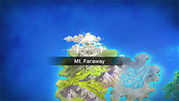
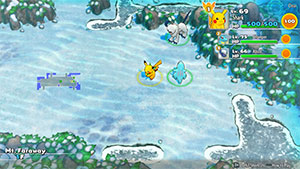

  

[Introduction]

# Overview

<table class="dungeonOverview">
  <tr>
    <th>Unlock</th>
    <td class="highlightYellow">Clear Northwind Field.</td>
  </tr>
</table>

<table class="dungeonTable">
  <tr>
    <th>Floors</th>
    <td>60F</td>
    <th>Job Rank</th>
    <td>⭐︎</td>
  </tr>
  <tr>
    <th>Radar / Scanning</th>
    <td>No</td>
    <th>Weather</th>
    <td>Hail: 3, 7, 11, 15, 30, 40, 50F</td>
  </tr>
  <tr>
    <th>Dark Halls</th>
    <td>2 Tiles</td>
    <th>Boss</th>
    <td>Ho-Oh</td>
  </tr>
  <tr>
    <th>Max Team Size</th>
    <td>3</td>
    <th>Strong Foe</th>
    <td>Electrode</td>
  </tr>
  <tr>
    <th>Bring Items</th>
    <td>Yes</td>
    <th>Shops</th>
    <td>No</td>
  </tr>
  <tr>
    <th>Bring Poke</th>
    <td>Yes</td>
    <th>Monster Houses</th>
    <td>Yes</td>
  </tr>
  <tr>
    <th>Level Reset</th>
    <td>No</td>
    <th>Mystery Houses</th>
    <td>Yes (Fixed: 30F)</td>
  </tr>
  <tr>
    <th>Clear Icon</th>
    <td>None</td>
    <th>Reward</th>
    <td>Unlock Western Cave</td>
  </tr>
</table>

# Needed Camps

#### Wild

|Name|Price|Pokemon|
|-|-|-|
|Power Plant|-|Electrode|
|Darkness Ridge|-|Ninetales, Absol|
|Thunder Crag|600|Castform|
|Mt. Cleft|700|Charizard, Tyranitar|
|Ravaged Field|700|Skarmory|
|Mt. Green|700|Golem|
|Boulder Cave|700|Steelix|
|Mt. Discipline|700|Machamp, Hariyama|
|Scorched Plains|700|Growlithe, Arcanine, Typhlosion, Blaziken|
|Frigid Cavern|800|Glalie|
|Rub-a-Dub River|3000|Feraligatr|
|Crater|5000|Magcargo|
|Turtleshell Pond|6000|Blastoise|
|Decrepit Lab|6000|Alakazam|
|Gourd Swamp|9000|Swampert|

#### Fainted

|Name|Price|Pokemon|
|-|-|-|
|Wild Plains|-|Linoone|
|Stump Forest|-|Weedle, Ledyba, Silcoon|
|Sky-Blue Plains|-|Igglybuff, Happiny, Snubbull|
|Darkness Ridge|-|Vulpix|
|Flyaway Forest|500|Natu, Togekiss|
|Safari|600|Rhydon, Rhyperior|
|Mt. Cleft|700|Aggron|
|Boulder Cave|700|Dugtrio|
|Scorched Plains|700|Ponyta|
|Mushroom Forest|800|Seedot|
|Vibrant Forest|800|Primeape|
|Frigid Cavern|800|Snorunt|
|Withering Desert|900|Sandslash|
|Tadpole Pond|900|Lombre|
|Secretive Forest|900|Venonat|
|Echo Cave|2700|Zubat|
|Dragon Cave|3000|Salamence|
|Crater|5000|Magby|
|Turtleshell Pond|6000|Azurill|
|Serene Sea|9000|Mantyke|
|Waterfall Lake|9000|Feebas, Milotic|
|Deepsea Floor|9000|Kabutops, Huntail|

#### Mystery House

|Name|Price|Pokemon|
|-|-|-|
|Sky-Blue Plains|-|Gallade|
|Mt. Discipline|700|Machamp, Hitmonlee, Hitmonchan, Hitmontop, Hariyama, Medicham, Riolu, Lucario|
|Vibrant Forest|800|Munchlax|
|Tadpole Pond|900|Poliwrath|

# Pokemon

Rate = Recruit rate. Red stats = Stats as an enemy. Ability colors: Caution, Dangerous Move colors: Boosting, Destroys Items, Caution, Dangerous

#### Wild

|Floor|Image|Name|Rate|Lv|HP|Atk|Def|SpA|SpD|Spe|Exp|Ability + Moves|
|-|-|-|-|-|-|-|-|-|-|-|-|-|
|1-5||Magcargo  |-2.2%|55|79 160|61 64|69 75|69 73|53 60|85 104|163|Magma Armor or Flame Body Yawn / Harden / Rock Throw / Amnesia / Flame Burst / Lava Plume / Clear Smog / Smog / Rock Slide / Ember / Incinerate / Body Slam / Shell Smash / Earth Power / Ancient Power / Recover / Flamethrower|
|1-9||Growlithe |10.8%|55|91 150|87 91|59 60|79 83|53 55|94 104|155|Intimidate or Flash Fire Retaliate / Odor Sleuth / Helping Hand / Roar / Reversal / Ember / Flame Burst / Fire Fang / Flame Wheel / Take Down / Flamethrower / Leer / Crunch / Agility / Bite / Outrage / Heat Wave / Flare Blitz|
|1-9||Machamp |8.2%|55|89 155|94 98|56 55|61 63|55 55|80 88|152|Guts or No Guard Foresight / Wide Guard / Karate Chop / Vital Throw / Focus Energy / Revenge / Scary Face / Low Sweep / Submission / Wake-Up Slap / Cross Chop / Low Kick / Leer / Dual Chop / Strength / Knock Off / Bulk Up / Seismic Toss|
|1-10||Hariyama |6.4%|55|101 170|87 91|54 55|52 55|53 55|97 107|174|Thick Fat or Guts Tackle / Focus Energy / Wake-Up Slap / Brine / Fake Out / Force Palm / Endure / Whirlwind / Sand Attack / Vital Throw / Knock Off / Belly Drum / Seismic Toss / Smelling Salts / Arm Thrust / Reversal / Close Combat / Heavy Slam|
|1-30 Rare||Castform |8.2%|55|84 130|69 73|54 55|61 64|53 55|81 91|120|Forecast Tackle / Water Gun / Powder Snow / Ember / Headbutt / Rain Dance / Hail / Sunny Day / Hurricane / Hydro Pump / Fire Blast / Blizzard / Weather Ball|
|5-59 Foe|  |Electrode |-6.4%|60|88 570|64 150|55 80|73 150|55 80|100 200|830|Sound Proof or Static Magnetic Flux / Charge / Sonic Boom / Tackle / Eerie Impulse / Electro Ball / Spark / Rollout / Self-Destruct / Swift / Magnet Rise / Charge Beam / Screech / Light Screen / Discharge / Explosion / Gyro Ball / Mirror Coat ※ Friend Bow required to recruit.|
|6-19||Skarmory  |14.4%|55|84 144|69 73|74 75|52 55|53 55|100 110|171|Keen Eye or Sturdy Leer / Peck / Sand Attack / Metal Claw / Air Cutter / Fury Attack / Feint / Swift / Air Slash / Agility / Steel Wing / Slash / Metal Sound / Spikes / Autotomize / Night Slash|
|10-19||Feraligatr |6.4%|55|84 155|77 82|60 61|67 71|55 57|88 77|173|Torrent Leer / Scratch / Water Gun / Screech / Rage / Scary Face / Ice Fang / Agility / Flail / Crunch / Chip Away / Slash / Bite|
|10-19||Absol |6.4%|55|84 135|95 100|54 55|69 73|53 55|75 80|179|Pressure or Super Luck Sucker Punch / Taunt / Quick Attack / Detect / Pursuit / Me First / Razor Wind / Scratch / Double Team / Swords Dance / Feint / Slash / Leer / Night Slash / Bite / Future Sight / Perish Song / Psycho Cut ※ Can Mega Evolve.|
|10-20||Arcanine |10.8%|55|91 149|87 91|59 60|79 83|53 55|94 104|182|Intimidate or Flash Fire Thunder Fang / Bite / Roar / Fire Fang / Odor Sleuth / Extreme Speed|
|10-20||Golem  |10.8%|55|82 140|85 90|69 70|59 63|48 50|75 85|175|Rock Head or Sturdy Tackle / Defense Curl / Mud Sport / Rock Polish / Rock Blast / Magnitude / Rock Throw / Smack Down / Explosion / Self-Destruct / Stealth Rock / Bulldoze / Earthquake / Heavy Slam / Steamroller / Double-Edge / Stone Edge|
|20-29||Typhlosion |8.2%|55|86 130|69 71|56 55|77 80|55 55|83 91|160|Blaze Double-Edge / Gyro Ball / Tackle / Leer / Smokescreen / Ember / Quick Attack / Defense Curl / Swift / Flame Charge / Lava Plume / Flame Wheel / Eruption / Flamethrower|
|20-30||Tyranitar  |6.4%|55|87 145|88 96|54 60|73 79|53 60|97 107|172|Sand Stream Thunder Fang / Chip Away / Sandstorm / Thrash / Scary Face / Crunch / Screech / Fire Fang / Rock Slide / Ice Fang / Leer / Bite / Dark Pulse / Earthquake / Payback ※ Can Mega Evolve.|
|30-39||Alakazam |6.4%|55|79 140|59 63|49 50|93 99|53 55|97 97|166|Synchronize or Inner Focus Psycho Cut / Miracle Eye / Confusion / Psybeam / Teleport / Reflect / Recover / Calm Mind / Telekinesis / Future Sight / Psychic / Kinesis / Ally Switch / Trick / Disable ※ Can Mega Evolve.|
|30-39||Blaziken  |6.4%|55|86 143|84 88|56 55|77 80|55 55|90 98|180|Blaze Double Kick / Sand Attack / Blaze Kick / Fire Punch / High Jump Kick / Scratch / Slash / Growl / Ember / Focus Energy / Bulk Up / Flame Charge / Quick Attack / Peck / Brave Bird / Flare Blitz ※ Can Mega Evolve.|
|30-40||Glalie |-2.2%|55|84 154|69 73|59 60|69 73|53 55|100 110|148|Inner Focus or Ice Body Freeze-Dry / Powder Snow / Leer / Hail / Frost Breath / Bite / Ice Fang / Blizzard / Icy Wind / Crunch / Protect / Headbutt / Double Team / Ice Shard / Sheer Cold ※ Can Mega Evolve.|
|40-49||Ninetales |6.4%|55|84 139|69 73|54 55|69 73|58 60|94 94|169|Flash Fire Imprison / Nasty Plot / Flamethrower / Quick Attack / Confuse Ray / Safeguard|
|40-49||Swampert  |6.4%|55|90 155|85 88|60 63|70 71|59 63|75 107|175|Torrent Protect / Take Down / Tackle / Growl / Bide / Foresight / Mud-Slap / Mud Shot / Mud Bomb / Rock Slide / Muddy Water / Water Gun / Earthquake / Hammer Arm ※ Can Mega Evolve.|
|46-59||Steelix  |10.8%|55|84 150|69 73|84 85|61 64|53 55|94 74|177|Rock Head or Sturdy Thunder Fang / Harden / Sandstorm / Stone Edge / Bind / Mud Sport / Curse / Tackle / Rock Throw / Rock Tomb / Dig / Crunch / Stealth Rock / Dragon Breath / Ice Fang / Smack Down / Double-Edge / Gyro Ball / Rage / Rock Slide / Screech / Slam / Iron Tail / Autotomize / Fire Fang ※ Can Mega Evolve.|
|50-59||Charizard  |6.4%|55|86 155|69 71|56 55|77 80|55 55|93 101|164|Blaze Scary Face / Flare Blitz / Heat Wave / Dragon Claw / Shadow Claw / Air Slash / Ember / Wing Attack / Smokescreen / Growl / Slash / Dragon Rage / Scratch / Fire Fang / Flame Burst / Flamethrower ※ Can Mega Evolve.|
|50-59||Blastoise |6.4%|55|84 157|67 71|61 62|67 71|54 56|78 88|170|Torrent Bite / Tackle / Tail Whip / Flash Cannon / Protect / Withdraw / Bubble / Aqua Tail / Water Gun / Rapid Spin / Water Pulse / Rain Dance / Skull Bash / Iron Defense ※ Can Mega Evolve.|

#### Boss

|Floor|Image|Name|Rate|Lv|HP|Atk|Def|SpA|SpD|Spe|Exp|Ability + Moves|
|-|-|-|-|-|-|-|-|-|-|-|-|-|
|60||Ho-Oh  |100%|60|94 2094|100 120|60 80|83 83|75 75|94 94|0|Pressure Whirlwind / Fire Blast / Sacred Fire / Flamethrower|

#### Fainted

|Image|Name|Lv|HP|Atk|Def|SpA|SpD|Spe|
|-|-|-|-|-|-|-|-|-|
||Weedle |57|84|73|49|52|44|89|
||Sandslash |57|86|80|69|54|49|95|
||Vulpix |59|87|72|55|72|60|102|
||Zubat  |57|85|77|54|62|54|88|
||Venonat  |59|87|63|55|72|55|111|
||Dugtrio |59|82|72|50|54|55|105|
||Primeape |57|85|80|54|62|54|98|
||Ponyta |57|85|80|54|70|54|110|
||Rhydon  |57|95|97|69|60|49|79|
||Kabutops  ||||||||
||Ledyba  |57|80|53|49|62|69|107|
||Igglybuff  |57|97|67|44|67|44|76|
||Natu  |59|87|72|55|82|55|92|
||Snubbull |57|92|89|59|62|58|101|
||Magby ||||||||
||Linoone |57|85|70|54|53|54|88|
||Silcoon ||||||||
||Lombre  |57|85|69|49|69|54|74|
||Seedot |57|89|77|49|69|49|82|
||Azurill  ||||||||
||Aggron  |59|87|89|75|62|50|93|
||Feebas |57|92|62|54|55|69|102|
||Milotic |59|93|63|62|82|76|86|
||Snorunt |57|85|70|59|70|54|104|
||Huntail |57|80|80|69|80|54|82|
||Salamence  |59|91|97|60|78|50|86|
||Happiny |57|120|48|44|67|59|82|
||Mantyke  |57|85|53|54|70|74|104|
||Rhyperior  |57|95|97|69|60|49|79|
||Togekiss  |59|86|62|60|87|60|102|

#### Mystery House

|Image|Name|Image|Name|Image|Name|Image|Name|
|-|-|-|-|-|-|-|-|
||Poliwrath  ||Machamp ||Hitmonlee ||Hitmonchan |
||Hitmontop ||Munchlax ||Gallade  ||Hariyama |
||Medicham  ||Riolu ||Lucario  |||

# Items

#### Floor

|Name|Floors|Rate|
|-|-|-|
|Big Eater Belt|1-59|0.172%|
|Efficient Bandanna|1-59|0.687%|
|Goggle Specs|1-59|0.172%|
|Gold Ribbon|1-59|0.0172%|
|Heal Ribbon|1-59|0.172%|
|Insomniscope|1-59|0.172%|
|Joy Ribbon|1-59|0.172%|
|Munch Belt|1-59|0.172%|
|Nullify Bandanna|1-59|0.343%|
|Pecha Scarf|1-59|0.172%|
|Persim Band|1-59|0.172%|
|Recovery Scarf|1-59|0.172%|
|Scope Lens|1-59|0.172%|
|Sneak Scarf|1-59|0.172%|
|Stamina Band|1-59|0.172%|
|Weather Band|1-59|0.172%|
|X-Ray Specs|1-59|0.172%|
|Apple|1-59|2.87%|
|Poke|1-59|60.3%|
|Max Elixir|1-59|1.33%|
|Max Ether|1-59|4.42%|
|Blast Seed|1-59|0.87%|
|Cheri Berry|1-59|0.87%|
|Chesto Berry|1-59|0.435%|
|Empowerment Seed|1-59|0.87%|
|Eyedrop Seed|1-59|1.74%|
|Heal Seed|1-59|0.87%|
|Oran Berry|1-59|4.35%|
|Pecha Berry|1-59|2.18%|
|Rawst Berry|1-59|1.31%|
|Sleep Seed|1-59|0.87%|
|Stun Seed|1-59|0.435%|
|Tiny Reviver Seed|1-59|1.31%|
|Totter Seed|1-59|0.435%|
|Training Seed|1-59|0.218%|
|Warp Seed|1-59|0.435%|
|Geo Pebble|1-59|5.75%|
|Confuse Wand|1-59|0.242%|
|Guiding Wand|1-59|0.242%|
|HP-Swap Wand|1-59|0.242%|
|Petrify Wand|1-59|0.242%|
|Pounce Wand|1-59|0.483%|
|Slow Wand|1-59|0.242%|
|Slumber Wand|1-59|0.483%|
|Stayaway Wand|1-59|0.727%|
|Surround Wand|1-59|0.483%|
|Switcher Wand|1-59|0.242%|
|Tunnel Wand|1-59|0.242%|
|Two-Edged Wand|1-59|0.242%|
|Warp Wand|1-59|0.242%|
|Whirlwind Wand|1-59|0.242%|

# Traps

|Name|
|-|
|Wonder Tile|
|Training Switch|
|Grudge Trap|
|Sticky Trap|
|Trip Trap|
|Big Blast Trap|
|Poison Trap|
|Blast Trap|
|Hunger Trap|
|Seal Trap|
|Grimy Trap|
|Random Trap|
|Summon Trap|
|Apple Trap|
|Warp Trap|
|PP Leech Trap|
