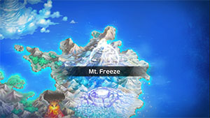
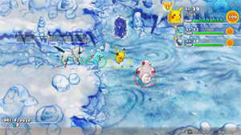

  

# Overview

<table class="dungeonOverview">
  <tr>
    <th>Unlock</th>
    <td class="highlightYellow">Clear Frosty Forest.</td>
  </tr>
</table>

<table class="dungeonTable">
  <tr>
    <th>Floors</th>
    <td>20F</td>
    <th>Job Rank</th>
    <td>C</td>
  </tr>
  <tr>
    <th>Radar / Scanning</th>
    <td>Yes</td>
    <th>Weather</th>
    <td>Clear: 1-12, 14, 16, 19F Hail: 13, 15, 17-18, 20F</td>
  </tr>
  <tr>
    <th>Dark Halls</th>
    <td>No</td>
    <th>Boss</th>
    <td>None</td>
  </tr>
  <tr>
    <th>Max Team Size</th>
    <td>3</td>
    <th>Strong Foe</th>
    <td>Lickilicky</td>
  </tr>
  <tr>
    <th>Bring Items</th>
    <td>Yes</td>
    <th>Shops</th>
    <td>Yes</td>
  </tr>
  <tr>
    <th>Bring Poke</th>
    <td>Yes</td>
    <th>Monster Houses</th>
    <td>No</td>
  </tr>
  <tr>
    <th>Level Reset</th>
    <td>No</td>
    <th>Mystery Houses</th>
    <td>No</td>
  </tr>
  <tr>
    <th>Clear Icon</th>
    <td>None</td>
    <th>Reward</th>
    <td>Return to Team Base Unlock Uproar Forest</td>
  </tr>
</table>

Final dungeon of the fugitive arc, and this time there isn't a boss fight at the end. Once you clear this dungeon, you'll return to your Rescue Team base and can access Pokemon Square again. Hail and Sandstorm (via Pupitar) weather both appear, so consider bringing orbs or healing items as a counter. Pineco can know Bug Bite, so use ranged attacks to keep your Oran Berries and Tiny Reviver Seeds safe. Glalie can know Sheer Cold which instantly KOs a target, so don't let it act when adjacent.

# Needed Camps

- Cannot recruit during the first clear.

#### Wild

|Name|Price|Pokemon|
|-|-|-|
|Sky-Blue Plains|-|Lickilicky|
|Wild Plains|-|Zangoose, Seviper|
|Flyaway Forest|500|Swablu|
|Thunder Crag|600|Chimecho|
|Mt. Cleft|700|Pupitar|
|Frigid Cavern|800|Glalie|
|Vibrant Forest|800|Vigoroth, Slaking|
|Secretive Forest|900|Pineco|
|Dragon Cave|3000|Shelgon|
|Ice Floe Beach|6000|Seel|

#### Fainted

|Name|Price|Pokemon|
|-|-|-|
|Scorched Plains|700|Ponyta|
|Mt. Discipline|700|Hitmonchan|
|Vibrant Forest|800|Aipom|
|Mushroom Forest|800|Seedot|
|Tadpole Pond|900|Surskit|
|Secretive Forest|900|Venonat|

# Pokemon

Rate = Recruit rate. Red stats = Stats as an enemy. Ability colors: Caution, Dangerous Move colors: Boosting, Destroys Items, Caution, Dangerous

#### Wild

|Floor|Image|Name|Rate|Lv|HP|Atk|Def|SpA|SpD|Spe|Exp|Ability + Moves|
|-|-|-|-|-|-|-|-|-|-|-|-|-|
|1-4||Vigoroth |10.8%|22|58 72|38 37|38 27|34 34|30 28|40 40|42|Vital Spirit Reversal / Scratch / Focus Energy / Encore / Uproar / Fury Swipes / Endure|
|1-5||Seel |10.8%|22|65 68|37 36|38 27|34 34|38 27|38 38|41|Thick Fat or Hydration Headbutt / Growl / Water Sport / Rest / Icy Wind / Encore / Ice Shard|
|1-5||Zangoose |10.8%|22|58 73|50 40|34 32|34 32|34 30|41 41|43|Immunity Scratch / Leer / Quick Attack / Slash / Fury Cutter / Pursuit / Hone Claws / Revenge|
|3-5 7-8 11-20 Foe|  |Lickilicky |-6.4%|22|66 355|38 72|38 45|38 74|38 45|35 35|550|Own Tempo or Oblivious Lick / Wring Out / Power Whip / Wrap / Supersonic / Defense Curl / Stomp / Knock Off ※ Friend Bow required to recruit.|
|4-8||Pineco |10.8%|22|57 57|45 38|49 31|34 32|34 29|32 32|44|Sturdy Tackle / Protect / Bide / Bug Bite / Take Down / Rapid Spin / Self-Destruct|
|6-12||Chimecho |10.8%|22|57 65|34 36|34 25|45 39|34 26|38 38|35|Levitate Healing Wish / Synchronoise / Wrap / Growl / Astonish / Confusion / Yawn / Psywave / Take Down / Extrasensory|
|6-12||Pupitar  |10.8%|30|65 70|50 41|45 27|45 35|45 28|47 47|40|Shed Skin Bite / Leer / Sandstorm / Screech / Chip Away / Rock Slide / Scary Face / Thrash|
|7-12||Swablu  |10.8%|22|57 80|37 34|38 30|34 35|38 29|38 38|50|Natural Cure Peck / Growl / Astonish / Sing / Mist / Fury Attack / Safeguard / Round / Disarming Voice / Natural Gift|
|11-20||Shelgon |10.8%|30|65 66|60 46|50 29|45 42|40 27|47 47|52|Rock Head Rage / Ember / Leer / Bite / Protect / Dragon Breath / Headbutt / Crunch / Focus Energy / Dragon Claw|
|13-20||Seviper |10.8%|22|58 75|46 47|34 27|46 40|34 28|38 38|55|Shed Skin Wrap / Swagger / Bite / Poison Tail / Lick / Feint / Screech / Poison Fang / Glare / Venoshock|
|13-20||Slaking |10.8%|36|71 70|60 42|52 30|51 45|42 25|59 59|51|Truant Swagger / Hammer Arm / Counter / Fling / Scratch / Yawn / Encore / Slack Off / Feint Attack / Amnesia / Covet / Chip Away / Punishment ※ Spawns sleeping.|
|16-20||Glalie |-2.2%|42|74 69|59 45|54 28|59 44|49 25|74 74|59|Inner Focus or Ice Body Powder Snow / Leer / Double Team / Sheer Cold / Ice Shard / Freeze-Dry / Bite / Ice Fang / Headbutt / Protect / Icy Wind / Forst Breath / Crunch ※ Can Mega Evolve.|

#### Fainted

|Image|Name|Lv|HP|Atk|Def|SpA|SpD|Spe|
|-|-|-|-|-|-|-|-|-|
||Venonat  |24|60|37|36|40|36|43|
||Ponyta |24|59|49|37|41|37|46|
||Hitmonchan |26|56|56|35|35|52|46|
||Aipom |24|59|49|37|36|36|46|
||Seedot |24|59|40|32|36|32|38|
||Surskit  |24|59|36|36|40|36|39|

# Items

#### Floor

|Name|Floors|Rate|
|-|-|-|
|Cover Band|1-13|0.315%|
|Defense Scarf|1-13|0.118%|
|Detect Band|1-13|0.0788%|
|Efficient Bandanna|1-13|0.235%|
|Fickle Specs|1-13|0.0788%|
|Gold Ribbon|1-13|0.0157%|
|Heal Ribbon|1-13|0.0788%|
|Heavy Rotation Specs|1-13|0.0788%|
|Joy Ribbon|1-13|0.0788%|
|Lucky Ribbon|1-13|0.0788%|
|Mach Ribbon|1-13|0.315%|
|Nullify Bandanna|1-13|0.157%|
|Power Band|1-13|0.118%|
|Prosper Ribbon|1-13|0.0788%|
|Special Band|1-13|0.118%|
|Twist Band|1-13|0.0788%|
|Zinc Band|1-13|0.118%|
|Apple|1-13|2.67%|
|Link Box|1-13|4.81%|
|Poke|1-13|48.1%|
|All Dodge Orb|1-13|0.369%|
|All Power-Up Orb|1-13|0.369%|
|Escape Orb|1-13|0.738%|
|Foe-Hold Orb|1-13|0.369%|
|Foe-Seal Orb|1-13|0.369%|
|Nullify Orb|1-13|0.369%|
|Petrify Orb|1-13|0.369%|
|Quick Orb|1-13|0.369%|
|Rollcall Orb|1-13|0.369%|
|Slow Orb|1-13|0.369%|
|Slumber Orb|1-13|0.738%|
|Totter Orb|1-13|0.369%|
|Trawl Orb|1-13|0.185%|
|Max Ether|1-13|6.42%|
|Blast Seed|1-13|2.41%|
|Chesto Berry|1-13|1.2%|
|Oran Berry|1-13|12.0%|
|Sleep Seed|1-13|1.2%|
|Stun Seed|1-13|1.2%|
|Tiny Reviver Seed|1-13|4.22%|
|Totter Seed|1-13|1.2%|
|Training Seed|1-13|0.602%|
|Geo Pebble|1-13|2.67%|
|(Random TM)|1-13|1.07%|
|Confuse Wand|1-13|0.534%|
|Petrify Wand|1-13|0.534%|
|Slow Wand|1-13|0.534%|
|Slumber Wand|1-13|0.267%|
|Stayaway Wand|1-13|0.4%|
|Switcher Wand|1-13|0.134%|
|Tunnel Wand|1-13|0.134%|
|Whirlwind Wand|1-13|0.134%|

#### Shop

|Name|Rate|
|-|-|
|Cover Band|0.00888%|
|Defense Scarf|0.00333%|
|Detect Band|0.00222%|
|Efficient Bandanna|0.00664%|
|Fickle Specs|0.00222%|
|Gold Ribbon|0.000444%|
|Heal Ribbon|0.00222%|
|Heavy Rotation Specs|0.00222%|
|Joy Ribbon|0.00222%|
|Lucky Ribbon|0.00222%|
|Mach Ribbon|0.00888%|
|Nullify Bandanna|0.00444%|
|Power Band|0.00333%|
|Prosper Ribbon|0.00222%|
|Special Band|0.00333%|
|Twist Band|0.00222%|
|Zinc Band|0.00333%|
|Apple|0.181%|
|Link Box|0.109%|
|All Dodge Orb|0.00563%|
|All Power-Up Orb|0.00563%|
|Foe-Hold Orb|0.00563%|
|Foe-Seal Orb|0.00563%|
|Nullify Orb|0.00563%|
|Petrify Orb|0.00563%|
|Quick Orb|0.00563%|
|Revive All Orb|0.0338%|
|Rollcall Orb|0.00563%|
|Slow Orb|0.00563%|
|Slumber Orb|0.00563%|
|Totter Orb|0.00563%|
|Trawl Orb|0.00282%|
|Wigglytuff Orb|0.0225%|
|Max Ether|0.121%|
|Blast Seed|0.118%|
|Cheri Berry|0.118%|
|Chesto Berry|0.118%|
|Oran Berry|97.6%|
|Pecha Berry|0.118%|
|Rawst Berry|0.118%|
|Sleep Seed|0.0589%|
|Stun Seed|0.118%|
|Tiny Reviver Seed|0.825%|
|Totter Seed|0.0589%|
|Training Seed|0.0589%|
|Confuse Wand|0.0121%|
|Petrify Wand|0.0121%|
|Slow Wand|0.0121%|
|Slumber Wand|0.00604%|
|Stayaway Wand|0.00906%|
|Switcher Wand|0.00302%|
|Tunnel Wand|0.00302%|
|Whirlwind Wand|0.00302%|

# Traps

|Name|
|-|
|Wonder Tile|
|Training Switch|
|Spin Trap|
|Slumber Trap|
|Gust Trap|
|Slow Trap|
|Blast Trap|
|Hunger Trap|
|Warp Trap|
