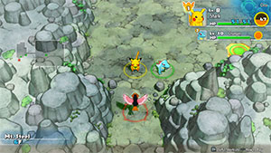

  

[Introduction]

# Overview

<table class="dungeonOverview">
  <tr>
    <th>Unlock</th>
    <td class="highlightYellow">Clear Thunderwave Cave → 2 days later.</td>
  </tr>
</table>

<table class="dungeonTable">
  <tr>
    <th>Floors</th>
    <td>9F</td>
    <th>Job Rank</th>
    <td>F</td>
  </tr>
  <tr>
    <th>Radar / Scanning</th>
    <td>Yes</td>
    <th>Weather</th>
    <td>Clear</td>
  </tr>
  <tr>
    <th>Dark Halls</th>
    <td>No</td>
    <th>Boss</th>
    <td>Skarmory</td>
  </tr>
  <tr>
    <th>Max Team Size</th>
    <td>3</td>
    <th>Strong Foe</th>
    <td>Rapidash</td>
  </tr>
  <tr>
    <th>Bring Items</th>
    <td>Yes</td>
    <th>Shops</th>
    <td>Yes</td>
  </tr>
  <tr>
    <th>Bring Poke</th>
    <td>Yes</td>
    <th>Monster Houses</th>
    <td>No</td>
  </tr>
  <tr>
    <th>Level Reset</th>
    <td>No</td>
    <th>Mystery Houses</th>
    <td>No</td>
  </tr>
  <tr>
    <th>Clear Icon</th>
    <td>None</td>
    <th>Reward</th>
    <td>Unlock Sinister Woods (3 days later)</td>
  </tr>
</table>

# Needed Camps

#### Wild

|Name|Price|Pokemon|
|-|-|-|
|Wild Plains|-|Zigzagoon|
|Ravaged Field|700|Spearow|
|Mt. Green|700|Geodude|
|Overgrown Forest|700|Pinsir|
|Scorched Plains|700|Rapidash|
|Mt. Discipline|700|Tyrogue, Meditite|
|Mt. Cleft|700|Aron|
|Ancient Relic|700|Baltoy|
|Magnetic Quarry|700|Beldum|
|Decrepit Lab|6000|Mime Jr.|

#### Fainted

|Name|Price|Pokemon|
|-|-|-|
|Safari|600|Doduo|
|Overgrown Forest|700|Scyther|
|Gourd Swamp|9000|Wooper|
|Frigid Cavern|800|Swinub|
|Mushroom Forest|800|Shroomish|
|Withering Desert|900|Trapinch|

# Pokemon

Rate = Recruit rate. Red stats = Stats as an enemy. Ability colors: Caution, Dangerous Move colors: Boosting, Destroys Items, Caution, Dangerous

#### Wild

|Floor|Image|Name|Rate|Lv|HP|Atk|Def|SpA|SpD|Spe|Exp|Ability + Moves|
|-|-|-|-|-|-|-|-|-|-|-|-|-|
|1-8||Baltoy  |14.4%|9|45 28|18 22|22 14|16 18|22 13|19|15|Levitate Harden / Confusion / Rapid Spin / Mud-Slap|
|1-8 Rare||Beldum  |14.4%|10|46 38|21 22|22 14|18 16|19 14|18|17|Clear Body Take Down|
|1-8||Tyrogue |14.4%|10|44 30|24 18|16 12|16 16|22 10|20|10|Guts or Steadfast Tackle / Helping Hand / Fake Out / Foresight|
|2-8||Meditite  |14.4%|10|46 34|18 18|19 15|18 17|18 11|21|12|Pure Power Bide / Meditate / Confusion / Detect|
|2-8 Rare||Spearow  |14.4%|9|45 30|22 21|16 11|16 16|15 12|21|13|Keen Eye Peck / Growl / Leer / Pursuit|
|2-8 Rare||Zigzagoon |14.4%|9|45 33|18 17|16 12|13 19|16 12|20|11|Pickup or Gluttony Tackle / Growl / Tail Whip / Sand Attack|
|4-8||Geodude  |14.4%|9|44 40|23 23|23 20|13 18|13 16|15|20|Rock Head or Sturdy Tackle / Defense Curl / Mud Sport / Rock Polish|
|4-8 Rare||Aron  |14.4%|9|45 44|23 28|25 15|15 23|15 18|16|14|Rock Head or Sturdy Tackle / Harden / Mud-Slap / Headbutt|
|5-8||Mime Jr.  |16.9%|9|41 30|13 16|16 14|22 14|23 16|20|16|Soundproof or Filter Tickle / Barrier / Pound / Confusion / Copycat / Meditate ※ Mime Jr. Statue required to spawn.|
|6-8 Foe|  |Rapidash |-6.4%|40|72 170|67 60|49 31|57 60|48 31|76|158|Run Away or Flash Fire Poison Jab / Megahorn / Quick Attack / Growl / Tail Whip / Ember / Flame Wheel / Stomp / Flame Charge / Fire Spin / Take Down / Inferno / Agility / Fury Attack ※ Friend Bow required to recruit.|
|7-8||Pinsir |14.4%|9|47 45|28 30|21 22|18 23|18 18|23|35|Hyper Cutter or Mold Breaker Vise Grip / Focus Energy / Bind / Seismic Toss ※ Can Mega Evolve.|

#### Boss

|Floor|Image|Name|Rate|Lv|HP|Atk|Def|SpA|SpD|Spe|Exp|Ability + Moves|
|-|-|-|-|-|-|-|-|-|-|-|-|-|
|9||Skarmory  |-|11|49 179|23 23|31 31|17 17|20 20|23|0|Keen Eye Leer / Peck / Metal Claw / Air Cutter ※ First clear.|

#### Fainted

|Image|Name|Lv|HP|Atk|Def|SpA|SpD|Spe|
|-|-|-|-|-|-|-|-|-|
||Doduo  |11|47|28|19|19|19|24|
||Scyther  |11|49|33|23|20|20|26|
||Wooper  |13|53|24|24|20|20|20|
||Swinub  |11|50|25|21|18|18|21|
||Shroomish |11|49|28|22|19|20|21|
||Trapinch |11|45|25|17|17|17|19|

# Items

#### Floor

|Name|Floors|Rate|
|-|-|-|
|Apple|1-8|0.143%|
|Poke|1-8|1.31%|
|Max Ether|1-8|0.179%|
|Blast Seed|1-8|6.76%|
|Cheri Berry|1-8|6.76%|
|Oran Berry|1-8|33.8%|
|Pecha Berry|1-8|16.9%|
|Rawst Berry|1-8|10.1%|
|Sleep Seed|1-8|6.76%|
|Tiny Reviver Seed|1-8|16.9%|
|Gravelerock|1-8|0.357%|

#### Shop

|Name|Rate|
|-|-|
|Apple|10.7%|
|Foe-Hold Orb|2.83%|
|Foe-Seal Orb|1.88%|
|Rollcall Orb|0.942%|
|Slumber Orb|1.88%|
|Totter Orb|0.942%|
|Wigglytuff Orb|9.42%|
|Max Ether|13.4%|
|Blast Seed|2.15%|
|Cheri Berry|2.15%|
|Oran Berry|9.67%|
|Pecha Berry|4.31%|
|Rawst Berry|3.21%|
|Sleep Seed|2.15%|
|Tiny Reviver Seed|7.52%|
|Gravelerock|26.8%|

#### Pretty Box

|Name|Rate|
|-|-|
|Bronze Dojo Ticket|30.8%|
|Oran Berry|11.5%|
|Calcium|0.689%|
|Carbos|0.689%|
|Iron|0.689%|
|Protein|0.689%|
|Rainbow Gummi|34.4%|
|Sitrus Berry|0.689%|
|Zinc|0.689%|
|(Random TM)|19.2%|

#### Deluxe Box

|Name|Rate|
|-|-|
|Gold Dojo Ticket|3.48%|
|Silver Dojo Ticket|13.9%|
|Reviver Seed|6.5%|
|Tiny Reviver Seed|6.5%|
|Calcium|0.934%|
|Carbos|0.934%|
|DX Gummi|23.3%|
|Iron|0.934%|
|Protein|0.934%|
|Rainbow Gummi|23.3%|
|Sitrus Berry|0.934%|
|Zinc|0.934%|
|(Random TM)|17.4%|

# Traps

|Name|
|-|
|Wonder Tile|
|Training Switch|
|Slumber Trap|
|Blast Trap|
