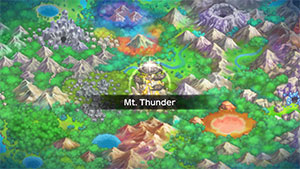
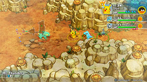

  

Dungeon where there's a checkpoint between 10F and 11F, and boss fight with Zapdos on 13F. The checkpoint is only present during the first clear, so keep that in mind if you return afterwards. If you're struggling with the boss, recruit a Electrike or Manectric with Lightning Rod to have an easier time. It's probably best to use ranged attacks against Zapdos to avoid losing Tiny Reviver Seeds due to Pluck.

# Overview

<table class="dungeonOverview">
  <tr>
    <th>Unlock</th>
    <td class="highlightYellow">Clear Silent Chasm.</td>
  </tr>
</table>

<table class="dungeonTable">
  <tr>
    <th>Floors</th>
    <td>12F</td>
    <th>Job Rank</th>
    <td>E</td>
  </tr>
  <tr>
    <th>Radar / Scanning</th>
    <td>Yes</td>
    <th>Weather</th>
    <td>Clear</td>
  </tr>
  <tr>
    <th>Dark Halls</th>
    <td>No</td>
    <th>Boss</th>
    <td>Zapdos</td>
  </tr>
  <tr>
    <th>Max Team Size</th>
    <td>3</td>
    <th>Strong Foe</th>
    <td>Dragonite</td>
  </tr>
  <tr>
    <th>Bring Items</th>
    <td>Yes</td>
    <th>Shops</th>
    <td>Yes</td>
  </tr>
  <tr>
    <th>Bring Poke</th>
    <td>Yes</td>
    <th>Monster Houses</th>
    <td>No</td>
  </tr>
  <tr>
    <th>Level Reset</th>
    <td>No</td>
    <th>Mystery Houses</th>
    <td>No</td>
  </tr>
  <tr>
    <th>Clear Icon</th>
    <td></td>
    <th>Reward</th>
    <td>Unlock Great Canyon</td>
  </tr>
</table>

# Needed Camps

#### Wild

|Name|Price|Pokemon|
|-|-|-|
|Power Plant|-|Electabuzz|
|Flyaway Forest|500|Pidgeotto|
|Safari|600|Nidoran♂|
|Thunder Crag|600|Electrike, Manectric|
|Mt. Green|700|Gligar|
|Scorched Plains|700|Growlithe|
|Vibrant Forest|800|Stantler|
|Withering Desert|900|Cacnea|
|Mystic Lake|2500|Dragonite|

#### Fainted

|Name|Price|Pokemon|
|-|-|-|
|Safari|600|Tauros|
|Overgrown Forest|700|Heracross|
|Frigid Cavern|800|Smoochum|
|Beau Plains|2700|Hoppip|
|Echo Cave|2700|Zubat, Dunsparce|

# Pokemon

Rate = Recruit rate. Red stats = Stats as an enemy. Ability colors: Caution, Dangerous Move colors: Boosting, Destroys Items, Caution, Dangerous

#### Wild

|Floor|Image|Name|Rate|Lv|HP|Atk|Def|SpA|SpD|Spe|Exp|Ability + Moves|
|-|-|-|-|-|-|-|-|-|-|-|-|-|
|1-5||Nidoran♂ |10.8%|15|51 58|28 33|24 24|24 26|22 20|28 28|23|Poison Point or Rivalry Leer / Focus Energy / Double Kick / Peck / Poison Sting|
|1-5||Electrike |10.8%|15|51 60|27 28|24 24|33 27|24 23|32 32|27|Static or Lightning Rod Tackle / Thunder Wave / Leer / Howl / Quick Attack / Spark|
|1-5||Cacnea |10.8%|15|51 56|36 37|24 19|36 20|24 19|25 25|22|Sand Veil Poison Sting / Leer / Absorb / Growth / Leech Seed / Sand Attack|
|1-5||Stantler |10.8%|15|44 60|35 35|35 20|25 35|29 20|26 26|24|Intimidate or Frisk Me First / Tackle / Leer / Astonish / Hypnosis / Stomp|
|3-12 Foe|  |Dragonite  |-6.4%|55|87 185|88 68|54 39|73 60|53 39|81 81|280|Inner Focus Wing Attack / Hurricane / Roost / Fire Punch / Thunder Punch / Slam / Twister / Wrap / Dragon Rage / Leer / Thunder Wave / Agility / Dragon Tail / Aqua Tail / Dragon Rush / Safeguard ※ Friend Bow required to recruit.|
|6-12||Pidgeotto  |10.8%|18|53 53|28 31|28 20|25 30|25 16|32 32|28|Keen Eye or Tangled Feet Quick Attack / Sand Attack / Tackle / Gust / Whirlwind|
|6-12||Growlithe |10.8%|15|55 50|36 34|27 22|33 31|24 22|29 29|25|Intimidate or Flash Fire Bite / Roar / Ember / Helping Hand / Odor Sleuth / Leer|
|6-12||Gligar  |10.8%|15|52 60|34 32|35 16|22 37|25 23|31 31|26|Hyper Cutter or Sand Veil Poison Sting / Sand Attack / Harden / Knock Off / Quick Attack|
|6-12 Rare||Electabuzz |8.2%|30|65 75|50 44|45 23|60 40|50 22|56 56|30|Static Quick Attack / Leer / Thunder Shock / Thunder Punch / Swift / Light Screen / Thunder Wave / Electro Ball / Low Kick|
|6-12||Manectric |10.8%|26|61 50|43 30|39 23|52 35|39 21|40 49|29|Static or Lightning Rod Electric Terrain / Fire Fang / Tackle / Thunder Wave / Leer / Howl / Spark / Quick Attack / Odor Sleuth / Bite / Thunder Fang ※ Can Mega Evolve.|

#### Boss

|Floor|Image|Name|Rate|Lv|HP|Atk|Def|SpA|SpD|Spe|Exp|Ability + Moves|
|-|-|-|-|-|-|-|-|-|-|-|-|-|
|13||Zapdos  |-|17|61 561|38 38|32 32|42 42|32 32|34 34|0|Pressure Thunder Shock / Peck / Pluck / Sky Attack ※ First clear.|
|13 Rematch||Zapdos  |100%|50|87 2087|75 95|57 77|82 82|57 57|84 84|0|Pressure Rain Dance / Thunder / Drill Peck / Light Screen ※ Available post-game. ※ Rare Quality: Squeeze Out|

#### Fainted

|Image|Name|Lv|HP|Atk|Def|SpA|SpD|Spe|
|-|-|-|-|-|-|-|-|-|
||Zubat  |17|52|30|27|26|27|32|
||Smoochum  |19|54|30|26|44|34|36|
||Tauros |17|54|38|32|24|28|37|
||Hoppip  |17|50|24|24|24|27|31|
||Dunsparce |17|61|32|28|28|28|29|
||Heracross  |17|54|42|28|24|32|34|

# Items

#### Floor

|Name|Floors|Rate|
|-|-|-|
|Cover Band|1-12|0.451%|
|Defense Scarf|1-12|0.169%|
|Detect Band|1-12|0.113%|
|Efficient Bandanna|1-12|0.338%|
|Fickle Specs|1-12|0.113%|
|Gold Ribbon|1-12|0.0226%|
|Heal Ribbon|1-12|0.113%|
|Heavy Rotation Specs|1-12|0.113%|
|Joy Ribbon|1-12|0.113%|
|Lucky Ribbon|1-12|0.113%|
|Mach Ribbon|1-12|0.451%|
|Nullify Bandanna|1-12|0.226%|
|Power Band|1-12|0.169%|
|Prosper Ribbon|1-12|0.113%|
|Special Band|1-12|0.169%|
|Twist Band|1-12|0.113%|
|Zinc Band|1-12|0.169%|
|Apple|1-12|7.02%|
|Poke|1-12|52.6%|
|Max Ether|1-12|6.58%|
|Blast Seed|1-12|0.766%|
|Cheri Berry|1-12|0.766%|
|Chesto Berry|1-12|0.383%|
|Eyedrop Seed|1-12|1.53%|
|Oran Berry|1-12|3.83%|
|Pecha Berry|1-12|1.91%|
|Rawst Berry|1-12|1.15%|
|Sleep Seed|1-12|0.766%|
|Stun Seed|1-12|0.383%|
|Tiny Reviver Seed|1-12|1.15%|
|Totter Seed|1-12|0.383%|
|Training Seed|1-12|0.191%|
|Gravelerock|1-12|13.2%|
|(Random TM)|1-12|0.877%|
|Confuse Wand|1-12|0.779%|
|Petrify Wand|1-12|0.779%|
|Slow Wand|1-12|0.779%|
|Slumber Wand|1-12|0.39%|
|Stayaway Wand|1-12|0.586%|
|Tunnel Wand|1-12|0.195%|

#### Shop

|Name|Rate|
|-|-|
|Cover Band|0.817%|
|Defense Scarf|0.306%|
|Detect Band|0.205%|
|Efficient Bandanna|0.612%|
|Fickle Specs|0.205%|
|Gold Ribbon|0.0409%|
|Heal Ribbon|0.205%|
|Heavy Rotation Specs|0.205%|
|Joy Ribbon|0.205%|
|Lucky Ribbon|0.205%|
|Mach Ribbon|0.817%|
|Nullify Bandanna|0.409%|
|Power Band|0.306%|
|Prosper Ribbon|0.205%|
|Special Band|0.306%|
|Twist Band|0.205%|
|Zinc Band|0.306%|
|Apple|15.9%|
|All Power-Up Orb|0.649%|
|Foe-Hold Orb|1.94%|
|Foe-Seal Orb|1.3%|
|Nullify Orb|0.649%|
|Petrify Orb|0.649%|
|Quick Orb|0.649%|
|Rollcall Orb|0.649%|
|Slow Orb|0.649%|
|Slumber Orb|1.3%|
|Totter Orb|0.649%|
|Trawl Orb|0.324%|
|Wigglytuff Orb|6.49%|
|Max Ether|11.9%|
|Blast Seed|1.3%|
|Cheri Berry|1.3%|
|Chesto Berry|0.652%|
|Oran Berry|5.88%|
|Pecha Berry|2.62%|
|Rawst Berry|1.96%|
|Sleep Seed|1.3%|
|Stun Seed|0.652%|
|Tiny Reviver Seed|4.57%|
|Totter Seed|0.652%|
|Training Seed|0.326%|
|Gravelerock|23.8%|
|Confuse Wand|0.704%|
|Petrify Wand|0.704%|
|Slow Wand|0.704%|
|Slumber Wand|0.352%|
|Stayaway Wand|0.529%|
|Tunnel Wand|0.176%|

# Traps

|Name|
|-|
|Wonder Tile|
|Training Switch|
|Spin Trap|
|Slumber Trap|
|Spiky Trap|
|Blast Trap|
