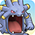

  

# Overview

<table class="dungeonOverview">
  <tr>
    <th>Unlock</th>
    <td class="highlightYellow">Clear Wish Cave → Talk to Medicham / Ekans (2 days) → Talk to Gengar the next day → Clear Mt. Freeze.</td>
  </tr>
</table>

<table class="dungeonTable">
  <tr>
    <th>Floors</th>
    <td>B19F</td>
    <th>Job Rank</th>
    <td>B</td>
  </tr>
  <tr>
    <th>Radar / Scanning</th>
    <td>No</td>
    <th>Weather</th>
    <td>Clear</td>
  </tr>
  <tr>
    <th>Dark Halls</th>
    <td>No</td>
    <th>Boss</th>
    <td>None</td>
  </tr>
  <tr>
    <th>Max Team Size</th>
    <td>3</td>
    <th>Strong Foe</th>
    <td>Hoothoot</td>
  </tr>
  <tr>
    <th>Bring Items</th>
    <td>Yes</td>
    <th>Shops</th>
    <td>Yes</td>
  </tr>
  <tr>
    <th>Bring Poke</th>
    <td>Yes</td>
    <th>Monster Houses</th>
    <td>Yes</td>
  </tr>
  <tr>
    <th>Level Reset</th>
    <td>No</td>
    <th>Mystery Houses</th>
    <td>No</td>
  </tr>
  <tr>
    <th>Clear Icon</th>
    <td></td>
    <th>Reward</th>
    <td>Gardevoir joins. Receive a Mobile Scarf from Gengar. Vitamins can appear in Pokemon Square's Shop.</td>
  </tr>
</table>

Post-game dungeon that concludes the events related to Gengar and Gardevoir from the main story. The monster table uses Waterfall Pond as a base, but there are a few additions like Typhlosion and Espeon. Lotad and Lombre's Nature Power changes to Shadow Ball in this dungeon, which Gengar is weak to. That said, Gengar has decent attack power and uses Shadow Ball a lot, so it shouldn't be very hard. Goldeen and Magikarp are extremely rare, so it's best to recruit them in Waterfall Pond instead.

# Needed Camps

#### Wild

|Name|Price|Pokemon|
|-|-|-|
|Flyaway Forest|500|Hoothoot|
|Thunder Crag|600|Castform|
|Scorched Plains|700|Typhlosion|
|Tadpole Pond|900|Poliwag, Poliwhirl, Poliwrath, Lotad, Lombre, Surskit, Masquerain|
|Rub-a-Dub River|3000|Goldeen|
|Turtleshell Pond|6000|Squirtle, Corphish|
|Waterfall Lake|9000|Magikarp|
|Evolution Forest|9000|Espeon|
|Gourd Swamp|9000|Wooper, Mudkip, Marshtomp, Barboach, Whiscash|

#### Fainted

|Name|Price|Pokemon|
|-|-|-|
|Stump Forest|-|Metapod|
|Power Plant|-|Magnezone|
|Darkness Ridge|-|Banette|
|Jungle|500|Vileplume|
|Flyaway Forest|500|Pidgeotto|
|Safari|600|Kangaskhan, Tauros, Miltank|
|Mt. Cleft|700|Aron|
|Magnetic Quarry|700|Beldum|
|Tadpole Pond|900|Masquerain|
|Beau Plains|2700|Jumpluff|
|Echo Cave|2700|Exploud|
|Decrepit Lab|6000|Porygon-Z|
|Poison Swamp|7000|Muk, Weezing, Gulpin|
|Shallow Beach|9000|Kingler|
|Treasure Sea|9000|Seadra|
|Deepsea Floor|9000|Huntail|

# Pokemon

Rate = Recruit rate. Red stats = Stats as an enemy. Ability colors: Caution, Dangerous Move colors: Boosting, Destroys Items, Caution, Dangerous

#### Wild

|Floor|Image|Name|Rate|Lv|HP|Atk|Def|SpA|SpD|Spe|Exp|Ability + Moves|
|-|-|-|-|-|-|-|-|-|-|-|-|-|
|1-5||Poliwag |14.4%|30|65 93|45 45|45 37|40 46|40 39|53 53|70|Water Absorb or Damp Water Sport / Water Gun / Hypnosis / Bubble / Double Slap / Rain Dance / Body Slam / Bubble Beam / Mud Shot|
|1-5||Goldeen |8.2%|30|65 103|60 46|45 41|45 46|45 39|50 50|48|Swift Swim or Water Veil Peck / Tail Whip / Water Sport / Flail / Supersonic / Fury Attack / Aqua Ring / Water Pulse / Horn Attack / Agility|
|1-5||Mudkip |8.2%|30|68 103|53 55|51 43|48 50|51 40|50 47|80|Torrent Tackle / Growl / Water Gun / Bide / Mud-Slap / Foresight / Mud Sport / Rock Throw / Protect|
|1-5||Lotad  |8.2%|30|65 105|45 53|40 38|45 52|45 44|47 47|74|Swift Swim or Rain Dish Astonish / Growl / Absorb / Mist / Bubble / Natural Gift / Mega Drain / Bubble Beam / Nature Power / Rain Dance / Giga Drain|
|1-5||Barboach  |8.2%|30|75 111|50 54|45 41|50 48|45 39|47 47|75|Oblivious or Anticipation Mud-Slap / Mud Sport / Water Sport / Water Gun / Mud Bomb / Amnesia / Water Pulse / Magnitude / Snore / Rest / Aqua Tail|
|1-19||Castform |8.2%|33|67 105|52 50|46 42|46 50|46 42|53 53|65|Forecast Tackle / Water Gun / Powder Snow / Ember / Headbutt / Weather Ball / Rain Dance / Sunny Day / Hail|
|3-7||Surskit  |8.2%|30|65 104|45 54|45 44|50 50|45 44|47 47|77|Swift Swim Bubble / Quick Attack / Sweet Scent / Water Sport / Bubble Beam / Agility / Mist / Haze / Aqua Jet|
|5-9||Wooper  |8.2%|30|75 95|50 56|50 40|45 51|45 41|44 44|80|Damp or Water Absorb Water Gun / Tail Whip / Mud Sport / Mud Shot / Amnesia / Mud Bomb / Slam / Yawn|
|5-19 Foe|  |Hoothoot  |-6.4%|60|94 590|64 150|50 65|73 150|60 65|91 200|810|Insomnia or Keen Eye Tackle / Growl / Foresight / Hypnosis / Confusion / Echoed Voice / Air Slash / Zen Headbutt / Psycho Shift / Reflect / Uproar / Synchronoise / Dream Eater / Roost / Extrasensory / Take Down / Peck / Moonblast ※ Friend Bow required to recruit.|
|6-10||Magikarp |8.2%|30|56 91|44 40|45 35|45 40|50 35|90 50|60|Swift Swim Splash / Tackle / Flail|
|7-12||Typhlosion |8.2%|36|71 128|52 65|49 44|58 75|49 44|58 56|80|Blaze Double-Edge / Gyro Ball / Tackle / Smokescreen / Ember / Quick Attack / Defense Curl / Swift / Flame Charge / Leer / Flame Wheel / Eruption|
|8-12||Squirtle |8.2%|30|65 108|45 62|52 41|45 62|46 42|47 47|82|Torrent Tackle / Tail Whip / Water Gun / Bite / Rapid Spin / Bubble / Water Pulse / Withdraw / Protect / Aqua Tail|
|9-13||Poliwhirl |8.2%|30|65 103|45 55|45 42|40 56|40 44|53 53|83|Water Absorb or Damp Water Sport / Water Gun / Hypnosis / Bubble / Double Slap / Rain Dance / Body Slam / Bubble Beam|
|10-15||Corphish |8.2%|30|65 114|65 64|50 45|50 58|40 46|47 47|85|Hyper Cutter or Shell Armor Bubble / Harden / Vise Grip / Leer / Bubble Beam / Protect / Double Hit / Knock Off / Night Slash|
|12-16||Masquerain  |10.8%|30|65 99|45 48|45 42|50 64|45 43|47 47|80|Intimidate Quiver Dance / Bug Buzz / Whirlwind / Ominous Wind / Bubble / Air Cutter / Stun Spore / Water Sport / Scary Face / Gust / Sweet Scent / Quick Attack|
|15-19||Espeon |8.2%|33|81 127|37 58|46 41|71 80|51 45|56 53|100|Synchronize Confusion / Helping Hand / Swift / Tackle / Tail Whip / Baby-Doll Eyes / Sand Attack / Psybeam / Future Sight / Quick Attack / Psych Up / Morning Sun|
|15-19||Marshtomp  |8.2%|30|68 118|53 65|51 48|48 60|51 46|50 47|92|Torrent Tackle / Growl / Water Gun / Bide / Mud Shot / Mud-Slap / Rock Slide / Foresight / Mud Bomb|
|15-19||Lombre  |8.2%|30|65 116|45 63|40 43|45 62|45 46|47 47|87|Swift Swim or Rain Dish Astonish / Growl / Absorb / Fake Out / Fury Swipes / Bubble Beam / Bubble / Water Sport / Nature Power|
|15-19||Whiscash  |8.2%|30|75 121|50 67|45 45|50 70|45 43|47 47|88|Oblivious or Anticipation Thrash / Zen Headbutt / Belch / Rest / Tickle / Mud-Slap / Mud Sport / Snore / Water Sport / Water Gun / Mud Bomb / Amnesia / Water Pulse / Magnitude / Aqua Tail|
|17-19||Poliwrath  |8.2%|30|65 115|45 69|45 47|40 66|40 45|53 53|100|Water Absorb or Damp Submission / Circle Throw / Hypnosis / Bubble Beam / Double Slap|

#### Fainted

|Image|Name|Lv|HP|Atk|Def|SpA|SpD|Spe|
|-|-|-|-|-|-|-|-|-|
||Metapod |?|?|?|?|?|?|?|
||Pidgeotto  |35|68|49|47|43|42|55|
||Vileplume  |37|70|51|48|57|47|51|
||Magnezone  |?|?|?|?|?|?|?|
||Muk |40|81|67|49|51|53|57|
||Kingler |35|63|75|62|42|42|55|
||Weezing |39|71|66|63|56|48|65|
||Kangaskhan |35|78|63|52|42|47|58|
||Seadra |35|64|50|52|63|42|63|
||Tauros |37|70|65|53|43|47|63|
||Porygon-Z |37|70|55|53|68|52|54|
||Jumpluff  |37|66|45|43|45|47|64|
||Miltank |35|78|53|63|42|47|63|
||Masquerain  |32|66|46|46|51|46|49|
||Exploud |44|77|64|45|57|45|75|
||Aron  |35|68|65|67|43|42|49|
||Gulpin |37|79|55|53|55|47|54|
||Banette |41|73|74|49|58|49|63|
||Huntail |35|63|63|62|63|47|52|
||Beldum  |37|70|60|53|53|47|54|

# Items

#### Floor

|Name|Rate|
|-|-|
|Cover Band|0.601%|
|Efficient Bandanna|0.601%|
|Goggle Specs|0.15%|
|Gold Ribbon|0.015%|
|Heal Ribbon|0.15%|
|Insomniscope|0.15%|
|Joy Ribbon|0.15%|
|Nullify Bandanna|0.3%|
|Pecha Scarf|0.15%|
|Persim Band|0.15%|
|Recovery Scarf|0.15%|
|Scope Lens|0.15%|
|Weather Band|0.15%|
|X-Ray Specs|0.15%|
|Apple|5.03%|
|Poke|52.8%|
|Max Elixir|1.16%|
|Max Ether|3.87%|
|Blast Seed|0.805%|
|Cheri Berry|0.805%|
|Chesto Berry|0.403%|
|Empowerment Seed|0.805%|
|Eyedrop Seed|1.62%|
|Oran Berry|4.03%|
|Pecha Berry|2.01%|
|Rawst Berry|1.21%|
|Sleep Seed|0.805%|
|Stun Seed|0.403%|
|Tiny Reviver Seed|1.21%|
|Totter Seed|0.403%|
|Training Seed|0.201%|
|Warp Seed|0.403%|
|Iron Spike|7.54%|
|Geo Pebble|7.54%|
|Confuse Wand|0.211%|
|Guiding Wand|0.211%|
|HP-Swap Wand|0.211%|
|Petrify Wand|0.211%|
|Pounce Wand|0.422%|
|Slow Wand|0.211%|
|Stayaway Wand|0.635%|
|Surround Wand|0.422%|
|Switcher Wand|0.211%|
|Tunnel Wand|0.211%|
|Two-Edged Wand|0.211%|
|Warp Wand|0.211%|
|Whirlwind Wand|0.211%|

#### Shop

|Name|Rate|
|-|-|
|Cover Band|1.19%|
|Efficient Bandanna|1.19%|
|Goggle Specs|0.297%|
|Heal Ribbon|0.297%|
|Insomniscope|0.297%|
|Joy Ribbon|0.297%|
|Nullify Bandanna|0.594%|
|Pecha Scarf|0.297%|
|Persim Band|0.297%|
|Prosper Ribbon|0.297%|
|Recovery Scarf|0.297%|
|Scope Lens|0.297%|
|X-Ray Specs|0.297%|
|Big Apple|6.93%|
|Max Elixir|9.9%|
|Ban Seed|1.06%|
|Cheri Berry|2.12%|
|Chesto Berry|2.12%|
|Decoy Seed|1.06%|
|Empowerment Seed|2.12%|
|Energy Seed|1.06%|
|Pecha Berry|5.32%|
|Pure Seed|1.06%|
|Quick Seed|3.18%|
|Rawst Berry|3.18%|
|Reviver Seed|1.06%|
|Stun Seed|2.12%|
|Tiny Reviver Seed|3.18%|
|Violent Seed|1.06%|
|Iron Spike|14.9%|
|Geo Pebble|14.9%|
|Aurora Veil TM|1.74%|
|Brutal Swing TM|1.74%|
|Dragon Claw TM|1.17%|
|Leech Life TM|1.74%|
|Smart Strike TM|1.74%|
|Work Up TM|1.74%|
|Guiding Wand|1.05%|
|HP-Swap Wand|0.528%|
|Pounce Wand|1.05%|
|Slow Wand|1.05%|
|Stayaway Wand|1.05%|
|Surround Wand|1.05%|
|Tunnel Wand|1.05%|
|Two-Edged Wand|0.528%|
|Warp Wand|0.528%|

# Traps

|Name|
|-|
|Wonder Tile|
|Training Switch|
|Spin Trap|
|Slumber Trap|
|Poison Trap|
|Spiky Trap|
|Gust Trap|
|Slow Trap|
|Hunger Trap|
|Warp Trap|
