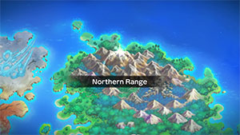
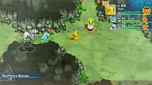

  

# Overview

<table class="dungeonOverview">
  <tr>
    <th>Unlock</th>
    <td class="highlightYellow">Unlock Buried Relic → 1 day later (Spinda event) → Buy Southern Island Camp → 1 day later.</td>
  </tr>
</table>

<table class="dungeonTable">
  <tr>
    <th>Floors</th>
    <td>25F</td>
    <th>Job Rank</th>
    <td>B</td>
  </tr>
  <tr>
    <th>Radar / Scanning</th>
    <td>No</td>
    <th>Weather</th>
    <td>Hail: 7-8, 22-24F</td>
  </tr>
  <tr>
    <th>Dark Halls</th>
    <td>No</td>
    <th>Boss</th>
    <td>Latios</td>
  </tr>
  <tr>
    <th>Max Team Size</th>
    <td>3</td>
    <th>Strong Foe</th>
    <td>Ninetales</td>
  </tr>
  <tr>
    <th>Bring Items</th>
    <td>Yes</td>
    <th>Shops</th>
    <td>No</td>
  </tr>
  <tr>
    <th>Bring Poke</th>
    <td>Yes</td>
    <th>Monster Houses</th>
    <td>Yes</td>
  </tr>
  <tr>
    <th>Level Reset</th>
    <td>No</td>
    <th>Mystery Houses</th>
    <td>Yes</td>
  </tr>
  <tr>
    <th>Clear Icon</th>
    <td>None</td>
    <th>Reward</th>
    <td>Unlock Pitfall Valley</td>
  </tr>
</table>

Post-game dungeon featuring lots of Flying types, along with a boss fight with Latios at the end. A number of enemies can know Pluck or Bug Bite, so carry more Apples and Tiny Reviver Seeds than usual. Poke is common and shops never generate, so don't count on stocking up on tons of items during the run. Hail occurs for 3 floors in a row near the end, so it's best to bring something to counter weather damage. Room-wide attackers include Beautifly (1-6F), Xatu (1-7F), and Ledian (6-11F).

# Boss Strategy

#### Latios (1418 HP) - Dragon Breath / Psywave / Luster Purge / Heal Block

- Latios doesn't have a room-wide move, so you're safe at a distance if you avoid lining up with them.
- Psywave's damage scales based on level and the boss is only Lv35, so it actually doesn't hit very hard.
- Heal Block doesn't prevent Tiny Reviver Seeds from working, so don't worry about it too much.

# Needed Camps

#### Wild

|Name|Price|Pokemon|
|-|-|-|
|Wild Plains|-|Seviper|
|Stump Forest|-|Ledian, Beautifly|
|Darkness Ridge|-|Ninetales|
|Flyaway Forest|500|Pidgeot, Hoothoot, Noctowl, Togetic, Xatu|
|Safari|600|Dodrio|
|Ravaged Field|700|Fearow|
|Secretive Forest|900|Spinarak, Ninjask|
|Beau Plains|2700|Jumpluff, Swellow|

#### Fainted

|Name|Price|Pokemon|
|-|-|-|
|Stump Forest|-|Wurmple|
|Sky-Blue Plains|-|Snubbull, Kirlia|
|Power Plant|-|Electabuzz, Magnezone|
|Jungle|500|Vileplume, Sunkern|
|Safari|600|Kangaskhan|
|Thunder Crag|600|Electrike|
|Mt. Cleft|700|Larvitar|
|Mt. Green|700|Teddiursa|
|Frigid Cavern|800|Mamoswine, Snorunt|
|Secretive Forest|900|Spinarak|
|Dragon Cave|3000|Shelgon|
|Ice Floe Beach|6000|Spheal|
|Decrepit Lab|6000|Porygon-Z|
|Gourd Swamp|9000|Quagsire|
|Treasure Sea|9000|Carvanha|
|Bountiful Sea|9000|Slowbro|

#### Mystery House

|Name|Price|Pokemon|
|-|-|-|
|Mt. Green|700|Graveler|
|Ancient Relic|700|Claydol|
|Magnetic Quarry|700|Metagross|
|Boulder Cave|700|Onix, Steelix|
|Echo Cave|2700|Probopass, Mawile|
|Mt. Moonview|7000|Lunatone, Solrock|
|Deepsea Floor|9000|Relicanth|

# Pokemon

Rate = Recruit rate. Red stats = Stats as an enemy. Ability colors: Caution, Dangerous Move colors: Boosting, Destroys Items, Caution, Dangerous

#### Wild

|Floor|Image|Name|Rate|Lv|HP|Atk|Def|SpA|SpD|Spe|Exp|Ability + Moves|
|-|-|-|-|-|-|-|-|-|-|-|-|-|
|1-5||Hoothoot  |14.4%|33|76 115|46 59|41 42|52 58|51 42|53 53|70|Insomnia or Keen Eye Tackle / Growl / Foresight / Hypnosis / Confusion / Echoed Voice / Air Slash / Zen Headbutt / Psycho Shift / Reflect / Peck / Extrasensory / Take Down|
|1-6||Beautifly  |8.2%|33|62 95|41 60|42 45|36 60|36 38|47 44|85|Swarm Gust / Absorb / Stun Spore / Attract / Morning Sun / Air Cutter / Whirlwind / Silver Wind / Mega Drain / Giga Drain|
|1-7||Pidgeot  |-2.2%|36|69 105|50 63|47 45|44 61|42 39|56 56|64|Keen Eye or Tangled Feet Tackle / Sand Attack / Gust / Twister / Quick Attack / Whirlwind / Hurricane / Feather Dance / Agility ※ Can Mega Evolve.|
|1-7||Dodrio  |8.2%|33|67 110|67 67|46 39|46 55|46 41|56 56|85|Run Away or Early Bird Peck / Growl / Quick Attack / Rage / Tri Attack / Double Hit / Fury Attack / Pursuit / Pluck / Agility / Uproar|
|1-7||Xatu  |8.2%|33|67 110|52 63|46 46|62 63|46 39|56 56|75|Synchronize or Early Bird Peck / Leer / Night Shade / Teleport / Stored Power / Confuse Ray / Wish / Ominous Wind / Air Slash / Tailwind / Lucky Chant|
|1-7||Ninjask  |8.2%|33|67 110|62 60|41 47|41 57|41 39|68 68|80|Speed Boost Double Team / Screech / Fury Cutter / Bug Bite / Scratch / Harden / Absorb / Sand Attack / Fury Swipes / Agility / Mind Reader / Slash|
|5-7 10-24 Foe|  |Ninetales |-6.4%|60|88 600|73 150|55 65|73 150|60 65|104 200|825|Flash Fire Imprison / Nasty Plot / Flamethrower / Quick Attack / Confuse Ray / Safeguard ※ Friend Bow required to recruit.|
|6-11||Ledian  |10.8%|33|62 100|41 57|41 45|46 62|61 38|59 56|79|Swarm or Early Bird Tackle / Supersonic / Mach Punch / Reflect / Light Screen / Comet Punch / Baton Pass / Silver Wind / Agility / Safeguard / Swift|
|7-13||Swellow  |8.2%|33|67 118|52 64|46 43|41 59|41 41|62 62|82|Guts Brave Bird / Air Slash / Pluck / Growl / Peck / Focus Energy / Quick Attack / Wing Attack / Double Team / Agility / Quick Guard / Aerial Ace|
|8-15||Fearow  |10.8%|33|67 105|62 65|46 41|46 60|46 43|56 56|83|Keen Eye Focus Energy / Peck / Pluck / Growl / Aerial Ace / Mirror Move / Assurance / Drill Run / Leer / Agility / Fury Attack / Pursuit|
|10-17||Jumpluff  |10.8%|33|62 113|42 60|41 40|42 60|46 40|56 53|80|Chlorophyll or Leaf Guard Absorb / Leech Seed / Tail Whip / Tackle / Fairy Wind / Poison Powder / Stun Spore / Sleep Powder / Splash / Bullet Seed / Synthesis / Mega Drain|
|12-16||Noctowl  |10.8%|33|76 105|46 58|41 45|52 64|51 41|53 53|85|Insomnia or Keen Eye Dream Eater / Tackle / Growl / Peck / Foresight / Confusion / Echoed Voice / Zen Headbutt / Psycho Shift / Reflect / Sky Attack / Take Down / Hypnosis / Extrasensory|
|14-20||Togetic  |8.2%|33|62 125|42 59|51 46|53 63|51 42|50 50|90|Hustle or Serene Grace Growl / Magical Leaf / Metronome / Charm / Sweet Kiss / Yawn / Encore / Fairy Wind / Bestow / Ancient Power / Wish / Follow Me|
|17-22||Spinarak  |14.4%|33|67 120|62 60|46 40|46 60|46 41|47 47|95|Swarm or Insomnia Poison Sting / String Shot / Constrict / Absorb / Infestation / Shadow Sneak / Sucker Punch / Night Shade / Agility / Scary Face / Fury Swipes / Spider Web|
|20-24||Seviper |10.8%|33|67 130|62 65|46 43|62 70|46 44|53 53|101|Shed Skin Wrap / Swagger / Bite / Lick / Feint / Poison Fang / Screech / Venoshock / Venom Drench / Night Slash / Glare / Gastro Acid / Poison Tail / Poison Jab|

#### Boss

|Floor|Image|Name|Rate|Lv|HP|Atk|Def|SpA|SpD|Spe|Exp|Ability + Moves|
|-|-|-|-|-|-|-|-|-|-|-|-|-|
|25||Latios  |-|35|68 1418|63 78|52 67|69 84|62 77|66 66|0|Levitate Dragon Breath / Psywave / Luster Purge / Heal Block|

#### Fainted

|Image|Name|Lv|HP|Atk|Def|SpA|SpD|Spe|
|-|-|-|-|-|-|-|-|-|
||Vileplume  |39|70|51|48|57|47|51|
||Slowbro  |39|80|56|63|66|48|53|
||Electabuzz |35|68|56|47|63|52|61|
||Kangaskhan |35|78|63|52|42|47|58|
||Spinarak  |35|68|63|47|48|47|49|
||Sunkern |35|68|53|47|63|52|49|
||Quagsire  |35|78|53|52|48|47|54|
||Teddiursa |35|78|75|47|53|47|52|
||Snubbull |35|78|69|48|48|47|57|
||Larvitar  |35|69|57|47|50|47|57|
||Wurmple |35|63|42|43|37|37|51|
||Kirlia  |37|66|45|43|54|42|54|
||Electrike |35|68|53|47|63|47|61|
||Carvanha  |35|68|69|42|63|42|58|
||Snorunt |37|70|55|53|55|47|64|
||Spheal  |35|78|49|47|55|47|52|
||Shelgon |35|69|66|52|50|42|52|
||Magnezone  |37|66|51|53|71|47|57|
||Porygon-Z |37|70|55|53|68|52|54|
||Mamoswine  |37|79|68|54|49|48|61|

#### Mystery House

|Image|Name|Image|Name|Image|Name|Image|Name|Image|Name|
|-|-|-|-|-|-|-|-|-|-|
||Graveler  ||Onix  ||Steelix  ||Probopass  ||Mawile  |
||Lunatone  ||Solrock  ||Claydol  ||Relicanth  ||Metagross  |

# Items

#### Floor

|Name|Floors|Rate|
|-|-|-|
|Cover Band|1-24|0.775%|
|Efficient Bandanna|1-24|0.775%|
|Gold Ribbon|1-24|0.0194%|
|Heal Ribbon|1-24|0.194%|
|Insomniscope|1-24|0.194%|
|Joy Ribbon|1-24|0.194%|
|Nullify Bandanna|1-24|0.387%|
|Pecha Scarf|1-24|0.194%|
|Persim Band|1-24|0.194%|
|Scope Lens|1-24|0.194%|
|X-Ray Specs|1-24|0.194%|
|Apple|1-24|2.76%|
|Poke|1-24|58.0%|
|Max Elixir|1-24|1.28%|
|Max Ether|1-24|4.24%|
|Blast Seed|1-24|0.586%|
|Cheri Berry|1-24|0.586%|
|Chesto Berry|1-24|0.294%|
|Empowerment Seed|1-24|0.586%|
|Eyedrop Seed|1-24|1.18%|
|Oran Berry|1-24|2.94%|
|Pecha Berry|1-24|1.46%|
|Rawst Berry|1-24|0.88%|
|Sleep Seed|1-24|0.586%|
|Stun Seed|1-24|0.294%|
|Tiny Reviver Seed|1-24|0.88%|
|Totter Seed|1-24|0.294%|
|Training Seed|1-24|0.146%|
|Warp Seed|1-24|0.294%|
|Iron Spike|1-24|8.29%|
|Geo Pebble|1-24|8.29%|
|Confuse Wand|1-24|0.145%|
|Guiding Wand|1-24|0.145%|
|HP-Swap Wand|1-24|0.145%|
|Petrify Wand|1-24|0.145%|
|Pounce Wand|1-24|0.29%|
|Slow Wand|1-24|0.145%|
|Slumber Wand|1-24|0.29%|
|Stayaway Wand|1-24|0.436%|
|Surround Wand|1-24|0.29%|
|Switcher Wand|1-24|0.145%|
|Tunnel Wand|1-24|0.145%|
|Two-Edged Wand|1-24|0.145%|
|Warp Wand|1-24|0.145%|
|Whirlwind Wand|1-24|0.145%|

# Traps

|Name|
|-|
|Wonder Tile|
|Training Switch|
|Spin Trap|
|Trip Trap|
|Slumber Trap|
|Poison Trap|
|Spiky Trap|
|Gust Trap|
|Slow Trap|
|Blast Trap|
|Hunger Trap|
|Seal Trap|
|Grimy Trap|
|Summon Trap|
|Warp Trap|
|PP Leech Trap|
