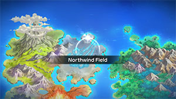
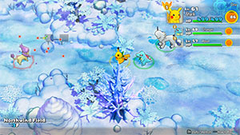

  

[Introduction]

# Overview

<table class="dungeonOverview">
  <tr>
    <th>Unlock</th>
    <td class="highlightYellow">Clear Lightning Field.</td>
  </tr>
</table>

<table class="dungeonTable">
  <tr>
    <th>Floors</th>
    <td>30F</td>
    <th>Job Rank</th>
    <td>S</td>
  </tr>
  <tr>
    <th>Radar / Scanning</th>
    <td>No</td>
    <th>Weather</th>
    <td>Clear: 1-11, 16-21, 23-29F Sandstorm: 12-15, 22F</td>
  </tr>
  <tr>
    <th>Dark Halls</th>
    <td>No</td>
    <th>Boss</th>
    <td>Suicune</td>
  </tr>
  <tr>
    <th>Max Team Size</th>
    <td>3</td>
    <th>Strong Foe</th>
    <td>None</td>
  </tr>
  <tr>
    <th>Bring Items</th>
    <td>Yes</td>
    <th>Shops</th>
    <td>Yes</td>
  </tr>
  <tr>
    <th>Bring Poke</th>
    <td>Yes</td>
    <th>Monster Houses</th>
    <td>Yes</td>
  </tr>
  <tr>
    <th>Level Reset</th>
    <td>No</td>
    <th>Mystery Houses</th>
    <td>Yes</td>
  </tr>
  <tr>
    <th>Clear Icon</th>
    <td>None</td>
    <th>Reward</th>
    <td>Unlock Mt. Faraway</td>
  </tr>
</table>

# Needed Camps

#### Wild

|Name|Price|Pokemon|
|-|-|-|
|Vibrant Forest|800|Delcatty|
|Mushroom Forest|800|Shiftry|
|Frigid Cavern|800|Jynx, Delibird|
|Tadpole Pond|900|Poliwag, Poliwhirl, Poliwrath, Politoed|
|Echo Cave|2700|Crobat|
|Rub-a-Dub River|3000|Croconaw, Volbeat|
|Turtleshell Pond|6000|Wartortle, Golduck, Azumarill, Crawdaunt|
|Evolution Forest|9000|Vaporeon|

#### Fainted

|Name|Price|Pokemon|
|-|-|-|
|Power Plant|-|Magneton|
|Stump Forest|-|Metapod, Wurmple|
|Jungle|500|Bellsprout, Exeggutor|
|Safari|600|Tauros|
|Thunder Crag|600|Flaaffy|
|Scorched Plains|700|Torchic|
|Frigid Cavern|800|Piloswine, Froslass|
|Beau Plains|2700|Skiploom|
|Ice Floe Beach|6000|Spheal, Sealeo|
|Treasure Sea|9000|Remoraid, Carvanha|

#### Mystery House

|Name|Price|Pokemon|
|-|-|-|
|Frigid Cavern|800|Jynx, Mamoswine, Delibird, Glalie, Froslass|
|Mystic Lake|2500|Lapras|
|Ice Floe Beach|6000|Dewgong, Walrein|
|Bountiful Sea|9000|Cloyster|
|Evolution Forest|9000|Glaceon|

# Pokemon

Rate = Recruit rate. Red stats = Stats as an enemy. Ability colors: Caution, Dangerous Move colors: Boosting, Destroys Items, Caution, Dangerous

#### Wild

|Floor|Image|Name|Rate|Lv|HP|Atk|Def|SpA|SpD|Spe|Exp|Ability + Moves|
|-|-|-|-|-|-|-|-|-|-|-|-|-|
|1-5||Poliwag |14.4%|45|78 125|62 62|50 50|51 51|45 45|74 74|140|Water Absorb or Damp Water Sport / Water Gun / Hypnosis / Bubble / Wake-Up Slap / Rain Dance / Body Slam / Bubble Beam / Mud Shot / Belly Drum / Hydro Pump / Mud Bomb / Double Slap|
|1-3||Azumarill  |10.8%|45|78 145|48 64|45 45|48 64|45 45|74 59|150|Thick Fat or Huge Power Aqua Ring / Water Gun / Rain Dance / Water Sport / Bubble / Defense Curl / Rollout / Bubble Beam / Play Rough / Helping Hand / Tail Whip / Aqua Tail / Tackle / Double-Edge|
|1-6||Delcatty |8.2%|45|76 135|58 68|55 50|58 68|50 45|62 80|143|Cute Charm or Normalize Fake Out / Sing / Attract / Double Slap|
|4-10||Crobat  |10.8%|45|76 141|65 70|50 50|54 65|50 50|68 68|155|Inner Focus Cross Poison / Screech / Leech Life / Supersonic / Astonish / Wing Attack / Confuse Ray / Air Cutter / Swift / Bite / Mean Look / Absorb / Poison Fang / Haze / Venoshock|
|5-11||Crawdaunt  |8.2%|45|76 133|78 85|55 55|61 75|45 45|62 62|150|Hyper Cutter or Shell Armor Swift / Bubble / Harden / Vise Grip / Crunch / Bubble Beam / Razor Shell / Protect / Knock Off / Swords Dance / Leer / Double Hit / Taunt / Night Slash|
|6-13||Golduck |8.2%|45|76 134|61 61|50 50|71 71|50 50|74 74|140|Damp or Cloud Nine Me First / Aqua Jet / Zen Headbutt / Water Sport / Scratch / Tail Whip / Confusion / Water Gun / Fury Swipes / Water Pulse / Psych Up / Screech / Aqua Tail / Soak / Disable / Amnesia|
|10-17||Volbeat |8.2%|45|76 130|61 61|50 50|47 47|50 50|68 68|155|Illuminate or Swarm Flash / Double Team / Struggle Bug / Tackle / Confuse Ray / Quick Attack / Moonlight / Tail Glow / Signal Beam / Protect / Zen Headbutt / Play Rough / Helping Hand / Bug Buzz|
|10 20 27||Vaporeon |8.2%|45|89 160|54 65|50 50|71 85|55 55|80 65|170|Water Absorb Helping Hand / Tackle / Hydro Pump / Tail Whip / Quick Attack / Water Pulse / Aurora Beam / Baby-Doll Eyes / Haze / Sand Attack / Acid Armor / Aqua Ring / Muddy Water / Last Resort / Water Gun|
|12-19||Jynx  |8.2%|45|76 133|54 54|45 45|78 82|55 55|74 74|175|Oblivious or Forewarn Draining Kiss / Pound / Double Slap / Lick / Powder Snow / Heart Stamp / Lovely Kiss / Mean Look / Ice Punch / Fake Tears / Avalanche / Body Slam / Wake-Up Slap / Perish Song|
|14-19||Poliwhirl |8.2%|45|78 129|62 62|50 50|51 51|45 45|74 83|140|Water Absorb or Damp Water Sport / Water Gun / Hypnosis / Bubble / Wake-Up Slap / Rain Dance / Body Slam / Bubble Beam / Mud Shot / Belly Drum / Double Slap|
|17-25||Delibird  |8.2%|45|71 120|54 54|45 45|54 54|45 45|65 65|145|Vital Spirit or Hustle Present / Drill Peck|
|18-25||Shiftry  |8.2%|45|78 145|65 75|45 45|58 68|45 45|62 62|160|Chlorophyll or Early Bird Razor Leaf / Feint Attack / Whirlwind / Nasty Plot / Hurricane / Leaf Tornado / Leaf Storm|
|21-29||Wartortle |8.2%|45|76 140|58 70|57 57|58 70|51 51|62 62|150|Torrent Tackle / Tail Whip / Water Gun / Bite / Withdraw / Iron Defense / Rapid Spin / Skull Bash / Water Pulse / Aqua Tail / Protect / Bubble / Rain Dance|
|23-28||Poliwrath  |8.2%|45|78 142|62 75|50 50|51 75|45 45|74 83|160|Water Absorb or Damp Submission / Circle Throw / Hypnosis / Bubble Beam / Dynamic Punch / Double Slap / Mind Reader|
|23-29||Croconaw |8.2%|45|76 144|67 72|56 56|58 63|52 52|68 62|170|Torrent Scratch / Leer / Water Gun / Rage / Bite / Scary Face / Ice Fang / Flail / Crunch / Chip Away / Slash / Screech|
|26-29||Politoed |8.2%|45|78 150|62 75|50 50|51 77|45 45|74 74|150|Water Absorb or Damp Hypnosis / Double Slap / Swagger / Bubble Beam / Bounce / Perish Song|

#### Boss

- Rematch: Exact same stats + moves, but 100% recruit rate.

 

|Floor|Image|Name|Rate|Lv|HP|Atk|Def|SpA|SpD|Spe|Exp|Ability + Moves|
|-|-|-|-|-|-|-|-|-|-|-|-|-|
|30||Suicune |-|50|87 1887|65 75|70 80|65 75|70 80|93 93|0|Pressure Ice Fang / Leer / Bubble Beam / Rain Dance|

#### Fainted

|Image|Name|Lv|HP|Atk|Def|SpA|SpD|Spe|
|-|-|-|-|-|-|-|-|-|
||Metapod |47|75|45|51|54|41|61|
||Bellsprout  |47|78|73|46|67|46|64|
||Magneton  |47|75|60|56|80|51|67|
||Exeggutor  |49|87|74|57|82|51|85|
||Tauros |49|79|74|57|49|51|75|
||Flaaffy |49|82|62|52|74|51|66|
||Skiploom  |47|75|53|46|53|51|84|
||Piloswine  |47|85|81|59|55|53|81|
||Remoraid |47|78|73|51|73|51|64|
||Torchic |47|80|73|53|69|53|74|
||Wurmple |47|73|48|49|43|43|75|
||Carvanha  |49|79|82|47|74|46|82|
||Spheal  |47|85|60|51|67|51|64|
||Sealeo  |47|85|60|51|67|51|64|
||Froslass  |47|78|63|56|63|51|84|

#### Mystery House

|Image|Name|Image|Name|Image|Name|Image|Name|Image|Name|
|-|-|-|-|-|-|-|-|-|-|
||Dewgong  ||Cloyster  ||Jynx  ||Lapras  ||Delibird  |
||Glalie ||Walrein  ||Glaceon ||Mamoswine  ||Froslass  |

# Items

#### Floor

|Name|Floors|Rate|
|-|-|-|
|Efficient Bandanna|1-29|0.67%|
|Goggle Specs|1-29|0.168%|
|Gold Ribbon|1-29|0.0168%|
|Heal Ribbon|1-29|0.168%|
|Insomniscope|1-29|0.168%|
|Joy Ribbon|1-29|0.168%|
|Nullify Bandanna|1-29|0.335%|
|Pecha Scarf|1-29|0.168%|
|Persim Band|1-29|0.168%|
|Recovery Scarf|1-29|0.168%|
|Scope Lens|1-29|0.168%|
|Weather Band|1-29|0.168%|
|X-Ray Specs|1-29|0.168%|
|Apple|1-29|8.11%|
|Poke|1-29|56.8%|
|Max Elixir|1-29|1.25%|
|Max Ether|1-29|4.16%|
|Blast Seed|1-29|0.82%|
|Cheri Berry|1-29|0.82%|
|Chesto Berry|1-29|0.41%|
|Empowerment Seed|1-29|0.82%|
|Eyedrop Seed|1-29|1.64%|
|Heal Seed|1-29|0.82%|
|Oran Berry|1-29|4.1%|
|Pecha Berry|1-29|2.06%|
|Rawst Berry|1-29|1.23%|
|Sleep Seed|1-29|0.82%|
|Stun Seed|1-29|0.41%|
|Tiny Reviver Seed|1-29|1.23%|
|Totter Seed|1-29|0.41%|
|Training Seed|1-29|0.206%|
|Warp Seed|1-29|0.41%|
|Iron Spike|1-29|8.11%|
|Geo Pebble|1-29|2.7%|

#### Shop

|Name|Rate|
|-|-|
|Efficient Bandanna|2.12%|
|Goggle Specs|0.53%|
|Heal Ribbon|0.53%|
|Insomniscope|0.53%|
|Joy Ribbon|0.53%|
|Nullify Bandanna|1.06%|
|Pecha Scarf|0.53%|
|Persim Band|0.53%|
|Prosper Ribbon|0.53%|
|Recovery Scarf|0.53%|
|Scope Lens|0.53%|
|Weather Band|0.53%|
|X-Ray Specs|0.53%|
|Evolution Crystal|5.41%|
|Big Apple|13.5%|
|All Dodge Orb|0.45%|
|All Power-Up Orb|0.45%|
|All Protect Orb|0.45%|
|Cleanse Orb|0.45%|
|Decoy Orb|0.45%|
|Drought Orb|0.45%|
|Evasion Orb|0.45%|
|Foe-Hold Orb|1.35%|
|Foe-Seal Orb|0.9%|
|Health Orb|0.45%|
|Helper Orb|0.45%|
|Inviting Orb|0.45%|
|Lasso Orb|0.45%|
|Nullify Orb|0.45%|
|One-Room Orb|0.45%|
|Rare Quality Orb|0.45%|
|Reset Orb|0.45%|
|Revive All Orb|0.45%|
|See-Trap Orb|0.45%|
|Storage Orb|0.45%|
|Trapbust Orb|0.45%|
|Weather Lock Orb|0.45%|
|Wigglytuff Orb|2.25%|
|Max Elixir|9.01%|
|Ban Seed|0.749%|
|Cheri Berry|1.5%|
|Chesto Berry|1.5%|
|Decoy Seed|0.749%|
|Empowerment Seed|1.5%|
|Energy Seed|0.749%|
|Pecha Berry|3.76%|
|Pure Seed|0.749%|
|Quick Seed|2.25%|
|Rawst Berry|2.25%|
|Reviver Seed|0.749%|
|Stun Seed|1.5%|
|Tiny Reviver Seed|2.25%|
|Violent Seed|0.749%|
|Iron Spike|4.5%|
|Geo Pebble|4.5%|
|(Random TM)|9.01%|
|Guiding Wand|1.2%|
|HP-Swap Wand|0.601%|
|Pounce Wand|1.2%|
|Slow Wand|1.2%|
|Stayaway Wand|1.2%|
|Surround Wand|1.2%|
|Tunnel Wand|1.2%|
|Two-Edged Wand|0.601%|
|Warp Wand|0.601%|

# Traps

|Name|
|-|
|Wonder Tile|
|Training Switch|
|Spin Trap|
|Trip Trap|
|Slumber Trap|
|Poison Trap|
|Spiky Trap|
|Gust Trap|
|Slow Trap|
|Blast Trap|
|Hunger Trap|
|Seal Trap|
|Grimy Trap|
|Summon Trap|
|Warp Trap|
|PP Leech Trap|
