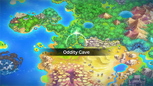
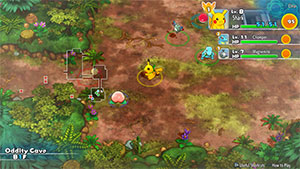

  

[Introduction]

# Overview

<table class="dungeonOverview">
  <tr>
    <th>Unlock</th>
    <td class="highlightYellow">Clear Mt. Steel.</td>
  </tr>
</table>

<table class="dungeonTable">
  <tr>
    <th>Floors</th>
    <td>B8F</td>
    <th>Job Rank</th>
    <td>F</td>
  </tr>
  <tr>
    <th>Radar / Scanning</th>
    <td>Yes</td>
    <th>Weather</th>
    <td>Clear</td>
  </tr>
  <tr>
    <th>Dark Halls</th>
    <td>No</td>
    <th>Boss</th>
    <td>None</td>
  </tr>
  <tr>
    <th>Max Team Size</th>
    <td>3</td>
    <th>Strong Foe</th>
    <td>None</td>
  </tr>
  <tr>
    <th>Bring Items</th>
    <td>Yes</td>
    <th>Shops</th>
    <td>Yes</td>
  </tr>
  <tr>
    <th>Bring Poke</th>
    <td>Yes</td>
    <th>Monster Houses</th>
    <td>No</td>
  </tr>
  <tr>
    <th>Level Reset</th>
    <td>No</td>
    <th>Mystery Houses</th>
    <td>No</td>
  </tr>
  <tr>
    <th>Clear Icon</th>
    <td>None</td>
    <th>Reward</th>
    <td>None</td>
  </tr>
</table>

# Needed Camps

#### Wild

|Name|Price|Pokemon|
|-|-|-|
|Wild Plains|-|Rattata|
|Stump Forest|-|Weedle, Ledyba|
|Power Plant|-|Voltorb|
|Sky-Blue Plains|-|Lickitung|
|Flyaway Forest|500|Pidgey|
|Jungle|500|Oddish, Exeggcute, Tangela|
|Safari|600|Nidoran♀, Nidoran♂, Doduo|
|Thunder Crag|600|Sentret|
|Boulder Cave|700|Onix|
|Overgrown Forest|700|Pinsir|
|Scorched Plains|700|Ponyta|
|Mt. Discipline|700|Hitmonlee|
|Mushroom Forest|800|Paras|
|Darkness Ridge|800|Gastly|
|Tadpole Pond|900|Poliwag|
|Echo Cave|2700|Zubat|
|Decrepit Lab|6000|Mr. Mime|
|Ice Floe Beach|6000|Seel|
|Mt. Moonview|7000|Clefairy|
|Poison Swamp|7000|Grimer|

#### Fainted

|Name|Price|Pokemon|
|-|-|-|
|Thunder Crag|600|Sentret|
|Secretive Forest|900|Spinarak|
|Shallow Beach|9000|Corsola|
|Ravaged Field|700|Houndour|
|Gourd Swamp|9000|Barboach|
|Withering Desert|900|Trapinch|

# Pokemon

Rate = Recruit rate. Red stats = Stats as an enemy. Ability colors: Caution, Dangerous Move colors: Boosting, Destroys Items, Caution, Dangerous

#### Wild

|Floor|Image|Name|Rate|Lv|HP|Atk|Def|SpA|SpD|Spe|Exp|Ability + Moves|
|-|-|-|-|-|-|-|-|-|-|-|-|-|
|1-2||Weedle  |14.4%|10|44 53|15 18|16 14|13 16|13 11|19|15|Shield Dust Poison Sting / String Shot / Bug Bite|
|1-2||Pidgey  |14.4%|10|46 54|18 20|18 15|16 19|16 14|21|16|Keen Eye or Tangled Feet Tackle / Sand Attack / Gust|
|1-2||Rattata |14.4%|10|44 53|21 23|18 15|15 17|18 15|23|17|Run Away or Guts Tackle / Tail Whip / Quick Attack / Bite / Focus Energy|
|1-2||Nidoran♀ |14.4%|10|46 55|19 21|18 15|18 20|16 14|18|19|Poison Point or Rivalry Growl / Scratch / Tail Whip / Double Kick|
|1-2||Nidoran♂ |10.8%|10|46 54|21 23|18 15|18 20|16 14|21|20|Poison Point or Rivalry Leer / Peck / Focus Energy / Double Kick|
|1-2||Clefairy |6.4%|10|46 56|15 17|15 12|16 20|18 15|16|15|Cute Charm or Magic Guard Spotlight / Encore / Pound / Growl / Disarming Voice / Sing / Double Slap|
|1-2||Zubat  |10.8%|10|46 57|19 21|18 15|16 18|18 15|21|16|Inner Focus Absorb / Supersonic / Astonish|
|3-4||Oddish  |14.4%|10|46 58|19 21|19 16|22 24|19 16|17|16|Chlorophyll Absorb / Growth / Sweet Scent / Acid|
|3-4||Paras  |14.4%|10|46 59|25 27|21 18|18 20|18 15|17|22|Effect Spore or Dry Skin Scratch / Stun Spore / Poison Powder|
|3-4||Poliwag |14.4%|10|46 60|19 21|18 15|16 19|16 14|24|16|Water Absorb or Damp Water Sport / Water Gun / Hypnosis|
|3-4||Ponyta |6.4%|10|46 53|25 27|19 16|21 23|19 16|25|22|Run Away or Flash Fire Growl / Tackle / Tail Whip / Ember|
|3-4||Doduo  |10.8%|10|46 54|27 28|18 15|18 20|18 15|23|15|Run Away or Early Bird Peck / Growl / Quick Attack / Rage|
|4||Seel |10.8%|10|51 58|19 21|21 18|18 20|21 18|21|15|Thick Fat or Hydration Headbutt / Growl / Water Sport|
|4||Grimer |10.8%|10|51 59|25 27|18 15|18 20|19 16|18|16|Stench or Sticky Hold Pound / Poison Gas / Harden / Mud-Slap|
|5-6||Gastly  |8.2%|10|44 54|18 20|16 14|28 29|16 14|23|20|Levitate Hypnosis / Lick / Spite / Mean Look ※ Immune to Normal & Fighting moves.|
|5-6||Voltorb |14.4%|10|46 55|18 20|18 15|21 23|18 15|26|16|Soundproof or Static Charge / Tackle / Sonic Boom / Spark / Eerie Impulse|
|5-6||Exeggcute  |14.4%|10|51 59|22 24|22 19|25 26|18 15|18|19|Chlorophyll Barrage / Uproar / Hypnosis / Reflect|
|5-6 Rare||Hitmonlee |8.2%|20|52 62|44 49|28 28|28 33|41 41|36|44|Limber or Reckless Double Kick / Reversal / Close Combat / Rolling Kick / Jump Kick / Brick Break / Mega Kick / Revenge / Meditate|
|5-6||Lickitung |6.4%|10|54 62|21 23|21 18|21 23|21 18|18|18|Own Tempo or Oblivious Lick / Supersonic / Defense Curl|
|5-8||Onix  |10.8%|12|48 88|22 17|38 18|19 20|20 27|22|18|Rock Head or Sturdy Mud Sport / Tackle / Harden / Bind / Curse / Rock Throw / Rock Tomb ※ Large size (3x3).|
|7-8||Tangela |10.8%|10|51 59|24 25|26 23|26 28|16 14|20|20|Chlorophyll or Leaf Guard Ingrain / Constrict / Sleep Powder / Vine Whip / Absorb|
|7-8||Mr. Mime  |8.2%|10|42 51|15 17|18 15|24 25|25 22|21|12|Soundproof or Filter Misty Terrain / Magical Leaf / Barrier / Wide Guard / Power Swap / Guard Swap / Pound / Confusion / Copycat / Meditate / Quick Guard|
|7-8||Pinsir |14.4%|10|48 56|29 31|22 19|19 21|19 16|24|26|Hyper Cutter or Mold Breaker Seismic Toss / Focus Energy / Bind / Vise Grip ※ Can Mega Evolve.|
|7-8||Sentret |14.4%|10|46 54|19 21|18 15|16 19|16 14|19|16|Run Away or Keen Eye Scratch / Foresight / Defense Curl / Quick Attack|
|7-8||Ledyba  |14.4%|10|44 53|15 17|16 14|18 20|24 20|21|12|Swarm or Early Bird Tackle / Supersonic / Swift ※ Spawns in sleeping groups of 4.|

#### Fainted

|Image|Name|Lv|HP|Atk|Def|SpA|SpD|Spe|
|-|-|-|-|-|-|-|-|-|
||Sentret |12|48|22|20|18|18|22|
||Spinarak  |12|48|27|20|20|20|20|
||Corsola  |12|46|22|25|22|25|20|
||Houndour  |14|50|31|21|32|23|29|
||Barboach  |12|52|23|20|22|20|22|
||Trapinch |12|46|26|18|18|18|21|

# Items

#### Floor

|Name|Floors|Rate|
|-|-|-|
|Apple|1-8|9.76%|
|Poke|1-8|58.5%|
|Max Ether|1-8|7.32%|
|Blast Seed|1-8|1.35%|
|Cheri Berry|1-8|1.35%|
|Oran Berry|1-8|6.73%|
|Pecha Berry|1-8|3.35%|
|Rawst Berry|1-8|2.01%|
|Sleep Seed|1-8|1.35%|
|Tiny Reviver Seed|1-8|3.35%|
|Confuse Wand|1-8|1.3%|
|Petrify Wand|1-8|1.3%|
|Slow Wand|1-8|1.3%|
|Slumber Wand|1-8|0.649%|
|Tunnel Wand|1-8|0.325%|

#### Shop

|Name|Rate|
|-|-|
|Apple|18.8%|
|All Power-Up Orb|1.02%|
|Foe-Hold Orb|3.05%|
|Foe-Seal Orb|2.04%|
|Nullify Orb|1.02%|
|Petrify Orb|1.02%|
|Quick Orb|1.02%|
|Rollcall Orb|1.02%|
|Slow Orb|1.02%|
|Slumber Orb|2.04%|
|Totter Orb|1.02%|
|Trawl Orb|0.51%|
|Wigglytuff Orb|10.2%|
|Max Ether|18.8%|
|Blast Seed|2.59%|
|Cheri Berry|2.59%|
|Oran Berry|12.9%|
|Pecha Berry|6.45%|
|Rawst Berry|3.86%|
|Sleep Seed|2.59%|
|Tiny Reviver Seed|6.45%|

#### Pretty Box

|Name|Rate|
|-|-|
|Bronze Dojo Ticket|30.8%|
|Oran Berry|11.5%|
|Calcium|0.689%|
|Carbos|0.689%|
|Iron|0.689%|
|Protein|0.689%|
|Rainbow Gummi|34.4%|
|Sitrus Berry|0.689%|
|Zinc|0.689%|
|(Random TM)|19.2%|

#### Deluxe Box

|Name|Rate|
|-|-|
|Gold Dojo Ticket|3.48%|
|Silver Dojo Ticket|13.9%|
|Reviver Seed|6.5%|
|Tiny Reviver Seed|6.5%|
|Calcium|0.934%|
|Carbos|0.934%|
|DX Gummi|23.3%|
|Iron|0.934%|
|Protein|0.934%|
|Rainbow Gummi|23.3%|
|Sitrus Berry|0.934%|
|Zinc|0.934%|
|(Random TM)|17.4%|

# Traps

|Name|
|-|
|Wonder Tile|
|Training Switch|
|Spin Trap|
|Slumber Trap|
|Spiky Trap|
|Blast Trap|
