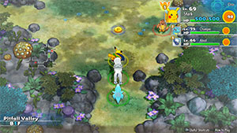

  

[Introduction]

# Overview

<table class="dungeonOverview">
  <tr>
    <th>Unlock</th>
    <td class="highlightYellow">Clear Northern Range.</td>
  </tr>
</table>

<table class="dungeonTable">
  <tr>
    <th>Floors</th>
    <td>B25F</td>
    <th>Job Rank</th>
    <td>B</td>
  </tr>
  <tr>
    <th>Radar / Scanning</th>
    <td>No</td>
    <th>Weather</th>
    <td>Clear</td>
  </tr>
  <tr>
    <th>Dark Halls</th>
    <td>No</td>
    <th>Boss</th>
    <td>None</td>
  </tr>
  <tr>
    <th>Max Team Size</th>
    <td>3</td>
    <th>Strong Foe</th>
    <td>Exeggutor</td>
  </tr>
  <tr>
    <th>Bring Items</th>
    <td>Yes</td>
    <th>Shops</th>
    <td>Yes</td>
  </tr>
  <tr>
    <th>Bring Poke</th>
    <td>Yes</td>
    <th>Monster Houses</th>
    <td>Yes</td>
  </tr>
  <tr>
    <th>Level Reset</th>
    <td>No</td>
    <th>Mystery Houses</th>
    <td>Yes</td>
  </tr>
  <tr>
    <th>Clear Icon</th>
    <td>None</td>
    <th>Reward</th>
    <td>Unlock Joyous Tower and Purity Forest Begin Wish Cave and Silver Trench events</td>
  </tr>
</table>

# Needed Camps

#### Wild

|Name|Price|Pokemon|
|-|-|-|
|Wild Plains|-|Raticate, Farfetch'd|
|Stump Forest|-|Butterfree, Ledyba, Yanma|
|Jungle|500|Exeggutor|
|Flyaway Forest|500|Pidgey, Swablu|
|Safari|600|Doduo|
|Ravaged Field|700|Spearow|
|Overgrown Forest|700|Scyther|
|Ancient Relic|700|Aerodactyl|
|Tadpole Pond|900|Masquerain|
|Beau Plains|2700|Hoppip, Skiploom, Taillow|

#### Fainted

|Name|Price|Pokemon|
|-|-|-|
|Power Plant|-|Voltorb|
|Wild Plains|-|Raticate|
|Sky-Blue Plains|-|Happiny|
|Darkness Ridge|-|Vulpix|
|Safari|600|Kangaskhan|
|Thunder Crag|600|Mareep, Flaaffy|
|Ancient Relic|700|Baltoy|
|Scorched Plains|700|Ponyta|
|Overgrown Forest|700|Scizor|
|Vibrant Forest|800|Mankey|
|Withering Desert|900|Trapinch|
|Beau Plains|2700|Budew|
|Echo Cave|2700|Loudred, Probopass|
|Ice Floe Beach|6000|Seel|
|Poison Swamp|7000|Swalot|
|Deepsea Floor|9000|Omanyte, Kabuto, Gorebyss|

#### Mystery House

|Name|Price|Pokemon|
|-|-|-|
|Darkness Ridge|-|Gastly, Haunter, Misdreavus, Shuppet, Duskull|
|Jungle|500|Gloom, Tangela|
|Mushroom Forest|800|Paras, Nuzleaf|
|Withering Desert|900|Cacturne|

# Pokemon

Rate = Recruit rate. Red stats = Stats as an enemy. Ability colors: Caution, Dangerous Move colors: Boosting, Destroys Items, Caution, Dangerous

#### Wild

|Floor|Image|Name|Rate|Lv|HP|Atk|Def|SpA|SpD|Spe|Exp|Ability + Moves|
|-|-|-|-|-|-|-|-|-|-|-|-|-|
|1-6||Pidgey  |14.4%|33|67 100|47 59|46 39|42 55|41 41|53 53|69|Keen Eye or Tangled Feet Sand Attack / Whirlwind / Twister / Gust / Tackle / Quick Attack / Agility / Wing Attack / Feather Dance|
|1-6||Farfetch'd  |14.4%|33|62 105|46 62|46 42|46 62|46 43|50 50|83|Keen Eye or Inner Focus Peck / Aerial Ace / Fury Attack / Leer / Fury Cutter / Sand Attack / Air Cutter / Poison Jab / Knock Off / Night Slash / Swords Dance / Brave Bird / Agility / Slash|
|1-6||Ledyba  |14.4%|33|62 103|41 60|41 40|46 63|61 44|59 59|85|Swarm or Early Bird Tackle / Supersonic / Light Screen / Bug Buzz / Safeguard / Mach Punch / Reflect / Comet Punch / Silver Wind / Swift / Baton Pass / Agility ※ Spawns in sleeping groups of 4.|
|1-6||Taillow  |8.2%|33|67 101|52 57|46 40|41 56|41 43|62 62|77|Guts Peck / Focus Energy / Quick Attack / Growl / Wing Attack / Double Team / Aerial Ace / Quick Guard / Air Slash / Agility|
|4-8||Hoppip  |8.2%|33|62 108|42 55|41 37|42 55|46 37|56 56|65|Chlorophyll or Leaf Guard Stun Spore / Leech Seed / Tail Whip / Tackle / Rage Powder / Bullet Seed / Poison Powder / Synthesis / Splash / Absorb / Mega Drain / Acrobatics / Fairy Wind / Sleep Powder|
|4-9||Butterfree  |8.2%|33|62 112|36 59|46 38|38 64|36 38|47 47|90|Compound Eyes Gust / Confusion / Poison Powder / Stun Spore / Psybeam / Supersonic / Whirlwind / Safeguard / Bug Buzz / Sleep Powder / Silver Wind|
|4-9||Raticate |10.8%|33|62 109|52 61|46 42|41 58|46 42|56 56|76|Run Away or Guts Tackle / Tail Whip / Swords Dance / Sucker Punch / Quick Attack / Bite / Pursuit / Scary Face / Hyper Fang / Focus Energy / Crunch / Assurance|
|4-9||Spearow  |14.4%|33|67 106|62 60|46 39|46 55|46 41|56 56|71|Keen Eye Peck / Leer / Fury Attack / Pursuit / Mirror Move / Roost / Agility / Growl / Assurance / Focus Energy / Aerial Ace|
|4-25 Foe|  |Exeggutor  |-6.4%|60|94 555|83 150|60 65|91 150|55 65|107 200|790|Chlorophyll Egg Bomb / Seed Bomb / Barrage / Hypnosis / Confusion / Psyshock / Stomp / Wood Hammer / Leaf Storm ※ Friend Bow required to recruit.|
|7-12||Doduo  |10.8%|33|67 111|67 57|46 43|46 56|46 41|56 56|81|Run Away or Early Bird Peck / Growl / Quick Attack / Rage / Fury Attack / Pursuit / Acupressure / Pluck / Double Hit / Agility / Uproar|
|7-12||Swablu  |10.8%|33|67 115|52 60|51 43|46 60|51 43|53 53|80|Natural Cure Mist / Astonish / Disarming Voice / Growl / Fury Attack / Mirror Move / Sing / Round / Natural Gift / Refresh / Take Down / Peck / Safeguard|
|9-15||Yanma  |14.4%|33|76 116|52 58|51 39|67 62|41 37|59 59|80|Speed Boost or Compound Eyes Tackle / Foresight / Quick Attack / Double Team / Sonic Boom / Detect / Ancient Power / Uproar / Pursuit / Supersonic|
|10-14||Masquerain  |10.8%|33|67 117|46 59|46 41|52 65|46 41|50 50|85|Intimidate Sweet Scent / Bug Buzz / Whirlwind / Quick Attack / Bubble / Stun Spore / Gust / Water Sport / Quiver Dance / Scary Face / Silver Wind / Air Cutter / Ominous Wind|
|13-18||Scyther  |14.4%|33|67 120|73 68|51 40|46 60|46 40|53 53|90|Swarm or Technician Vacuum Wave / Quick Attack / Leer / Focus Energy / Slash / False Swipe / Pursuit / Wing Attack / Fury Cutter / Razor Wind / Agility|
|15-22||Skiploom  |10.8%|33|62 110|42 60|41 39|42 60|46 38|56 53|81|Chlorophyll or Leaf Guard Stun Spore / Leech Seed / Tail Whip / Tackle / Fairy Wind / Bullet Seed / Poison Powder / Synthesis / Splash / Absorb / Mega Drain / Acrobatics / Sleep Powder|
|15-25||Aerodactyl  |10.8%|33|67 125|62 69|46 42|46 61|46 42|62 62|95|Rock Head or Pressure Iron Head / Thunder Fang / Ice Fang / Fire Fang / Wing Attack / Supersonic / Roar / Scary Face / Crunch / Agility / Bite / Ancient Power ※ Can Mega Evolve.|

#### Fainted

|Image|Name|Lv|HP|Atk|Def|SpA|SpD|Spe|
|-|-|-|-|-|-|-|-|-|
||Raticate |35|63|53|47|42|47|58|
||Vulpix |35|68|53|47|53|52|58|
||Mankey |35|68|63|47|48|47|58|
||Ponyta |37|70|65|48|55|47|70|
||Seel |35|78|53|52|48|52|60|
||Voltorb |35|68|48|47|53|47|64|
||Kangaskhan |35|78|63|52|42|47|58|
||Omanyte  |35|68|48|62|69|47|52|
||Kabuto  |35|68|69|62|48|47|55|
||Mareep |37|71|51|48|58|47|54|
||Flaaffy |37|71|51|48|58|47|54|
||Scizor  |35|68|75|52|48|47|55|
||Loudred |37|71|57|43|51|42|61|
||Swalot |37|79|55|53|55|47|54|
||Trapinch |35|64|55|42|45|42|55|
||Baltoy  |35|68|53|62|48|62|55|
||Gorebyss |35|63|63|62|63|47|52|
||Budew  |35|64|49|42|65|47|55|
||Happiny |35|103|37|37|45|52|52|
||Probopass  |37|70|49|68|55|67|58|

#### Mystery House

|Image|Name|Image|Name|Image|Name|Image|Name|Image|Name|
|-|-|-|-|-|-|-|-|-|-|
||Gloom  ||Paras  ||Gastly  ||Haunter  ||Tangela |
||Misdreavus ||Nuzleaf  ||Cacturne  ||Shuppet ||Duskull |

# Items

#### Floor

|Name|Floors|Rate|
|-|-|-|
|Cover Band|1-25|0.763%|
|Efficient Bandanna|1-25|0.763%|
|Gold Ribbon|1-25|0.0191%|
|Heal Ribbon|1-25|0.191%|
|Insomniscope|1-25|0.191%|
|Joy Ribbon|1-25|0.191%|
|Nullify Bandanna|1-25|0.381%|
|Pecha Scarf|1-25|0.191%|
|Persim Band|1-25|0.191%|
|Scope Lens|1-25|0.191%|
|X-Ray Specs|1-25|0.191%|
|Apple|1-25|2.72%|
|Poke|1-25|57.1%|
|Max Elixir|1-25|1.25%|
|Max Ether|1-25|4.18%|
|Blast Seed|1-25|0.581%|
|Cheri Berry|1-25|0.581%|
|Chesto Berry|1-25|0.291%|
|Empowerment Seed|1-25|0.581%|
|Eyedrop Seed|1-25|1.17%|
|Oran Berry|1-25|2.91%|
|Pecha Berry|1-25|1.45%|
|Rawst Berry|1-25|0.872%|
|Sleep Seed|1-25|0.581%|
|Stun Seed|1-25|0.291%|
|Tiny Reviver Seed|1-25|0.872%|
|Totter Seed|1-25|0.291%|
|Training Seed|1-25|0.145%|
|Warp Seed|1-25|0.291%|
|Iron Spike|1-25|8.15%|
|Geo Pebble|1-25|8.15%|
|Confuse Wand|1-25|0.229%|
|Guiding Wand|1-25|0.229%|
|HP-Swap Wand|1-25|0.229%|
|Petrify Wand|1-25|0.229%|
|Pounce Wand|1-25|0.457%|
|Slow Wand|1-25|0.229%|
|Slumber Wand|1-25|0.457%|
|Stayaway Wand|1-25|0.687%|
|Surround Wand|1-25|0.457%|
|Switcher Wand|1-25|0.229%|
|Tunnel Wand|1-25|0.229%|
|Two-Edged Wand|1-25|0.229%|
|Warp Wand|1-25|0.229%|
|Whirlwind Wand|1-25|0.229%|

#### Shop

|Name|Rate|
|-|-|
|Cover Band|1.94%|
|Efficient Bandanna|1.94%|
|Goggle Specs|0.486%|
|Heal Ribbon|0.486%|
|Insomniscope|0.486%|
|Joy Ribbon|0.486%|
|Nullify Bandanna|0.971%|
|Pecha Scarf|0.486%|
|Persim Band|0.486%|
|Prosper Ribbon|0.486%|
|Recovery Scarf|0.486%|
|Scope Lens|0.486%|
|X-Ray Specs|0.486%|
|Evolution Crystal|5.83%|
|Big Apple|6.8%|
|All Dodge Orb|0.472%|
|All Power-Up Orb|0.472%|
|All Protect Orb|0.472%|
|Bank Orb|0.472%|
|Cleanse Orb|0.472%|
|Decoy Orb|0.472%|
|Drought Orb|0.472%|
|Evasion Orb|0.472%|
|Foe-Hold Orb|0.472%|
|Foe-Seal Orb|0.472%|
|Health Orb|0.472%|
|Helper Orb|0.472%|
|Inviting Orb|0.472%|
|Lasso Orb|0.472%|
|Nullify Orb|0.472%|
|One-Room Orb|0.472%|
|One-Shot Orb|0.472%|
|Rare Quality Orb|0.472%|
|Reset Orb|0.472%|
|Revive All Orb|0.472%|
|See-Trap Orb|0.472%|
|Spurn Orb|0.472%|
|Trapbust Orb|0.472%|
|Weather Lock Orb|0.472%|
|Wigglytuff Orb|2.35%|
|Max Elixir|9.71%|
|Ban Seed|0.868%|
|Cheri Berry|1.74%|
|Chesto Berry|1.74%|
|Decoy Seed|0.868%|
|Empowerment Seed|1.74%|
|Energy Seed|0.868%|
|Pecha Berry|4.35%|
|Pure Seed|0.868%|
|Quick Seed|2.6%|
|Rawst Berry|2.6%|
|Reviver Seed|0.868%|
|Stun Seed|1.74%|
|Tiny Reviver Seed|2.6%|
|Violent Seed|0.868%|
|Iron Spike|4.85%|
|Geo Pebble|4.85%|
|(Random TM)|9.71%|
|Guiding Wand|1.29%|
|HP-Swap Wand|0.648%|
|Pounce Wand|1.29%|
|Slow Wand|1.29%|
|Stayaway Wand|1.29%|
|Surround Wand|1.29%|
|Tunnel Wand|1.29%|
|Two-Edged Wand|0.648%|
|Warp Wand|0.648%|

# Traps

|Name|
|-|
|Wonder Tile|
|Training Switch|
|Spin Trap|
|Trip Trap|
|Slumber Trap|
|Poison Trap|
|Spiky Trap|
|Gust Trap|
|Slow Trap|
|Blast Trap|
|Hunger Trap|
|Seal Trap|
|Grimy Trap|
|Summon Trap|
|Warp Trap|
|PP Leech Trap|
