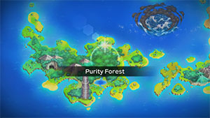
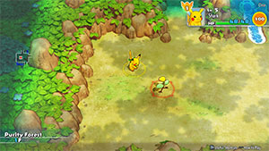

  

[Introduction]

# Overview

<table class="dungeonOverview">
  <tr>
    <th>Unlock</th>
    <td class="highlightYellow">Clear Pitfall Valley.</td>
  </tr>
</table>

<table class="dungeonTable">
  <tr>
    <th>Floors</th>
    <td>99F</td>
    <th>Job Rank</th>
    <td>⭐︎⭐︎⭐︎</td>
  </tr>
  <tr>
    <th>Radar / Scanning</th>
    <td>No</td>
    <th>Weather</th>
    <td>Random: 3, 7, 11, 15, 19, 23, 43, 　47, 51, 55, 59, 74, 78, 82, 86F</td>
  </tr>
  <tr>
    <th>Dark Halls</th>
    <td>1 Tile</td>
    <th>Boss</th>
    <td>None</td>
  </tr>
  <tr>
    <th>Max Team Size</th>
    <td>1</td>
    <th>Strong Foe</th>
    <td>None</td>
  </tr>
  <tr>
    <th>Bring Items</th>
    <td>No</td>
    <th>Shops</th>
    <td>Yes</td>
  </tr>
  <tr>
    <th>Bring Poke</th>
    <td>No</td>
    <th>Monster Houses</th>
    <td>Yes</td>
  </tr>
  <tr>
    <th>Level Reset</th>
    <td>Yes</td>
    <th>Mystery Houses</th>
    <td>No</td>
  </tr>
  <tr>
    <th>Clear Icon</th>
    <td>None</td>
    <th>Reward</th>
    <td>Celebi joins</td>
  </tr>
</table>

# Pokemon

Rate = Recruit rate. Red stats = Stats as an enemy. Ability colors: Caution, Dangerous Move colors: Boosting, Destroys Items, Caution, Dangerous

#### Wild

|Floor|Image|Name|Rate|Lv|HP|Atk|Def|SpA|SpD|Spe|Exp|Ability + Moves|
|-|-|-|-|-|-|-|-|-|-|-|-|-|
|1-3||Pidgey  |14.4%|8|44 14|15 9|15 5|14 9|14 5|18 7|18|Keen Eye or Tangled Feet Tackle / Sand Attack|
|1-3||Bellsprout  |16.9%|8|44 12|22 9|14 5|18 8|12 5|15 7|18|Chlorophyll Vine Whip / Growth|
|1-3||Exeggcute  |14.4%|9|50 17|20 9|21 7|23 10|16 7|17 13|20|Chlorophyll Barrage / Uproar / Hypnosis / Reflect|
|1-3||Wurmple |14.4%|10|44 20|16 10|16 8|13 10|13 8|15 19|23|Shield Dust Tackle / String Shot / Poison Sting|
|1-4||Cleffa |16.9%|9|45 17|13 8|13 7|16 9|16 7|15 13|20|Cute Charm or Magic Guard Pound / Charm / Encore / Sing|
|2-4||Caterpie |10.8%|10|44 18|15 9|18 8|13 9|13 8|19 19|23|Shield Dust Tackle / String Shot / Bug Bite|
|2-4||Jigglypuff  |16.9%|11|57 21|17 14|14 10|17 12|14 10|16 21|25|Cute Charm or Competitive Pound / Disarming Voice / Play Nice / Defense Curl / Sing|
|4-6||Poochyena |14.4%|11|47 26|25 14|19 10|18 14|18 10|21 21|25|Run Away or Quick Feet Tackle / Howl / Sand Attack / Bite|
|4-6 92-99||Budew  |16.9%|8|43 26|15 12|14 10|19 14|16 11|18 21|18|Natural Cure or Poison Point Absorb / Growth / Water Sport|
|5-7||Clefairy |6.4%|12|48 26|17 18|17 15|20 16|20 15|19 22|30|Cute Charm or Magic Guard Spotlight / Disarming Voice / Pound / Growl / Encore / Sing / Double Slap|
|5-7||Rattata |14.4%|12|46 26|23 18|20 14|17 16|20 14|26 22|30|Run Away or Guts Quick Attack / Focus Energy / Tackle / Tail Whip / Bite|
|6-8||Nidoran♀ |14.4%|13|49 38|23 21|22 16|22 21|20 15|22 24|30|Poison Point or Rivalry Scratch / Poison Sting / Double Kick / Growl / Tail Whip|
|6-10||Togepi |16.9%|13|47 38|18 19|25 16|24 21|25 16|20 24|30|Hustle or Serene Grace Growl / Charm / Metronome / Yawn / Sweet Kiss|
|7-8||Zigzagoon |14.4%|13|49 34|24 19|22 15|18 21|22 15|26 24|30|Pickup or Gluttony Tackle / Odor Sleuth / Tail Whip / Sand Attack / Baby-Doll Eyes / Growl / Headbutt|
|7-9||Elekid |14.4%|13|49 34|25 21|22 15|29 21|24 15|30 24|30|Static Thunder Shock / Quick Attack / Leer / Low Kick / Swift|
|7-10||Voltorb |14.4%|13|49 34|22 19|22 16|25 21|22 15|31 24|30|Soundproof or Static Charge / Tackle / Screech / Spark / Sonic Boom / Eerie Impulse / Rollout|
|8-9||Aron  |14.4%|13|49 38|30 23|32 18|20 19|20 15|21 24|30|Sturdy or Rock Head Metal Claw / Rock Tomb / Headbutt / Tackle / Harden / Mud-Slap|
|9-10||Spearow  |14.4%|13|49 34|29 21|22 15|22 19|20 15|27 24|30|Keen Eye Peck / Growl / Fury Attack / Pursuit / Leer|
|9-10||Hoppip  |8.2%|13|47 34|20 19|20 15|20 19|20 15|25 24|30|Chlorophyll or Leaf Guard Splash / Absorb / Fairy Wind / Tackle / Tail Whip / Synthesis / Poison Powder|
|9-12||Weedle  |14.4%|13|47 38|18 19|20 15|16 21|16 15|22 24|30|Shield Dust Poison Sting / String Shot / Bug Bite|
|10-12||Plusle |14.4%|13|50 34|23 21|20 15|26 19|23 16|28 24|30|Plus Nuzzle / Play Nice / Thunder Wave / Growl / Quick Attack / Encore / Spark / Helping Hand / Bestow|
|10-12||Minun |14.4%|13|50 38|21 21|20 16|26 23|25 16|28 24|30|Minus Nuzzle / Play Nice / Thunder Wave / Growl / Quick Attack / Encore / Spark / Helping Hand / Switcheroo|
|11-13||Ralts  |1.6%|13|45 38|18 19|18 15|22 19|20 15|22 24|30|Synchronize or Trace Growl / Confusion / Disarming Voice / Double Team / Teleport|
|11-13||Baltoy  |14.4%|13|49 34|24 21|29 16|22 21|29 16|25 24|30|Levitate Mud-Slap / Confusion / Rock Tomb / Harden / Rapid Spin / Heal Block|
|11-14||Marill  |6.4%|18|53 88|22 29|25 27|22 36|25 25|27 33|55|Thick Fat or Huge Power Tackle / Water Sport / Helping Hand / Water Gun / Tail Whip / Defense Curl / Bubble / Rollout / Bubble Beam|
|12-14||Geodude  |14.4%|13|47 34|30 23|30 18|18 21|18 15|20 24|30|Rock Head or Sturdy Tackle / Defense Curl / Rock Polish / Mud Sport / Rollout / Magnitude|
|13-14||Tyrogue |14.4%|14|47 43|32 20|21 17|21 20|30 17|27 25|35|Guts or Steadfast Fake Out / Helping Hand / Foresight / Tackle|
|13-14||Meditite  |14.4%|14|50 43|23 23|24 18|23 20|23 17|26 25|35|Pure Power Bide / Meditate / Confusion / Detect / Endure|
|13-20 34-38 70-79||Castform |8.2%|14|51 43|27 25|24 18|24 23|24 18|27 25|35|Forecast Tackle / Water Gun / Powder Snow / Ember|
|14-16||Beldum  |14.4%|15|51 45|28 26|29 20|24 28|25 20|25 26|40|Clear Body Take Down|
|14-17||Natu  |8.2%|15|51 50|28 26|24 20|33 28|24 18|30 26|40|Synchronize or Early Bird Lucky Chant / Night Shade / Teleport / Peck / Leer|
|15-16||Exeggutor  |14.4%|15|57 45|32 28|29 22|35 23|24 20|25 26|40|Chlorophyll Seed Bomb / Confusion / Hypnosis / Barrage / Stomp|
|15-17||Skarmory  |14.4%|16|53 60|30 31|40 27|23 38|27 22|30 27|45|Keen Eye or Sturdy Leer / Peck / Sand Attack / Air Cutter / Metal Claw|
|16-18||Scyther  |14.4%|16|53 55|42 38|30 22|27 28|27 22|32 27|45|Swarm or Technician Vacuum Wave / Quick Attack / Leer / Focus Energy / Pursuit / False Swipe|
|16-18||Hoothoot  |14.4%|16|58 55|26 25|23 20|28 28|28 20|29 27|45|Insomnia or Keen Eye Foresight / Growl / Hypnosis / Peck / Tackle / Confusion / Echoed Voice / Zen Headbutt|
|17-19||Sudowoodo |14.4%|17|52 58|37 32|37 26|21 26|27 23|26 28|50|Sturdy or Rock Head Wood Hammer / Rock Throw / Flail / Slam / Low Kick / Copycat / Mimic|
|17-20||Slakoth |14.4%|17|54 58|31 29|31 23|27 26|24 21|31 28|50|Truant Scratch / Yawn / Amnesia / Slack Off / Feint Attack / Encore|
|18-20||Linoone |14.4%|20|55 77|34 40|31 29|27 40|31 29|37 39|65|Pickup or Gluttony Odor Sleuth / Sand Attack / Rototiller / Tackle / Headbutt / Tail Whip / Growl / Mud Sport / Switcheroo / Play Rough / Fury Swipes|
|18-25||Oddish  |14.4%|17|52 58|28 29|28 23|32 26|28 23|26 28|50|Chlorophyll Growth / Absorb / Poison Powder / Acid / Sweet Scent / Sleep Powder / Stun Spore|
|19-21||Sentret |14.4%|18|53 61|31 31|28 22|25 31|25 22|32 29|55|Run Away or Keen Eye Scratch / Quick Attack / Defense Curl / Foresight / Helping Hand / Fury Swipes|
|19-22||Swinub  |14.4%|18|59 55|38 31|31 22|28 28|28 22|30 29|55|Oblivious or Snow Cloak Tackle / Odor Sleuth / Mud Sport / Powder Snow / Mud-Slap / Endure / Mud Bomb|
|20-24||Sunflora |14.4%|19|54 65|33 36|30 25|38 29|32 25|29 30|60|Chlorophyll or Solar Power Flower Shield / Growth / Razor Leaf / Ingrain / Grass Whistle / Mega Drain / Absorb / Leech Seed / Worry Seed / Pound|
|21-25||Shroomish |14.4%|19|55 65|45 33|34 25|30 44|30 25|33 30|60|Effect Spore or Poison Heal Headbutt / Stun Spore / Leech Seed / Tackle / Mega Drain / Poison Powder / Absorb|
|22-25||Ledyba  |14.4%|19|51 65|26 29|27 23|30 33|40 25|35 30|60|Swarm or Early Bird Tackle / Supersonic / Light Screen / Mach Punch / Reflect / Safeguard / Swift / Silver Wind|
|23-25||Dugtrio |8.2%|26|56 98|44 58|35 35|35 53|39 35|49 53|95|Sand Veil or Arena Trap Mud-Slap / Sand Tomb / Night Slash / Tri Attack / Magnitude / Sand Attack / Scratch / Mud Bomb / Sucker Punch / Rototiller / Astonish / Bulldoze / Growl|
|23-27||Poliwag |14.4%|19|54 59|30 33|30 23|27 33|27 23|37 30|60|Water Absorb or Damp Hypnosis / Water Sport / Water Gun / Bubble / Double Slap / Rain Dance|
|23-28||Farfetch'd  |14.4%|20|52 65|32 34|32 26|32 34|32 26|33 31|65|Keen Eye or Inner Focus Peck / Fury Cutter / Leer / Brave Bird / Sand Attack / Slash / Poison Jab / Aerial Ace / Fury Attack / Knock Off|
|24-28||Trapinch |14.4%|20|52 72|36 37|28 26|28 34|28 24|34 31|65|Hyper Cutter or Arena Trap Sand Attack / Bite / Sand Tomb / Dig / Rock Slide / Feint Attack / Bulldoze / Bide / Mud-Slap|
|25-26||Growlithe |10.8%|20|62 65|46 37|34 26|42 34|31 24|37 31|65|Intimidate or Flash Fire Ember / Odor Sleuth / Flame Wheel / Reversal / Bite / Leer / Helping Hand / Roar|
|26-30||Yanma  |14.4%|21|64 75|36 33|36 27|47 33|29 25|40 33|70|Speed Boost or Compound Eyes Tackle / Sonic Boom / Quick Attack / Double Team / Foresight / Detect|
|26-31||Weepinbell  |16.9%|21|56 86|44 42|29 30|36 42|28 27|34 42|70|Chlorophyll Vine Whip / Growth / Sleep Powder / Wrap / Poison Powder / Stun Spore|
|26-32||Spinarak  |14.4%|21|56 83|43 33|32 25|32 36|32 25|32 33|70|Swarm or Insomnia Poison Sting / String Shot / Constrict / Absorb / Infestation / Night Shade / Scary Face / Shadow Sneak|
|27-30||Teddiursa |14.4%|22|65 84|53 38|34 28|37 38|34 26|35 36|75|Pickup or Quick Feet Scratch / Fling / Feint Attack / Covet / Baby-Doll Eyes / Lick / Fury Swipes / Fake Tears / Sweet Scent|
|27-30||Dustox  |14.4%|22|53 84|30 35|32 28|26 35|26 28|30 36|75|Shield Dust Gust / Poison Powder / Venoshock / Moonlight / Confusion / Psybeam|
|30-34||Electrike |10.8%|22|57 84|37 35|34 26|45 35|34 26|43 36|75|Static or Lightning Rod Leer / Thunder Wave / Odor Sleuth / Quick Attack / Tackle / Spark / Howl / Thunder Fang|
|31-33||Ampharos |14.4%|30|65 110|45 62|45 38|50 56|45 38|47 57|115|Static Thunder Punch / Zap Cannon / Growl / Ion Deluge / Thunder Shock / Charge / Magnetic Flux / Tackle / Confuse Ray / Electro Ball / Fire Punch / Take Down / Dragon Pulse / Thunder Wave / Cotton Spore ※ Can Mega Evolve.|
|31-35||Beedrill  |14.4%|23|54 77|28 40|31 27|27 36|27 29|35 39|80|Swarm Twineedle / Fury Attack / Venoshock / Rage / Focus Energy / Pursuit ※ Can Mega Evolve.|
|31-35||Nidoran♂ |10.8%|23|58 85|39 36|35 27|35 36|31 27|39 39|80|Poison Point or Rivalry Leer / Focus Energy / Poison Sting / Double Kick / Peck / Horn Attack / Fury Attack|
|31-35||Gligar  |10.8%|23|59 93|47 40|48 32|31 48|36 29|43 39|80|Hyper Cutter or Sand Veil Poison Sting / Sand Attack / Harden / Knock Off / Fury Cutter / Feint Attack / Quick Attack / Acrobatics|
|31-36||Stantler |10.8%|23|55 85|48 40|48 29|36 32|40 29|37 39|80|Intimidate or Frisk Me First / Tackle / Astonish / Stomp / Take Down / Hypnosis / Sand Attack / Leer / Confuse Ray|
|33-37||Electabuzz |8.2%|30|65 121|50 62|45 38|60 62|50 38|56 57|115|Static Quick Attack / Leer / Thunder Punch / Thunder Shock / Swift / Shock Wave / Low Kick / Light Screen / Electro Ball / Thunder Wave|
|35-39||Doduo  |10.8%|23|58 85|51 40|35 29|35 40|35 27|42 39|80|Run Away or Early Bird Peck / Quick Attack / Double Hit / Fury Attack / Pursuit / Growl / Pluck / Rage|
|35-42||Tauros |10.8%|24|60 86|50 51|41 33|32 42|37 30|47 42|85|Intimidate or Anger Point Tackle / Tail Whip / Pursuit / Payback / Horn Attack / Rage / Scary Face / Rest|
|35-48||Gloom  |14.4%|23|58 78|36 38|36 30|40 34|36 30|34 42|80|Chlorophyll Acid / Sweet Scent / Poison Powder / Growth / Sleep Powder / Mega Drain / Stun Spore / Absorb|
|36-40||Manectric |10.8%|26|61 108|43 58|39 35|52 53|39 35|49 53|95|Static or Lightning Rod Fire Fang / Tackle / Electric Terrain / Leer / Howl / Thunder Wave / Spark / Thunder Fang / Quick Attack / Bite / Odor Sleuth ※ Can Mega Evolve.|
|37-39||Cacnea |10.8%|24|59 86|53 42|36 27|53 51|36 27|38 42|85|Sand Veil Poison Sting / Leer / Absorb / Growth / Leech Seed / Sand Attack / Ingrain / Feint Attack / Needle Arm|
|39-42||Murkrow  |10.8%|24|67 86|53 42|32 27|49 42|32 27|42 42|85|Insomnia or Super Luck Peck / Wing Attack / Astonish / Haze / Pursuit / Night Shade|
|39-42||Heracross  |10.8%|24|60 86|54 51|37 30|32 42|41 33|44 42|85|Swarm or Guts Arm Thrust / Bullet Seed / Aerial Ace / Counter / Night Slash / Horn Attack / Endure / Feint / Tackle / Chip Away / Leer ※ Can Mega Evolve.|
|39-43||Breloom  |10.8%|24|60 88|56 54|41 32|36 41|37 32|40 48|85|Effect Spore or Poison Heal Mach Punch / Absorb / Stun Spore / Headbutt / Leech Seed / Mega Drain / Tackle / Feint / Counter|
|40-45||Cacturne  |10.8%|32|66 124|66 75|46 39|66 57|46 39|49 59|125|Sand Veil Spiky Shield / Destiny Bond / Revenge / Poison Sting / Leer / Growth / Absorb / Feint Attack / Sand Attack / Payback / Leech Seed / Ingrain / Needle Arm / Spikes|
|42-46||Ariados  |10.8%|24|59 87|49 43|36 31|36 52|36 31|36 45|85|Swarm or Insomnia Poison Sting / String Shot / Constrict / Absorb / Focus Energy / Night Shade / Scary Face / Swords Dance / Bug Bite / Venom Drench / Shadow Sneak / Infestation / Fury Swipes / Fell Stinger|
|42-46||Skiploom  |10.8%|24|55 86|32 38|32 30|32 38|36 30|41 42|85|Chlorophyll or Leaf Guard Splash / Synthesis / Sleep Powder / Fairy Wind / Tail Whip / Stun Spore / Tackle / Poison Powder / Leech Seed / Absorb / Bullet Seed|
|44-49||Nincada  |10.8%|24|59 94|48 38|33 33|32 38|32 27|50 42|85|Compound Eyes Scratch / Sand Attack / Metal Claw / Absorb / Fury Swipes / Mud-Slap / Harden|
|44-49||Shedinja  |-25.0%|24|26 78|54 42|29 30|34 34|32 27|48 42|85|Wonder Guard Harden / Sand Attack / Absorb / Spite / Scratch / Fury Swipes / Shadow Sneak ※ Spawns after Nincada faints.|
|47-49||Bagon |10.8%|25|60 87|51 43|42 31|38 52|33 28|40 45|90|Rock Head Rage / Leer / Bite / Headbutt / Ember / Focus Energy / Dragon Breath / Crunch|
|47-49||Magmar |10.8%|30|65 121|60 62|45 38|60 56|50 38|53 57|115|Flame Body Ember / Smokescreen / Flame Burst / Leer / Smog / Feint Attack / Fire Spin / Fire Punch / Clear Smog / Confuse Ray|
|47-50||Nidorino |10.8%|25|60 87|42 43|38 31|38 39|34 28|42 45|90|Poison Point or Rivalry Leer / Focus Energy / Poison Sting / Double Kick / Peck / Horn Attack / Fury Attack|
|47-50||Nidorina |10.8%|25|60 87|38 39|38 31|38 39|34 28|39 45|90|Poison Point or Rivalry Scratch / Poison Sting / Double Kick / Growl / Tail Whip / Fury Swipes / Bite|
|47-50||Golbat  |10.8%|24|59 79|40 43|36 31|36 35|36 31|43 45|85|Inner Focus Screech / Absorb / Supersonic / Bite / Astonish / Wing Attack / Confuse Ray / Swift / Air Cutter|
|48-50||Tangela |10.8%|25|69 79|51 39|51 35|51 39|34 28|40 45|90|Chlorophyll or Leaf Guard Ingrain / Constrict / Poison Powder / Vine Whip / Absorb / Bind / Growth / Sleep Powder / Mega Drain|
|49-52||Illumise |10.8%|25|60 87|38 39|38 31|43 52|38 31|45 45|90|Oblivious or Tinted Lens Tackle / Sweet Scent / Quick Attack / Play Nice / Moonlight / Struggle Bug / Charm / Wish|
|50-55||Arcanine |10.8%|25|68 87|55 52|42 31|51 43|38 31|45 45|90|Intimidate or Flash Fire Roar / Bite / Fire Fang / Thunder Fang / Odor Sleuth|
|51-53||Electrode |8.2%|30|65 121|45 56|45 38|50 56|45 38|59 57|115|Soundproof or Static Magnetic Flux / Charge / Sonic Boom / Tackle / Eerie Impulse / Charge Beam / Spark / Light Screen / Screech / Swift / Electro Ball / Self-Destruct / Rollout|
|51-53||Forretress  |10.8%|31|66 123|60 63|66 47|46 51|45 39|46 58|120|Sturdy Mirror Shot / Autotomize / Bug Bite / Heavy Slam / Zap Cannon / Protect / Magnet Rise / Toxic Spikes / Tackle / Self-Destruct / Take Down / Spikes / Rapid Spin / Natural Gift / Bide|
|51-54||Fearow  |10.8%|25|60 95|51 43|38 31|38 43|37 31|45 45|90|Keen Eye Drill Run / Pluck / Growl / Aerial Ace / Peck / Leer / Mirror Move / Pursuit / Fury Attack / Assurance|
|51-55||Shuckle  |10.8%|25|51 87|29 35|74 41|29 39|74 41|34 45|90|Sturdy or Gluttony Withdraw / Sticky Web / Struggle Bug / Bide / Wrap / Safeguard / Rock Throw / Rollout / Encore / Constrict / Rest|
|51-56||Hitmonlee |8.2%|25|56 87|54 52|34 31|34 43|50 35|44 45|90|Limber or Reckless Feint / Focus Energy / Close Combat / Double Kick / Reversal / Mega Kick / Revenge / Rolling Kick / Brick Break / Jump Kick / Meditate|
|51-56||Hitmonchan |8.2%|25|56 87|54 52|34 31|34 35|50 35|44 45|90|Keen Eye or Iron Fist Feint / Comet Punch / Close Combat / Mach Punch / Counter / Focus Punch / Revenge / Bullet Punch / Pursuit / Agility|
|53-55||Magby |10.8%|25|60 79|51 43|38 28|51 35|42 28|45 45|90|Flame Body Ember / Smokescreen / Flame Burst / Leer / Smog / Feint Attack / Fire Spin / Clear Smog|
|54-56||Numel  |10.8%|25|60 79|51 39|38 28|51 43|38 28|37 45|90|Oblivious or Simple Growl / Focus Energy / Flame Burst / Amnesia / Magnitude / Lava Plume / Tackle / Ember|
|56-60||Mightyena |10.8%|25|60 87|51 43|38 31|37 43|37 31|42 45|90|Intimidate or Quick Feet Ice Fang / Thunder Fang / Fire Fang / Snarl / Crunch / Thief / Odor Sleuth / Howl / Sand Attack / Tackle / Roar / Bite / Swagger / Assurance|
|56-61||Magcargo  |-2.2%|38|66 135|50 60|63 48|56 60|48 43|52 68|155|Magma Armor or Flame Body Harden / Shell Smash / Earth Power / Smog / Ancient Power / Rock Throw / Amnesia / Flame Burst / Clear Smog / Lava Plume / Incinerate / Rock Slide / Yawn / Ember|
|57-59||Rapidash |-2.2%|40|72 139|67 67|49 44|57 61|48 44|76 70|165|Run Away or Flash Fire Fury Attack / Poison Jab / Megahorn / Quick Attack / Fire Spin / Tail Whip / Ember / Flame Wheel / Flame Charge / Stomp / Growl / Take Down / Agility / Inferno|
|57-59||Torkoal |10.8%|26|61 88|44 45|57 39|44 45|39 32|35 48|95|White Smoke or Drought Ember / Smog / Withdraw / Fire Spin / Rapid Spin / Smokescreen / Curse / Flame Wheel / Lava Plume|
|58-61||Rhyhorn  |10.8%|26|70 88|61 45|53 36|35 45|35 29|38 48|95|Lightning Rod or Rock Head Horn Attack / Tail Whip / Scary Face / Fury Attack / Smack Down / Bulldoze / Stomp / Chip Away|
|58-63||Swablu  |10.8%|26|61 88|43 41|44 32|39 36|44 32|44 48|95|Natural Cure Peck / Disarming Voice / Fury Attack / Growl / Astonish / Sing / Safeguard / Mist / Round / Natural Gift / Refresh / Take Down|
|59-63||Arbok |10.8%|26|61 80|44 45|39 32|39 41|39 32|44 48|95|Intimidate or Shed Skin Thunder Fang / Ice Fang / Fire Fang / Crunch / Wrap / Poison Sting / Glare / Leer / Bite / Screech / Acid|
|59-62||Piloswine  |10.8%|33|76 125|63 64|52 40|46 58|46 40|53 60|130|Oblivious or Snow Cloak Peck / Fury Attack / Ancient Power / Ice Fang / Odor Sleuth / Mud Sport / Endure / Mud Bomb / Powder Snow / Mud-Slap / Icy Wind / Take Down|
|60-62||Snorunt |10.8%|26|61 96|44 41|43 32|43 41|39 29|44 48|95|Inner Focus or Ice Body Powder Snow / Leer / Double Team / Ice Shard / Icy Wind / Bite / Ice Fang|
|61-63||Furret |10.8%|26|61 88|43 45|39 32|35 41|35 29|46 48|95|Run Away or Keen Eye Scratch / Fury Swipes / Helping Hand / Foresight / Defense Curl / Follow Me / Quick Attack / Coil / Agility|
|62-64||Lairon  |10.8%|32|66 135|62 63|66 47|41 57|41 36|46 59|125|Sturdy or Rock Head Tackle / Harden / Mud-Slap / Roar / Metal Claw / Rock Tomb / Headbutt / Iron Head / Rock Slide / Take Down / Protect / Metal Sound|
|62-64||Metang  |10.8%|26|61 88|44 45|44 36|39 41|39 32|41 48|95|Clear Body Confusion / Metal Claw / Take Down / Magnet Rise / Pursuit / Bullet Punch|
|63-64||Pineco |10.8%|26|61 88|52 41|57 36|39 41|39 29|38 48|95|Sturdy Tackle / Protect / Self-Destruct / Bide / Bug Bite / Take Down / Natural Gift / Rapid Spin|
|65-68||Pupitar  |10.8%|30|65 121|50 62|45 38|45 75|45 38|47 57|115|Shed Skin Bite / Leer / Sandstorm / Screech / Chip Away / Rock Slide / Scary Face / Thrash|
|65-69||Shelgon |10.8%|30|65 121|60 62|50 42|45 56|40 35|47 57|115|Rock Head Protect / Rage / Ember / Leer / Bite / Dragon Breath / Headbutt / Crunch / Focus Energy / Dragon Claw|
|65-70||Zangoose |10.8%|26|61 88|57 54|39 32|39 41|39 32|47 48|95|Immunity Scratch / Quick Attack / Fury Cutter / Revenge / Hone Claws / Crush Claw / Leer / Pursuit / Slash|
|65-79||Vileplume  |10.8%|26|61 88|39 45|39 36|44 36|39 32|38 48|95|Chlorophyll Aromatherapy / Poison Powder / Stun Spore / Mega Drain|
|70-71||Masquerain  |10.8%|28|63 93|42 47|42 34|46 47|42 34|44 51|105|Intimidate Quiver Dance / Whirlwind / Bug Buzz / Bubble / Quick Attack / Sweet Scent / Water Sport / Air Cutter / Scary Face / Gust / Stun Spore / Ominous Wind|
|70-73||Glalie |-2.2%|42|74 169|59 68|54 46|59 68|49 46|74 72|175|Inner Focus or Ice Body Protect / Sheer Cold / Powder Snow / Freeze-Dry / Double Team / Ice Shard / Icy Wind / Bite / Ice Fang / Headbutt / Leer / Frost Breath / Crunch ※ Can Mega Evolve.|
|70-74||Slaking |10.8%|36|71 130|60 75|52 47|51 65|42 42|59 66|145|Truant Covet / Hammer Arm / Punishment / Slack Off / Scratch / Yawn / Encore / Swagger / Feint Attack / Chip Away / Amnesia / Fling / Counter|
|71||Koffing |10.8%|28|63 93|56 47|56 38|47 52|42 31|44 51|105|Levitate Poison Gas / Tackle / Smokescreen / Sludge / Self-Destruct / Clear Smog / Assurance / Smog / Haze|
|72-74||Rhydon  |-2.2%|42|84 130|82 75|64 51|49 62|44 42|56 72|175|Lightning Rod or Rock Head Hammer Arm / Horn Attack / Stomp / Take Down / Tail Whip / Fury Attack / Scary Face / Smack Down / Bulldoze / Chip Away / Rock Blast / Drill Run / Horn Drill / Stone Edge|
|74-76||Nidoqueen  |10.8%|28|63 101|42 52|42 38|42 47|37 34|44 51|105|Poison Point or Rivalry Scratch / Double Kick / Superpower / Tail Whip / Poison Sting / Chip Away|
|76-79||Golem  |10.8%|28|58 116|56 69|56 42|37 57|37 35|41 52|105|Rock Head or Sturdy Heavy Slam / Tackle / Defense Curl / Mud Sport / Rock Polish / Magnitude / Bulldoze / Steamroller / Rock Throw / Smack Down / Self-Destruct|
|77-79||Nidoking  |10.8%|28|63 93|47 52|42 34|42 47|37 34|47 51|105|Poison Point or Rivalry Peck / Focus Energy / Poison Sting / Megahorn / Double Kick / Chip Away|
|79-85||Porygon2 |8.2%|28|63 93|47 52|47 38|56 52|47 38|44 51|105|Trace or Download Conversion / Tackle / Conversion 2 / Zap Cannon / Magic Coat / Recover / Magnet Rise / Defense Curl / Agility / Psybeam|
|80-84||Shuppet |10.8%|28|63 93|61 52|42 31|47 63|42 31|47 51|105|Insomnia or Frisk Knock Off / Screech / Night Shade / Spite / Will-O-Wisp / Shadow Sneak / Feint Attack / Hex / Curse|
|80-99||Parasect  |16.9%|28|63 101|56 52|47 34|42 63|42 34|41 51|105|Effect Spore or Dry Skin Scratch / Cross Poison / Stun Spore / Absorb / Poison Powder / Fury Cutter / Spore|
|81-85||Ponyta |6.4%|30|65 96|60 57|45 35|50 52|45 35|56 52|115|Run Away or Flash Fire Fire Spin / Tail Whip / Flame Charge / Tackle / Ember / Take Down / Stomp / Growl / Flame Wheel|
|81-85||Grimer |10.8%|28|72 93|56 52|42 34|42 47|46 31|44 51|105|Stench or Sticky Hold Minimize / Poison Gas / Mud Bomb / Harden / Mud-Slap / Disable / Sludge / Pound / Fling|
|81-85||Camerupt  |8.2%|33|67 125|62 64|46 40|62 58|46 40|47 60|130|Magma Armor or Solid Rock Rock Slide / Tackle / Fissure / Growl / Eruption / Take Down / Focus Energy / Lava Plume / Flame Burst / Amnesia / Magnitude / Earth Power / Ember / Curse ※ Can Mega Evolve.|
|85-89 92-99||Miltank |16.9%|33|76 116|52 57|62 39|41 69|46 35|59 52|130|Thick Fat or Scrappy Growl / Defense Curl / Zen Headbutt / Tackle / Body Slam / Milk Drink / Bide / Stomp / Rollout|
|86-88||Ledian  |10.8%|30|60 106|40 46|40 35|45 57|60 39|53 52|115|Swarm or Early Bird Tackle / Supersonic / Mach Punch / Reflect / Light Screen / Silver Wind / Swift / Comet Punch / Safeguard / Baton Pass|
|86-88||Solrock  |10.8%|30|65 106|60 57|50 39|45 52|45 35|50 52|115|Levitate Tackle / Rock Throw / Cosmic Power / Psywave / Rock Polish / Rock Slide / Confusion / Fire Spin / Flare Blitz / Harden / Embargo / Psychic|
|86-95||Weezing |10.8%|35|68 129|63 65|62 46|53 65|47 41|57 64|140|Levitate Poison Gas / Tackle / Smokescreen / Sludge / Self-Destruct / Clear Smog / Assurance / Smog / Haze / Gyro Ball / Double Hit / Sludge Bomb|
|86-98||Venomoth  |10.8%|31|66 123|45 57|46 39|51 57|45 39|55 58|120|Shield Dust or Tinted Lens Gust / Quiver Dance / Signal Beam / Tackle / Stun Spore / Poison Powder / Disable / Sleep Powder / Supersonic / Foresight / Silver Wind / Confusion / Bug Buzz / Psybeam|
|89-92||Dusclops |10.8%|37|65 132|57 66|68 52|49 60|62 52|58 67|150|Pressure Fire Punch / Ice Punch / Confuse Ray / Shadow Punch / Future Sight / Leer / Gravity / Night Shade / Will-O-Wisp / Bind / Disable / Astonish / Foresight / Pursuit / Shadow Sneak / Curse / Thunder Punch|
|89-93||Scizor  |10.8%|30|65 106|70 69|50 39|45 57|45 35|50 52|115|Swarm or Technician Feint / Quick Attack / Bullet Punch / Leer / Fury Cutter / Pursuit / Agility / False Swipe / Focus Energy / Slash / Metal Claw ※ Can Mega Evolve.|
|89-93||Altaria  |10.8%|35|68 129|53 65|52 46|48 59|52 46|55 64|140|Natural Cure Astonish / Pluck / Peck / Growl / Sing / Sky Attack / Dragon Breath / Refresh / Fury Attack / Safeguard / Take Down / Round / Natural Gift / Dragon Dance / Mist / Disarming Voice / Cotton Guard ※ Can Mega Evolve.|
|92-99||Aerodactyl  |10.8%|30|65 96|60 69|45 35|45 52|45 35|59 52|115|Rock Head or Pressure Thunder Fang / Ice Fang / Fire Fang / Ancient Power / Supersonic / Agility / Scary Face / Wing Attack / Iron Head / Bite / Roar ※ Can Mega Evolve.|
|92-99||Flygon  |-2.2%|45|73 150|65 70|45 49|55 63|45 49|65 75|190|Levitate Sonic Boom / Dragon Claw / Bulldoze / Sand Tomb / Sand Attack / Mud-Slap / Dragon Breath / Dragon Dance / Bide / Feint Attack / Rock Slide / Sandstorm / Screech / Dragon Tail / Supersonic / Earthquake / Earth Power / Uproar / Hyper Beam|
|92-99||Claydol  |10.8%|36|69 130|54 65|62 47|48 65|62 47|56 66|145|Levitate Teleport / Heal Block / Cosmic Power / Power Split / Guard Split / Confusion / Rock Tomb / Psybeam / Hyper Beam / Mud-Slap / Rapid Spin / Power Trick / Self-Destruct / Extrasensory / Harden / Ancient Power|
|92-99||Tropius  |10.8%|30|75 106|50 52|50 35|50 57|50 35|47 52|115|Chlorophyll or Solar Power Growth / Leaf Tornado / Sweet Scent / Stomp / Razor Leaf / Magical Leaf / Whirlwind / Leer / Natural Gift / Gust / Leaf Storm|
|92-99||Salamence  |-2.2%|50|82 158|85 75|57 54|68 72|47 54|68 82|215|Intimidate Scary Face / Dragon Tail / Fire Fang / Thunder Fang / Rage / Headbutt / Fly / Bite / Dragon Breath / Ember / Leer / Focus Energy / Dragon Claw / Protect / Crunch / Zen Headbutt / Flamethrower ※ Can Mega Evolve.|
|92-99||Metagross  |-2.2%|45|76 164|73 75|55 59|62 70|50 49|62 75|190|Clear Body Confusion / Take Down / Metal Claw / Magnet Rise / Hammer Arm / Pursuit / Bullet Punch / Miracle Eye / Agility / Zen Headbutt / Scary Face / Psychic / Meteor Mash ※ Can Mega Evolve.|

# Items

#### Floor

|Name|
|-|
|Big Eater Belt|
|Cover Band|
|Defense Scarf|
|Detect Band|
|Efficient Bandanna|
|Explosive Band|
|Fickle Specs|
|Fierce Bandanna|
|Friend Bow|
|Gold Ribbon|
|Heal Ribbon|
|Heavy Rotation Specs|
|Insomniscope|
|Joy Ribbon|
|Lock-On Specs|
|Lucky Ribbon|
|Mach Ribbon|
|Mobile Scarf|
|Munch Belt|
|No-Stick Cap|
|Nullify Bandanna|
|Pass Scarf|
|Pecha Scarf|
|Persim Band|
|Power Band|
|Prosper Ribbon|
|Recovery Scarf|
|Reunion Cape|
|Scope Lens|
|Sneak Scarf|
|Special Band|
|Stamina Band|
|Tight Belt|
|Twist Band|
|Warp Scarf|
|Weather Band|
|X-Ray Specs|
|Zinc Band|
|Apple|
|Big Apple|
|Perfect Apple|
|Poke|
|All Dodge Orb|
|All Power-Up Orb|
|All Protect Orb|
|Cleanse Orb|
|Decoy Orb|
|Drought Orb|
|Escape Orb|
|Evasion Orb|
|Foe-Hold Orb|
|Foe-Seal Orb|
|Hail Orb|
|Health Orb|
|Inviting Orb|
|Lasso Orb|
|Luminous Orb|
|Mobile Orb|
|Monster Orb|
|Nullify Orb|
|One-Room Orb|
|One-Shot Orb|
|Petrify Orb|
|Quick Orb|
|Radar Orb|
|Rainy Orb|
|Rare Quality Orb|
|Reset Orb|
|Revive All Orb|
|Rollcall Orb|
|Sandy Orb|
|Scanner Orb|
|See-Trap Orb|
|Slow Orb|
|Slumber Orb|
|Spurn Orb|
|Sunny Orb|
|Totter Orb|
|Trapbust Orb|
|Trawl Orb|
|Weather Lock Orb|
|Max Elixir|
|Max Ether|
|Ban Seed|
|Blast Seed|
|Blinker Seed|
|Cheri Berry|
|Chesto Berry|
|Decoy Seed|
|Doom Seed|
|Energy Seed|
|Eyedrop Seed|
|Heal Seed|
|Joy Seed|
|Oran Berry|
|Pecha Berry|
|Pure Seed|
|Quick Seed|
|Rawst Berry|
|Reviver Seed|
|Sleep Seed|
|Stun Seed|
|Tiny Reviver Seed|
|Totter Seed|
|Violent Seed|
|Warp Seed|
|Iron Spike|
|Silver Spike|
|Geo Pebble|
|Gravelerock|
|(Random TM)|
|Confuse Wand|
|Guiding Wand|
|HP-Swap Wand|
|Petrify Wand|
|Pounce Wand|
|Slow Wand|
|Slumber Wand|
|Stayaway Wand|
|Surround Wand|
|Switcher Wand|
|Tunnel Wand|
|Two-Edged Wand|
|Warp Wand|
|Whirlwind Wand|

#### Shop

|Name|
|-|
|Big Eater Belt|
|Cover Band|
|Defense Scarf|
|Detect Band|
|Efficient Bandanna|
|Explosive Band|
|Fickle Specs|
|Fierce Bandanna|
|Friend Bow|
|Goggle Specs|
|Heal Ribbon|
|Heavy Rotation Specs|
|Insomniscope|
|Joy Ribbon|
|Lock-On Specs|
|Lucky Ribbon|
|Mach Ribbon|
|Mobile Scarf|
|Munch Belt|
|No-Stick Cap|
|Nullify Bandanna|
|Pass Scarf|
|Pecha Scarf|
|Persim Band|
|Phase Ribbon|
|Pierce Band|
|Power Band|
|Prosper Ribbon|
|Recovery Scarf|
|Reunion Cape|
|Scope Lens|
|Sneak Scarf|
|Special Band|
|Stamina Band|
|Tight Belt|
|Trap Scarf|
|Twist Band|
|Warp Scarf|
|Weather Band|
|X-Ray Specs|
|Zinc Band|
|Apple|
|Big Apple|
|Perfect Apple|
|Link Box|
|All Dodge Orb|
|All Power-Up Orb|
|All Protect Orb|
|Cleanse Orb|
|Decoy Orb|
|Drought Orb|
|Evasion Orb|
|Foe-Hold Orb|
|Foe-Seal Orb|
|Hail Orb|
|Health Orb|
|Inviting Orb|
|Lasso Orb|
|Luminous Orb|
|Mobile Orb|
|Monster Orb|
|Nullify Orb|
|One-Room Orb|
|One-Shot Orb|
|Petrify Orb|
|Quick Orb|
|Radar Orb|
|Rainy Orb|
|Rare Quality Orb|
|Reset Orb|
|Revive All Orb|
|Rollcall Orb|
|Sandy Orb|
|Scanner Orb|
|See-Trap Orb|
|Slow Orb|
|Slumber Orb|
|Spurn Orb|
|Sunny Orb|
|Totter Orb|
|Trapbust Orb|
|Trawl Orb|
|Weather Lock Orb|
|Max Elixir|
|Ban Seed|
|Blast Seed|
|Blinker Seed|
|Cheri Berry|
|Chesto Berry|
|Decoy Seed|
|Doom Seed|
|Energy Seed|
|Eyedrop Seed|
|Heal Seed|
|Joy Seed|
|Oran Berry|
|Pecha Berry|
|Pure Seed|
|Quick Seed|
|Rawst Berry|
|Reviver Seed|
|Sleep Seed|
|Stun Seed|
|Tiny Reviver Seed|
|Totter Seed|
|Violent Seed|
|Warp Seed|
|(Random TM)|
|Confuse Wand|
|Guiding Wand|
|HP-Swap Wand|
|Petrify Wand|
|Pounce Wand|
|Slow Wand|
|Slumber Wand|
|Stayaway Wand|
|Surround Wand|
|Switcher Wand|
|Tunnel Wand|
|Two-Edged Wand|
|Warp Wand|
|Whirlwind Wand|

# Traps

|Name|
|-|
|Wonder Tile|
|Grudge Trap|
|Sticky Trap|
|Spin Trap|
|Slumber Trap|
|Big Blast Trap|
|Poison Trap|
|Spiky Trap|
|Gust Trap|
|Mud Trap|
|Slow Trap|
|Blast Trap|
|Hunger Trap|
|Seal Trap|
|Random Trap|
|Summon Trap|
|Apple Trap|
|Warp Trap|
|PP Leech Trap|
