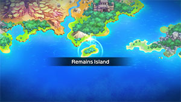
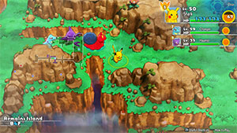

  

# Overview

<table class="dungeonOverview">
  <tr>
    <th>Unlock</th>
    <td class="highlightYellow">Clear Sky Tower.</td>
  </tr>
</table>

<table class="dungeonTable">
  <tr>
    <th>Floors</th>
    <td>B13F</td>
    <th>Job Rank</th>
    <td>B</td>
  </tr>
  <tr>
    <th>Radar / Scanning</th>
    <td>No</td>
    <th>Weather</th>
    <td>Random: 2, 7, 9, 11F</td>
  </tr>
  <tr>
    <th>Dark Halls</th>
    <td>No</td>
    <th>Boss</th>
    <td>None</td>
  </tr>
  <tr>
    <th>Max Team Size</th>
    <td>3</td>
    <th>Strong Foe</th>
    <td>Espeon</td>
  </tr>
  <tr>
    <th>Bring Items</th>
    <td>Yes</td>
    <th>Shops</th>
    <td>Yes</td>
  </tr>
  <tr>
    <th>Bring Poke</th>
    <td>Yes</td>
    <th>Monster Houses</th>
    <td>Yes</td>
  </tr>
  <tr>
    <th>Level Reset</th>
    <td>No</td>
    <th>Mystery Houses</th>
    <td>Yes</td>
  </tr>
  <tr>
    <th>Clear Icon</th>
    <td>None</td>
    <th>Reward</th>
    <td>False Swipe TM x 1 Pretty Box x 2</td>
  </tr>
</table>

Optional post-game dungeon that is automatically unlocked after clearing Sky Tower. Enemies offer an average of \~85 experience points, which is much higher than main story dungeons. Despite the dungeon's depth being a shallow 13 floors, there are 42 Pokemon in the monster table. Wild encounters for Munchlax, Snubbull, and Chingling are exclusive to this dungeon.

Orbs are shop-exclusive, so don't forget to bring some if you're concerned about Monster Houses. Shops have a smaller selection of possible TMs instead of the usual random selection from the full list. Possible TMs = Aurora Veil, Brutal Swing, Dragon Claw, Leech Life, Smart Strike, and Work Up.

The False Swipe TM you get at the end can be taught to Absol to help make it easier to recruit Pokemon. Overall, it's not a bad place to grind immediately after clearing the main story if you're out of dojo tickets, but Unown Relic is better if you have a Ghost type recruited and can afford the 9000 Poke to unlock it.

# Needed Camps

#### Wild

|Name|Price|Pokemon|
|-|-|-|
|Wild Plains|-|Rattata, Hypno|
|Stump Forest|-|Weedle, Ledyba|
|Power Plant|-|Voltorb, Electabuzz|
|Sky-Blue Plains|-|Lickitung, Snubbull|
|Darkness Ridge|-|Gastly, Misdreavus|
|Flyaway Forest|500|Pidgey, Murkrow|
|Jungle|500|Oddish, Exeggcute, Tangela|
|Safari|600|Nidoran♀, Nidoran♂, Doduo|
|Thunder Crag|600|Sentret, Flaaffy, Chingling|
|Mt. Green|700|Graveler|
|Overgrown Forest|700|Pinsir, Bonsly|
|Scorched Plains|700|Ponyta|
|Mt. Discipline|700|Hitmonlee|
|Mushroom Forest|800|Paras|
|Vibrant Forest|800|Munchlax, Aipom|
|Tadpole Pond|900|Poliwag|
|Echo Cave|2700|Zubat|
|Beau Plains|2700|Hoppip, Skiploom|
|Crater|5000|Magmar|
|Decrepit Lab|6000|Mr. Mime|
|Ice Floe Beach|6000|Seel|
|Turtleshell Pond|6000|Marill|
|Mt. Moonview|7000|Clefairy|
|Poison Swamp|7000|Grimer|
|Bountiful Sea|9000|Shellder|
|Evolution Forest|9000|Espeon|
|Gourd Swamp|9000|Wooper|

#### Fainted

|Name|Price|Pokemon|
|-|-|-|
|Stump Forest|-|Butterfree|
|Sky-Blue Plains|-|Jigglypuff|
|Flyaway Forest|500|Pidgey|
|Mt. Green|700|Golem, Teddiursa|
|Secretive Forest|900|Pineco|
|Rub-a-Dub River|3000|Totodile|
|Deepsea Floor|9000|Kabuto|
|Treasure Sea|9000|Armaldo|
|Waterfall Lake|9000|Magikarp|

#### Mystery House

|Name|Price|Pokemon|
|-|-|-|
|Darkness Ridge|-|Haunter, Misdreavus, Duskull|
|Flyaway Forest|500|Honchkrow, Altaria|
|Boulder Cave|700|Onix, Steelix|
|Frigid Cavern|800|Jynx, Delibird|
|Echo Cave|2700|Wobbuffet, Dunsparce, Mawile|
|Decrepit Lab|6000|Kadabra|
|Mt. Moonview|7000|Lunatone, Solrock|
|Serene Sea|9000|Wailord|
|Shallow Beach|9000|Krabby|
|Bountiful Sea|9000|Staryu|
|Treasure Sea|9000|Sharpedo|
|Deepsea Floor|9000|Clamperl|

# Pokemon

Rate = Recruit rate. Red stats = Stats as an enemy. Ability colors: Caution, Dangerous Move colors: Boosting, Destroys Items, Caution, Dangerous

#### Wild

|Floor|Image|Name|Rate|Lv|HP|Atk|Def|SpA|SpD|Spe|Exp|Ability + Moves|
|-|-|-|-|-|-|-|-|-|-|-|-|-|
|1-2||Pidgey  |14.4%|35|68 93|49 49|47 47|43 43|42 42|55 55|76|Keen Eye or Tangled Feet Tackle / Sand Attack / Gust / Agility / Quick Attack / Whirlwind / Twister / Feather Dance / Wing Attack|
|1-2||Rattata |14.4%|35|63 94|53 53|47 46|42 42|47 47|58 58|77|Run Away or Guts Tackle / Tail Whip / Quick Attack / Focus Energy / Endeavor / Pursuit / Hyper Fang / Assurance / Crunch / Sucker Punch / Super Fang / Bite / Double-Edge|
|1-2||Weedle  |14.4%|35|64 92|42 42|42 42|38 38|37 37|49 49|75|Shield Dust Poison Sting / String Shot / Bug Bite|
|1-2||Nidoran♀ |14.4%|35|69 102|50 50|47 47|49 49|42 42|52 52|79|Poison Point or Rivalry Toxic Spikes / Tail Whip / Scratch / Double Kick / Poison Sting / Flatter / Fury Swipes / Helping Hand / Bite / Growl|
|1-2||Nidoran♂ |10.8%|35|68 103|55 55|47 45|49 49|42 43|55 55|78|Poison Point or Rivalry Fury Attack / Poison Sting / Flatter / Double Kick / Focus Energy / Leer / Horn Attack / Helping Hand / Peck / Toxic Spikes|
|1-2||Clefairy |6.4%|35|69 100|45 45|42 42|50 50|47 47|49 49|80|Cute Charm or Magic Guard Disarming Voice / Cosmic Power / Spotlight / Encore / Sing / Minimize / Double Slap / Defense Curl / Growl / Follow Me / Stored Power / Bestow / Wake-Up Slap / Metronome / Pound|
|1-2||Zubat  |10.8%|35|68 95|55 55|47 46|48 48|47 47|58 58|81|Inner Focus Absorb / Supersonic / Astonish / Bite / Wing Attack / Confuse Ray / Air Cutter / Swift / Poison Fang / Mean Look / Leech Life / Haze|
|1-12 Rare||Munchlax |8.2%|35|88 110|69 60|47 42|48 48|62 45|49 45|85|Pickup or Thick Fat Last Resort / Recycle / Lick / Tackle / Metronome / Odor Sleuth / Screech / Amnesia / Stockpile / Defense Curl / Body Slam / Chip Away / Swallow|
|1-12 Rare||Snubbull |8.2%|35|78 108|69 59|48 45|48 48|47 45|57 50|90|Intimidate or Run Away Ice Fang / Fire Fang / Thunder Fang / Bite / Scary Face / Tail Whip / Roar / Charm / Tackle / Rage / Headbutt / Lick|
|1-12 Rare||Bonsly |8.2%|35|68 105|63 53|62 40|37 50|47 43|49 48|75|Sturdy or Rock Head Fake Tears / Copycat / Flail / Mimic / Low Kick / Rock Throw / Rock Slide / Tearful Look / Rock Tomb / Block / Feint Attack|
|1-12 Rare||Chingling |8.2%|35|68 100|48 48|47 52|63 48|47 52|55 60|80|Levitate Wrap / Growl / Astonish / Yawn / Confusion / Last Resort / Uproar / Entrainment|
|1-12 Foe|  |Espeon |-6.4%|60|99 550|64 150|55 80|83 150|60 80|110 200|810|Synchronize Confusion / Helping Hand / Swift / Tackle / Tail Whip / Psybeam / Sand Attack / Baby-Doll Eyes / Quick Attack / Future Sight / Psych Up / Morning Sun / Psychic / Last Resort / Power Swap ※ Friend Bow required to recruit.|
|3-4||Oddish  |14.4%|35|68 96|49 49|47 47|55 55|47 46|49 49|82|Chlorophyll Absorb / Growth / Sweet Scent / Acid / Poison Powder / Stun Spore / Sleep Powder / Mega Drain / Toxic / Lucky Chant / Giga Drain / Moonlight|
|3-4||Paras  |14.4%|35|68 95|63 63|52 52|48 48|47 47|49 49|83|Effect Spore or Dry Skin Scratch / Stun Spore / Absorb / Poison Powder / Fury Cutter / Slash / Spore / Growth|
|3-4||Poliwag |14.4%|35|69 100|50 50|47 47|43 43|42 42|58 58|84|Water Absorb or Damp Water Sport / Water Gun / Hypnosis / Bubble / Double Slap / Rain Dance / Body Slam / Belly Drum / Mud Shot / Bubble Beam / Wake-Up Slap|
|3-4||Graveler  |10.8%|35|64 105|65 65|62 62|43 43|42 43|49 49|85|Rock Head or Sturdy Tackle / Defense Curl / Mud Sport / Rock Polish / Bulldoze / Magnitude / Self-Destruct / Smack Down / Stealth Rock / Rock Blast / Rollout / Rock Throw|
|3-4||Ponyta |6.4%|35|68 106|63 63|47 47|53 53|47 47|66 66|86|Run Away or Flash Fire Growl / Tackle / Tail Whip / Ember / Flame Wheel / Stomp / Fire Spin / Take Down / Flame Charge / Inferno|
|4||Doduo  |10.8%|35|68 90|69 69|47 47|48 48|47 47|58 58|87|Run Away or Early Bird Peck / Growl / Quick Attack / Rage / Fury Attack / Pursuit / Acupressure / Pluck / Double Hit / Agility / Uproar|
|4||Seel |10.8%|35|78 100|53 53|52 52|48 48|52 52|60 60|88|Thick Fat or Hydration Headbutt / Growl / Water Sport / Icy Wind / Aqua Jet / Ice Shard / Rest / Aqua Ring / Encore / Brine / Aurora Beam|
|4||Grimer |10.8%|35|78 101|63 63|47 47|48 48|52 52|52 52|89|Stench or Sticky Hold Pound / Poison Gas / Mud Bomb / Disable / Sludge / Minimize / Fling / Harden / Mud-Slap / Sludge Wave / Sludge Bomb|
|4||Shellder |8.2%|35|63 100|63 63|77 77|53 53|42 41|55 55|90|Shell Armor or Skill Link Tackle / Water Gun / Clamp / Leer / Supersonic / Icicle Spear / Protect / Withdraw / Ice Shard / Razor Shell|
|5-6||Gastly  |8.2%|35|64 91|48 48|42 45|69 69|42 42|58 58|91|Levitate Hypnosis / Curse / Mean Look / Lick / Night Shade / Confuse Ray / Sucker Punch / Payback / Spite / Shadow Ball / Dream Eater|
|5-6||Hypno |8.2%|35|68 110|53 53|47 47|53 53|62 62|55 55|92|Insomnia or Forewarn Confusion / Nasty Plot / Psych Up / Switcheroo / Pound / Hypnosis / Disable / Future Sight / Headbutt / Poison Gas / Meditate / Psybeam / Wake-Up Slap / Nightmare|
|5-6||Voltorb |14.4%|35|68 90|48 48|47 47|53 53|47 48|64 64|93|Soundproof or Static Charge / Screech / Sonic Boom / Electro Ball / Spark / Rollout / Swift / Tackle / Light Screen / Magnet Rise / Charge Beam / Eerie Impulse / Self-Destruct|
|5-6||Exeggcute  |14.4%|35|78 91|63 63|52 52|69 69|47 47|57 57|94|Chlorophyll Sleep Powder / Bullet Seed / Leech Seed / Hypnosis / Reflect / Poison Powder / Barrage / Uproar / Worry Seed / Stun Spore / Confusion|
|5-6||Hitmonlee |8.2%|35|63 110|69 69|42 42|42 42|62 62|58 58|95|Limber or Reckless Double Kick / Reversal / Brick Break / Mega Kick / Revenge / Mind Reader / Rolling Kick / Jump Kick / Meditate / High Jump Kick / Close Combat / Focus Energy / Feint|
|5-6||Lickitung |6.4%|35|78 120|53 53|52 52|53 53|52 52|57 57|94|Own Tempo or Oblivious Lick / Supersonic / Defense Curl / Knock Off / Wrap / Stomp / Disable / Slam / Rollout|
|7-9||Tangela |10.8%|35|78 100|63 63|62 62|63 63|42 42|52 52|95|Chlorophyll or Leaf Guard Ingrain / Constrict / Sleep Powder / Vine Whip / Growth / Mega Drain / Absorb / Bind / Poison Powder / Knock Off / Stun Spore / Natural Gift|
|7-9||Mr. Mime  |8.2%|35|63 110|42 42|47 47|63 63|62 62|63 58|90|Soundproof or Filter Substitute / Magical Leaf / Barrier / Quick Guard / Wide Guard / Pound / Power Swap / Guard Swap / Mimic / Confusion / Copycat / Meditate / Double Slap / Psywave / Encore / Light Screen / Reflect / Psybeam / Misty Terrain / Recycle|
|7-9||Electabuzz |8.2%|35|68 108|56 56|47 47|63 63|52 53|61 61|85|Static Quick Attack / Thunder Shock / Low Kick / Shock Wave / Leer / Thunder Wave / Electro Ball / Swift / Light Screen / Thunder Punch|
|7-9||Magmar |10.8%|35|68 105|63 63|47 47|65 65|52 54|58 58|95|Flame Body Smog / Feint Attack / Smokescreen / Ember / Clear Smog / Confuse Ray / Fire Spin / Flame Burst / Fire Punch / Leer|
|7-9||Pinsir |14.4%|35|68 90|69 69|52 52|48 48|47 48|58 58|96|Hyper Cutter or Mold Breaker Vise Grip / Focus Energy / Harden / Seismic Toss / X-Scissor / Revenge / Bind / Vital Throw / Double Hit / Brick Break / Submission ※ Can Mega Evolve.|
|7-9||Sentret |14.4%|35|68 100|53 53|47 48|42 42|42 42|58 58|85|Run Away or Keen Eye Scratch / Foresight / Defense Curl / Quick Attack / Fury Swipes / Rest / Helping Hand / Follow Me / Slam / Sucker Punch|
|7-9||Ledyba  |14.4%|35|63 88|42 42|42 42|48 48|62 62|63 63|75|Swarm or Early Bird Tackle / Supersonic / Light Screen / Reflect / Comet Punch / Safeguard / Mach Punch / Silver Wind / Swift / Baton Pass / Agility / Bug Buzz|
|10-12||Flaaffy |8.2%|35|69 94|49 49|47 46|56 56|47 47|52 52|80|Static Tackle / Confuse Ray / Electro Ball / Growl / Thunder Shock / Take Down / Charge / Cotton Spore / Power Gem / Thunder Wave|
|10-12||Marill  |6.4%|35|69 96|39 39|42 43|39 39|42 42|54 49|81|Thick Fat or Huge Power Tackle / Water Gun / Play Rough / Water Sport / Bubble / Defense Curl / Rollout / Bubble Beam / Aqua Tail / Rain Dance / Tail Whip / Aqua Ring / Helping Hand|
|10-12||Hoppip  |8.2%|35|64 100|43 43|42 42|43 43|47 47|60 60|83|Chlorophyll or Leaf Guard Stun Spore / Bullet Seed / Tackle / Tail Whip / Acrobatics / Fairy Wind / Mega Drain / Splash / Leech Seed / Absorb / Synthesis / Cotton Spore / Poison Powder / Sleep Powder / Rage Powder|
|10-12||Skiploom  |10.8%|35|64 105|43 43|42 42|43 43|47 48|60 55|84|Chlorophyll or Leaf Guard Stun Spore / Bullet Seed / Tackle / Tail Whip / Acrobatics / Fairy Wind / Mega Drain / Splash / Leech Seed / Absorb / Synthesis / Cotton Spore / Poison Powder / Sleep Powder|
|10-12||Aipom |10.8%|35|68 107|63 63|47 47|48 48|47 49|61 61|85|Run Away or Pickup Astonish / Tail Whip / Sand Attack / Scratch / Baton Pass / Screech / Agility / Fury Swipes / Double Hit / Tickle / Swift|
|10-12||Wooper  |8.2%|35|78 104|53 53|52 52|48 48|47 45|54 54|70|Damp or Water Absorb Water Gun / Tail Whip / Mud Sport / Mud Shot / Amnesia / Mud Bomb / Slam / Yawn / Earthquake|
|10-12||Murkrow  |10.8%|35|78 110|69 69|42 43|63 63|42 42|60 60|90|Insomnia or Super Luck Peck / Astonish / Pursuit / Haze / Wing Attack / Night Shade / Taunt / Assurance / Feint Attack|
|10-12||Misdreavus |8.2%|35|68 111|48 48|47 47|63 63|52 52|66 66|95|Levitate Growl / Psywave / Spite / Astonish / Confuse Ray / Mean Look / Hex / Psybeam / Pain Split|

#### Fainted

|Image|Name|Lv|HP|Atk|Def|SpA|SpD|Spe|
|-|-|-|-|-|-|-|-|-|
||Butterfree  |39|68|40|48|45|38|53|
||Pidgey  |37|70|51|48|45|42|57|
||Jigglypuff  |37|84|47|38|47|37|48|
||Golem  |39|68|69|63|46|43|53|
||Magikarp |37|60|47|48|49|52|100|
||Kabuto  |37|70|71|63|49|47|57|
||Totodile |37|70|59|54|51|49|54|
||Pineco |37|70|65|68|49|47|58|
||Teddiursa |39|80|79|48|56|48|56|
||Armaldo  |42|74|75|54|52|49|59|

#### Mystery House

|Image|Name|Image|Name|Image|Name|Image|Name|
|-|-|-|-|-|-|-|-|
||Kadabra ||Haunter  ||Onix  ||Steelix  |
||Krabby ||Staryu ||Jynx  ||Honchkrow  |
||Misdreavus ||Wobbuffet ||Dunsparce ||Delibird  |
||Mawile  ||Sharpedo  ||Wailord ||Altaria  |
||Lunatone  ||Solrock  ||Duskull ||Clamperl |

# Items

#### Floor

|Name|Floors|Rate|
|-|-|-|
|Cover Band|1-12|0.718%|
|Efficient Bandanna|1-12|0.718%|
|Goggle Specs|1-12|0.18%|
|Gold Ribbon|1-12|0.018%|
|Heal Ribbon|1-12|0.18%|
|Insomniscope|1-12|0.18%|
|Joy Ribbon|1-12|0.18%|
|Nullify Bandanna|1-12|0.359%|
|Pecha Scarf|1-12|0.18%|
|Persim Band|1-12|0.18%|
|Recovery Scarf|1-12|0.18%|
|Scope Lens|1-12|0.18%|
|Weather Band|1-12|0.18%|
|X-Ray Specs|1-12|0.18%|
|Apple|1-12|9.04%|
|Poke|1-12|63.3%|
|Max Elixir|1-12|1.39%|
|Max Ether|1-12|4.63%|
|Blast Seed|1-12|0.965%|
|Cheri Berry|1-12|0.965%|
|Chesto Berry|1-12|0.483%|
|Empowerment Seed|1-12|0.965%|
|Eyedrop Seed|1-12|1.94%|
|Oran Berry|1-12|4.83%|
|Pecha Berry|1-12|2.41%|
|Rawst Berry|1-12|1.45%|
|Sleep Seed|1-12|0.965%|
|Stun Seed|1-12|0.483%|
|Tiny Reviver Seed|1-12|1.45%|
|Totter Seed|1-12|0.483%|
|Training Seed|1-12|0.241%|
|Warp Seed|1-12|0.483%|

#### Shop

|Name|Rate|
|-|-|
|Cover Band|1.9%|
|Efficient Bandanna|1.9%|
|Goggle Specs|0.476%|
|Heal Ribbon|0.476%|
|Insomniscope|0.476%|
|Joy Ribbon|0.476%|
|Nullify Bandanna|0.952%|
|Pecha Scarf|0.476%|
|Persim Band|0.476%|
|Prosper Ribbon|0.476%|
|Recovery Scarf|0.476%|
|Scope Lens|0.476%|
|X-Ray Specs|0.476%|
|Big Apple|14.3%|
|All Dodge Orb|0.462%|
|All Power-Up Orb|0.462%|
|All Protect Orb|0.462%|
|Bank Orb|0.462%|
|Cleanse Orb|0.462%|
|Decoy Orb|0.462%|
|Drought Orb|0.462%|
|Evasion Orb|0.462%|
|Foe-Hold Orb|0.462%|
|Foe-Seal Orb|0.462%|
|Health Orb|0.462%|
|Helper Orb|0.462%|
|Inviting Orb|0.462%|
|Lasso Orb|0.462%|
|Mobile Orb|0.462%|
|Monster Orb|0.462%|
|Nullify Orb|0.462%|
|One-Room Orb|0.462%|
|One-Shot Orb|0.462%|
|Rare Quality Orb|0.462%|
|Reset Orb|0.462%|
|Revive All Orb|0.462%|
|See-Trap Orb|0.462%|
|Spurn Orb|0.462%|
|Trapbust Orb|0.462%|
|Weather Lock Orb|0.462%|
|Wigglytuff Orb|2.3%|
|Max Elixir|9.52%|
|Ban Seed|0.85%|
|Cheri Berry|1.7%|
|Chesto Berry|1.7%|
|Decoy Seed|0.85%|
|Empowerment Seed|1.7%|
|Energy Seed|0.85%|
|Pecha Berry|4.26%|
|Pure Seed|0.85%|
|Quick Seed|2.55%|
|Rawst Berry|2.55%|
|Reviver Seed|0.85%|
|Stun Seed|1.7%|
|Tiny Reviver Seed|2.55%|
|Violent Seed|0.85%|
|Iron Spike|4.76%|
|Geo Pebble|4.76%|
|Aurora Veil TM|1.68%|
|Brutal Swing TM|1.68%|
|Dragon Claw TM|1.12%|
|Leech Life TM|1.68%|
|Smart Strike TM|1.68%|
|Work Up TM|1.68%|
|Guiding Wand|1.27%|
|HP-Swap Wand|0.635%|
|Pounce Wand|1.27%|
|Slow Wand|1.27%|
|Stayaway Wand|1.27%|
|Surround Wand|1.27%|
|Tunnel Wand|1.27%|
|Two-Edged Wand|0.635%|
|Warp Wand|0.635%|

# Traps

|Name|
|-|
|Wonder Tile|
|Training Switch|
|Spin Trap|
|Trip Trap|
|Slumber Trap|
|Poison Trap|
|Spiky Trap|
|Gust Trap|
|Slow Trap|
|Blast Trap|
|Hunger Trap|
|Seal Trap|
|Grimy Trap|
|Summon Trap|
|Warp Trap|
|PP Leech Trap|
