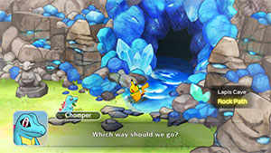
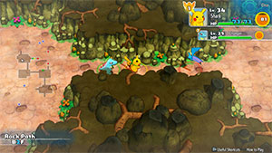

  

Optional dungeon you can challenge only if you wipe out in Lapis Cave or before you enter Mt. Blaze. There's a very high chance for a shop to generate on B4F, so the idea is to restock items here if needed. You just return to the location before you entered Rock Path after clearing it, and there's no reward.

# Overview

<table class="dungeonOverview">
  <tr>
    <th>Unlock</th>
    <td class="highlightYellow">Fail to clear Lapis Cave / Clear Lapis Cave.</td>
  </tr>
  <tr>
    <th>Vanishes</th>
    <td class="highlightYellow">After clearing Mt. Blaze.</td>
  </tr>
</table>

<table class="dungeonTable">
  <tr>
    <th>Floors</th>
    <td>B4F</td>
    <th>Job Rank</th>
    <td>-</td>
  </tr>
  <tr>
    <th>Radar / Scanning</th>
    <td>Yes</td>
    <th>Weather</th>
    <td>Clear</td>
  </tr>
  <tr>
    <th>Dark Halls</th>
    <td>No</td>
    <th>Boss</th>
    <td>None</td>
  </tr>
  <tr>
    <th>Max Team Size</th>
    <td>2</td>
    <th>Strong Foe</th>
    <td>None</td>
  </tr>
  <tr>
    <th>Bring Items</th>
    <td>Yes</td>
    <th>Shops</th>
    <td>Yes</td>
  </tr>
  <tr>
    <th>Bring Poke</th>
    <td>Yes</td>
    <th>Monster Houses</th>
    <td>No</td>
  </tr>
  <tr>
    <th>Level Reset</th>
    <td>No</td>
    <th>Mystery Houses</th>
    <td>No</td>
  </tr>
  <tr>
    <th>Clear Icon</th>
    <td>None</td>
    <th>Reward</th>
    <td>None</td>
  </tr>
</table>

# Needed Camps

- Cannot recruit pokemon in this dungeon.

# Pokemon

Rate = Recruit rate. Red stats = Stats as an enemy. Ability colors: Caution, Dangerous Move colors: Boosting, Destroys Items, Caution, Dangerous

#### Wild

|Floor|Image|Name|Rate|Lv|HP|Atk|Def|SpA|SpD|Spe|Exp|Ability + Moves|
|-|-|-|-|-|-|-|-|-|-|-|-|-|
|1-4||Pidgeot  |-|36|69 73|50 37|47 25|44 34|42 23|56 56|29|Keen Eye or Tangled Feet Hurricane / Sand Attack / Gust / Agility / Whirlwind / Twister / Feather Dance / Quick Attack / Tackle|
|1-4||Nidorina |-|19|54 75|30 38|30 24|30 31|27 22|31 31|30|Poison Point or Rivalry Poison Sting / Double Kick / Tail Whip / Scratch / Growl|
|1-4||Nidorino |-|19|54 76|34 36|30 24|30 30|27 22|34 34|31|Poison Point or Rivalry Peck / Focus Energy / Double Kick / Leer / Poison Sting|
|1-4 Rare||Zubat  |-|19|54 77|34 35|30 20|30 30|27 21|35 35|39|Inner Focus Absorb / Supersonic / Astonish / Bite / Wing Attack / Confuse Ray|

# Items

- No data.

# Traps

- No data.
