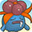

  

[Introduction]

# Overview

<table class="dungeonOverview">
  <tr>
    <th>Unlock</th>
    <td class="highlightYellow">Clear Sinister Woods.</td>
  </tr>
</table>

<table class="dungeonTable">
  <tr>
    <th>Floors</th>
    <td>B9F</td>
    <th>Job Rank</th>
    <td>E</td>
  </tr>
  <tr>
    <th>Radar / Scanning</th>
    <td>Yes</td>
    <th>Weather</th>
    <td>Clear</td>
  </tr>
  <tr>
    <th>Dark Halls</th>
    <td>No</td>
    <th>Boss</th>
    <td>None</td>
  </tr>
  <tr>
    <th>Max Team Size</th>
    <td>3</td>
    <th>Strong Foe</th>
    <td>Metagross</td>
  </tr>
  <tr>
    <th>Bring Items</th>
    <td>Yes</td>
    <th>Shops</th>
    <td>Yes</td>
  </tr>
  <tr>
    <th>Bring Poke</th>
    <td>Yes</td>
    <th>Monster Houses</th>
    <td>No</td>
  </tr>
  <tr>
    <th>Level Reset</th>
    <td>No</td>
    <th>Mystery Houses</th>
    <td>No</td>
  </tr>
  <tr>
    <th>Clear Icon</th>
    <td>None</td>
    <th>Reward</th>
    <td>Unlock Mt. Thunder</td>
  </tr>
</table>

# Needed Camps

#### Wild

|Name|Price|Pokemon|
|-|-|-|
|Wild Plains|-|Farfetch'd|
|Stump Forest|-|Weedle, Beedrill, Yanma, Dustox|
|Jungle|500|Gloom|
|Mt. Green|700|Teddiursa|
|Ravaged Field|700|Houndour|
|Magnetic Quarry|700|Metagross|
|Mushroom Forest|800|Paras|
|Tadpole Pond|900|Poliwag|
|Secretive Forest|900|Spinarak|
|Withering Desert|900|Trapinch|

#### Fainted

|Name|Price|Pokemon|
|-|-|-|
|Safari|600|Phanpy|
|Mt. Green|700|Gligar|
|Mt. Cleft|700|Larvitar|
|Frigid Cavern|800|Snorunt|
|Vibrant Forest|800|Stantler|
|Withering Desert|900|Cacnea|

# Pokemon

Rate = Recruit rate. Red stats = Stats as an enemy. Ability colors: Caution, Dangerous Move colors: Boosting, Destroys Items, Caution, Dangerous

#### Wild

|Floor|Image|Name|Rate|Lv|HP|Atk|Def|SpA|SpD|Spe|Exp|Ability + Moves|
|-|-|-|-|-|-|-|-|-|-|-|-|-|
|1-3||Teddiursa |14.4%|13|55 50|34 29|22 22|24 33|22 15|22|21|Pickup or Quick Feet Fling / Covet / Scratch / Fake Tears / Baby-Doll Eyes / Lick / Fury Swipes|
|1-6||Weedle  |14.4%|13|47 45|18 25|20 20|16 25|16 20|22|23|Shield Dust Poison Sting / String Shot / Bug Bite|
|1-9 Rare||Gloom  |14.4%|21|56 70|33 33|33 22|37 37|33 24|32|45|Chlorophyll Poison Powder / Sweet Scent / Acid / Absorb / Growth / Stun Spore / Sleep Powder / Mega Drain|
|1-9 Rare||Dustox  |14.4%|11|45 47|17 30|19 21|14 29|14 20|16|20|Shield Dust Gust|
|3-5 Rare||Farfetch'd  |14.4%|13|47 50|23 30|23 24|23 30|23 24|24|18|Keen Eye or Inner Focus Brave Bird / Poison Jab / Aerial Ace / Leer / Fury Cutter / Fury Attack / Peck / Knock Off / Sand Attack|
|4-6 Rare||Yanma  |14.4%|13|55 56|25 24|24 23|32 28|20 15|28|21|Speed Boost Tackle / Foresight / Quick Attack / Double Team|
|4-7||Poliwag |14.4%|13|49 65|23 28|22 18|20 27|20 18|28|36|Water Absorb or Damp Water Sport / Water Gun / Hypnosis / Bubble|
|5-9||Houndour  |14.4%|14|50 55|31 31|21 25|32 31|23 25|29|36|Early Bird or Flash Fire Leer / Ember / Howl / Smog / Roar|
|6 8-9 Foe|  |Metagross  |-6.4%|45|76 180|73 65|55 35|62 60|50 35|62|250|Clear Body Hammer Arm / Confusion / Metal Claw / Magnet Rise / Take Down / Agility / Pursuit / Miracle Eye / Zen Headbutt / Scary Face / Psychic / Bullet Punch / Meteor Mash ※ Friend Bow required to recruit. ※ Can Mega Evolve.|
|6-9||Paras  |14.4%|14|50 52|32 35|26 26|23 29|23 19|23|25|Effect Spore or Dry Skin Scratch / Stun Spore / Poison Powder / Absorb|
|7-9||Spinarak  |14.4%|14|50 50|31 26|23 17|23 26|23 17|23|23|Swarm or Insomnia Poison Sting / String Shot / Constrict / Absorb / Infestation / Scary Face|
|8-9||Beedrill  |14.4%|14|47 65|19 36|21 18|17 26|17 23|24|46|Swarm Twineedle / Fury Attack / Rage ※ Can Mega Evolve.|
|8-9||Trapinch |14.4%|14|47 55|29 37|21 25|21 30|21 18|24|24|Hyper Cutter or Arena Trap Sand Attack / Bite / Bulldoze / Bide / Mud-Slap / Feint Attack / Sand Tomb|

#### Fainted

|Image|Name|Lv|HP|Atk|Def|SpA|SpD|Spe|
|-|-|-|-|-|-|-|-|-|
||Phanpy |15|59|35|33|24|24|25|
||Gligar  |15|52|34|35|22|25|31|
||Stantler |15|44|35|35|25|29|26|
||Larvitar  |17|52|31|27|27|27|28|
||Cacnea |15|51|36|24|36|24|25|
||Snorunt |15|51|28|27|27|24|28|

# Items

#### Floor

|Name|Floors|Rate|
|-|-|-|
|Cover Band|1-9|0.553%|
|Defense Scarf|1-9|0.207%|
|Detect Band|1-9|0.138%|
|Efficient Bandanna|1-9|0.414%|
|Fickle Specs|1-9|0.138%|
|Gold Ribbon|1-9|0.0276%|
|Heal Ribbon|1-9|0.138%|
|Heavy Rotation Specs|1-9|0.138%|
|Joy Ribbon|1-9|0.138%|
|Lucky Ribbon|1-9|0.138%|
|Mach Ribbon|1-9|0.553%|
|Nullify Bandanna|1-9|0.276%|
|Power Band|1-9|0.207%|
|Prosper Ribbon|1-9|0.138%|
|Special Band|1-9|0.207%|
|Twist Band|1-9|0.138%|
|Zinc Band|1-9|0.207%|
|Apple|1-9|7.04%|
|Poke|1-9|56.3%|
|Max Ether|1-9|7.04%|
|Blast Seed|1-9|0.895%|
|Cheri Berry|1-9|0.895%|
|Chesto Berry|1-9|0.447%|
|Oran Berry|1-9|4.47%|
|Pecha Berry|1-9|2.24%|
|Rawst Berry|1-9|1.34%|
|Sleep Seed|1-9|0.895%|
|Stun Seed|1-9|0.447%|
|Tiny Reviver Seed|1-9|2.24%|
|Training Seed|1-9|0.224%|
|Gravelerock|1-9|11.7%|

#### Shop

|Name|Rate|
|-|-|
|Cover Band|0.997%|
|Defense Scarf|0.374%|
|Detect Band|0.25%|
|Efficient Bandanna|0.746%|
|Fickle Specs|0.25%|
|Gold Ribbon|0.0498%|
|Heal Ribbon|0.25%|
|Heavy Rotation Specs|0.25%|
|Joy Ribbon|0.25%|
|Lucky Ribbon|0.25%|
|Mach Ribbon|0.997%|
|Nullify Bandanna|0.498%|
|Power Band|0.374%|
|Prosper Ribbon|0.25%|
|Special Band|0.374%|
|Twist Band|0.25%|
|Zinc Band|0.374%|
|Apple|16.9%|
|All Power-Up Orb|0.69%|
|Foe-Hold Orb|2.06%|
|Foe-Seal Orb|1.38%|
|Nullify Orb|0.69%|
|Petrify Orb|0.69%|
|Quick Orb|0.69%|
|Rollcall Orb|0.69%|
|Slow Orb|0.69%|
|Slumber Orb|1.38%|
|Totter Orb|0.69%|
|Trawl Orb|0.345%|
|Wigglytuff Orb|6.9%|
|Max Ether|12.7%|
|Blast Seed|1.61%|
|Cheri Berry|1.61%|
|Chesto Berry|0.805%|
|Oran Berry|7.26%|
|Pecha Berry|3.23%|
|Rawst Berry|2.42%|
|Sleep Seed|1.61%|
|Stun Seed|0.805%|
|Tiny Reviver Seed|5.64%|
|Training Seed|0.404%|
|Gravelerock|21.2%|

#### Pretty Box

|Name|Rate|
|-|-|
|Bronze Dojo Ticket|30.8%|
|Oran Berry|11.5%|
|Calcium|0.689%|
|Carbos|0.689%|
|Iron|0.689%|
|Protein|0.689%|
|Rainbow Gummi|34.4%|
|Sitrus Berry|0.689%|
|Zinc|0.689%|
|(Random TM)|19.2%|

#### Deluxe Box

|Name|Rate|
|-|-|
|Gold Dojo Ticket|3.48%|
|Silver Dojo Ticket|13.9%|
|Reviver Seed|6.5%|
|Tiny Reviver Seed|6.5%|
|Calcium|0.934%|
|Carbos|0.934%|
|DX Gummi|23.3%|
|Iron|0.934%|
|Protein|0.934%|
|Rainbow Gummi|23.3%|
|Sitrus Berry|0.934%|
|Zinc|0.934%|
|(Random TM)|17.4%|

# Traps

|Name|
|-|
|Wonder Tile|
|Training Switch|
|Spin Trap|
|Slumber Trap|
|Spiky Trap|
|Blast Trap|
