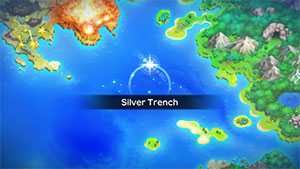
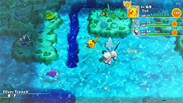

  

# Overview

<table class="dungeonOverview">
  <tr>
    <th>Unlock</th>
    <td class="highlightYellow">Recruit Articuno, Zapdos, Moltres → Clear Pitfall Valley → Talk to Alakazam → Visit Legendary Island Camp.</td>
  </tr>
</table>

<table class="dungeonTable">
  <tr>
    <th>Floors</th>
    <td>B99F</td>
    <th>Job Rank</th>
    <td>⭐︎⭐︎⭐︎</td>
  </tr>
  <tr>
    <th>Radar / Scanning</th>
    <td>No</td>
    <th>Weather</th>
    <td>Clear</td>
  </tr>
  <tr>
    <th>Dark Halls</th>
    <td>2 Tile</td>
    <th>Boss</th>
    <td>Lugia</td>
  </tr>
  <tr>
    <th>Max Team Size</th>
    <td>3</td>
    <th>Strong Foe</th>
    <td>None</td>
  </tr>
  <tr>
    <th>Bring Items</th>
    <td>Yes</td>
    <th>Shops</th>
    <td>No</td>
  </tr>
  <tr>
    <th>Bring Poke</th>
    <td>Yes</td>
    <th>Monster Houses</th>
    <td>Yes</td>
  </tr>
  <tr>
    <th>Level Reset</th>
    <td>No</td>
    <th>Mystery Houses</th>
    <td>Yes</td>
  </tr>
  <tr>
    <th>Clear Icon</th>
    <td></td>
    <th>Reward</th>
    <td>Lugia joins. Unlock Meteor Cave.</td>
  </tr>
</table>

Deep and tedious post-game sea type dungeon that features Lugia as a boss at the end. Unlike the originals, floor-wide Monster Houses are not guaranteed to generate in Rescue Team DX. Remember to bring food - Food items (including seeds and berries) can't be found on the ground. Shops never generate either, so your only hope for obtaining food in-dungeon is seeds from Sparkling Tiles, or apples from stepping on an Apple Trap or entering a Mystery House.

Enemies with instant-KO attacks include Krabby, Kingler, Spheal, Sealeo, Walrein, and Dewgong. Watch out for enemies with Hydro Pump in hallways - Hydro Pump pierces 10 tiles in a straight line. Hydro Pump users appear right away on 1F (Tentacool, Omanyte, Qwilfish), so if you struggle against those, it's probably best to use an Escape Orb and come back to the dungeon later once you've gotten stronger.

Rain or Hail doesn't naturally occur on any of the floors, but some enemies can change the weather: 

- Rain Dance - Slowpoke (6-14F), Slowbro (30-36F)
- Hail - Seel (6-14F), Spheal (10-19F), Sealeo (35-44F), Walrein (60-69F)

# Boss Strategy

#### Lugia (1597 HP) - Dragon Rush / Aeroblast / Extrasensory / Gust

- The boss has lower HP and doesn't know any support moves, so it should be on the easy side.
- Aeroblast hits 10 tiles in a straight line and pierces through targets, similar to Hydro Pump.

# Needed Camps

#### Wild

|Name|Price|Pokemon|
|-|-|-|
|Mystic Lake|2500|Dratini|
|Ice Floe Beach|6000|Seel, Dewgong, Spheal, Sealeo, Walrein|
|Poison Swamp|7000|Grimer, Muk|
|Bountiful Sea|9000|Tentacool, Tentacruel, Slowpoke, Slowbro, Slowking, Shellder, Cloyster, Staryu, Starmie|
|Evolution Forest|9000|Vaporeon|
|Shallow Beach|9000|Krabby, Kingler, Corsola, Wingull|
|Treasure Sea|9000|Horsea, Seadra, Kingdra, Remoraid, Octillery, Carvanha, Sharpedo, Anorith, Armaldo, Luvdisc|
|Deepsea Floor|9000|Omanyte, Omastar, Kabuto, Kabutops, Chinchou, Lanturn, Lileep, Cradily, Relicanth, Clamperl, Huntail, Gorebyss|
|Serene Sea|9000|Qwilfish, Wailmer|

#### Fainted

|Name|Price|Pokemon|
|-|-|-|
|Stump Forest|-|Weedle|
|Wild Plains|-|Ekans, Linoone|
|Sky-Blue Plains|-|Happiny, Snubbull, Girafarig|
|Darkness Ridge|-|Dusknoir|
|Jungle|500|Bellsprout|
|Flyaway Forest|500|Pidgey|
|Safari|600|Miltank, Rhyperior|
|Ravaged Field|700|Houndour|
|Mt. Cleft|700|Charmander|
|Mt. Discipline|700|Machop|
|Mt. Green|700|Cubone, Spinda|
|Scorched Plains|700|Cyndaquil, Torchic|
|Overgrown Forest|700|Treecko|
|Magnetic Quarry|700|Metang|
|Vibrant Forest|800|Pichu, Meowth, Mankey, Skitty|
|Secretive Forest|900|Venonat|
|Withering Desert|900|Flygon|
|Echo Cave|2700|Nosepass|
|Beau Plains|2700|Bulbasaur, Chikorita, Budew|
|Rub-a-Dub River|3000|Totodile|
|Dragon Cave|3000|Bagon|
|Turtleshell Pond|6000|Squirtle, Psyduck, Marill|
|Gourd Swamp|9000|Mudkip|
|Evolution Forest|9000|Eevee|
|Bountiful Sea|9000|Tentacool|
|Serene Sea|9000|Mantyke|
|Treasure Sea|9000|Anorith|

#### Mystery House

|Name|Price|Pokemon|
|-|-|-|
|Stump Forest|-|Beedrill|
|Darkness Ridge|-|Sneasel, Weavile|
|Jungle|500|Bellossom|
|Safari|600|Nidoqueen, Nidoking|
|Mt. Cleft|700|Tyranitar, Aggron|
|Overgrown Forest|700|Bonsly, Sudowoodo|
|Magnetic Quarry|700|Metagross|
|Mt. Discipline|700|Riolu, Lucario|
|Vibrant Forest|800|Munchlax, Slaking|
|Mushroom Forest|800|Shiftry|
|Tadpole Pond|900|Politoed, Ludicolo|
|Echo Cave|2700|Crobat|
|Decrepit Lab|6000|Alakazam, Mime Jr., Mr. Mime, Porygon-Z|
|Bountiful Sea|9000|Slowking|
|Treasure Sea|9000|Kingdra|

# Pokemon

Rate = Recruit rate. Red stats = Stats as an enemy. Ability colors: Caution, Dangerous Move colors: Boosting, Destroys Items, Caution, Dangerous

#### Wild

|Floor|Image|Name|Rate|Lv|HP|Atk|Def|SpA|SpD|Spe|Exp|Ability + Moves|
|-|-|-|-|-|-|-|-|-|-|-|-|-|
|1-5||Wingull  |8.2%|60|88 155|64 70|60 64|73 81|55 58|80 91|150|Keen Eye or Hydration Growl / Water Gun / Supersonic / Wing Attack / Water Pulse / Roost / Quick Attack / Air Cutter / Pursuit / Mist / Aerial Ace / Agility / Air Slash / Hurricane|
|1-8||Shellder |8.2%|60|83 152|83 90|85 89|73 80|50 53|91 111|150|Shell Armor or Skill Link Tackle / Water Gun / Protect / Brine / Supersonic / Icicle Spear / Withdraw / Whirlpool / Ice Shard / Razor Shell / Aurora Beam / Leer / Ice Beam / Clamp / Iron Defense / Shell Smash|
|1-9||Tentacool  |8.2%|60|88 160|73 80|55 59|73 80|70 73|94 114|160|Clear Body or Liquid Ooze Poison Sting / Supersonic / Acid / Toxic Spikes / Bubble Beam / Wrap / Constrict / Water Pulse / Acid Spray / Screech / Poison Jab / Hydro Pump / Barrier / Sludge Wave / Wring Out / Hex / Brine|
|1-9||Omanyte  |8.2%|60|88 153|64 70|70 74|91 100|55 58|77 88|153|Swift Swim or Shell Armor Constrict / Withdraw / Bite / Rollout / Water Gun / Leer / Mud Shot / Brine / Hydro Pump / Shell Smash / Protect / Rock Blast / Ancient Power / Tickle|
|1-9||Qwilfish  |8.2%|60|88 165|83 90|55 59|64 70|50 53|113 133|165|Poison Point or Swift Swim Toxic Spikes / Hydro Pump / Spikes / Destiny Bond / Minimize / Aqua Tail / Fell Stinger / Harden / Tackle / Brine / Bubble / Rollout / Revenge / Spit Up / Stockpile / Water Gun / Poison Sting / Take Down / Pin Missile / Poison Jab|
|5-13||Kabuto  |8.2%|60|88 165|91 100|70 74|64 71|55 58|91 111|195|Swift Swim or Battle Armor Scratch / Harden / Absorb / Endure / Mud Shot / Sand Attack / Aqua Jet / Leer / Mega Drain / Metal Sound / Ancient Power / Wring Out|
|5-13||Corsola  |8.2%|60|83 156|64 70|60 64|64 71|60 63|74 85|166|Hustle or Natural Cure Tackle / Endure / Bubble / Recover / Rock Blast / Refresh / Ancient Power / Bubble Beam / Spike Cannon / Brine / Lucky Chant / Iron Defense / Harden / Flail / Aqua Ring / Mirror Coat / Power Gem / Earth Power|
|6-14||Seel |10.8%|60|94 168|73 80|60 64|64 70|60 63|110 130|178|Thick Fat or Hydration Headbutt / Growl / Aqua Tail / Rest / Encore / Ice Shard / Dive / Aqua Jet / Aqua Ring / Aurora Beam / Icy Wind / Brine / Take Down / Water Sport / Ice Beam / Safeguard / Hail|
|6-14||Slowpoke  |8.2%|60|94 175|73 80|70 74|83 90|55 58|95 115|185|Oblivious or Own Tempo Confusion / Curse / Yawn / Disable / Headbutt / Growl / Tackle / Amnesia / Water Gun / Water Pulse / Slack Off / Zen Headbutt / Psychic / Heal Pulse / Psych Up / Rain Dance|
|10-19||Remoraid |8.2%|60|88 160|83 90|55 59|83 90|55 58|77 88|170|Hustle or Sniper Signal Beam / Lock-On / Hydro Pump / Bubble Beam / Water Gun / Psybeam / Water Pulse / Ice Beam / Bullet Seed / Focus Energy / Aurora Beam / Soak / Hyper Beam|
|10-19||Spheal  |8.2%|60|94 165|71 80|55 59|80 90|55 58|88 108|175|Thick Fat or Ice Body Defense Curl / Powder Snow / Growl / Water Gun / Rollout / Encore / Brine / Aurora Beam / Body Slam / Blizzard / Sheer Cold / Snore / Hail / Ice Ball / Rest|
|10-20||Horsea |8.2%|60|86 155|79 90|60 64|83 90|50 53|113 133|165|Swift Swim or Sniper Bubble / Smokescreen / Water Gun / Leer / Twister / Bubble Beam / Brine / Focus Energy / Agility / Hydro Pump / Dragon Pulse / Dragon Dance|
|14-23||Anorith  |8.2%|60|88 156|91 100|60 64|64 70|55 58|88 108|166|Battle Armor Scratch / Harden / Mud Sport / Slash / Water Gun / Fury Cutter / Crush Claw / Smack Down / Metal Claw / Bug Bite / Protect / X-Scissor / Ancient Power / Brine / Rock Blast|
|15-24||Krabby |8.2%|60|83 158|100 110|70 74|55 60|50 53|91 111|200|Hyper Cutter or Shell Armor Mud Sport / Bubble / Vise Grip / Leer / Harden / Bubble Beam / Mud Shot / Metal Claw / Stomp / Protect / Slam / Guillotine / Brine / Crabhammer / Flail|
|15-25||Staryu |8.2%|60|88 157|73 80|60 64|83 90|60 63|116 136|168|Illuminate or Natural Cure Tackle / Swift / Water Gun / Psywave / Rapid Spin / Recover / Harden / Brine / Power Gem / Camouflage / Minimize / Gyro Ball / Reflect Type / Hydro Pump / Confuse Ray / Psychic / Light Screen / Cosmic Power / Bubble Beam|
|20-29||Grimer |10.8%|60|94 163|83 90|55 59|64 70|60 63|88 108|180|Stench or Sticky Hold Screech / Fling / Harden / Mud-Slap / Mud Bomb / Minimize / Poison Gas / Pound / Sludge Bomb / Sludge Wave / Gunk Shot / Acid Armor / Memento / Sludge / Belch / Disable|
|20-29||Omastar  |8.2%|60|88 164|64 70|70 74|91 100|55 58|77 88|194|Swift Swim or Shell Armor Constrict / Withdraw / Brine / Rollout / Hydro Pump / Leer / Mud Shot / Bite / Ancient Power / Protect / Water Gun / Spike Cannon / Tickle / Rock Blast|
|20 30 50 60 70 80||Vaporeon |8.2%|60|99 195|64 70|55 59|83 91|60 63|110 111|200|Water Absorb Water Gun / Water Pulse / Last Resort / Haze / Quick Attack / Baby-Doll Eyes / Muddy Water / Helping Hand / Tackle / Aurora Beam / Acid Armor / Tail Whip / Sand Attack / Aqua Ring / Hydro Pump|
|25-34||Kabutops  |8.2%|60|88 166|91 100|70 74|64 71|55 58|91 121|200|Swift Swim or Battle Armor Slash / Scratch / Feint / Night Slash / Mud Shot / Absorb / Leer / Aqua Jet / Sand Attack / Endure / Metal Sound / Harden / Mega Drain / Ancient Power|
|26-35||Kingler |8.2%|60|83 167|100 110|70 74|55 60|50 53|91 111|199|Hyper Cutter or Shell Armor Mud Sport / Bubble / Vise Grip / Leer / Protect / Bubble Beam / Metal Claw / Mud Shot / Guillotine / Wide Guard / Brine / Stomp / Slam / Crabhammer / Harden|
|30-36||Slowbro  |8.2%|60|94 186|73 80|70 74|83 90|55 58|95 115|175|Oblivious or Own Tempo Curse / Tackle / Yawn / Zen Headbutt / Amnesia / Slack Off / Disable / Growl / Water Gun / Water Pulse / Confusion / Heal Pulse / Withdraw / Rain Dance / Psychic / Headbutt ※ Can Mega Evolve.|
|30-39||Seadra |8.2%|60|86 172|79 90|60 64|83 90|50 53|113 133|165|Poison Point or Sniper Bubble / Smokescreen / Water Gun / Leer / Twister / Bubble Beam / Brine / Focus Energy / Hydro Pump / Agility / Dragon Pulse / Dragon Dance|
|30-39||Carvanha  |8.2%|60|88 160|91 100|50 54|83 90|50 53|104 124|200|Rough Skin Leer / Agility / Rage / Focus Energy / Aqua Jet / Assurance / Bite / Crunch / Swagger / Ice Fang / Poison Fang / Scary Face / Screech / Take Down|
|35-44||Tentacruel  |8.2%|60|88 169|73 80|55 59|73 80|70 73|94 114|175|Clear Body or Liquid Ooze Reflect Type / Wring Out / Poison Jab / Supersonic / Constrict / Acid / Brine / Toxic Spikes / Wrap / Water Pulse / Acid Spray / Bubble Beam / Barrier / Poison Sting / Screech / Hydro Pump / Hex / Sludge Wave|
|35-44||Starmie  |8.2%|60|88 172|73 80|60 64|83 90|60 63|116 136|175|Illuminate or Natural Cure Spotlight / Water Gun / Hydro Pump / Rapid Spin / Recover / Confuse Ray / Swift|
|35-44||Armaldo  |8.2%|60|88 173|91 100|60 64|64 70|55 58|88 108|205|Battle Armor Scratch / Harden / Mud Sport / Slash / Water Gun / Fury Cutter / Crush Claw / Smack Down / Metal Claw / Bug Bite / Protect / Ancient Power / X-Scissor / Brine|
|35-44||Sealeo  |8.2%|60|94 180|71 80|55 59|80 90|55 58|88 108|185|Thick Fat or Ice Body Defense Curl / Powder Snow / Growl / Water Gun / Rollout / Encore / Brine / Aurora Beam / Body Slam / Swagger / Rest / Snore / Hail / Ice Ball / Blizzard / Sheer Cold|
|41-50||Wailmer |8.2%|60|104 195|83 90|50 54|73 80|50 53|77 87|180|Water Veil or Oblivious Splash / Growl / Water Gun / Rollout / Whirlpool / Astonish / Water Pulse / Mist / Brine / Rest / Amnesia / Dive / Bounce / Water Spout / Heavy Slam / Hydro Pump|
|45-54||Luvdisc |8.2%|60|83 162|55 60|55 59|55 60|55 58|94 114|165|Swift Swim Tackle / Charm / Water Gun / Flail / Charm / Draining Kiss / Water Pulse / Lucky Chant / Attract / Sweet Kiss / Aqua Ring / Take Down / Captivate / Soak / Heart Stamp / Hydro Pump / Safeguard|
|50-59||Dratini |8.2%|60|91 163|96 110|55 59|79 91|55 58|91 111|197|Shed Skin Wrap / Leer / Thunder Wave / Slam / Dragon Tail / Dragon Rage / Agility / Aqua Tail / Twister / Dragon Rush / Safeguard / Dragon Dance / Outrage|
|50-59||Slowking  |8.2%|60|94 175|73 80|70 74|83 90|55 58|95 105|187|Oblivious or Own Tempo Swagger / Headbutt / Curse / Yawn / Power Gem / Water Pulse / Growl / Heal Pulse / Water Gun / Confusion / Disable / Hidden Power / Nasty Plot / Tackle / Zen Headbutt / Psych Up / Psychic / Trump Card|
|55-64||Dewgong  |8.2%|60|94 170|73 80|60 64|64 70|60 63|110 130|180|Thick Fat or Hydration Encore / Growl / Signal Beam / Brine / Rest / Ice Shard / Aqua Jet / Icy Wind / Headbutt / Aurora Beam / Aqua Ring / Take Down / Sheer Cold / Aqua Tail / Dive / Ice Beam|
|55-64||Octillery |8.2%|60|88 175|83 90|55 59|83 90|55 58|77 118|185|Suction Cups or Sniper Signal Beam / Gunk Shot / Rock Blast / Hyper Beam / Hydro Pump / Constrict / Wring Out / Aurora Beam / Water Gun / Focus Energy / Octazooka / Psybeam / Bullet Seed / Ice Beam / Bubble Beam|
|60-69||Muk |8.2%|60|94 171|83 90|55 59|64 70|60 63|88 108|181|Stench or Sticky Hold Venom Drench / Pound / Poison Gas / Harden / Mud-Slap / Disable / Sludge / Mud Bomb / Minimize / Sludge Bomb / Screech / Sludge Wave / Gunk Shot / Fling / Acid Armor / Belch / Memento|
|60-69||Sharpedo  |8.2%|60|88 180|91 100|50 54|83 90|50 53|104 124|200|Rough Skin Rage / Leer / Bite / Ice Fang / Crunch / Scary Face / Slash / Feint / Aqua Jet / Swagger / Night Slash / Assurance / Focus Energy / Screech / Skull Bash / Agility / Poison Fang / Taunt ※ Can Mega Evolve.|
|60-69||Walrein  |8.2%|60|94 164|71 80|55 59|80 90|55 58|88 127|190|Thick Fat or Ice Body Defense Curl / Powder Snow / Growl / Water Gun / Rollout / Encore / Brine / Aurora Beam / Body Slam / Swagger / Rest / Snore / Hail / Ice Ball / Crunch / Ice Fang / Blizzard / Sheer Cold|
|65-79||Clamperl |8.2%|60|83 165|83 90|70 74|83 90|55 58|88 108|195|Shell Armor Iron Defense / Water Gun / Whirlpool / Clamp / Shell Smash|
|70-79||Chinchou  |1.6%|60|99 174|64 70|55 59|73 81|55 58|91 111|175|Volt Absorb or Illuminate Bubble / Supersonic / Thunder Wave / Electro Ball / Water Gun / Spark / Flail / Confuse Ray / Bubble Beam / Charge / Discharge / Signal Beam / Aqua Ring / Hydro Pump / Ion Deluge / Take Down|
|70-79||Kingdra  |8.2%|60|86 174|79 90|60 64|83 90|50 53|113 133|180|Swift Swim or Sniper Leer / Bubble / Smokescreen / Yawn / Water Gun / Twister / Bubble Beam / Focus Energy / Agility / Hydro Pump / Brine / Dragon Pulse / Dragon Dance|
|71-79||Gorebyss |1.6%|60|83 173|83 80|70 74|83 100|55 58|88 108|200|Swift Swim Whirlpool / Confusion / Water Sport / Draining Kiss / Agility / Water Pulse / Aqua Tail / Aqua Ring / Captivate / Dive / Baton Pass / Psychic / Coil / Amnesia / Hydro Pump|
|80-89||Cloyster  |1.6%|60|83 172|83 90|85 89|73 80|50 53|91 111|190|Shell Armor or Skill Link Toxic Spikes / Shell Smash / Spikes / Withdraw / Aurora Beam / Supersonic / Protect / Icicle Crash / Spike Cannon / Hydro Pump|
|80-89||Lileep  |1.6%|60|94 171|73 80|60 64|73 80|60 63|85 105|175|Suction Cups Astonish / Constrict / Confuse Ray / Acid / Ancient Power / Giga Drain / Ingrain / Gastro Acid / Energy Ball / Brine / Amnesia / Wring Out / Spit Up / Stockpile / Swallow|
|80-89||Relicanth  |1.6%|60|94 180|83 90|75 79|55 60|55 58|77 88|189|Swift Swim or Rock Head Flail / Head Smash / Water Gun / Dive / Tackle / Mud Sport / Ancient Power / Harden / Hydro Pump / Double-Edge / Yawn / Rest / Rock Tomb / Take Down|
|90-98||Lanturn  |1.6%|60|99 200|64 70|55 59|73 81|55 58|91 111|196|Volt Absorb or Illuminate Bubble / Supersonic / Thunder Wave / Electro Ball / Water Gun / Spark / Flail / Confuse Ray / Bubble Beam / Charge / Discharge / Signal Beam / Aqua Ring / Hydro Pump / Ion Deluge / Swallow / Eerie Impulse / Spit Up / Take Down / Stockpile / Spotlight|
|90-98||Cradily  |1.6%|60|94 170|73 80|60 64|73 80|60 63|85 105|187|Suction Cups Astonish / Constrict / Confuse Ray / Acid / Ancient Power / Giga Drain / Ingrain / Gastro Acid / Energy Ball / Brine / Amnesia / Wring Out / Spit Up / Stockpile / Swallow|
|90-98||Huntail |1.6%|60|83 160|83 90|70 74|83 90|55 58|88 108|200|Swift Swim Whirlpool / Screech / Sucker Punch / Bite / Coil / Feint Attack / Crunch / Scary Face / Water Pulse / Ice Fang / Brine / Dive / Baton Pass / Aqua Tail / Hydro Pump|

#### Boss

|Floor|Image|Name|Rate|Lv|HP|Atk|Def|SpA|SpD|Spe|Exp|Ability + Moves|
|-|-|-|-|-|-|-|-|-|-|-|-|-|
|99||Lugia  |100%|65|97 1597|86 96|77 87|76 91|77 92|107 107|0|Pressure Dragon Rush / Aeroblast / Extrasensory / Gust|

#### Fainted

|Image|Name|Lv|HP|Atk|Def|SpA|SpD|Spe|
|-|-|-|-|-|-|-|-|-|
||Bulbasaur  |62|91|75|58|84|59|106|
||Charmander |62|91|75|58|84|58|107|
||Squirtle |62|89|73|63|73|57|92|
||Weedle  |62|88|80|51|55|46|99|
||Pidgey  |62|89|73|56|64|51|95|
||Ekans |62|89|74|56|65|56|105|
||Venonat  |62|89|65|56|74|56|117|
||Meowth |?|?|?|?|?|?|?|
||Psyduck |62|89|74|56|84|56|108|
||Mankey |62|89|84|56|65|56|108|
||Machop |62|95|103|58|66|58|94|
||Bellsprout  |?|?|?|?|?|?|?|
||Tentacool  |62|89|74|56|74|71|98|
||Cubone |62|89|72|67|56|56|91|
||Eevee |62|100|65|56|84|61|114|
||Chikorita |62|89|73|61|73|56|92|
||Cyndaquil |62|91|75|58|84|58|97|
||Totodile |62|89|84|62|73|58|102|
||Pichu |62|98|82|57|97|56|113|
||Marill  |62|93|63|51|63|51|108|
||Girafarig  |64|91|76|57|76|56|102|
||Snubbull |?|?|?|?|?|?|?|
||Houndour  |62|89|84|51|84|56|98|
||Miltank |62|95|74|76|56|61|117|
||Treecko |62|91|76|54|85|59|88|
||Torchic |62|91|93|58|84|58|104|
||Mudkip |62|96|94|62|76|62|82|
||Linoone |62|89|74|56|56|56|98|
||Nosepass |62|89|65|76|74|76|108|
||Skitty |62|89|73|61|73|56|92|
||Spinda |62|89|65|56|65|56|92|
||Flygon  |62|88|82|51|72|51|95|
||Anorith  |?|?|?|?|?|?|?|
||Bagon |64|95|103|62|84|51|96|
||Metang  |64|91|102|62|84|56|96|
||Budew  |62|88|73|51|92|56|105|
||Happiny |?|?|?|?|?|?|?|
||Mantyke  |62|89|56|56|74|76|114|
||Rhyperior  |64|101|104|72|66|51|93|
||Dusknoir |64|86|84|77|66|71|112|

#### Mystery House

|Image|Name|Image|Name|Image|Name|Image|Name|Image|Name|
|-|-|-|-|-|-|-|-|-|-|
||Beedrill  ||Nidoqueen  ||Nidoking  ||Crobat  ||Bellossom |
||Politoed ||Alakazam ||Slowking  ||Kingdra  ||Mime Jr.  |
||Mr. Mime  ||Porygon-Z ||Munchlax ||Bonsly ||Sudowoodo |
||Sneasel  ||Weavile  ||Tyranitar  ||Ludicolo  ||Shiftry  |
||Slaking ||Aggron  ||Metagross  ||Riolu ||Lucario  |

# Items

#### Floor

|Name|Rate|
|-|-|
|Big Eater Belt|0.327%|
|Cover Band|1.31%|
|Efficient Bandanna|1.31%|
|Goggle Specs|0.327%|
|Gold Ribbon|0.0327%|
|Heal Ribbon|0.327%|
|Insomniscope|0.327%|
|Joy Ribbon|0.327%|
|Munch Belt|0.327%|
|Nullify Bandanna|0.655%|
|Pecha Scarf|0.327%|
|Persim Band|0.327%|
|Recovery Scarf|0.327%|
|Scope Lens|0.327%|
|Sneak Scarf|0.327%|
|Stamina Band|0.327%|
|Weather Band|0.327%|
|X-Ray Specs|0.327%|
|Poke|69.1%|
|All Dodge Orb|0.538%|
|All Power-Up Orb|0.538%|
|All Protect Orb|0.538%|
|Decoy Orb|0.538%|
|Drought Orb|0.538%|
|Escape Orb|1.08%|
|Foe-Hold Orb|1.61%|
|Foe-Seal Orb|1.08%|
|Health Orb|0.538%|
|Helper Orb|0.538%|
|Inviting Orb|0.538%|
|Lasso Orb|0.538%|
|Nullify Orb|0.538%|
|One-Room Orb|0.538%|
|Petrify Orb|0.538%|
|Quick Orb|0.538%|
|Rare Quality Orb|0.538%|
|Reset Orb|0.538%|
|Revive All Orb|0.538%|
|Rollcall Orb|0.538%|
|Slow Orb|0.538%|
|Slumber Orb|1.08%|
|Storage Orb|0.538%|
|Totter Orb|0.538%|
|Trawl Orb|0.269%|
|Weather Lock Orb|0.538%|
|Max Ether|6.58%|

# Traps

|Name|
|-|
|Wonder Tile|
|Training Switch|
|Grudge Trap|
|Sticky Trap|
|Trip Trap|
|Big Blast Trap|
|Poison Trap|
|Blast Trap|
|Hunger Trap|
|Seal Trap|
|Grimy Trap|
|Random Trap|
|Summon Trap|
|Apple Trap|
|Warp Trap|
|PP Leech Trap|
