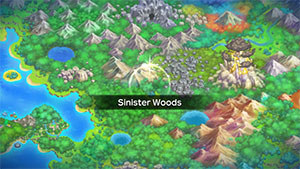
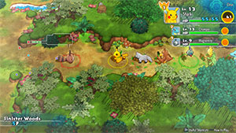

  

# Overview

<table class="dungeonOverview">
  <tr>
    <th>Unlock</th>
    <td class="highlightYellow">Clear Mt. Steel → 3 days later.</td>
  </tr>
</table>

<table class="dungeonTable">
  <tr>
    <th>Floors</th>
    <td>13F</td>
    <th>Job Rank</th>
    <td>F</td>
  </tr>
  <tr>
    <th>Radar / Scanning</th>
    <td>Yes</td>
    <th>Weather</th>
    <td>Clear</td>
  </tr>
  <tr>
    <th>Dark Halls</th>
    <td>No</td>
    <th>Boss</th>
    <td>Team Meanies</td>
  </tr>
  <tr>
    <th>Max Team Size</th>
    <td>3</td>
    <th>Strong Foe</th>
    <td>Ampharos</td>
  </tr>
  <tr>
    <th>Bring Items</th>
    <td>Yes</td>
    <th>Shops</th>
    <td>Yes</td>
  </tr>
  <tr>
    <th>Bring Poke</th>
    <td>Yes</td>
    <th>Monster Houses</th>
    <td>No</td>
  </tr>
  <tr>
    <th>Level Reset</th>
    <td>No</td>
    <th>Mystery Houses</th>
    <td>No</td>
  </tr>
  <tr>
    <th>Clear Icon</th>
    <td>None</td>
    <th>Reward</th>
    <td>Unlock Silent Chasm</td>
  </tr>
</table>

Dungeon where you can find Big Apples, and a boss fight against 3 Pokemon appears at the end. If you want an easier boss fight, you can recruit a Sableye using [Wonder Mail](/system/wonder-mail) and add it to your team. Otherwise, try to recruit guest party members before the boss to gain a numbers advantage. Blast Seeds are particularly effective against Ekans and Medicham due to their low HP.

# Boss Strategy

#### Gengar (298 HP) - Shadow Punch / Hypnosis / Night Shade / Lick

- Gengar's Cursed Body ability can seal your move, so consider using a weaker move first when attacking.
- Unlike the originals, Ground type attacks are super effective since Gengar no longer has Levitate.

#### Ekans (149 HP) - Wrap / Leer / Poison Sting / Bite

- Status conditions are not very effective against Ekans thanks to their boss properties + Shed Skin.

#### Medicham (149 HP) - Zen Headbutt / Meditate / Confusion / Feint

- Medicham can boost their attack via Meditate, so try to defeat them quickly.

# Needed Camps

#### Wild

|Name|Price|Pokemon|
|-|-|-|
|Wild Plains|-|Linoone|
|Stump Forest|-|Ledyba, Silcoon, Cascoon|
|Jungle|500|Oddish, Exeggutor, Sunflora|
|Flyaway Forest|500|Hoothoot|
|Thunder Crag|600|Sentret, Ampharos|
|Overgrown Forest|700|Scyther, Bonsly, Sudowoodo|
|Vibrant Forest|800|Slakoth|
|Mushroom Forest|800|Shroomish|
|Frigid Cavern|800|Swinub|

#### Fainted

|Name|Price|Pokemon|
|-|-|-|
|Stump Forest|-|Yanma|
|Wild Plains|-|Farfetch'd, Poochyena|
|Mt. Green|700|Teddiursa|
|Scorched Plains|700|Growlithe|
|Mushroom Forest|800|Paras|
|Crater|5000|Magby|

# Pokemon

Rate = Recruit rate. Red stats = Stats as an enemy. Ability colors: Caution, Dangerous Move colors: Boosting, Destroys Items, Caution, Dangerous

#### Wild

|Floor|Image|Name|Rate|Lv|HP|Atk|Def|SpA|SpD|Spe|Exp|Ability + Moves|
|-|-|-|-|-|-|-|-|-|-|-|-|-|
|1-3||Swinub  |14.4%|11|50 48|25 24|21 18|18 24|18 18|21 21|18|Oblivious or Snow Cloak Powder Snow / Odor Sleuth / Mud Sport / Mud-Slap / Tackle|
|1-4||Oddish  |14.4%|11|47 45|20 25|20 17|23 31|20 18|19 19|19|Chlorophyll Absorb / Growth / Sweet Scent / Acid|
|1-4||Sudowoodo |14.4%|12|48 47|28 31|28 24|15 24|20 20|19 19|23|Sturdy or Rock Head Slam / Wood Hammer / Copycat / Flail / Low Kick / Rock Throw ※ Doesn't act unless you approach.|
|2-8||Sunflora |14.4%|12|48 54|22 29|20 20|25 36|21 21|20 20|23|Chlorophyll or Solar Power Flower Shield / Absorb / Pound / Growth / Ingrain / Grass Whistle / Mega Drain|
|3-6||Sentret |14.4%|11|47 48|21 25|19 21|17 35|17 20|20 20|22|Run Away or Keen Eye Scratch / Foresight / Defense Curl / Quick Attack|
|3 7-9 11-12 Foe|  |Ampharos |-6.4%|30|65 177|45 62|45 32|50 62|45 32|47 47|210|Static Thunder Punch / Zap Cannon / Tackle / Ion Deluge / Dragon Pulse / Fire Punch / Cotton Spore / Charge / Take Down / Electro Ball / Confuse Ray / Magnetic Flux Growl / Thunder Wave / Thunder Shock ※ Friend Bow required to recruit. ※ Can Mega Evolve.|
|4-6 Rare||Silcoon |14.4%|12|46 47|18 25|18 14|15 25|15 14|18 18|16|Shed Skin Harden ※ Doesn't move.|
|4-6 Rare||Cascoon |14.4%|11|45 43|17 23|19 13|14 23|14 13|16 16|15|Shed Skin Harden ※ Doesn't move.|
|5-12||Bonsly |8.2%|12|48 55|28 21|28 20|15 25|20 20|19 23|23|Sturdy or Rock Head Fake Tears / Copycat / Flail / Low Kick / Rock Throw ※ Bonsly Statue required to spawn.|
|6-12||Shroomish |14.4%|11|49 45|28 29|22 22|19 27|20 23|21 21|24|Effect Spore or Poison Heal Absorb / Tackle / Stun Spore / Leech Seed|
|7-9||Ledyba  |14.4%|11|45 49|16 27|17 16|19 25|25 16|23 23|30|Swarm or Early Bird Tackle / Supersonic / Swift ※ Spawns in sleeping groups of 4.|
|7-9||Linoone |14.4%|20|55 46|34 35|31 19|27 31|31 20|37 37|25|Pickup or Gluttony Play Rough / Rototiller / Switcheroo / Tackle / Growl / Tail Whip / Sand Attack / Headbutt / Odor Sleuth / Mud Sport / Fury Swipes|
|7-12||Exeggutor  |14.4%|12|53 53|26 27|25 24|29 39|20 20|21 21|28|Chlorophyll Seed Bomb / Barrage / Hypnosis / Stomp / Confusion|
|7-12||Scyther  |14.4%|11|49 65|33 41|23 20|20 31|20 20|26 26|30|Swarm or Technician Vacuum Wave / Quick Attack / Pursuit / Focus Energy / Leer|
|7-12||Hoothoot  |14.4%|11|52 52|19 29|17 13|21 31|21 15|22 22|30|Insomnia or Keen Eye Tackle / Growl / Foresight / Hypnosis / Peck / Confusion|
|10-12||Slakoth |14.4%|11|49 56|22 26|22 14|19 32|17 12|22 22|12|Truant Scratch / Yawn / Encore / Slack Off ※ Spawns sleeping.|

#### Boss

|Floor|Image|Name|Rate|Lv|HP|Atk|Def|SpA|SpD|Spe|Exp|Ability + Moves|
|-|-|-|-|-|-|-|-|-|-|-|-|-|
|13||Gengar  |-|15|48 298|24 24|22 22|37 37|22 22|30 30|0|Cursed Body Shadow Punch / Hypnosis / Night Shade / Lick ※ First clear.|
|13||Ekans |-|13|49 149|25 25|22 22|22 22|22 22|25 25|0|Shed Skin Wrap / Leer / Poison Sting / Bite ※ First clear.|
|13||Medicham  |-|13|49 149|22 22|23 23|22 22|22 22|25 25|0|Pure Power Zen Headbutt / Meditate / Confusion / Feint ※ First clear.|

#### Fainted

|Image|Name|Lv|HP|Atk|Def|SpA|SpD|Spe|
|-|-|-|-|-|-|-|-|-|
||Paras  |13|49|30|25|22|22|21|
||Growlithe |13|53|32|24|29|22|26|
||Farfetch'd  |13|47|23|23|23|23|24|
||Yanma  |13|55|25|24|32|20|28|
||Teddiursa |13|55|34|22|24|22|22|
||Magby |15|51|34|24|33|27|31|
||Poochyena |13|49|29|22|20|20|24|

# Items

#### Floor

|Name|Floors|Rate|
|-|-|-|
|Apple|1-12|7.0%|
|Big Apple|1-12|7.0%|
|Poke|1-12|55.8%|
|Max Ether|1-12|6.98%|
|Blast Seed|1-12|1.28%|
|Cheri Berry|1-12|1.28%|
|Oran Berry|1-12|6.42%|
|Pecha Berry|1-12|3.2%|
|Rawst Berry|1-12|1.92%|
|Sleep Seed|1-12|1.28%|
|Tiny Reviver Seed|1-12|3.2%|
|Confuse Wand|1-12|1.24%|
|Petrify Wand|1-12|1.24%|
|Slow Wand|1-12|1.24%|
|Slumber Wand|1-12|0.618%|
|Tunnel Wand|1-12|0.31%|

#### Shop

|Name|Rate|
|-|-|
|Apple|9.4%|
|Big Apple|9.4%|
|All Power-Up Orb|1.02%|
|Foe-Hold Orb|3.05%|
|Foe-Seal Orb|2.04%|
|Nullify Orb|1.02%|
|Petrify Orb|1.02%|
|Quick Orb|1.02%|
|Rollcall Orb|1.02%|
|Slow Orb|1.02%|
|Slumber Orb|2.04%|
|Totter Orb|1.02%|
|Trawl Orb|0.51%|
|Wigglytuff Orb|10.2%|
|Max Ether|18.8%|
|Blast Seed|2.59%|
|Cheri Berry|2.59%|
|Oran Berry|11.6%|
|Pecha Berry|5.18%|
|Rawst Berry|3.86%|
|Sleep Seed|2.59%|
|Tiny Reviver Seed|9.04%|

# Traps

|Name|
|-|
|Wonder Tile|
|Training Switch|
|Spin Trap|
|Slumber Trap|
|Spiky Trap|
