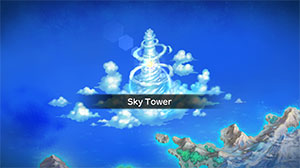
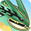

  

The final dungeon of the main story which features a variety of weather effects and some meaner enemies. Ghost types and Levitate users appear, so starters like Cubone, Eevee, Meowth, and Skitty can have a harder time. If possible, bring a team member that has the Steamroll Rare Quality to alleviate type disadvantage issues. Otherwise, you could use TMs to learn moves that can damage Ghost types, or just throw projectiles. Dusclops (19-27F) and Aerodactyl (22-31F) both have the Pressure ability, so bring lots of Max Ethers. Forretress (1-6F) can know Bug Bite, so don't let it eat valuable apples, Oran Berries, Tiny Reviver Seeds, etc.

Otherwise, you'll want to be careful around room-wide and ranged attackers. Room-wide attackers include Masquerain (1-8F), Ledian (12-20F), Venomoth (21-27F), and Flygon (25-31F). Ranged attackers include Weezing (8-16F), Altaria (12-20F), Tropius (25-32F), Claydol (31-33F), and Salamence (31-33F). Also be careful around Pursuit users when you have a bad status - Duskull, Dusclops, Scizor, Metagross.

There's a checkpoint during the first clear between 25F and 26F, and Rayquaza appears as a boss on 34F. Damage dealt to Rayquaza carries forward even if you wipe out, so you'll eventually win if you just keep trying. Rayquaza's Hyper Beam pierces 10 tiles ahead and is 3 tiles wide, and Twister is also a wide-area attack. Therefore, try to split up instead of staying in a group to avoid the entire party taking damage. Unlike the DS version, orbs are effective during boss fights in this game.

# Overview

<table class="dungeonOverview">
  <tr>
    <th>Unlock</th>
    <td class="highlightYellow">Clear Magma Cavern.</td>
  </tr>
</table>

<table class="dungeonTable">
  <tr>
    <th>Floors</th>
    <td>34F</td>
    <th>Job Rank</th>
    <td>C</td>
  </tr>
  <tr>
    <th>Radar / Scanning</th>
    <td>Yes</td>
    <th>Weather</th>
    <td>Clear: 1-5, 8-11, 14-17, 20-23, 26-33F Random: 6-7, 12-13, 18-19, 24-25F</td>
  </tr>
  <tr>
    <th>Dark Halls</th>
    <td>No</td>
    <th>Boss</th>
    <td>Rayquaza</td>
  </tr>
  <tr>
    <th>Max Team Size</th>
    <td>3</td>
    <th>Strong Foe</th>
    <td>None</td>
  </tr>
  <tr>
    <th>Bring Items</th>
    <td>Yes</td>
    <th>Shops</th>
    <td>No</td>
  </tr>
  <tr>
    <th>Bring Poke</th>
    <td>Yes</td>
    <th>Monster Houses</th>
    <td>Yes</td>
  </tr>
  <tr>
    <th>Level Reset</th>
    <td>No</td>
    <th>Mystery Houses</th>
    <td>Yes</td>
  </tr>
  <tr>
    <th>Clear Icon</th>
    <td></td>
    <th>Reward</th>
    <td>Pokemon can evolve. Rematch specific bosses. Begin post-game events, etc.</td>
  </tr>
</table>

# Needed Camps

- Cannot recruit during the first clear.

#### Wild

|Name|Price|Pokemon|
|-|-|-|
|Stump Forest|-|Ledian|
|Darkness Ridge|-|Shuppet, Duskull, Dusclops|
|Jungle|500|Tropius|
|Flyaway Forest|500|Altaria|
|Overgrown Forest|700|Scizor|
|Ancient Relic|700|Aerodactyl, Claydol|
|Magnetic Quarry|700|Metagross|
|Tadpole Pond|900|Masquerain|
|Withering Desert|900|Flygon|
|Secretive Forest|900|Venomoth, Forretress|
|Dragon Cave|3000|Salamence|
|Mt. Moonview|7000|Lunatone, Solrock|
|Poison Swamp|7000|Weezing|

#### Fainted

|Name|Price|Pokemon|
|-|-|-|
|Safari|600|Kangaskhan|
|Mt. Cleft|700|Charmander|
|Vibrant Forest|800|Persian|
|Beau Plains|2700|Bulbasaur|
|Turtleshell Pond|6000|Squirtle|
|Poison Swamp|7000|Gulpin|

#### Mystery House

|Name|Price|Pokemon|
|-|-|-|
|Wild Plains|-|Farfetch'd|
|Flyaway Forest|500|Pidgeot, Noctowl, Xatu, Honchkrow, Altaria|
|Safari|600|Dodrio|
|Ravaged Field|700|Fearow|
|Frigid Cavern|800|Delibird|
|Beau Plains|2700|Swellow|
|Shallow Beach|9000|Pelipper|

# Pokemon

Rate = Recruit rate. Red stats = Stats as an enemy. Ability colors: Caution, Dangerous Move colors: Boosting, Destroys Items, Caution, Dangerous

#### Wild

|Floor|Image|Name|Rate|Lv|HP|Atk|Def|SpA|SpD|Spe|Exp|Ability + Moves|
|-|-|-|-|-|-|-|-|-|-|-|-|-|
|1-6||Forretress  |10.8%|31|66 95|60 57|66 36|46 51|45 35|46 98|47|Sturdy Heavy Slam / Zap Cannon / Spikes / Toxic Spikes / Tackle / Protect / Bide / Bug Bite / Self-Destruct / Autotomize / Mirror Shot / Rapid Spin / Take Down / Magnet Rise / Natural Gift|
|1-6||Shuppet |10.8%|25|60 82|55 62|38 37|42 58|37 34|42 105|40|Insomnia or Frisk Knock Off / Screech / Night Shade / Hex / Shadow Sneak / Will-O-Wisp / Spite / Feint Attack|
|1-8||Masquerain  |10.8%|25|60 129|38 53|38 32|42 55|38 42|40 84|46|Intimidate Quiver Dance / Bug Buzz / Whirlwind / Ominous Wind / Bubble / Air Cutter / Sweet Scent / Quick Attack / Gust / Scary Face / Water Sport|
|1-11||Lunatone  |10.8%|25|60 96|38 52|38 30|51 62|43 38|43 75|55|Levitate Tackle / Harden / Confusion / Hypnosis / Rock Throw / Power Gem / Moonblast / Psyshock / Rock Polish / Psywave / Embargo / Rock Slide / Cosmic Power|
|6-16||Duskull |10.8%|25|55 91|42 55|55 34|37 50|51 34|37 94|50|Levitate Leer / Night Shade / Disable / Astonish / Will-O-Wisp / Shadow Sneak / Pursuit / Foresight|
|8-16||Weezing |10.8%|35|68 98|63 59|62 40|53 63|47 35|57 86|53|Levitate Double Hit / Poison Gas / Tackle / Smog / Smokescreen / Assurance / Clear Smog / Sludge / Self-Destruct / Haze / Gyro Ball / Sludge Bomb|
|12-20||Ledian  |10.8%|25|56 99|33 55|34 34|38 48|51 40|45 94|42|Swarm or Early Bird Tackle / Supersonic / Reflect / Swift / Light Screen / Safeguard / Mach Punch / Silver Wind / Comet Punch|
|12-20||Solrock  |10.8%|25|60 92|51 60|43 38|38 55|38 32|43 80|50|Levitate Tackle / Flare Blitz / Harden / Fire Spin / Confusion / Rock Throw / Rock Slide / Rock Polish / Psywave / Embargo / Cosmic Power|
|12-20||Altaria  |10.8%|35|68 96|53 59|52 40|48 58|52 33|55 79|50|Natural Cure Sky Attack / Pluck / Peck / Growl / Sing / Astonish / Dragon Breath / Refresh / Fury Attack / Safeguard / Take Down / Round / Natural Gift / Disarming Voice / Mist / Dragon Dance / Cotton Guard ※ Can Mega Evolve.|
|19-25||Scizor  |10.8%|25|60 97|60 66|43 39|38 52|38 31|43 113|55|Swarm or Technician Feint / Quick Attack / Bullet Punch / Leer / Focus Energy / Pursuit / Agility / False Swipe / Metal Claw / Fury Cutter ※ Can Mega Evolve.|
|19-27||Dusclops |10.8%|37|65 90|57 57|68 42|49 57|62 40|58 98|56|Pressure Shadow Punch / Future Sight / Curse / Ice Punch / Thunder Punch / Gravity / Fire Punch / Night Shade / Disable / Astonish / Foresight / Shadow Sneak / Pursuit / Will-O-Wisp / Confuse Ray / Leer / Bind|
|21-27||Venomoth  |10.8%|31|66 92|45 52|46 33|51 55|45 34|55 88|59|Shield Dust or Tinted Lens Quiver Dance / Bug Buzz / Foresight / Silver Wind / Disable / Sleep Powder / Supersonic / Confusion / Psybeam / Poison Powder / Stun Spore / Gust / Signal Beam / Tackle|
|22-31||Aerodactyl  |10.8%|25|60 95|51 61|38 32|38 48|38 33|51 112|60|Rock Head or Pressure Iron Head / Ice Fang / Fire Fang / Agility / Thunder Fang / Scary Face / Supersonic / Wing Attack / Roar / Bite / Ancient Power ※ Can Mega Evolve.|
|25-31||Flygon  |-2.2%|45|73 100|65 63|45 34|55 62|45 33|65 97|61|Levitate Dragon Claw / Dragon Breath / Screech / Sand Attack / Sonic Boom / Mud-Slap / Bulldoze / Dragon Dance / Sand Tomb / Rock Slide / Supersonic / Feint Attack / Earth Power / Dragon Tail / Earthquake / Sandstorm / Bide / Uproar / Hyper Beam|
|25-32||Tropius  |10.8%|25|69 118|43 59|43 35|43 63|43 35|40 86|62|Chlorophyll or Solar Power Leaf Storm / Growth / Gust / Whirlwind / Razor Leaf / Sweet Scent / Stomp / Leer / Magical Leaf|
|31-33||Claydol  |10.8%|36|69 110|54 61|62 40|48 61|62 40|56 93|63|Levitate Teleport / Power Split / Cosmic Power / Hyper Beam / Confusion / Heal Block / Rock Tomb / Psybeam / Ancient Power / Mud-Slap / Rapid Spin / Power Trick / Self-Destruct / Extrasensory / Harden / Guard Split|
|31-33||Salamence  |-2.2%|50|82 130|85 70|57 37|68 62|47 37|68 118|80|Intimidate Scary Face / Dragon Tail / Fire Fang / Thunder Fang / Rage / Ember / Crunch / Bite / Dragon Breath / Headbutt / Leer / Focus Energy / Dragon Claw / Protect / Fly / Zen Headbutt / Flamethrower ※ Can Mega Evolve.|
|31-33||Metagross  |-2.2%|45|76 120|73 69|55 42|62 59|50 38|62 106|65|Clear Body Magnet Rise / Take Down / Metal Claw / Confusion / Hammer Arm / Pursuit / Bullet Punch / Miracle Eye / Agility / Zen Headbutt / Scary Face / Psychic / Meteor Mash ※ Can Mega Evolve.|

#### Boss

|Floor|Image|Name|Rate|Lv|HP|Atk|Def|SpA|SpD|Spe|Exp|Ability + Moves|
|-|-|-|-|-|-|-|-|-|-|-|-|-|
|34||Rayquaza  |-|33|76 1576|78 78|51 51|73 73|51 51|59 59|0|Air Lock Hyper Voice / Hyper Beam / Extreme Speed / Twister ※ First clear.|
|34 Rematch Phase 1||Rayquaza  |-|70|100 2300|120 140|64 84|110 110|63 63|133 133|0|Air Lock Dragon Ascent / Hyper Beam / Extreme Speed / Twister ※ Available post-game.|
|34 Rematch Phase 2||Mega Rayquaza  |100%|70|105 2905|117 137|69 89|109 109|68 68|131 131|0|Delta Stream Dragon Ascent / Hyper Beam / Extreme Speed / Twister ※ Rare Quality: Brawl|

#### Fainted

|Image|Name|Lv|HP|Atk|Def|SpA|SpD|Spe|
|-|-|-|-|-|-|-|-|-|
||Bulbasaur  |27|64|43|42|47|44|46|
||Charmander |27|64|43|42|47|42|47|
||Squirtle |27|62|41|47|40|42|42|
||Persian |30|65|50|45|45|45|56|
||Kangaskhan |27|71|55|45|36|41|48|
||Gulpin |27|71|45|45|45|40|42|

#### Mystery House

|Image|Name|Image|Name|Image|Name|Image|Name|
|-|-|-|-|-|-|-|-|
||Pidgeot  ||Fearow  ||Farfetch'd  ||Dodrio  |
||Noctowl  ||Xatu  ||Honchkrow  ||Delibird  |
||Swellow  ||Pelipper  ||Altaria  |||

# Items

#### Floor

|Name|Floors|Rate|
|-|-|-|
|Poke|1-33|68.6%|
|All Dodge Orb|1-33|0.891%|
|All Power-Up Orb|1-33|0.891%|
|Foe-Hold Orb|1-33|2.68%|
|Foe-Seal Orb|1-33|1.78%|
|Nullify Orb|1-33|0.891%|
|Petrify Orb|1-33|0.891%|
|Quick Orb|1-33|0.891%|
|Rollcall Orb|1-33|0.891%|
|Slow Orb|1-33|0.891%|
|Slumber Orb|1-33|1.78%|
|Totter Orb|1-33|0.891%|
|Trawl Orb|1-33|0.445%|
|Weather Lock Orb|1-33|0.891%|
|Max Ether|1-33|11.8%|
|Blast Seed|1-33|0.284%|
|Cheri Berry|1-33|0.284%|
|Chesto Berry|1-33|0.142%|
|Eyedrop Seed|1-33|0.568%|
|Oran Berry|1-33|1.42%|
|Pecha Berry|1-33|0.71%|
|Rawst Berry|1-33|0.426%|
|Sleep Seed|1-33|0.284%|
|Stun Seed|1-33|0.142%|
|Tiny Reviver Seed|1-33|0.426%|
|Totter Seed|1-33|0.142%|
|Training Seed|1-33|0.071%|

# Traps

|Name|
|-|
|Wonder Tile|
|Training Switch|
|Spin Trap|
|Slumber Trap|
|Spiky Trap|
|Gust Trap|
|Slow Trap|
|Blast Trap|
|Hunger Trap|
|Seal Trap|
|Warp Trap|
