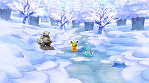
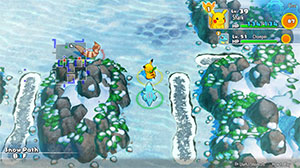

  

Optional dungeon you can challenge before you enter Frosty Forest or Mt. Freeze. You just return to the location before you entered Snow Path after clearing it, and there's no reward. Enemies offer more experience points compared to Rock Path, but that's about all there is to say about it.

# Overview

<table class="dungeonOverview">
  <tr>
    <th>Unlock</th>
    <td class="highlightYellow">Clear Mt. Blaze.</td>
  </tr>
  <tr>
    <th>Vanishes</th>
    <td class="highlightYellow">After clearing Mt. Freeze.</td>
  </tr>
</table>

<table class="dungeonTable">
  <tr>
    <th>Floors</th>
    <td>B4F</td>
    <th>Job Rank</th>
    <td>-</td>
  </tr>
  <tr>
    <th>Radar / Scanning</th>
    <td>Yes</td>
    <th>Weather</th>
    <td>Clear</td>
  </tr>
  <tr>
    <th>Dark Halls</th>
    <td>No</td>
    <th>Boss</th>
    <td>None</td>
  </tr>
  <tr>
    <th>Max Team Size</th>
    <td>2</td>
    <th>Strong Foe</th>
    <td>None</td>
  </tr>
  <tr>
    <th>Bring Items</th>
    <td>Yes</td>
    <th>Shops</th>
    <td>Yes</td>
  </tr>
  <tr>
    <th>Bring Poke</th>
    <td>Yes</td>
    <th>Monster Houses</th>
    <td>No</td>
  </tr>
  <tr>
    <th>Level Reset</th>
    <td>No</td>
    <th>Mystery Houses</th>
    <td>No</td>
  </tr>
  <tr>
    <th>Clear Icon</th>
    <td>None</td>
    <th>Reward</th>
    <td>None</td>
  </tr>
</table>

# Needed Camps

- Cannot recruit pokemon in this dungeon.

# Pokemon

Rate = Recruit rate. Red stats = Stats as an enemy. Ability colors: Caution, Dangerous Move colors: Boosting, Destroys Items, Caution, Dangerous

#### Wild

|Floor|Image|Name|Rate|Lv|HP|Atk|Def|SpA|SpD|Spe|Exp|Ability + Moves|
|-|-|-|-|-|-|-|-|-|-|-|-|-|
|1-4||Furret |-|20|55 65|34 33|31 24|28 34|28 25|36 36|42|Run Away or Keen Eye Scratch / Foresight / Defense Curl / Agility / Quick Attack / Fury Swipes / Coil / Helping Hand|
|1-4||Snorunt |-|20|55 67|35 36|34 25|34 35|31 26|35 35|48|Inner Focus or Ice Body Ice Shard / Leer / Double Team / Bite / Powder Snow / Icy Wind|
|1-4||Azurill  |-|20|55 68|24 34|28 23|24 24|28 26|30 30|40|Thick Fat or Huge Power Splash / Water Gun / Slam / Charm / Water Sport / Bubble / Bubble Beam / Helping Hand / Tail Whip|
|1-4 Rare||Piloswine  |-|33|76 80|63 39|52 25|46 35|46 29|53 50|53|Oblivious or Snow Cloak Ancient Power / Peck / Odor Sleuth / Mud Sport / Ice Fang / Mud-Slap / Endure / Fury Attack / Mud Bomb / Icy Wind / Powder Snow / Take Down|

# Items

- No data.

# Traps

- No data.
