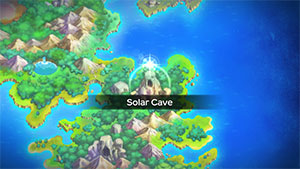
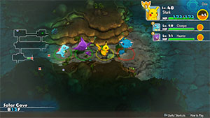

  

# Overview

<table class="dungeonOverview">
  <tr>
    <th>Unlock</th>
    <td class="highlightYellow">Clear Sky Tower → 1 day later (Talk to Medicham → Lombre → Whiscash).</td>
  </tr>
</table>

<table class="dungeonTable">
  <tr>
    <th>Floors</th>
    <td>B20F</td>
    <th>Job Rank</th>
    <td>B</td>
  </tr>
  <tr>
    <th>Radar / Scanning</th>
    <td>No</td>
    <th>Weather</th>
    <td>Clear</td>
  </tr>
  <tr>
    <th>Dark Halls</th>
    <td>2 Tiles</td>
    <th>Boss</th>
    <td>None</td>
  </tr>
  <tr>
    <th>Max Team Size</th>
    <td>3</td>
    <th>Strong Foe</th>
    <td>Aipom</td>
  </tr>
  <tr>
    <th>Bring Items</th>
    <td>Yes</td>
    <th>Shops</th>
    <td>Yes</td>
  </tr>
  <tr>
    <th>Bring Poke</th>
    <td>Yes</td>
    <th>Monster Houses</th>
    <td>Yes</td>
  </tr>
  <tr>
    <th>Level Reset</th>
    <td>No</td>
    <th>Mystery Houses</th>
    <td>Yes</td>
  </tr>
  <tr>
    <th>Clear Icon</th>
    <td>None</td>
    <th>Reward</th>
    <td>Deluxe Box x 2, Friend Bow x 1, Ice Beam TM, Energy Ball TM, Flamethrower TM</td>
  </tr>
</table>

Optional post-game dungeon featuring Psychic types, along with good TMs and a Friend Bow at the end. Friend Bow boosts recruit rate by +12.8% (leader only), and also makes it possible to recruit shiny Strong Foes. Since it's a post-game dungeon, X-Ray Specs and Goggle Specs can be found in shops or on the ground. Heracross can appear as a fainted Pokemon - It's possible to reset until you get Rapid Bull's-Eyes (Rare Quality). Evolution Crystals (1000 Poke) can appear in shops, so don't forget to bring some money.

Jynx (1-6F) can know Perish Song, so it's best to bring an ally with Refresh, Aromatherapy, or Heal Bell. Dark types with Brutal Swing or Ominous Wind users like Masquerain make for great attackers here, but keep in mind that Ominous Wind doesn't work on Girafarig or Aipom without Steamroll.

# Needed Camps

#### Wild

|Name|Price|Pokemon|
|-|-|-|
|Wild Plains|-|Drowzee, Hypno|
|Sky-Blue Plains|-|Girafarig, Kirlia|
|Flyaway Forest|500|Natu|
|Thunder Crag|600|Chimecho|
|Mt. Discipline|700|Meditite, Medicham|
|Mt. Green|700|Spoink, Grumpig|
|Ancient Relic|700|Claydol|
|Magnetic Quarry|700|Beldum, Metang|
|Frigid Cavern|800|Jynx|
|Vibrant Forest|800|Aipom|
|Echo Cave|2700|Wynaut, Wobbuffet|
|Decrepit Lab|6000|Abra, Kadabra, Mr. Mime|
|Mt. Moonview|7000|Lunatone|

#### Fainted

|Name|Price|Pokemon|
|-|-|-|
|Stump Forest|-|Dustox|
|Darkness Ridge|-|Sableye|
|Mt. Discipline|700|Tyrogue|
|Scorched Plains|700|Ponyta|
|Overgrown Forest|700|Pinsir, Heracross|
|Rub-a-Dub River|3000|Illumise|
|Decrepit Lab|6000|Porygon2|
|Gourd Swamp|9000|Whiscash|
|Treasure Sea|9000|Carvanha|

#### Mystery House

|Name|Price|Pokemon|
|-|-|-|
|Sky-Blue Plains|-|Wigglytuff, Granbull|
|Power Plant|-|Magnezone, Electivire|
|Darkness Ridge|-|Ninetales, Sneasel, Weavile|
|Safari|600|Miltank|
|Thunder Crag|600|Plusle, Minun|
|Scorched Plains|700|Arcanine|
|Overgrown Forest|700|Bonsly, Sudowoodo|
|Mt. Discipline|700|Hariyama, Riolu, Lucario|
|Frigid Cavern|800|Delibird, Glalie|
|Crater|5000|Magmortar, Camerupt|
|Turtleshell Pond|6000|Azumarill|
|Decrepit Lab|6000|Mime Jr., Mr. Mime|
|Mt. Moonview|7000|Clefable|
|Bountiful Sea|9000|Cloyster|

# Pokemon

Rate = Recruit rate. Red stats = Stats as an enemy. Ability colors: Caution, Dangerous Move colors: Boosting, Destroys Items, Caution, Dangerous

#### Wild

|Floor|Image|Name|Rate|Lv|HP|Atk|Def|SpA|SpD|Spe|Exp|Ability + Moves|
|-|-|-|-|-|-|-|-|-|-|-|-|-|
|1-3||Wynaut |8.2%|30|90 119|40 55|45 37|40 53|40 38|44 44|77|Shadow Tag Splash / Charm / Encore / Safeguard / Mirror Coat / Counter / Destiny Bond|
|1-4||Beldum  |14.4%|30|65 106|50 66|50 38|45 59|45 44|47 47|83|Clear Body Take Down|
|1-4||Girafarig  |8.2%|30|65 110|50 62|45 36|50 62|45 37|53 53|81|Inner Focus or Early Bird Power Swap / Guard Swap / Astonish / Tackle / Growl / Confusion / Stomp / Odor Sleuth / Assurance / Psybeam / Agility / Double Hit|
|1-5||Natu  |8.2%|30|65 104|50 55|45 37|60 65|45 34|53 53|82|Synchronize or Early Bird Peck / Leer / Night Shade / Teleport / Lucky Chant / Stored Power / Wish / Ominous Wind / Confuse Ray|
|1-5||Spoink |8.2%|30|65 111|40 59|45 34|50 67|60 39|50 50|72|Thick Fat or Own Tempo Splash / Power Gem / Psybeam / Rest / Psych Up / Confuse Ray / Magic Coat / Odor Sleuth / Zen Headbutt / Psywave|
|1-5||Drowzee |8.2%|30|65 116|50 57|45 37|50 58|60 36|50 50|74|Insomnia or Forewarn Pound / Headbutt / Disable / Meditate / Hypnosis / Poison Gas / Confusion / Wake-Up Slap / Psybeam|
|1-6||Jynx  |8.2%|30|65 108|45 53|40 35|65 73|50 43|53 53|80|Oblivious or Forewarn Draining Kiss / Pound / Double Slap / Lick / Powder Snow / Heart Stamp / Lovely Kiss / Mean Look / Ice Punch / Fake Tears / Perish Song|
|1-8 Rare||Abra |8.2%|30|60 100|40 44|40 35|65 75|45 35|56 56|73|Synchronize or Inner Focus Teleport ※ Always drops a Max Ether.|
|4-8||Meditite  |14.4%|30|65 106|45 54|45 37|45 57|45 34|50 50|73|Pure Power Feint / Meditate / Force Palm / Detect / Mind Reader / Calm Mind / Confusion / Bide / Hidden Power / High Jump Kick / Endure|
|5 8-19 Foe|  |Aipom |-6.4%|60|88 560|83 150|55 60|64 150|55 60|97 200|790|Run Away or Pickup Last Resort / Tail Whip / Sand Attack / Astonish / Baton Pass / Tickle / Swift / Fury Swipes / Screech / Agility / Fling / Nasty Plot / Scratch / Double Hit ※ Friend Bow required to recruit.|
|7-12||Mr. Mime  |8.2%|30|60 103|40 50|45 36|60 74|60 42|53 53|80|Soundproof or Filter Substitute / Magical Leaf / Confusion / Quick Guard / Wide Guard / Psywave / Power Swap / Guard Swap / Meditate / Barrier / Copycat / Mimic / Psybeam / Double Slap / Pound / Encore / Reflect / Light Screen / Misty Terrain|
|8-12||Lunatone  |10.8%|30|65 113|45 58|45 37|60 65|50 39|50 50|87|Levitate Power Gem / Psyshock / Rock Throw / Tackle / Harden / Confusion / Psychic / Moonblast / Rock Polish / Psywave / Embargo / Rock Slide / Cosmic Power / Hypnosis|
|8-12||Metang  |10.8%|30|65 106|50 70|50 42|45 60|45 40|47 47|85|Clear Body Confusion / Metal Claw / Miracle Eye / Magnet Rise / Bullet Punch / Pursuit / Take Down|
|9-14||Hypno |8.2%|30|65 123|50 64|45 36|50 67|60 40|50 50|88|Insomnia or Forewarn Pound / Headbutt / Disable / Meditate / Hypnosis / Poison Gas / Confusion / Wake-Up Slap / Psybeam / Nasty Plot / Future Sight / Nightmare / Switcheroo|
|10-15||Kirlia  |8.2%|30|60 105|40 44|40 36|45 45|40 35|47 47|79|Synchronize or Trace Confusion / Double Team / Psychic / Growl / Draining Kiss / Lucky Chant / Teleport / Magical Leaf / Calm Mind / Heal Pulse / Disarming Voice|
|11-16||Wobbuffet |8.2%|30|90 135|40 46|45 35|40 47|40 37|44 44|77|Shadow Tag Counter / Mirror Coat / Destiny Bond / Safeguard|
|12-17||Chimecho |10.8%|30|65 106|45 64|45 36|60 67|45 38|50 50|73|Levitate Healing Wish / Synchronoise / Wrap / Growl / Astonish / Confusion / Yawn / Psywave / Extrasensory / Heal Bell / Take Down|
|13-19||Kadabra |8.2%|30|60 105|40 45|40 35|65 78|45 38|56 56|85|Synchronize or Inner Focus Kinesis / Teleport / Reflect / Disable / Confusion / Miracle Eye / Psycho Cut / Psybeam|
|15-19||Medicham  |14.4%|37|70 109|49 65|48 39|49 64|47 40|57 57|80|Pure Power Bide / Confusion / Detect / Calm Mind / Meditate / Endure / Feint / Force Palm / Acupressure / Mind Reader / Psych Up / Hidden Power / Fire Punch / Ice Punch / Thunder Punch / High Jump Kick / Zen Headbutt / Power Trick ※ Can Mega Evolve.|
|16-19||Grumpig |8.2%|32|66 104|41 64|46 38|51 70|61 38|52 52|70|Thick Fat or Own Tempo Splash / Power Gem / Teeter Dance / Psych Up / Confuse Ray / Magic Coat / Odor Sleuth / Zen Headbutt / Psywave / Belch / Psybeam|
|16-19||Claydol  |10.8%|36|69 106|54 64|62 42|48 67|62 41|56 56|90|Levitate Teleport / Power Split / Cosmic Power / Guard Split / Heal Block / Confusion / Rock Tomb / Psybeam / Hyper Beam / Mud-Slap / Rapid Spin / Power Trick / Self-Destruct / Extrasensory / Harden / Ancient Power|

#### Fainted

|Image|Name|Lv|HP|Atk|Def|SpA|SpD|Spe|
|-|-|-|-|-|-|-|-|-|
||Ponyta |32|66|61|46|51|46|60|
||Pinsir |34|68|68|52|47|46|57|
||Heracross  |34|68|68|47|42|51|61|
||Porygon2 |32|66|51|51|62|51|49|
||Tyrogue |32|61|66|41|41|61|55|
||Dustox  |32|61|41|43|36|36|45|
||Sableye  |34|63|53|47|47|46|55|
||Illumise |32|66|46|46|51|46|55|
||Carvanha  |32|66|66|41|61|41|55|
||Whiscash  |32|76|51|46|51|46|49|

#### Mystery House

|Image|Name|Image|Name|Image|Name|Image|Name|Image|Name|
|-|-|-|-|-|-|-|-|-|-|
||Clefable ||Ninetales ||Wigglytuff  ||Arcanine ||Magnezone  |
||Cloyster  ||Mime Jr.  ||Mr. Mime  ||Electivire ||Magmortar |
||Azumarill  ||Bonsly ||Sudowoodo ||Granbull ||Sneasel  |
||Weavile  ||Delibird  ||Miltank ||Hariyama ||Plusle |
||Minun ||Camerupt  ||Glalie ||Riolu ||Lucario  |

# Items

#### Floor

|Name|Floors|Rate|
|-|-|-|
|Efficient Bandanna|1-19|0.841%|
|Goggle Specs|1-19|0.211%|
|Gold Ribbon|1-19|0.0211%|
|Heal Ribbon|1-19|0.211%|
|Insomniscope|1-19|0.211%|
|Joy Ribbon|1-19|0.211%|
|Nullify Bandanna|1-19|0.42%|
|Pecha Scarf|1-19|0.211%|
|Persim Band|1-19|0.211%|
|Recovery Scarf|1-19|0.211%|
|Scope Lens|1-19|0.211%|
|Weather Band|1-19|0.211%|
|X-Ray Specs|1-19|0.211%|
|Apple|1-19|2.82%|
|Poke|1-19|56.5%|
|Max Elixir|1-19|1.31%|
|Max Ether|1-19|4.34%|
|Blast Seed|1-19|0.752%|
|Cheri Berry|1-19|0.752%|
|Chesto Berry|1-19|0.376%|
|Empowerment Seed|1-19|0.752%|
|Eyedrop Seed|1-19|1.51%|
|Oran Berry|1-19|3.76%|
|Pecha Berry|1-19|1.88%|
|Rawst Berry|1-19|1.13%|
|Sleep Seed|1-19|0.752%|
|Stun Seed|1-19|0.376%|
|Tiny Reviver Seed|1-19|1.13%|
|Totter Seed|1-19|0.376%|
|Training Seed|1-19|0.188%|
|Warp Seed|1-19|0.376%|
|Iron Spike|1-19|5.65%|
|Geo Pebble|1-19|5.65%|
|(Random TM)|1-19|1.69%|
|Confuse Wand|1-19|0.238%|
|Guiding Wand|1-19|0.238%|
|HP-Swap Wand|1-19|0.238%|
|Petrify Wand|1-19|0.238%|
|Pounce Wand|1-19|0.475%|
|Slow Wand|1-19|0.238%|
|Slumber Wand|1-19|0.475%|
|Stayaway Wand|1-19|0.714%|
|Surround Wand|1-19|0.475%|
|Switcher Wand|1-19|0.238%|
|Tunnel Wand|1-19|0.238%|
|Two-Edged Wand|1-19|0.238%|
|Warp Wand|1-19|0.238%|
|Whirlwind Wand|1-19|0.238%|

#### Shop

|Name|Rate|
|-|-|
|Efficient Bandanna|2.28%|
|Goggle Specs|0.571%|
|Heal Ribbon|0.571%|
|Insomniscope|0.571%|
|Joy Ribbon|0.571%|
|Nullify Bandanna|1.15%|
|Pecha Scarf|0.571%|
|Persim Band|0.571%|
|Prosper Ribbon|0.571%|
|Recovery Scarf|0.571%|
|Scope Lens|0.571%|
|Weather Band|0.571%|
|X-Ray Specs|0.571%|
|Evolution Crystal|5.83%|
|Big Apple|6.8%|
|All Dodge Orb|0.472%|
|All Power-Up Orb|0.472%|
|All Protect Orb|0.472%|
|Bank Orb|0.472%|
|Cleanse Orb|0.472%|
|Decoy Orb|0.472%|
|Drought Orb|0.472%|
|Evasion Orb|0.472%|
|Foe-Hold Orb|0.472%|
|Foe-Seal Orb|0.472%|
|Health Orb|0.472%|
|Helper Orb|0.472%|
|Inviting Orb|0.472%|
|Lasso Orb|0.472%|
|Mobile Orb|0.472%|
|Monster Orb|0.472%|
|Nullify Orb|0.472%|
|One-Room Orb|0.472%|
|One-Shot Orb|0.472%|
|Rare Quality Orb|0.472%|
|Reset Orb|0.472%|
|Revive All Orb|0.472%|
|See-Trap Orb|0.472%|
|Spurn Orb|0.472%|
|Trapbust Orb|0.472%|
|Weather Lock Orb|0.472%|
|Wigglytuff Orb|2.35%|
|Max Elixir|9.71%|
|Ban Seed|0.868%|
|Cheri Berry|1.74%|
|Chesto Berry|1.74%|
|Decoy Seed|0.868%|
|Empowerment Seed|1.74%|
|Energy Seed|0.868%|
|Pecha Berry|4.35%|
|Pure Seed|0.868%|
|Quick Seed|2.6%|
|Rawst Berry|2.6%|
|Reviver Seed|0.868%|
|Stun Seed|1.74%|
|Tiny Reviver Seed|2.6%|
|Violent Seed|0.868%|
|Iron Spike|4.85%|
|Geo Pebble|4.85%|
|(Random TM)|9.71%|
|Guiding Wand|1.29%|
|HP-Swap Wand|0.648%|
|Pounce Wand|1.29%|
|Slow Wand|1.29%|
|Stayaway Wand|1.29%|
|Surround Wand|1.29%|
|Tunnel Wand|1.29%|
|Two-Edged Wand|0.648%|
|Warp Wand|0.648%|

# Traps

|Name|
|-|
|Wonder Tile|
|Training Switch|
|Spin Trap|
|Slumber Trap|
|Poison Trap|
|Spiky Trap|
|Gust Trap|
|Slow Trap|
|Hunger Trap|
|Warp Trap|
