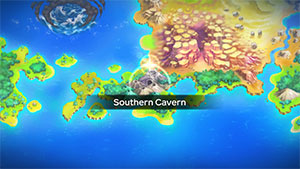
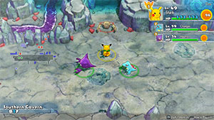

  

[Introduction]

# Overview

<table class="dungeonOverview">
  <tr>
    <th>Unlock</th>
    <td class="highlightYellow">Clear Sky Tower → Purchase "Boulder Cave" camp</td>
  </tr>
</table>

<table class="dungeonTable">
  <tr>
    <th>Floors</th>
    <td>B50F</td>
    <th>Job Rank</th>
    <td>S</td>
  </tr>
  <tr>
    <th>Radar / Scanning</th>
    <td>No</td>
    <th>Weather</th>
    <td>Clear</td>
  </tr>
  <tr>
    <th>Dark Halls</th>
    <td>2 Tiles</td>
    <th>Boss</th>
    <td>None</td>
  </tr>
  <tr>
    <th>Max Team Size</th>
    <td>3</td>
    <th>Strong Foe</th>
    <td>Shuckle</td>
  </tr>
  <tr>
    <th>Bring Items</th>
    <td>Yes</td>
    <th>Shops</th>
    <td>Yes</td>
  </tr>
  <tr>
    <th>Bring Poke</th>
    <td>Yes</td>
    <th>Monster Houses</th>
    <td>Yes</td>
  </tr>
  <tr>
    <th>Level Reset</th>
    <td>No</td>
    <th>Mystery Houses</th>
    <td>Yes</td>
  </tr>
  <tr>
    <th>Clear Icon</th>
    <td>None</td>
    <th>Reward</th>
    <td>Evolution Crystal x 5 Focus Blast TM x 1 Deluxe Box x 2</td>
  </tr>
</table>

# Needed Camps

#### Wild

|Name|Price|Pokemon|
|-|-|-|
|Power Plant|-|Voltorb|
|Safari|600|Nidoking, Rhyhorn, Rhydon, Phanpy, Donphan|
|Mt. Cleft|700|Larvitar, Pupitar|
|Mt. Green|700|Geodude, Graveler, Golem, Cubone, Marowak, Gligar, Shuckle|
|Boulder Cave|700|Diglett, Dugtrio, Onix|
|Ancient Relic|700|Baltoy|
|Mushroom Forest|800|Seedot|
|Withering Desert|900|Vibrava, Flygon|
|Secretive Forest|900|Ariados|

#### Fainted

|Name|Price|Pokemon|
|-|-|-|
|Sky-Blue Plains|-|Kirlia|
|Power Plant|-|Magnemite, Magneton|
|Jungle|500|Oddish|
|Flyaway Forest|500|Togepi|
|Safari|600|Kangaskhan, Donphan|
|Overgrown Forest|700|Heracross|
|Magnetic Quarry|700|Beldum, Metang|
|Mt. Discipline|700|Machop, Meditite|
|Vibrant Forest|800|Primeape|
|Mushroom Forest|800|Breloom|
|Secretive Forest|900|Forretress|
|Tadpole Pond|900|Poliwhirl, Lombre|
|Beau Plains|2700|Roselia|
|Treasure Sea|9000|Horsea|
|Deepsea Floor|9000|Omanyte|

#### Mystery House

|Name|Price|Pokemon|
|-|-|-|
|Darkness Ridge|-|Haunter, Misdreavus, Duskull|
|Flyaway Forest|500|Honchkrow, Altaria|
|Boulder Cave|700|Onix, Steelix|
|Frigid Cavern|800|Jynx, Delibird|
|Echo Cave|2700|Wobbuffet, Dunsparce, Mawile|
|Decrepit Lab|6000|Kadabra|
|Mt. Moonview|7000|Lunatone, Solrock|
|Serene Sea|9000|Wailord|
|Shallow Beach|9000|Krabby|
|Bountiful Sea|9000|Staryu|
|Treasure Sea|9000|Sharpedo|
|Deepsea Floor|9000|Clamperl|

# Pokemon

Rate = Recruit rate. Red stats = Stats as an enemy. Ability colors: Caution, Dangerous Move colors: Boosting, Destroys Items, Caution, Dangerous

#### Wild

|Floor|Image|Name|Rate|Lv|HP|Atk|Def|SpA|SpD|Spe|Exp|Ability + Moves|
|-|-|-|-|-|-|-|-|-|-|-|-|-|
|1-6||Geodude  |14.4%|42|70 112|72 72|64 51|49 49|44 44|56 56|85|Rock Head or Sturdy Tackle / Defense Curl / Stone Edge / Mud Sport / Rock Polish / Bulldoze / Magnitude / Rock Throw / Rollout / Earthquake / Rock Blast / Explosion / Smack Down / Self-Destruct / Stealth Rock / Double-Edge|
|1-7||Diglett |14.4%|42|69 110|59 59|44 44|46 46|49 49|71 71|75|Sand Veil or Arena Trap Growl / Sand Attack / Scratch / Dig / Astonish / Mud-Slap / Magnitude / Bulldoze / Sucker Punch / Slash / Mud Bomb / Earth Power / Earthquake|
|1-7||Seedot |10.8%|42|75 108|62 62|44 44|55 55|44 44|59 59|74|Chlorophyll or Early Bird Bide / Harden / Growth / Sunny Day / Nature Power / Synthesis / Explosion|
|4-8||Voltorb |14.4%|42|74 106|52 52|49 49|59 59|49 49|71 71|70|Soundproof or Static Charge / Tackle / Sonic Boom / Eerie Impulse / Screech / Rollout / Swift / Charge Beam / Electro Ball / Self-Destruct / Light Screen / Spark / Discharge / Magnet Rise / Explosion|
|4-12||Phanpy |10.8%|42|82 107|75 75|64 51|52 52|49 49|71 71|80|Pickup Odor Sleuth / Tackle / Charm / Flail / Defense Curl / Rollout / Take Down / Natural Gift / Endure / Slam / Growl / Last Resort / Double-Edge|
|9-19||Nidoking  |10.8%|42|74 112|62 62|49 49|55 55|44 44|62 62|82|Poison Point or Rivalry Megahorn / Chip Away / Double Kick / Focus Energy / Poison Sting / Thrash / Peck|
|10-19||Cubone |8.2%|42|74 104|57 59|60 51|46 46|49 49|58 59|85|Rock Head or Lightning Rod Growl / Tail Whip / Bone Club / Leer / Headbutt / Endeavor / Bonemerang / Rage / False Swipe / Thrash / Fling / Stomping Tantrum / Focus Energy|
|12-20||Flygon  |-2.2%|45|73 129|65 65|45 45|55 55|45 45|65 65|88|Levitate Dragon Claw / Dragon Breath / Screech / Sand Attack / Sonic Boom / Mud-Slap / Bulldoze / Dragon Dance / Sand Tomb / Rock Slide / Supersonic / Feint Attack / Earth Power / Dragon Tail / Earthquake / Sandstorm / Bide / Uproar / Hyper Beam|
|12-22||Baltoy  |14.4%|42|74 98|59 59|64 51|52 52|64 64|62 62|80|Levitate Mud-Slap / Confusion / Sandstorm / Rock Tomb / Heal Block / Psybeam / Cosmic Power / Ancient Power / Harden / Power Trick / Earth Power / Self-Destruct / Extrasensory / Guard Split / Power Split / Rapid Spin|
|12-49 Foe|  |Shuckle  |-6.4%|60|78 580|50 100|106 90|50 100|106 90|101 200|820|Sturdy or Gluttony Sticky Web / Withdraw / Constrict / Bide / Rollout / Encore / Power Trick / Struggle Bug / Safeguard / Rest / Rock Throw / Gastro Acid / Wrap / Shell Smash / Rock Slide / Bug Bite / Power Split / Guard Split / Stone Edge ※ Friend Bow required to recruit.|
|15-25||Gligar  |10.8%|42|74 120|69 69|64 51|46 46|49 49|65 65|83|Hyper Cutter or Sand Veil Poison Sting / Sand Attack / X-Scissor / Screech / U-turn / Quick Attack / Slash / Knock Off / Fury Cutter / Acrobatics / Harden / Feint Attack|
|16-26||Larvitar  |8.2%|42|75 119|68 68|49 49|58 58|49 49|71 71|90|Guts Bite / Leer / Sandstorm / Screech / Chip Away / Rock Slide / Scary Face / Thrash / Dark Pulse / Payback / Crunch|
|20-30||Rhyhorn  |10.8%|42|84 117|82 82|64 51|49 49|44 44|56 56|88|Lightning Rod or Rock Head Horn Attack / Tail Whip / Fury Attack / Scary Face / Smack Down / Bulldoze / Take Down / Chip Away / Rock Blast / Drill Run / Stomp / Stone Edge|
|20-30||Ariados  |10.8%|42|74 116|69 69|49 49|52 52|49 49|56 56|86|Swarm or Insomnia Swords Dance / String Shot / Bug Bite / Venom Drench / Fell Stinger / Absorb / Poison Sting / Fury Swipes / Constrict / Infestation / Scary Face / Night Shade / Shadow Sneak / Focus Energy / Agility / Sucker Punch / Spider Web / Pin Missile|
|20-31||Dugtrio |8.2%|42|69 118|59 59|44 44|46 46|49 49|71 71|81|Sand Veil or Arena Trap Sand Tomb / Rototiller / Night Slash / Tri Attack / Scratch / Sand Attack / Growl / Astonish / Mud-Slap / Slash / Bulldoze / Mud Bomb / Earth Power / Dig / Magnitude / Sucker Punch|
|25-36||Graveler  |10.8%|42|70 115|72 72|64 51|49 49|44 44|56 56|95|Rock Head or Sturdy Tackle / Defense Curl / Mud Sport / Rock Polish / Rock Blast / Magnitude / Rock Throw / Smack Down / Bulldoze / Self-Destruct / Stealth Rock / Rollout / Earthquake|
|30-40||Marowak |8.2%|42|74 129|57 59|60 51|46 46|49 49|58 59|87|Rock Head or Lightning Rod Growl / Tail Whip / Bone Club / Leer / Headbutt / Focus Energy / False Swipe / Rage / Bonemerang / Thrash / Fling|
|31-39||Vibrava  |8.2%|42|70 120|62 62|44 44|52 52|44 44|62 62|88|Levitate Dragon Breath / Sand Attack / Uproar / Sonic Boom / Feint Attack / Mud-Slap / Bide / Sand Tomb / Screech / Bulldoze / Rock Slide / Supersonic / Earth Power / Bug Buzz / Earthquake / Sandstorm|
|31-40||Donphan |8.2%|42|82 124|75 75|64 51|52 52|49 49|71 59|90|Sturdy Fury Attack / Fire Fang / Thunder Fang / Horn Attack / Bulldoze / Growl / Slam / Defense Curl / Rollout / Rapid Spin / Assurance / Knock Off / Magnitude / Scary Face|
|37-45||Pupitar  |10.8%|42|75 125|68 68|49 49|58 58|49 49|71 71|92|Shed Skin Bite / Leer / Sandstorm / Screech / Chip Away / Rock Slide / Scary Face / Thrash / Dark Pulse / Payback|
|40-49||Golem  |10.8%|42|70 130|72 72|64 51|49 49|44 44|56 56|95|Rock Head or Sturdy Mud Sport / Defense Curl / Magnitude / Rock Polish / Rock Blast / Earthquake / Rock Throw / Smack Down / Tackle / Self-Destruct / Stealth Rock / Bulldoze / Heavy Slam / Steamroller|
|40-49||Onix  |10.8%|42|74 118|59 59|79 51|52 52|49 49|68 68|90|Rock Head or Sturdy Mud Sport / Tackle / Harden / Screech / Bind / Rock Throw / Rock Tomb / Rage / Smack Down / Rock Polish / Gyro Ball / Stealth Rock / Dragon Breath / Iron Tail / Slam / Rock Slide / Sand Tomb / Curse|
|40-49||Rhydon  |-2.2%|42|84 138|82 82|64 51|49 49|44 44|56 56|93|Lightning Rod or Rock Head Hammer Arm / Horn Drill / Stone Edge / Tail Whip / Fury Attack / Scary Face / Smack Down / Stomp / Chip Away / Bulldoze / Rock Blast / Horn Attack / Drill Run / Take Down|

#### Fainted

|Image|Name|Lv|HP|Atk|Def|SpA|SpD|Spe|
|-|-|-|-|-|-|-|-|-|
||Oddish  |44|75|57|50|64|50|58|
||Primeape |46|77|72|51|55|50|76|
||Poliwhirl |44|77|61|50|50|45|72|
||Machop |44|79|79|52|52|52|63|
||Magnemite  |44|72|57|55|77|50|64|
||Magneton  |46|74|59|56|79|50|66|
||Kangaskhan |44|83|70|55|47|50|67|
||Horsea |44|72|61|55|70|45|81|
||Omanyte  |44|75|53|65|77|50|61|
||Togepi |44|72|50|55|67|55|72|
||Forretress  |44|75|70|70|53|50|72|
||Heracross  |46|77|79|51|48|55|85|
||Donphan |46|85|79|66|55|50|79|
||Lombre  |44|75|57|45|57|50|61|
||Kirlia  |46|74|52|46|67|45|63|
||Breloom  |44|75|84|55|53|50|64|
||Meditite  |44|76|53|50|54|50|69|
||Roselia  |44|72|57|45|74|50|69|
||Beldum  |44|75|71|55|61|50|61|
||Metang  |46|77|74|56|63|50|63|

#### Mystery House

|Image|Name|Image|Name|Image|Name|Image|Name|
|-|-|-|-|-|-|-|-|
||Kadabra ||Haunter  ||Onix  ||Steelix  |
||Krabby ||Staryu ||Jynx  ||Honchkrow  |
||Misdreavus ||Wobbuffet ||Dunsparce ||Delibird  |
||Mawile  ||Sharpedo  ||Wailord ||Altaria  |
||Lunatone  ||Solrock  ||Duskull ||Clamperl |

# Items

#### Floor

|Name|Floors|Rate|
|-|-|-|
|Efficient Bandanna|1-49|0.88%|
|Goggle Specs|1-49|0.22%|
|Gold Ribbon|1-49|0.022%|
|Heal Ribbon|1-49|0.22%|
|Insomniscope|1-49|0.22%|
|Joy Ribbon|1-49|0.22%|
|Nullify Bandanna|1-49|0.44%|
|Pecha Scarf|1-49|0.22%|
|Persim Band|1-49|0.22%|
|Recovery Scarf|1-49|0.22%|
|Scope Lens|1-49|0.22%|
|Weather Band|1-49|0.22%|
|X-Ray Specs|1-49|0.22%|
|Apple|1-49|8.88%|
|Poke|1-49|65.1%|
|Max Elixir|1-49|1.37%|
|Max Ether|1-49|4.55%|
|Blast Seed|1-49|0.789%|
|Cheri Berry|1-49|0.789%|
|Chesto Berry|1-49|0.395%|
|Empowerment Seed|1-49|0.789%|
|Eyedrop Seed|1-49|1.58%|
|Oran Berry|1-49|3.95%|
|Pecha Berry|1-49|1.97%|
|Rawst Berry|1-49|1.18%|
|Sleep Seed|1-49|0.789%|
|Stun Seed|1-49|0.395%|
|Tiny Reviver Seed|1-49|1.18%|
|Totter Seed|1-49|0.395%|
|Training Seed|1-49|0.197%|
|Warp Seed|1-49|0.395%|
|Confuse Wand|1-49|0.0936%|
|Guiding Wand|1-49|0.0936%|
|HP-Swap Wand|1-49|0.0936%|
|Petrify Wand|1-49|0.0936%|
|Pounce Wand|1-49|0.187%|
|Slow Wand|1-49|0.0936%|
|Slumber Wand|1-49|0.187%|
|Stayaway Wand|1-49|0.281%|
|Surround Wand|1-49|0.187%|
|Switcher Wand|1-49|0.0936%|
|Tunnel Wand|1-49|0.0936%|
|Two-Edged Wand|1-49|0.0936%|
|Warp Wand|1-49|0.0936%|
|Whirlwind Wand|1-49|0.0936%|

#### Shop

|Name|Rate|
|-|-|
|Efficient Bandanna|2.28%|
|Goggle Specs|0.571%|
|Heal Ribbon|0.571%|
|Insomniscope|0.571%|
|Joy Ribbon|0.571%|
|Nullify Bandanna|1.15%|
|Pecha Scarf|0.571%|
|Persim Band|0.571%|
|Prosper Ribbon|0.571%|
|Recovery Scarf|0.571%|
|Scope Lens|0.571%|
|Weather Band|0.571%|
|X-Ray Specs|0.571%|
|Evolution Crystal|5.83%|
|Big Apple|6.8%|
|All Dodge Orb|0.418%|
|All Power-Up Orb|0.418%|
|All Protect Orb|0.418%|
|Bank Orb|0.418%|
|Cleanse Orb|2.09%|
|Decoy Orb|0.418%|
|Drought Orb|0.418%|
|Evasion Orb|0.418%|
|Foe-Hold Orb|0.418%|
|Foe-Seal Orb|0.418%|
|Health Orb|0.418%|
|Helper Orb|0.418%|
|Inviting Orb|0.418%|
|Lasso Orb|0.418%|
|Mobile Orb|0.418%|
|Monster Orb|0.418%|
|Nullify Orb|0.418%|
|One-Room Orb|0.418%|
|One-Shot Orb|0.418%|
|Rare Quality Orb|0.418%|
|Reset Orb|0.418%|
|Revive All Orb|0.418%|
|See-Trap Orb|0.418%|
|Spurn Orb|0.418%|
|Trapbust Orb|0.418%|
|Weather Lock Orb|0.418%|
|Wigglytuff Orb|2.09%|
|Max Elixir|9.71%|
|Ban Seed|0.868%|
|Cheri Berry|1.74%|
|Chesto Berry|1.74%|
|Decoy Seed|0.868%|
|Empowerment Seed|1.74%|
|Energy Seed|0.868%|
|Pecha Berry|4.35%|
|Pure Seed|0.868%|
|Quick Seed|2.6%|
|Rawst Berry|2.6%|
|Reviver Seed|0.868%|
|Stun Seed|1.74%|
|Tiny Reviver Seed|2.6%|
|Violent Seed|0.868%|
|Iron Spike|4.85%|
|Geo Pebble|4.85%|
|(Random TM)|9.71%|
|Guiding Wand|1.29%|
|HP-Swap Wand|0.648%|
|Pounce Wand|1.29%|
|Slow Wand|1.29%|
|Stayaway Wand|1.29%|
|Surround Wand|1.29%|
|Tunnel Wand|1.29%|
|Two-Edged Wand|0.648%|
|Warp Wand|0.648%|

# Traps

|Name|
|-|
|Wonder Tile|
|Training Switch|
|Spin Trap|
|Slumber Trap|
|Poison Trap|
|Spiky Trap|
|Gust Trap|
|Slow Trap|
|Hunger Trap|
|Warp Trap|
