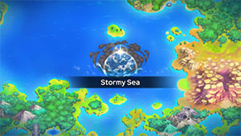
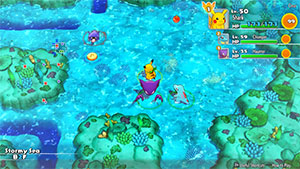
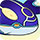

  

# Overview

<table class="dungeonOverview">
  <tr>
    <th>Unlock</th>
    <td class="highlightYellow">Clear Sky Tower → 1 day later (Talk to Medicham → Lombre → Whiscash).</td>
  </tr>
</table>

<table class="dungeonTable">
  <tr>
    <th>Floors</th>
    <td>B40F</td>
    <th>Job Rank</th>
    <td>B</td>
  </tr>
  <tr>
    <th>Radar / Scanning</th>
    <td>No</td>
    <th>Weather</th>
    <td>Rain: 5-6, 12-13, 19-20, 26-27F</td>
  </tr>
  <tr>
    <th>Dark Halls</th>
    <td>No</td>
    <th>Boss</th>
    <td>Kyogre</td>
  </tr>
  <tr>
    <th>Max Team Size</th>
    <td>3</td>
    <th>Strong Foe</th>
    <td>None</td>
  </tr>
  <tr>
    <th>Bring Items</th>
    <td>Yes</td>
    <th>Shops</th>
    <td>No</td>
  </tr>
  <tr>
    <th>Bring Poke</th>
    <td>Yes</td>
    <th>Monster Houses</th>
    <td>Yes</td>
  </tr>
  <tr>
    <th>Level Reset</th>
    <td>No</td>
    <th>Mystery Houses</th>
    <td>Yes</td>
  </tr>
  <tr>
    <th>Clear Icon</th>
    <td></td>
    <th>Reward</th>
    <td>Kyogre joins, Unlock Buried Relic</td>
  </tr>
</table>

Post-game dungeon featuring lots of Water types, and Kyogre as a tough boss at the end. Water type enemies often have ranged attacks, including moves that can inflict Slow or Confused status, so avoid lining up with them if possible - Room-wide attacks like Discharge can be used to still hit them. Enemies with Shell Armor or Battle Armor are common, so critical hit reliant strategies are less effective. Anorith (14-23F) and Armaldo (35-39F) can know Bug Bite, so don't let them act when adjacent.

Since it's a sea type dungeon, food items (including seeds and berries) can't be found on the ground. It's recommended to bring a party member that has Notorious Fasting, Food Finder, or Small Stomach. ※ Apples can still be obtained by stepping on an Apple Trap or by entering a Mystery House.

# Boss Strategy

#### Kyogre (1431 HP) - Origin Pulse / Hydro Pump / Body Slam / Water Spout

- Kyogre's Water type attacks gain power while it's raining, and weaken when it's sunny.
    - Kyogre's ability makes it rain, so use a Nullify Orb first if you want to use Sunny Day or a Sunny Orb.
- Water Spout changes to a room-wide attack when used by a large Pokemon like Kyogre.
    - Its power decreases when the user has lower HP, so it hits hardest at the start of the fight.
- Hydro Pump pierces 10 tiles in a straight line, and Origin Pulse hits targets in a 1 tile radius.
- Drought Orb can be used to remove the Slow status for non-Water types field effect.
    - This field effect cannot be countered by moves like Agility or Tailwind that grant Quick status.

#### Primal Kyogre (1236 HP) - Origin Pulse / Hydro Pump / Body Slam / Water Spout

- Basically 1 more round of Kyogre, but Primordial Sea prevents the weather from changing.
    - Again, use a Nullify Orb if you want to use Sunny Day or a Sunny Orb.

# Needed Camps

#### Wild

|Name|Price|Pokemon|
|-|-|-|
|Ice Floe Beach|6000|Seel, Spheal, Sealeo|
|Poison Swamp|7000|Grimer|
|Bountiful Sea|9000|Tentacool, Tentacruel, Slowpoke, Shellder, Starmie|
|Shallow Beach|9000|Wingull|
|Treasure Sea|9000|Seadra, Remoraid, Carvanha, Anorith, Armaldo|
|Deepsea Floor|9000|Omanyte, Omastar, Kabuto, Kabutops|

#### Fainted

|Name|Price|Pokemon|
|-|-|-|
|Wild Plains|-|Ekans, Arbok|
|Power Plant|-|Electabuzz|
|Darkness Ridge|-|Vulpix|
|Jungle|500|Bellsprout|
|Thunder Crag|600|Flaaffy|
|Magnetic Quarry|700|Beldum|
|Mt. Discipline|700|Makuhita|
|Mt. Green|700|Teddiursa, Ursaring|
|Vibrant Forest|800|Snorlax|
|Mushroom Forest|800|Seedot|
|Withering Desert|900|Flygon|
|Mystic Lake|2500|Dratini|
|Beau Plains|2700|Budew|
|Crater|5000|Numel|
|Mt. Moonview|7000|Clefairy|
|Deepsea Floor|9000|Cradily|
|Shallow Beach|9000|Kingler, Pelipper|

#### Mystery House

|Name|Price|Pokemon|
|-|-|-|
|Sky-Blue Plains|-|Wigglytuff, Granbull|
|Power Plant|-|Magnezone, Electivire|
|Darkness Ridge|-|Ninetales, Sneasel, Weavile|
|Safari|600|Miltank|
|Thunder Crag|600|Plusle, Minun|
|Scorched Plains|700|Arcanine|
|Overgrown Forest|700|Bonsly, Sudowoodo|
|Mt. Discipline|700|Hariyama, Riolu, Lucario|
|Frigid Cavern|800|Delibird, Glalie|
|Crater|5000|Magmortar, Camerupt|
|Turtleshell Pond|6000|Azumarill|
|Decrepit Lab|6000|Mime Jr., Mr. Mime|
|Mt. Moonview|7000|Clefable|
|Bountiful Sea|9000|Cloyster|

# Pokemon

Rate = Recruit rate. Red stats = Stats as an enemy. Ability colors: Caution, Dangerous Move colors: Boosting, Destroys Items, Caution, Dangerous

#### Wild

|Floor|Image|Name|Rate|Lv|HP|Atk|Def|SpA|SpD|Spe|Exp|Ability + Moves|
|-|-|-|-|-|-|-|-|-|-|-|-|-|
|1-5||Wingull  |8.2%|30|65 100|45 55|50 32|50 60|45 31|50 50|56|Keen Eye or Hydration Growl / Water Gun / Supersonic / Wing Attack / Water Pulse / Mist / Quick Attack / Air Cutter / Pursuit / Aerial Ace|
|1-8||Shellder |8.2%|30|60 95|60 56|75 37|50 57|40 30|50 50|66|Shell Armor or Skill Link Tackle / Water Gun / Protect / Leer / Supersonic / Icicle Spear / Withdraw / Clamp / Ice Shard|
|1-9||Tentacool  |8.2%|30|65 115|50 57|45 33|50 54|60 38|53 53|66|Clear Body or Liquid Ooze Barrier / Poison Sting / Supersonic / Toxic Spikes / Bubble Beam / Wrap / Constrict / Water Pulse / Acid Spray / Acid|
|1-9||Omanyte  |8.2%|30|65 80|45 58|60 38|65 45|45 39|47 47|63|Swift Swim or Shell Armor Constrict / Withdraw / Bite / Rollout / Water Gun / Leer / Mud Shot / Brine|
|6-14||Slowpoke  |8.2%|30|75 120|50 61|60 41|60 59|45 45|44 44|76|Oblivious or Own Tempo Confusion / Curse / Yawn / Disable / Headbutt / Water Gun / Water Pulse / Growl / Tackle|
|6-14||Seel |10.8%|30|75 105|50 62|50 40|45 61|50 36|50 50|64|Thick Fat or Hydration Headbutt / Growl / Ice Shard / Rest / Icy Wind / Water Sport / Aqua Ring / Aurora Beam / Encore|
|10-19||Remoraid |8.2%|30|65 120|60 59|45 36|60 61|45 34|47 47|62|Hustle or Sniper Signal Beam / Lock-On / Water Pulse / Bubble Beam / Water Gun / Psybeam / Aurora Beam / Focus Energy|
|10-19||Spheal  |8.2%|30|75 116|45 63|45 45|50 60|45 40|47 47|71|Thick Fat or Ice Body Defense Curl / Powder Snow / Growl / Water Gun / Rollout / Encore / Brine / Aurora Beam / Body Slam / Ice Ball|
|14-23||Anorith  |8.2%|30|65 109|65 64|50 45|45 58|45 40|47 47|73|Battle Armor Scratch / Harden / Water Gun / Brine / Mud Sport / Fury Cutter / Metal Claw / Smack Down / Ancient Power / Bug Bite|
|20-29||Grimer |10.8%|30|75 109|60 63|45 45|45 56|50 40|47 47|70|Stench or Sticky Hold Fling / Harden / Mud-Slap / Disable / Mud Bomb / Minimize / Poison Gas / Sludge / Pound / Sludge Bomb|
|24-29||Omastar  |8.2%|40|72 117|51 56|64 42|73 70|48 30|57 57|75|Swift Swim or Shell Armor Constrict / Withdraw / Brine / Rollout / Hydro Pump / Leer / Mud Shot / Bite / Ancient Power / Protect / Water Gun / Spike Cannon|
|24-34||Kabutops  |8.2%|40|72 108|73 70|64 37|51 54|48 32|60 60|80|Swift Swim or Battle Armor Slash / Scratch / Feint / Night Slash / Mud Shot / Absorb / Leer / Aqua Jet / Sand Attack / Endure / Mega Drain / Harden|
|30-34||Seadra |8.2%|32|61 113|47 63|51 40|61 65|41 30|57 57|78|Poison Point or Sniper Bubble / Smokescreen / Water Gun / Leer / Twister / Bubble Beam / Brine / Focus Energy / Hydro Pump|
|30-39||Carvanha  |8.2%|27|62 100|59 65|36 33|54 54|36 33|48 48|75|Rough Skin Leer / Rage / Focus Energy / Screech / Swagger / Aqua Jet / Ice Fang / Bite / Assurance|
|35-39||Tentacruel  |8.2%|30|65 115|50 63|45 35|50 54|60 38|53 53|74|Clear Body or Liquid Ooze Reflect Type / Wring Out / Acid Spray / Wrap / Constrict / Acid / Supersonic / Toxic Spikes / Barrier / Water Pulse / Bubble Beam / Poison Sting|
|35-39||Starmie  |8.2%|30|65 114|50 59|50 41|60 54|50 36|56 56|73|Illuminate or Natural Cure Spotlight / Water Gun / Hydro Pump / Rapid Spin / Recover / Swift|
|35-39||Armaldo  |8.2%|40|72 112|73 71|54 37|51 54|48 31|57 57|70|Battle Armor Scratch / Harden / Mud Sport / Slash / Water Gun / Fury Cutter / Crush Claw / Smack Down / Metal Claw / Bug Bite / Brine / Ancient Power|
|35-39||Sealeo  |8.2%|32|76 125|46 59|46 36|52 54|46 34|49 49|75|Thick Fat or Ice Body Defense Curl / Powder Snow / Growl / Water Gun / Rollout / Encore / Brine / Aurora Beam / Body Slam / Swagger / Rest / Snore / Ice Ball|

#### Boss

|Floor|Image|Name|Rate|Lv|HP|Atk|Def|SpA|SpD|Spe|Exp|Ability + Moves|
|-|-|-|-|-|-|-|-|-|-|-|-|-|
|40 Phase 1||Kyogre |-|40|81 1431|67 67|54 54|80 80|68 68|73 73|0|Drizzle Origin Pulse / Hydro Pump / Body Slam / Water Spout|
|40 Phase 2||Primal Kyogre |100%|40|86 1236|70 70|59 59|79 79|69 69|71 71|0|Primordial Sea Origin Pulse / Hydro Pump / Body Slam / Water Spout ※ Rare Quality: Tight Formation|

#### Fainted

|Image|Name|Lv|HP|Atk|Def|SpA|SpD|Spe|
|-|-|-|-|-|-|-|-|-|
||Ekans |32|66|51|46|46|46|52|
||Arbok |32|66|51|46|46|46|52|
||Clefairy |32|66|42|41|47|46|46|
||Vulpix |32|66|51|46|51|51|55|
||Bellsprout  |32|66|61|41|52|41|49|
||Kingler |32|61|72|61|41|41|52|
||Electabuzz |32|66|52|46|61|51|58|
||Snorlax |34|87|68|47|47|61|48|
||Dratini |32|66|53|46|47|46|52|
||Flaaffy |32|66|46|46|52|46|49|
||Teddiursa |34|77|74|47|53|46|51|
||Ursaring |32|76|72|46|51|46|49|
||Seedot |32|66|52|41|46|41|49|
||Pelipper  |32|66|46|51|51|46|52|
||Makuhita |32|86|66|46|41|46|51|
||Budew  |32|61|46|41|62|46|52|
||Numel  |32|66|61|46|61|46|46|
||Flygon  |49|77|69|47|59|46|69|
||Cradily  |44|83|60|55|60|55|58|
||Beldum  |34|68|56|52|49|46|51|

#### Mystery House

|Image|Name|Image|Name|Image|Name|Image|Name|Image|Name|
|-|-|-|-|-|-|-|-|-|-|
||Clefable ||Ninetales ||Wigglytuff  ||Arcanine ||Magnezone  |
||Cloyster  ||Mime Jr.  ||Mr. Mime  ||Electivire ||Magmortar |
||Azumarill  ||Bonsly ||Sudowoodo ||Granbull ||Sneasel  |
||Weavile  ||Delibird  ||Miltank ||Hariyama ||Plusle |
||Minun ||Camerupt  ||Glalie ||Riolu ||Lucario  |

# Items

#### Floor

|Name|Floors|Rate|
|-|-|-|
|Efficient Bandanna|1-39|1.96%|
|Goggle Specs|1-39|0.49%|
|Gold Ribbon|1-39|0.049%|
|Heal Ribbon|1-39|0.49%|
|Insomniscope|1-39|0.49%|
|Joy Ribbon|1-39|0.49%|
|Nullify Bandanna|1-39|0.978%|
|Pecha Scarf|1-39|0.49%|
|Persim Band|1-39|0.49%|
|Recovery Scarf|1-39|0.49%|
|Scope Lens|1-39|0.49%|
|Weather Band|1-39|0.49%|
|X-Ray Specs|1-39|0.49%|
|Poke|1-39|69.1%|
|All Dodge Orb|1-39|0.546%|
|All Power-Up Orb|1-39|0.546%|
|All Protect Orb|1-39|0.546%|
|Cleanse Orb|1-39|1.92%|
|Decoy Orb|1-39|0.546%|
|Drought Orb|1-39|0.546%|
|Escape Orb|1-39|1.09%|
|Foe-Hold Orb|1-39|1.64%|
|Foe-Seal Orb|1-39|1.09%|
|Health Orb|1-39|0.546%|
|Inviting Orb|1-39|0.546%|
|Lasso Orb|1-39|0.546%|
|Nullify Orb|1-39|0.546%|
|One-Room Orb|1-39|0.546%|
|Petrify Orb|1-39|0.546%|
|Quick Orb|1-39|0.546%|
|Rare Quality Orb|1-39|0.546%|
|Revive All Orb|1-39|0.546%|
|Rollcall Orb|1-39|0.546%|
|Slow Orb|1-39|0.546%|
|Slumber Orb|1-39|1.09%|
|Totter Orb|1-39|0.546%|
|Trawl Orb|1-39|0.274%|
|Max Elixir|1-39|1.52%|
|Max Ether|1-39|5.06%|

# Traps

|Name|
|-|
|Wonder Tile|
|Training Switch|
|Spin Trap|
|Trip Trap|
|Slumber Trap|
|Poison Trap|
|Spiky Trap|
|Gust Trap|
|Slow Trap|
|Blast Trap|
|Hunger Trap|
|Seal Trap|
|Pokemon Trap|
|Apple Trap|
|Warp Trap|
|PP Leech Trap|
