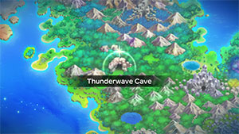
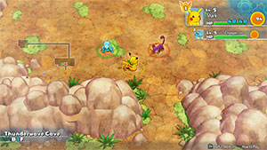

  

Dungeon that notably introduces some electric type Pokemon who can cause Paralyzed status. Unlike the DS version, most Electric types here can use Electric type attacks like Thunder Shock or Spark, so you might want to be a little careful around them if you chose a Water type starter or partner. Otherwise, the only thing to be careful of is Nidoran♀'s Poison Point ability.

# Overview

<table class="dungeonOverview">
  <tr>
    <th>Unlock</th>
    <td class="highlightYellow">Clear Tiny Woods.</td>
  </tr>
</table>

<table class="dungeonTable">
  <tr>
    <th>Floors</th>
    <td>B5F</td>
    <th>Job Rank</th>
    <td>F</td>
  </tr>
  <tr>
    <th>Radar / Scanning</th>
    <td>Yes</td>
    <th>Weather</th>
    <td>Clear</td>
  </tr>
  <tr>
    <th>Dark Halls</th>
    <td>No</td>
    <th>Boss</th>
    <td>None</td>
  </tr>
  <tr>
    <th>Max Team Size</th>
    <td>3</td>
    <th>Strong Foe</th>
    <td>None</td>
  </tr>
  <tr>
    <th>Bring Items</th>
    <td>Yes</td>
    <th>Shops</th>
    <td>No</td>
  </tr>
  <tr>
    <th>Bring Poke</th>
    <td>Yes</td>
    <th>Monster Houses</th>
    <td>No</td>
  </tr>
  <tr>
    <th>Level Reset</th>
    <td>No</td>
    <th>Mystery Houses</th>
    <td>No</td>
  </tr>
  <tr>
    <th>Clear Icon</th>
    <td>None</td>
    <th>Reward</th>
    <td>Access to Pokemon Square Unlock Mt. Steel (2 days later)</td>
  </tr>
</table>

# Needed Camps

#### Wild

|Name|Price|Pokemon|
|-|-|-|
|Wild Plains|-|Rattata, Poochyena|
|Power Plant|-|Voltorb, Elekid|
|Thunder Crag|600|Plusle, Minun|
|Safari|600|Nidoran♀|

#### Fainted

|Name|Price|Pokemon|
|-|-|-|
|Bountiful Sea|9000|Slowpoke|
|Safari|600|Rhyhorn|
|Mt. Discipline|700|Tyrogue|
|Wild Plains|-|Zigzagoon|
|Ancient Relic|700|Baltoy|
|Magnetic Quarry|700|Beldum|

# Pokemon

Rate = Recruit rate. Red stats = Stats as an enemy. Ability colors: Caution, Dangerous Move colors: Boosting, Destroys Items, Caution, Dangerous

#### Wild

|Floor|Image|Name|Rate|Lv|HP|Atk|Def|SpA|SpD|Spe|Exp|Ability + Moves|
|-|-|-|-|-|-|-|-|-|-|-|-|-|
|1-5||Rattata |14.4%|7|42 15|16 10|14 6|11 8|14 6|18 18|8|Run Away or Guts Tackle / Tail Whip / Quick Attack / Focus Energy|
|1-5||Nidoran♀ |14.4%|7|43 20|15 11|14 9|14 8|13 9|14 14|9|Poison Point or Rivalry Growl / Scratch / Tail Whip|
|1-5||Elekid |14.4%|7|43 18|16 12|14 8|18 13|15 10|21 21|11|Static Quick Attack / Leer / Thunder Shock|
|1-5||Voltorb |14.4%|7|43 15|14 7|14 6|16 12|14 6|21 21|9|Static or Soundproof Charge / Tackle / Sonic Boom / Eerie Impulse|
|3-5 Rare||Plusle |14.4%|8|46 20|16 11|14 10|19 13|16 10|21 21|14|Plus Nuzzle / Play Nice / Growl / Thunder Wave / Quick Attack / Helping Hand / Spark|
|3-5 Rare||Minun |14.4%|8|46 20|14 11|14 8|19 12|18 8|21 21|13|Minus Nuzzle / Play Nice / Growl / Thunder Wave / Quick Attack / Helping Hand / Spark|
|4-5||Poochyena |14.4%|7|43 18|18 12|14 8|12 6|12 8|15 15|10|Run Away or Quick Feet Tackle / Howl / Sand Attack|

#### Fainted

|Image|Name|Lv|HP|Atk|Def|SpA|SpD|Spe|
|-|-|-|-|-|-|-|-|-|
||Slowpoke  |9|53|19|22|20|16|15|
||Rhyhorn  |11|52|30|27|16|16|19|
||Tyrogue |9|44|22|15|15|20|18|
||Zigzagoon |9|45|18|16|13|16|20|
||Baltoy  |9|45|18|22|16|22|19|
||Beldum  |9|45|19|21|16|18|17|

# Items

#### Floor

|Name|Floors|Rate|
|-|-|-|
|Apple|1-5|9.09%|
|Poke|1-5|54.5%|
|Max Ether|1-5|12.1%|
|Blast Seed|1-5|1.21%|
|Cheri Berry|1-5|2.42%|
|Oran Berry|1-5|6.06%|
|Pecha Berry|1-5|2.42%|
|Rawst Berry|1-5|1.82%|
|Sleep Seed|1-5|1.21%|
|Tiny Reviver Seed|1-5|3.04%|
|Gravelerock|1-5|6.06%|

# Traps

|Name|
|-|
|Wonder Tile|
