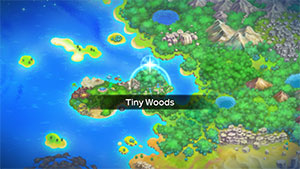
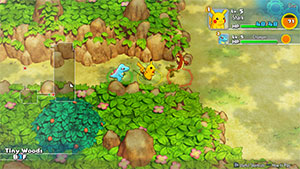

  

Tutorial dungeon where advice about the basics of dungeon gameplay appear as you progress. Items you pick up are kept after clearing the dungeon, so be sure to check every room with items. It's probably safe to say the only way to fail it is if you intentionally collapse.

# Overview

<table class="dungeonOverview">
  <tr>
    <th>Unlock</th>
    <td class="highlightYellow">Automatically proceed during the opening.</td>
  </tr>
</table>

<table class="dungeonTable">
  <tr>
    <th>Floors</th>
    <td>B3F</td>
    <th>Job Rank</th>
    <td>F</td>
  </tr>
  <tr>
    <th>Radar / Scanning</th>
    <td>Yes</td>
    <th>Weather</th>
    <td>Clear</td>
  </tr>
  <tr>
    <th>Dark Halls</th>
    <td>No</td>
    <th>Boss</th>
    <td>None</td>
  </tr>
  <tr>
    <th>Max Team Size</th>
    <td>3</td>
    <th>Strong Foe</th>
    <td>None</td>
  </tr>
  <tr>
    <th>Bring Items</th>
    <td>Yes</td>
    <th>Shops</th>
    <td>No</td>
  </tr>
  <tr>
    <th>Bring Poke</th>
    <td>Yes</td>
    <th>Monster Houses</th>
    <td>No</td>
  </tr>
  <tr>
    <th>Level Reset</th>
    <td>No</td>
    <th>Mystery Houses</th>
    <td>No</td>
  </tr>
  <tr>
    <th>Clear Icon</th>
    <td>None</td>
    <th>Reward</th>
    <td>Unlock Thunderwave Cave</td>
  </tr>
</table>

# Needed Camps

#### Wild

|Name|Price|Pokemon|
|-|-|-|
|Stump Forest|-|Wurmple|
|Flyaway Forest|500|Pidgey|
|Jungle|500|Exeggcute, Sunkern|

#### Fainted

|Name|Price|Pokemon|
|-|-|-|
|Stump Forest|-|Beedrill|
|Wild Plains|-|Rattata|
|Furnace Desert|900|Sandshrew|
|Secretive Forest|900|Spinarak|
|Thunder Crag|600|Plusle, Minun|

# Pokemon

Rate = Recruit rate. Red stats = Stats as an enemy. Ability colors: Caution, Dangerous Move colors: Boosting, Destroys Items, Caution, Dangerous

#### Wild

|Floor|Image|Name|Rate|Lv|HP|Atk|Def|SpA|SpD|Spe|Exp|Ability + Moves|
|-|-|-|-|-|-|-|-|-|-|-|-|-|
|1-3||Pidgey  |14.4%|5|41 13|11 9|11 3|10 7|10 3|13|10|Keen Eye or Tangled Feet Tackle / Sand Attack|
|1-3||Sunkern |14.4%|5|41 11|12 7|11 4|11 5|10 4|11|8|Chlorophyll or Solar Power Absorb / Growth / Ingrain|
|1-3||Exeggcute  |14.4%|5|45 15|13 10|15 7|15 9|11 7|11|11|Chlorophyll Barrage / Hypnosis / Uproar|
|2-3 Rare||Wurmple |14.4%|5|41 9|10 8|10 5|8 7|8 4|9|9|Shield Dust Tackle / String Shot / Poison Sting|

#### Fainted

|Image|Name|Lv|HP|Atk|Def|SpA|SpD|Spe|
|-|-|-|-|-|-|-|-|-|
||Beedrill  |10|44|15|16|13|13|19|
||Rattata |7|42|16|14|11|14|18|
||Sandshrew |7|43|20|20|11|11|15|
||Spinarak  |7|43|18|14|14|14|13|
||Plusle |7|45|15|13|18|15|20|
||Minun |7|45|13|13|18|17|20|

# Items

#### Floor

|Name|Floors|Rate|
|-|-|-|
|Poke|1-3|1.44%|
|Max Ether|1-3|0.12%|
|Blast Seed|1-3|7.29%|
|Oran Berry|1-3|36.4%|
|Pecha Berry|1-3|18.2%|
|Rawst Berry|1-3|10.9%|
|Sleep Seed|1-3|7.29%|
|Tiny Reviver Seed|1-3|18.2%|

#### Pretty Box

|Name|Rate|
|-|-|
|Bronze Dojo Ticket|30.8%|
|Oran Berry|11.5%|
|Calcium|0.689%|
|Carbos|0.689%|
|Iron|0.689%|
|Protein|0.689%|
|Rainbow Gummi|34.4%|
|Sitrus Berry|0.689%|
|Zinc|0.689%|
|(Random TM)|19.2%|

#### Deluxe Box

|Name|Rate|
|-|-|
|Gold Dojo Ticket|3.48%|
|Silver Dojo Ticket|13.9%|
|Reviver Seed|6.5%|
|Tiny Reviver Seed|6.5%|
|Calcium|0.934%|
|Carbos|0.934%|
|DX Gummi|23.3%|
|Iron|0.934%|
|Protein|0.934%|
|Rainbow Gummi|23.3%|
|Sitrus Berry|0.934%|
|Zinc|0.934%|
|(Random TM)|17.4%|

# Traps

|Name|
|-|
|Wonder Tile|
