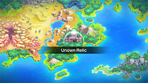
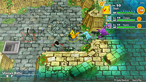

  

[Introduction]

# Overview

<table class="dungeonOverview">
  <tr>
    <th>Unlock</th>
    <td class="highlightYellow">Clear Sky Tower → Purchase "Aged Chamber A-N" or "Aged Chamber O-?" camp</td>
  </tr>
</table>

<table class="dungeonTable">
  <tr>
    <th>Floors</th>
    <td>B11F</td>
    <th>Job Rank</th>
    <td>A</td>
  </tr>
  <tr>
    <th>Radar / Scanning</th>
    <td>No</td>
    <th>Weather</th>
    <td>Clear</td>
  </tr>
  <tr>
    <th>Dark Halls</th>
    <td>2 Tiles</td>
    <th>Boss</th>
    <td>None</td>
  </tr>
  <tr>
    <th>Max Team Size</th>
    <td>3</td>
    <th>Strong Foe</th>
    <td>None</td>
  </tr>
  <tr>
    <th>Bring Items</th>
    <td>Yes</td>
    <th>Shops</th>
    <td>Yes</td>
  </tr>
  <tr>
    <th>Bring Poke</th>
    <td>Yes</td>
    <th>Monster Houses</th>
    <td>Yes</td>
  </tr>
  <tr>
    <th>Level Reset</th>
    <td>No</td>
    <th>Mystery Houses</th>
    <td>No</td>
  </tr>
  <tr>
    <th>Clear Icon</th>
    <td>None</td>
    <th>Reward</th>
    <td>Hidden Power TM x 1</td>
  </tr>
</table>

# Needed Camps

#### Wild

|Name|Price|Pokemon|
|-|-|-|
|Decrepit Lab|6000|Ditto|
|Aged Chamber A-N|9000|Unown (A-N)|
|Aged Chamber O-?|9000|Unown (O-?)|

#### Fainted

|Name|Price|Pokemon|
|-|-|-|
|Aged Chamber A-N|9000|Unown (E, H, L)|
|Aged Chamber O-?|9000|Unown (P, !, ?)|

# Pokemon

Rate = Recruit rate. Red stats = Stats as an enemy. Ability colors: Caution, Dangerous Move colors: Boosting, Destroys Items, Caution, Dangerous

#### Wild

|Floor|Image|Name|Rate|Lv|HP|Atk|Def|SpA|SpD|Spe|Exp|Ability + Moves|
|-|-|-|-|-|-|-|-|-|-|-|-|-|
|1-10||Ditto |10.8%|37|65 50|49 55|43 30|43 55|42 30|61 54|15|Limber Transform|
|1-6 8-10||Unown (A-B) |8.2%|37|65 111|55 65|43 43|55 55|42 42|61 61|75|Levitate Hidden Power|
|1-6 8-10||Unown (C-D, F-G, I-O, Q-S, U-W, Y-?) |8.2%|37|65 111|55 65|43 43|55 55|42 42|61 54|75|Levitate Hidden Power|
|1-10||Unown (E, X, P) |8.2%|37|65 111|55 65|43 43|55 55|42 42|61 54|150|Levitate Hidden Power|
|1-10||Unown (H) |8.2%|37|65 200|55 65|43 43|55 55|42 42|61 54|75|Levitate Hidden Power|
|1-6 8-10||Unown (K) |8.2%|37|65 111|55 125|43 43|55 55|42 42|61 54|75|Levitate Hidden Power|
|1-10||Unown (T) |8.2%|37|65 111|55 65|43 43|55 125|42 42|61 54|75|Levitate Hidden Power|

#### Fainted

|Image|Name|Lv|HP|Atk|Def|SpA|SpD|Spe|
|-|-|-|-|-|-|-|-|-|
||Unown (H) |39|66|56|43|56|43|65|
||Unown (E) |39|66|56|43|56|43|65|
||Unown (L) |39|66|56|43|56|43|65|
||Unown (P) |39|66|56|43|56|43|65|
||Unown (!) |41|68|58|44|58|44|69|
||Unown (?) |41|68|58|44|58|44|69|

# Items

#### Floor

|Name|Floors|Rate|
|-|-|-|
|Efficient Bandanna|1-10|1.09%|
|Goggle Specs|1-10|0.274%|
|Gold Ribbon|1-10|0.0274%|
|Heal Ribbon|1-10|0.274%|
|Insomniscope|1-10|0.274%|
|Joy Ribbon|1-10|0.274%|
|Nullify Bandanna|1-10|0.547%|
|Pecha Scarf|1-10|0.274%|
|Persim Band|1-10|0.274%|
|Recovery Scarf|1-10|0.274%|
|Scope Lens|1-10|0.274%|
|Weather Band|1-10|0.274%|
|X-Ray Specs|1-10|0.274%|
|Apple|1-10|11.0%|
|Poke|1-10|66.2%|
|Max Elixir|1-10|1.7%|
|Max Ether|1-10|5.65%|
|Blast Seed|1-10|0.586%|
|Cheri Berry|1-10|0.586%|
|Chesto Berry|1-10|0.294%|
|Empowerment Seed|1-10|0.586%|
|Eyedrop Seed|1-10|1.18%|
|Oran Berry|1-10|2.94%|
|Pecha Berry|1-10|1.46%|
|Rawst Berry|1-10|0.88%|
|Sleep Seed|1-10|0.586%|
|Stun Seed|1-10|0.294%|
|Tiny Reviver Seed|1-10|0.88%|
|Totter Seed|1-10|0.294%|
|Training Seed|1-10|0.146%|
|Warp Seed|1-10|0.294%|

#### Wall

|Name|Rate|
|-|-|
|Calcium|14.3%|
|Carbos|14.3%|
|Iron|14.3%|
|Life Seed|14.3%|
|Protein|14.3%|
|Sitrus Berry|14.3%|
|Zinc|14.3%|

#### Shop

|Name|Rate|
|-|-|
|Efficient Bandanna|2.28%|
|Goggle Specs|0.571%|
|Heal Ribbon|0.571%|
|Insomniscope|0.571%|
|Joy Ribbon|0.571%|
|Nullify Bandanna|1.15%|
|Pecha Scarf|0.571%|
|Persim Band|0.571%|
|Prosper Ribbon|0.571%|
|Recovery Scarf|0.571%|
|Scope Lens|0.571%|
|Weather Band|0.571%|
|X-Ray Specs|0.571%|
|Evolution Crystal|5.83%|
|Big Apple|6.8%|
|All Dodge Orb|0.472%|
|All Power-Up Orb|0.472%|
|All Protect Orb|0.472%|
|Bank Orb|0.472%|
|Cleanse Orb|0.472%|
|Decoy Orb|0.472%|
|Drought Orb|0.472%|
|Evasion Orb|0.472%|
|Foe-Hold Orb|0.472%|
|Foe-Seal Orb|0.472%|
|Health Orb|0.472%|
|Helper Orb|0.472%|
|Inviting Orb|0.472%|
|Lasso Orb|0.472%|
|Mobile Orb|0.472%|
|Monster Orb|0.472%|
|Nullify Orb|0.472%|
|One-Room Orb|0.472%|
|One-Shot Orb|0.472%|
|Rare Quality Orb|0.472%|
|Reset Orb|0.472%|
|Revive All Orb|0.472%|
|See-Trap Orb|0.472%|
|Spurn Orb|0.472%|
|Trapbust Orb|0.472%|
|Weather Lock Orb|0.472%|
|Wigglytuff Orb|2.35%|
|Max Elixir|9.71%|
|Ban Seed|0.868%|
|Cheri Berry|1.74%|
|Chesto Berry|1.74%|
|Decoy Seed|0.868%|
|Empowerment Seed|1.74%|
|Energy Seed|0.868%|
|Pecha Berry|4.35%|
|Pure Seed|0.868%|
|Quick Seed|2.6%|
|Rawst Berry|2.6%|
|Reviver Seed|0.868%|
|Stun Seed|1.74%|
|Tiny Reviver Seed|2.6%|
|Violent Seed|0.868%|
|Iron Spike|4.85%|
|Geo Pebble|4.85%|
|(Random TM)|9.71%|
|Guiding Wand|1.29%|
|HP-Swap Wand|0.648%|
|Pounce Wand|1.29%|
|Slow Wand|1.29%|
|Stayaway Wand|1.29%|
|Surround Wand|1.29%|
|Tunnel Wand|1.29%|
|Two-Edged Wand|0.648%|
|Warp Wand|0.648%|

# Traps

|Name|
|-|
|Wonder Tile|
|Training Switch|
|Grudge Trap|
|Sticky Trap|
|Spin Trap|
|Seal Trap|
|Pokemon Trap|
|Random Trap|
|Summon Trap|
|Apple Trap|
|Warp Trap|
|PP Leech Trap|
