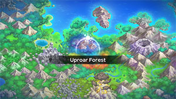
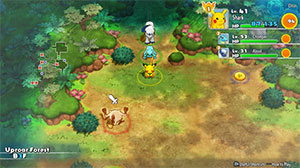

  

Shallow dungeon featuring the Chestnut food item and a boss fight with 3 Mankeys. Due to story events, you end up needing to collect 3 Chestnuts to progress after clearing this dungeon. You can almost always find 1 Chestnut on 3F, so at most it should only take 2 additional runs.

Monster Houses - rooms packed with enemies and items - can be generated starting from this dungeon. They're a decent source of items and experience points if you have room-wide attacks to quickly clear them out, but otherwise it might be best to avoid entering them unless the stairs happens to be inside.

Starting from this dungeon, Mystery Houses can appear which feature items and one Pokemon you can befriend. In order to enter a Mystery House, you'll need an Invitation which can be purchased from Kecleon in Pokemon Square. They're not always in stock at Kecleon's Shop, so it's best to stop by every day and buy any that you see.

# Overview

<table class="dungeonOverview">
  <tr>
    <th>Unlock</th>
    <td class="highlightYellow">Clear Mt. Freeze → 3 days later (Check Bulletin Board).</td>
  </tr>
</table>

<table class="dungeonTable">
  <tr>
    <th>Floors</th>
    <td>B4F</td>
    <th>Job Rank</th>
    <td>D</td>
  </tr>
  <tr>
    <th>Radar / Scanning</th>
    <td>Yes</td>
    <th>Weather</th>
    <td>Clear</td>
  </tr>
  <tr>
    <th>Dark Halls</th>
    <td>2 Tiles</td>
    <th>Boss</th>
    <td>Mankey x 3</td>
  </tr>
  <tr>
    <th>Max Team Size</th>
    <td>3</td>
    <th>Strong Foe</th>
    <td>None</td>
  </tr>
  <tr>
    <th>Bring Items</th>
    <td>Yes</td>
    <th>Shops</th>
    <td>Yes</td>
  </tr>
  <tr>
    <th>Bring Poke</th>
    <td>Yes</td>
    <th>Monster Houses</th>
    <td>Yes</td>
  </tr>
  <tr>
    <th>Level Reset</th>
    <td>No</td>
    <th>Mystery Houses</th>
    <td>Yes</td>
  </tr>
  <tr>
    <th>Clear Icon</th>
    <td>None</td>
    <th>Reward</th>
    <td>Remodel Team Base Unlock Magma Cavern</td>
  </tr>
</table>

# Needed Camps

#### Wild

|Name|Price|Pokemon|
|-|-|-|
|Vibrant Forest|800|Mankey, Aipom|
|Mushroom Forest|800|Seedot, Nuzleaf|
|Secretive Forest|900|Venonat|
|Beau Plains|2700|Roselia|

#### Fainted

|Name|Price|Pokemon|
|-|-|-|
|Stump Forest|-|Ledyba|
|Wild Plains|-|Raticate|
|Flyaway Forest|500|Noctowl|
|Tadpole Pond|900|Lotad|
|Poison Swamp|7000|Grimer, Koffing|

#### Mystery House

|Name|Price|Pokemon|
|-|-|-|
|Flyaway Forest|500|Honchkrow, Altaria|
|Boulder Cave|700|Onix, Steelix|
|Frigid Cavern|800|Jynx, Delibird|
|Darkness Ridge|800|Haunter, Misdreavus, Duskull|
|Echo Cave|2700|Wobbuffet, Dunsparce, Mawile|
|Decrepit Lab|6000|Kadabra|
|Mt. Moonview|7000|Lunatone, Solrock|
|Shallow Beach|9000|Krabby|
|Bountiful Sea|9000|Staryu|
|Treasure Sea|9000|Sharpedo|
|Serene Sea|9000|Wailord|
|Deepsea Floor|9000|Clamperl|

# Pokemon

Rate = Recruit rate. Red stats = Stats as an enemy. Ability colors: Caution, Dangerous Move colors: Boosting, Destroys Items, Caution, Dangerous

#### Wild

|Floor|Image|Name|Rate|Lv|HP|Atk|Def|SpA|SpD|Spe|Exp|Ability + Moves|
|-|-|-|-|-|-|-|-|-|-|-|-|-|
|1-3||Venonat  |10.8%|23|59 79|36 42|35 27|39 41|35 34|42 42|40|Compound Eyes or Tinted Lens Tackle / Disable / Foresight / Confusion / Supersonic / Psybeam / Poison Powder / Stun Spore|
|1-3||Aipom |10.8%|23|58 85|47 45|36 31|35 40|35 28|45 45|51|Run Away or Pickup Scratch / Tail Whip / Sand Attack / Astonish / Baton Pass / Tickle / Swift / Fury Swipes|
|1-3||Nuzleaf  |10.8%|23|58 85|39 47|31 35|35 43|31 28|37 37|48|Chlorophyll or Early Bird Razor Leaf / Pound / Harden / Growth / Torment / Fake Out / Nature Power / Razor Wind|
|2-3||Seedot |10.8%|23|58 80|39 40|31 27|35 39|31 24|37 37|37|Chlorophyll or Early Bird Bide / Harden / Growth / Nature Power / Synthesis|
|3||Roselia  |10.8%|23|54 77|35 43|31 28|46 52|36 27|39 39|45|Natural Cure or Poison Point Magical Leaf / Growth / Poison Sting / Stun Spore / Mega Drain / Leech Seed / Absorb / Grass Whistle|
|3||Mankey |10.8%|23|58 79|47 48|35 25|35 40|35 29|42 42|50|Vital Spirit or Anger Point Covet / Scratch / Low Kick / Swagger / Focus Energy / Fury Swipes / Pursuit / Karate Chop / Seismic Toss / Leer / Cross Chop ※ Can't recruit during 1st clear.|

#### Boss

|Floor|Image|Name|Rate|Lv|HP|Atk|Def|SpA|SpD|Spe|Exp|Ability + Moves|
|-|-|-|-|-|-|-|-|-|-|-|-|-|
|4||Mankey |-|23|58 358|47 47|35 35|35 35|35 35|42 42|0|Vital Spirit Low Kick / Swagger / Fury Swipes / Seismic Toss ※ First clear - Group of 3 Mankeys.|

#### Fainted

|Image|Name|Lv|HP|Atk|Def|SpA|SpD|Spe|
|-|-|-|-|-|-|-|-|-|
||Raticate |25|56|42|38|33|38|45|
||Grimer |25|69|51|38|38|42|39|
||Koffing |25|60|51|51|42|38|39|
||Noctowl  |27|71|40|36|45|45|45|
||Ledyba  |25|56|33|34|38|51|45|
||Lotad  |25|60|38|34|38|38|39|

#### Mystery House

|Image|Name|Image|Name|Image|Name|Image|Name|
|-|-|-|-|-|-|-|-|
||Kadabra ||Haunter  ||Onix  ||Steelix  |
||Krabby ||Staryu ||Jynx  ||Honchkrow  |
||Misdreavus ||Wobbuffet ||Dunsparce ||Delibird  |
||Mawile  ||Sharpedo  ||Wailord ||Altaria  |
||Lunatone  ||Solrock  ||Duskull ||Clamperl |

# Items

#### Floor

|Name|Floors|Rate|Floors|Rate|
|-|-|-|-|-|
|Cover Band|1-2|0.37%|3|0.0091%|
|Defense Scarf|1-2|0.0924%|3|0.00227%|
|Detect Band|1-2|0.0924%|3|0.00227%|
|Efficient Bandanna|1-2|0.278%|3|0.00684%|
|Fickle Specs|1-2|0.0924%|3|0.00227%|
|Gold Ribbon|1-2|0.0185%|3|0.000454%|
|Heal Ribbon|1-2|0.0924%|3|0.00227%|
|Heavy Rotation Specs|1-2|0.0924%|3|0.00227%|
|Joy Ribbon|1-2|0.0924%|3|0.00227%|
|Lucky Ribbon|1-2|0.0924%|3|0.00227%|
|Mach Ribbon|1-2|0.37%|3|0.0091%|
|Nullify Bandanna|1-2|0.185%|3|0.00454%|
|Power Band|1-2|0.0924%|3|0.00227%|
|Prosper Ribbon|1-2|0.0924%|3|0.00227%|
|Reunion Cape|1-2|0.0924%|3|0.00227%|
|Special Band|1-2|0.0924%|3|0.00227%|
|Twist Band|1-2|0.0924%|3|0.00227%|
|Zinc Band|1-2|0.0924%|3|0.00227%|
|Chestnut|1-2|2.04%|3|97.4%|
|Tiny Apple|1-2|7.62%|3|0.357%|
|Poke|1-2|55.6%|3|1.37%|
|Max Ether|1-2|4.83%|3|0.119%|
|Blast Seed|1-2|0.42%|3|0.0103%|
|Cheri Berry|1-2|0.42%|3|0.0103%|
|Chesto Berry|1-2|0.21%|3|0.00516%|
|Eyedrop Seed|1-2|0.841%|3|0.0206%|
|Oran Berry|1-2|2.1%|3|0.0516%|
|Pecha Berry|1-2|1.05%|3|0.0258%|
|Rawst Berry|1-2|0.631%|3|0.0155%|
|Sleep Seed|1-2|0.42%|3|0.0103%|
|Stun Seed|1-2|0.21%|3|0.00516%|
|Tiny Reviver Seed|1-2|0.631%|3|0.0155%|
|Totter Seed|1-2|0.21%|3|0.00516%|
|Training Seed|1-2|0.105%|3|0.00258%|
|Iron Spike|1-2|9.66%|3|0.238%|
|Geo Pebble|1-2|3.86%|3|0.0951%|
|(Random TM)|1-2|0.966%|3|0.0238%|
|Confuse Wand|1-2|1.16%|3|0.0286%|
|Petrify Wand|1-2|1.16%|3|0.0286%|
|Slow Wand|1-2|1.16%|3|0.0286%|
|Slumber Wand|1-2|0.58%|3|0.0143%|
|Stayaway Wand|1-2|0.87%|3|0.0214%|
|Switcher Wand|1-2|0.29%|3|0.00715%|
|Tunnel Wand|1-2|0.29%|3|0.00715%|
|Whirlwind Wand|1-2|0.29%|3|0.00715%|

#### Shop

|Name|Rate|
|-|-|
|Cover Band|0.823%|
|Defense Scarf|0.206%|
|Detect Band|0.206%|
|Efficient Bandanna|0.619%|
|Fickle Specs|0.206%|
|Gold Ribbon|0.041%|
|Heal Ribbon|0.206%|
|Heavy Rotation Specs|0.206%|
|Joy Ribbon|0.206%|
|Lucky Ribbon|0.206%|
|Mach Ribbon|0.823%|
|Nullify Bandanna|0.41%|
|Power Band|0.206%|
|Prosper Ribbon|0.206%|
|Reunion Cape|0.206%|
|Special Band|0.206%|
|Twist Band|0.206%|
|Zinc Band|0.206%|
|Apple|21.5%|
|All Dodge Orb|1.05%|
|All Power-Up Orb|1.05%|
|Foe-Hold Orb|3.17%|
|Foe-Seal Orb|2.11%|
|Nullify Orb|1.05%|
|Petrify Orb|1.05%|
|Quick Orb|1.05%|
|Rollcall Orb|1.05%|
|Slow Orb|1.05%|
|Slumber Orb|2.11%|
|Totter Orb|1.05%|
|Trawl Orb|0.527%|
|Wigglytuff Orb|10.5%|
|Max Ether|10.8%|
|Iron Spike|21.5%|
|Geo Pebble|8.6%|
|Confuse Wand|1.08%|
|Petrify Wand|1.08%|
|Slow Wand|1.08%|
|Slumber Wand|0.538%|
|Stayaway Wand|0.807%|
|Switcher Wand|0.269%|
|Tunnel Wand|0.269%|
|Whirlwind Wand|0.269%|

# Traps

|Name|
|-|
|Wonder Tile|
|Training Switch|
|Spin Trap|
|Slumber Trap|
|Spiky Trap|
|Gust Trap|
|Slow Trap|
|Blast Trap|
|Hunger Trap|
|Seal Trap|
|Warp Trap|
|PP Leech Trap|
