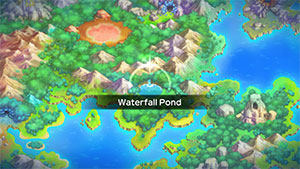
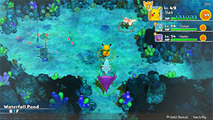
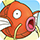

  

# Overview

<table class="dungeonOverview">
  <tr>
    <th>Unlock</th>
    <td class="highlightYellow">Clear Sky Tower.</td>
  </tr>
</table>

<table class="dungeonTable">
  <tr>
    <th>Floors</th>
    <td>B19F</td>
    <th>Job Rank</th>
    <td>B</td>
  </tr>
  <tr>
    <th>Radar / Scanning</th>
    <td>No</td>
    <th>Weather</th>
    <td>Rain: 4, 9, 14, 18F</td>
  </tr>
  <tr>
    <th>Dark Halls</th>
    <td>2 Tiles</td>
    <th>Boss</th>
    <td>None</td>
  </tr>
  <tr>
    <th>Max Team Size</th>
    <td>3</td>
    <th>Strong Foe</th>
    <td>Gyarados</td>
  </tr>
  <tr>
    <th>Bring Items</th>
    <td>Yes</td>
    <th>Shops</th>
    <td>Yes</td>
  </tr>
  <tr>
    <th>Bring Poke</th>
    <td>Yes</td>
    <th>Monster Houses</th>
    <td>Yes</td>
  </tr>
  <tr>
    <th>Level Reset</th>
    <td>No</td>
    <th>Mystery Houses</th>
    <td>Yes (Fixed: 10F)</td>
  </tr>
  <tr>
    <th>Clear Icon</th>
    <td>None</td>
    <th>Reward</th>
    <td>Evolution Crystal x 2, Deluxe Box x 1</td>
  </tr>
</table>

Optional post-game dungeon featuring many Water types that don't appear in sea type dungeons. Gyarados (Strong Foe) often causes accidents thanks to its high stats + Hydro Pump or Hyper Beam. Food items (including seeds and berries) are shop-exclusive and can't be found on the ground. Evolution Crystals (1000 Poke) can be found in shops, so don't forget to bring some money.

Enemies with Swift Swim can overlap with some Rain Dance users / rainy weather floors:

- Swift Swim: Lotad (1-3F), Goldeen (1-5F), Surskit (4-7F), Magikarp (7-11F), Lombre (13-16F), Feebas (16-18F)
- Rain Dance: Lotad (1-3F), Poliwag (1-5F), Gyarados (5-18F), Poliwhirl (9-13F)

# Needed Camps

#### Wild

|Name|Price|Pokemon|
|-|-|-|
|Tadpole Pond|900|Poliwag, Poliwhirl, Poliwrath, Lotad, Lombre, Surskit, Masquerain|
|Rub-a-Dub River|3000|Goldeen, Totodile|
|Turtleshell Pond|6000|Squirtle, Corphish|
|Gourd Swamp|9000|Wooper, Quagsire, Mudkip, Marshtomp, Barboach, Whiscash|
|Waterfall Lake|9000|Magikarp, Gyarados, Feebas|

#### Fainted

|Name|Price|Pokemon|
|-|-|-|
|Stump Forest|-|Caterpie, Wurmple|
|Jungle|500|Sunkern, Tangrowth|
|Thunder Crag|600|Electrike|
|Safari|600|Nidoran♂, Miltank|
|Vibrant Forest|800|Pichu|
|Mushroom Forest|800|Parasect|
|Poison Swamp|7000|Koffing|

#### Mystery House

|Name|Price|Pokemon|
|-|-|-|
|Jungle|500|Exeggcute|
|Mt. Green|700|Shuckle|
|Overgrown Forest|700|Bonsly, Sudowoodo|
|Vibrant Forest|800|Munchlax|
|Mushroom Forest|800|Parasect|
|Echo Cave|2700|Wynaut, Wobbuffet, Dunsparce|
|Decrepit Lab|6000|Ditto|
|Treasure Sea|9000|Octillery|

# Pokemon

Rate = Recruit rate. Red stats = Stats as an enemy. Ability colors: Caution, Dangerous Move colors: Boosting, Destroys Items, Caution, Dangerous

#### Wild

|Floor|Image|Name|Rate|Lv|HP|Atk|Def|SpA|SpD|Spe|Exp|Ability + Moves|
|-|-|-|-|-|-|-|-|-|-|-|-|-|
|1-3||Mudkip |8.2%|30|68 103|53 55|51 38|48 50|51 35|50 47|80|Torrent Tackle / Growl / Water Gun / Bide / Mud-Slap / Foresight / Mud Sport / Rock Throw / Protect|
|1-3||Lotad  |8.2%|30|65 105|45 53|40 33|45 52|45 39|47 47|74|Swift Swim or Rain Dish Astonish / Growl / Absorb / Mist / Bubble / Natural Gift / Mega Drain / Bubble Beam / Nature Power / Rain Dance / Giga Drain|
|1-5||Poliwag |14.4%|30|65 93|45 45|45 32|40 46|40 34|53 53|70|Water Absorb or Damp Water Sport / Water Gun / Hypnosis / Bubble / Double Slap / Rain Dance / Body Slam / Bubble Beam / Mud Shot|
|1-5||Goldeen |8.2%|30|65 103|60 46|45 36|45 46|45 34|50 50|48|Swift Swim or Water Veil Peck / Tail Whip / Water Sport / Flail / Supersonic / Fury Attack / Aqua Ring / Water Pulse / Horn Attack / Agility|
|1-5||Barboach  |8.2%|30|75 111|50 54|45 36|50 48|45 34|47 47|75|Oblivious or Anticipation Mud-Slap / Mud Sport / Water Sport / Water Gun / Mud Bomb / Amnesia / Water Pulse / Magnitude / Snore / Rest / Aqua Tail|
|3-6||Totodile |8.2%|30|65 118|52 58|51 41|45 55|47 37|47 47|80|Torrent Scratch / Leer / Water Gun / Rage / Bite / Scary Face / Ice Fang / Flail / Crunch / Chip Away|
|4-7||Surskit  |8.2%|30|65 104|45 54|45 39|50 50|45 39|47 47|77|Swift Swim Bubble / Quick Attack / Sweet Scent / Water Sport / Bubble Beam / Agility / Mist / Haze / Aqua Jet|
|5-18 Foe|  |Gyarados  |-6.4%|60|75 580|57 150|55 60|64 150|60 60|134 200|790|Intimidate Bite / Thrash / Leer / Twister / Ice Fang / Aqua Tail / Scary Face / Dragon Rage / Crunch / Hydro Pump / Hyper Beam / Hurricane / Rain Dance / Dragon Dance ※ Friend Bow required to recruit.|
|6-9||Wooper  |8.2%|30|75 95|50 56|50 35|45 51|45 36|44 44|80|Damp or Water Absorb Water Gun / Tail Whip / Mud Sport / Mud Shot / Amnesia / Mud Bomb / Slam / Yawn|
|6-12||Corphish |8.2%|30|65 114|65 64|50 40|50 58|40 41|47 47|85|Hyper Cutter or Shell Armor Bubble / Harden / Vise Grip / Leer / Bubble Beam / Protect / Double Hit / Knock Off / Night Slash|
|7-11||Magikarp |8.2%|30|56 91|44 40|45 30|45 40|50 30|90 50|60|Swift Swim Splash / Tackle / Flail|
|8-12||Squirtle |8.2%|30|65 108|45 62|52 36|45 62|46 37|47 47|82|Torrent Tackle / Tail Whip / Water Gun / Bite / Rapid Spin / Bubble / Water Pulse / Withdraw / Protect / Aqua Tail|
|9-13||Poliwhirl |8.2%|30|65 103|45 55|45 37|40 56|40 39|53 53|83|Water Absorb or Damp Water Sport / Water Gun / Hypnosis / Bubble / Double Slap / Rain Dance / Body Slam / Bubble Beam|
|12-14||Masquerain  |10.8%|30|65 99|45 48|45 37|50 64|45 38|47 47|80|Intimidate Quiver Dance / Bug Buzz / Whirlwind / Ominous Wind / Bubble / Air Cutter / Stun Spore / Water Sport / Scary Face / Gust / Sweet Scent / Quick Attack|
|13-18||Marshtomp  |8.2%|30|68 118|53 65|51 43|48 60|51 41|50 47|92|Torrent Tackle / Growl / Water Gun / Bide / Mud Shot / Mud-Slap / Rock Slide / Foresight / Mud Bomb|
|13-16||Lombre  |8.2%|30|65 116|45 63|40 38|45 62|45 41|47 47|87|Swift Swim or Rain Dish Astonish / Growl / Absorb / Fake Out / Fury Swipes / Bubble Beam / Bubble / Water Sport / Nature Power|
|15-18||Quagsire  |8.2%|30|75 120|50 66|50 39|45 63|45 37|44 44|88|Damp or Water Absorb Water Gun / Tail Whip / Mud Sport / Mud Shot / Amnesia / Mud Bomb / Slam|
|15-18||Whiscash  |8.2%|30|75 121|50 67|45 40|50 70|45 38|47 47|100|Oblivious or Anticipation Thrash / Zen Headbutt / Belch / Rest / Tickle / Mud-Slap / Mud Sport / Snore / Water Sport / Water Gun / Mud Bomb / Amnesia / Water Pulse / Magnitude / Aqua Tail|
|16-18||Poliwrath  |8.2%|30|65 115|45 69|45 42|40 66|40 40|53 53|95|Water Absorb or Damp Submission / Circle Throw / Hypnosis / Bubble Beam / Double Slap|
|16-18 Rare||Feebas |8.2%|30|75 91|45 53|45 36|35 53|60 36|75 50|65|Swift Swim or Oblivious Splash / Tackle / Flail|

#### Fainted

|Image|Name|Lv|HP|Atk|Def|SpA|SpD|Spe|
|-|-|-|-|-|-|-|-|-|
||Caterpie |32|61|36|46|37|36|46|
||Nidoran♂ |32|66|52|46|46|41|52|
||Parasect  |34|68|63|52|47|46|48|
||Koffing |32|66|61|61|51|46|51|
||Sunkern |32|66|51|46|61|51|46|
||Pichu |32|71|48|47|67|46|60|
||Miltank |34|77|53|63|42|46|61|
||Wurmple |32|61|41|41|36|36|45|
||Electrike |32|66|51|46|61|46|58|
||Tangrowth |34|77|63|62|63|41|51|

#### Mystery House

|Image|Name|Image|Name|Image|Name|Image|Name|
|-|-|-|-|-|-|-|-|
||Parasect  ||Exeggcute  ||Ditto ||Bonsly |
||Sudowoodo ||Wynaut ||Wobbuffet ||Dunsparce |
||Shuckle  ||Octillery ||Munchlax |||

# Items

#### Floor

|Name|Floors|Rate|
|-|-|-|
|Efficient Bandanna|1-18|1.85%|
|Goggle Specs|1-18|0.462%|
|Gold Ribbon|1-18|0.0462%|
|Heal Ribbon|1-18|0.462%|
|Insomniscope|1-18|0.462%|
|Joy Ribbon|1-18|0.462%|
|Nullify Bandanna|1-18|0.923%|
|Pecha Scarf|1-18|0.462%|
|Persim Band|1-18|0.462%|
|Prosper Ribbon|1-18|0.462%|
|Recovery Scarf|1-18|0.462%|
|Scope Lens|1-18|0.462%|
|Weather Band|1-18|0.462%|
|X-Ray Specs|1-18|0.462%|
|Poke|1-18|69.1%|
|All Dodge Orb|1-18|0.597%|
|All Power-Up Orb|1-18|0.597%|
|All Protect Orb|1-18|0.597%|
|Cleanse Orb|1-18|0.597%|
|Decoy Orb|1-18|0.597%|
|Drought Orb|1-18|0.597%|
|Escape Orb|1-18|1.19%|
|Foe-Hold Orb|1-18|1.79%|
|Foe-Seal Orb|1-18|1.19%|
|Health Orb|1-18|0.597%|
|Inviting Orb|1-18|0.597%|
|Lasso Orb|1-18|0.597%|
|Nullify Orb|1-18|0.597%|
|One-Room Orb|1-18|0.597%|
|Petrify Orb|1-18|0.597%|
|Quick Orb|1-18|0.597%|
|Rare Quality Orb|1-18|0.597%|
|Revive All Orb|1-18|0.597%|
|Rollcall Orb|1-18|0.597%|
|Slow Orb|1-18|0.597%|
|Slumber Orb|1-18|1.19%|
|Totter Orb|1-18|0.597%|
|Trawl Orb|1-18|0.298%|
|Max Elixir|1-18|1.52%|
|Max Ether|1-18|5.06%|

#### Shop

|Name|Rate|
|-|-|
|Efficient Bandanna|3.62%|
|Goggle Specs|0.906%|
|Heal Ribbon|0.906%|
|Insomniscope|0.906%|
|Joy Ribbon|0.906%|
|Nullify Bandanna|1.82%|
|Pecha Scarf|0.906%|
|Persim Band|0.906%|
|Prosper Ribbon|0.906%|
|Recovery Scarf|0.906%|
|Scope Lens|0.906%|
|Weather Band|0.906%|
|X-Ray Specs|0.906%|
|Evolution Crystal|7.69%|
|Big Apple|8.97%|
|All Dodge Orb|1.04%|
|All Power-Up Orb|1.04%|
|All Protect Orb|1.04%|
|Bank Orb|1.04%|
|Cleanse Orb|1.04%|
|Decoy Orb|1.04%|
|Drought Orb|1.04%|
|Evasion Orb|1.04%|
|Foe-Hold Orb|1.04%|
|Foe-Seal Orb|1.04%|
|Health Orb|1.04%|
|Helper Orb|1.04%|
|Inviting Orb|1.04%|
|Lasso Orb|1.04%|
|Mobile Orb|1.04%|
|Monster Orb|1.04%|
|Nullify Orb|1.04%|
|One-Room Orb|1.04%|
|One-Shot Orb|1.04%|
|Rare Quality Orb|1.04%|
|Reset Orb|1.04%|
|Revive All Orb|1.04%|
|See-Trap Orb|1.04%|
|Spurn Orb|1.04%|
|Trapbust Orb|1.04%|
|Weather Lock Orb|1.04%|
|Wigglytuff Orb|5.17%|
|Max Elixir|12.8%|
|(Random TM)|12.8%|
|Guiding Wand|1.37%|
|HP-Swap Wand|0.687%|
|Pounce Wand|1.37%|
|Slow Wand|1.37%|
|Stayaway Wand|1.37%|
|Surround Wand|1.37%|
|Tunnel Wand|1.37%|
|Two-Edged Wand|0.687%|
|Warp Wand|0.687%|

# Traps

|Name|
|-|
|Wonder Tile|
|Training Switch|
|Spin Trap|
|Trip Trap|
|Slumber Trap|
|Poison Trap|
|Spiky Trap|
|Gust Trap|
|Slow Trap|
|Blast Trap|
|Hunger Trap|
|Seal Trap|
|Pokemon Trap|
|Apple Trap|
|Warp Trap|
|PP Leech Trap|
