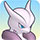

  

[Introduction]

# Overview

<table class="dungeonOverview">
  <tr>
    <th>Unlock</th>
    <td class="highlightYellow">Clear Mt. Faraway.</td>
  </tr>
</table>

<table class="dungeonTable">
  <tr>
    <th>Floors</th>
    <td>B20F</td>
    <th>Job Rank</th>
    <td>⭐︎⭐︎</td>
  </tr>
  <tr>
    <th>Radar / Scanning</th>
    <td>No</td>
    <th>Weather</th>
    <td>Clear</td>
  </tr>
  <tr>
    <th>Dark Halls</th>
    <td>2 Tiles</td>
    <th>Boss</th>
    <td>Mewtwo</td>
  </tr>
  <tr>
    <th>Max Team Size</th>
    <td>3</td>
    <th>Strong Foe</th>
    <td>Zangoose</td>
  </tr>
  <tr>
    <th>Bring Items</th>
    <td>Yes</td>
    <th>Shops</th>
    <td>Yes</td>
  </tr>
  <tr>
    <th>Bring Poke</th>
    <td>Yes</td>
    <th>Monster Houses</th>
    <td>Yes</td>
  </tr>
  <tr>
    <th>Level Reset</th>
    <td>No</td>
    <th>Mystery Houses</th>
    <td>Yes (Fixed: 10F)</td>
  </tr>
  <tr>
    <th>Clear Icon</th>
    <td>None</td>
    <th>Reward</th>
    <td>Mewtwo joins</td>
  </tr>
</table>

# Needed Camps

#### Wild

|Name|Price|Pokemon|
|-|-|-|
|Wild Plains|-|Drowzee, Hypno, Zangoose|
|Sky-Blue Plains|-|Girafarig, Smeargle, Ralts, Kirlia|
|Flyaway Forest|500|Natu|
|Thunder Crag|600|Chimecho|
|Mt. Discipline|700|Meditite, Medicham|
|Mt. Green|700|Spoink, Grumpig, Spinda|
|Ancient Relic|700|Claydol|
|Magnetic Quarry|700|Beldum, Metang|
|Frigid Cavern|800|Jynx|
|Echo Cave|2700|Wynaut, Wobbuffet|
|Decrepit Lab|6000|Abra, Kadabra, Mr. Mime|
|Mt. Moonview|7000|Lunatone|

#### Fainted

|Name|Price|Pokemon|
|-|-|-|
|Wild Plains|-|Ekans|
|Stump Forest|-|Yanmega|
|Sky-Blue Plains|-|Happiny, Snubbull|
|Flyaway Forest|500|Honchkrow|
|Thunder Crag|600|Chingling|
|Safari|600|Kangaskhan, Miltank|
|Mt. Green|700|Spinda|
|Mt. Discipline|700|Meditite|
|Overgrown Forest|700|Heracross|
|Secretive Forest|900|Pineco|
|Turtleshell Pond|6000|Crawdaunt|
|Poison Swamp|7000|Muk|
|Serene Sea|9000|Mantyke|

#### Mystery House

- You must recruit regular Celebi before shiny Celebi can appear in a Mystery House.

 

|Name|Price|Pokemon|
|-|-|-|
|Healing Forest|-|Celebi (shiny)|
|Sky-Blue Plains|-|Wigglytuff, Blissey, Granbull|
|Flyaway Forest|500|Togekiss|
|Safari|600|Miltank|
|Mt. Green|700|Spinda|
|Echo Cave|2700|Mawile|
|Turtleshell Pond|6000|Azumarill|
|Mt. Moonview|7000|Clefable|

# Pokemon

Rate = Recruit rate. Red stats = Stats as an enemy. Ability colors: Caution, Dangerous Move colors: Boosting, Destroys Items, Caution, Dangerous

#### Wild

|Floor|Image|Name|Rate|Lv|HP|Atk|Def|SpA|SpD|Spe|Exp|Ability + Moves|
|-|-|-|-|-|-|-|-|-|-|-|-|-|
|1-3||Wynaut |8.2%|60|109 185|55 60|55 59|55 60|50 53|95 115|185|Shadow Tag Splash / Charm / Encore / Safeguard / Mirror Coat / Counter / Destiny Bond|
|1-4||Girafarig  |8.2%|60|88 180|73 80|55 59|73 80|55 58|94 114|180|Inner Focus or Early Bird Power Swap / Guard Swap / Astonish / Tackle / Growl / Baton Pass / Stomp / Odor Sleuth / Assurance / Double Hit / Zen Headbutt / Psybeam / Nasty Plot / Agility / Confusion / Crunch / Psychic|
|1-5||Natu  |8.2%|60|88 175|73 80|55 59|83 90|55 58|94 114|185|Synchronize or Early Bird Leer / Guard Swap / Miracle Eye / Wish / Lucky Chant / Power Swap / Psychic / Future Sight / Confuse Ray / Teleport / Night Shade / Psycho Shift / Me First / Peck / Stored Power / Ominous Wind|
|1-5||Drowzee |8.2%|60|88 165|73 80|55 59|73 81|70 73|91 111|180|Insomnia or Forewarn Pound / Headbutt / Disable / Meditate / Nasty Plot / Poison Gas / Confusion / Wake-Up Slap / Psych Up / Psybeam / Synchronoise / Zen Headbutt / Psychic / Hypnosis / Swagger / Psyshock|
|1-5||Spoink |8.2%|60|88 170|55 60|55 59|73 80|70 73|101 121|170|Thick Fat or Own Tempo Splash / Psywave / Odor Sleuth / Rest / Psybeam / Psych Up / Confuse Ray / Magic Coat / Zen Headbutt / Bounce / Psyshock / Payback / Psychic / Snore / Power Gem|
|1-5||Beldum  |14.4%|60|88 175|96 110|60 64|79 90|55 58|88 108|200|Clear Body Take Down|
|1-6||Jynx  |8.2%|60|88 170|64 70|50 54|91 100|60 63|104 124|190|Oblivious or Forewarn Lick / Wring Out / Ice Punch / Blizzard / Pound / Powder Snow / Wake-Up Slap / Lovely Kiss / Mean Look / Double Slap / Draining Kiss / Avalanche / Body Slam / Heart Stamp / Fake Tears / Perish Song|
|1-6||Ralts  |1.6%|60|86 165|63 70|50 54|87 100|50 53|77 88|195|Synchronize or Trace Teleport / Confusion / Double Team / Growl / Disarming Voice / Imprison / Lucky Chant / Magical Leaf / Charm / Draining Kiss / Calm Mind / Psychic / Future Sight / Heal Pulse / Hypnosis / Dream Eater / Stored Power|
|1-8||Abra |8.2%|60|83 160|63 70|50 54|99 110|55 58|107 127|185|Synchronize or Inner Focus Teleport|
|4-7||Smeargle |8.2%|60|83 161|50 60|50 59|50 60|50 59|80 121|179|Own Tempo or Technician Sketch|
|4-8||Meditite  |14.4%|60|88 180|64 70|55 59|64 71|55 58|101 121|180|Pure Power Feint / Meditate / Force Palm / Detect / Mind Reader / Calm Mind / Confusion / Bide / Hidden Power / High Jump Kick / Endure / Psych Up / Counter / Recover / Acupressure / Power Trick / Reversal|
|5-19 Foe|  |Zangoose |-6.4%|60|88 555|91 150|60 80|64 150|60 80|113 200|820|Immunity Scratch / Leer / Quick Attack / Pursuit / Fury Cutter / Slash / False Swipe / Hone Claws / Crush Claw / Revenge / Embargo / Detect / X-Scissor / Taunt / Swords Dance / Close Combat ※ Friend Bow required to recruit.|
|7-12||Mr. Mime  |8.2%|60|83 185|55 60|55 59|83 90|70 73|113 124|185|Soundproof or Filter Substitute / Magical Leaf / Role Play / Quick Guard / Recycle / Pound / Mimic / Power Swap / Guard Swap / Safeguard / Confusion / Copycat / Meditate / Trick / Misty Terrain / Psywave / Baton Pass / Reflect / Double Slap / Encore / Barrier / Light Screen / Wide Guard / Psybeam / Psychic|
|8-12||Lunatone  |10.8%|60|88 190|64 70|55 59|83 91|60 63|91 111|190|Levitate Power Gem / Psyshock / Rock Throw / Tackle / Harden / Confusion / Psychic / Moonblast / Rock Polish / Psywave / Embargo / Rock Slide / Cosmic Power / Hypnosis / Heal Block / Future Sight / Magic Room / Explosion / Stone Edge|
|8-12||Metang  |10.8%|60|88 185|96 110|60 64|79 90|55 58|88 127|200|Clear Body Confusion / Metal Claw / Miracle Eye / Magnet Rise / Pursuit / Bullet Punch / Take Down / Zen Headbutt / Psychic / Iron Defense / Agility / Meteor Mash / Scary Face / Hyper Beam|
|9-14||Hypno |8.2%|60|88 175|73 80|55 59|73 81|70 73|91 111|175|Insomnia or Forewarn Pound / Headbutt / Disable / Meditate / Nasty Plot / Poison Gas / Confusion / Wake-Up Slap / Psych Up / Psybeam / Synchronoise / Zen Headbutt / Psychic / Nightmare / Psyshock / Switcheroo / Hypnosis / Swagger / Future Sight|
|9-13||Medicham  |14.4%|60|88 178|64 70|55 59|64 71|55 58|101 121|178|Pure Power Bide / Confusion / Detect / Calm Mind / Meditate / Endure / Feint / Force Palm / Acupressure / Mind Reader / Psych Up / Hidden Power / Fire Punch / Ice Punch / Reversal / Counter / High Jump Kick / Zen Headbutt / Power Trick / Recover / Thunder Punch ※ Can Mega Evolve.|
|10-15||Kirlia  |8.2%|60|86 165|63 70|50 54|87 100|50 53|77 118|188|Synchronize or Trace Teleport / Confusion / Double Team / Growl / Disarming Voice / Imprison / Lucky Chant / Magical Leaf / Charm / Draining Kiss / Calm Mind / Psychic / Future Sight / Heal Pulse / Hypnosis / Dream Eater / Stored Power|
|10-17||Spinda |10.8%|60|88 188|64 82|55 62|64 82|55 62|88 125|183|Own Tempo or Tangled Feet Tackle / Copycat / Feint Attack / Flail / Double-Edge / Dizzy Punch / Psybeam / Psych Up / Sucker Punch / Hypnosis / Teeter Dance / Thrash / Uproar|
|11-16||Wobbuffet |8.2%|60|109 205|55 60|55 59|55 60|50 53|95 105|155|Shadow Tag Counter / Mirror Coat / Destiny Bond / Safeguard|
|12-17||Chimecho |10.8%|60|88 174|64 70|55 59|83 91|55 58|91 130|185|Levitate Healing Wish / Synchronoise / Wrap / Growl / Astonish / Confusion / Yawn / Psywave / Extrasensory / Heal Bell / Heal Pulse / Take Down / Safeguard / Double-Edge / Uproar|
|13-19||Kadabra |8.2%|60|83 172|63 70|50 54|99 110|55 58|107 127|190|Synchronize or Inner Focus Kinesis / Teleport / Reflect / Disable / Confusion / Miracle Eye / Psycho Cut / Ally Switch / Future Sight / Telekinesis / Psybeam / Psychic / Role Play / Trick / Recover|
|16-19||Grumpig |8.2%|60|88 166|55 60|55 59|73 80|70 73|101 121|185|Thick Fat or Own Tempo Splash / Power Gem / Belch / Payback / Psych Up / Confuse Ray / Magic Coat / Odor Sleuth / Zen Headbutt / Psywave / Teeter Dance / Psybeam / Rest / Snore / Psyshock / Psychic / Bounce|
|16-19||Claydol  |10.8%|60|88 180|73 80|70 74|64 71|70 73|91 111|200|Levitate Teleport / Power Split / Cosmic Power / Guard Split / Heal Block / Confusion / Rock Tomb / Psybeam / Explosion / Mud-Slap / Rapid Spin / Power Trick / Self-Destruct / Extrasensory / Harden / Imprison / Earth Power / Sandstorm / Ancient Power / Hyper Beam|

#### Boss

- Mewtwo's mega evolution for phase 2 is selected at random.

 

|Floor|Image|Name|Rate|Lv|HP|Atk|Def|SpA|SpD|Spe|Exp|Ability + Moves|
|-|-|-|-|-|-|-|-|-|-|-|-|-|
|20 Phase 1||Mewtwo |-|70|100 2400|100 120|64 84|120 120|63 63|120 120|0|Pressure Psychic / Shadow Ball / Aura Sphere / Recover|
|20 Phase 2||Mega Mewtwo X  |100%|70|105 2405|101 121|69 89|117 117|68 68|114 114|0|Steadfast Psychic / Shadow Ball / Aura Sphere / Brutal Swing|
|20 Phase 2||Mega Mewtwo Y |100%|70|105 2405|101 121|69 89|117 117|68 68|114 114|0|Insomnia Psystrike / Shadow Ball / Calm Mind / ???|

#### Fainted

|Image|Name|Lv|HP|Atk|Def|SpA|SpD|Spe|
|-|-|-|-|-|-|-|-|-|
||Ekans |62|89|74|56|65|56|105|
||Muk |64|96|86|57|66|61|96|
||Happiny |62|124|51|46|72|61|92|
||Kangaskhan |62|95|84|61|56|56|98|
||Yanmega  |64|96|76|62|95|51|121|
||Honchkrow  |64|96|95|52|86|51|118|
||Pineco |62|89|84|76|65|56|108|
||Snubbull |62|95|93|61|65|61|111|
||Heracross  |64|91|95|57|57|61|121|
||Mantyke  |62|89|56|56|74|76|114|
||Miltank |62|95|74|76|56|61|117|
||Meditite  |62|89|65|56|65|56|105|
||Spinda |62|89|65|56|65|56|92|
||Crawdaunt  |62|89|93|61|74|51|79|
||Chingling |62|89|65|56|84|56|95|

#### Mystery House

|Image|Name|Image|Name|Image|Name|Image|Name|Image|Name|
|-|-|-|-|-|-|-|-|-|-|
||Clefable ||Wigglytuff  ||Blissey ||Togekiss  ||Azumarill  |
||Granbull ||Miltank ||Mawile  ||Spinda ||Celebi *1  |

*1: You must recruit regular Celebi before shiny Celebi can appear in a Mystery House.

# Items

#### Floor

|Name|Floors|Rate|
|-|-|-|
|Big Eater Belt|1-19|0.18%|
|Efficient Bandanna|1-19|0.718%|
|Goggle Specs|1-19|0.18%|
|Gold Ribbon|1-19|0.018%|
|Heal Ribbon|1-19|0.18%|
|Insomniscope|1-19|0.18%|
|Joy Ribbon|1-19|0.18%|
|Munch Belt|1-19|0.18%|
|Nullify Bandanna|1-19|0.359%|
|Pecha Scarf|1-19|0.18%|
|Persim Band|1-19|0.18%|
|Recovery Scarf|1-19|0.18%|
|Scope Lens|1-19|0.18%|
|Sneak Scarf|1-19|0.18%|
|Stamina Band|1-19|0.18%|
|Weather Band|1-19|0.18%|
|X-Ray Specs|1-19|0.18%|
|Apple|1-19|3.01%|
|Poke|1-19|63.3%|
|Max Elixir|1-19|1.39%|
|Max Ether|1-19|4.63%|
|Blast Seed|1-19|0.607%|
|Cheri Berry|1-19|0.607%|
|Chesto Berry|1-19|0.304%|
|Empowerment Seed|1-19|0.607%|
|Eyedrop Seed|1-19|1.21%|
|Heal Seed|1-19|607|
|Oran Berry|1-19|3.04%|
|Pecha Berry|1-19|1.52%|
|Rawst Berry|1-19|0.911%|
|Sleep Seed|1-19|0.607%|
|Stun Seed|1-19|0.304%|
|Tiny Reviver Seed|1-19|0.911%|
|Totter Seed|1-19|0.304%|
|Training Seed|1-19|0.152%|
|Warp Seed|1-19|0.304%|
|Geo Pebble|1-19|9.04%|
|Confuse Wand|1-19|0.158%|
|Guiding Wand|1-19|0.158%|
|HP-Swap Wand|1-19|0.158%|
|Petrify Wand|1-19|0.158%|
|Pounce Wand|1-19|0.316%|
|Slow Wand|1-19|0.158%|
|Slumber Wand|1-19|0.316%|
|Stayaway Wand|1-19|0.476%|
|Surround Wand|1-19|0.316%|
|Switcher Wand|1-19|0.158%|
|Tunnel Wand|1-19|0.158%|
|Two-Edged Wand|1-19|0.158%|
|Warp Wand|1-19|0.158%|
|Whirlwind Wand|1-19|0.158%|

# Shop

|Name|Rate|
|-|-|
|Big Eater Belt|0.429%|
|Efficient Bandanna|1.71%|
|Goggle Specs|0.429%|
|Heal Ribbon|0.429%|
|Insomniscope|0.429%|
|Joy Ribbon|0.429%|
|Munch Belt|0.429%|
|Nullify Bandanna|0.858%|
|Pecha Scarf|0.429%|
|Persim Band|0.429%|
|Prosper Ribbon|0.429%|
|Recovery Scarf|0.429%|
|Scope Lens|0.429%|
|Sneak Scarf|0.429%|
|Stamina Band|0.429%|
|Weather Band|0.429%|
|X-Ray Specs|0.429%|
|Evolution Crystal|5.41%|
|Big Apple|13.5%|
|All Dodge Orb|0.45%|
|All Power-Up Orb|0.45%|
|All Protect Orb|0.45%|
|Cleanse Orb|0.45%|
|Decoy Orb|0.45%|
|Drought Orb|0.45%|
|Evasion Orb|0.45%|
|Foe-Hold Orb|1.35%|
|Foe-Seal Orb|0.9%|
|Health Orb|0.45%|
|Helper Orb|0.45%|
|Inviting Orb|0.45%|
|Lasso Orb|0.45%|
|Nullify Orb|0.45%|
|One-Room Orb|0.45%|
|Rare Quality Orb|0.45%|
|Reset Orb|0.45%|
|Revive All Orb|0.45%|
|See-Trap Orb|0.45%|
|Storage Orb|0.45%|
|Trapbust Orb|0.45%|
|Weather Lock Orb|0.45%|
|Wigglytuff Orb|2.25%|
|Max Elixir|9.01%|
|Ban Seed|0.749%|
|Cheri Berry|1.5%|
|Chesto Berry|1.5%|
|Decoy Seed|0.749%|
|Empowerment Seed|1.5%|
|Energy Seed|0.749%|
|Heal Seed|1.5%|
|Pecha Berry|3.76%|
|Pure Seed|0.749%|
|Quick Seed|2.25%|
|Rawst Berry|2.25%|
|Reviver Seed|0.749%|
|Stun Seed|1.5%|
|Tiny Reviver Seed|2.25%|
|Violent Seed|0.749%|
|Iron Spike|4.5%|
|Geo Pebble|4.5%|
|(Random TM)|9.01%|
|Guiding Wand|1.2%|
|HP-Swap Wand|0.601%|
|Pounce Wand|1.2%|
|Slow Wand|1.2%|
|Stayaway Wand|1.2%|
|Surround Wand|1.2%|
|Tunnel Wand|1.2%|
|Two-Edged Wand|0.601%|
|Warp Wand|0.601%|

# Traps

|Name|
|-|
|Wonder Tile|
|Training Switch|
|Spin Trap|
|Slumber Trap|
|Poison Trap|
|Spiky Trap|
|Gust Trap|
|Slow Trap|
|Hunger Trap|
|Warp Trap|
