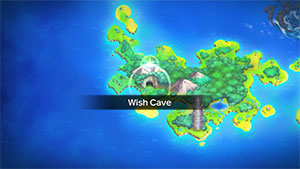
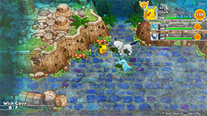
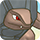

  

[Introduction]

# Overview

<table class="dungeonOverview">
  <tr>
    <th>Unlock</th>
    <td class="highlightYellow">Clear Pitfall Valley → Talk to Medicham / Ekans (4 days) → 1 day later (Check Bulletin Board).</td>
  </tr>
</table>

<table class="dungeonTable">
  <tr>
    <th>Floors</th>
    <td>20F (1st) / 99F (2nd+)</td>
    <th>Job Rank</th>
    <td>⭐︎</td>
  </tr>
  <tr>
    <th>Radar / Scanning</th>
    <td>No</td>
    <th>Weather</th>
    <td>Random: 5, 10, 15, 20, 25, 30, 35, 40, 45, 50, 55, 60F</td>
  </tr>
  <tr>
    <th>Dark Halls</th>
    <td>2 Tiles</td>
    <th>Boss</th>
    <td>Jirachi (2nd clear)</td>
  </tr>
  <tr>
    <th>Max Team Size</th>
    <td>3</td>
    <th>Strong Foe</th>
    <td>None</td>
  </tr>
  <tr>
    <th>Bring Items</th>
    <td>Yes</td>
    <th>Shops</th>
    <td>Yes</td>
  </tr>
  <tr>
    <th>Bring Poke</th>
    <td>Yes</td>
    <th>Monster Houses</th>
    <td>Yes</td>
  </tr>
  <tr>
    <th>Level Reset</th>
    <td>Yes</td>
    <th>Mystery Houses</th>
    <td>No</td>
  </tr>
  <tr>
    <th>Clear Icon</th>
    <td>None</td>
    <th>Reward</th>
    <td>Have a wish granted by Jirachi.</td>
  </tr>
</table>

# Wishes

- You can still have a wish granted in Rescue Team DX even after Jirachi has been recruited.

 

|Wish|Effect|
|-|-|
|Lots of money|Receive 20,000 Poke.|
|Lots of items|Receive 16 random items found in Wish Cave.|
|A Camp|Receive a rescue team camp for free. (Return to wish selection if all camps have already been obtained)|
|More Strength|Receive 16 items that permanently boost stats.|
|Something Good!|Receive an option to recruit a random (non-boss / non-Kecleon / non-Gen 4+) Pokemon. (Pokemon who shows up won't be a duplicate unless all available Pokemon are in the team)|

# Pokemon

Rate = Recruit rate. Red stats = Stats as an enemy. Ability colors: Caution, Dangerous Move colors: Boosting, Destroys Items, Caution, Dangerous

#### Wild

|Floor|Image|Name|Rate|Lv|HP|Atk|Def|SpA|SpD|Spe|Exp|Ability + Moves|
|-|-|-|-|-|-|-|-|-|-|-|-|-|
|1-3||Magnemite  |8.2%|8|41 15|15 8|18 5|24 9|15 5|18 7|18|Magnet Pull or Sturdy Tackle / Thunder Shock / Supersonic / Thunder Wave|
|1-4||Jigglypuff  |16.9%|8|53 20|14 10|11 8|14 10|11 8|12 19|18|Cute Charm or Competitive Sing / Defense Curl / Pound|
|1-4||Cleffa |16.9%|9|45 15|13 8|13 7|16 10|16 7|15 13|20|Cute Charm or Magic Guard Pound / Charm / Encore / Sing|
|1-4 97-98||Mime Jr.  |16.9%|7|40 18|11 9|14 8|18 10|20 8|17 19|15|Soundproof or Filter Tickle / Barrier / Pound / Confusion / Copycat ※ Mime Jr. Statue required to spawn.|
|4-7 97-98||Ekans |8.2%|8|44 26|18 14|15 10|15 18|15 10|18 21|18|Intimidate or Shed Skin Wrap / Leer / Poison Sting|
|5-7||Rattata |14.4%|9|44 17|19 9|16 7|13 9|16 7|21 13|20|Run Away or Guts Quick Attack / Focus Energy / Tackle / Tail Whip|
|5-10||Togepi |16.9%|9|44 15|13 8|19 7|18 8|19 7|15 13|20|Hustle or Serene Grace Sweet Kiss / Charm / Metronome / Growl|
|7-10||Aron  |14.4%|10|46 18|25 11|27 9|16 10|16 8|17 19|23|Sturdy or Rock Head Mud-Slap / Metal Claw / Headbutt / Tackle / Harden|
|8-10||Voltorb |14.4%|10|46 20|18 9|18 8|21 10|18 8|26 19|23|Soundproof or Static Charge / Eerie Impulse / Sonic Boom / Tackle / Spark|
|11-13||Ralts  |1.6%|11|43 21|16 12|16 10|19 12|17 10|20 21|25|Synchronize or Trace Growl / Confusion / Disarming Voice / Double Team / Teleport|
|11-14||Tyrogue |14.4%|11|45 21|26 12|17 10|17 14|24 10|22 21|25|Guts or Steadfast Fake Out / Helping Hand / Foresight / Tackle|
|11-14||Meditite  |14.4%|12|48 26|20 18|22 15|20 18|20 14|23 22|30|Pure Power Bide / Meditate / Confusion / Detect / Endure|
|12-14||Geodude  |14.4%|12|46 26|28 20|28 17|17 18|17 14|19 22|30|Rock Head or Sturdy Tackle / Defense Curl / Rock Polish / Mud Sport / Rollout / Magnitude|
|12-14||Baltoy  |14.4%|13|49 34|24 21|29 16|22 19|29 16|25 24|30|Levitate Mud-Slap / Confusion / Rock Tomb / Harden / Rapid Spin / Heal Block|
|12-20 30-39 53-59 70-79 90-98||Castform |8.2%|13|50 34|26 23|23 16|23 21|23 16|26 24|30|Forecast Tackle / Water Gun / Powder Snow / Ember|
|13-17||Natu  |8.2%|13|49 38|25 21|22 16|29 23|22 15|27 24|30|Synchronize or Early Bird Lucky Chant / Night Shade / Teleport / Peck / Leer|
|15-17||Beldum  |14.4%|14|50 43|26 23|27 18|23 25|24 18|24 25|35|Clear Body Take Down|
|17-20||Abra |8.2%|14|46 43|20 20|20 17|35 20|23 17|31 25|35|Synchronize or Inner Focus Teleport ※ Always drops a Max Ether.|
|17-22||Machop |8.2%|14|53 43|34 25|25 18|23 30|25 17|26 25|35|Guts or No Guard Focus Energy / Leer / Karate Chop / Low Kick / Foresight / Low Sweep|
|17-23||Swinub  |14.4%|15|55 50|33 26|27 18|23 23|23 18|26 26|40|Oblivious or Snow Cloak Tackle / Odor Sleuth / Mud Sport / Powder Snow / Mud-Slap / Endure|
|20-22 97-98||Meowth |16.9%|12|48 45|22 26|20 18|20 26|20 18|28 26|30|Pickup or Technician Scratch / Growl / Bite / Fake Out|
|22-26||Medicham  |14.4%|37|70 132|49 60|48 43|49 53|47 43|57 67|150|Pure Power Bide / Thunder Punch / Fire Punch / Detect / Mind Reader / Zen Headbutt / Meditate / Confusion / Force Palm / Feint / Calm Mind / High Jump Kick / Endure / Hidden Power / Ice Punch / Psych Up / Acupressure / Power Trick ※ Can Mega Evolve.|
|23-28||Dugtrio |8.2%|26|56 108|44 58|35 35|35 53|39 35|49 53|95|Sand Veil or Arena Trap Mud-Slap / Sand Tomb / Night Slash / Tri Attack / Magnitude / Sand Attack / Scratch / Mud Bomb / Sucker Punch / Rototiller / Astonish / Bulldoze / Growl|
|24-29||Trapinch |14.4%|16|49 50|31 31|23 22|23 28|23 20|27 27|45|Hyper Cutter or Arena Trap Sand Attack / Bite / Mud-Slap / Bide / Rock Slide / Feint Attack / Bulldoze / Sand Tomb|
|26-32||Spinarak  |14.4%|16|51 50|34 28|26 20|26 28|26 20|25 27|45|Swarm or Insomnia Poison Sting / String Shot / Constrict / Absorb / Infestation / Night Shade / Scary Face|
|28-33||Electrike |10.8%|16|51 50|28 28|26 20|34 28|26 20|33 27|45|Static or Lightning Rod Leer / Thunder Wave / Odor Sleuth / Quick Attack / Tackle / Spark / Howl|
|31-35||Gligar  |10.8%|17|54 52|37 32|38 26|24 29|28 23|34 28|50|Hyper Cutter or Sand Veil Poison Sting / Sand Attack / Harden / Knock Off / Fury Cutter / Quick Attack|
|33-37||Nidoran♂ |10.8%|17|52 58|31 29|27 21|27 26|24 21|31 28|50|Poison Point or Rivalry Leer / Focus Energy / Poison Sting / Double Kick / Peck|
|33-37||Electabuzz |8.2%|30|65 110|50 62|45 38|60 56|50 38|56 57|115|Static Quick Attack / Leer / Thunder Punch / Thunder Shock / Swift / Shock Wave / Low Kick / Light Screen / Electro Ball / Thunder Wave|
|36-43||Tauros |10.8%|18|55 61|40 41|33 27|25 34|29 24|38 29|55|Intimidate or Anger Point Tackle / Tail Whip / Pursuit / Rage / Horn Attack / Scary Face|
|36-40||Manectric |10.8%|26|61 108|43 58|39 35|52 53|39 35|49 53|95|Static or Lightning Rod Fire Fang / Tackle / Electric Terrain / Leer / Howl / Thunder Wave / Spark / Thunder Fang / Quick Attack / Bite / Odor Sleuth ※ Can Mega Evolve.|
|38-42||Kadabra |8.2%|18|49 65|25 29|25 23|43 44|28 25|37 30|55|Synchronize or Inner Focus Kinesis / Teleport / Confusion / Disable|
|39-42||Murkrow  |10.8%|19|62 59|44 36|27 23|41 44|27 23|35 30|60|Insomnia or Super Luck Peck / Wing Attack / Astonish / Haze / Pursuit|
|42-46||Ariados  |10.8%|22|57 87|45 43|34 31|34 43|34 31|33 45|75|Swarm or Insomnia Poison Sting / String Shot / Constrict / Absorb / Focus Energy / Night Shade / Scary Face / Fell Stinger / Infestation / Venom Drench / Shadow Sneak / Bug Bite / Swords Dance|
|43-44||Dunsparce |10.8%|19|63 65|34 36|30 25|30 33|30 25|32 30|60|Serene Grace or Run Away Rage / Defense Curl / Rollout / Yawn / Spite / Pursuit / Screech / Mud-Slap / Ancient Power|
|44-49||Nincada  |10.8%|20|55 78|41 34|29 29|27 34|27 24|42 31|65|Compound Eyes Scratch / Sand Attack / Mud-Slap / Absorb / Fury Swipes / Harden|
|44-49||Shedinja  |-25.0%|20|22 65|47 37|25 26|29 30|27 24|40 31|65|Wonder Guard Scratch / Fury Swipes / Sand Attack / Harden / Absorb / Spite ※ Spawns after Nincada faints.|
|44-49||Bagon |10.8%|20|55 65|42 37|35 26|31 30|27 24|33 31|65|Rock Head Rage / Leer / Bite / Headbutt / Ember / Dragon Breath|
|46-50||Golbat  |10.8%|22|57 79|37 43|34 31|33 39|34 31|40 45|75|Inner Focus Screech / Absorb / Supersonic / Bite / Astonish / Confuse Ray / Air Cutter / Wing Attack|
|47-50||Nidorina |10.8%|21|56 83|33 33|32 27|32 33|29 25|34 33|70|Poison Point or Rivalry Scratch / Poison Sting / Double Kick / Growl / Tail Whip / Fury Swipes|
|47-50||Nidorino |10.8%|21|56 83|36 36|32 27|32 33|29 25|36 33|70|Poison Point or Rivalry Leer / Focus Energy / Poison Sting / Double Kick / Peck / Fury Attack|
|47-50||Magmar |10.8%|30|65 121|60 62|45 38|60 56|50 38|53 57|115|Flame Body Ember / Smokescreen / Flame Burst / Leer / Smog / Feint Attack / Fire Spin / Fire Punch / Clear Smog / Confuse Ray|
|47-52||Illumise |10.8%|22|58 84|34 35|34 28|38 46|34 28|41 36|75|Oblivious or Tinted Lens Tackle / Sweet Scent / Quick Attack / Play Nice / Moonlight / Struggle Bug / Charm / Wish|
|51-53||Forretress  |10.8%|31|66 123|60 63|66 47|46 51|45 39|46 58|120|Sturdy Mirror Shot / Autotomize / Bug Bite / Heavy Slam / Zap Cannon / Protect / Magnet Rise / Toxic Spikes / Tackle / Self-Destruct / Take Down / Spikes / Rapid Spin / Natural Gift / Bide|
|51-55||Electrode |8.2%|30|65 121|45 56|45 38|50 62|45 38|59 57|115|Soundproof or Static Magnetic Flux / Charge / Sonic Boom / Tackle / Eerie Impulse / Charge Beam / Spark / Light Screen / Screech / Swift / Electro Ball / Self-Destruct / Rollout|
|51-56||Hitmonlee |8.2%|23|54 85|50 48|31 29|31 40|46 32|41 39|80|Limber or Reckless Jump Kick / Meditate / Focus Energy / Double Kick / Reversal / Mega Kick / Revenge / Rolling Kick / Brick Break / Close Combat|
|51-56||Hitmonchan |8.2%|23|54 85|50 48|31 29|31 32|46 32|41 39|80|Keen Eye or Iron Fist Feint / Comet Punch / Close Combat / Mach Punch / Counter / Focus Punch / Revenge / Bullet Punch / Pursuit / Agility|
|53-56||Numel  |10.8%|23|59 85|47 36|35 27|47 36|35 27|34 39|80|Oblivious or Simple Growl / Focus Energy / Flame Burst / Amnesia / Magnitude / Lava Plume / Tackle / Ember|
|53-64||Ditto |10.8%|23|54 85|36 36|31 29|31 36|31 27|37 39|80|Limber Transform|
|56-61 71-77||Magcargo  |-2.2%|38|66 135|50 60|63 48|56 60|48 43|52 68|155|Magma Armor or Flame Body Harden / Shell Smash / Earth Power / Smog / Ancient Power / Rock Throw / Amnesia / Flame Burst / Clear Smog / Lava Plume / Incinerate / Rock Slide / Yawn / Ember|
|57-59||Torkoal |10.8%|23|59 85|40 40|52 35|40 40|36 29|32 39|80|White Smoke or Drought Ember / Smog / Withdraw / Fire Spin / Rapid Spin / Smokescreen / Curse / Flame Wheel|
|58-61||Rhyhorn  |10.8%|24|67 85|57 40|49 32|32 40|32 27|36 39|85|Lightning Rod or Rock Head Horn Attack / Tail Whip / Scary Face / Fury Attack / Smack Down / Bulldoze / Stomp|
|59-63||Piloswine  |10.8%|33|76 125|63 64|52 40|46 52|46 40|53 60|130|Oblivious or Snow Cloak Peck / Fury Attack / Ancient Power / Ice Fang / Odor Sleuth / Mud Sport / Endure / Mud Bomb / Powder Snow / Mud-Slap / Icy Wind / Take Down|
|60-64||Arbok |10.8%|24|59 95|41 43|36 31|36 39|36 31|41 45|85|Intimidate or Shed Skin Thunder Fang / Ice Fang / Fire Fang / Crunch / Wrap / Poison Sting / Glare / Leer / Bite / Screech / Acid|
|61-64||Pineco |10.8%|24|59 85|49 36|53 32|36 36|36 27|35 39|85|Sturdy Tackle / Protect / Self-Destruct / Bide / Bug Bite / Take Down / Natural Gift / Rapid Spin|
|62-64||Lairon  |10.8%|32|66 124|62 63|66 47|41 51|41 36|46 59|125|Sturdy or Rock Head Tackle / Harden / Mud-Slap / Roar / Metal Claw / Rock Tomb / Headbutt / Iron Head / Rock Slide / Take Down / Protect / Metal Sound|
|62-64||Metang  |10.8%|25|60 86|42 42|43 33|38 38|38 30|39 42|90|Clear Body Confusion / Metal Claw / Take Down / Magnet Rise / Pursuit|
|65-69||Shelgon |10.8%|30|65 121|60 62|50 42|45 56|40 35|47 57|115|Rock Head Protect / Rage / Ember / Leer / Bite / Dragon Breath / Headbutt / Crunch / Focus Energy / Dragon Claw|
|65-71||Zangoose |10.8%|25|60 86|56 51|38 30|38 38|38 30|45 42|90|Immunity Scratch / Quick Attack / Fury Cutter / Revenge / Hone Claws / Leer / Slash / Pursuit|
|71-75||Koffing |10.8%|26|61 87|52 39|53 35|44 39|39 28|41 45|95|Levitate Poison Gas / Tackle / Smokescreen / Sludge / Self-Destruct / Clear Smog / Assurance / Smog / Haze|
|71-76||Rhydon  |-2.2%|42|84 130|82 75|64 51|49 62|44 42|56 72|175|Lightning Rod or Rock Head Hammer Arm / Horn Attack / Stomp / Take Down / Tail Whip / Fury Attack / Scary Face / Smack Down / Bulldoze / Chip Away / Rock Blast / Drill Run / Horn Drill / Stone Edge|
|72-75||Graveler  |10.8%|26|56 116|53 57|53 39|35 52|35 32|38 52|95|Rock Head or Sturdy Tackle / Defense Curl / Rock Polish / Self-Destruct / Rollout / Rock Throw / Bulldoze / Magnitude / Smack Down / Mud Sport|
|72-76||Magby |10.8%|26|61 87|53 43|39 28|52 39|43 28|47 45|95|Flame Body Ember / Smokescreen / Flame Burst / Leer / Smog / Feint Attack / Fire Spin / Clear Smog / Confuse Ray|
|74-76||Nidoqueen  |10.8%|27|62 80|41 45|40 36|40 45|36 32|42 48|100|Poison Point or Rivalry Scratch / Double Kick / Superpower / Tail Whip / Poison Sting / Chip Away|
|76-79||Golem  |10.8%|27|57 116|54 69|54 42|36 57|36 35|39 52|100|Rock Head or Sturdy Heavy Slam / Tackle / Defense Curl / Mud Sport / Rock Polish / Magnitude / Bulldoze / Steamroller / Rock Throw / Smack Down / Self-Destruct|
|77-79||Nidoking  |10.8%|27|62 88|45 45|40 32|40 41|36 32|45 48|100|Poison Point or Rivalry Peck / Focus Energy / Poison Sting / Megahorn / Double Kick / Chip Away|
|79-84||Porygon2 |8.2%|27|62 88|45 45|45 36|54 45|45 36|42 48|100|Trace or Download Conversion / Tackle / Conversion 2 / Zap Cannon / Magic Coat / Recover / Magnet Rise / Defense Curl / Agility / Psybeam|
|80-85||Grimer |10.8%|28|72 101|56 52|42 34|42 63|46 31|44 51|105|Stench or Sticky Hold Minimize / Poison Gas / Mud Bomb / Harden / Mud-Slap / Disable / Sludge / Pound / Fling|
|80-85||Camerupt  |8.2%|33|67 125|62 64|46 40|62 58|46 40|47 60|130|Magma Armor or Solid Rock Rock Slide / Tackle / Fissure / Growl / Eruption / Take Down / Focus Energy / Lava Plume / Flame Burst / Amnesia / Magnitude / Earth Power / Ember / Curse ※ Can Mega Evolve.|
|81-84||Shuppet |10.8%|28|63 93|61 52|42 31|47 63|42 31|47 51|105|Insomnia or Frisk Knock Off / Screech / Night Shade / Spite / Will-O-Wisp / Shadow Sneak / Feint Attack / Hex / Curse|
|83-88||Hitmontop |8.2%|28|58 84|60 52|37 38|37 47|56 38|49 51|105|Intimidate or Technician Feint / Focus Energy / Close Combat / Detect / Rolling Kick / Quick Attack / Endeavor / Revenge / Rapid Spin / Counter / Pursuit|
|86-89||Solrock  |10.8%|30|65 106|60 57|50 39|45 57|45 35|50 52|115|Levitate Tackle / Rock Throw / Cosmic Power / Psywave / Rock Polish / Rock Slide / Confusion / Fire Spin / Flare Blitz / Harden / Embargo / Psychic|
|86-98||Weezing |10.8%|35|68 129|63 65|62 46|53 52|47 41|57 64|140|Levitate Poison Gas / Tackle / Smokescreen / Sludge / Self-Destruct / Clear Smog / Assurance / Smog / Haze / Gyro Ball / Double Hit / Sludge Bomb|
|90-93||Dusclops |10.8%|37|65 132|57 66|68 52|49 60|62 52|58 67|150|Pressure Fire Punch / Ice Punch / Confuse Ray / Shadow Punch / Future Sight / Leer / Gravity / Night Shade / Will-O-Wisp / Bind / Disable / Astonish / Foresight / Pursuit / Shadow Sneak / Curse / Thunder Punch|
|90-95||Scizor  |10.8%|30|65 106|70 69|50 39|45 52|45 35|50 52|115|Swarm or Technician Feint / Quick Attack / Bullet Punch / Leer / Fury Cutter / Pursuit / Agility / False Swipe / Focus Energy / Slash / Metal Claw ※ Can Mega Evolve.|
|94-96||Flygon  |-2.2%|45|73 136|65 70|45 49|55 63|45 49|65 75|190|Levitate Sonic Boom / Dragon Claw / Bulldoze / Sand Tomb / Sand Attack / Mud-Slap / Dragon Breath / Dragon Dance / Bide / Feint Attack / Rock Slide / Sandstorm / Screech / Dragon Tail / Supersonic / Earthquake / Earth Power / Uproar / Hyper Beam|
|94-98||Metagross  |-2.2%|45|76 150|73 75|55 59|62 70|50 49|62 75|190|Clear Body Confusion / Take Down / Metal Claw / Magnet Rise / Hammer Arm / Pursuit / Bullet Punch / Miracle Eye / Agility / Zen Headbutt / Scary Face / Psychic / Meteor Mash ※ Can Mega Evolve.|
|94-98||Claydol  |10.8%|36|69 130|54 65|62 47|48 65|62 47|56 66|145|Levitate Teleport / Heal Block / Cosmic Power / Power Split / Guard Split / Confusion / Rock Tomb / Psybeam / Hyper Beam / Mud-Slap / Rapid Spin / Power Trick / Self-Destruct / Extrasensory / Harden / Ancient Power|
|97-98||Salamence  |-2.2%|50|82 158|85 75|57 54|68 72|47 54|68 82|215|Intimidate Scary Face / Dragon Tail / Fire Fang / Thunder Fang / Rage / Headbutt / Fly / Bite / Dragon Breath / Ember / Leer / Focus Energy / Dragon Claw / Protect / Crunch / Zen Headbutt / Flamethrower ※ Can Mega Evolve.|

#### Boss

|Floor|Image|Name|Rate|Lv|HP|Atk|Def|SpA|SpD|Spe|Exp|Ability + Moves|
|-|-|-|-|-|-|-|-|-|-|-|-|-|
|99||Jirachi  |100%|35|78 1478|63 63|52 52|63 63|52 52|63 63|0|Serene Grace Zen Headbutt / Confusion / Swift / Lucky Chant ※ Second clear.|

# Items

#### Floor

|Name|
|-|
|Cover Band|
|Defense Scarf|
|Efficient Bandanna|
|Explosive Band|
|Fickle Specs|
|Fierce Bandanna|
|Friend Bow|
|Gold Ribbon|
|Heal Ribbon|
|Heavy Rotation Specs|
|Insomniscope|
|Joy Ribbon|
|Lock-On Specs|
|Lucky Ribbon|
|Mach Ribbon|
|Munch Belt|
|No-Stick Cap|
|Nullify Bandanna|
|Pass Scarf|
|Pecha Scarf|
|Persim Band|
|Power Band|
|Prosper Ribbon|
|Reunion Cape|
|Scope Lens|
|Sneak Scarf|
|Special Band|
|Twist Band|
|Warp Scarf|
|Weather Band|
|X-Ray Specs|
|Zinc Band|
|Apple|
|Big Apple|
|Poke|
|All Dodge Orb|
|All Power-Up Orb|
|All Protect Orb|
|Cleanse Orb|
|Decoy Orb|
|Drought Orb|
|Escape Orb|
|Evasion Orb|
|Foe-Hold Orb|
|Foe-Seal Orb|
|Hail Orb|
|Health Orb|
|Lasso Orb|
|Luminous Orb|
|Mobile Orb|
|Monster Orb|
|Nullify Orb|
|One-Room Orb|
|One-Shot Orb|
|Petrify Orb|
|Quick Orb|
|Radar Orb|
|Rainy Orb|
|Rare Quality Orb|
|Reset Orb|
|Revive All Orb|
|Rollcall Orb|
|Sandy Orb|
|Scanner Orb|
|See-Trap Orb|
|Slow Orb|
|Slumber Orb|
|Spurn Orb|
|Sunny Orb|
|Totter Orb|
|Trapbust Orb|
|Trawl Orb|
|Weather Lock Orb|
|Max Ether|
|Ban Seed|
|Blast Seed|
|Blinker Seed|
|Cheri Berry|
|Chesto Berry|
|Decoy Seed|
|Doom Seed|
|Empowerment Seed|
|Energy Seed|
|Eyedrop Seed|
|Heal Seed|
|Joy Seed|
|Oran Berry|
|Pecha Berry|
|Pure Seed|
|Quick Seed|
|Rawst Berry|
|Reviver Seed|
|Sleep Seed|
|Stun Seed|
|Tiny Reviver Seed|
|Totter Seed|
|Violent Seed|
|Warp Seed|
|Iron Spike|
|Silver Spike|
|Geo Pebble|
|Gravelerock|
|(Random TM)|
|Confuse Wand|
|Guiding Wand|
|HP-Swap Wand|
|Petrify Wand|
|Pounce Wand|
|Slow Wand|
|Slumber Wand|
|Stayaway Wand|
|Surround Wand|
|Switcher Wand|
|Tunnel Wand|
|Two-Edged Wand|
|Warp Wand|
|Whirlwind Wand|

#### Shop

|Name|
|-|
|Cover Band|
|Defense Scarf|
|Efficient Bandanna|
|Explosive Band|
|Fickle Specs|
|Fierce Bandanna|
|Friend Bow|
|Heal Ribbon|
|Heavy Rotation Specs|
|Insomniscope|
|Joy Ribbon|
|Lock-On Specs|
|Lucky Ribbon|
|Mach Ribbon|
|Munch Belt|
|No-Stick Cap|
|Nullify Bandanna|
|Pass Scarf|
|Pecha Scarf|
|Persim Band|
|Power Band|
|Prosper Ribbon|
|Reunion Cape|
|Scope Lens|
|Sneak Scarf|
|Special Band|
|Twist Band|
|Warp Scarf|
|Weather Band|
|X-Ray Specs|
|Zinc Band|
|Apple|
|All Dodge Orb|
|All Power-Up Orb|
|All Protect Orb|
|Cleanse Orb|
|Decoy Orb|
|Drought Orb|
|Evasion Orb|
|Foe-Hold Orb|
|Foe-Seal Orb|
|Hail Orb|
|Health Orb|
|Lasso Orb|
|Luminous Orb|
|Mobile Orb|
|Monster Orb|
|Nullify Orb|
|One-Room Orb|
|One-Shot Orb|
|Petrify Orb|
|Quick Orb|
|Radar Orb|
|Rainy Orb|
|Rare Quality Orb|
|Reset Orb|
|Revive All Orb|
|Rollcall Orb|
|Sandy Orb|
|Scanner Orb|
|See-Trap Orb|
|Slow Orb|
|Slumber Orb|
|Spurn Orb|
|Sunny Orb|
|Totter Orb|
|Trapbust Orb|
|Trawl Orb|
|Weather Lock Orb|
|Max Ether|
|Ban Seed|
|Blast Seed|
|Blinker Seed|
|Cheri Berry|
|Chesto Berry|
|Decoy Seed|
|Doom Seed|
|Empowerment Seed|
|Energy Seed|
|Eyedrop Seed|
|Heal Seed|
|Joy Seed|
|Pecha Berry|
|Pure Seed|
|Quick Seed|
|Rawst Berry|
|Reviver Seed|
|Sleep Seed|
|Stun Seed|
|Tiny Reviver Seed|
|Totter Seed|
|Violent Seed|
|Warp Seed|
|Iron Spike|
|Silver Spike|
|Geo Pebble|
|Gravelerock|
|(Random TM)|
|Confuse Wand|
|Guiding Wand|
|HP-Swap Wand|
|Petrify Wand|
|Pounce Wand|
|Slow Wand|
|Slumber Wand|
|Stayaway Wand|
|Surround Wand|
|Switcher Wand|
|Tunnel Wand|
|Two-Edged Wand|
|Warp Wand|
|Whirlwind Wand|

# Traps

|Name|
|-|
|Wonder Tile|
|Grudge Trap|
|Sticky Trap|
|Spin Trap|
|Trip Trap|
|Slumber Trap|
|Big Blast Trap|
|Poison Trap|
|Spiky Trap|
|Gust Trap|
|Mud Trap|
|Slow Trap|
|Blast Trap|
|Hunger Trap|
|Seal Trap|
|Random Trap|
|Summon Trap|
|Apple Trap|
|Warp Trap|
|PP Leech Trap|
