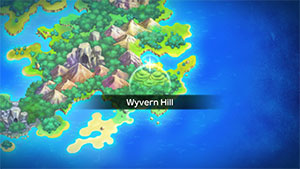
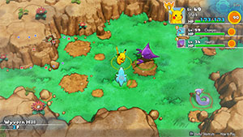
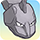

  

# Overview

<table class="dungeonOverview">
  <tr>
    <th>Unlock</th>
    <td class="highlightYellow">Clear Sky Tower → Purchase "Dragon Cave" camp</td>
  </tr>
</table>

<table class="dungeonTable">
  <tr>
    <th>Floors</th>
    <td>30F</td>
    <th>Job Rank</th>
    <td>B</td>
  </tr>
  <tr>
    <th>Radar / Scanning</th>
    <td>No</td>
    <th>Weather</th>
    <td>Clear</td>
  </tr>
  <tr>
    <th>Dark Halls</th>
    <td>No</td>
    <th>Boss</th>
    <td>None</td>
  </tr>
  <tr>
    <th>Max Team Size</th>
    <td>3</td>
    <th>Strong Foe</th>
    <td>Exeggcute</td>
  </tr>
  <tr>
    <th>Bring Items</th>
    <td>Yes</td>
    <th>Shops</th>
    <td>Yes</td>
  </tr>
  <tr>
    <th>Bring Poke</th>
    <td>Yes</td>
    <th>Monster Houses</th>
    <td>Yes</td>
  </tr>
  <tr>
    <th>Level Reset</th>
    <td>No</td>
    <th>Mystery Houses</th>
    <td>Yes</td>
  </tr>
  <tr>
    <th>Clear Icon</th>
    <td>None</td>
    <th>Reward</th>
    <td>Deluxe Box x 5</td>
  </tr>
</table>

Optional post-game dungeon featuring lots of Dragon types, and a mediocre reward. Enemies besides Totodile and Ludicolo are weak to Ice type attacks, so Blizzard is very effective here. Exeggcute (Strong Foe) can know extremely dangerous moves like Barrage, Bullet Seed, and Uproar, so bring lots of Tiny Reviver Seeds if your party's stats are still on the low side.

# Needed Camps

#### Wild

|Name|Price|Pokemon|
|-|-|-|
|Flyaway Forest|500|Altaria|
|Jungle|500|Oddish, Exeggcute|
|Tadpole Pond|900|Ludicolo|
|Withering Desert|900|Vibrava, Flygon|
|Mystic Lake|2500|Dratini, Dragonair|
|Beau Plains|2700|Jumpluff|
|Rub-a-Dub River|3000|Totodile|
|Dragon Cave|3000|Bagon, Shelgon, Salamence|

#### Fainted

|Name|Price|Pokemon|
|-|-|-|
|Stump Forest|-|Caterpie|
|Jungle|500|Vileplume|
|Flyaway Forest|500|Togetic|
|Safari|600|Miltank|
|Vibrant Forest|800|Skitty|
|Frigid Cavern|800|Swinub, Snorunt|
|Secretive Forest|900|Venomoth, Pineco|
|Mystic Lake|2500|Dragonair|
|Beau Plains|2700|Taillow|
|Rub-a-Dub River|3000|Goldeen|
|Dragon Cave|3000|Bagon, Salamence|
|Mt. Moonview|7000|Cleffa|

#### Mystery House

|Name|Price|Pokemon|
|-|-|-|
|Darkness Ridge|-|Haunter, Misdreavus, Duskull|
|Flyaway Forest|500|Honchkrow, Altaria|
|Boulder Cave|700|Onix, Steelix|
|Frigid Cavern|800|Jynx, Delibird|
|Echo Cave|2700|Wobbuffet, Dunsparce, Mawile|
|Decrepit Lab|6000|Kadabra|
|Mt. Moonview|7000|Lunatone, Solrock|
|Serene Sea|9000|Wailord|
|Shallow Beach|9000|Krabby|
|Bountiful Sea|9000|Staryu|
|Treasure Sea|9000|Sharpedo|
|Deepsea Floor|9000|Clamperl|

# Pokemon

Rate = Recruit rate. Red stats = Stats as an enemy. Ability colors: Caution, Dangerous Move colors: Boosting, Destroys Items, Caution, Dangerous

#### Wild

|Floor|Image|Name|Rate|Lv|HP|Atk|Def|SpA|SpD|Spe|Exp|Ability + Moves|
|-|-|-|-|-|-|-|-|-|-|-|-|-|
|1-4||Bagon |10.8%|30|65 113|60 58|50 33|45 55|40 33|47 47|74|Rock Head Rage / Dragon Claw / Leer / Headbutt / Bite / Dragon Breath / Crunch / Ember / Focus Energy|
|1-5||Dratini |8.2%|30|65 93|50 52|45 30|45 50|45 30|50 50|64|Shed Skin Warp / Leer / Thunder Wave / Twister / Slam / Dragon Rage / Agility|
|4-24||Jumpluff  |10.8%|30|60 117|40 50|40 32|40 58|45 32|50 50|76|Chlorophyll or Leaf Guard Splash / Absorb / Synthesis / Tackle / Tail Whip / Mega Drain / Stun Spore / Poison Powder / Sleep Powder / Bullet Seed / Leech Seed / Fairy Wind|
|5-9||Altaria  |10.8%|35|68 95|53 63|52 40|48 63|52 37|55 55|80|Natural Cure Astonish / Pluck / Peck / Growl / Sing / Sky Attack / Dragon Breath / Refresh / Fury Attack / Safeguard / Take Down / Round / Natural Gift / Dragon Dance / Mist / Disarming Voice / Cotton Guard ※ Can Mega Evolve.|
|6-11||Totodile |8.2%|30|65 118|52 58|51 41|45 55|47 37|47 47|80|Torrent Scratch / Leer / Water Gun / Crunch / Bite / Scary Face / Ice Fang / Flail / Rage / Chip Away|
|6-15||Ludicolo  |8.2%|30|65 102|45 60|40 34|45 60|45 40|47 47|79|Swift Swim or Rain Dish Mega Drain / Growl / Nature Power / Astonish|
|9-16||Shelgon |10.8%|30|65 114|60 64|50 39|45 54|40 33|47 47|70|Rock Head Protect / Rage / Ember / Leer / Bite / Dragon Breath / Headbutt / Crunch / Focus Energy / Dragon Claw|
|10-16||Vibrava  |8.2%|35|64 122|55 60|42 40|45 57|42 30|55 55|75|Levitate Sand Tomb / Sand Attack / Rock Slide / Sonic Boom / Feint Attack / Mud-Slap / Bide / Supersonic / Screech / Bulldoze / Earthquake / Bug Buzz / Earth Power / Dragon Breath|
|10-24 Foe|  |Exeggcute  |-6.4%|60|94 455|83 150|60 60|91 150|55 60|107 200|760|Chlorophyll Barrage / Uproar / Hypnosis / Reflect / Confusion / Leech Seed / Solar Beam / Stun Spore / Worry Seed / Bullet Seed / Extrasensory / Natural Gift / Bestow / Sleep Powder / Poison Powder ※ Friend Bow required to recruit.|
|12-20||Dragonair |8.2%|30|65 111|50 58|45 34|45 64|45 37|50 50|75|Shed Skin Warp / Leer / Thunder Wave / Twister / Slam / Dragon Rage / Agility|
|13-20||Oddish  |14.4%|30|65 100|45 55|45 35|50 58|45 36|44 44|70|Chlorophyll Absorb / Growth / Mega Drain / Acid / Moonlight / Stun Spore / Lucky Chant / Poison Powder / Sleep Powder / Sweet Scent|
|21-24||Flygon  |-2.2%|45|73 115|65 65|45 38|55 66|45 38|65 65|80|Levitate Dragon Claw / Dragon Breath / Screech / Sand Attack / Sonic Boom / Mud-Slap / Bulldoze / Dragon Dance / Sand Tomb / Rock Slide / Supersonic / Feint Attack / Earth Power / Dragon Tail / Earthquake / Sandstorm / Bide / Uproar / Hyper Beam|
|21-29||Salamence  |-2.2%|50|82 130|85 70|57 37|68 62|47 37|68 78|80|Intimidate Scary Face / Dragon Tail / Fire Fang / Thunder Fang / Rage / Ember / Crunch / Bite / Dragon Breath / Headbutt / Leer / Focus Energy / Dragon Claw / Protect / Fly / Zen Headbutt / Flamethrower ※ Can Mega Evolve.|

#### Fainted

|Image|Name|Lv|HP|Atk|Def|SpA|SpD|Spe|
|-|-|-|-|-|-|-|-|-|
||Caterpie |32|61|36|46|37|36|46|
||Vileplume  |32|66|46|46|52|46|46|
||Venomoth  |33|67|46|46|52|46|59|
||Goldeen |32|66|61|46|46|46|54|
||Dragonair |34|68|56|47|49|46|54|
||Cleffa |32|66|42|41|47|46|46|
||Togetic  |34|63|43|52|55|51|52|
||Pineco |32|66|61|66|46|46|48|
||Swinub  |32|76|62|51|46|46|51|
||Miltank |32|76|51|61|41|46|57|
||Taillow  |32|66|51|46|41|41|61|
||Skitty |32|66|46|51|46|46|49|
||Snorunt |34|68|53|52|53|46|58|
||Bagon |32|66|62|51|47|41|49|
||Salamence  |54|86|90|58|72|48|76|

#### Mystery House

|Image|Name|Image|Name|Image|Name|Image|Name|
|-|-|-|-|-|-|-|-|
||Kadabra ||Haunter  ||Onix  ||Steelix  |
||Krabby ||Staryu ||Jynx  ||Honchkrow  |
||Misdreavus ||Wobbuffet ||Dunsparce ||Delibird  |
||Mawile  ||Sharpedo  ||Wailord ||Altaria  |
||Lunatone  ||Solrock  ||Duskull ||Clamperl |

# Items

#### Floor

|Name|Floors|Rate|
|-|-|-|
|Efficient Bandanna|1-29|0.87%|
|Goggle Specs|1-29|0.218%|
|Gold Ribbon|1-29|0.0218%|
|Heal Ribbon|1-29|0.218%|
|Insomniscope|1-29|0.218%|
|Joy Ribbon|1-29|0.218%|
|Nullify Bandanna|1-29|0.435%|
|Pecha Scarf|1-29|0.218%|
|Persim Band|1-29|0.218%|
|Recovery Scarf|1-29|0.218%|
|Scope Lens|1-29|0.218%|
|Weather Band|1-29|0.218%|
|X-Ray Specs|1-29|0.218%|
|Apple|1-29|8.77%|
|Poke|1-29|61.4%|
|Max Elixir|1-29|1.35%|
|Max Ether|1-29|4.5%|
|Blast Seed|1-29|0.933%|
|Cheri Berry|1-29|0.933%|
|Chesto Berry|1-29|0.467%|
|Empowerment Seed|1-29|0.933%|
|Eyedrop Seed|1-29|1.87%|
|Oran Berry|1-29|4.67%|
|Pecha Berry|1-29|2.33%|
|Rawst Berry|1-29|1.4%|
|Sleep Seed|1-29|0.933%|
|Stun Seed|1-29|0.467%|
|Tiny Reviver Seed|1-29|1.4%|
|Totter Seed|1-29|0.467%|
|Training Seed|1-29|0.233%|
|Warp Seed|1-29|0.467%|
|Confuse Wand|1-29|0.154%|
|Guiding Wand|1-29|0.154%|
|HP-Swap Wand|1-29|0.154%|
|Petrify Wand|1-29|0.154%|
|Pounce Wand|1-29|0.307%|
|Slow Wand|1-29|0.154%|
|Slumber Wand|1-29|0.307%|
|Stayaway Wand|1-29|0.461%|
|Surround Wand|1-29|0.307%|
|Switcher Wand|1-29|0.154%|
|Tunnel Wand|1-29|0.154%|
|Two-Edged Wand|1-29|0.154%|
|Warp Wand|1-29|0.154%|
|Whirlwind Wand|1-29|0.154%|

#### Shop

|Name|Rate|
|-|-|
|Efficient Bandanna|2.28%|
|Goggle Specs|0.571%|
|Heal Ribbon|0.571%|
|Insomniscope|0.571%|
|Joy Ribbon|0.571%|
|Nullify Bandanna|1.15%|
|Pecha Scarf|0.571%|
|Persim Band|0.571%|
|Prosper Ribbon|0.571%|
|Recovery Scarf|0.571%|
|Scope Lens|0.571%|
|Weather Band|0.571%|
|X-Ray Specs|0.571%|
|Evolution Crystal|5.83%|
|Big Apple|6.8%|
|All Dodge Orb|0.472%|
|All Power-Up Orb|0.472%|
|All Protect Orb|0.472%|
|Bank Orb|0.472%|
|Cleanse Orb|0.472%|
|Decoy Orb|0.472%|
|Drought Orb|0.472%|
|Evasion Orb|0.472%|
|Foe-Hold Orb|0.472%|
|Foe-Seal Orb|0.472%|
|Health Orb|0.472%|
|Helper Orb|0.472%|
|Inviting Orb|0.472%|
|Lasso Orb|0.472%|
|Mobile Orb|0.472%|
|Monster Orb|0.472%|
|Nullify Orb|0.472%|
|One-Room Orb|0.472%|
|One-Shot Orb|0.472%|
|Rare Quality Orb|0.472%|
|Reset Orb|0.472%|
|Revive All Orb|0.472%|
|See-Trap Orb|0.472%|
|Spurn Orb|0.472%|
|Trapbust Orb|0.472%|
|Weather Lock Orb|0.472%|
|Wigglytuff Orb|2.35%|
|Max Elixir|9.71%|
|Ban Seed|0.868%|
|Cheri Berry|1.74%|
|Chesto Berry|1.74%|
|Decoy Seed|0.868%|
|Empowerment Seed|1.74%|
|Energy Seed|0.868%|
|Pecha Berry|4.35%|
|Pure Seed|0.868%|
|Quick Seed|2.6%|
|Rawst Berry|2.6%|
|Reviver Seed|0.868%|
|Stun Seed|1.74%|
|Tiny Reviver Seed|2.6%|
|Violent Seed|0.868%|
|Iron Spike|4.85%|
|Geo Pebble|4.85%|
|(Random TM)|9.71%|
|Guiding Wand|1.29%|
|HP-Swap Wand|0.648%|
|Pounce Wand|1.29%|
|Slow Wand|1.29%|
|Stayaway Wand|1.29%|
|Surround Wand|1.29%|
|Tunnel Wand|1.29%|
|Two-Edged Wand|0.648%|
|Warp Wand|0.648%|

# Traps

|Name|
|-|
|Wonder Tile|
|Training Switch|
|Spin Trap|
|Trip Trap|
|Slumber Trap|
|Poison Trap|
|Spiky Trap|
|Gust Trap|
|Slow Trap|
|Blast Trap|
|Hunger Trap|
|Seal Trap|
|Grimy Trap|
|Summon Trap|
|PP Leech Trap|
|Warp Trap|
