# Overview

- Food items replenish your belly when used, but drink items do not.
    - Berries and seeds replenish belly by 2, and also work with Small Stomach.
- Gummies are obtained from rescue jobs or treasure chests.
    - They're automatically sent to storage, so you can't use them in dungeons.
- Vitamins can appear at the Pokemon Square Kecleon Shop after clearing Murky Cave.

# Summary

Locations are listed only for rare items (see the dungeon page for details).

<table class="itemListCentered">
  <thead>
    <tr>
      <th>Image</th>
      <th>Name</th>
      <th>Type</th>
      <th>Notes</th>
      <th>Location</th>
      <th>Buy</th>
      <th>Sell</th>
    </tr>
  </thead>
  <tbody>
    <tr>
      <td></td>
      <td class="priceTableName">Tiny Apple</td>
      <td>Food</td>
      <td class="leftText">Replenishes belly by 20. Increases max belly by 5 if already full. (Food Finder makes 1 appear per floor)</td>
      <td>Uproar Forest</td>
      <td>100</td>
      <td>10</td>
    </tr>
    <tr>
      <td></td>
      <td class="priceTableName">Apple</td>
      <td>Food</td>
      <td class="leftText">Replenishes belly by 50. Increases max belly by 15 if already full.</td>
      <td>Kecleon Shop Felicity Bank</td>
      <td>50</td>
      <td>5</td>
    </tr>
    <tr>
      <td></td>
      <td class="priceTableName">Big Apple</td>
      <td>Food</td>
      <td class="leftText">Replenishes belly by 100. Increases max belly by 25 if already full.</td>
      <td>-</td>
      <td>150</td>
      <td>15</td>
    </tr>
    <tr>
      <td></td>
      <td class="priceTableName">Perfect Apple</td>
      <td>Food</td>
      <td class="leftText">Fully replenishes belly and increases max belly by 50.</td>
      <td>Joyous Tower Purity Forest</td>
      <td>500</td>
      <td>50</td>
    </tr>
    <tr>
      <td>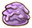</td>
      <td class="priceTableName">Grimy Food</td>
      <td>Food</td>
      <td class="leftText">Replenishes belly by 30. Inflicts Poisoned, Leg Hold, Paralyzed, Burned, Blinker, Paused, or Confused status when eaten. (Best to eat it while standing on the stairs)</td>
      <td>-</td>
      <td>5</td>
      <td>1</td>
    </tr>
    <tr>
      <td></td>
      <td class="priceTableName">Chestnut</td>
      <td>Food</td>
      <td class="leftText">Replenishes belly by 50. Increases max belly by 15 if already full. (3 of these are needed to progress the story)</td>
      <td>Uproar Forest</td>
      <td>200</td>
      <td>100</td>
    </tr>
    <tr>
      <td></td>
      <td class="priceTableName">Max Ether</td>
      <td>Drink</td>
      <td class="leftText">Fully restores PP of 1 move.</td>
      <td>-</td>
      <td>100</td>
      <td>10</td>
    </tr>
    <tr>
      <td></td>
      <td class="priceTableName">Max Elixir</td>
      <td>Drink</td>
      <td class="leftText">Fully restores PP of all moves, cures Sealed status.</td>
      <td>-</td>
      <td>175</td>
      <td>20</td>
    </tr>
    <tr>
      <td></td>
      <td class="priceTableName">Oran Berry</td>
      <td>Food</td>
      <td class="leftText">Restores 100 HP. Increases max HP by 10 if max HP &lt; 100, or if eaten when HP is already full (Not permanent).</td>
      <td>-</td>
      <td>25</td>
      <td>5</td>
    </tr>
    <tr>
      <td></td>
      <td class="priceTableName">Pecha Berry</td>
      <td>Food</td>
      <td class="leftText">Cures Poisoned and Badly Poisoned statuses.</td>
      <td>-</td>
      <td>12</td>
      <td>3</td>
    </tr>
    <tr>
      <td></td>
      <td class="priceTableName">Cheri Berry</td>
      <td>Food</td>
      <td class="leftText">Cures Paralyzed status.</td>
      <td>-</td>
      <td>12</td>
      <td>3</td>
    </tr>
    <tr>
      <td>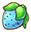</td>
      <td class="priceTableName">Rawst Berry</td>
      <td>Food</td>
      <td class="leftText">Cures Burned status.</td>
      <td>-</td>
      <td>12</td>
      <td>3</td>
    </tr>
    <tr>
      <td></td>
      <td class="priceTableName">Chesto Berry</td>
      <td>Food</td>
      <td class="leftText">Grants Sleepless status.</td>
      <td>-</td>
      <td>12</td>
      <td>3</td>
    </tr>
    <tr>
      <td>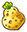</td>
      <td class="priceTableName">Sitrus Berry</td>
      <td>Food</td>
      <td class="leftText">Restores 200 HP. Increases max HP by 5 if already full (Permanent).</td>
      <td>Sparkling Tile Treasure Chest Unown Relic (Wall) Buried Relic (Wall)</td>
      <td>2500</td>
      <td>200</td>
    </tr>
    <tr>
      <td>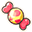</td>
      <td class="priceTableName">Energy Seed</td>
      <td>Food</td>
      <td class="leftText">Fully restores HP. Increases max HP by 10 if max HP &lt; 100, or if eaten when HP is already full (Not permanent).</td>
      <td>-</td>
      <td>40</td>
      <td>8</td>
    </tr>
    <tr>
      <td>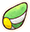</td>
      <td class="priceTableName">Heal Seed</td>
      <td>Food</td>
      <td class="leftText">Cures all bad status conditions.</td>
      <td>-</td>
      <td>50</td>
      <td>5</td>
    </tr>
    <tr>
      <td>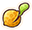</td>
      <td class="priceTableName">Tiny Reviver Seed</td>
      <td>Food</td>
      <td class="leftText">Revives a fainted pokemon if it's in your bag. Turns into a Plain Seed after activating. Doesn't restore PP or belly.</td>
      <td>Kecleon Shop Felicity Bank</td>
      <td>200</td>
      <td>20</td>
    </tr>
    <tr>
      <td>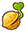</td>
      <td class="priceTableName">Reviver Seed</td>
      <td>Food</td>
      <td class="leftText">Revives a fainted pokemon if it's in your bag. Turns into a Plain Seed after activating. Also restores PP and belly.</td>
      <td>-</td>
      <td>350</td>
      <td>35</td>
    </tr>
    <tr>
      <td></td>
      <td class="priceTableName">Plain Seed</td>
      <td>Food</td>
      <td class="leftText">No effect.</td>
      <td>-</td>
      <td>3</td>
      <td>1</td>
    </tr>
    <tr>
      <td></td>
      <td class="priceTableName">Decoy Seed</td>
      <td>Food</td>
      <td class="leftText">Throw it at an enemy to inflict Infatuated status. This seed is prioritized when hit by Pluck, Bug Bite, Incinerate, Sticky Trap, or Apple Trap.</td>
      <td>-</td>
      <td>25</td>
      <td>5</td>
    </tr>
    <tr>
      <td></td>
      <td class="priceTableName">Quick Seed</td>
      <td>Food</td>
      <td class="leftText">Boosts movement speed by 1 stage.</td>
      <td>-</td>
      <td>25</td>
      <td>5</td>
    </tr>
    <tr>
      <td></td>
      <td class="priceTableName">Pure Seed</td>
      <td>Food</td>
      <td class="leftText">Warps you to the stairs room.</td>
      <td>-</td>
      <td>87</td>
      <td>18</td>
    </tr>
    <tr>
      <td>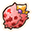</td>
      <td class="priceTableName">Violent Seed</td>
      <td>Food</td>
      <td class="leftText">Boosts Attack and Sp. Atk by 3 stages. This lasts for the duration of the current floor.</td>
      <td>-</td>
      <td>50</td>
      <td>10</td>
    </tr>
    <tr>
      <td></td>
      <td class="priceTableName">Training Seed</td>
      <td>Food</td>
      <td class="leftText">Boosts move growth rate. This lasts for the duration of the current floor.</td>
      <td>-</td>
      <td>25</td>
      <td>5</td>
    </tr>
    <tr>
      <td></td>
      <td class="priceTableName">Eyedrop Seed</td>
      <td>Food</td>
      <td class="leftText">Reveals traps, and also cures Blinker status. This lasts for the duration of the current floor.</td>
      <td>-</td>
      <td>35</td>
      <td>8</td>
    </tr>
    <tr>
      <td></td>
      <td class="priceTableName">Joy Seed</td>
      <td>Food</td>
      <td class="leftText">Increases level by 1.</td>
      <td>Joyous Tower Purity Forest Rank Up Reward</td>
      <td>2500</td>
      <td>200</td>
    </tr>
    <tr>
      <td></td>
      <td class="priceTableName">Empowerment Seed</td>
      <td>Food</td>
      <td class="leftText">Grants Awakened status. Triggers Mega Evolution if applicable.</td>
      <td>-</td>
      <td>350</td>
      <td>125</td>
    </tr>
    <tr>
      <td></td>
      <td class="priceTableName">Doom Seed</td>
      <td>Food</td>
      <td class="leftText">Decreases level by 1. (Experience points until next level is set to 1)</td>
      <td>Wish Cave Joyous Tower Purity Forest</td>
      <td>15</td>
      <td>3</td>
    </tr>
    <tr>
      <td></td>
      <td class="priceTableName">Warp Seed</td>
      <td>Food</td>
      <td class="leftText">Warp to a different spot on the current floor.</td>
      <td>-</td>
      <td>25</td>
      <td>5</td>
    </tr>
    <tr>
      <td></td>
      <td class="priceTableName">Blast Seed</td>
      <td>Food</td>
      <td class="leftText">Eat it to attack the tile in front of you (100 damage). Throwing it deals 75 damage instead. (No effect if Damp is active)</td>
      <td>-</td>
      <td>30</td>
      <td>8</td>
    </tr>
    <tr>
      <td></td>
      <td class="priceTableName">Blinker Seed</td>
      <td>Food</td>
      <td class="leftText">Inflicts Blinker status. Useful if you want to hit allies with moves.</td>
      <td>-</td>
      <td>12</td>
      <td>3</td>
    </tr>
    <tr>
      <td></td>
      <td class="priceTableName">Totter Seed</td>
      <td>Food</td>
      <td class="leftText">Inflicts Confused status.</td>
      <td>-</td>
      <td>12</td>
      <td>3</td>
    </tr>
    <tr>
      <td>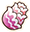</td>
      <td class="priceTableName">Sleep Seed</td>
      <td>Food</td>
      <td class="leftText">Inflicts Sleep status.</td>
      <td>-</td>
      <td>15</td>
      <td>3</td>
    </tr>
    <tr>
      <td>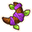</td>
      <td class="priceTableName">Stun Seed</td>
      <td>Food</td>
      <td class="leftText">Inflicts Petrified status.</td>
      <td>-</td>
      <td>25</td>
      <td>5</td>
    </tr>
    <tr>
      <td></td>
      <td class="priceTableName">Ban Seed</td>
      <td>Food</td>
      <td class="leftText">Disables the last move used. The disabled move can't be used by any pokemon. This lasts for the duration of the current adventure. Only 1 move can be disabled at a time.</td>
      <td>-</td>
      <td>160</td>
      <td>32</td>
    </tr>
    <tr>
      <td></td>
      <td class="priceTableName">Life Seed</td>
      <td>Food</td>
      <td class="leftText">Increases max HP by 5 (Permanent).</td>
      <td>-</td>
      <td>3000</td>
      <td>300</td>
    </tr>
    <tr>
      <td></td>
      <td class="priceTableName">Protein</td>
      <td>Drink</td>
      <td class="leftText">Increases Attack by 2 (Permanent).</td>
      <td>Kecleon Shop</td>
      <td>2000</td>
      <td>200</td>
    </tr>
    <tr>
      <td></td>
      <td class="priceTableName">Iron</td>
      <td>Drink</td>
      <td class="leftText">Increases Defense by 2 (Permanent).</td>
      <td>Kecleon Shop</td>
      <td>2000</td>
      <td>200</td>
    </tr>
    <tr>
      <td></td>
      <td class="priceTableName">Calcium</td>
      <td>Drink</td>
      <td class="leftText">Increases Sp. Atk by 2 (Permanent).</td>
      <td>Kecleon Shop</td>
      <td>2000</td>
      <td>200</td>
    </tr>
    <tr>
      <td></td>
      <td class="priceTableName">Zinc</td>
      <td>Drink</td>
      <td class="leftText">Increases Sp. Def by 2 (Permanent).</td>
      <td>Kecleon Shop</td>
      <td>2000</td>
      <td>200</td>
    </tr>
    <tr>
      <td>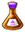</td>
      <td class="priceTableName">Carbos</td>
      <td>Drink</td>
      <td class="leftText">Increases Speed by 2 (Permanent).</td>
      <td>Kecleon Shop</td>
      <td>2000</td>
      <td>200</td>
    </tr>
    <tr>
      <td></td>
      <td class="priceTableName">Power Drink</td>
      <td>Drink</td>
      <td class="leftText">Raises the power of a move by 2 (Permanent).</td>
      <td>Kecleon Shop Far-Off Sea B75F Fantasy Strait B25F</td>
      <td>5000</td>
      <td>500</td>
    </tr>
    <tr>
      <td></td>
      <td class="priceTableName">Accuracy Drink</td>
      <td>Drink</td>
      <td class="leftText">Raises the accuracy of a move by 2 (Permanent).</td>
      <td>Kecleon Shop Far-Off Sea B75F Fantasy Strait B25F</td>
      <td>5000</td>
      <td>500</td>
    </tr>
    <tr>
      <td></td>
      <td class="priceTableName">PP-Up Drink</td>
      <td>Drink</td>
      <td class="leftText">Raises the PP of a move by 2 (Permanent).</td>
      <td>Kecleon Shop Far-Off Sea B75F Fantasy Strait B25F</td>
      <td>5000</td>
      <td>500</td>
    </tr>
    <tr>
      <td></td>
      <td class="priceTableName">Rainbow Gummi</td>
      <td>-</td>
      <td class="leftText">Increases a random stat by 1 (Permanent). (HP, Attack, Defense, Sp. Atk, Sp. Def, or Speed) Rarely increases HP by 5 or other stat by 3 instead. ~20% chance to gain a new Rare Quality.</td>
      <td>Pretty Box Rescue Jobs</td>
      <td>-</td>
      <td>-</td>
    </tr>
    <tr>
      <td></td>
      <td class="priceTableName">DX Gummi</td>
      <td>-</td>
      <td class="leftText">Increases a random stat by 1 (Permanent). (HP, Attack, Defense, Sp. Atk, Sp. Def, or Speed) Rarely increases HP by 5 or other stat by 3 instead. 100% chance to gain a new Rare Quality.</td>
      <td>Deluxe Box Rescue Jobs</td>
      <td>-</td>
      <td>-</td>
    </tr>
  </tbody>
</table>
