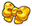
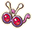
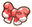
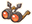
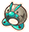
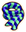

# Overview

- Equipment grants special effects while equipped.
    - Equipment that prevents status conditions can't cure status conditions after becoming afflicted.
    - Equipment that boosts stats allow a pokemon to exceed the 255 natural stat limit.

# Summary

Locations are listed only for rare items (see the dungeon page for details).

<table class="itemListCentered">
  <thead>
    <tr>
      <th>Image</th>
      <th>Name</th>
      <th>Notes</th>
      <th>Location</th>
      <th>Buy</th>
      <th>Sell</th>
    </tr>
  </thead>
  <tbody>
    <tr>
      <td></td>
      <td class="priceTableName">Deluxe Ribbon</td>
      <td class="leftText">None.</td>
      <td>-</td>
      <td>18000</td>
      <td>7500</td>
    </tr>
    <tr>
      <td></td>
      <td class="priceTableName">Gold Ribbon</td>
      <td class="leftText">None.</td>
      <td>-</td>
      <td>6000</td>
      <td>2500</td>
    </tr>
    <tr>
      <td></td>
      <td class="priceTableName">Power Band</td>
      <td class="leftText">Increases Attack by 10.</td>
      <td>-</td>
      <td>500</td>
      <td>50</td>
    </tr>
    <tr>
      <td></td>
      <td class="priceTableName">Defense Scarf</td>
      <td class="leftText">Increases Defense by 15.</td>
      <td>-</td>
      <td>500</td>
      <td>50</td>
    </tr>
    <tr>
      <td></td>
      <td class="priceTableName">Special Band</td>
      <td class="leftText">Increases Sp. Atk by 10.</td>
      <td>-</td>
      <td>500</td>
      <td>50</td>
    </tr>
    <tr>
      <td></td>
      <td class="priceTableName">Zinc Band</td>
      <td class="leftText">Increases Sp. Def by 15.</td>
      <td>-</td>
      <td>500</td>
      <td>50</td>
    </tr>
    <tr>
      <td></td>
      <td class="priceTableName">Mach Ribbon</td>
      <td class="leftText">Increases Speed by 20.</td>
      <td>-</td>
      <td>1000</td>
      <td>100</td>
    </tr>
    <tr>
      <td></td>
      <td class="priceTableName">Munch Belt</td>
      <td class="leftText">Increases Attack and Sp. Atk by 30. Belly depletes by 1 every 4 turns. Non-leader pokemon deplete belly every 14 turns.</td>
      <td>Munchlax Event Western Cave Silver Trench Joyous Tower</td>
      <td>6000</td>
      <td>600</td>
    </tr>
    <tr>
      <td></td>
      <td class="priceTableName">Scope Lens</td>
      <td class="leftText">Boosts critical hit rate.</td>
      <td>-</td>
      <td>2000</td>
      <td>200</td>
    </tr>
    <tr>
      <td></td>
      <td class="priceTableName">Heavy Rotation Specs</td>
      <td class="leftText">Boosts critical hit rate when using same move.</td>
      <td>-</td>
      <td>2500</td>
      <td>250</td>
    </tr>
    <tr>
      <td></td>
      <td class="priceTableName">Fickle Specs</td>
      <td class="leftText">Boosts critical hit rate when using different moves.</td>
      <td>-</td>
      <td>2500</td>
      <td>250</td>
    </tr>
    <tr>
      <td></td>
      <td class="priceTableName">Fierce Bandanna</td>
      <td class="leftText">Raises power of moves.</td>
      <td>-</td>
      <td>4500</td>
      <td>450</td>
    </tr>
    <tr>
      <td></td>
      <td class="priceTableName">Heal Ribbon</td>
      <td class="leftText">Doubles natural HP regen speed (1 HP per turn).</td>
      <td>-</td>
      <td>1000</td>
      <td>100</td>
    </tr>
    <tr>
      <td></td>
      <td class="priceTableName">Recovery Scarf</td>
      <td class="leftText">Halves duration of bad status conditions.</td>
      <td>Post-game</td>
      <td>6000</td>
      <td>600</td>
    </tr>
    <tr>
      <td></td>
      <td class="priceTableName">Lock-On Specs</td>
      <td class="leftText">Items you throw always hit their target. (Excludes rescue pokemon / Kecleon shopkeeper)</td>
      <td>Joyous Tower Purity Forest Wish Cave</td>
      <td>6000</td>
      <td>600</td>
    </tr>
    <tr>
      <td></td>
      <td class="priceTableName">Goggle Specs</td>
      <td class="leftText">Reveals hidden traps.</td>
      <td>Post-game</td>
      <td>5000</td>
      <td>500</td>
    </tr>
    <tr>
      <td></td>
      <td class="priceTableName">X-Ray Specs</td>
      <td class="leftText">Reveals pokemon and item locations on the map. (Includes items buried in walls / rescue pokemon)</td>
      <td>Post-game</td>
      <td>8000</td>
      <td>800</td>
    </tr>
    <tr>
      <td></td>
      <td class="priceTableName">Sneak Scarf</td>
      <td class="leftText">Lets you walk next to sleeping enemies without waking them.</td>
      <td>Mt. Faraway Joyous Tower Purity Forest Wish Cave Silver Trench</td>
      <td>6000</td>
      <td>600</td>
    </tr>
    <tr>
      <td></td>
      <td class="priceTableName">Friend Bow</td>
      <td class="leftText">Boosts recruit rate by +12.8% when held by leader. (You must have this equipped to recruit Strong Foes)</td>
      <td>Buried Relic 99F Solar Cave 20F Joyous Tower Purity Forest Wish Cave</td>
      <td>8888</td>
      <td>888</td>
    </tr>
    <tr>
      <td></td>
      <td class="priceTableName">Joy Ribbon</td>
      <td class="leftText">Gain 1 experience point every 5 turns. (2 with XP Boost)</td>
      <td>-</td>
      <td>1500</td>
      <td>150</td>
    </tr>
    <tr>
      <td></td>
      <td class="priceTableName">Prosper Ribbon</td>
      <td class="leftText">Cure status conditions and heal 5 HP when you pick up Poke.</td>
      <td>-</td>
      <td>3000</td>
      <td>300</td>
    </tr>
    <tr>
      <td></td>
      <td class="priceTableName">Twist Band</td>
      <td class="leftText">Prevents your stats from being lowered. (Includes moves that lower stats like Overheat)</td>
      <td>-</td>
      <td>4000</td>
      <td>400</td>
    </tr>
    <tr>
      <td></td>
      <td class="priceTableName">Insomniscope</td>
      <td class="leftText">Prevents Sleep, Yawning, and Nightmare statuses.</td>
      <td>-</td>
      <td>450</td>
      <td>45</td>
    </tr>
    <tr>
      <td></td>
      <td class="priceTableName">Persim Band</td>
      <td class="leftText">Prevents Confused status.</td>
      <td>-</td>
      <td>600</td>
      <td>60</td>
    </tr>
    <tr>
      <td></td>
      <td class="priceTableName">Pecha Scarf</td>
      <td class="leftText">Prevents Poisoned and Badly Poisoned statuses.</td>
      <td>-</td>
      <td>500</td>
      <td>50</td>
    </tr>
    <tr>
      <td></td>
      <td class="priceTableName">No-Stick Cap</td>
      <td class="leftText">Prevents items from becoming sticky from traps or moves.</td>
      <td>Purity Forest Wish Cave</td>
      <td>3500</td>
      <td>350</td>
    </tr>
    <tr>
      <td></td>
      <td class="priceTableName">Weather Band</td>
      <td class="leftText">Shields the wearer from weather as if it's always Clear.</td>
      <td>-</td>
      <td>1800</td>
      <td>180</td>
    </tr>
    <tr>
      <td></td>
      <td class="priceTableName">Lucky Ribbon</td>
      <td class="leftText">Prevents getting hit by critical hits.</td>
      <td>-</td>
      <td>3000</td>
      <td>300</td>
    </tr>
    <tr>
      <td></td>
      <td class="priceTableName">Explosive Band</td>
      <td class="leftText">Sometimes explode when you receive damage. (Blast Control reduces damage received)</td>
      <td>Joyous Tower Purity Forest Wish Cave</td>
      <td>1000</td>
      <td>100</td>
    </tr>
    <tr>
      <td></td>
      <td class="priceTableName">Detect Band</td>
      <td class="leftText">Boosts evasion.</td>
      <td>-</td>
      <td>800</td>
      <td>80</td>
    </tr>
    <tr>
      <td></td>
      <td class="priceTableName">Pass Scarf</td>
      <td class="leftText">Redirects enemy moves to nearby pokemon when adjacent. Belly depletes by 2 when this effect activates. (Never activates when belly is empty)</td>
      <td>Joyous Tower Purity Forest Wish Cave</td>
      <td>350</td>
      <td>35</td>
    </tr>
    <tr>
      <td></td>
      <td class="priceTableName">Cover Band</td>
      <td class="leftText">If an ally with low HP is nearby, you take the attack for them.</td>
      <td>-</td>
      <td>330</td>
      <td>33</td>
    </tr>
    <tr>
      <td></td>
      <td class="priceTableName">Reunion Cape</td>
      <td class="leftText">Warp to your allies after 1~3 turns if you're 6+ tiles away. (Doesn't activate if your allies are in the same room)</td>
      <td>Uproar Forest Magma Cavern Wish Cave Joyous Tower Purity Forest</td>
      <td>1000</td>
      <td>100</td>
    </tr>
    <tr>
      <td></td>
      <td class="priceTableName">Warp Scarf</td>
      <td class="leftText">Chance to warp to a different spot when your turn ends.</td>
      <td>Purity Forest Wish Cave</td>
      <td>1200</td>
      <td>120</td>
    </tr>
    <tr>
      <td></td>
      <td class="priceTableName">Big Eater Belt</td>
      <td class="leftText">Food items restore belly by double the amount. (Max belly increases are also doubled)</td>
      <td>Munchlax Event Western Cave Silver Trench Wish Cave Joyous Tower Purity Forest</td>
      <td>4500</td>
      <td>450</td>
    </tr>
    <tr>
      <td></td>
      <td class="priceTableName">Efficient Bandanna</td>
      <td class="leftText">Occasionally use a move without consuming PP.</td>
      <td>-</td>
      <td>7000</td>
      <td>700</td>
    </tr>
    <tr>
      <td></td>
      <td class="priceTableName">Nullify Bandanna</td>
      <td class="leftText">Nullifies the wearer's ability.</td>
      <td>-</td>
      <td>2000</td>
      <td>200</td>
    </tr>
    <tr>
      <td></td>
      <td class="priceTableName">Mobile Scarf</td>
      <td class="leftText">Lets you traverse across wall, water, and magma tiles. You won't gain Burned status when moving on magma tiles. (Belly depletes by 5 per turn inside walls)</td>
      <td>Murky Cave Event Purity Forest</td>
      <td>7777</td>
      <td>777</td>
    </tr>
    <tr>
      <td></td>
      <td class="priceTableName">Trap Scarf</td>
      <td class="leftText">Traps you step on will never activate. (Doesn't matter if the trap was visible or not)</td>
      <td>Purity Forest</td>
      <td>6000</td>
      <td>600</td>
    </tr>
    <tr>
      <td></td>
      <td class="priceTableName">Stamina Band</td>
      <td class="leftText">Halves belly depletion rate (1 belly every 15 turns).</td>
      <td>Mt. Faraway Western Cave Silver Trench</td>
      <td>6500</td>
      <td>650</td>
    </tr>
    <tr>
      <td></td>
      <td class="priceTableName">Pierce Band</td>
      <td class="leftText">Items you throw pierce through pokemon and walls.</td>
      <td>Purity Forest</td>
      <td></td>
      <td></td>
    </tr>
    <tr>
      <td></td>
      <td class="priceTableName">Tight Belt</td>
      <td class="leftText">Stops natural belly depletion. (Still depletes via passing/breaking walls and linked moves)</td>
      <td>Joyous Tower Purity Forest</td>
      <td>7500</td>
      <td>750</td>
    </tr>
    <tr>
      <td></td>
      <td class="priceTableName">Phase Ribbon</td>
      <td class="leftText">Move anywhere while ignoring terrain. Step toward a wall tile to destroy it. (Belly depletes by 1 per wall tile destroyed)</td>
      <td>Purity Forest</td>
      <td>6000</td>
      <td>600</td>
    </tr>
  </tbody>
</table>
