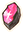

# Overview

- Miscellaneous items that don't fall under the main categories.

# Summary

Locations are listed only for rare items (see the dungeon page for details).

<table class="itemListCentered">
  <thead>
    <tr>
      <th>Image</th>
      <th>Name</th>
      <th>Notes</th>
      <th>Location</th>
      <th>Buy</th>
      <th>Sell</th>
    </tr>
  </thead>
  <tbody>
    <tr>
      <td></td>
      <td class="priceTableName">Link Box</td>
      <td class="leftText">Can be used to link or delink moves. (The Link Box vanishes after use)</td>
      <td>-</td>
      <td>6500</td>
      <td>650</td>
    </tr>
    <tr>
      <td></td>
      <td class="priceTableName">Evolution Crystal</td>
      <td class="leftText">Needed to evolve certain pokemon. The quantity needed varies by evolution stage.</td>
      <td>Waterfall Pond (Shop) Waterfall Pond B19F Southern Cave B50F Unown Relic (Shop) Buried Relic (Shop) Buried Relic 99F Solar Cave (Shop) Howling Forest (Shop) Marvelous Sea B18F</td>
      <td>1000</td>
      <td>100</td>
    </tr>
    <tr>
      <td></td>
      <td class="priceTableName">Bronze Dojo Ticket</td>
      <td class="leftText">Lets you do a training session at Makuhita Dojo.</td>
      <td>Mailbox Pretty Box Rescue Jobs</td>
      <td>1000</td>
      <td>100</td>
    </tr>
    <tr>
      <td></td>
      <td class="priceTableName">Silver Dojo Ticket</td>
      <td class="leftText">Lets you do a training session at Makuhita Dojo.</td>
      <td>Mailbox Deluxe Box Rescue Jobs</td>
      <td>1500</td>
      <td>150</td>
    </tr>
    <tr>
      <td></td>
      <td class="priceTableName">Gold Dojo Ticket</td>
      <td class="leftText">Lets you do a training session at Makuhita Dojo.</td>
      <td>Mailbox Deluxe Box Rescue Jobs</td>
      <td>2000</td>
      <td>200</td>
    </tr>
    <tr>
      <td></td>
      <td class="priceTableName">Invitation</td>
      <td class="leftText">Unlocks a Mystery House's door in a dungeon.</td>
      <td>Kecleon Shop </td>
      <td>1000</td>
      <td>100</td>
    </tr>
    <tr>
      <td></td>
      <td class="priceTableName">Poke</td>
      <td class="leftText">Money of the Pokemon Mystery Dungeon universe. Step on it and swap it with an inventory item to carry it. Deals 2 damage when thrown at an enemy. Max you can carry is 99,999 Poke.</td>
      <td>-</td>
      <td>-</td>
      <td>-</td>
    </tr>
  </tbody>
</table>
