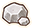
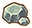
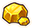

# Overview

- Projectiles are used to attack enemy pokemon from a distance.
    - Projectiles thrown while confused still fly in the direction you're facing.
    - Up to 40 of the same projectile can be stacked in a bundle.

# Summary

Locations are listed only for rare items (see the dungeon page for details).

<table class="itemListCentered">
  <thead>
    <tr>
      <th>Image</th>
      <th>Name</th>
      <th>Range</th>
      <th>Notes</th>
      <th>Location</th>
      <th>Buy</th>
      <th>Sell</th>
    </tr>
  </thead>
  <tbody>
    <tr>
      <td></td>
      <td class="priceTableName">Iron Spike</td>
      <td>10</td>
      <td class="leftText">Throw to deal damage to an enemy.</td>
      <td>-</td>
      <td>4</td>
      <td>1</td>
    </tr>
    <tr>
      <td></td>
      <td class="priceTableName">Silver Spike</td>
      <td>∞</td>
      <td class="leftText">Throw to deal damage to an enemy. Pierces through walls and pokemon.</td>
      <td>Joyous Tower Purity Forest Wish Cave</td>
      <td>6</td>
      <td>1</td>
    </tr>
    <tr>
      <td></td>
      <td class="priceTableName">Golden Spike</td>
      <td>10</td>
      <td class="leftText">Throw to deal damage to an enemy.</td>
      <td>Desert Region 20F Joyous Tower</td>
      <td>300</td>
      <td>100</td>
    </tr>
    <tr>
      <td></td>
      <td class="priceTableName">Cacnea Spike</td>
      <td>10</td>
      <td class="leftText">Throw to deal damage to an enemy.</td>
      <td>Wonder Mail (SH8XMF1T) (45QSPHF4)</td>
      <td>60</td>
      <td>20</td>
    </tr>
    <tr>
      <td></td>
      <td class="priceTableName">Corsola Twig</td>
      <td>10</td>
      <td class="leftText">Throw to deal damage to an enemy.</td>
      <td>Wonder Mail (3TWJMK2C) (JT3MQY79)</td>
      <td>75</td>
      <td>25</td>
    </tr>
    <tr>
      <td></td>
      <td class="priceTableName">Geo Pebble</td>
      <td>10</td>
      <td class="leftText">Throw to deal 30 damage to an enemy. Lands 3 tiles ahead without a target.</td>
      <td>-</td>
      <td>2</td>
      <td>1</td>
    </tr>
    <tr>
      <td></td>
      <td class="priceTableName">Gravelerock</td>
      <td>10</td>
      <td class="leftText">Throw to deal 20 damage to an enemy. Lands 3 tiles ahead without a target. Has homing properties.</td>
      <td>-</td>
      <td>10</td>
      <td>1</td>
    </tr>
    <tr>
      <td></td>
      <td class="priceTableName">Golden Fossil</td>
      <td>10</td>
      <td class="leftText">Throw to deal 50 damage to an enemy. Lands 3 tiles ahead without a target.</td>
      <td>Desert Region 20F</td>
      <td>450</td>
      <td>150</td>
    </tr>
  </tbody>
</table>
