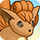
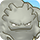

# Pokemon List

Location colors = Wild, Fainted, Mystery House, Shiny Strong Foe (Friend Bow required)

<table class="pokemonTable">
  <tr>
    <th>No</th>
    <th>Image</th>
    <th>Name</th>
    <th>Ability</th>
    <th>Walk</th>
    <th>Camp</th>
    <th>Locations</th>
    <th>Notes</th>
  </tr>
  <tr>
    <td>001</td>
    <td></td>
    <td>Bulbasaur  </td>
    <td>Overgrow</td>
    <td>Normal</td>
    <td>Beau Plains</td>
    <td>Joyous Tower 1-5F Sky Tower Buried Relic Silver Trench</td>
    <td>Starter / Partner → Ivysaur (16)</td>
  </tr>
  <tr>
    <td>002</td>
    <td></td>
    <td>Ivysaur  </td>
    <td>Overgrow</td>
    <td>Normal</td>
    <td>Beau Plains</td>
    <td>-</td>
    <td>→ Venusaur (32)</td>
  </tr>
  <tr>
    <td rowspan="2">003</td>
    <td></td>
    <td>Venusaur  </td>
    <td>Overgrow</td>
    <td>Normal</td>
    <td rowspan="2">Beau Plains</td>
    <td rowspan="2">-</td>
    <td rowspan="2">-</td>
  </tr>
  <tr>
    <td></td>
    <td>Mega Venusaur  </td>
    <td>Thick Fat</td>
    <td>Normal</td>
  </tr>
  <tr>
    <td>004</td>
    <td></td>
    <td>Charmander </td>
    <td>Blaze</td>
    <td>Lava</td>
    <td>Mt. Cleft</td>
    <td>Fiery Field 5-9F Sky Tower Buried Relic Silver Trench</td>
    <td>Starter / Partner → Charmeleon (16)</td>
  </tr>
  <tr>
    <td>005</td>
    <td></td>
    <td>Charmeleon </td>
    <td>Blaze</td>
    <td>Lava</td>
    <td>Mt. Cleft</td>
    <td>Fiery Field 20-29F</td>
    <td>→ Charmeleon (36)</td>
  </tr>
  <tr>
    <td rowspan="3">006</td>
    <td></td>
    <td>Charizard  </td>
    <td>Blaze</td>
    <td>Float</td>
    <td rowspan="3">Mt. Cleft</td>
    <td rowspan="3">Mt. Faraway 50-59F</td>
    <td>-</td>
  </tr>
  <tr>
    <td></td>
    <td>Mega Charizard X  </td>
    <td>Tough Claws</td>
    <td>Float</td>
    <td rowspan="2">Mega is random.</td>
  </tr>
  <tr>
    <td></td>
    <td>Mega Charizard Y  </td>
    <td>Drought</td>
    <td>Float</td>
  </tr>
  <tr>
    <td>007</td>
    <td></td>
    <td>Squirtle </td>
    <td>Torrent</td>
    <td>Water</td>
    <td>Turtleshell Pond</td>
    <td>Waterfall Pond 8-12F Murky Cave 8-12F Sky Tower Buried Relic Silver Trench</td>
    <td>Starter / Partner → Wartortle (16)</td>
  </tr>
  <tr>
    <td>008</td>
    <td></td>
    <td>Wartortle </td>
    <td>Torrent</td>
    <td>Water</td>
    <td>Turtleshell Pond</td>
    <td>Northwind Field 21-29F</td>
    <td>→ Blastoise (36)</td>
  </tr>
  <tr>
    <td rowspan="2">009</td>
    <td></td>
    <td>Blastoise </td>
    <td>Torrent</td>
    <td>Water</td>
    <td rowspan="2">Turtleshell Pond</td>
    <td rowspan="2">Mt. Faraway 50-59F</td>
    <td rowspan="2">-</td>
  </tr>
  <tr>
    <td></td>
    <td>Mega Blastoise </td>
    <td>Mega Launcher</td>
    <td>Water</td>
  </tr>
  <tr>
    <td>010</td>
    <td></td>
    <td>Caterpie </td>
    <td>Shield Dust</td>
    <td>Normal</td>
    <td>Stump Forest</td>
    <td>Purity Forest 2-4F Waterfall Pond Wyvern Hill Howling Forest Buried Relic</td>
    <td>→ Metapod (7)</td>
  </tr>
  <tr>
    <td>011</td>
    <td></td>
    <td>Metapod </td>
    <td>Shed Skin</td>
    <td>Normal</td>
    <td>Stump Forest</td>
    <td>Joyous Tower 4-8F Northwind Field Murky Cave</td>
    <td>→ Butterfree (10)</td>
  </tr>
  <tr>
    <td>012</td>
    <td></td>
    <td>Butterfree  </td>
    <td>Compound Eyes</td>
    <td>Float</td>
    <td>Stump Forest</td>
    <td>★Howling Forest 6-15F Pitfall Valley 4-9F Remains Island</td>
    <td>-</td>
  </tr>
  <tr>
    <td>013</td>
    <td></td>
    <td>Weedle  </td>
    <td>Shield Dust</td>
    <td>Normal</td>
    <td>Stump Forest</td>
    <td>Oddity Cave 1-2F Silent Chasm 1-6F Remains Island 1-2F Joyous Tower 28-34F Purity Forest 9-12F Marvelous Sea 1-2F Fantasy Strait 1-2F Mt. Faraway Silver Trench</td>
    <td>→ Kakuna (7)</td>
  </tr>
  <tr>
    <td>014</td>
    <td></td>
    <td>Kakuna  </td>
    <td>Shed Skin</td>
    <td>Normal</td>
    <td>Stump Forest</td>
    <td>Joyous Tower 9-13F Far-Off Sea</td>
    <td>→ Beedrill (10)</td>
  </tr>
  <tr>
    <td rowspan="2">015</td>
    <td></td>
    <td>Beedrill  </td>
    <td>Swarm</td>
    <td>Float</td>
    <td rowspan="2">Stump Forest</td>
    <td rowspan="2">Silent Chasm 8-9F Joyous Tower 31-35F Purity Forest 31-35F Tiny Woods Silver Trench</td>
    <td rowspan="2">-</td>
  </tr>
  <tr>
    <td></td>
    <td>Mega Beedrill  </td>
    <td>Adaptability</td>
    <td>Float</td>
  </tr>
  <tr>
    <td>016</td>
    <td></td>
    <td>Pidgey  </td>
    <td>Keen Eye Tangled Feet</td>
    <td>Float</td>
    <td>Flyaway Forest</td>
    <td>Tiny Woods 1-3F Oddity Cave 1-2F Remains Island 1-2F Pitfall Valley 1-6F Purity Forest 1-3F Marvelous Sea 1-2F Fantasy Strait 1-2F Remains Island Silver Trench</td>
    <td>→ Pidgeotto (18)</td>
  </tr>
  <tr>
    <td>017</td>
    <td></td>
    <td>Pidgeotto  </td>
    <td>Keen Eye Tangled Feet</td>
    <td>Float</td>
    <td>Flyaway Forest</td>
    <td>Mt. Thunder 6-12F Far-Off Sea Murky Cave</td>
    <td>→ Pidgeot (36)</td>
  </tr>
  <tr>
    <td rowspan="2">018</td>
    <td></td>
    <td>Pidgeot  </td>
    <td>Keen Eye Tangled Feet</td>
    <td>Float</td>
    <td rowspan="2">Flyaway Forest</td>
    <td rowspan="2">Mt. Blaze 4-9F Northern Range 1-7F Joyous Tower 59-61F Sky Tower</td>
    <td rowspan="2">-</td>
  </tr>
  <tr>
    <td></td>
    <td>Mega Pidgeot  </td>
    <td>No Guard</td>
    <td>Float</td>
  </tr>
  <tr>
    <td>019</td>
    <td></td>
    <td>Rattata </td>
    <td>Run Away Guts</td>
    <td>Normal</td>
    <td>Wild Plains</td>
    <td>Thunderwave Cave 1-5F Oddity Cave 1-2F Remains Island 1-2F Buried Relic 4-6F Purity Forest 5-7F Wish Cave 5-7F Marvelous Sea 1-2F Fantasy Strait 1-2F Tiny Woods</td>
    <td>→ Raticate (20)</td>
  </tr>
  <tr>
    <td>020</td>
    <td></td>
    <td>Raticate </td>
    <td>Run Away Guts</td>
    <td>Normal</td>
    <td>Wild Plains</td>
    <td>Magma Cavern 1-3F Buried Relic 50-51 / 74-81F Pitfall Valley 4-9F Uproar Forest Pitfall Valley Fantasy Strait</td>
    <td>-</td>
  </tr>
  <tr>
    <td>021</td>
    <td></td>
    <td>Spearow  </td>
    <td>Keen Eye</td>
    <td>Float</td>
    <td>Ravaged Field</td>
    <td>Mt. Steel 2-8F Pitfall Valley 4-9F Purity Forest 9-10F Desert Region</td>
    <td>→ Fearow (20)</td>
  </tr>
  <tr>
    <td>022</td>
    <td></td>
    <td>Fearow  </td>
    <td>Keen Eye</td>
    <td>Float</td>
    <td>Ravaged Field</td>
    <td>Mt. Blaze 12-14F Northern Range 8-15F Joyous Tower 51-54F Purity Forest 51-54F Sky Tower</td>
    <td>-</td>
  </tr>
  <tr>
    <td>023</td>
    <td></td>
    <td>Ekans </td>
    <td>Intimidate Shed Skin</td>
    <td>Normal</td>
    <td>Wild Plains</td>
    <td>Wish Cave 4-7 / 97-98F Darknight Relic Stormy Sea Fiery Field Western Cave Silver Trench</td>
    <td>→ Arbok (22)</td>
  </tr>
  <tr>
    <td>024</td>
    <td></td>
    <td>Arbok </td>
    <td>Intimidate Shed Skin</td>
    <td>Normal</td>
    <td>Wild Plains</td>
    <td>Magma Cavern 8-13F Buried Relic 50-51 / 82-88F Joyous Tower 61-64F Purity Forest 59-63F Wish Cave 60-64F Stormy Sea</td>
    <td>-</td>
  </tr>
  <tr>
    <td>025</td>
    <td></td>
    <td>Pikachu </td>
    <td>Static</td>
    <td>Normal</td>
    <td>Vibrant Forest</td>
    <td>Lightning Field 5-10F</td>
    <td class="evolution">Starter / Partner → Raichu ( x 4)</td>
  </tr>
  <tr>
    <td>026</td>
    <td></td>
    <td>Raichu </td>
    <td>Static</td>
    <td>Normal</td>
    <td>Vibrant Forest</td>
    <td>Lightning Field 23-29F Lightning Field</td>
    <td>-</td>
  </tr>
  <tr>
    <td>027</td>
    <td></td>
    <td>Sandshrew </td>
    <td>Sand Veil</td>
    <td>Normal</td>
    <td>Withering Desert</td>
    <td>Magma Cavern 1-6F Desert Region 1-6F Buried Relic 50-51 / 75-80F Joyous Tower 74-78F Tiny Woods</td>
    <td>→ Sandslash (22)</td>
  </tr>
  <tr>
    <td>028</td>
    <td></td>
    <td>Sandslash </td>
    <td>Sand Veil</td>
    <td>Normal</td>
    <td>Withering Desert</td>
    <td>Magma Cavern 20-23F Desert Region 15-19F Joyous Tower 79-87F Mt. Faraway</td>
    <td>-</td>
  </tr>
  <tr>
    <td>029</td>
    <td></td>
    <td>Nidoran♀ </td>
    <td>Poison Point Rivalry</td>
    <td>Normal</td>
    <td>Safari</td>
    <td>Thunderwave Cave 1-5F Oddity Cave 1-2F Remains Island 1-2F Purity Forest 6-8F Marvelous Sea 1-2F Fantasy Strait 1-2F Grand Sea</td>
    <td>→ Nidorina (16)</td>
  </tr>
  <tr>
    <td>030</td>
    <td></td>
    <td>Nidorina </td>
    <td>Poison Point Rivalry</td>
    <td>Normal</td>
    <td>Safari</td>
    <td>Lapis Cave 1-8F Purity Forest 47-50F Wish Cave 47-50F Great Canyon</td>
    <td class="evolution">→ Nidoqueen ( x 4)</td>
  </tr>
  <tr>
    <td>031</td>
    <td></td>
    <td>Nidoqueen  </td>
    <td>Poison Point Rivalry</td>
    <td>Normal</td>
    <td>Safari</td>
    <td>Magma Cavern 2-5F Desert Region 7-14F Purity Forest 74-76F Wish Cave 74-76F Silver Trench</td>
    <td>-</td>
  </tr>
  <tr>
    <td>032</td>
    <td></td>
    <td>Nidoran♂ </td>
    <td>Poison Point Rivalry</td>
    <td>Normal</td>
    <td>Safari</td>
    <td>Oddity Cave 1-2F Mt. Thunder 1-5F Remains Island 1-2F Purity Forest 31-35F Wish Cave 33-37F Marvelous Sea 1-2F Fantasy Strait 1-2F Waterfall Pond</td>
    <td>→ Nidorino (16)</td>
  </tr>
  <tr>
    <td>033</td>
    <td></td>
    <td>Nidorino </td>
    <td>Poison Point Rivalry</td>
    <td>Normal</td>
    <td>Safari</td>
    <td>Lapis Cave 4-8F Purity Forest 47-50F Wish Cave 47-50F Great Canyon</td>
    <td class="evolution">→ Nidoking ( x 4)</td>
  </tr>
  <tr>
    <td>034</td>
    <td></td>
    <td>Nidoking  </td>
    <td>Poison Point Rivalry</td>
    <td>Normal</td>
    <td>Safari</td>
    <td>Magma Cavern 2-5F Southern Cave 9-19F Purity Forest 77-79F Wish Cave 77-79F Silver Trench</td>
    <td>-</td>
  </tr>
  <tr>
    <td>035</td>
    <td></td>
    <td>Clefairy </td>
    <td>Cute Charm Magic Guard</td>
    <td>Normal</td>
    <td>Mt. Moonview</td>
    <td>Oddity Cave 1-2F Remains Island 1-2F Joyous Tower 9-14F Purity Forest 5-7F Marvelous Sea 1-2F Fantasy Strait 1-2F Stormy Sea</td>
    <td class="evolution">→ Clefable ( x 4)</td>
  </tr>
  <tr>
    <td>036</td>
    <td></td>
    <td>Clefable </td>
    <td>Cute Charm Magic Guard</td>
    <td>Normal</td>
    <td>Mt. Moonview</td>
    <td>Joyous Tower 22-29F Stormy Sea Buried Relic Solar Cave Western Cave</td>
    <td>-</td>
  </tr>
  <tr>
    <td>037</td>
    <td></td>
    <td>Vulpix </td>
    <td>Flash Fire</td>
    <td>Lava</td>
    <td>Darkness Ridge</td>
    <td>Fiery Field 1-5F Stormy Sea Fiery Field Mt. Faraway Pitfall Valley</td>
    <td class="evolution">→ Ninetales ( x 2)</td>
  </tr>
  <tr>
    <td>038</td>
    <td></td>
    <td>Ninetales </td>
    <td>Flash Fire</td>
    <td>Lava</td>
    <td>Darkness Ridge</td>
    <td>Mt. Faraway 40-49F ★Northern Range 5-24F Stormy Sea Buried Relic Solar Cave Fiery Field</td>
    <td>-</td>
  </tr>
  <tr>
    <td>039</td>
    <td></td>
    <td>Jigglypuff  </td>
    <td>Cute Charm Competitive</td>
    <td>Normal</td>
    <td>Sky-Blue Plains</td>
    <td>Joyous Tower 1-3F Purity Forest 2-4F Wish Cave 1-4F Remains Island</td>
    <td class="evolution">→ Wigglytuff ( x 4)</td>
  </tr>
  <tr>
    <td>040</td>
    <td></td>
    <td>Wigglytuff  </td>
    <td>Cute Charm Competitive</td>
    <td>Normal</td>
    <td>Sky-Blue Plains</td>
    <td>Joyous Tower 50-56F Stormy Sea Buried Relic Solar Cave Western Cave</td>
    <td>-</td>
  </tr>
  <tr>
    <td>041</td>
    <td></td>
    <td>Zubat  </td>
    <td>Inner Focus</td>
    <td>Float</td>
    <td>Echo Cave</td>
    <td>Oddity Cave 1-2F Lapis Cave 1-3F Remains Island 1-2F Buried Relic 46-50F Marvelous Sea 1-2F Fantasy Strait 1-2F Mt. Thunder Rock Path Mt. Faraway</td>
    <td>→ Golbat (22)</td>
  </tr>
  <tr>
    <td>042</td>
    <td></td>
    <td>Golbat  </td>
    <td>Inner Focus</td>
    <td>Float</td>
    <td>Echo Cave</td>
    <td>Lapis Cave 9-14F Buried Relic 50-51 / 70-76F Purity Forest 47-50F Wish Cave 46-50F Far-Off Sea</td>
    <td class="evolution">→ Crobat ( x 4)</td>
  </tr>
  <tr>
    <td>043</td>
    <td></td>
    <td>Oddish  </td>
    <td>Chlorophyll</td>
    <td>Normal</td>
    <td>Jungle</td>
    <td>Oddity Cave 3-4F Sinister Woods 1-4F Remains Island 3-4F Wyvern Hill 13-20F Purity Forest 18-25F Marvelous Sea 3-4F Fantasy Strait 3-4F Southern Cavern</td>
    <td>→ Gloom (21)</td>
  </tr>
  <tr>
    <td>044</td>
    <td></td>
    <td>Gloom  </td>
    <td>Chlorophyll</td>
    <td>Normal</td>
    <td>Jungle</td>
    <td>Silent Chasm 1-9F Purity Forest 35-48F Darknight Relic Pitfall Valley</td>
    <td class="evolution">→ Vileplume ( x 4) → Bellossom ( x 4)</td>
  </tr>
  <tr>
    <td>045</td>
    <td></td>
    <td>Vileplume  </td>
    <td>Chlorophyll</td>
    <td>Normal</td>
    <td>Jungle</td>
    <td>Great Canyon 1-3F Purity Forest 65-79F Wyvern Hill Buried Relic Northern Range Murky Cave</td>
    <td>-</td>
  </tr>
  <tr>
    <td>046</td>
    <td></td>
    <td>Paras  </td>
    <td>Effect Spore Dry Skin</td>
    <td>Normal</td>
    <td>Mushroom Forest</td>
    <td>Oddity Cave 3-4F Silent Chasm 6-9F Remains Island 3-4F Marvelous Sea 3-4F Fantasy Strait 3-4F Sinister Woods Darknight Relic Pitfall Valley</td>
    <td>→ Parasect (24)</td>
  </tr>
  <tr>
    <td>047</td>
    <td></td>
    <td>Parasect  </td>
    <td>Effect Spore Dry Skin</td>
    <td>Normal</td>
    <td>Mushroom Forest</td>
    <td>Purity Forest 80-99F Waterfall Pond Grand Sea Far-Off Sea Waterfall Pond</td>
    <td>-</td>
  </tr>
  <tr>
    <td>048</td>
    <td></td>
    <td>Venonat  </td>
    <td>Compound Eyes Tinted Lens</td>
    <td>Normal</td>
    <td>Secretive Forest</td>
    <td>Uproar Forest 1-3F Mt. Freeze Mt. Faraway Silver Trench</td>
    <td>→ Venomoth (31)</td>
  </tr>
  <tr>
    <td>049</td>
    <td></td>
    <td>Venomoth  </td>
    <td>Compound Eyes Tinted Lens</td>
    <td>Float</td>
    <td>Secretive Forest</td>
    <td>Sky Tower 21-27F Purity Forest 86-98F Wyvern Hill Far-Off Sea Buried Relic</td>
    <td>-</td>
  </tr>
  <tr>
    <td>050</td>
    <td></td>
    <td>Diglett </td>
    <td>Sand Veil Arena Trap</td>
    <td>Normal</td>
    <td>Boulder Cave</td>
    <td>Southern Cavern 1-7F Joyous Tower 4-6F Desert Region</td>
    <td>→ Dugtrio (26)</td>
  </tr>
  <tr>
    <td>051</td>
    <td></td>
    <td>Dugtrio </td>
    <td>Sand Veil Arena Trap</td>
    <td>Normal</td>
    <td>Boulder Cave</td>
    <td>Southern Cavern 20-31F Joyous Tower 23-28F Purity Forest 23-25F Wish Cave 23-28F Mt. Faraway</td>
    <td>-</td>
  </tr>
  <tr>
    <td>052</td>
    <td></td>
    <td>Meowth </td>
    <td>Pickup Technician</td>
    <td>Normal</td>
    <td>Vibrant Forest</td>
    <td>Wish Cave 20-22 / 97-98F Desert Region Buried Relic Silver Trench</td>
    <td>Starter / Partner → Persian (28)</td>
  </tr>
  <tr>
    <td>053</td>
    <td></td>
    <td>Persian </td>
    <td>Limber Technician</td>
    <td>Normal</td>
    <td>Vibrant Forest</td>
    <td>Joyous Tower 76-79 / 97-98F Sky Tower</td>
    <td>-</td>
  </tr>
  <tr>
    <td>054</td>
    <td></td>
    <td>Psyduck </td>
    <td>Damp Cloud Nine</td>
    <td>Water</td>
    <td>Turtleshell Pond</td>
    <td>Joyous Tower 6-11F Grand Sea Buried Relic Silver Trench</td>
    <td>Starter / Partner → Golduck (33)</td>
  </tr>
  <tr>
    <td>055</td>
    <td></td>
    <td>Golduck </td>
    <td>Damp Cloud Nine</td>
    <td>Water</td>
    <td>Turtleshell Pond</td>
    <td>Northwind Field 6-13F</td>
    <td>-</td>
  </tr>
  <tr>
    <td>056</td>
    <td></td>
    <td>Mankey </td>
    <td>Vital Spirit Anger Point</td>
    <td>Normal</td>
    <td>Vibrant Forest</td>
    <td>Uproar Forest 3F Howling Forest Pitfall Valley Silver Trench</td>
    <td>→ Primeape (28)</td>
  </tr>
  <tr>
    <td>057</td>
    <td></td>
    <td>Primeape </td>
    <td>Vital Spirit Anger Point</td>
    <td>Normal</td>
    <td>Vibrant Forest</td>
    <td>Southern Cavern Grand Sea Mt. Faraway</td>
    <td>-</td>
  </tr>
  <tr>
    <td>058</td>
    <td></td>
    <td>Growlithe </td>
    <td>Intimidate Flash Fire</td>
    <td>Lava</td>
    <td>Scorched Plains</td>
    <td>Mt. Thunder 6-12F Buried Relic 41-47F Mt. Faraway 1-9F Purity Forest 25-26F Sinister Woods Howling Forest</td>
    <td class="evolution">→ Arcanine ( x 2)</td>
  </tr>
  <tr>
    <td>059</td>
    <td></td>
    <td>Arcanine </td>
    <td>Intimidate Flash Fire</td>
    <td>Lava</td>
    <td>Scorched Plains</td>
    <td>Mt. Blaze 12-14F Mt. Faraway 10-20F Purity Forest 50-55F Stormy Sea Buried Relic Solar Cave Fiery Field</td>
    <td>-</td>
  </tr>
  <tr>
    <td>060</td>
    <td></td>
    <td>Poliwag </td>
    <td>Water Absorb Damp</td>
    <td>Water</td>
    <td>Tadpole Pond</td>
    <td>Oddity Cave 3-4F Silent Chasm 4-7F Waterfall Pond 1-5F Remains Island 3-4F Northwind Field 1-5F Purity Forest 23-27F Murky Cave 1-5F Marvelous Sea 3-4F Fantasy Strait 3-4F</td>
    <td>→ Poliwhirl (25)</td>
  </tr>
  <tr>
    <td>061</td>
    <td></td>
    <td>Poliwhirl </td>
    <td>Water Absorb Damp</td>
    <td>Water</td>
    <td>Tadpole Pond</td>
    <td>Waterfall Pond 9-13F Northwind Field 14-19F Murky Cave 9-13F Southern Cave</td>
    <td class="evolution">→ Poliwrath ( x 4) → Politoed ( x 4)</td>
  </tr>
  <tr>
    <td>062</td>
    <td></td>
    <td>Poliwrath  </td>
    <td>Water Absorb Damp</td>
    <td>Water</td>
    <td>Tadpole Pond</td>
    <td>Waterfall Pond 16-18F Northwind Field 23-28F Murky Cave 17-19F Mt. Faraway</td>
    <td>-</td>
  </tr>
  <tr>
    <td>063</td>
    <td></td>
    <td>Abra </td>
    <td>Synchronize Inner Focus</td>
    <td>Float</td>
    <td>Decrepit Lab</td>
    <td>Buried Relic 10 / 20 / 30F Solar Cave 1-8F Western Cave 1-8F Wish Cave 17-20F Marvelous Sea</td>
    <td>Drops Max Ether → Kadabra (16)</td>
  </tr>
  <tr>
    <td>064</td>
    <td></td>
    <td>Kadabra </td>
    <td>Synchronize Inner Focus</td>
    <td>Normal</td>
    <td>Decrepit Lab</td>
    <td>Buried Relic 50-59F Solar Cave 13-19F Western Cave 13-19F Wish Cave 38-42F Uproar Forest Remains Island Desert Region Southern Cavern Wyvern Hill Marvelous Sea</td>
    <td class="evolution">→ Alakazam ( x 4)</td>
  </tr>
  <tr>
    <td rowspan="2">065</td>
    <td></td>
    <td>Alakazam </td>
    <td>Synchronize Inner Focus</td>
    <td>Normal</td>
    <td rowspan="2">Decrepit Lab</td>
    <td rowspan="2">Mt. Faraway 30-39F Silver Trench</td>
    <td rowspan="2">-</td>
  </tr>
  <tr>
    <td></td>
    <td>Mega Alakazam </td>
    <td>Trace</td>
    <td>Normal</td>
  </tr>
  <tr>
    <td>066</td>
    <td></td>
    <td>Machop </td>
    <td>Guts No Guard</td>
    <td>Normal</td>
    <td>Mt. Discipline</td>
    <td>Buried Relic 4-8F Wish Cave 17-22F Southern Cavern Buried Relic Silver Trench</td>
    <td>Starter / Partner → Machoke (28)</td>
  </tr>
  <tr>
    <td>067</td>
    <td></td>
    <td>Machoke </td>
    <td>Guts No Guard</td>
    <td>Normal</td>
    <td>Mt. Discipline</td>
    <td>Buried Relic 40-49F Fiery Field 8-16F</td>
    <td class="evolution">→ Machamp ( x 4)</td>
  </tr>
  <tr>
    <td>068</td>
    <td></td>
    <td>Machamp </td>
    <td>Guts No Guard</td>
    <td>Normal</td>
    <td>Mt. Discipline</td>
    <td>Buried Relic 50-51 / 80-87F Mt. Faraway 1-9F Mt. Faraway</td>
    <td>-</td>
  </tr>
  <tr>
    <td>069</td>
    <td></td>
    <td>Bellsprout  </td>
    <td>Chlorophyll</td>
    <td>Normal</td>
    <td>Jungle</td>
    <td>Purity Forest 1-3F Far-Off Sea Stormy Sea Buried Relic Northwind Field Silver Trench</td>
    <td>→ Weepinbell (21)</td>
  </tr>
  <tr>
    <td>070</td>
    <td></td>
    <td>Weepinbell  </td>
    <td>Chlorophyll</td>
    <td>Normal</td>
    <td>Jungle</td>
    <td>Purity Forest 26-31F Grand Sea Buried Relic</td>
    <td class="evolution">→ Victreebel ( x 4)</td>
  </tr>
  <tr>
    <td>071</td>
    <td></td>
    <td>Victreebel  </td>
    <td>Chlorophyll</td>
    <td>Normal</td>
    <td>Jungle</td>
    <td>Joyous Tower 51-55F Fantasy Strait</td>
    <td>-</td>
  </tr>
  <tr>
    <td>072</td>
    <td></td>
    <td>Tentacool  </td>
    <td>Clear Body Liquid Ooze</td>
    <td>Water</td>
    <td>Bountiful Sea</td>
    <td>Grand Sea 1-9F Stormy Sea 1-9F Silver Trench 1-9F Silver Trench</td>
    <td>→ Tentacruel (30)</td>
  </tr>
  <tr>
    <td>073</td>
    <td></td>
    <td>Tentacruel  </td>
    <td>Clear Body Liquid Ooze</td>
    <td>Water</td>
    <td>Bountiful Sea</td>
    <td>Grand Sea 21-29F Stormy Sea 35-39F Silver Trench 35-44F Grand Sea Far-Off Sea Fantasy Strait</td>
    <td>-</td>
  </tr>
  <tr>
    <td>074</td>
    <td></td>
    <td>Geodude  </td>
    <td>Rock Head Sturdy</td>
    <td>Normal</td>
    <td>Mt. Green</td>
    <td>Mt. Steel 4-8F Southern Cavern 1-6F Buried Relic 4-10F Purity Forest 12-14F Wish Cave 12-14F Howling Forest</td>
    <td>→ Graveler (25)</td>
  </tr>
  <tr>
    <td>075</td>
    <td></td>
    <td>Graveler  </td>
    <td>Rock Head Sturdy</td>
    <td>Normal</td>
    <td>Mt. Green</td>
    <td>Magma Cavern 3-8F Remains Island 3-4F Southern Cavern 25-36F Buried Relic 50-51 / 74-79F Joyous Tower 72-75F Wish Cave 72-75F Marvelous Sea 3-4F Fantasy Strait 3-4F Magma Cavern Northern Range</td>
    <td class="evolution">→ Golem ( x 4)</td>
  </tr>
  <tr>
    <td>076</td>
    <td></td>
    <td>Golem  </td>
    <td>Rock Head Sturdy</td>
    <td>Normal</td>
    <td>Mt. Green</td>
    <td>Magma Cavern 20-25F Southern Cavern 40-49F Buried Relic 50-51 / 91-98F Mt. Faraway 10-20F Joyous Tower 76-79F Purity Forest 76-79F Wish Cave 76-79F Remains Island Far-Off Sea</td>
    <td>-</td>
  </tr>
  <tr>
    <td>077</td>
    <td></td>
    <td>Ponyta </td>
    <td>Run Away Flash Fire</td>
    <td>Lava</td>
    <td>Scorched Plains</td>
    <td>Oddity Cave 3-4F Remains Island 3-4F Joyous Tower 83-85F Purity Forest 81-85F Marvelous Sea 3-4F Fantasy Strait 3-4F Mt. Freeze Solar Cave Fiery Field Mt. Faraway Pitfall Valley</td>
    <td>→ Rapidash (40)</td>
  </tr>
  <tr>
    <td>078</td>
    <td></td>
    <td>Rapidash </td>
    <td>Run Away Flash Fire</td>
    <td>Lava</td>
    <td>Scorched Plains</td>
    <td>★Mt. Steel 6-8F Mt. Blaze 12-14F Fiery Field 14-21F Joyous Tower 57-59F Purity Forest 57-59F Fiery Field</td>
    <td>-</td>
  </tr>
  <tr>
    <td>079</td>
    <td></td>
    <td>Slowpoke  </td>
    <td>Oblivious Own Tempo</td>
    <td>Water</td>
    <td>Bountiful Sea</td>
    <td>Grand Sea 6-9F Far-Off Sea 6-14F Stormy Sea 6-14F Silver Trench 6-14F Thunderwave Cave Marvelous Sea</td>
    <td class="evolution">→ Slowbro (37) → Slowking ( x 2)</td>
  </tr>
  <tr>
    <td rowspan="2">080</td>
    <td></td>
    <td>Slowbro  </td>
    <td>Oblivious Own Tempo</td>
    <td>Water</td>
    <td rowspan="2">Bountiful Sea</td>
    <td rowspan="2">Grand Sea 25-29F Far-Off Sea 30-36F Silver Trench 30-36F Northern Range Fantasy Strait</td>
    <td rowspan="2">-</td>
  </tr>
  <tr>
    <td></td>
    <td>Mega Slowbro  </td>
    <td>Shell Armor</td>
    <td>Water</td>
  </tr>
  <tr>
    <td>081</td>
    <td></td>
    <td>Megnemite  </td>
    <td>Magnet Pull Sturdy</td>
    <td>Float</td>
    <td>Power Plant</td>
    <td>Lightning Field 1-7F Wish Cave 1-3F Southern Cavern Far-Off Sea</td>
    <td>Joins during story → Magneton (30)</td>
  </tr>
  <tr>
    <td>082</td>
    <td></td>
    <td>Magneton  </td>
    <td>Magnet Pull Sturdy</td>
    <td>Float</td>
    <td>Power Plant</td>
    <td>Lightning Field 20-28F Southern Cavern Lightning Field Northwind Field</td>
    <td class="evolution">→ Magnezone ( x 4)</td>
  </tr>
  <tr>
    <td>083</td>
    <td></td>
    <td>Farfetch'd  </td>
    <td>Keen Eye Inner Focus</td>
    <td>Normal</td>
    <td>Wild Plains</td>
    <td>Silent Chasm 3-5F Pitfall Valley 1-6F Joyous Tower 23-27F Purity Forest 23-28F Sinister Woods Sky Tower</td>
    <td>-</td>
  </tr>
  <tr>
    <td>084</td>
    <td></td>
    <td>Doduo  </td>
    <td>Run Away Early Bird</td>
    <td>Normal</td>
    <td>Safari</td>
    <td>Oddity Cave 3-4F Great Canyon 1-3F Remains Island 4F Pitfall Valley 7-12F Joyous Tower 35-39F Purity Forest 35-39F Marvelous Sea 4F Fantasy Strait 4F Mt. Steel Desert Region</td>
    <td>→ Dodrio (31)</td>
  </tr>
  <tr>
    <td>085</td>
    <td></td>
    <td>Dodrio  </td>
    <td>Run Away Early Bird</td>
    <td>Normal</td>
    <td>Safari</td>
    <td>Northern Range 1-7F Sky Tower</td>
    <td>-</td>
  </tr>
  <tr>
    <td>086</td>
    <td></td>
    <td>Seel </td>
    <td>Thick Fat Hydration</td>
    <td>Water</td>
    <td>Ice Floe Beach</td>
    <td>Oddity Cave 4F Mt. Freeze 1-5F Remains Island 4F Far-Off Sea 6-14F Stormy Sea 6-14F Silver Trench 6-14F Marvelous Sea 4F Fantasy Strait 4F Frosty Forest Pitfall Valley</td>
    <td>→ Dewgong (34)</td>
  </tr>
  <tr>
    <td>087</td>
    <td></td>
    <td>Dewgong  </td>
    <td>Thick Fat Hydration</td>
    <td>Water</td>
    <td>Ice Floe Beach</td>
    <td>Far-Off Sea 55-64F Silver Trench 55-64F Northwind Field</td>
    <td>-</td>
  </tr>
  <tr>
    <td>088</td>
    <td></td>
    <td>Grimer </td>
    <td>Stench Sticky Hold</td>
    <td>Normal</td>
    <td>Poison Swamp</td>
    <td>Oddity Cave 4F Magma Cavern 20-25F Remains Island 4F Far-Off Sea 20-29F Stormy Sea 20-29F Joyous Tower 80-85F Purity Forest 81-85F Wish Cave 80-85F Silver Trench 20-29F Marvelous Sea 4F Fantasy Strait 4F Uproar Forest Fantasy Strait</td>
    <td>→ Muk (38)</td>
  </tr>
  <tr>
    <td>089</td>
    <td></td>
    <td>Muk </td>
    <td>Stench Sticky Hold</td>
    <td>Normal</td>
    <td>Poison Swamp</td>
    <td>Far-Off Sea 60-69F Silver Trench 60-69F Buried Relic Western Cave Murky Cave Marvelous Sea</td>
    <td>-</td>
  </tr>
  <tr>
    <td>090</td>
    <td></td>
    <td>Shellder </td>
    <td>Shell Armor Skill Link</td>
    <td>Water</td>
    <td>Bountiful Sea</td>
    <td>Remains Island 4F Far-Off Sea 1-8F Stormy Sea 1-8F Silver Trench 1-8F Marvelous Sea 4F Fantasy Strait 4F Fantasy Strait</td>
    <td class="evolution">→ Cloyster ( x 2)</td>
  </tr>
  <tr>
    <td>091</td>
    <td></td>
    <td>Cloyster  </td>
    <td>Shell Armor Skill Link</td>
    <td>Water</td>
    <td>Bountiful Sea</td>
    <td>Silver Trench 80-89F Magma Cavern Stormy Sea Buried Relic Solar Cave Northwind Field</td>
    <td>-</td>
  </tr>
  <tr>
    <td>092</td>
    <td></td>
    <td>Gastly  </td>
    <td>Levitate</td>
    <td>Mobile</td>
    <td>Darkness Ridge</td>
    <td>Oddity Cave 5-6F Remains Island 5-6F Darknight Relic 1-6F Buried Relic 11-16F Marvelous Sea 5-6F Fantasy Strait 5-6F Darknight Relic Pitfall Valley</td>
    <td>→ Haunter (25)</td>
  </tr>
  <tr>
    <td>093</td>
    <td></td>
    <td>Haunter  </td>
    <td>Levitate</td>
    <td>Mobile</td>
    <td>Darkness Ridge</td>
    <td>Darknight Relic 7-10F Buried Relic 31-36F Uproar Forest Remains Island Desert Region Southern Cavern Wyvern Hill Darknight Relic Pitfall Valley</td>
    <td class="evolution">→ Gengar ( x 4)</td>
  </tr>
  <tr>
    <td rowspan="2">094</td>
    <td></td>
    <td>Gengar  </td>
    <td>Cursed Body</td>
    <td>Mobile</td>
    <td rowspan="2">Darkness Ridge</td>
    <td rowspan="2">Darknight Relic 12-14F</td>
    <td rowspan="2">-</td>
  </tr>
  <tr>
    <td></td>
    <td>Mega Gengar  </td>
    <td>Shadow Tag</td>
    <td>Mobile</td>
  </tr>
  <tr>
    <td>095</td>
    <td></td>
    <td>Onix  </td>
    <td>Rock Head Sturdy</td>
    <td>Normal</td>
    <td>Boulder Cave</td>
    <td>Oddity Cave 5-8F Magma Cavern 23-25F Southern Cavern 40-49F Uproar Forest Magma Cavern Remains Island Desert Region Southern Cavern Wyvern Hill Northern Range</td>
    <td class="evolution">Large size → Steelix ( x 2)</td>
  </tr>
  <tr>
    <td>096</td>
    <td></td>
    <td>Drowzee </td>
    <td>Insomnia Forewarn</td>
    <td>Normal</td>
    <td>Wild Plains</td>
    <td>Buried Relic 11-16F Solar Cave 1-5F Western Cave 1-5F Marvelous Sea</td>
    <td>→ Hypno (26)</td>
  </tr>
  <tr>
    <td>097</td>
    <td></td>
    <td>Hypno </td>
    <td>Insomnia Forewarn</td>
    <td>Normal</td>
    <td>Wild Plains</td>
    <td>Remains Island 5-6F Buried Relic 22-29F Solar Cave 9-14F Western Cave 9-14F Marvelous Sea 5-6F Fantasy Strait 5-6F Marvelous Sea</td>
    <td>-</td>
  </tr>
  <tr>
    <td>098</td>
    <td></td>
    <td>Krabby </td>
    <td>Hyper Cutter Shell Armor</td>
    <td>Water</td>
    <td>Shallow Beach</td>
    <td>Grand Sea 15-20F Far-Off Sea 1-10F Silver Trench 15-24F Uproar Forest Remains Island Desert Region Southern Cavern Wyvern Hill Grand Sea Far-Off Sea Fantasy Strait</td>
    <td>→ Kingler (28)</td>
  </tr>
  <tr>
    <td>099</td>
    <td></td>
    <td>Kingler </td>
    <td>Hyper Cutter Shell Armor</td>
    <td>Water</td>
    <td>Shallow Beach</td>
    <td>Grand Sea 24-29F Far-Off Sea 26-35F Silver Trench 26-35F Stormy Sea Murky Cave Marvelous Sea</td>
    <td>-</td>
  </tr>
  <tr>
    <td>100</td>
    <td></td>
    <td>Voltorb </td>
    <td>Soundproof Static</td>
    <td>Normal</td>
    <td>Power Plant</td>
    <td>Thunderwave Cave 1-5F Oddity Cave 5-6F Remains Island 5-6F Southern Cavern 4-8F Purity Forest 7-10F Wish Cave 8-10F Marvelous Sea 5-6F Fantasy Strait 5-6F Far-Off Sea Pitfall Valley</td>
    <td>→ Electrode (30)</td>
  </tr>
</table>
