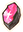
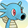
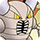
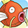
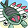
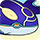
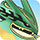

# Pokemon List

Location colors = Wild, Boss, Fainted, Mystery House, Shiny Strong Foe (Friend Bow required)

<table class="pokemonTable">
  <tr>
    <th>No</th>
    <th>Image</th>
    <th>Name</th>
    <th>Ability</th>
    <th>Walk</th>
    <th>Camp</th>
    <th>Locations</th>
    <th>Notes</th>
  </tr>
  <tr>
    <td id="gen_1" colspan="8" class="centeredText highlightGray">Generation 1</td>
  </tr>
  <tr>
    <td>001</td>
    <td></td>
    <td>Bulbasaur  </td>
    <td>Overgrow</td>
    <td>Normal</td>
    <td>Beau Plains</td>
    <td>Joyous Tower 1-5F Sky Tower Buried Relic Silver Trench</td>
    <td>Starter / Partner → Ivysaur (16)</td>
  </tr>
  <tr>
    <td>002</td>
    <td></td>
    <td>Ivysaur  </td>
    <td>Overgrow</td>
    <td>Normal</td>
    <td>Beau Plains</td>
    <td>-</td>
    <td>→ Venusaur (32)</td>
  </tr>
  <tr>
    <td rowspan="2">003</td>
    <td></td>
    <td>Venusaur  </td>
    <td>Overgrow</td>
    <td>Normal</td>
    <td rowspan="2">Beau Plains</td>
    <td rowspan="2">-</td>
    <td rowspan="2">-</td>
  </tr>
  <tr>
    <td></td>
    <td>Mega Venusaur  </td>
    <td>Thick Fat</td>
    <td>Normal</td>
  </tr>
  <tr>
    <td>004</td>
    <td></td>
    <td>Charmander </td>
    <td>Blaze</td>
    <td>Lava</td>
    <td>Mt. Cleft</td>
    <td>Fiery Field 5-9F Sky Tower Buried Relic Silver Trench</td>
    <td>Starter / Partner → Charmeleon (16)</td>
  </tr>
  <tr>
    <td>005</td>
    <td></td>
    <td>Charmeleon </td>
    <td>Blaze</td>
    <td>Lava</td>
    <td>Mt. Cleft</td>
    <td>Fiery Field 20-29F</td>
    <td>→ Charmeleon (36)</td>
  </tr>
  <tr>
    <td rowspan="3">006</td>
    <td></td>
    <td>Charizard  </td>
    <td>Blaze</td>
    <td>Float</td>
    <td rowspan="3">Mt. Cleft</td>
    <td rowspan="3">Mt. Faraway 50-59F</td>
    <td>-</td>
  </tr>
  <tr>
    <td></td>
    <td>Mega Charizard X  </td>
    <td>Tough Claws</td>
    <td>Float</td>
    <td rowspan="2">Mega is random.</td>
  </tr>
  <tr>
    <td></td>
    <td>Mega Charizard Y  </td>
    <td>Drought</td>
    <td>Float</td>
  </tr>
  <tr>
    <td>007</td>
    <td></td>
    <td>Squirtle </td>
    <td>Torrent</td>
    <td>Water</td>
    <td>Turtleshell Pond</td>
    <td>Waterfall Pond 8-12F Murky Cave 8-12F Sky Tower Buried Relic Silver Trench</td>
    <td>Starter / Partner → Wartortle (16)</td>
  </tr>
  <tr>
    <td>008</td>
    <td></td>
    <td>Wartortle </td>
    <td>Torrent</td>
    <td>Water</td>
    <td>Turtleshell Pond</td>
    <td>Northwind Field 21-29F</td>
    <td>→ Blastoise (36)</td>
  </tr>
  <tr>
    <td rowspan="2">009</td>
    <td></td>
    <td>Blastoise </td>
    <td>Torrent</td>
    <td>Water</td>
    <td rowspan="2">Turtleshell Pond</td>
    <td rowspan="2">Mt. Faraway 50-59F</td>
    <td rowspan="2">-</td>
  </tr>
  <tr>
    <td></td>
    <td>Mega Blastoise </td>
    <td>Mega Launcher</td>
    <td>Water</td>
  </tr>
  <tr>
    <td>010</td>
    <td></td>
    <td>Caterpie </td>
    <td>Shield Dust</td>
    <td>Normal</td>
    <td>Stump Forest</td>
    <td>Purity Forest 2-4F Waterfall Pond Wyvern Hill Howling Forest Buried Relic</td>
    <td>→ Metapod (7)</td>
  </tr>
  <tr>
    <td>011</td>
    <td></td>
    <td>Metapod </td>
    <td>Shed Skin</td>
    <td>Normal</td>
    <td>Stump Forest</td>
    <td>Joyous Tower 4-8F Northwind Field Murky Cave</td>
    <td>→ Butterfree (10)</td>
  </tr>
  <tr>
    <td class="centeredText">012 ★</td>
    <td> </td>
    <td>Butterfree  </td>
    <td>Compound Eyes</td>
    <td>Float</td>
    <td>Stump Forest</td>
    <td>Pitfall Valley 4-9F Howling Forest 6-15F Remains Island</td>
    <td>-</td>
  </tr>
  <tr>
    <td>013</td>
    <td></td>
    <td>Weedle  </td>
    <td>Shield Dust</td>
    <td>Normal</td>
    <td>Stump Forest</td>
    <td>Oddity Cave 1-2F Silent Chasm 1-6F Remains Island 1-2F Joyous Tower 28-34F Purity Forest 9-12F Marvelous Sea 1-2F Fantasy Strait 1-2F Mt. Faraway Silver Trench</td>
    <td>→ Kakuna (7)</td>
  </tr>
  <tr>
    <td>014</td>
    <td></td>
    <td>Kakuna  </td>
    <td>Shed Skin</td>
    <td>Normal</td>
    <td>Stump Forest</td>
    <td>Joyous Tower 9-13F Far-Off Sea</td>
    <td>→ Beedrill (10)</td>
  </tr>
  <tr>
    <td rowspan="2">015</td>
    <td></td>
    <td>Beedrill  </td>
    <td>Swarm</td>
    <td>Float</td>
    <td rowspan="2">Stump Forest</td>
    <td rowspan="2">Silent Chasm 8-9F Joyous Tower 31-35F Purity Forest 31-35F Tiny Woods Silver Trench</td>
    <td rowspan="2">-</td>
  </tr>
  <tr>
    <td></td>
    <td>Mega Beedrill  </td>
    <td>Adaptability</td>
    <td>Float</td>
  </tr>
  <tr>
    <td>016</td>
    <td></td>
    <td>Pidgey  </td>
    <td>Keen Eye Tangled Feet</td>
    <td>Float</td>
    <td>Flyaway Forest</td>
    <td>Tiny Woods 1-3F Oddity Cave 1-2F Remains Island 1-2F Pitfall Valley 1-6F Purity Forest 1-3F Marvelous Sea 1-2F Fantasy Strait 1-2F Remains Island Silver Trench</td>
    <td>→ Pidgeotto (18)</td>
  </tr>
  <tr>
    <td>017</td>
    <td></td>
    <td>Pidgeotto  </td>
    <td>Keen Eye Tangled Feet</td>
    <td>Float</td>
    <td>Flyaway Forest</td>
    <td>Mt. Thunder 6-12F Far-Off Sea Murky Cave</td>
    <td>→ Pidgeot (36)</td>
  </tr>
  <tr>
    <td rowspan="2">018</td>
    <td></td>
    <td>Pidgeot  </td>
    <td>Keen Eye Tangled Feet</td>
    <td>Float</td>
    <td rowspan="2">Flyaway Forest</td>
    <td rowspan="2">Mt. Blaze 4-9F Northern Range 1-7F Joyous Tower 59-61F Sky Tower</td>
    <td rowspan="2">-</td>
  </tr>
  <tr>
    <td></td>
    <td>Mega Pidgeot  </td>
    <td>No Guard</td>
    <td>Float</td>
  </tr>
  <tr>
    <td>019</td>
    <td></td>
    <td>Rattata </td>
    <td>Run Away Guts</td>
    <td>Normal</td>
    <td>Wild Plains</td>
    <td>Thunderwave Cave 1-5F Oddity Cave 1-2F Remains Island 1-2F Buried Relic 4-6F Purity Forest 5-7F Wish Cave 5-7F Marvelous Sea 1-2F Fantasy Strait 1-2F Tiny Woods</td>
    <td>→ Raticate (20)</td>
  </tr>
  <tr>
    <td>020</td>
    <td></td>
    <td>Raticate </td>
    <td>Run Away Guts</td>
    <td>Normal</td>
    <td>Wild Plains</td>
    <td>Magma Cavern 1-3F Buried Relic 50-51 / 74-81F Pitfall Valley 4-9F Uproar Forest Pitfall Valley Fantasy Strait</td>
    <td>-</td>
  </tr>
  <tr>
    <td>021</td>
    <td></td>
    <td>Spearow  </td>
    <td>Keen Eye</td>
    <td>Float</td>
    <td>Ravaged Field</td>
    <td>Mt. Steel 2-8F Pitfall Valley 4-9F Purity Forest 9-10F Desert Region</td>
    <td>→ Fearow (20)</td>
  </tr>
  <tr>
    <td>022</td>
    <td></td>
    <td>Fearow  </td>
    <td>Keen Eye</td>
    <td>Float</td>
    <td>Ravaged Field</td>
    <td>Mt. Blaze 12-14F Northern Range 8-15F Joyous Tower 51-54F Purity Forest 51-54F Sky Tower</td>
    <td>-</td>
  </tr>
  <tr>
    <td>023</td>
    <td></td>
    <td>Ekans </td>
    <td>Intimidate Shed Skin</td>
    <td>Normal</td>
    <td>Wild Plains</td>
    <td>Wish Cave 4-7 / 97-98F Darknight Relic Stormy Sea Fiery Field Western Cave Silver Trench</td>
    <td>→ Arbok (22)</td>
  </tr>
  <tr>
    <td>024</td>
    <td></td>
    <td>Arbok </td>
    <td>Intimidate Shed Skin</td>
    <td>Normal</td>
    <td>Wild Plains</td>
    <td>Magma Cavern 8-13F Buried Relic 50-51 / 82-88F Joyous Tower 61-64F Purity Forest 59-63F Wish Cave 60-64F Stormy Sea</td>
    <td>-</td>
  </tr>
  <tr>
    <td>025</td>
    <td></td>
    <td>Pikachu </td>
    <td>Static</td>
    <td>Normal</td>
    <td>Vibrant Forest</td>
    <td>Lightning Field 5-10F</td>
    <td class="evolution">Starter / Partner → Raichu ( x 4)</td>
  </tr>
  <tr>
    <td>026</td>
    <td></td>
    <td>Raichu </td>
    <td>Static</td>
    <td>Normal</td>
    <td>Vibrant Forest</td>
    <td>Lightning Field 23-29F Lightning Field</td>
    <td>-</td>
  </tr>
  <tr>
    <td>027</td>
    <td></td>
    <td>Sandshrew </td>
    <td>Sand Veil</td>
    <td>Normal</td>
    <td>Withering Desert</td>
    <td>Magma Cavern 1-6F Desert Region 1-6F Buried Relic 50-51 / 75-80F Joyous Tower 74-78F Tiny Woods</td>
    <td>→ Sandslash (22)</td>
  </tr>
  <tr>
    <td>028</td>
    <td></td>
    <td>Sandslash </td>
    <td>Sand Veil</td>
    <td>Normal</td>
    <td>Withering Desert</td>
    <td>Magma Cavern 20-23F Desert Region 15-19F Joyous Tower 79-87F Mt. Faraway</td>
    <td>-</td>
  </tr>
  <tr>
    <td>029</td>
    <td></td>
    <td>Nidoran♀ </td>
    <td>Poison Point Rivalry</td>
    <td>Normal</td>
    <td>Safari</td>
    <td>Thunderwave Cave 1-5F Oddity Cave 1-2F Remains Island 1-2F Purity Forest 6-8F Marvelous Sea 1-2F Fantasy Strait 1-2F Grand Sea</td>
    <td>→ Nidorina (16)</td>
  </tr>
  <tr>
    <td>030</td>
    <td></td>
    <td>Nidorina </td>
    <td>Poison Point Rivalry</td>
    <td>Normal</td>
    <td>Safari</td>
    <td>Lapis Cave 1-8F Purity Forest 47-50F Wish Cave 47-50F Great Canyon</td>
    <td class="evolution">→ Nidoqueen ( x 4)</td>
  </tr>
  <tr>
    <td>031</td>
    <td></td>
    <td>Nidoqueen  </td>
    <td>Poison Point Rivalry</td>
    <td>Normal</td>
    <td>Safari</td>
    <td>Magma Cavern 2-5F Desert Region 7-14F Purity Forest 74-76F Wish Cave 74-76F Silver Trench</td>
    <td>-</td>
  </tr>
  <tr>
    <td>032</td>
    <td></td>
    <td>Nidoran♂ </td>
    <td>Poison Point Rivalry</td>
    <td>Normal</td>
    <td>Safari</td>
    <td>Oddity Cave 1-2F Mt. Thunder 1-5F Remains Island 1-2F Purity Forest 31-35F Wish Cave 33-37F Marvelous Sea 1-2F Fantasy Strait 1-2F Waterfall Pond</td>
    <td>→ Nidorino (16)</td>
  </tr>
  <tr>
    <td>033</td>
    <td></td>
    <td>Nidorino </td>
    <td>Poison Point Rivalry</td>
    <td>Normal</td>
    <td>Safari</td>
    <td>Lapis Cave 4-8F Purity Forest 47-50F Wish Cave 47-50F Great Canyon</td>
    <td class="evolution">→ Nidoking ( x 4)</td>
  </tr>
  <tr>
    <td>034</td>
    <td></td>
    <td>Nidoking  </td>
    <td>Poison Point Rivalry</td>
    <td>Normal</td>
    <td>Safari</td>
    <td>Magma Cavern 2-5F Southern Cave 9-19F Purity Forest 77-79F Wish Cave 77-79F Silver Trench</td>
    <td>-</td>
  </tr>
  <tr>
    <td>035</td>
    <td></td>
    <td>Clefairy </td>
    <td>Cute Charm Magic Guard</td>
    <td>Normal</td>
    <td>Mt. Moonview</td>
    <td>Oddity Cave 1-2F Remains Island 1-2F Joyous Tower 9-14F Purity Forest 5-7F Marvelous Sea 1-2F Fantasy Strait 1-2F Stormy Sea</td>
    <td class="evolution">→ Clefable ( x 4)</td>
  </tr>
  <tr>
    <td>036</td>
    <td></td>
    <td>Clefable </td>
    <td>Cute Charm Magic Guard</td>
    <td>Normal</td>
    <td>Mt. Moonview</td>
    <td>Joyous Tower 22-29F Stormy Sea Buried Relic Solar Cave Western Cave</td>
    <td>-</td>
  </tr>
  <tr>
    <td>037</td>
    <td></td>
    <td>Vulpix </td>
    <td>Flash Fire</td>
    <td>Lava</td>
    <td>Darkness Ridge</td>
    <td>Fiery Field 1-5F Stormy Sea Fiery Field Mt. Faraway Pitfall Valley</td>
    <td class="evolution">→ Ninetales ( x 2)</td>
  </tr>
  <tr>
    <td class="centeredText">038 ★</td>
    <td> </td>
    <td>Ninetales </td>
    <td>Flash Fire</td>
    <td>Lava</td>
    <td>Darkness Ridge</td>
    <td>Mt. Faraway 40-49F Northern Range 5-24F Stormy Sea Buried Relic Solar Cave Fiery Field</td>
    <td>-</td>
  </tr>
  <tr>
    <td>039</td>
    <td></td>
    <td>Jigglypuff  </td>
    <td>Cute Charm Competitive</td>
    <td>Normal</td>
    <td>Sky-Blue Plains</td>
    <td>Joyous Tower 1-3F Purity Forest 2-4F Wish Cave 1-4F Remains Island</td>
    <td class="evolution">→ Wigglytuff ( x 4)</td>
  </tr>
  <tr>
    <td>040</td>
    <td></td>
    <td>Wigglytuff  </td>
    <td>Cute Charm Competitive</td>
    <td>Normal</td>
    <td>Sky-Blue Plains</td>
    <td>Joyous Tower 50-56F Stormy Sea Buried Relic Solar Cave Western Cave</td>
    <td>-</td>
  </tr>
  <tr>
    <td>041</td>
    <td></td>
    <td>Zubat  </td>
    <td>Inner Focus</td>
    <td>Float</td>
    <td>Echo Cave</td>
    <td>Oddity Cave 1-2F Lapis Cave 1-3F Remains Island 1-2F Buried Relic 46-50F Marvelous Sea 1-2F Fantasy Strait 1-2F Mt. Thunder Rock Path Mt. Faraway</td>
    <td>→ Golbat (22)</td>
  </tr>
  <tr>
    <td>042</td>
    <td></td>
    <td>Golbat  </td>
    <td>Inner Focus</td>
    <td>Float</td>
    <td>Echo Cave</td>
    <td>Lapis Cave 9-14F Buried Relic 50-51 / 70-76F Purity Forest 47-50F Wish Cave 46-50F Far-Off Sea</td>
    <td class="evolution">→ Crobat ( x 4)</td>
  </tr>
  <tr>
    <td>043</td>
    <td></td>
    <td>Oddish  </td>
    <td>Chlorophyll</td>
    <td>Normal</td>
    <td>Jungle</td>
    <td>Oddity Cave 3-4F Sinister Woods 1-4F Remains Island 3-4F Wyvern Hill 13-20F Purity Forest 18-25F Marvelous Sea 3-4F Fantasy Strait 3-4F Southern Cavern</td>
    <td>→ Gloom (21)</td>
  </tr>
  <tr>
    <td>044</td>
    <td></td>
    <td>Gloom  </td>
    <td>Chlorophyll</td>
    <td>Normal</td>
    <td>Jungle</td>
    <td>Silent Chasm 1-9F Purity Forest 35-48F Darknight Relic Pitfall Valley</td>
    <td class="evolution">→ Vileplume ( x 4) → Bellossom ( x 4)</td>
  </tr>
  <tr>
    <td>045</td>
    <td></td>
    <td>Vileplume  </td>
    <td>Chlorophyll</td>
    <td>Normal</td>
    <td>Jungle</td>
    <td>Great Canyon 1-3F Purity Forest 65-79F Wyvern Hill Buried Relic Northern Range Murky Cave</td>
    <td>-</td>
  </tr>
  <tr>
    <td>046</td>
    <td></td>
    <td>Paras  </td>
    <td>Effect Spore Dry Skin</td>
    <td>Normal</td>
    <td>Mushroom Forest</td>
    <td>Oddity Cave 3-4F Silent Chasm 6-9F Remains Island 3-4F Marvelous Sea 3-4F Fantasy Strait 3-4F Sinister Woods Darknight Relic Pitfall Valley</td>
    <td>→ Parasect (24)</td>
  </tr>
  <tr>
    <td>047</td>
    <td></td>
    <td>Parasect  </td>
    <td>Effect Spore Dry Skin</td>
    <td>Normal</td>
    <td>Mushroom Forest</td>
    <td>Purity Forest 80-99F Waterfall Pond Grand Sea Far-Off Sea Waterfall Pond</td>
    <td>-</td>
  </tr>
  <tr>
    <td>048</td>
    <td></td>
    <td>Venonat  </td>
    <td>Compound Eyes Tinted Lens</td>
    <td>Normal</td>
    <td>Secretive Forest</td>
    <td>Uproar Forest 1-3F Mt. Freeze Mt. Faraway Silver Trench</td>
    <td>→ Venomoth (31)</td>
  </tr>
  <tr>
    <td>049</td>
    <td></td>
    <td>Venomoth  </td>
    <td>Compound Eyes Tinted Lens</td>
    <td>Float</td>
    <td>Secretive Forest</td>
    <td>Sky Tower 21-27F Purity Forest 86-98F Wyvern Hill Far-Off Sea Buried Relic</td>
    <td>-</td>
  </tr>
  <tr>
    <td>050</td>
    <td></td>
    <td>Diglett </td>
    <td>Sand Veil Arena Trap</td>
    <td>Normal</td>
    <td>Boulder Cave</td>
    <td>Southern Cavern 1-7F Joyous Tower 4-6F Desert Region</td>
    <td>→ Dugtrio (26)</td>
  </tr>
  <tr>
    <td>051</td>
    <td></td>
    <td>Dugtrio </td>
    <td>Sand Veil Arena Trap</td>
    <td>Normal</td>
    <td>Boulder Cave</td>
    <td>Southern Cavern 20-31F Joyous Tower 23-28F Purity Forest 23-25F Wish Cave 23-28F Mt. Faraway</td>
    <td>-</td>
  </tr>
  <tr>
    <td>052</td>
    <td></td>
    <td>Meowth </td>
    <td>Pickup Technician</td>
    <td>Normal</td>
    <td>Vibrant Forest</td>
    <td>Wish Cave 20-22 / 97-98F Desert Region Buried Relic Silver Trench</td>
    <td>Starter / Partner → Persian (28)</td>
  </tr>
  <tr>
    <td>053</td>
    <td></td>
    <td>Persian </td>
    <td>Limber Technician</td>
    <td>Normal</td>
    <td>Vibrant Forest</td>
    <td>Joyous Tower 76-79 / 97-98F Sky Tower</td>
    <td>-</td>
  </tr>
  <tr>
    <td>054</td>
    <td></td>
    <td>Psyduck </td>
    <td>Damp Cloud Nine</td>
    <td>Water</td>
    <td>Turtleshell Pond</td>
    <td>Joyous Tower 6-11F Grand Sea Buried Relic Silver Trench</td>
    <td>Starter / Partner → Golduck (33)</td>
  </tr>
  <tr>
    <td>055</td>
    <td></td>
    <td>Golduck </td>
    <td>Damp Cloud Nine</td>
    <td>Water</td>
    <td>Turtleshell Pond</td>
    <td>Northwind Field 6-13F</td>
    <td>-</td>
  </tr>
  <tr>
    <td>056</td>
    <td></td>
    <td>Mankey </td>
    <td>Vital Spirit Anger Point</td>
    <td>Normal</td>
    <td>Vibrant Forest</td>
    <td>Uproar Forest 3F Howling Forest Pitfall Valley Silver Trench</td>
    <td>→ Primeape (28)</td>
  </tr>
  <tr>
    <td>057</td>
    <td></td>
    <td>Primeape </td>
    <td>Vital Spirit Anger Point</td>
    <td>Normal</td>
    <td>Vibrant Forest</td>
    <td>Southern Cavern Grand Sea Mt. Faraway</td>
    <td>-</td>
  </tr>
  <tr>
    <td>058</td>
    <td></td>
    <td>Growlithe </td>
    <td>Intimidate Flash Fire</td>
    <td>Lava</td>
    <td>Scorched Plains</td>
    <td>Mt. Thunder 6-12F Buried Relic 41-47F Mt. Faraway 1-9F Purity Forest 25-26F Sinister Woods Howling Forest</td>
    <td class="evolution">→ Arcanine ( x 2)</td>
  </tr>
  <tr>
    <td>059</td>
    <td></td>
    <td>Arcanine </td>
    <td>Intimidate Flash Fire</td>
    <td>Lava</td>
    <td>Scorched Plains</td>
    <td>Mt. Blaze 12-14F Mt. Faraway 10-20F Purity Forest 50-55F Stormy Sea Buried Relic Solar Cave Fiery Field</td>
    <td>-</td>
  </tr>
  <tr>
    <td>060</td>
    <td></td>
    <td>Poliwag </td>
    <td>Water Absorb Damp</td>
    <td>Water</td>
    <td>Tadpole Pond</td>
    <td>Oddity Cave 3-4F Silent Chasm 4-7F Waterfall Pond 1-5F Remains Island 3-4F Northwind Field 1-5F Purity Forest 23-27F Murky Cave 1-5F Marvelous Sea 3-4F Fantasy Strait 3-4F</td>
    <td>→ Poliwhirl (25)</td>
  </tr>
  <tr>
    <td>061</td>
    <td></td>
    <td>Poliwhirl </td>
    <td>Water Absorb Damp</td>
    <td>Water</td>
    <td>Tadpole Pond</td>
    <td>Waterfall Pond 9-13F Northwind Field 14-19F Murky Cave 9-13F Southern Cave</td>
    <td class="evolution">→ Poliwrath ( x 4) → Politoed ( x 4)</td>
  </tr>
  <tr>
    <td>062</td>
    <td></td>
    <td>Poliwrath  </td>
    <td>Water Absorb Damp</td>
    <td>Water</td>
    <td>Tadpole Pond</td>
    <td>Waterfall Pond 16-18F Northwind Field 23-28F Murky Cave 17-19F Mt. Faraway</td>
    <td>-</td>
  </tr>
  <tr>
    <td>063</td>
    <td></td>
    <td>Abra </td>
    <td>Synchronize Inner Focus</td>
    <td>Float</td>
    <td>Decrepit Lab</td>
    <td>Buried Relic 10 / 20 / 30F Solar Cave 1-8F Western Cave 1-8F Wish Cave 17-20F Marvelous Sea</td>
    <td>Drops Max Ether → Kadabra (16)</td>
  </tr>
  <tr>
    <td>064</td>
    <td></td>
    <td>Kadabra </td>
    <td>Synchronize Inner Focus</td>
    <td>Normal</td>
    <td>Decrepit Lab</td>
    <td>Buried Relic 50-59F Solar Cave 13-19F Western Cave 13-19F Wish Cave 38-42F Uproar Forest Remains Island Desert Region Southern Cavern Wyvern Hill Marvelous Sea</td>
    <td class="evolution">→ Alakazam ( x 4)</td>
  </tr>
  <tr>
    <td rowspan="2">065</td>
    <td></td>
    <td>Alakazam </td>
    <td>Synchronize Inner Focus</td>
    <td>Normal</td>
    <td rowspan="2">Decrepit Lab</td>
    <td rowspan="2">Mt. Faraway 30-39F Silver Trench</td>
    <td rowspan="2">-</td>
  </tr>
  <tr>
    <td></td>
    <td>Mega Alakazam </td>
    <td>Trace</td>
    <td>Normal</td>
  </tr>
  <tr>
    <td>066</td>
    <td></td>
    <td>Machop </td>
    <td>Guts No Guard</td>
    <td>Normal</td>
    <td>Mt. Discipline</td>
    <td>Buried Relic 4-8F Wish Cave 17-22F Southern Cavern Buried Relic Silver Trench</td>
    <td>Starter / Partner → Machoke (28)</td>
  </tr>
  <tr>
    <td>067</td>
    <td></td>
    <td>Machoke </td>
    <td>Guts No Guard</td>
    <td>Normal</td>
    <td>Mt. Discipline</td>
    <td>Buried Relic 40-49F Fiery Field 8-16F</td>
    <td class="evolution">→ Machamp ( x 4)</td>
  </tr>
  <tr>
    <td>068</td>
    <td></td>
    <td>Machamp </td>
    <td>Guts No Guard</td>
    <td>Normal</td>
    <td>Mt. Discipline</td>
    <td>Buried Relic 50-51 / 80-87F Mt. Faraway 1-9F Mt. Faraway</td>
    <td>-</td>
  </tr>
  <tr>
    <td>069</td>
    <td></td>
    <td>Bellsprout  </td>
    <td>Chlorophyll</td>
    <td>Normal</td>
    <td>Jungle</td>
    <td>Purity Forest 1-3F Far-Off Sea Stormy Sea Buried Relic Northwind Field Silver Trench</td>
    <td>→ Weepinbell (21)</td>
  </tr>
  <tr>
    <td>070</td>
    <td></td>
    <td>Weepinbell  </td>
    <td>Chlorophyll</td>
    <td>Normal</td>
    <td>Jungle</td>
    <td>Purity Forest 26-31F Grand Sea Buried Relic</td>
    <td class="evolution">→ Victreebel ( x 4)</td>
  </tr>
  <tr>
    <td>071</td>
    <td></td>
    <td>Victreebel  </td>
    <td>Chlorophyll</td>
    <td>Normal</td>
    <td>Jungle</td>
    <td>Joyous Tower 51-55F Fantasy Strait</td>
    <td>-</td>
  </tr>
  <tr>
    <td>072</td>
    <td></td>
    <td>Tentacool  </td>
    <td>Clear Body Liquid Ooze</td>
    <td>Water</td>
    <td>Bountiful Sea</td>
    <td>Grand Sea 1-9F Stormy Sea 1-9F Silver Trench 1-9F Silver Trench</td>
    <td>→ Tentacruel (30)</td>
  </tr>
  <tr>
    <td>073</td>
    <td></td>
    <td>Tentacruel  </td>
    <td>Clear Body Liquid Ooze</td>
    <td>Water</td>
    <td>Bountiful Sea</td>
    <td>Grand Sea 21-29F Stormy Sea 35-39F Silver Trench 35-44F Grand Sea Far-Off Sea Fantasy Strait</td>
    <td>-</td>
  </tr>
  <tr>
    <td>074</td>
    <td></td>
    <td>Geodude  </td>
    <td>Rock Head Sturdy</td>
    <td>Normal</td>
    <td>Mt. Green</td>
    <td>Mt. Steel 4-8F Southern Cavern 1-6F Buried Relic 4-10F Purity Forest 12-14F Wish Cave 12-14F Howling Forest</td>
    <td>→ Graveler (25)</td>
  </tr>
  <tr>
    <td>075</td>
    <td></td>
    <td>Graveler  </td>
    <td>Rock Head Sturdy</td>
    <td>Normal</td>
    <td>Mt. Green</td>
    <td>Magma Cavern 3-8F Remains Island 3-4F Southern Cavern 25-36F Buried Relic 50-51 / 74-79F Joyous Tower 72-75F Wish Cave 72-75F Marvelous Sea 3-4F Fantasy Strait 3-4F Magma Cavern Northern Range</td>
    <td class="evolution">→ Golem ( x 4)</td>
  </tr>
  <tr>
    <td>076</td>
    <td></td>
    <td>Golem  </td>
    <td>Rock Head Sturdy</td>
    <td>Normal</td>
    <td>Mt. Green</td>
    <td>Magma Cavern 20-25F Southern Cavern 40-49F Buried Relic 50-51 / 91-98F Mt. Faraway 10-20F Joyous Tower 76-79F Purity Forest 76-79F Wish Cave 76-79F Remains Island Far-Off Sea</td>
    <td>-</td>
  </tr>
  <tr>
    <td>077</td>
    <td></td>
    <td>Ponyta </td>
    <td>Run Away Flash Fire</td>
    <td>Lava</td>
    <td>Scorched Plains</td>
    <td>Oddity Cave 3-4F Remains Island 3-4F Joyous Tower 83-85F Purity Forest 81-85F Marvelous Sea 3-4F Fantasy Strait 3-4F Mt. Freeze Solar Cave Fiery Field Mt. Faraway Pitfall Valley</td>
    <td>→ Rapidash (40)</td>
  </tr>
  <tr>
    <td class="centeredText">078 ★</td>
    <td> </td>
    <td>Rapidash </td>
    <td>Run Away Flash Fire</td>
    <td>Lava</td>
    <td>Scorched Plains</td>
    <td>Mt. Blaze 12-14F Fiery Field 14-21F Joyous Tower 57-59F Purity Forest 57-59F Mt. Steel 6-8F Fiery Field</td>
    <td>-</td>
  </tr>
  <tr>
    <td>079</td>
    <td></td>
    <td>Slowpoke  </td>
    <td>Oblivious Own Tempo</td>
    <td>Water</td>
    <td>Bountiful Sea</td>
    <td>Grand Sea 6-9F Far-Off Sea 6-14F Stormy Sea 6-14F Silver Trench 6-14F Thunderwave Cave Marvelous Sea</td>
    <td class="evolution">→ Slowbro (37) → Slowking ( x 2)</td>
  </tr>
  <tr>
    <td rowspan="2">080</td>
    <td></td>
    <td>Slowbro  </td>
    <td>Oblivious Own Tempo</td>
    <td>Water</td>
    <td rowspan="2">Bountiful Sea</td>
    <td rowspan="2">Grand Sea 25-29F Far-Off Sea 30-36F Silver Trench 30-36F Northern Range Fantasy Strait</td>
    <td rowspan="2">-</td>
  </tr>
  <tr>
    <td></td>
    <td>Mega Slowbro  </td>
    <td>Shell Armor</td>
    <td>Water</td>
  </tr>
  <tr>
    <td>081</td>
    <td></td>
    <td>Magnemite  </td>
    <td>Magnet Pull Sturdy</td>
    <td>Float</td>
    <td>Power Plant</td>
    <td>Lightning Field 1-7F Wish Cave 1-3F Southern Cavern Far-Off Sea</td>
    <td>Joins after clearing Mt. Steel → Magneton (30)</td>
  </tr>
  <tr>
    <td>082</td>
    <td></td>
    <td>Magneton  </td>
    <td>Magnet Pull Sturdy</td>
    <td>Float</td>
    <td>Power Plant</td>
    <td>Lightning Field 20-28F Southern Cavern Lightning Field Northwind Field</td>
    <td class="evolution">→ Magnezone ( x 4)</td>
  </tr>
  <tr>
    <td>083</td>
    <td></td>
    <td>Farfetch'd  </td>
    <td>Keen Eye Inner Focus</td>
    <td>Normal</td>
    <td>Wild Plains</td>
    <td>Silent Chasm 3-5F Pitfall Valley 1-6F Joyous Tower 23-27F Purity Forest 23-28F Sinister Woods Sky Tower</td>
    <td>-</td>
  </tr>
  <tr>
    <td>084</td>
    <td></td>
    <td>Doduo  </td>
    <td>Run Away Early Bird</td>
    <td>Normal</td>
    <td>Safari</td>
    <td>Oddity Cave 3-4F Great Canyon 1-3F Remains Island 4F Pitfall Valley 7-12F Joyous Tower 35-39F Purity Forest 35-39F Marvelous Sea 4F Fantasy Strait 4F Mt. Steel Desert Region</td>
    <td>→ Dodrio (31)</td>
  </tr>
  <tr>
    <td>085</td>
    <td></td>
    <td>Dodrio  </td>
    <td>Run Away Early Bird</td>
    <td>Normal</td>
    <td>Safari</td>
    <td>Northern Range 1-7F Sky Tower</td>
    <td>-</td>
  </tr>
  <tr>
    <td>086</td>
    <td></td>
    <td>Seel </td>
    <td>Thick Fat Hydration</td>
    <td>Water</td>
    <td>Ice Floe Beach</td>
    <td>Oddity Cave 4F Mt. Freeze 1-5F Remains Island 4F Far-Off Sea 6-14F Stormy Sea 6-14F Silver Trench 6-14F Marvelous Sea 4F Fantasy Strait 4F Frosty Forest Pitfall Valley</td>
    <td>→ Dewgong (34)</td>
  </tr>
  <tr>
    <td>087</td>
    <td></td>
    <td>Dewgong  </td>
    <td>Thick Fat Hydration</td>
    <td>Water</td>
    <td>Ice Floe Beach</td>
    <td>Far-Off Sea 55-64F Silver Trench 55-64F Northwind Field</td>
    <td>-</td>
  </tr>
  <tr>
    <td>088</td>
    <td></td>
    <td>Grimer </td>
    <td>Stench Sticky Hold</td>
    <td>Normal</td>
    <td>Poison Swamp</td>
    <td>Oddity Cave 4F Magma Cavern 20-25F Remains Island 4F Far-Off Sea 20-29F Stormy Sea 20-29F Joyous Tower 80-85F Purity Forest 81-85F Wish Cave 80-85F Silver Trench 20-29F Marvelous Sea 4F Fantasy Strait 4F Uproar Forest Fantasy Strait</td>
    <td>→ Muk (38)</td>
  </tr>
  <tr>
    <td>089</td>
    <td></td>
    <td>Muk </td>
    <td>Stench Sticky Hold</td>
    <td>Normal</td>
    <td>Poison Swamp</td>
    <td>Far-Off Sea 60-69F Silver Trench 60-69F Buried Relic Western Cave Murky Cave Marvelous Sea</td>
    <td>-</td>
  </tr>
  <tr>
    <td>090</td>
    <td></td>
    <td>Shellder </td>
    <td>Shell Armor Skill Link</td>
    <td>Water</td>
    <td>Bountiful Sea</td>
    <td>Remains Island 4F Far-Off Sea 1-8F Stormy Sea 1-8F Silver Trench 1-8F Marvelous Sea 4F Fantasy Strait 4F Fantasy Strait</td>
    <td class="evolution">→ Cloyster ( x 2)</td>
  </tr>
  <tr>
    <td>091</td>
    <td></td>
    <td>Cloyster  </td>
    <td>Shell Armor Skill Link</td>
    <td>Water</td>
    <td>Bountiful Sea</td>
    <td>Silver Trench 80-89F Magma Cavern Stormy Sea Buried Relic Solar Cave Northwind Field</td>
    <td>-</td>
  </tr>
  <tr>
    <td>092</td>
    <td></td>
    <td>Gastly  </td>
    <td>Levitate</td>
    <td>Mobile</td>
    <td>Darkness Ridge</td>
    <td>Oddity Cave 5-6F Remains Island 5-6F Darknight Relic 1-6F Buried Relic 11-16F Marvelous Sea 5-6F Fantasy Strait 5-6F Darknight Relic Pitfall Valley</td>
    <td>→ Haunter (25)</td>
  </tr>
  <tr>
    <td>093</td>
    <td></td>
    <td>Haunter  </td>
    <td>Levitate</td>
    <td>Mobile</td>
    <td>Darkness Ridge</td>
    <td>Darknight Relic 7-10F Buried Relic 31-36F Uproar Forest Remains Island Desert Region Southern Cavern Wyvern Hill Darknight Relic Pitfall Valley</td>
    <td class="evolution">→ Gengar ( x 4)</td>
  </tr>
  <tr>
    <td rowspan="2">094</td>
    <td></td>
    <td>Gengar  </td>
    <td>Cursed Body</td>
    <td>Mobile</td>
    <td rowspan="2">Darkness Ridge</td>
    <td rowspan="2">Darknight Relic 12-14F</td>
    <td rowspan="2">-</td>
  </tr>
  <tr>
    <td></td>
    <td>Mega Gengar  </td>
    <td>Shadow Tag</td>
    <td>Mobile</td>
  </tr>
  <tr>
    <td>095</td>
    <td></td>
    <td>Onix  </td>
    <td>Rock Head Sturdy</td>
    <td>Normal</td>
    <td>Boulder Cave</td>
    <td>Oddity Cave 5-8F Magma Cavern 23-25F Southern Cavern 40-49F Uproar Forest Magma Cavern Remains Island Desert Region Southern Cavern Wyvern Hill Northern Range</td>
    <td class="evolution">Large size → Steelix ( x 2)</td>
  </tr>
  <tr>
    <td>096</td>
    <td></td>
    <td>Drowzee </td>
    <td>Insomnia Forewarn</td>
    <td>Normal</td>
    <td>Wild Plains</td>
    <td>Buried Relic 11-16F Solar Cave 1-5F Western Cave 1-5F Marvelous Sea</td>
    <td>→ Hypno (26)</td>
  </tr>
  <tr>
    <td>097</td>
    <td></td>
    <td>Hypno </td>
    <td>Insomnia Forewarn</td>
    <td>Normal</td>
    <td>Wild Plains</td>
    <td>Remains Island 5-6F Buried Relic 22-29F Solar Cave 9-14F Western Cave 9-14F Marvelous Sea 5-6F Fantasy Strait 5-6F Marvelous Sea</td>
    <td>-</td>
  </tr>
  <tr>
    <td>098</td>
    <td></td>
    <td>Krabby </td>
    <td>Hyper Cutter Shell Armor</td>
    <td>Water</td>
    <td>Shallow Beach</td>
    <td>Grand Sea 15-20F Far-Off Sea 1-10F Silver Trench 15-24F Uproar Forest Remains Island Desert Region Southern Cavern Wyvern Hill Grand Sea Far-Off Sea Fantasy Strait</td>
    <td>→ Kingler (28)</td>
  </tr>
  <tr>
    <td>099</td>
    <td></td>
    <td>Kingler </td>
    <td>Hyper Cutter Shell Armor</td>
    <td>Water</td>
    <td>Shallow Beach</td>
    <td>Grand Sea 24-29F Far-Off Sea 26-35F Silver Trench 26-35F Stormy Sea Murky Cave Marvelous Sea</td>
    <td>-</td>
  </tr>
  <tr>
    <td>100</td>
    <td></td>
    <td>Voltorb </td>
    <td>Soundproof Static</td>
    <td>Normal</td>
    <td>Power Plant</td>
    <td>Thunderwave Cave 1-5F Oddity Cave 5-6F Remains Island 5-6F Southern Cavern 4-8F Purity Forest 7-10F Wish Cave 8-10F Marvelous Sea 5-6F Fantasy Strait 5-6F Far-Off Sea Pitfall Valley</td>
    <td>→ Electrode (30)</td>
  </tr>
  <tr>
    <td class="centeredText">101 ★</td>
    <td> </td>
    <td>Electrode </td>
    <td>Soundproof Static</td>
    <td>Normal</td>
    <td>Power Plant</td>
    <td>Lightning Field 15-21F Joyous Tower 50-55F Purity Forest 51-53F Wish Cave 51-55F Mt. Faraway 5-59F Lightning Field</td>
    <td>-</td>
  </tr>
  <tr>
    <td class="centeredText">102 ★</td>
    <td> </td>
    <td>Exeggcute  </td>
    <td>Chlorophyll</td>
    <td>Normal</td>
    <td>Jungle</td>
    <td>Tiny Woods 1-3F Oddity Cave 5-6F Remains Island 5-6F Howling Forest 1-2F Purity Forest 1-3F Marvelous Sea 5-6F Fantasy Strait 5-6F Wyvern Hill 10-24F Waterfall Pond</td>
    <td class="evolution">→ Exeggutor ( x 2)</td>
  </tr>
  <tr>
    <td class="centeredText">103 ★</td>
    <td> </td>
    <td>Exeggutor  </td>
    <td>Chlorophyll</td>
    <td>Normal</td>
    <td>Jungle</td>
    <td>Sinister Woods 7-12F Joyous Tower 15-20F Purity Forest 15-16F Pitfall Valley 4-25F Far-Off Sea Northwind Field</td>
    <td>-</td>
  </tr>
  <tr>
    <td>104</td>
    <td></td>
    <td>Cubone </td>
    <td>Rock Head Lightning Rod</td>
    <td>Normal</td>
    <td>Mt. Green</td>
    <td>Southern Cavern 10-19F Darknight Relic Buried Relic Silver Trench</td>
    <td>Starter / Partner → Marowak (28)</td>
  </tr>
  <tr>
    <td>105</td>
    <td></td>
    <td>Marowak </td>
    <td>Rock Head Lightning Rod</td>
    <td>Normal</td>
    <td>Mt. Green</td>
    <td>Southern Cavern 30-40F</td>
    <td>-</td>
  </tr>
  <tr>
    <td>106</td>
    <td></td>
    <td>Hitmonlee </td>
    <td>Limber Reckless</td>
    <td>Normal</td>
    <td>Mt. Discipline</td>
    <td>Oddity Cave 5-6F Remains Island 5-6F Buried Relic 38-45F Purity Forest 51-56F Wish Cave 51-56F Marvelous Sea 5-6F Fantasy Strait 5-6F Frosty Forest Mt. Faraway</td>
    <td>-</td>
  </tr>
  <tr>
    <td>107</td>
    <td></td>
    <td>Hitmonchan </td>
    <td>Keen Eye Iron Fist</td>
    <td>Normal</td>
    <td>Mt. Discipline</td>
    <td>Buried Relic 50-51 / 60-73F Purity Forest 51-56F Wish Cave 51-56F Mt. Freeze Mt. Faraway</td>
    <td>-</td>
  </tr>
  <tr>
    <td>108</td>
    <td></td>
    <td>Lickitung </td>
    <td>Own Tempo Oblivious</td>
    <td>Normal</td>
    <td>Sky-Blue Plains</td>
    <td>Oddity Cave 5-6F Remains Island 5-6F Marvelous Sea 5-6F Fantasy Strait 5-6F Fantasy Strait</td>
    <td class="evolution">→ Lickilicky ( x 2)</td>
  </tr>
  <tr>
    <td>109</td>
    <td></td>
    <td>Koffing </td>
    <td>Levitate</td>
    <td>Float</td>
    <td>Poison Swamp</td>
    <td>Magma Cavern 16-22F Joyous Tower 71-75F Purity Forest 71F Wish Cave 71-75F Uproar Forest Waterfall Pond</td>
    <td>→ Weezing (35)</td>
  </tr>
  <tr>
    <td>110</td>
    <td></td>
    <td>Weezing </td>
    <td>Levitate</td>
    <td>Float</td>
    <td>Poison Swamp</td>
    <td>Sky Tower 8-16F Joyous Tower 86-94F Purity Forest 86-95F Wish Cave 86-98F Murky Cave Fantasy Strait</td>
    <td>-</td>
  </tr>
  <tr>
    <td>111</td>
    <td></td>
    <td>Rhyhorn  </td>
    <td>Lightning Rod Rock Head</td>
    <td>Normal</td>
    <td>Safari</td>
    <td>Frosty Forest 10-13F Southern Cavern 20-30F Buried Relic 50-51 / 63-68F Joyous Tower 58-61F Purity Forest 58-61F Wish Cave 58-61F Thunderwave Cave</td>
    <td>→ Rhydon (42)</td>
  </tr>
  <tr>
    <td>112</td>
    <td></td>
    <td>Rhydon  </td>
    <td>Lightning Rod Rock Head</td>
    <td>Lava</td>
    <td>Safari</td>
    <td>Magma Cavern 18-22F Southern Cavern 40-49F Joyous Tower 71-76F Purity Forest 72-74F Wish Cave 71-76F Mt. Faraway</td>
    <td class="evolution">→ Rhyperior ( x 4)</td>
  </tr>
  <tr>
    <td>113</td>
    <td></td>
    <td>Chansey </td>
    <td>Natural Cure Serene Grace</td>
    <td>Normal</td>
    <td>Sky-Blue Plains</td>
    <td>Joyous Tower 50 / 60 / 77F Far-Off Sea</td>
    <td class="evolution">→ Blissey ( x 4)</td>
  </tr>
  <tr>
    <td>114</td>
    <td></td>
    <td>Tangela </td>
    <td>Chlorophyll Leaf Guard</td>
    <td>Normal</td>
    <td>Jungle</td>
    <td>Oddity Cave 7-8F Lapis Cave 9-14F Remains Island 7-9F Joyous Tower 47-50F Purity Forest 48-50F Marvelous Sea 7-9F Fantasy Strait 7-9F Darknight Relic Pitfall Valley</td>
    <td class="evolution">→ Tangrowth ( x 2)</td>
  </tr>
  <tr>
    <td rowspan="2">115</td>
    <td></td>
    <td>Kangaskhan </td>
    <td>Early Bird Scrappy</td>
    <td>Normal</td>
    <td rowspan="2">Safari</td>
    <td rowspan="2">Joyous Tower 76-79 / 97-98F Sky Tower Southern Cavern Western Cave Northern Range Pitfall Valley Murky Cave</td>
    <td rowspan="2">-</td>
  </tr>
  <tr>
    <td></td>
    <td>Mega Kangaskhan </td>
    <td>Parental Bond</td>
    <td>Normal</td>
  </tr>
  <tr>
    <td>116</td>
    <td></td>
    <td>Horsea </td>
    <td>Swift Swim Sniper</td>
    <td>Water</td>
    <td>Treasure Sea</td>
    <td>Grand Sea 10-20F Silver Trench 10-20F Southern Cavern</td>
    <td>→ Seadra (32)</td>
  </tr>
  <tr>
    <td>117</td>
    <td></td>
    <td>Seadra </td>
    <td>Poison Point Sniper</td>
    <td>Water</td>
    <td>Treasure Sea</td>
    <td>Grand Sea 27-29F Stormy Sea 30-34F Silver Trench 30-39F Murky Cave</td>
    <td class="evolution">→ Kingdra ( x 4)</td>
  </tr>
  <tr>
    <td>118</td>
    <td></td>
    <td>Goldeen </td>
    <td>Swift Swim Water Veil</td>
    <td>Water</td>
    <td>Rub-a-Dub River</td>
    <td>Waterfall Pond 1-5F Murky Cave 1-5F Wyvern Hill</td>
    <td>→ Seaking (33)</td>
  </tr>
  <tr>
    <td>119</td>
    <td></td>
    <td>Seaking </td>
    <td>Swift Swim Water Veil</td>
    <td>Water</td>
    <td>Rub-a-Dub River</td>
    <td>Desert Region</td>
    <td>-</td>
  </tr>
  <tr>
    <td>120</td>
    <td></td>
    <td>Staryu </td>
    <td>Illuminate Natural Cure</td>
    <td>Water</td>
    <td>Bountiful Sea</td>
    <td>Grand Sea 15-25F Silver Trench 15-25F Magma Cavern Uproar Forest Remains Island Desert Region Southern Cavern Wyvern Hill Grand Sea Far-Off Sea Fantasy Strait</td>
    <td class="evolution">→ Starmie ( x 2)</td>
  </tr>
  <tr>
    <td class="centeredText">121 ★</td>
    <td> </td>
    <td>Starmie  </td>
    <td>Illuminate Natural Cure</td>
    <td>Water</td>
    <td>Bountiful Sea</td>
    <td>Far-Off Sea 35-44F Stormy Sea 35-39F Silver Trench 35-44F Grand Sea 6-29F Far-Off Sea</td>
    <td>-</td>
  </tr>
  <tr>
    <td>122</td>
    <td></td>
    <td>Mr. Mime  </td>
    <td>Soundproof Filter</td>
    <td>Normal</td>
    <td>Decrepit Lab</td>
    <td>Oddity Cave 7-8F Remains Island 7-9F Buried Relic 13-39F Solar Cave 7-12F Western Cave 7-12F Marvelous Sea 7-9F Fantasy Strait 7-9F Stormy Sea Buried Relic Solar Cave Silver Trench Marvelous Sea</td>
    <td>-</td>
  </tr>
  <tr>
    <td>123</td>
    <td></td>
    <td>Scyther  </td>
    <td>Swarm Technician</td>
    <td>Float</td>
    <td>Overgrown Forest</td>
    <td>Sinister Woods 7-12F Pitfall Valley 13-18F Joyous Tower 15-19F Purity Forest 16-18F Mt. Steel</td>
    <td class="evolution">→ Scizor ( x 2)</td>
  </tr>
  <tr>
    <td>124</td>
    <td></td>
    <td>Jynx  </td>
    <td>Oblivious Forewarn</td>
    <td>Normal</td>
    <td>Frigid Cavern</td>
    <td>Solar Cave 1-6F Northwind Field 12-19F Western Cave 1-6F Uproar Forest Remains Island Desert Region Southern Cavern Wyvern Hill Northwind Field Marvelous Sea</td>
    <td>-</td>
  </tr>
  <tr>
    <td>125</td>
    <td></td>
    <td>Electabuzz </td>
    <td>Static</td>
    <td>Normal</td>
    <td>Power Plant</td>
    <td>Mt. Thunder 6-12F Remains Island 7-9F Purity Forest 33-37F Wish Cave 33-37F Marvelous Sea 7-9F Fantasy Strait 7-9F Stormy Sea Northern Range</td>
    <td class="evolution">→ Electivire ( x 4)</td>
  </tr>
  <tr>
    <td>126</td>
    <td></td>
    <td>Magmar </td>
    <td>Flame Body</td>
    <td>Lava</td>
    <td>Crater</td>
    <td>Magma Cavern 8-13F Remains Island 7-9F Fiery Field 4-8F Joyous Tower 47-50F Purity Forest 47-49F Wish Cave 47-50F Marvelous Sea 7-9F Fantasy Strait 7-9F Fiery Field</td>
    <td class="evolution">→ Magmortar ( x 4)</td>
  </tr>
  <tr>
    <td rowspan="2">127</td>
    <td></td>
    <td>Pinsir </td>
    <td>Hyper Cutter Mold Breaker</td>
    <td>Normal</td>
    <td rowspan="2">Overgrown Forest</td>
    <td rowspan="2">Mt. Steel 7-8F Oddity Cave 7-8F Remains Island 7-9F Joyous Tower 9-11F Marvelous Sea 7-9F Fantasy Strait 7-9F Solar Cave</td>
    <td rowspan="2">-</td>
  </tr>
  <tr>
    <td></td>
    <td>Mega Pinsir  </td>
    <td>Aerilate</td>
    <td>Float</td>
  </tr>
  <tr>
    <td>128</td>
    <td></td>
    <td>Tauros </td>
    <td>Intimidate Anger Point</td>
    <td>Normal</td>
    <td>Safari</td>
    <td>Great Canyon 9-12F Joyous Tower 40-44F Purity Forest 35-42F Wish Cave 36-43F Mt. Thunder Fiery Field Northwind Field Murky Cave</td>
    <td>-</td>
  </tr>
  <tr>
    <td class="centeredText">129 ★</td>
    <td> </td>
    <td>Magikarp </td>
    <td>Swift Swim</td>
    <td>Water</td>
    <td>Waterfall Lake</td>
    <td>Waterfall Pond 7-11F Murky Cave 6-10F Marvelous Sea 1-17F Remains Island Fantasy Strait</td>
    <td>→ Gyarados (20)</td>
  </tr>
  <tr>
    <td rowspan="2" class="centeredText">130 ★</td>
    <td> </td>
    <td>Gyarados  </td>
    <td>Intimidate</td>
    <td>Float</td>
    <td rowspan="2">Waterfall Lake</td>
    <td rowspan="2">Waterfall Pond 5-18F Grand Sea Far-Off Sea Fantasy Strait</td>
    <td rowspan="2">-</td>
  </tr>
  <tr>
    <td></td>
    <td>Mega Gyarados  </td>
    <td>Mold Breaker</td>
    <td>Float</td>
  </tr>
  <tr>
    <td>131</td>
    <td></td>
    <td>Lapras  </td>
    <td>Water Absorb Shell Armor</td>
    <td>Water</td>
    <td>Mystic Lake</td>
    <td>Far-Off Sea 45-50F Northwind Field</td>
    <td>-</td>
  </tr>
  <tr>
    <td class="centeredText">132 ★</td>
    <td> </td>
    <td>Ditto </td>
    <td>Limber</td>
    <td>Normal</td>
    <td>Decrepit Lab</td>
    <td>Frosty Forest 4-7 / 12-13F Unown Relic 1-10F Fiery Field 2-20F Joyous Tower 52-59F Wish Cave 54-64F Buried Relic 6-37 / 40-98F Waterfall Pond</td>
    <td>-</td>
  </tr>
  <tr>
    <td>133</td>
    <td></td>
    <td>Eevee </td>
    <td>Run Away Adaptability</td>
    <td>Normal</td>
    <td>Evolution Forest</td>
    <td>Joyous Tower 12-17F Buried Relic Silver Trench</td>
    <td class="evolution">Starter / Partner → Vaporeon ( x 2) → Jolteon ( x 2) → Flareon ( x 2) → Espeon ( x 2) → Umbreon ( x 2) → Leafeon ( x 2) → Glaceon ( x 2) → Sylveon ( x 2)</td>
  </tr>
  <tr>
    <td>134</td>
    <td></td>
    <td>Vaporeon </td>
    <td>Water Absorb</td>
    <td>Water</td>
    <td>Evolution Forest</td>
    <td>Grand Sea 20F Far-Off Sea 　20/25/30/40/50/60/70F Northwind Field 10/20/27F Silver Trench 　20/30/50/60/70/80F</td>
    <td>-</td>
  </tr>
  <tr>
    <td>135</td>
    <td></td>
    <td>Jolteon </td>
    <td>Volt Absorb</td>
    <td>Normal</td>
    <td>Evolution Forest</td>
    <td>Lightning Field 8-14F Lightning Field</td>
    <td>-</td>
  </tr>
  <tr>
    <td>136</td>
    <td></td>
    <td>Flareon </td>
    <td>Flash Fire</td>
    <td>Lava</td>
    <td>Evolution Forest</td>
    <td>Fiery Field 7-13F Fiery Field</td>
    <td>-</td>
  </tr>
  <tr>
    <td>137</td>
    <td></td>
    <td>Porygon </td>
    <td>Trace Download</td>
    <td>Normal</td>
    <td>Decrepit Lab</td>
    <td>Buried Relic 5-10F Darknight Relic</td>
    <td class="evolution">→ Porygon2 ( x 2)</td>
  </tr>
  <tr>
    <td>138</td>
    <td></td>
    <td>Omanyte  </td>
    <td>Swift Swim Shell Armor</td>
    <td>Water</td>
    <td>Deepsea Floor</td>
    <td>Far-Off Sea 1-9F Stormy Sea 1-9F Silver Trench 1-9F Southern Cavern Pitfall Valley</td>
    <td>→ Omastar (40)</td>
  </tr>
  <tr>
    <td>139</td>
    <td></td>
    <td>Omastar  </td>
    <td>Swift Swim Shell Armor</td>
    <td>Water</td>
    <td>Deepsea Floor</td>
    <td>Far-Off Sea 20-29F Stormy Sea 24-29F Silver Trench 20-29F Fiery Field</td>
    <td>-</td>
  </tr>
  <tr>
    <td>140</td>
    <td></td>
    <td>Kabuto  </td>
    <td>Swift Swim Battle Armor</td>
    <td>Water</td>
    <td>Deepsea Floor</td>
    <td>Grand Sea 5-13F Silver Trench 5-13F Remains Island Pitfall Valley</td>
    <td>→ Kabutops (40)</td>
  </tr>
  <tr>
    <td>141</td>
    <td></td>
    <td>Kabutops  </td>
    <td>Swift Swim Battle Armor</td>
    <td>Water</td>
    <td>Deepsea Floor</td>
    <td>Grand Sea 24-29F Stormy Sea 24-34F Silver Trench 25-34F Mt. Faraway</td>
    <td>-</td>
  </tr>
  <tr>
    <td rowspan="2">142</td>
    <td></td>
    <td>Aerodactyl  </td>
    <td>Rock Head Pressure</td>
    <td>Float</td>
    <td rowspan="2">Ancient Relic</td>
    <td rowspan="2">Sky Tower 22-31F Buried Relic 50-51 / 95-98F Pitfall Valley 15-25F Joyous Tower 94-97F Purity Forest 92-99F Great Canyon Lightning Field</td>
    <td rowspan="2">-</td>
  </tr>
  <tr>
    <td></td>
    <td>Mega Aerodactyl  </td>
    <td>Tough Claws</td>
    <td>Float</td>
  </tr>
  <tr>
    <td>143</td>
    <td></td>
    <td>Snorlax </td>
    <td>Immunity Thick Fat</td>
    <td>Normal</td>
    <td>Vibrant Forest</td>
    <td>Stormy Sea</td>
    <td>-</td>
  </tr>
  <tr>
    <td>144</td>
    <td></td>
    <td>Articuno  </td>
    <td>Pressure</td>
    <td>Float</td>
    <td>Legendary Island</td>
    <td>Frosty Forest 14F</td>
    <td>Large size</td>
  </tr>
  <tr>
    <td>145</td>
    <td></td>
    <td>Zapdos  </td>
    <td>Pressure</td>
    <td>Float</td>
    <td>Legendary Island</td>
    <td>Mt. Thunder 13F</td>
    <td>Large size</td>
  </tr>
  <tr>
    <td>146</td>
    <td></td>
    <td>Articuno  </td>
    <td>Pressure</td>
    <td>Float</td>
    <td>Legendary Island</td>
    <td>Mt. Blaze 15F</td>
    <td>Large size</td>
  </tr>
  <tr>
    <td>147</td>
    <td></td>
    <td>Dratini </td>
    <td>Shed Skin</td>
    <td>Water</td>
    <td>Mystic Lake</td>
    <td>Wyvern Hill 1-5F Far-Off Sea 50-59F Silver Trench 50-59F Stormy Sea Buried Relic</td>
    <td>→ Dragonair (30)</td>
  </tr>
  <tr>
    <td>148</td>
    <td></td>
    <td>Dragonair </td>
    <td>Shed Skin</td>
    <td>Water</td>
    <td>Mystic Lake</td>
    <td>Wyvern Hill 12-20F Wyvern Hill</td>
    <td>→ Dragonite (55)</td>
  </tr>
  <tr>
    <td class="centeredText">149 ★</td>
    <td> </td>
    <td>Dragonite  </td>
    <td>Inner Focus</td>
    <td>Float</td>
    <td>Mystic Lake</td>
    <td>Grand Sea 10/15/20/25F Mt. Thunder 3-12F Far-Off Sea</td>
    <td>-</td>
  </tr>
  <tr>
    <td rowspan="3">150</td>
    <td></td>
    <td>Mewtwo </td>
    <td>Pressure</td>
    <td>Float</td>
    <td rowspan="3">Cryptic Cave</td>
    <td rowspan="3">Western Cave 20F</td>
    <td>-</td>
  </tr>
  <tr>
    <td></td>
    <td>Mega Mewtwo X  </td>
    <td>Steadfast</td>
    <td>Float</td>
    <td rowspan="2">Mega is random.</td>
  </tr>
  <tr>
    <td></td>
    <td>Mega Mewtwo Y </td>
    <td>Insomnia</td>
    <td>Float</td>
  </tr>
  <tr>
    <td>151</td>
    <td></td>
    <td>Mew </td>
    <td>Synchronize</td>
    <td>Float</td>
    <td>Final Island</td>
    <td>Buried Relic 　40/60/70/90/98F</td>
    <td>-</td>
  </tr>
  <tr>
    <td id="gen_2" colspan="8" class="centeredText highlightGray">Generation 2</td>
  </tr>
  <tr>
    <td>152</td>
    <td></td>
    <td>Chikorita </td>
    <td>Overgrow</td>
    <td>Normal</td>
    <td>Beau Plains</td>
    <td>Joyous Tower 4-7F Buried Relic Silver Trench Fantasy Strait</td>
    <td>Starter / Partner → Bayleef (16)</td>
  </tr>
  <tr>
    <td>153</td>
    <td></td>
    <td>Bayleef </td>
    <td>Overgrow</td>
    <td>Normal</td>
    <td>Beau Plains</td>
    <td>-</td>
    <td>→ Meganium (32)</td>
  </tr>
  <tr>
    <td>154</td>
    <td></td>
    <td>Meganium </td>
    <td>Overgrow</td>
    <td>Normal</td>
    <td>Beau Plains</td>
    <td>-</td>
    <td>-</td>
  </tr>
  <tr>
    <td>155</td>
    <td></td>
    <td>Cyndaquil </td>
    <td>Blaze</td>
    <td>Lava</td>
    <td>Scorched Plains</td>
    <td>Joyous Tower 13-17F Buried Relic Silver Trench Marvelous Sea</td>
    <td>Starter / Partner → Quilava (14)</td>
  </tr>
  <tr>
    <td>156</td>
    <td></td>
    <td>Quilava </td>
    <td>Blaze</td>
    <td>Lava</td>
    <td>Scorched Plains</td>
    <td>Fiery Field 7-13F</td>
    <td>→ Typhlosion (36)</td>
  </tr>
  <tr>
    <td>157</td>
    <td></td>
    <td>Typhlosion </td>
    <td>Blaze</td>
    <td>Lava</td>
    <td>Scorched Plains</td>
    <td>Mt. Faraway 20-29F Murky Cave 7-12F</td>
    <td>-</td>
  </tr>
  <tr>
    <td>158</td>
    <td></td>
    <td>Totodile </td>
    <td>Torrent</td>
    <td>Water</td>
    <td>Rub-a-Dub River</td>
    <td>Waterfall Pond 3-6F Wyvern Hill 6-11F Remains Island Buried Relic Silver Trench</td>
    <td>Starter / Partner → Croconaw (18)</td>
  </tr>
  <tr>
    <td>159</td>
    <td></td>
    <td>Croconaw </td>
    <td>Torrent</td>
    <td>Water</td>
    <td>Rub-a-Dub River</td>
    <td>Northwind Field 23-29F</td>
    <td>→ Feraligatr (30)</td>
  </tr>
  <tr>
    <td>160</td>
    <td></td>
    <td>Feraligatr </td>
    <td>Torrent</td>
    <td>Water</td>
    <td>Rub-a-Dub River</td>
    <td>Mt. Faraway 10-19F</td>
    <td>-</td>
  </tr>
  <tr>
    <td>161</td>
    <td></td>
    <td>Sentret </td>
    <td>Run Away Keen Eye</td>
    <td>Normal</td>
    <td>Thunder Crag</td>
    <td>Oddity Cave 7-8F Sinister Woods 3-6F Remains Island 7-9F Purity Forest 19-21F Marvelous Sea 7-9F Fantasy Strait 7-9F Oddity Cave Buried Relic Fantasy Strait</td>
    <td>→ Furret (15)</td>
  </tr>
  <tr>
    <td>162</td>
    <td></td>
    <td>Furret </td>
    <td>Run Away Keen Eye</td>
    <td>Normal</td>
    <td>Thunder Crag</td>
    <td>Frosty Forest 1-3F Purity Forest 61-63F Mt. Blaze</td>
    <td>-</td>
  </tr>
  <tr>
    <td class="centeredText">163 ★</td>
    <td> </td>
    <td>Hoothoot  </td>
    <td>Insomnia Keen Eye</td>
    <td>Float</td>
    <td>Flyaway Forest</td>
    <td>Sinister Woods 7-12F Buried Relic 7-11F Northern Range 1-5F Purity Forest 16-18F Murky Cave 5-19F Howling Forest</td>
    <td>→ Noctowl (20)</td>
  </tr>
  <tr>
    <td class="centeredText">164 ★</td>
    <td> </td>
    <td>Noctowl  </td>
    <td>Insomnia Keen Eye</td>
    <td>Float</td>
    <td>Flyaway Forest</td>
    <td>Buried Relic 30-34F Northern Range 12-16F Lapis Cave 4-14F Uproar Forest Sky Tower</td>
    <td>-</td>
  </tr>
  <tr>
    <td>165</td>
    <td></td>
    <td>Ledyba  </td>
    <td>Swarm Early Bird</td>
    <td>Float</td>
    <td>Stump Forest</td>
    <td>Oddity Cave 7-8F Sinister Woods 7-9F Remains Island 7-9F Pitfall Valley 1-6F Joyous Tower 22-25F Purity Forest 22-25F Marvelous Sea 7-9F Fantasy Strait 7-9F Uproar Forest Mt. Faraway</td>
    <td>→ Ledian (18)</td>
  </tr>
  <tr>
    <td>166</td>
    <td></td>
    <td>Ledian  </td>
    <td>Swarm Early Bird</td>
    <td>Float</td>
    <td>Stump Forest</td>
    <td>Sky Tower 12-20F Northern Range 6-11F Joyous Tower 86-88F Purity Forest 86-88F Far-Off Sea Howling Forest</td>
    <td>-</td>
  </tr>
  <tr>
    <td>167</td>
    <td></td>
    <td>Spinarak  </td>
    <td>Swarm Insomnia</td>
    <td>Normal</td>
    <td>Secretive Forest</td>
    <td>Silent Chasm 7-9F Northern Range 17-22F Joyous Tower 27-32F Purity Forest 26-32F Wish Cave 26-32F Tiny Woods Oddity Cave Northern Range</td>
    <td>→ Ariados (22)</td>
  </tr>
  <tr>
    <td>168</td>
    <td></td>
    <td>Ariados  </td>
    <td>Swarm Insomnia</td>
    <td>Normal</td>
    <td>Secretive Forest</td>
    <td>Great Canyon 8-12F Southern Cavern 20-30F Joyous Tower 42-46F Purity Forest 42-46F Wish Cave 42-46F Marvelous Sea</td>
    <td>-</td>
  </tr>
  <tr>
    <td>169</td>
    <td></td>
    <td>Crobat  </td>
    <td>Inner Focus</td>
    <td>Float</td>
    <td>Echo Cave</td>
    <td>Magma Cavern 3-8F Northwind Field 4-10F Joyous Tower Silver Trench</td>
    <td>-</td>
  </tr>
  <tr>
    <td>170</td>
    <td></td>
    <td>Chinchou  </td>
    <td>Volt Absorb Illuminate</td>
    <td>Water</td>
    <td>Deepsea Floor</td>
    <td>Silver Trench 70-79F Lightning Field</td>
    <td>→ Lanturn (27)</td>
  </tr>
  <tr>
    <td>171</td>
    <td></td>
    <td>Lanturn  </td>
    <td>Volt Absorb Illuminate</td>
    <td>Water</td>
    <td>Deepsea Floor</td>
    <td>Silver Trench 90-98F Lightning Field</td>
    <td>-</td>
  </tr>
  <tr>
    <td>172</td>
    <td></td>
    <td>Pichu </td>
    <td>Static</td>
    <td>Normal</td>
    <td>Vibrant Forest</td>
    <td>Joyous Tower 1-4F Waterfall Pond Buried Relic Silver Trench</td>
    <td class="evolution">→ Pikachu ( x 2)</td>
  </tr>
  <tr>
    <td>173</td>
    <td></td>
    <td>Cleffa </td>
    <td>Cute Charm Magic Guard</td>
    <td>Normal</td>
    <td>Mt. Moonview</td>
    <td>Purity Forest 1-4F Wish Cave 1-4F Wyvern Hill</td>
    <td class="evolution">→ Clefairy ( x 2)</td>
  </tr>
  <tr>
    <td>174</td>
    <td></td>
    <td>Igglybuff  </td>
    <td>Cute Charm Competitive</td>
    <td>Normal</td>
    <td>Sky-Blue Plains</td>
    <td>Joyous Tower 40-46F Mt. Faraway</td>
    <td class="evolution">→ Jigglypuff ( x 2)</td>
  </tr>
  <tr>
    <td>175</td>
    <td></td>
    <td>Togepi </td>
    <td>Hustle Serene Grace</td>
    <td>Normal</td>
    <td>Flyaway Forest</td>
    <td>Purity Forest 6-9F Wish Cave 5-10F Southern Cavern Fiery Field</td>
    <td class="evolution">→ Togetic ( x 2)</td>
  </tr>
  <tr>
    <td>176</td>
    <td></td>
    <td>Togetic </td>
    <td>Hustle Serene Grace</td>
    <td>Normal</td>
    <td>Flyaway Forest</td>
    <td>Northern Range 14-20F Wyvern Hill</td>
    <td class="evolution">→ Togekiss ( x 4)</td>
  </tr>
  <tr>
    <td>177</td>
    <td></td>
    <td>Natu  </td>
    <td>Synchronize Early Bird</td>
    <td>Normal</td>
    <td>Flyaway Forest</td>
    <td>Solar Cave 1-5F Western Cave 1-5F Purity Forest 14-17F Wish Cave 13-17F Far-Off Sea Mt. Faraway Marvelous Sea</td>
    <td>→ Xatu (25)</td>
  </tr>
  <tr>
    <td>178</td>
    <td></td>
    <td>Xatu  </td>
    <td>Synchronize Early Bird</td>
    <td>Normal</td>
    <td>Flyaway Forest</td>
    <td>Northern Range 1-7F Sky Tower</td>
    <td>-</td>
  </tr>
  <tr>
    <td>179</td>
    <td></td>
    <td>Mareep </td>
    <td>Static</td>
    <td>Normal</td>
    <td>Thunder Crag</td>
    <td>Lightning Field 1-5F Far-Off Sea Pitfall Valley</td>
    <td>→ Flaaffy (15)</td>
  </tr>
  <tr>
    <td>180</td>
    <td></td>
    <td>Flaaffy </td>
    <td>Static</td>
    <td>Normal</td>
    <td>Thunder Crag</td>
    <td>Remains Island 10-12F Lightning Field 7-13F Marvelous Sea 10-13F Fantasy Strait 10-13F Stormy Sea Northwind Field Pitfall Valley</td>
    <td>→ Ampharos (30)</td>
  </tr>
  <tr>
    <td rowspan="2" class="centeredText">181 ★</td>
    <td> </td>
    <td>Ampharos </td>
    <td>Static</td>
    <td>Normal</td>
    <td rowspan="2">Thunder Crag</td>
    <td rowspan="2">Buried Relic 32-37F Lightning Field 16-21F Purity Forest 31-33F Sinister Woods 3-12F Lightning Field</td>
    <td rowspan="2">-</td>
  </tr>
  <tr>
    <td></td>
    <td>Mega Ampharos  </td>
    <td>Mold Breaker</td>
    <td>Normal</td>
  </tr>
  <tr>
    <td>182</td>
    <td></td>
    <td>Bellossom </td>
    <td>Chlorophyll</td>
    <td>Normal</td>
    <td>Jungle</td>
    <td>Joyous Tower 30-38F Silver Trench</td>
    <td>-</td>
  </tr>
  <tr>
    <td>183</td>
    <td></td>
    <td>Marill  </td>
    <td>Thick Fat Huge Power</td>
    <td>Water</td>
    <td>Turtleshell Pond</td>
    <td>Remains Island 10-12F Purity Forest 11-14F Marvelous Sea 10-13F Fantasy Strait 10-13F Lapis Cave Silver Trench</td>
    <td>→ Azumarill (18)</td>
  </tr>
  <tr>
    <td class="centeredText">184 ★</td>
    <td> </td>
    <td>Azumarill  </td>
    <td>Thick Fat Huge Power</td>
    <td>Water</td>
    <td>Turtleshell Pond</td>
    <td>Northwind Field 1-3F Joyous Tower 50-56F Mt. Blaze 3-14F Stormy Sea Buried Relic Solar Cave Western Cave</td>
    <td>-</td>
  </tr>
  <tr>
    <td class="centeredText">185 ★</td>
    <td> </td>
    <td>Sudowoodo </td>
    <td>Sturdy Rock Head</td>
    <td>Normal</td>
    <td>Overgrown Forest</td>
    <td>Sinister Woods 1-4F Purity Forest 17-19F Desert Region 5-19F Waterfall Pond Stormy Sea Buried Relic Solar Cave Silver Trench</td>
    <td>-</td>
  </tr>
  <tr>
    <td>186</td>
    <td></td>
    <td>Politoed </td>
    <td>Water Absorb Damp</td>
    <td>Water</td>
    <td>Tadpole Pond</td>
    <td>Northwind Field 26-29F Silver Trench</td>
    <td>-</td>
  </tr>
  <tr>
    <td>187</td>
    <td></td>
    <td>Hoppip  </td>
    <td>Chlorophyll Leaf Guard</td>
    <td>Float</td>
    <td>Beau Plains</td>
    <td>Remains Island 10-12F Pitfall Valley 4-8F Purity Forest 9-10F Marvelous Sea 10-13F Fantasy Strait 10-13F Mt. Thunder</td>
    <td>→ Skiploom (18)</td>
  </tr>
  <tr>
    <td>188</td>
    <td></td>
    <td>Skiploom  </td>
    <td>Chlorophyll Leaf Guard</td>
    <td>Float</td>
    <td>Beau Plains</td>
    <td>Great Canyon 1-3F Remains Island 10-12F Pitfall Valley 15-22F Joyous Tower 42-46F Purity Forest 42-46F Marvelous Sea 10-13F Fantasy Strait 10-13F Northwind Field</td>
    <td>→ Jumpluff (27)</td>
  </tr>
  <tr>
    <td>189</td>
    <td></td>
    <td>Jumpluff  </td>
    <td>Chlorophyll Leaf Guard</td>
    <td>Float</td>
    <td>Beau Plains</td>
    <td>Wyvern Hill 4-24F Northern Range 10-17F Magma Cavern Murky Cave</td>
    <td>-</td>
  </tr>
  <tr>
    <td class="centeredText">190 ★</td>
    <td> </td>
    <td>Aipom </td>
    <td>Run Away Pickup</td>
    <td>Normal</td>
    <td>Vibrant Forest</td>
    <td>Uproar Forest 1-3F Remains Island 10-12F Marvelous Sea 10-13F Fantasy Strait 10-13F Solar Cave 5-19F Mt. Freeze</td>
    <td class="evolution">→ Ambipom ( x 2)</td>
  </tr>
  <tr>
    <td>191</td>
    <td></td>
    <td>Sunkern </td>
    <td>Chlorophyll Solar Power</td>
    <td>Normal</td>
    <td>Jungle</td>
    <td>Tiny Woods 1-3F Waterfall Pond Northern Range</td>
    <td class="evolution">→ Sunflora ( x 2)</td>
  </tr>
  <tr>
    <td>192</td>
    <td></td>
    <td>Sunflora </td>
    <td>Chlorophyll Solar Power</td>
    <td>Normal</td>
    <td>Jungle</td>
    <td>Sinister Woods 2-8F Joyous Tower 19-23F Purity Forest 20-24F Grand Sea</td>
    <td>-</td>
  </tr>
  <tr>
    <td>193</td>
    <td></td>
    <td>Yanma  </td>
    <td>Speed Boost Compound Eyes</td>
    <td>Float</td>
    <td>Stump Forest</td>
    <td>Silent Chasm 4-6F Pitfall Valley 9-15F Purity Forest 26-30F Sinister Woods</td>
    <td class="evolution">→ Yanmega ( x 2)</td>
  </tr>
  <tr>
    <td>194</td>
    <td></td>
    <td>Wooper  </td>
    <td>Damp Water Absorb</td>
    <td>Water</td>
    <td>Gourd Swamp</td>
    <td>Waterfall Pond 6-9F Remains Island 10-12F Murky Cave 5-9F Marvelous Sea 10-13F Fantasy Strait 10-13F Mt. Steel Desert Region</td>
    <td>→ Quagsire (20)</td>
  </tr>
  <tr>
    <td>195</td>
    <td></td>
    <td>Quagsire  </td>
    <td>Damp Water Absorb</td>
    <td>Water</td>
    <td>Gourd Swamp</td>
    <td>Waterfall Pond 15-18F Northern Range</td>
    <td>-</td>
  </tr>
  <tr>
    <td class="centeredText">196 ★</td>
    <td> </td>
    <td>Espeon </td>
    <td>Synchronize</td>
    <td>Normal</td>
    <td>Evolution Forest</td>
    <td>Murky Cave 15-19F Remains Island 1-12F</td>
    <td>-</td>
  </tr>
  <tr>
    <td>197</td>
    <td></td>
    <td>Umbreon </td>
    <td>Synchronize</td>
    <td>Normal</td>
    <td>Evolution Forest</td>
    <td>-</td>
    <td>-</td>
  </tr>
  <tr>
    <td>198</td>
    <td></td>
    <td>Murkrow  </td>
    <td>Insomnia Super Luck</td>
    <td>Float</td>
    <td>Flyaway Forest</td>
    <td>Great Canyon 4-8F Remains Island 10-12F Purity Forest 39-42F Wish Cave 10-13F Marvelous Sea 10-13F Fantasy Strait 10-13F Darknight Relic Howling Forest</td>
    <td class="evolution">→ Honchkrow ( x 2)</td>
  </tr>
  <tr>
    <td>199</td>
    <td></td>
    <td>Slowking  </td>
    <td>Oblivious Own Tempo</td>
    <td>Water</td>
    <td>Bountiful Sea</td>
    <td>Far-Off Sea 50-59F Silver Trench 50-59F Silver Trench</td>
    <td>-</td>
  </tr>
  <tr>
    <td>200</td>
    <td></td>
    <td>Misdreavus </td>
    <td>Levitate</td>
    <td>Mobile</td>
    <td>Darkness Ridge</td>
    <td>Remains Island 10-12F Darknight Relic 1-14F Marvelous Sea 10-13F Fantasy Strait 10-13F Uproar Forest Remains Island Desert Region Southern Cavern Wyvern Hill Darknight Relic Pitfall Valley</td>
    <td class="evolution">→ Mismagius ( x 2)</td>
  </tr>
  <tr>
    <td>201</td>
    <td></td>
    <td>Unown </td>
    <td>Levitate</td>
    <td>Float</td>
    <td>Aged Chamber A-N Aged Chamber O-?</td>
    <td>Unown Relic 1-10F Unown Relic (E/H/L/P/!/?)</td>
    <td>-</td>
  </tr>
  <tr>
    <td class="centeredText">202 ★</td>
    <td> </td>
    <td>Wobbuffet </td>
    <td>Shadow Tag</td>
    <td>Normal</td>
    <td>Echo Cave</td>
    <td>Buried Relic 40-47F Solar Cave 11-16F Western Cave 11-16F Darknight Relic 6-14F Uproar Forest Waterfall Pond Remains Island Desert Region Southern Cavern Wyvern Hill</td>
    <td>-</td>
  </tr>
  <tr>
    <td>203</td>
    <td></td>
    <td>Girafarig  </td>
    <td>Inner Focus Early Bird</td>
    <td>Normal</td>
    <td>Sky-Blue Plains</td>
    <td>Solar Cave 1-4F Western Cave 1-4F Silver Trench Fantasy Strait</td>
    <td>-</td>
  </tr>
  <tr>
    <td>204</td>
    <td></td>
    <td>Pineco </td>
    <td>Sturdy</td>
    <td>Normal</td>
    <td>Secretive Forest</td>
    <td>Mt. Freeze 4-8F Joyous Tower 61-64F Purity Forest 63-64F Wish Cave 61-64F Marvelous Sea 14-15F Fantasy Strait 14-15F Remains Island Wyvern Hill Western Cave</td>
    <td>→ Forretress (31)</td>
  </tr>
  <tr>
    <td>205</td>
    <td></td>
    <td>Forretress  </td>
    <td>Sturdy</td>
    <td>Normal</td>
    <td>Secretive Forest</td>
    <td>Sky Tower 1-6F Joyous Tower 86-88F Purity Forest 51-53F Wish Cave 51-53F Southern Cavern</td>
    <td>-</td>
  </tr>
  <tr>
    <td>206</td>
    <td></td>
    <td>Dunsparce </td>
    <td>Serene Grace Run Away</td>
    <td>Normal</td>
    <td>Echo Cave</td>
    <td>Great Canyon 1-3F Joyous Tower 43-44F Wish Cave 43-44F Marvelous Sea 14-15F Fantasy Strait 14-15F Mt. Thunder Uproar Forest Waterfall Pond Remains Island Desert Region Southern Cavern Wyvern Hill</td>
    <td>-</td>
  </tr>
  <tr>
    <td>207</td>
    <td></td>
    <td>Gligar  </td>
    <td>Hyper Cutter Sand Veil</td>
    <td>Float</td>
    <td>Mt. Green</td>
    <td>Mt. Thunder 6-12F Desert Region 15-19F Southern Cavern 15-25F Joyous Tower 31-35F Purity Forest 31-35F Wish Cave 31-35F Silent Chasm</td>
    <td class="evolution">→ Gliscor ( x 2)</td>
  </tr>
  <tr>
    <td rowspan="2">208</td>
    <td></td>
    <td>Steelix  </td>
    <td>Rock Head Sturdy</td>
    <td>Normal</td>
    <td rowspan="2">Boulder Cave</td>
    <td rowspan="2">Magma Cavern 24-25F Mt. Faraway 46-59F Uproar Forest Magma Cavern Remains Island Desert Region Southern Cavern Wyvern Hill Northern Range</td>
    <td rowspan="2">-</td>
  </tr>
  <tr>
    <td></td>
    <td>Mega Steelix  </td>
    <td>Sand Force</td>
    <td>Normal</td>
  </tr>
  <tr>
    <td>209</td>
    <td></td>
    <td>Snubbull </td>
    <td>Intimidate Run Away</td>
    <td>Normal</td>
    <td>Sky-Blue Plains</td>
    <td>Remains Island 1-12F Mt. Faraway Western Cave Northern Range Silver Trench Howling Forest</td>
    <td>→ Granbull (23)</td>
  </tr>
  <tr>
    <td>210</td>
    <td></td>
    <td>Granbull </td>
    <td>Intimidate Quick Feet</td>
    <td>Normal</td>
    <td>Sky-Blue Plains</td>
    <td>Joyous Tower 60-69F Howling Forest Stormy Sea Buried Relic Solar Cave Western Cave</td>
    <td>-</td>
  </tr>
  <tr>
    <td>211</td>
    <td></td>
    <td>Qwilfish  </td>
    <td>Poison Point Swift Swim</td>
    <td>Water</td>
    <td>Serene Sea</td>
    <td>Grand Sea 1-9F Silver Trench 1-9F Marvelous Sea 14-15F Fantasy Strait 14-15F Fantasy Strait</td>
    <td>-</td>
  </tr>
  <tr>
    <td rowspan="2">212</td>
    <td></td>
    <td>Scizor  </td>
    <td>Swarm Technician</td>
    <td>Normal</td>
    <td rowspan="2">Overgrown Forest</td>
    <td rowspan="2">Sky Tower 19-25F Joyous Tower 90-95F Purity Forest 89-93F Wish Cave 90-95F Pitfall Valley</td>
    <td rowspan="2">-</td>
  </tr>
  <tr>
    <td></td>
    <td>Mega Scizor  </td>
    <td>Technician</td>
    <td>Normal</td>
  </tr>
  <tr>
    <td class="centeredText">213 ★</td>
    <td> </td>
    <td>Shuckle  </td>
    <td>Sturdy Gluttony</td>
    <td>Normal</td>
    <td>Mt. Green</td>
    <td>Purity Forest 51-55F Marvelous Sea 14-15F Fantasy Strait 14-15F Southern Cavern 12-49F Great Canyon Waterfall Pond</td>
    <td>-</td>
  </tr>
  <tr>
    <td rowspan="2">214</td>
    <td></td>
    <td>Heracross  </td>
    <td>Swarm Guts</td>
    <td>Normal</td>
    <td rowspan="2">Overgrown Forest</td>
    <td rowspan="2">Great Canyon 7-11F Buried Relic 41-50F Joyous Tower 39-42F Purity Forest 39-42F Marvelous Sea 14-15F Fantasy Strait 14-15F Mt. Thunder Southern Cavern Howling Forest Solar Cave Western Cave</td>
    <td rowspan="2">-</td>
  </tr>
  <tr>
    <td></td>
    <td>Mega Heracross  </td>
    <td>Skill Link</td>
    <td>Normal</td>
  </tr>
  <tr>
    <td>215</td>
    <td></td>
    <td>Sneasel  </td>
    <td>Inner Focus Keen Eye</td>
    <td>Normal</td>
    <td>Darkness Ridge</td>
    <td>Buried Relic 30-37F Howling Forest Stormy Sea Buried Relic Solar Cave Silver Trench</td>
    <td class="evolution">→ Weavile ( x 2)</td>
  </tr>
  <tr>
    <td>216</td>
    <td></td>
    <td>Teddiursa </td>
    <td>Pickup Quick Feet</td>
    <td>Normal</td>
    <td>Mt. Green</td>
    <td>Silent Chasm 1-3F Joyous Tower 26-30F Purity Forest 27-30F Marvelous Sea 14-15F Fantasy Strait 14-15F Sinister Woods Remains Island Stormy Sea Northern Range</td>
    <td>→ Ursaring (30)</td>
  </tr>
  <tr>
    <td>217</td>
    <td></td>
    <td>Ursaring </td>
    <td>Guts Quick Feet</td>
    <td>Normal</td>
    <td>Mt. Green</td>
    <td>Fiery Field 1-6F Stormy Sea</td>
    <td>-</td>
  </tr>
  <tr>
    <td>218</td>
    <td></td>
    <td>Slugma </td>
    <td>Magma Armor Flame Body</td>
    <td>Lava</td>
    <td>Crater</td>
    <td>Mt. Blaze 1-11F Fiery Field 1-6F Lapis Cave Fiery Field</td>
    <td>→ Magcargo (38)</td>
  </tr>
  <tr>
    <td>219</td>
    <td></td>
    <td>Magcargo  </td>
    <td>Magma Armor Flame Body</td>
    <td>Lava</td>
    <td>Crater</td>
    <td>Magma Cavern 12-19F Fiery Field 17-23F Mt. Faraway 1-5F Purity Forest 56-61F Wish Cave 56-60 / 71-77F Fiery Field</td>
    <td>-</td>
  </tr>
  <tr>
    <td>220</td>
    <td></td>
    <td>Swinub  </td>
    <td>Oblivious Snow Cloak</td>
    <td>Normal</td>
    <td>Frigid Cavern</td>
    <td>Sinister Woods 1-3F Purity Forest 19-22F Wish Cave 17-23F Marvelous Sea 16-17F Fantasy Strait 16-19F Mt. Steel Wyvern Hill</td>
    <td>→ Piloswine (33)</td>
  </tr>
  <tr>
    <td>221</td>
    <td></td>
    <td>Piloswine  </td>
    <td>Oblivious Snow Cloak</td>
    <td>Normal</td>
    <td>Frigid Cavern</td>
    <td>Frosty Forest 3-6F Purity Forest 59-62F Wish Cave 59-63F Northwind Field</td>
    <td class="evolution">→ Mamoswine ( x 4)</td>
  </tr>
  <tr>
    <td class="centeredText">222 ★</td>
    <td> </td>
    <td>Corsola  </td>
    <td>Hustle Natural Cure</td>
    <td>Water</td>
    <td>Shallow Beach</td>
    <td>Grand Sea 5-13F Silver Trench 5-13F Far-Off Sea 6-74F Oddity Cave Lapis Cave Grand Sea Far-Off Sea Fantasy Strait</td>
    <td>-</td>
  </tr>
  <tr>
    <td>223</td>
    <td></td>
    <td>Remoraid </td>
    <td>Hustle Sniper</td>
    <td>Water</td>
    <td>Treasure Sea</td>
    <td>Grand Sea 10-19F Stormy Sea 10-19F Silver Trench 10-19F Fiery Field Northwind Field</td>
    <td>→ Octillery (25)</td>
  </tr>
  <tr>
    <td>224</td>
    <td></td>
    <td>Octillery </td>
    <td>Suction Cups Sniper</td>
    <td>Water</td>
    <td>Treasure Sea</td>
    <td>Far-Off Sea 55-64F Silver Trench 55-64F Waterfall Pond</td>
    <td>-</td>
  </tr>
  <tr>
    <td>225</td>
    <td></td>
    <td>Delibird  </td>
    <td>Vital Spirit Hustle</td>
    <td>Normal</td>
    <td>Frigid Cavern</td>
    <td>Northwind Field 17-25F Marvelous Sea 16-17F Fantasy Strait 16-19F Uproar Forest Sky Tower Remains Island Desert Region Southern Cavern Wyvern Hill Stormy Sea Buried Relic Solar Cave Northwind Field</td>
    <td>-</td>
  </tr>
  <tr>
    <td>226</td>
    <td></td>
    <td>Mantine  </td>
    <td>Swift Swim Water Absorb</td>
    <td>Float</td>
    <td>Serene Sea</td>
    <td>Grand Sea 28-29F Grand Sea Far-Off Sea Fantasy Strait</td>
    <td>-</td>
  </tr>
  <tr>
    <td>227</td>
    <td></td>
    <td>Skarmory  </td>
    <td>Keen Eye Sturdy</td>
    <td>Float</td>
    <td>Ravaged Field</td>
    <td>Mt. Faraway 6-19F Purity Forest 15-17F Grand Sea</td>
    <td>-</td>
  </tr>
  <tr>
    <td>228</td>
    <td></td>
    <td>Houndour  </td>
    <td>Early Bird Flash Fire</td>
    <td>Lava</td>
    <td>Ravaged Field</td>
    <td>Silent Chasm 5-9F Howling Forest 2-10F Joyous Tower 25-27F Oddity Cave Silver Trench Howling Forest</td>
    <td>→ Houndoom (24)</td>
  </tr>
  <tr>
    <td rowspan="2">229</td>
    <td></td>
    <td>Houndoom  </td>
    <td>Early Bird Flash Fire</td>
    <td>Lava</td>
    <td rowspan="2">Ravaged Field</td>
    <td rowspan="2">Great Canyon 10-12F Howling Forest 11-15F Joyous Tower 41-46F Howling Forest Fiery Field</td>
    <td rowspan="2">-</td>
  </tr>
  <tr>
    <td></td>
    <td>Mega Houndoom  </td>
    <td>Solar Power</td>
    <td>Lava</td>
  </tr>
  <tr>
    <td>230</td>
    <td></td>
    <td>Kingdra  </td>
    <td>Swift Swim Sniper</td>
    <td>Water</td>
    <td>Treasure Sea</td>
    <td>Far-Off Sea 70-74F Silver Trench 70-79F Silver Trench</td>
    <td>-</td>
  </tr>
  <tr>
    <td>231</td>
    <td></td>
    <td>Phanpy </td>
    <td>Pickup</td>
    <td>Normal</td>
    <td>Safari</td>
    <td>Great Canyon 4-6F Southern Cavern 4-12F Marvelous Sea 16-17F Fantasy Strait 16-19F Silent Chasm</td>
    <td>→ Donphan (25)</td>
  </tr>
  <tr>
    <td>232</td>
    <td></td>
    <td>Donphan </td>
    <td>Sturdy</td>
    <td>Normal</td>
    <td>Safari</td>
    <td>Southern Cavern 31-40F Southern Cavern</td>
    <td>-</td>
  </tr>
  <tr>
    <td>233</td>
    <td></td>
    <td>Porygon2 </td>
    <td>Trace Download</td>
    <td>Normal</td>
    <td>Decrepit Lab</td>
    <td>Buried Relic 50-51 / 86-93F Joyous Tower 79-85F Purity Forest 79-85F Wish Cave 79-84F Solar Cave</td>
    <td class="evolution">→ Porygon-Z ( x 4)</td>
  </tr>
  <tr>
    <td>234</td>
    <td></td>
    <td>Stantler </td>
    <td>Intimidate Frisk</td>
    <td>Normal</td>
    <td>Vibrant Forest</td>
    <td>Mt. Thunder 1-5F Joyous Tower 31-36F Purity Forest 31-36F Marvelous Sea 16-17F Fantasy Strait 16-19F Silent Chasm</td>
    <td>-</td>
  </tr>
  <tr>
    <td>235</td>
    <td></td>
    <td>Smeargle </td>
    <td>Own Tempo Technician</td>
    <td>Normal</td>
    <td>Sky-Blue Plains</td>
    <td>Western Cave 4-7F</td>
    <td>Joins after clearing Howling Forest</td>
  </tr>
  <tr>
    <td>236</td>
    <td></td>
    <td>Tyrogue </td>
    <td>Guts Steadfast</td>
    <td>Normal</td>
    <td>Mt. Discipline</td>
    <td>Mt. Steel 1-8F Buried Relic 11-17F Purity Forest 13-14F Wish Cave 11-13F Marvelous Sea 16-17F Fantasy Strait 16-19F Thunderwave Cave Grand Sea Solar Cave</td>
    <td class="evolution">→ Hitmonlee 　(Lv20 &  x 2) → Hitmonchan 　(Lv20 &  x 2) → Hitmontop 　(Lv20 &  x 2)</td>
  </tr>
  <tr>
    <td>237</td>
    <td></td>
    <td>Hitmontop </td>
    <td>Intimidate Technician</td>
    <td>Normal</td>
    <td>Mt. Discipline</td>
    <td>Desert Region 7-13F Buried Relic 50-51 / 60-67F Wish Cave 83-88F Mt. Blaze Mt. Faraway</td>
    <td>-</td>
  </tr>
  <tr>
    <td>238</td>
    <td></td>
    <td>Smoochum  </td>
    <td>Oblivious Forewarn</td>
    <td>Normal</td>
    <td>Frigid Cavern</td>
    <td>Joyous Tower 17-22F Marvelous Sea 16-17F Fantasy Strait 16-19F Mt. Thunder Marvelous Sea</td>
    <td>→ Jynx (30)</td>
  </tr>
  <tr>
    <td>239</td>
    <td></td>
    <td>Elekid </td>
    <td>Static</td>
    <td>Normal</td>
    <td>Power Plant</td>
    <td>Thunderwave Cave 1-5F Buried Relic 5-9F Lightning Field 15-22F Purity Forest 7-9F Marvelous Sea 16-17F Fantasy Strait 16-19F Lightning Field</td>
    <td>→ Electabuzz (30)</td>
  </tr>
  <tr>
    <td>240</td>
    <td></td>
    <td>Magby </td>
    <td>Flame Body</td>
    <td>Lava</td>
    <td>Crater</td>
    <td>Mt. Blaze 1-6F Fiery Field 4-9F Joyous Tower 51-55F Purity Forest 53-55F Wish Cave 72-76F Fantasy Strait 20-21F Sinister Woods Buried Relic Fiery Field Mt. Faraway</td>
    <td>→ Magmar (30)</td>
  </tr>
  <tr>
    <td>241</td>
    <td></td>
    <td>Miltank </td>
    <td>Thick Fat Scrappy</td>
    <td>Normal</td>
    <td>Safari</td>
    <td>Purity Forest 85-99F Waterfall Pond Wyvern Hill Western Cave Murky Cave Silver Trench Stormy Sea Buried Relic Solar Cave Western Cave</td>
    <td>-</td>
  </tr>
  <tr>
    <td>242</td>
    <td></td>
    <td>Blissey </td>
    <td>Natural Cure Serene Grace</td>
    <td>Normal</td>
    <td>Sky-Blue Plains</td>
    <td>Joyous Tower 88F Western Cave</td>
    <td>-</td>
  </tr>
  <tr>
    <td>243</td>
    <td></td>
    <td>Raikou </td>
    <td>Pressure</td>
    <td>Normal</td>
    <td>Sacred Field</td>
    <td>Lightning Field 30F</td>
    <td>-</td>
  </tr>
  <tr>
    <td>244</td>
    <td></td>
    <td>Entei </td>
    <td>Pressure</td>
    <td>Lava</td>
    <td>Sacred Field</td>
    <td>Fiery Field 30F</td>
    <td>-</td>
  </tr>
  <tr>
    <td>245</td>
    <td></td>
    <td>Suicune </td>
    <td>Pressure</td>
    <td>Water</td>
    <td>Sacred Field</td>
    <td>Northwind Field 30F</td>
    <td>-</td>
  </tr>
  <tr>
    <td>246</td>
    <td></td>
    <td>Larvitar  </td>
    <td>Guts</td>
    <td>Normal</td>
    <td>Mt. Cleft</td>
    <td>Southern Cavern 16-26F Fantasy Strait 20-21F Silent Chasm Northern Range</td>
    <td>→ Pupitar (30)</td>
  </tr>
  <tr>
    <td>247</td>
    <td></td>
    <td>Pupitar  </td>
    <td>Shed Skin</td>
    <td>Normal</td>
    <td>Mt. Cleft</td>
    <td>Mt. Freeze 6-12F Southern Cavern 37-45F Buried Relic 50-51 / 56-62F Joyous Tower 65-68F Purity Forest 65-68F Marvelous Sea</td>
    <td>→ Tyranitar (55)</td>
  </tr>
  <tr>
    <td rowspan="2">248</td>
    <td></td>
    <td>Tyranitar  </td>
    <td>Sand Stream</td>
    <td>Normal</td>
    <td rowspan="2">Mt. Cleft</td>
    <td rowspan="2">Mt. Faraway 20-30F Silver Trench</td>
    <td rowspan="2">-</td>
  </tr>
  <tr>
    <td></td>
    <td>Mega Tyranitar  </td>
    <td>Sand Stream</td>
    <td>Normal</td>
  </tr>
  <tr>
    <td>249</td>
    <td></td>
    <td>Lugia  </td>
    <td>Pressure</td>
    <td>Float</td>
    <td>Deepsea Current</td>
    <td>Silver Trench 99F</td>
    <td>Large size</td>
  </tr>
  <tr>
    <td>250</td>
    <td></td>
    <td>Ho-Oh  </td>
    <td>Pressure</td>
    <td>Float</td>
    <td>Rainbow Peak</td>
    <td>Mt. Faraway 60F</td>
    <td>Large size</td>
  </tr>
  <tr>
    <td class="centeredText">251 ★</td>
    <td> </td>
    <td>Celebi  </td>
    <td>Natural Cure</td>
    <td>Float</td>
    <td>Healing Forest</td>
    <td>Western Cave *1</td>
    <td>Joins after clearing Purity Forest  *1: Shiny can appear in a Mystery House after normal one joins</td>
  </tr>
  <tr>
    <td id="gen_3" colspan="8" class="centeredText highlightGray">Generation 3</td>
  </tr>
  <tr>
    <td>252</td>
    <td></td>
    <td>Treecko </td>
    <td>Overgrow</td>
    <td>Normal</td>
    <td>Overgrown Forest</td>
    <td>Joyous Tower 1-4F Buried Relic Lightning Field Silver Trench</td>
    <td>Starter / Partner → Grovyle (16)</td>
  </tr>
  <tr>
    <td>253</td>
    <td></td>
    <td>Grovyle </td>
    <td>Overgrow</td>
    <td>Normal</td>
    <td>Overgrown Forest</td>
    <td>-</td>
    <td>→ Sceptile (36)</td>
  </tr>
  <tr>
    <td rowspan="2">254</td>
    <td></td>
    <td>Sceptile </td>
    <td>Overgrow</td>
    <td>Normal</td>
    <td rowspan="2">Overgrown Forest</td>
    <td rowspan="2">-</td>
    <td rowspan="2">-</td>
  </tr>
  <tr>
    <td></td>
    <td>Mega Sceptile  </td>
    <td>Lightning Rod</td>
    <td>Normal</td>
  </tr>
  <tr>
    <td>255</td>
    <td></td>
    <td>Torchic </td>
    <td>Blaze</td>
    <td>Lava</td>
    <td>Scorched Plains</td>
    <td>Joyous Tower 7-10F Buried Relic Northwind Field Silver Trench</td>
    <td>Starter / Partner → Combusken (16)</td>
  </tr>
  <tr>
    <td>256</td>
    <td></td>
    <td>Combusken  </td>
    <td>Blaze</td>
    <td>Lava</td>
    <td>Scorched Plains</td>
    <td>Fiery Field 24-29F</td>
    <td>→ Blaziken (36)</td>
  </tr>
  <tr>
    <td rowspan="2">257</td>
    <td></td>
    <td>Blaziken  </td>
    <td>Blaze</td>
    <td>Lava</td>
    <td rowspan="2">Scorched Plains</td>
    <td rowspan="2">Mt. Faraway 30-39F</td>
    <td rowspan="2">-</td>
  </tr>
  <tr>
    <td></td>
    <td>Mega Blaziken  </td>
    <td>Speed Boost</td>
    <td>Lava</td>
  </tr>
  <tr>
    <td>258</td>
    <td></td>
    <td>Mudkip </td>
    <td>Torrent</td>
    <td>Water</td>
    <td>Gourd Swamp</td>
    <td>Waterfall Pond 1-3F Murky Cave 1-5F Buried Relic Fiery Field Silver Trench</td>
    <td>Starter / Partner → Marshtomp (16)</td>
  </tr>
  <tr>
    <td>259</td>
    <td></td>
    <td>Marshtomp  </td>
    <td>Torrent</td>
    <td>Water</td>
    <td>Gourd Swamp</td>
    <td>Waterfall Pond 13-18F Murky Cave 15-19F</td>
    <td>→ Swampert (36)</td>
  </tr>
  <tr>
    <td rowspan="2">260</td>
    <td></td>
    <td>Swampert  </td>
    <td>Torrent</td>
    <td>Water</td>
    <td rowspan="2">Gourd Swamp</td>
    <td rowspan="2">Mt. Faraway 40-49F</td>
    <td rowspan="2">-</td>
  </tr>
  <tr>
    <td></td>
    <td>Mega Swampert  </td>
    <td>Swift Swim</td>
    <td>Water</td>
  </tr>
  <tr>
    <td>261</td>
    <td></td>
    <td>Poochyena </td>
    <td>Run Away Quick Feet</td>
    <td>Normal</td>
    <td>Wild Plains</td>
    <td>Thunderwave Cave 4-5F Howling Forest 2-10F Purity Forest 4-6F Fantasy Strait 20-21F Sinister Woods Howling Forest</td>
    <td>→ Mightyena (18)</td>
  </tr>
  <tr>
    <td>262</td>
    <td></td>
    <td>Mightyena </td>
    <td>Intimidate Quick Feet</td>
    <td>Normal</td>
    <td>Wild Plains</td>
    <td>Frosty Forest 7-9F Howling Forest 11-15F Joyous Tower 56-60F Purity Forest 56-60F Mt. Blaze Howling Forest</td>
    <td>-</td>
  </tr>
  <tr>
    <td>263</td>
    <td></td>
    <td>Zigzagoon </td>
    <td>Pickup Gluttony</td>
    <td>Normal</td>
    <td>Wild Plains</td>
    <td>Mt. Steel 2-8F Purity Forest 7-8F Thunderwave Cave</td>
    <td>→ Linoone (20)</td>
  </tr>
  <tr>
    <td>264</td>
    <td></td>
    <td>Linoone </td>
    <td>Pickup Gluttony</td>
    <td>Normal</td>
    <td>Wild Plains</td>
    <td>Sinister Woods 7-9F Joyous Tower 17-20F Purity Forest 18-20F Mt. Faraway Silver Trench</td>
    <td>-</td>
  </tr>
  <tr>
    <td>265</td>
    <td></td>
    <td>Wurmple </td>
    <td>Shield Dust</td>
    <td>Normal</td>
    <td>Stump Forest</td>
    <td>Tiny Woods 2-3F Purity Forest 1-3F Fantasy Strait 20-21F Waterfall Pond Desert Region Northwind Field Northern Range</td>
    <td>→ Silcoon (7) → Cascoon (7) Evolution is random</td>
  </tr>
  <tr>
    <td>266</td>
    <td></td>
    <td>Silcoon </td>
    <td>Shed Skin</td>
    <td>Normal</td>
    <td>Stump Forest</td>
    <td>Sinister Woods 4-6F Mt. Faraway</td>
    <td>→ Beautifly (10)</td>
  </tr>
  <tr>
    <td>267</td>
    <td></td>
    <td>Beautifly  </td>
    <td>Swarm</td>
    <td>Float</td>
    <td>Stump Forest</td>
    <td>Northern Range 1-6F Far-Off Sea</td>
    <td>-</td>
  </tr>
  <tr>
    <td>268</td>
    <td></td>
    <td>Cascoon </td>
    <td>Shed Skin</td>
    <td>Normal</td>
    <td>Stump Forest</td>
    <td>Sinister Woods 4-6F Fantasy Strait 20-21F Desert Region</td>
    <td>→ Dustox (10)</td>
  </tr>
  <tr>
    <td>269</td>
    <td></td>
    <td>Dustox  </td>
    <td>Shield Dust</td>
    <td>Float</td>
    <td>Stump Forest</td>
    <td>Silent Chasm 1-9F Joyous Tower 27-30F Purity Forest 27-30F Solar Cave</td>
    <td>-</td>
  </tr>
  <tr>
    <td>270</td>
    <td></td>
    <td>Lotad  </td>
    <td>Swift Swim Rain Dish</td>
    <td>Water</td>
    <td>Tadpole Pond</td>
    <td>Waterfall Pond 1-3F Murky Cave 1-5F Uproar Forest Far-Off Sea</td>
    <td>→ Lombre (14)</td>
  </tr>
  <tr>
    <td>271</td>
    <td></td>
    <td>Lombre  </td>
    <td>Swift Swim Rain Dish</td>
    <td>Water</td>
    <td>Tadpole Pond</td>
    <td>Waterfall Pond 13-16F Murky Cave 15-19F Southern Cavern Mt. Faraway</td>
    <td class="evolution">→ Ludicolo ( x 4)</td>
  </tr>
  <tr>
    <td>272</td>
    <td></td>
    <td>Ludicolo  </td>
    <td>Swift Swim Rain Dish</td>
    <td>Water</td>
    <td>Tadpole Pond</td>
    <td>Wyvern Hill 6-15F Silver Trench</td>
    <td>-</td>
  </tr>
  <tr>
    <td>273</td>
    <td></td>
    <td>Seedot </td>
    <td>Chlorophyll Early Bird</td>
    <td>Normal</td>
    <td>Mushroom Forest</td>
    <td>Uproar Forest 2-3F Southern Cavern 1-7F Fantasy Strait 20-21F Mt. Freeze Stormy Sea Mt. Faraway</td>
    <td>→ Nuzleaf (14)</td>
  </tr>
  <tr>
    <td>274</td>
    <td></td>
    <td>Nuzleaf  </td>
    <td>Chlorophyll Early Bird</td>
    <td>Normal</td>
    <td>Mushroom Forest</td>
    <td>Uproar Forest 1-3F Darknight Relic Pitfall Valley</td>
    <td class="evolution">→ Shiftry ( x 4)</td>
  </tr>
  <tr>
    <td>275</td>
    <td></td>
    <td>Shiftry  </td>
    <td>Chlorophyll Early Bird</td>
    <td>Normal</td>
    <td>Mushroom Forest</td>
    <td>Buried Relic 50-55F Northwind Field 18-25F Silver Trench</td>
    <td>-</td>
  </tr>
  <tr>
    <td>276</td>
    <td></td>
    <td>Taillow  </td>
    <td>Guts</td>
    <td>Float</td>
    <td>Beau Plains</td>
    <td>Pitfall Valley 1-6F Fantasy Strait 20-21F Wyvern Hill Far-Off Sea</td>
    <td>→ Swellow (22)</td>
  </tr>
  <tr>
    <td>277</td>
    <td></td>
    <td>Swellow  </td>
    <td>Guts</td>
    <td>Float</td>
    <td>Beau Plains</td>
    <td>Northern Range 7-13F Sky Tower</td>
    <td>-</td>
  </tr>
  <tr>
    <td>278</td>
    <td></td>
    <td>Wingull  </td>
    <td>Keen Eye Hydration</td>
    <td>Float</td>
    <td>Shallow Beach</td>
    <td>Grand Sea 1-5F Stormy Sea 1-5F Silver Trench 1-5F Grand Sea Far-Off Sea Fantasy Strait</td>
    <td>→ Pelipper (25)</td>
  </tr>
  <tr>
    <td>279</td>
    <td></td>
    <td>Pelipper  </td>
    <td>Keen Eye Drizzle</td>
    <td>Float</td>
    <td>Shallow Beach</td>
    <td>Stormy Sea Sky Tower</td>
    <td>-</td>
  </tr>
  <tr>
    <td>280</td>
    <td></td>
    <td>Ralts  </td>
    <td>Synchronize Trace</td>
    <td>Normal</td>
    <td>Sky-Blue Plains</td>
    <td>Western Cave 1-6F Purity Forest 11-13F Wish Cave 11-13F Marvelous Sea</td>
    <td>→ Kirlia (20)</td>
  </tr>
  <tr>
    <td>281</td>
    <td></td>
    <td>Kirlia  </td>
    <td>Synchronize Trace</td>
    <td>Normal</td>
    <td>Sky-Blue Plains</td>
    <td>Solar Cave 10-15F Western Cave 10-15F Southern Cavern Northern Range</td>
    <td class="evolution">→ Gardevoir (30) → Gallade ( x 4)</td>
  </tr>
  <tr>
    <td rowspan="2">282</td>
    <td></td>
    <td>Gardevoir  </td>
    <td>Synchronize Trace</td>
    <td>Normal</td>
    <td rowspan="2">Sky-Blue Plains</td>
    <td rowspan="2">Joyous Tower 30-36F</td>
    <td rowspan="2">Joins after clearing Murky Cave</td>
  </tr>
  <tr>
    <td></td>
    <td>Mega Gardevoir  </td>
    <td>Pixilate</td>
    <td>Normal</td>
  </tr>
  <tr>
    <td>283</td>
    <td></td>
    <td>Surskit  </td>
    <td>Swift Swim</td>
    <td>Water</td>
    <td>Tadpole Pond</td>
    <td>Waterfall Pond 4-7F Murky Cave 3-7F Fantasy Strait 22-24F Mt. Freeze</td>
    <td>→ Masquerain (22)</td>
  </tr>
  <tr>
    <td>284</td>
    <td></td>
    <td>Masquerain  </td>
    <td>Intimidate</td>
    <td>Float</td>
    <td>Tadpole Pond</td>
    <td>Sky Tower 1-8F Waterfall Pond 12-14F Pitfall Valley 10-14F Joyous Tower 70-73F Purity Forest 70-71F Murky Cave 12-16F Far-Off Sea Murky Cave</td>
    <td>-</td>
  </tr>
  <tr>
    <td>285</td>
    <td></td>
    <td>Shroomish </td>
    <td>Effect Spore Poison Heal</td>
    <td>Normal</td>
    <td>Mushroom Forest</td>
    <td>Sinister Woods 6-12F Joyous Tower 21-25F Purity Forest 21-25F Fantasy Strait 22-24F Mt. Steel</td>
    <td>→ Breloom (23)</td>
  </tr>
  <tr>
    <td>286</td>
    <td></td>
    <td>Breloom  </td>
    <td>Effect Spore Poison Heal</td>
    <td>Normal</td>
    <td>Mushroom Forest</td>
    <td>Great Canyon 4-7F Joyous Tower 39-43F Purity Forest 39-43F Southern Cavern Grand Sea</td>
    <td>-</td>
  </tr>
  <tr>
    <td>287</td>
    <td></td>
    <td>Slakoth </td>
    <td>Truant</td>
    <td>Normal</td>
    <td>Vibrant Forest</td>
    <td>Sinister Woods 10-12F Joyous Tower 18-20F Purity Forest 17-20F Fantasy Strait 22-24F Fiery Field</td>
    <td>→ Vigoroth (18)</td>
  </tr>
  <tr>
    <td>288</td>
    <td></td>
    <td>Vigoroth </td>
    <td>Vital Spirit</td>
    <td>Normal</td>
    <td>Vibrant Forest</td>
    <td>Mt. Freeze 1-4F Marvelous Sea</td>
    <td>→ Slaking (36)</td>
  </tr>
  <tr>
    <td>289</td>
    <td></td>
    <td>Slaking </td>
    <td>Truant</td>
    <td>Normal</td>
    <td>Vibrant Forest</td>
    <td>Mt. Freeze 13-20F Joyous Tower 70-75F Purity Forest 70-74F Silver Trench</td>
    <td>-</td>
  </tr>
  <tr>
    <td>290</td>
    <td></td>
    <td>Nincada  </td>
    <td>Compound Eyes</td>
    <td>Normal</td>
    <td>Secretive Forest</td>
    <td>Joyous Tower 44-49F Purity Forest 44-49F Wish Cave 44-49F Fantasy Strait 22-24F</td>
    <td>→ Ninjask (20) → Shedinja (20)  There must be space in Secretive Forest for Shedinja to appear</td>
  </tr>
  <tr>
    <td>291</td>
    <td></td>
    <td>Ninjask  </td>
    <td>Speed Boost</td>
    <td>Float</td>
    <td>Secretive Forest</td>
    <td>Northern Range 1-7F Buried Relic</td>
    <td>-</td>
  </tr>
  <tr>
    <td>292</td>
    <td></td>
    <td>Shedinja  </td>
    <td>Wonder Guard</td>
    <td>Mobile</td>
    <td>Secretive Forest</td>
    <td>Desert Region 1-6F Darknight Relic 1-14F Buried Relic 26-39F Joyous Tower 44-49F *1 Purity Forest 44-49F *1 Wish Cave 44-49F *1 Fantasy Strait 22-24F</td>
    <td>*1: Spawns from defeated Nincada.</td>
  </tr>
  <tr>
    <td>293</td>
    <td></td>
    <td>Whismur </td>
    <td>Soundproof</td>
    <td>Normal</td>
    <td>Echo Cave</td>
    <td>Howling Forest 1-10F Buried Relic 1-3F Fantasy Strait 22-24F Darknight Relic Fiery Field</td>
    <td>→ Loudred (20)</td>
  </tr>
  <tr>
    <td>294</td>
    <td></td>
    <td>Loudred </td>
    <td>Soundproof</td>
    <td>Normal</td>
    <td>Echo Cave</td>
    <td>Howling Forest 11-15F Far-Off Sea Pitfall Valley Fantasy Strait</td>
    <td>→ Exploud (40)</td>
  </tr>
  <tr>
    <td>295</td>
    <td></td>
    <td>Exploud </td>
    <td>Soundproof</td>
    <td>Normal</td>
    <td>Echo Cave</td>
    <td>Buried Relic Murky Cave</td>
    <td>-</td>
  </tr>
  <tr>
    <td>296</td>
    <td></td>
    <td>Makuhita </td>
    <td>Thick Fat Guts</td>
    <td>Normal</td>
    <td>Mt. Discipline</td>
    <td>Buried Relic 50-51 / 80-87F Fantasy Strait 22-24F Stormy Sea</td>
    <td>→ Hariyama (24)</td>
  </tr>
  <tr>
    <td>297</td>
    <td></td>
    <td>Hariyama </td>
    <td>Thick Fat Guts</td>
    <td>Normal</td>
    <td>Mt. Discipline</td>
    <td>Mt. Faraway 1-10F Stormy Sea Buried Relic Solar Cave Mt. Faraway</td>
    <td>-</td>
  </tr>
  <tr>
    <td>298</td>
    <td></td>
    <td>Azurill  </td>
    <td>Thick Fat Huge Power</td>
    <td>Normal</td>
    <td>Turtleshell Pond</td>
    <td>Frosty Forest 1-6F Fantasy Strait 22-24F Buried Relic Mt. Faraway Marvelous Sea</td>
    <td class="evolution">→ Marill ( x 2)</td>
  </tr>
  <tr>
    <td>299</td>
    <td></td>
    <td>Nosepass </td>
    <td>Sturdy Magnet Pull</td>
    <td>Normal</td>
    <td>Echo Cave</td>
    <td>Frosty Forest 4-9F Desert Region 1-6F Fantasy Strait 22-24F Lapis Cave Silver Trench</td>
    <td class="evolution">→ Probopass ( x 2)</td>
  </tr>
  <tr>
    <td>300</td>
    <td></td>
    <td>Skitty </td>
    <td>Cute Charm Normalize</td>
    <td>Normal</td>
    <td>Vibrant Forest</td>
    <td>Joyous Tower 20-25F Wyvern Hill Buried Relic Silver Trench</td>
    <td class="evolution">Starter / Partner → Delcatty ( x 2)</td>
  </tr>
  <tr>
    <td>301</td>
    <td></td>
    <td>Delcatty </td>
    <td>Cute Charm Normalize</td>
    <td>Normal</td>
    <td>Vibrant Forest</td>
    <td>Northwind Field 1-6F</td>
    <td>-</td>
  </tr>
  <tr>
    <td rowspan="2">302</td>
    <td></td>
    <td>Sableye  </td>
    <td>Keen Eye Stall</td>
    <td>Normal</td>
    <td rowspan="2">Darkness Ridge</td>
    <td rowspan="2">Darknight Relic 1-14F Howling Forest Solar Cave</td>
    <td rowspan="2">-</td>
  </tr>
  <tr>
    <td></td>
    <td>Mega Sableye  </td>
    <td>Magic Bounce</td>
    <td>Normal</td>
  </tr>
  <tr>
    <td rowspan="2">303</td>
    <td></td>
    <td>Mawile  </td>
    <td>Hyper Cutter Intimidate</td>
    <td>Normal</td>
    <td rowspan="2">Echo Cave</td>
    <td rowspan="2">Magma Cavern 10-16F Buried Relic 50-51 / 80-85F Frosty Forest Uproar Forest Magma Cavern Remains Island Desert Region Southern Cavern Wyvern Hill Western Cave Northern Range</td>
    <td rowspan="2">-</td>
  </tr>
  <tr>
    <td></td>
    <td>Mega Mawile  </td>
    <td>Huge Power</td>
    <td>Normal</td>
  </tr>
  <tr>
    <td>304</td>
    <td></td>
    <td>Aron  </td>
    <td>Sturdy Rock Head</td>
    <td>Normal</td>
    <td>Mt. Cleft</td>
    <td>Mt. Steel 4-8F Buried Relic 17-22F Purity Forest 8-9F Wish Cave 7-10F Mt. Blaze Murky Cave</td>
    <td>→ Lairon (32)</td>
  </tr>
  <tr>
    <td>305</td>
    <td></td>
    <td>Lairon  </td>
    <td>Sturdy Rock Head</td>
    <td>Normal</td>
    <td>Mt. Cleft</td>
    <td>Frosty Forest 10-13F Joyous Tower 62-64F Purity Forest 62-64F Wish Cave 62-64F Grand Sea Fiery Field</td>
    <td>→ Aggron (42)</td>
  </tr>
  <tr>
    <td rowspan="2">306</td>
    <td></td>
    <td>Aggron  </td>
    <td>Sturdy Rock Head</td>
    <td>Normal</td>
    <td rowspan="2">Mt. Cleft</td>
    <td rowspan="2">Mt. Faraway Silver Trench</td>
    <td rowspan="2">-</td>
  </tr>
  <tr>
    <td></td>
    <td>Mega Aggron  </td>
    <td>Filter</td>
    <td>Normal</td>
  </tr>
  <tr>
    <td>307</td>
    <td></td>
    <td>Meditite  </td>
    <td>Pure Power</td>
    <td>Normal</td>
    <td>Mt. Discipline</td>
    <td>Mt. Steel 2-8F Buried Relic 7-12F Solar Cave 4-8F Western Cave 4-8F Purity Forest 13-14F Wish Cave 11-14F Southern Cavern Western Cave</td>
    <td>→ Medicham (37)</td>
  </tr>
  <tr>
    <td rowspan="2">308</td>
    <td></td>
    <td>Medicham  </td>
    <td>Pure Power</td>
    <td>Normal</td>
    <td rowspan="2">Mt. Discipline</td>
    <td rowspan="2">Buried Relic 16-19F Solar Cave 15-19F Western Cave 9-13F Wish Cave 22-26F Mt. Faraway</td>
    <td rowspan="2">-</td>
  </tr>
  <tr>
    <td></td>
    <td>Mega Medicham  </td>
    <td>Pure Power</td>
    <td>Normal</td>
  </tr>
  <tr>
    <td>309</td>
    <td></td>
    <td>Electrike </td>
    <td>Static Lightning Rod</td>
    <td>Normal</td>
    <td>Thunder Crag</td>
    <td>Mt. Thunder 1-5F Lightning Field 1-7F Purity Forest 30-34F Wish Cave 28-33F Waterfall Pond Far-Off Sea Lightning Field Northern Range</td>
    <td>→ Manectric (26)</td>
  </tr>
  <tr>
    <td rowspan="2">310</td>
    <td></td>
    <td>Manectric </td>
    <td>Static Lightning Rod</td>
    <td>Normal</td>
    <td rowspan="2">Thunder Crag</td>
    <td rowspan="2">Mt. Thunder 6-12F Lightning Field 23-29F Joyous Tower 36-40F Purity Forest 36-40F Wish Cave 36-40F Lightning Field</td>
    <td rowspan="2">-</td>
  </tr>
  <tr>
    <td></td>
    <td>Mega Manectric </td>
    <td>Intimidate</td>
    <td>Normal</td>
  </tr>
  <tr>
    <td>311</td>
    <td></td>
    <td>Plusle </td>
    <td>Plus</td>
    <td>Normal</td>
    <td>Thunder Crag</td>
    <td>Thunderwave Cave 3-5F Lightning Field 7-19F Joyous Tower 10-12F Purity Forest 10-12F Tiny Woods Stormy Sea Buried Relic Solar Cave Lightning Field</td>
    <td>-</td>
  </tr>
  <tr>
    <td>312</td>
    <td></td>
    <td>Minun </td>
    <td>Minus</td>
    <td>Normal</td>
    <td>Thunder Crag</td>
    <td>Thunderwave Cave 3-5F Lightning Field 7-19F Joyous Tower 10-12F Purity Forest 10-12F Tiny Woods Stormy Sea Buried Relic Solar Cave Lightning Field</td>
    <td>-</td>
  </tr>
  <tr>
    <td>313</td>
    <td></td>
    <td>Volbeat </td>
    <td>Illuminate Swarm</td>
    <td>Float</td>
    <td>Rub-a-Dub River</td>
    <td>Northwind Field 10-17F Howling Forest Buried Relic</td>
    <td>-</td>
  </tr>
  <tr>
    <td>314</td>
    <td></td>
    <td>Illumise </td>
    <td>Oblivious Tinted Lens</td>
    <td>Float</td>
    <td>Rub-a-Dub River</td>
    <td>Lapis Cave 4-8F Purity Forest 49-52F Wish Cave 47-52F Buried Relic Solar Cave</td>
    <td>-</td>
  </tr>
  <tr>
    <td>315</td>
    <td></td>
    <td>Roselia  </td>
    <td>Natural Cure Poison Point</td>
    <td>Normal</td>
    <td>Beau Plains</td>
    <td>Uproar Forest 3F Southern Cavern</td>
    <td class="evolution">→ Roserade ( x 4)</td>
  </tr>
  <tr>
    <td>316</td>
    <td></td>
    <td>Gulpin </td>
    <td>Liquid Ooze Sticky Hold</td>
    <td>Normal</td>
    <td>Poison Swamp</td>
    <td>Buried Relic 26-34F Sky Tower Lightning Field Murky Cave</td>
    <td>→ Swalot (26)</td>
  </tr>
  <tr>
    <td>317</td>
    <td></td>
    <td>Swalot </td>
    <td>Liquid Ooze Sticky Hold</td>
    <td>Normal</td>
    <td>Poison Swamp</td>
    <td>Buried Relic Pitfall Valley</td>
    <td>-</td>
  </tr>
  <tr>
    <td>318</td>
    <td></td>
    <td>Carvanha  </td>
    <td>Rough Skin</td>
    <td>Water</td>
    <td>Treasure Sea</td>
    <td>Far-Off Sea 30-40F Stormy Sea 30-39F Silver Trench 30-39F Solar Cave Northwind Field Northern Range Marvelous Sea</td>
    <td>→ Sharpedo (30)</td>
  </tr>
  <tr>
    <td rowspan="2">319</td>
    <td></td>
    <td>Sharpedo  </td>
    <td>Rough Skin</td>
    <td>Water</td>
    <td rowspan="2">Treasure Sea</td>
    <td rowspan="2">Far-Off Sea 60-69F Silver Trench 60-69F Uproar Forest Remains Island Desert Region Southern Cavern Wyvern Hill Grand Sea Far-Off Sea Fantasy Strait</td>
    <td rowspan="2">-</td>
  </tr>
  <tr>
    <td></td>
    <td>Mega Sharpedo  </td>
    <td>Strong Jaw</td>
    <td>Water</td>
  </tr>
  <tr>
    <td>320</td>
    <td></td>
    <td>Wailmer </td>
    <td>Water Veil Oblivious</td>
    <td>Water</td>
    <td>Serene Sea</td>
    <td>Far-Off Sea 41-50F Silver Trench 41-50F</td>
    <td>→ Wailord (40)</td>
  </tr>
  <tr>
    <td>321</td>
    <td></td>
    <td>Wailord </td>
    <td>Water Veil Oblivious</td>
    <td>Water</td>
    <td>Serene Sea</td>
    <td>Far-Off Sea 70-74F Uproar Forest Remains Island Desert Region Southern Cavern Wyvern Hill Grand Sea Far-Off Sea Fantasy Strait</td>
    <td>Large size</td>
  </tr>
  <tr>
    <td>322</td>
    <td></td>
    <td>Numel  </td>
    <td>Oblivious Simple</td>
    <td>Lava</td>
    <td>Crater</td>
    <td>Mt. Blaze 1-6F Fiery Field 1-4F Purity Forest 54-56F Wish Cave 53-56F Lapis Cave Stormy Sea</td>
    <td>→ Camerupt (33)</td>
  </tr>
  <tr>
    <td rowspan="2">323</td>
    <td></td>
    <td>Camerupt  </td>
    <td>Magma Armor Solid Rock</td>
    <td>Lava</td>
    <td rowspan="2">Crater</td>
    <td rowspan="2">Fiery Field 15-21F Joyous Tower 80-85F Purity Forest 81-85F Wish Cave 80-85F Stormy Sea Buried Relic Solar Cave Fiery Field</td>
    <td rowspan="2">-</td>
  </tr>
  <tr>
    <td></td>
    <td>Mega Camerupt  </td>
    <td>Sheer Force</td>
    <td>Lava</td>
  </tr>
  <tr>
    <td>324</td>
    <td></td>
    <td>Torkoal </td>
    <td>White Smoke Drought</td>
    <td>Lava</td>
    <td>Crater</td>
    <td>Mt. Blaze 9-13F Fiery Field 8-14F Joyous Tower 57-59F Purity Forest 57-59F Wish Cave 57-59F Lapis Cave Fiery Field</td>
    <td>-</td>
  </tr>
  <tr>
    <td>325</td>
    <td></td>
    <td>Spoink </td>
    <td>Thick Fat Own Tempo</td>
    <td>Normal</td>
    <td>Mt. Green</td>
    <td>Howling Forest 1-10F Solar Cave 1-5F Western Cave 1-5F Marvelous Sea</td>
    <td>→ Grumpig (32)</td>
  </tr>
  <tr>
    <td>326</td>
    <td></td>
    <td>Grumpig </td>
    <td>Thick Fat Own Tempo</td>
    <td>Normal</td>
    <td>Mt. Green</td>
    <td>Howling Forest 11-15F Solar Cave 16-19F Western Cave 16-19F Fiery Field</td>
    <td>-</td>
  </tr>
  <tr>
    <td class="centeredText">327 ★</td>
    <td> </td>
    <td>Spinda </td>
    <td>Own Tempo Tangled Feet</td>
    <td>Normal</td>
    <td>Mt. Green</td>
    <td>Western Cave 10-17F Frosty Forest 4-13F Darknight Relic Far-Off Sea Lightning Field Western Cave Silver Trench Western Cave</td>
    <td>-</td>
  </tr>
  <tr>
    <td>328</td>
    <td></td>
    <td>Trapinch </td>
    <td>Hyper Cutter Arena Trap</td>
    <td>Normal</td>
    <td>Withering Desert</td>
    <td>Silent Chasm 8-9F Desert Region 1-11F Joyous Tower 26-28F Purity Forest 24-28F Wish Cave 24-29F Mt. Steel Oddity Cave Pitfall Valley</td>
    <td>→ Vibrava (35)</td>
  </tr>
  <tr>
    <td>329</td>
    <td></td>
    <td>Vibrava  </td>
    <td>Levitate</td>
    <td>Float</td>
    <td>Withering Desert</td>
    <td>Southern Cavern 31-39F Wyvern Hill 10-16F Darknight Relic</td>
    <td>→ Flygon (45)</td>
  </tr>
  <tr>
    <td>330</td>
    <td></td>
    <td>Flygon  </td>
    <td>Levitate</td>
    <td>Float</td>
    <td>Withering Desert</td>
    <td>Sky Tower 25-31F Southern Cavern 12-20F Wyvern Hill 21-24F Joyous Tower 94-97F Purity Forest 92-99F Wish Cave 94-96F Stormy Sea Silver Trench</td>
    <td>-</td>
  </tr>
  <tr>
    <td>331</td>
    <td></td>
    <td>Cacnea </td>
    <td>Sand Veil</td>
    <td>Normal</td>
    <td>Withering Desert</td>
    <td>Mt. Thunder 1-5F Joyous Tower 35-38F Purity Forest 37-39F Silent Chasm Far-Off Sea</td>
    <td>→ Cacturne (32)</td>
  </tr>
  <tr>
    <td>332</td>
    <td></td>
    <td>Cacturne  </td>
    <td>Sand Veil</td>
    <td>Normal</td>
    <td>Withering Desert</td>
    <td>Great Canyon 4-9F Lightning Field 10-16F Purity Forest 40-45F Darknight Relic Pitfall Valley</td>
    <td>-</td>
  </tr>
  <tr>
    <td>333</td>
    <td></td>
    <td>Swablu  </td>
    <td>Natural Cure</td>
    <td>Float</td>
    <td>Flyaway Forest</td>
    <td>Mt. Freeze 7-12F Pitfall Valley 7-12F Joyous Tower 59-64F Purity Forest 58-63F Frosty Forest Grand Sea Buried Relic</td>
    <td>→ Altaria (35)</td>
  </tr>
  <tr>
    <td rowspan="2" class="centeredText">334 ★</td>
    <td> </td>
    <td>Altaria  </td>
    <td>Natural Cure</td>
    <td>Float</td>
    <td rowspan="2">Flyaway Forest</td>
    <td rowspan="2">Sky Tower 12-20F Wyvern Hill 5-9F Joyous Tower 88-92F Purity Forest 89-93F Fantasy Strait 1-24F Uproar Forest Sky Tower Remains Island Desert Region Southern Cavern Wyvern Hill</td>
    <td rowspan="2">-</td>
  </tr>
  <tr>
    <td></td>
    <td>Mega Altaria  </td>
    <td>Pixilate</td>
    <td>Float</td>
  </tr>
  <tr>
    <td class="centeredText">335 ★</td>
    <td> </td>
    <td>Zangoose </td>
    <td>Immunity</td>
    <td>Normal</td>
    <td>Wild Plains</td>
    <td>Mt. Freeze 1-5F Purity Forest 65-70F Wish Cave 65-71F Western Cave 5-19F Lightning Field</td>
    <td>-</td>
  </tr>
  <tr>
    <td>336</td>
    <td></td>
    <td>Seviper </td>
    <td>Shed Skin</td>
    <td>Normal</td>
    <td>Wild Plains</td>
    <td>Mt. Freeze 13-20F Northern Range 20-24F Joyous Tower 65-71F Far-Off Sea</td>
    <td>-</td>
  </tr>
  <tr>
    <td>337</td>
    <td></td>
    <td>Lunatone  </td>
    <td>Levitate</td>
    <td>Float</td>
    <td>Mt. Moonview</td>
    <td>Sky Tower 1-11F Solar Cave 8-12F Western Cave 8-12F Joyous Tower 86-89F Magma Cavern Uproar Forest Magma Cavern Remains Island Desert Region Southern Cavern Wyvern Hill Northern Range</td>
    <td>-</td>
  </tr>
  <tr>
    <td>338</td>
    <td></td>
    <td>Solrock  </td>
    <td>Levitate</td>
    <td>Float</td>
    <td>Mt. Moonview</td>
    <td>Sky Tower 12-20F Purity Forest 86-88F Wish Cave 86-89F Magma Cavern Uproar Forest Magma Cavern Remains Island Desert Region Southern Cavern Wyvern Hill Northern Range</td>
    <td>-</td>
  </tr>
  <tr>
    <td>339</td>
    <td></td>
    <td>Barboach  </td>
    <td>Oblivious Anticipation</td>
    <td>Water</td>
    <td>Gourd Swamp</td>
    <td>Waterfall Pond 1-5F Murky Cave 1-5F Oddity Cave Lightning Field</td>
    <td>→ Whiscash (30)</td>
  </tr>
  <tr>
    <td>340</td>
    <td></td>
    <td>Whiscash  </td>
    <td>Oblivious Anticipation</td>
    <td>Water</td>
    <td>Gourd Swamp</td>
    <td>Waterfall Pond 15-18F Murky Cave 15-19F Solar Cave</td>
    <td>-</td>
  </tr>
  <tr>
    <td>341</td>
    <td></td>
    <td>Corphish </td>
    <td>Hyper Cutter Shell Armor</td>
    <td>Water</td>
    <td>Turtleshell Pond</td>
    <td>Waterfall Pond 6-12F Murky Cave 10-15F Mt. Blaze Buried Relic</td>
    <td>→ Crawdaunt (30)</td>
  </tr>
  <tr>
    <td>342</td>
    <td></td>
    <td>Crawdaunt  </td>
    <td>Hyper Cutter Shell Armor</td>
    <td>Water</td>
    <td>Turtleshell Pond</td>
    <td>Northwind Field 5-11F Darknight Relic Western Cave</td>
    <td>-</td>
  </tr>
  <tr>
    <td>343</td>
    <td></td>
    <td>Baltoy  </td>
    <td>Levitate</td>
    <td>Float</td>
    <td>Ancient Relic</td>
    <td>Mt. Steel 1-8F Desert Region 12-19F Southern Cavern 12-22F Purity Forest 11-13F Wish Cave 12-14F Thunderwave Cave Lightning Field Pitfall Valley</td>
    <td>→ Claydol (36)</td>
  </tr>
  <tr>
    <td>344</td>
    <td></td>
    <td>Claydol  </td>
    <td>Levitate</td>
    <td>Float</td>
    <td>Ancient Relic</td>
    <td>Sky Tower 31-33F Solar Cave 16-19F Western Cavern 16-19F Joyous Tower 97-98F Purity Forest 92-99F Wish Cave 94-98F Magma Cavern Northern Range</td>
    <td></td>
  </tr>
  <tr>
    <td>345</td>
    <td></td>
    <td>Lileep  </td>
    <td>Suction Cups</td>
    <td>Water</td>
    <td>Deepsea Floor</td>
    <td>Silver Trench 80-89F Grand Sea</td>
    <td>→ Cradily (40)</td>
  </tr>
  <tr>
    <td>346</td>
    <td></td>
    <td>Cradily  </td>
    <td>Suction Cups</td>
    <td>Water</td>
    <td>Deepsea Floor</td>
    <td>Silver Trench 90-98F Far-Off Sea Stormy Sea</td>
    <td>-</td>
  </tr>
  <tr>
    <td>347</td>
    <td></td>
    <td>Anorith  </td>
    <td>Battle Armor</td>
    <td>Water</td>
    <td>Treasure Sea</td>
    <td>Grand Sea 14-23F Far-Off Sea 14-23F Stormy Sea 14-23F Silver Trench 14-23F Silver Trench</td>
    <td>→ Armaldo (40)</td>
  </tr>
  <tr>
    <td>348</td>
    <td></td>
    <td>Armaldo  </td>
    <td>Battle Armor</td>
    <td>Water</td>
    <td>Treasure Sea</td>
    <td>Far-Off Sea 35-44F Stormy Sea 35-39F Silver Trench 35-44F Remains Island Howling Forest</td>
    <td>-</td>
  </tr>
  <tr>
    <td>349</td>
    <td></td>
    <td>Feebas </td>
    <td>Swift Swim Oblivious</td>
    <td>Water</td>
    <td>Waterfall Lake</td>
    <td>Waterfall Pond 16-18F Buried Relic Mt. Faraway</td>
    <td class="evolution">→ Milotic ( x 2)</td>
  </tr>
  <tr>
    <td>350</td>
    <td></td>
    <td>Milotic </td>
    <td>Marvel Scale Competitive</td>
    <td>Water</td>
    <td>Waterfall Lake</td>
    <td>Mt. Faraway</td>
    <td>-</td>
  </tr>
  <tr>
    <td>351</td>
    <td></td>
    <td>Castform </td>
    <td>Forecast</td>
    <td>Float</td>
    <td>Thunder Crag</td>
    <td>Mt. Faraway 1-30F Purity Forest 　13-20 / 34-38 / 70-79F Wish Cave 　12-20 / 30-39 / 53-59 / 　70-79 / 90-98F Murky Cave 1-19F</td>
    <td>-</td>
  </tr>
  <tr>
    <td>352</td>
    <td></td>
    <td>Kecleon </td>
    <td>Color Change</td>
    <td>Normal</td>
    <td>Overgrown Forest</td>
    <td>Joyous Tower 51-98F</td>
    <td>Also encountered by stealing from a shop</td>
  </tr>
  <tr>
    <td>353</td>
    <td></td>
    <td>Shuppet </td>
    <td>Insomnia Frisk</td>
    <td>Mobile</td>
    <td>Darkness Ridge</td>
    <td>Sky Tower 1-6F Darknight Relic 1-5F Joyous Tower 81-84F Purity Forest 80-84F Wish Cave 81-84F Darknight Relic Pitfall Valley</td>
    <td>→ Banette (37)</td>
  </tr>
  <tr>
    <td rowspan="2">354</td>
    <td></td>
    <td>Banette </td>
    <td>Insomnia Frisk</td>
    <td>Mobile</td>
    <td rowspan="2">Darkness Ridge</td>
    <td rowspan="2">Darknight Relic 6-10F Buried Relic Murky Cave</td>
    <td rowspan="2">-</td>
  </tr>
  <tr>
    <td></td>
    <td>Mega Banette </td>
    <td>Prankster</td>
    <td>Mobile</td>
  </tr>
  <tr>
    <td>355</td>
    <td></td>
    <td>Duskull </td>
    <td>Levitate</td>
    <td>Mobile</td>
    <td>Darkness Ridge</td>
    <td>Sky Tower 6-16F Darknight Relic 11-14F Uproar Forest Remains Island Desert Region Southern Cavern Wyvern Hill Darknight Relic Pitfall Valley</td>
    <td>→ Dusclops (37)</td>
  </tr>
  <tr>
    <td>356</td>
    <td></td>
    <td>Dusclops </td>
    <td>Pressure</td>
    <td>Mobile</td>
    <td>Darkness Ridge</td>
    <td>Sky Tower 19-27F Desert Region 15-19F Joyous Tower 90-93F Purity Forest 89-92F Wish Cave 90-93F Lightning Field</td>
    <td class="evolution">→ Dusknoir ( x 4)</td>
  </tr>
  <tr>
    <td>357</td>
    <td></td>
    <td>Tropius  </td>
    <td>Chlorophyll Solar Power</td>
    <td>Normal</td>
    <td>Jungle</td>
    <td>Sky Tower 25-32F Lightning Field 20-29F Joyous Tower 94-97F Purity Forest 92-99F Grand Sea</td>
    <td>-</td>
  </tr>
  <tr>
    <td>358</td>
    <td></td>
    <td>Chimecho </td>
    <td>Levitate</td>
    <td>Float</td>
    <td>Thunder Crag</td>
    <td>Mt. Freeze 6-12F Solar Cave 12-17F Western Cave 12-17F Frosty Forest Buried Relic</td>
    <td>-</td>
  </tr>
  <tr>
    <td rowspan="2">359</td>
    <td></td>
    <td>Absol </td>
    <td>Pressure Super Luck</td>
    <td>Normal</td>
    <td rowspan="2">Darkness Ridge</td>
    <td rowspan="2">Mt. Faraway 10-19F Howling Forest</td>
    <td rowspan="2">Joins after clearing Frosty Forest</td>
  </tr>
  <tr>
    <td></td>
    <td>Mega Absol </td>
    <td>Magic Bounce</td>
    <td>Normal</td>
  </tr>
  <tr>
    <td>360</td>
    <td></td>
    <td>Wynaut </td>
    <td>Shadow Tag</td>
    <td>Normal</td>
    <td>Echo Cave</td>
    <td>Buried Relic 1-3F Solar Cave 1-3F Western Cave 1-3F Waterfall Pond</td>
    <td>→ Wobbuffet (15)</td>
  </tr>
  <tr>
    <td>361</td>
    <td></td>
    <td>Snorunt </td>
    <td>Inner Focus Ice Body</td>
    <td>Normal</td>
    <td>Frigid Cavern</td>
    <td>Frosty Forest 1-4F Joyous Tower 58-62F Purity Forest 60-62F Silent Chasm Wyvern Hill Mt. Faraway Northern Range</td>
    <td class="evolution">→ Glalie (42) → Froslass ( x 2)</td>
  </tr>
  <tr>
    <td rowspan="2">362</td>
    <td></td>
    <td>Glalie </td>
    <td>Inner Focus Ice Body</td>
    <td>Float</td>
    <td rowspan="2">Frigid Cavern</td>
    <td rowspan="2">Mt. Freeze 16-20F Mt. Faraway 30-40F Joyous Tower 70-76F Purity Forest 70-73F Stormy Sea Buried Relic Solar Cave Northwind Field</td>
    <td rowspan="2">-</td>
  </tr>
  <tr>
    <td></td>
    <td>Mega Glalie </td>
    <td>Refrigerate</td>
    <td>Float</td>
  </tr>
  <tr>
    <td>363</td>
    <td></td>
    <td>Spheal  </td>
    <td>Thick Fat Ice Body</td>
    <td>Water</td>
    <td>Ice Floe Beach</td>
    <td>Far-Off Sea 10-19F Stormy Sea 10-19F Silver Trench 10-19F Great Canyon Northwind Field Northern Range</td>
    <td>→ Sealeo (32)</td>
  </tr>
  <tr>
    <td>364</td>
    <td></td>
    <td>Sealeo  </td>
    <td>Thick Fat Ice Body</td>
    <td>Water</td>
    <td>Ice Floe Beach</td>
    <td>Far-Off Sea 35-44F Stormy Sea 35-39F Silver Trench 35-44F Northwind Field</td>
    <td>→ Walrein (44)</td>
  </tr>
  <tr>
    <td>365</td>
    <td></td>
    <td>Walrein  </td>
    <td>Thick Fat Ice Body</td>
    <td>Water</td>
    <td>Ice Floe Beach</td>
    <td>Far-Off Sea 60-69F Silver Trench 60-69F Northwind Field</td>
    <td>-</td>
  </tr>
  <tr>
    <td>366</td>
    <td></td>
    <td>Clamperl </td>
    <td>Shell Armor</td>
    <td>Water</td>
    <td>Deepsea Floor</td>
    <td>Far-Off Sea 65-74F Silver Trench 65-79F Uproar Forest Remains Island Desert Region Southern Cavern Wyvern Hill Grand Sea Far-Off Sea Fantasy Strait</td>
    <td class="evolution">→ Huntail ( x 2) → Gorebyss ( x 2)</td>
  </tr>
  <tr>
    <td>367</td>
    <td></td>
    <td>Huntail </td>
    <td>Swift Swim</td>
    <td>Water</td>
    <td>Deepsea Floor</td>
    <td>Silver Trench 90-98F Mt. Faraway Murky Cave</td>
    <td>-</td>
  </tr>
  <tr>
    <td>368</td>
    <td></td>
    <td>Gorebyss </td>
    <td>Swift Swim</td>
    <td>Water</td>
    <td>Deepsea Floor</td>
    <td>Silver Trench 71-79F Far-Off Sea Pitfall Valley</td>
    <td>-</td>
  </tr>
  <tr>
    <td>369</td>
    <td></td>
    <td>Relicanth  </td>
    <td>Swift Swim Rock Head</td>
    <td>Water</td>
    <td>Deepsea Floor</td>
    <td>Silver Trench 80-89F Magma Cavern Magma Cavern Northern Range</td>
    <td>-</td>
  </tr>
  <tr>
    <td>370</td>
    <td></td>
    <td>Luvdisc </td>
    <td>Swift Swim</td>
    <td>Water</td>
    <td>Treasure Sea</td>
    <td>Far-Off Sea 45-54F Silver Trench 45-54F</td>
    <td>-</td>
  </tr>
  <tr>
    <td>371</td>
    <td></td>
    <td>Bagon </td>
    <td>Rock Head</td>
    <td>Normal</td>
    <td>Dragon Cave</td>
    <td>Lapis Cave 9-14F Wyvern Hill 1-4F Joyous Tower 47-49F Purity Forest 47-49F Wish Cave 44-49F Great Canyon Wyvern Hill Silver Trench</td>
    <td>→ Shelgon (30)</td>
  </tr>
  <tr>
    <td>372</td>
    <td></td>
    <td>Shelgon </td>
    <td>Rock Head</td>
    <td>Normal</td>
    <td>Dragon Cave</td>
    <td>Mt. Freeze 11-20F Wyvern Hill 9-16F Joyous Tower 65-69F Purity Forest 65-69F Wish Cave 65-69F Desert Region Northern Range</td>
    <td>→ Salamence (50)</td>
  </tr>
  <tr>
    <td rowspan="2">373</td>
    <td></td>
    <td>Salamence  </td>
    <td>Intimidate</td>
    <td>Float</td>
    <td rowspan="2">Dragon Cave</td>
    <td rowspan="2">Sky Tower 31-33F Wyvern Hill 21-29F Joyous Tower 97-98F Purity Forest 92-99F Wish Cave 97-98F Wyvern Hill Mt. Faraway Fantasy Strait</td>
    <td rowspan="2">-</td>
  </tr>
  <tr>
    <td></td>
    <td>Mega Salamence  </td>
    <td>Aerilate</td>
    <td>Float</td>
  </tr>
  <tr>
    <td>374</td>
    <td></td>
    <td>Beldum  </td>
    <td>Clear Body</td>
    <td>Float</td>
    <td>Magnetic Quarry</td>
    <td>Mt. Steel 1-8F Solar Cave 1-4F Western Cave 1-5F Joyous Tower 14-16F Purity Forest 14-16F Wish Cave 15-17F Thunderwave Cave Southern Cavern Stormy Sea Murky Cave</td>
    <td>→ Metang (20)</td>
  </tr>
  <tr>
    <td>375</td>
    <td></td>
    <td>Metang  </td>
    <td>Clear Body</td>
    <td>Float</td>
    <td>Magnetic Quarry</td>
    <td>Frosty Forest 10-13F Solar Cave 8-12F Western Cave 8-12F Joyous Tower 62-64F Purity Forest 62-64F Wish Cave 62-64F Mt. Blaze Southern Cavern Silver Trench</td>
    <td>→ Metagross (45)</td>
  </tr>
  <tr>
    <td rowspan="2" class="centeredText">376 ★</td>
    <td> </td>
    <td>Metagross  </td>
    <td>Clear Body</td>
    <td>Normal</td>
    <td rowspan="2">Magnetic Quarry</td>
    <td rowspan="2">Sky Tower 31-33F Joyous Tower 97-98F Purity Forest 92-99F Wish Cave 94-98F Silent Chasm 6-9F Magma Cavern Northern Range Silver Trench</td>
    <td rowspan="2">-</td>
  </tr>
  <tr>
    <td></td>
    <td>Mega Metagross  </td>
    <td>Tough Claws</td>
    <td>Float</td>
  </tr>
  <tr>
    <td>377</td>
    <td></td>
    <td>Regirock </td>
    <td>Clear Body</td>
    <td>Normal</td>
    <td>Ancient Relic</td>
    <td>Buried Relic 15F</td>
    <td>-</td>
  </tr>
  <tr>
    <td>378</td>
    <td></td>
    <td>Regice </td>
    <td>Clear Body</td>
    <td>Normal</td>
    <td>Ancient Relic</td>
    <td>Buried Relic 25F</td>
    <td>-</td>
  </tr>
  <tr>
    <td>379</td>
    <td></td>
    <td>Registeel </td>
    <td>Clear Body</td>
    <td>Normal</td>
    <td>Ancient Relic</td>
    <td>Buried Relic 35F</td>
    <td>-</td>
  </tr>
  <tr>
    <td rowspan="2">380</td>
    <td></td>
    <td>Latias  </td>
    <td>Levitate</td>
    <td>Float</td>
    <td rowspan="2">Southern Island</td>
    <td rowspan="2">-</td>
    <td rowspan="2">Joins after clearing Pitfall Valley</td>
  </tr>
  <tr>
    <td></td>
    <td>Mega Latias  </td>
    <td>Levitate</td>
    <td>Float</td>
  </tr>
  <tr>
    <td rowspan="2">381</td>
    <td></td>
    <td>Latios  </td>
    <td>Levitate</td>
    <td>Float</td>
    <td rowspan="2">Southern Island</td>
    <td rowspan="2">-</td>
    <td rowspan="2">Joins after clearing Pitfall Valley</td>
  </tr>
  <tr>
    <td></td>
    <td>Mega Latios  </td>
    <td>Levitate</td>
    <td>Float</td>
  </tr>
  <tr>
    <td rowspan="2">382</td>
    <td></td>
    <td>Kyogre </td>
    <td>Drizzle</td>
    <td>Water</td>
    <td rowspan="2">Seafloor Cave</td>
    <td rowspan="2">Stormy Sea 40F</td>
    <td rowspan="2">Large size</td>
  </tr>
  <tr>
    <td></td>
    <td>Primal Kyogre </td>
    <td>Primordial Sea</td>
    <td>Water</td>
  </tr>
  <tr>
    <td rowspan="2">383</td>
    <td></td>
    <td>Groudon </td>
    <td>Drought</td>
    <td>Lava</td>
    <td rowspan="2">Volcanic Pit</td>
    <td rowspan="2">Magma Cavern 26F</td>
    <td rowspan="2">Large size</td>
  </tr>
  <tr>
    <td></td>
    <td>Primal Groudon  </td>
    <td>Desolate Land</td>
    <td>Lava</td>
  </tr>
  <tr>
    <td rowspan="2">384</td>
    <td></td>
    <td>Rayquaza  </td>
    <td>Air Lock</td>
    <td>Float</td>
    <td rowspan="2">Stratos Lookout</td>
    <td rowspan="2">Sky Tower 34F</td>
    <td rowspan="2">Large size</td>
  </tr>
  <tr>
    <td></td>
    <td>Mega Rayquaza  </td>
    <td>Delta Stream</td>
    <td>Float</td>
  </tr>
  <tr>
    <td>385</td>
    <td></td>
    <td>Jirachi  </td>
    <td>Serene Grace</td>
    <td>Float</td>
    <td>Mt. Moonview</td>
    <td>Wish Cave 99F</td>
    <td>-</td>
  </tr>
  <tr>
    <td>386</td>
    <td></td>
    <td>Deoxys </td>
    <td>Pressure</td>
    <td>Float</td>
    <td>Enclosed Island</td>
    <td>Meteor Cave 20F</td>
    <td>Dexoys on 1-19F are not recruitable</td>
  </tr>
  <tr>
    <td id="gen_4" colspan="8" class="centeredText highlightGray">Generation 4+</td>
  </tr>
  <tr>
    <td>406</td>
    <td></td>
    <td>Budew  </td>
    <td>Natural Cure Poison Point</td>
    <td>Normal</td>
    <td>Beau Plains</td>
    <td>Purity Forest 4-6 / 92-99F Frosty Forest Grand Sea Stormy Sea Pitfall Valley Silver Trench</td>
    <td class="evolution">→ Roselia ( x 2)</td>
  </tr>
  <tr>
    <td>407</td>
    <td></td>
    <td>Roserade  </td>
    <td>Natural Cure Poison Point</td>
    <td>Normal</td>
    <td>Beau Plains</td>
    <td>Lightning Field</td>
    <td>-</td>
  </tr>
  <tr>
    <td class="centeredText">424 ★</td>
    <td> </td>
    <td>Ambipom </td>
    <td>Technician Pickup</td>
    <td>Normal</td>
    <td>Vibrant Forest</td>
    <td>Great Canyon 3-12F Grand Sea</td>
    <td>-</td>
  </tr>
  <tr>
    <td>429</td>
    <td></td>
    <td>Mismagius </td>
    <td>Levitate</td>
    <td>Mobile</td>
    <td>Darkness Ridge</td>
    <td>Darknight Relic</td>
    <td>-</td>
  </tr>
  <tr>
    <td>430</td>
    <td></td>
    <td>Honchkrow  </td>
    <td>Insomnia Super Luck</td>
    <td>Float</td>
    <td>Flyaway Forest</td>
    <td>Buried Relic Western Cave Uproar Forest Sky Tower Remains Island Desert Region Southern Cavern Wyvern Hill</td>
    <td>-</td>
  </tr>
  <tr>
    <td>433</td>
    <td></td>
    <td>Chingling </td>
    <td>Levitate</td>
    <td>Normal</td>
    <td>Thunder Crag</td>
    <td>Remains Island 1-12F Desert Region Buried Relic Lightning Field Western Cave</td>
    <td class="evolution">→ Chimecho ( x 2)</td>
  </tr>
  <tr>
    <td>438</td>
    <td></td>
    <td>Bonsly </td>
    <td>Sturdy Rock Head</td>
    <td>Normal</td>
    <td>Overgrown Forest</td>
    <td>Sinister Woods 5-12F Remains Island 1-12F Waterfall Pond Stormy Sea Buried Relic Solar Cave Silver Trench</td>
    <td class="evolution">Statue required → Sudowoodo ( x 2)</td>
  </tr>
  <tr>
    <td>439</td>
    <td></td>
    <td>Mime Jr.  </td>
    <td>Soundproof Filter</td>
    <td>Normal</td>
    <td>Decrepit Lab</td>
    <td>Mt. Steel 5-8F Wish Cave 1-4 / 97-98F Stormy Sea Buried Relic Solar Cave Silver Trench Marvelous Sea</td>
    <td class="evolution">Statue required → Mr. Mime ( x 2)</td>
  </tr>
  <tr>
    <td>440</td>
    <td></td>
    <td>Happiny </td>
    <td>Natural Cure Serene Grace</td>
    <td>Normal</td>
    <td>Sky-Blue Plains</td>
    <td>Joyous Tower 1-4 / 97-98F Buried Relic Mt. Faraway Western Cave Pitfall Valley Silver Trench</td>
    <td class="evolution">→ Chansey ( x 2)</td>
  </tr>
  <tr>
    <td>446</td>
    <td></td>
    <td>Munchlax </td>
    <td>Pickup Thick Fat</td>
    <td>Normal</td>
    <td>Vibrant Forest</td>
    <td>Remains Island 1-12F Waterfall Pond Howling Forest Mt. Faraway Silver Trench Marvelous Sea</td>
    <td class="evolution">→ Snorlax ( x 2)</td>
  </tr>
  <tr>
    <td>447</td>
    <td></td>
    <td>Riolu </td>
    <td>Steadfast Inner Focus</td>
    <td>Normal</td>
    <td>Mt. Discipline</td>
    <td>Stormy Sea Buried Relic Solar Cave Mt. Faraway (best chance) Silver Trench</td>
    <td class="evolution">Statue required → Lucario ( x 2)</td>
  </tr>
  <tr>
    <td rowspan="2">448</td>
    <td></td>
    <td>Lucario  </td>
    <td>Steadfast Inner Focus</td>
    <td>Normal</td>
    <td rowspan="2">Mt. Discipline</td>
    <td rowspan="2">Stormy Sea Buried Relic Solar Cave Mt. Faraway (best chance) Silver Trench</td>
    <td rowspan="2">Statue required</td>
  </tr>
  <tr>
    <td></td>
    <td>Mega Lucario  </td>
    <td>Adaptability</td>
    <td>Normal</td>
  </tr>
  <tr>
    <td>458</td>
    <td></td>
    <td>Mantyke  </td>
    <td>Swift Swim Water Absorb</td>
    <td>Float</td>
    <td>Serene Sea</td>
    <td>Grand Sea 1-4F Far-Off Sea Mt. Faraway Western Cave Silver Trench</td>
    <td class="evolution">→ Mantine ( x 2)</td>
  </tr>
  <tr>
    <td>461</td>
    <td></td>
    <td>Weavile  </td>
    <td>Pressure</td>
    <td>Normal</td>
    <td>Darkness Ridge</td>
    <td>Marvelous Sea 16-17F Howling Forest Stormy Sea Buried Relic Solar Cave Silver Trench</td>
    <td>Statue required</td>
  </tr>
  <tr>
    <td>462</td>
    <td></td>
    <td>Magnezone  </td>
    <td>Magnet Pull Sturdy</td>
    <td>Float</td>
    <td>Power Plant</td>
    <td>Northern Range Murky Cave Stormy Sea Buried Relic Solar Cave Lightning Field</td>
    <td>-</td>
  </tr>
  <tr>
    <td class="centeredText">463 ★</td>
    <td> </td>
    <td>Lickilicky </td>
    <td>Own Tempo Oblivious</td>
    <td>Normal</td>
    <td>Sky-Blue Plains</td>
    <td>Mt. Freeze 3-20F Fiery Field</td>
    <td>-</td>
  </tr>
  <tr>
    <td>464</td>
    <td></td>
    <td>Rhyperior  </td>
    <td>Lightning Rod Solid Rock</td>
    <td>Lava</td>
    <td>Safari</td>
    <td>Lightning Field Mt. Faraway Silver Trench</td>
    <td>-</td>
  </tr>
  <tr>
    <td>465</td>
    <td></td>
    <td>Tangrowth </td>
    <td>Chlorophyll Leaf Guard</td>
    <td>Normal</td>
    <td>Jungle</td>
    <td>Waterfall Pond</td>
    <td>-</td>
  </tr>
  <tr>
    <td>466</td>
    <td></td>
    <td>Electivire </td>
    <td>Motor Drive</td>
    <td>Normal</td>
    <td>Power Plant</td>
    <td>Far-Off Sea Stormy Sea Buried Relic Solar Cave Lightning Field</td>
    <td>-</td>
  </tr>
  <tr>
    <td>467</td>
    <td></td>
    <td>Magmortar </td>
    <td>Flame Body</td>
    <td>Lava</td>
    <td>Crater</td>
    <td>Buried Relic Stormy Sea Buried Relic Solar Cave Fiery Field</td>
    <td>-</td>
  </tr>
  <tr>
    <td>468</td>
    <td></td>
    <td>Togekiss  </td>
    <td>Hustle Serene Grace</td>
    <td>Float</td>
    <td>Flyaway Forest</td>
    <td>Mt. Faraway Western Cave</td>
    <td>-</td>
  </tr>
  <tr>
    <td>469</td>
    <td></td>
    <td>Yanmega  </td>
    <td>Speed Boost Tinted Lens</td>
    <td>Float</td>
    <td>Stump Forest</td>
    <td>Western Cave</td>
    <td>-</td>
  </tr>
  <tr>
    <td>470</td>
    <td></td>
    <td>Leafeon </td>
    <td>Leaf Guard</td>
    <td>Normal</td>
    <td>Evolution Forest</td>
    <td>-</td>
    <td>-</td>
  </tr>
  <tr>
    <td>471</td>
    <td></td>
    <td>Glaceon </td>
    <td>Snow Cloak</td>
    <td>Normal</td>
    <td>Evolution Forest</td>
    <td>Northwind Field</td>
    <td>-</td>
  </tr>
  <tr>
    <td>472</td>
    <td></td>
    <td>Gliscor  </td>
    <td>Hyper Cutter Sand Veil</td>
    <td>Float</td>
    <td>Mt. Green</td>
    <td>Darknight Relic</td>
    <td>-</td>
  </tr>
  <tr>
    <td>473</td>
    <td></td>
    <td>Mamoswine  </td>
    <td>Oblivious Snow Cloak</td>
    <td>Normal</td>
    <td>Frigid Cavern</td>
    <td>Northern Range Northwind Field</td>
    <td>-</td>
  </tr>
  <tr>
    <td>474</td>
    <td></td>
    <td>Porygon-Z </td>
    <td>Adaptability Download</td>
    <td>Normal</td>
    <td>Decrepit Lab</td>
    <td>Northern Range Murky Cave Silver Trench</td>
    <td>-</td>
  </tr>
  <tr>
    <td rowspan="2">475</td>
    <td></td>
    <td>Gallade  </td>
    <td>Steadfast</td>
    <td>Normal</td>
    <td rowspan="2">Sky-Blue Plains</td>
    <td rowspan="2">Fantasy Strait Mt. Faraway</td>
    <td rowspan="2">-</td>
  </tr>
  <tr>
    <td></td>
    <td>Mega Gallade  </td>
    <td>Inner Focus</td>
    <td>Normal</td>
  </tr>
  <tr>
    <td>476</td>
    <td></td>
    <td>Probopass  </td>
    <td>Sturdy Magnet Pull</td>
    <td>Float</td>
    <td>Echo Cave</td>
    <td>Pitfall Valley Magma Cavern Northern Range</td>
    <td>-</td>
  </tr>
  <tr>
    <td>477</td>
    <td></td>
    <td>Dusknoir </td>
    <td>Pressure</td>
    <td>Mobile</td>
    <td>Darkness Ridge</td>
    <td>Far-Off Sea Silver Trench</td>
    <td>-</td>
  </tr>
  <tr>
    <td>478</td>
    <td></td>
    <td>Froslass  </td>
    <td>Snow Cloak</td>
    <td>Float</td>
    <td>Frigid Cavern</td>
    <td>Northwind Field Northwind Field</td>
    <td>-</td>
  </tr>
  <tr>
    <td>700</td>
    <td></td>
    <td>Sylveon </td>
    <td>Cute Charm</td>
    <td>Normal</td>
    <td>Evolution Forest</td>
    <td>-</td>
    <td>-</td>
  </tr>
</table>
